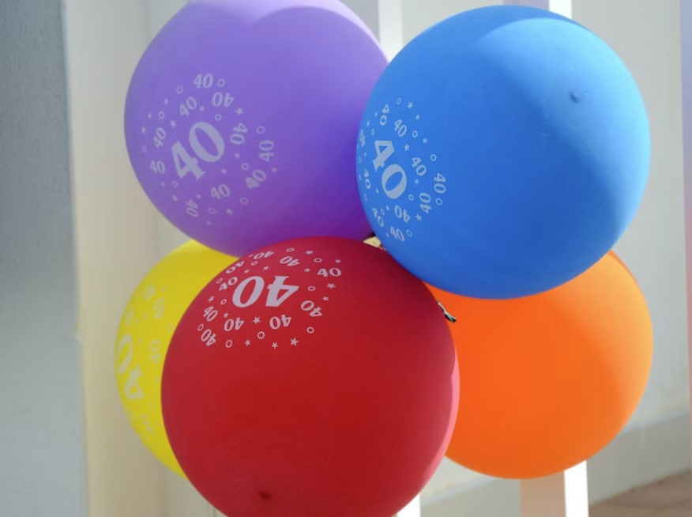
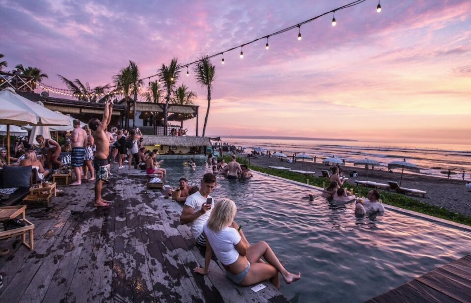
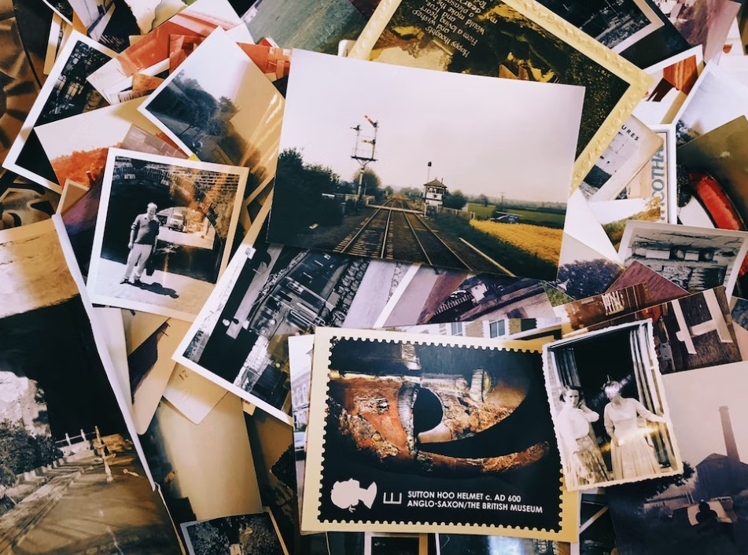

This article has been written and researched by our expert Loveable through a precise methodology. [Learn more about our methodology](https://avada.io/loveable/our-methodological.html)

[Loveable](https://avada.io/loveable/) > [Blog](https://avada.io/loveable/blog/) > [Family](https://avada.io/loveable/family/)

# 40th Birthday Party Ideas: Ultimate Guide to Unique and Memorable Occasion

Written by [Rose Bryne](https://avada.io/loveable/author/rose/) Last Updated on September 22, 2023

- [Theme-based Party Ideas for 40th Birthday: Retro ’80s Party Celebration](https://avada.io/loveable/blog/40th-birthday-party-ideas/#wp-block-heading-2-4)
    - [Party Decorations](https://avada.io/loveable/blog/40th-birthday-party-ideas/#wp-block-heading-3-5) 
    - [Dress Code](https://avada.io/loveable/blog/40th-birthday-party-ideas/#wp-block-heading-3-8) 
    - [Party Activities](https://avada.io/loveable/blog/40th-birthday-party-ideas/#wp-block-heading-3-10) 
- [40th Birthday Party Ideas: Funny 40th Birthday Gifts](https://avada.io/loveable/blog/40th-birthday-party-ideas/#wp-block-heading-2-16)
- [Destination Ideas 40th Birthday Party: Beach Gateway](https://avada.io/loveable/blog/40th-birthday-party-ideas/#wp-block-heading-2-20)
    - [Location](https://avada.io/loveable/blog/40th-birthday-party-ideas/#wp-block-heading-3-21)
    - [Beach activities](https://avada.io/loveable/blog/40th-birthday-party-ideas/#wp-block-heading-3-23)
- [Surprise Party Ideas: Collage of Memories](https://avada.io/loveable/blog/40th-birthday-party-ideas/#wp-block-heading-2-33)
    - [Gather photos and memorable moments from the celebrant’s life](https://avada.io/loveable/blog/40th-birthday-party-ideas/#wp-block-heading-3-34)
    - [Create a collage or slideshow to showcase the journey and milestones](https://avada.io/loveable/blog/40th-birthday-party-ideas/#wp-block-heading-3-37)
    - [Arrange a surprise gathering where friends and family can reminisce and celebrate together](https://avada.io/loveable/blog/40th-birthday-party-ideas/#wp-block-heading-3-39)
- [In Conclusion](https://avada.io/loveable/blog/40th-birthday-party-ideas/#wp-block-heading-2-42) 

Are you ready to celebrate a milestone birthday? Turning 40 is a momentous occasion, and it calls for a celebration like no other. In this ultimate guide to unique and memorable 40th birthday party ideas, we’ve got you covered with inspiring suggestions to make this special day unforgettable. So, let’s dive in and discover how to create an extraordinary experience that will leave everyone talking for years to come!

Looking for the perfect way to commemorate this significant milestone? We’ve compiled a collection of the most exciting **40th birthday party ideas** to help you plan an unforgettable celebration. From thrilling adventure outings to elegant themed parties, there’s something to suit every personality and style. Whether you’re seeking a grand soirée or an intimate gathering with loved ones, we’ve got the inspiration you need to make your 40th birthday a truly extraordinary event.

By following our ultimate guide to unique and memorable 40th birthday party ideas, you’ll be well-equipped to plan an extraordinary celebration that reflects your personality and creates lasting memories.

## **Theme-based Party Ideas for 40th Birthday: Retro ’80s Party Celebration**

### **Party Decorations** 

To transport your guests back to the vibrant era of the ’80s, incorporate eye-catching decorations that capture the essence of the decade. Use neon colors like hot pink, electric blue, and fluorescent green to create an energetic atmosphere. Hang cassette tapes as wall decor and scatter Rubik’s Cubes on tables as nostalgic centerpieces. Consider adding retro arcade game posters or album covers from popular ’80s artists to enhance the ambiance.

### **Dress Code** 

Encourage your guests to embrace the fashion trends of the ’80s by suggesting a dress code that reflects the iconic styles of the era. Invite them to wear leg warmers, acid-washed jeans, big hair, and vibrant clothing. Provide costume accessories such as neon-colored sunglasses, slap bracelets, and jelly shoes to add an extra touch of authenticity. This will not only enhance the overall party experience but also provide an opportunity for guests to have fun and get creative with their outfits.

### **Party Activities** 

Organize a variety of engaging activities that will immerse your guests in the spirit of the ’80s:

- **’80s Trivia:** Test your guests’ knowledge of ’80s pop culture, movies, music, and historical events by hosting an entertaining trivia game. Prepare a set of questions in advance or use online resources to generate trivia questions. Offer prizes for the guests who answer the most questions correctly.

- **Dance-offs:** Create a dance floor where guests can show off their best ’80s dance moves. Prepare a playlist of popular ’80s hits, including songs by artists like Michael Jackson, Madonna, and Prince. Encourage friendly dance-offs or organize a dance competition to get everyone involved and energized.

- **Karaoke Sessions:** Set up a karaoke station equipped with a selection of classic ’80s songs. Allow guests to choose their favorite tunes and sing their hearts out. Provide lyric sheets or a screen with scrolling lyrics to help everyone participate. This activity will surely bring out the fun and nostalgic memories associated with the music of the ’80s.

By incorporating these elements into your retro ’80s party, you’ll create an immersive experience that transports guests back in time. They’ll have the opportunity to relive the vibrant era, embrace the fashion trends, and enjoy engaging activities that celebrate the pop culture of the ’80s.

## **40th Birthday Party Ideas: Funny 40th Birthday Gifts**

When it comes to celebrating a milestone like a 40th birthday, finding the perfect gift can be a delightful challenge. If you’re looking to add an extra touch of laughter and joy to the celebration, funny 40th birthday gifts are a fantastic choice. In this guide on 40th birthday party ideas, we’ll explore a variety of humorous and lighthearted gift ideas that are sure to bring smiles and laughter to the birthday person’s face. Whether you’re planning a surprise party or simply want to present a memorable gift, these funny ideas will add an element of fun and playfulness to the celebration. So, let’s dive in and discover some hilarious and unforgettable gifts to make the 40th birthday a truly memorable occasion!

**Check Out The Collection Now**: [_Funny 40th Birthday Gifts_](https://avada.io/loveable/funny-40th-birthday-gifts/)

## **Destination Ideas 40th Birthday Party: Beach Gateway**

### **Location**

Select a picturesque beach destination that offers a variety of activities and accommodation options. Consider factors such as accessibility, scenic beauty, and availability of amenities. Popular beach destinations like Bali, Maldives, or the Caribbean are excellent choices for a memorable celebration.

### **Beach activities**

Plan an array of beach activities to keep your guests entertained and create lasting memories:

- **Beach games:** Organize friendly competitions such as beach volleyball, frisbee, or sandcastle-building contests. These activities promote interaction and add a playful atmosphere to the celebration.

- **Water sports:** Offer a range of thrilling water sports such as snorkeling, jet skiing, or paddleboarding. Arrange for equipment rental or hire professional instructors to ensure a safe and enjoyable experience for all participants.

- **Bonfires:** Arrange a beach bonfire during the evening, complete with cozy seating, blankets, and marshmallows for toasting. This provides a perfect opportunity for guests to gather around, share stories, and create a warm and intimate atmosphere.

- **Relaxation:** Balance the energetic beach activities with opportunities for relaxation and rejuvenation:

- **Spa treatments:** Arrange for professional masseuses or spa therapists to offer soothing massages, facials, or body treatments to help guests unwind and indulge in a pampering experience.

- **Yoga sessions:** Hire a certified yoga instructor to lead invigorating yoga sessions on the beach. This provides a serene and peaceful ambiance, allowing guests to connect with nature, practice mindfulness, and find inner balance.

By organizing a beach getaway for your 40th birthday party, you create an idyllic setting where guests can enjoy the sun, sand, and sea. The combination of thrilling beach activities, opportunities for relaxation, and stunning natural surroundings will make the celebration truly memorable.

## **Surprise Party Ideas: Collage of Memories**

### **Gather photos and memorable moments from the celebrant’s life**

Reach out to the celebrant’s close friends, family members, and colleagues to collect photographs and cherished memories that span the celebrant’s life. Request pictures from different stages, including childhood, teenage years, early adulthood, and recent milestones. Ensure to gather a diverse range of photos that capture significant moments and evoke nostalgic feelings.

### **Create a collage or slideshow to showcase the journey and milestones**

Once you have gathered a collection of photographs, use them to create a heartfelt and visually appealing collage or slideshow. There are various tools and software available online that make it easy to arrange photos, add captions or descriptions, and incorporate creative transitions or effects. Consider arranging the photos chronologically or theme-based, such as family, friends, travel, or professional achievements, to tell a captivating story.

### **Arrange a surprise gathering where friends and family can reminisce and celebrate together**

Plan a surprise party where friends and family can come together to celebrate the milestone and share their heartfelt wishes. Coordinate with the attendees to ensure their presence at the surprise gathering. Select a suitable venue, whether it’s the celebrant’s home, a favorite restaurant, or a rented event space. Decorate the venue with personalized touches, incorporating elements from the celebrant’s life and interests. Display the collage or slideshow prominently for all to see and reflect upon the cherished memories.

During the surprise gathering, reveal the collage or slideshow as a special tribute to the celebrant’s life. Allow everyone to enjoy the nostalgic journey and encourage guests to share their own stories and memories. The gathering provides an opportunity for loved ones to reminisce, bond, and celebrate significant milestone together, creating lasting memories for the birthday person and all attendees.

## **In Conclusion** 

As you embark on organizing the **40th birthday celebration**, be creative, thoughtful, and considerate of the celebrant’s desires. Whether it’s a surprise gathering, a themed party, or a destination getaway, make it a celebration that reflects their unique story and showcases their importance in your lives. Happy planning and best wishes for an unforgettable and meaningful 40th birthday party!

- [Theme-based Party Ideas for 40th Birthday: Retro ’80s Party Celebration](https://avada.io/loveable/blog/40th-birthday-party-ideas/#wp-block-heading-2-4)
    - [Party Decorations](https://avada.io/loveable/blog/40th-birthday-party-ideas/#wp-block-heading-3-5) 
    - [Dress Code](https://avada.io/loveable/blog/40th-birthday-party-ideas/#wp-block-heading-3-8) 
    - [Party Activities](https://avada.io/loveable/blog/40th-birthday-party-ideas/#wp-block-heading-3-10) 
- [40th Birthday Party Ideas: Funny 40th Birthday Gifts](https://avada.io/loveable/blog/40th-birthday-party-ideas/#wp-block-heading-2-16)
- [Destination Ideas 40th Birthday Party: Beach Gateway](https://avada.io/loveable/blog/40th-birthday-party-ideas/#wp-block-heading-2-20)
    - [Location](https://avada.io/loveable/blog/40th-birthday-party-ideas/#wp-block-heading-3-21)
    - [Beach activities](https://avada.io/loveable/blog/40th-birthday-party-ideas/#wp-block-heading-3-23)
- [Surprise Party Ideas: Collage of Memories](https://avada.io/loveable/blog/40th-birthday-party-ideas/#wp-block-heading-2-33)
    - [Gather photos and memorable moments from the celebrant’s life](https://avada.io/loveable/blog/40th-birthday-party-ideas/#wp-block-heading-3-34)
    - [Create a collage or slideshow to showcase the journey and milestones](https://avada.io/loveable/blog/40th-birthday-party-ideas/#wp-block-heading-3-37)
    - [Arrange a surprise gathering where friends and family can reminisce and celebrate together](https://avada.io/loveable/blog/40th-birthday-party-ideas/#wp-block-heading-3-39)
- [In Conclusion](https://avada.io/loveable/blog/40th-birthday-party-ideas/#wp-block-heading-2-42) 

### [Rose Bryne](https://avada.io/loveable/author/rose/)

Hi, I'm Rose! I love animals and spending time with kids. At Loveable, I help people find unique gifts for special occasions like Valentine's Day, housewarmings, and graduations. I enjoy finding gifts for kids, teens, and animal lovers that match their interests and personalities. Making gift-giving a pleasant experience is my priority. Let me assist you in finding the perfect gift!

- [Twitter](https://twitter.com/intent/tweet)
- [Facebook](https://www.facebook.com/sharer/sharer.php)
- [instagram](https://avada.io/loveable/blog/40th-birthday-party-ideas/)
- [pinterest](https://www.pinterest.com/loveablellc/)

## Related Posts

[### 30 Best 4 Year Old Birthday Party Ideas For A Memorable Celebration](https://avada.io/loveable/blog/4-year-old-birthday-party-ideas/) 

[

### 16th Birthday Party Ideas to Make an Unforgettable Day

](https://avada.io/loveable/blog/16th-birthday-party-ideas/)

[

### 150+ Inspirational Birthday Quotes to Spread Joy on Special Day

](https://avada.io/loveable/blog/inspirational-birthday-quotes/)

[

### 160+ Birthday Wishes for Wife to Express Eternal Love

](https://avada.io/loveable/blog/birthday-wishes-for-wife/)

[### 90+ Heart Touching Birthday Wishes for Niece to Make Her Day Extra Special](https://avada.io/loveable/blog/birthday-wishes-for-niece/)
