This article has been written and researched by our expert Loveable through a precise methodology. [Learn more about our methodology](https://avada.io/loveable/our-methodological.html)

[Loveable](https://avada.io/loveable/) > [Blog](https://avada.io/loveable/blog/) > [Holiday](https://avada.io/loveable/holiday/)

# 45 Christmas House Decorations: Adding Sparkle to Your Holiday Home

Written by [Blake Simpson](https://avada.io/loveable/author/blake/) Last Updated on September 15, 2023

- [45 Festive Christmas House Decorations for a Joyful Home](https://avada.io/loveable/blog/christmas-house-decorations/#wp-block-heading-2-2)
    - [10 Outdoor Christmas House Decoration Ideas](https://avada.io/loveable/blog/christmas-house-decorations/#wp-block-heading-3-3)
        - [1\. Classic Wreath](https://avada.io/loveable/blog/christmas-house-decorations/#wp-block-heading-4-4)
        - [2\. Twinkle Fairy Christmas String Lights](https://avada.io/loveable/blog/christmas-house-decorations/#wp-block-heading-4-7)
        - [3\. Luminary Paper Bags with Flameless Tea Lights](https://avada.io/loveable/blog/christmas-house-decorations/#wp-block-heading-4-10)
        - [4\. Giant Inflatables](https://avada.io/loveable/blog/christmas-house-decorations/#wp-block-heading-4-13)
        - [5\. Snowflake Cutouts](https://avada.io/loveable/blog/christmas-house-decorations/#wp-block-heading-4-16)
        - [6\. Christmas Tinsel Garland](https://avada.io/loveable/blog/christmas-house-decorations/#wp-block-heading-4-19)
        - [7\. Pathway Markers](https://avada.io/loveable/blog/christmas-house-decorations/#wp-block-heading-4-22) 
        - [8\. Lighted Trees](https://avada.io/loveable/blog/christmas-house-decorations/#wp-block-heading-4-25)
        - [9\. Nutcracker Display](https://avada.io/loveable/blog/christmas-house-decorations/#wp-block-heading-4-28)
        - [10\. Festive Mailbox](https://avada.io/loveable/blog/christmas-house-decorations/#wp-block-heading-4-31)
    - [10 Indoor Christmas House Decoration Ideas](https://avada.io/loveable/blog/christmas-house-decorations/#wp-block-heading-3-34)
        - [1\. Christmas Tree](https://avada.io/loveable/blog/christmas-house-decorations/#wp-block-heading-4-35)
        - [2\. Wooden Gift Box](https://avada.io/loveable/blog/christmas-house-decorations/#wp-block-heading-4-38)
        - [3\. Snowflake Hanging Ornament with LED Lights](https://avada.io/loveable/blog/christmas-house-decorations/#wp-block-heading-4-41)
        - [4\. Christmas Village Sets LED Lights](https://avada.io/loveable/blog/christmas-house-decorations/#wp-block-heading-4-44)
        - [5\. Staircase Garland](https://avada.io/loveable/blog/christmas-house-decorations/#wp-block-heading-4-47)
        - [6\. Candle Arrangements Holder](https://avada.io/loveable/blog/christmas-house-decorations/#wp-block-heading-4-50)
        - [7\. Christmas Window Lights Decorations](https://avada.io/loveable/blog/christmas-house-decorations/#wp-block-heading-4-53)
        - [8\. Christmas String Lights](https://avada.io/loveable/blog/christmas-house-decorations/#wp-block-heading-4-56)
        - [9\. Festive Pillows Cover](https://avada.io/loveable/blog/christmas-house-decorations/#wp-block-heading-4-59)
        - [10\. Table Settings](https://avada.io/loveable/blog/christmas-house-decorations/#wp-block-heading-4-62)
    - [10 DIY Christmas House Decoration Ideas](https://avada.io/loveable/blog/christmas-house-decorations/#wp-block-heading-3-65)
        - [1\. Pinecone Ornaments](https://avada.io/loveable/blog/christmas-house-decorations/#wp-block-heading-4-66)
        - [2\. Homemade Wreath](https://avada.io/loveable/blog/christmas-house-decorations/#wp-block-heading-4-69)
        - [3\. Paper Snowflakes DIY](https://avada.io/loveable/blog/christmas-house-decorations/#wp-block-heading-4-72)
        - [4\. Christmas Tree DIY KIT](https://avada.io/loveable/blog/christmas-house-decorations/#wp-block-heading-4-75)
        - [5\. DIY Christmas ornaments](https://avada.io/loveable/blog/christmas-house-decorations/#wp-block-heading-4-78)
        - [6\. Mason Jar Lanterns](https://avada.io/loveable/blog/christmas-house-decorations/#wp-block-heading-4-81)
        - [7\. Felt Tree Ornaments](https://avada.io/loveable/blog/christmas-house-decorations/#wp-block-heading-4-84)
        - [8\. DYI Christmas Banners](https://avada.io/loveable/blog/christmas-house-decorations/#wp-block-heading-4-87)
        - [9\. Holiday Card Display](https://avada.io/loveable/blog/christmas-house-decorations/#wp-block-heading-4-90)
        - [10\.  DIY Christmas String Art Kit Large Wood Tag](https://avada.io/loveable/blog/christmas-house-decorations/#wp-block-heading-4-93)
    - [10 Kid-Friendly Christmas House Decoration Ideas](https://avada.io/loveable/blog/christmas-house-decorations/#wp-block-heading-3-96)
        - [1\. Gingerbread House Display](https://avada.io/loveable/blog/christmas-house-decorations/#wp-block-heading-4-97)
        - [2\. Santa’s Footprints](https://avada.io/loveable/blog/christmas-house-decorations/#wp-block-heading-4-100)
        - [3\. DIY Advent Calendar](https://avada.io/loveable/blog/christmas-house-decorations/#wp-block-heading-4-103)
        - [4\. Christmas Bedding Set](https://avada.io/loveable/blog/christmas-house-decorations/#wp-block-heading-4-106)
        - [5\. Pink Christmas Blackout Curtains](https://avada.io/loveable/blog/christmas-house-decorations/#wp-block-heading-4-109)
        - [6\. Toy Train Display](https://avada.io/loveable/blog/christmas-house-decorations/#wp-block-heading-4-112)
        - [7\. Paper Chains](https://avada.io/loveable/blog/christmas-house-decorations/#wp-block-heading-4-115)
        - [8\. Felt Reindeer Ornament](https://avada.io/loveable/blog/christmas-house-decorations/#wp-block-heading-4-118)
        - [9\. Christmas Piggy Bank](https://avada.io/loveable/blog/christmas-house-decorations/#wp-block-heading-4-121)
        - [10\. North Pole Direction Sign](https://avada.io/loveable/blog/christmas-house-decorations/#wp-block-heading-4-124)
- [Bottom Line](https://avada.io/loveable/blog/christmas-house-decorations/#wp-block-heading-2-130)

The holiday season brings joy, warmth, and a sense of togetherness. One of the most cherished traditions during this time is decorating your house for Christmas. With twinkling lights, festive wreaths, and ornaments galore, the holiday decorations light up your home and create an enchanting ambience that captures the season’s spirit. In this article, we’ll explore various **Christmas house decoration** ideas that will help you turn your humble abode into a magical winter wonderland.

## **45 Festive Christmas House Decorations for a Joyful Home**

### **10 Outdoor Christmas House Decoration Ideas**

#### **1\. [Classic Wreath](https://www.amazon.com/Bibelot-Farmhouse-Christmas-Festival-Decorations/dp/B08BC3Z1CM/)**

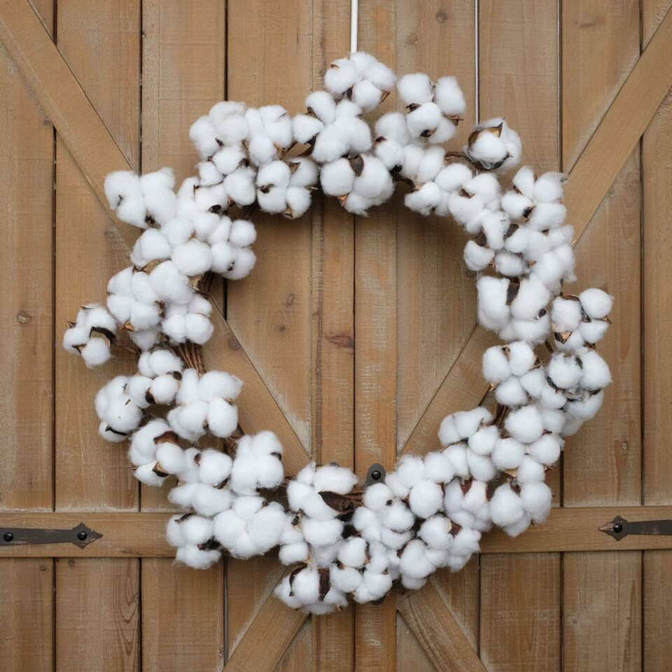

This beautiful wreath adds a touch of natural beauty to your house with its meticulously placed natural cotton bolls on a solid frame. This wreath exudes warmth and simplicity, making it ideal for farmhouse-style decor. It is a welcoming focal point for any season.

#### **2\. [Twinkle Fairy Christmas String Lights](https://www.amazon.com/JMEXSUSS-Christmas-Wedding-Decoration-Approved/dp/B07C4RGRVT/)**

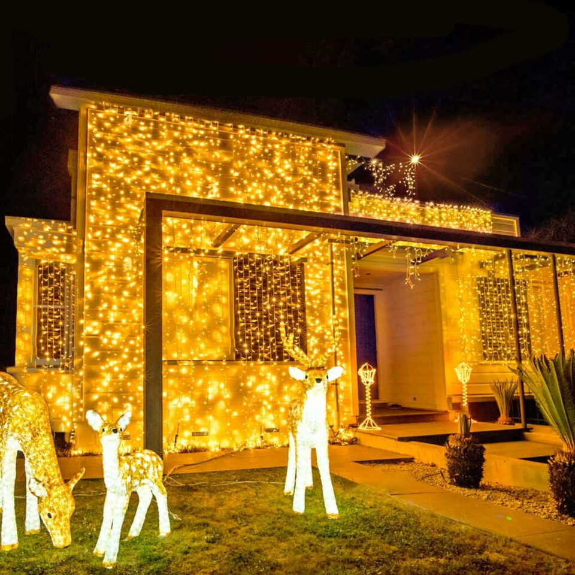

These captivating Twinkle Fairy Christmas String Lights, spark the holiday mood. These lights spin an enchanted web of wonder and joy, like a constellation of stars transported to Earth. They fill your room with an ethereal radiance that dances and shimmers when tastefully draped or hanging. 

#### **3\. [Luminary Paper Bags with Flameless Tea Lights](https://www.amazon.com/Flameless-Christmas-Luminaries-Halloween-Thanksgiving/dp/B0B49DK4TT/)**

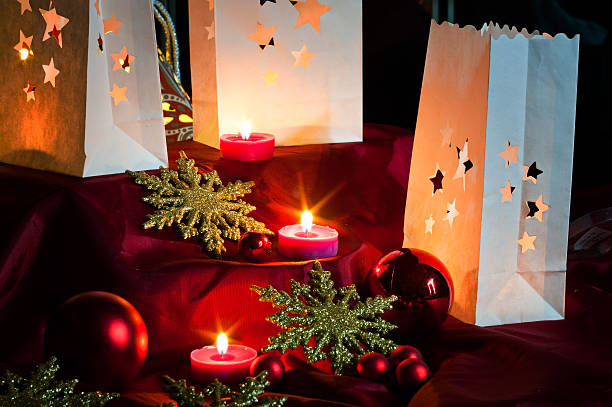

This Christmas, use our Luminary Paper Bags decorated with Flameless Tea Lights to reveal a magical world within your house. These magnificent bags are more than simply ornaments; they are woven visions of paper and light. As dusk comes, see how the intricate patterns come to life, producing a gentle, alluring glow that imbues your surroundings with a sense of wonder.

#### **4. [Giant Inflatables](https://www.amazon.com/Christmas-Outdoor-Inflatable-Decoration-Standing/dp/B07VRHN884/)**

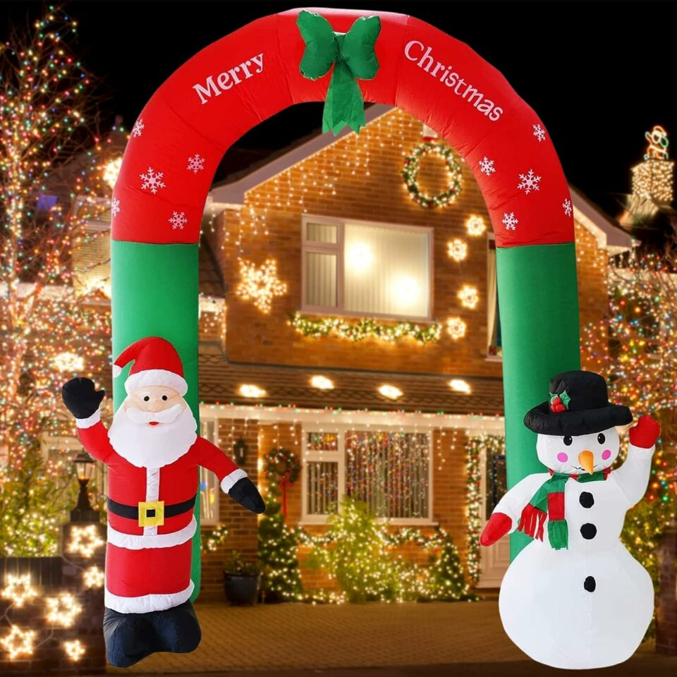

Our Santa and Snowman Outdoor Lighted Inflatable Decor will provide a dash of whimsy and festive happiness to any outdoor area. These inflatable creatures stand tall and proud, bringing the Christmas spirit to life in a whimsical and enjoyable manner.

#### **5\. [Snowflake Cutouts](https://www.amazon.com/VictoryStore-Outdoor-Decorations-Hanging-Snowflakes/dp/B08LP1Z6LD/)**

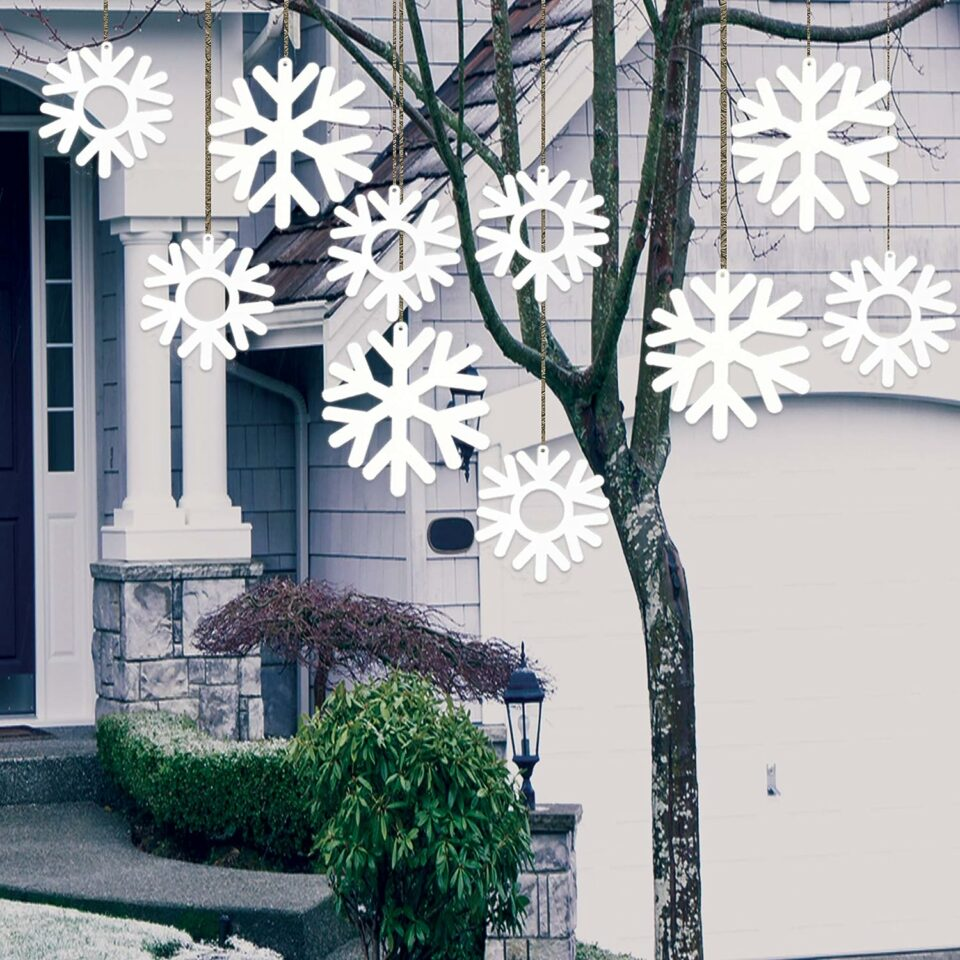

These carefully crafted cutouts gracefully decorate your outdoor space, filling it with the magic of a snowy wonderland like the gentle whispers of winter. Each snowflake is a one-of-a-kind work of art that was meticulously crafted, giving a touch of elegance and charm to your surroundings.

#### **6\. [Christmas Tinsel Garland](https://www.amazon.com/Christmas-Garland-Metallic-Decorations-Outdoor/dp/B0B8HP3864/)**

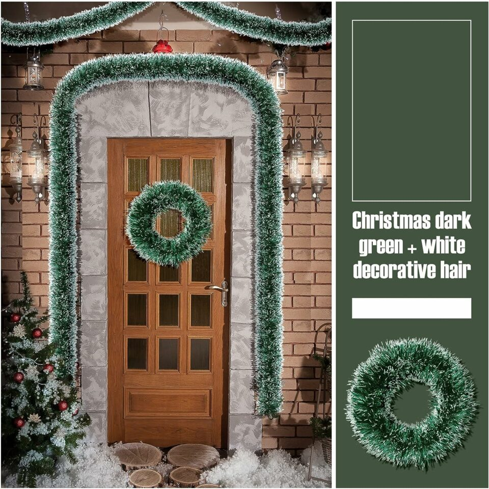

The Christmas Tinsel Garland adds a festive brightness that captures the spirit of Christmas, whether draped around your tree, mantel, or staircase. Its subtle shimmer swirls in the light, enchanting your room with a festive charm.

#### **7\. [Pathway Markers](https://www.amazon.com/Brite-Star-Peppermint-Candy-Pathmarker/dp/B00PIWJQ82/)** 

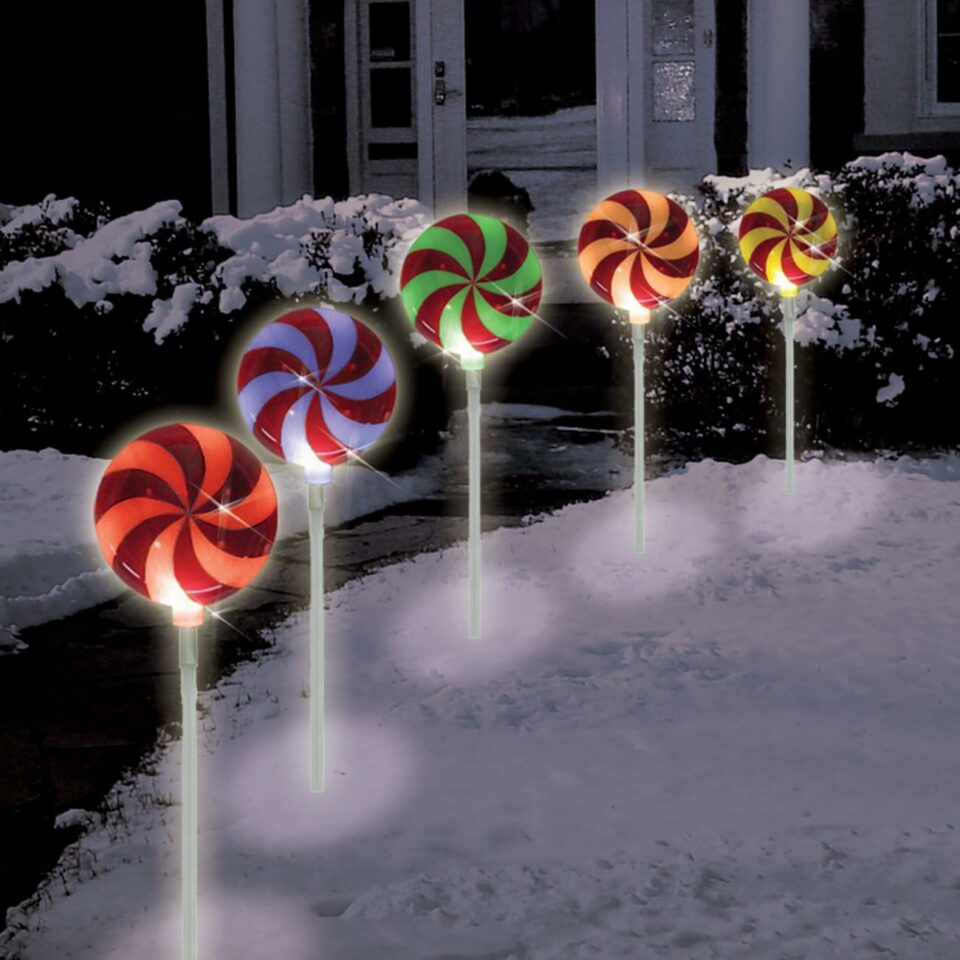

With the help of our Pathway Markers, direct them to festive delight. These endearing markers are more than simply lights; they are guiding lights for the holiday season that take you and your visitors on a merry tour. They cast a warm, inviting glow that turns your walkways into charming trails of light, creating a warm, inviting ambiance.

#### **8\. [Lighted Trees](https://www.amazon.com/Christmas-Certification-Collapsible-Spiraling-Decoration/dp/B0BB2C2PXD/)**

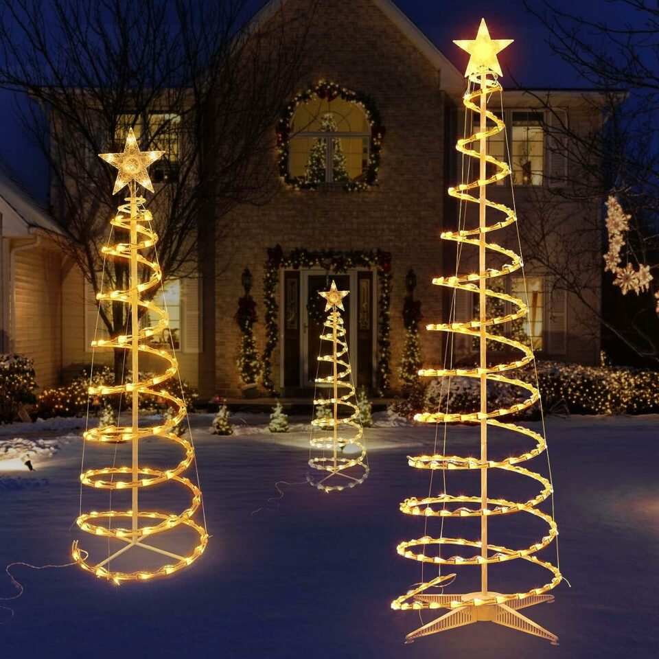

Spiral outside Lighted Christmas Tree will brighten your outside environment with its alluring beauty. These trees, which stand tall and elegantly, provide a dash of contemporary magic to your Christmas decorations. A snowy winter night’s aura is captured by the spiral pattern, which is a visual joy and infuses your surroundings with awe.

#### **9\. [Nutcracker Display](https://www.amazon.com/Nutcracker-Outdoor-Christmas-Decorations-Soldier/dp/B0BG5T56FX/)**

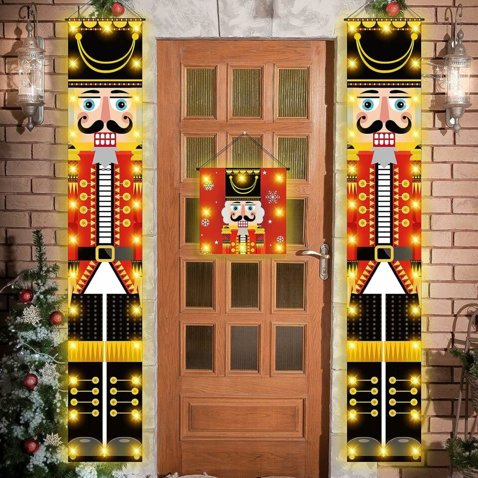

Witness the magic of the season through the fascinating lens of our Light-Up Nutcracker Banner, a masterpiece for the outdoors that combines innovation and tradition. Imagine the well-known Nutcracker being brought to life by delicate lighting.

#### **10\. [Festive Mailbox](https://www.amazon.com/Christmas-Buffalo-Mailbox-Magnetic-Standard/dp/B0BFHXKYS1/)**

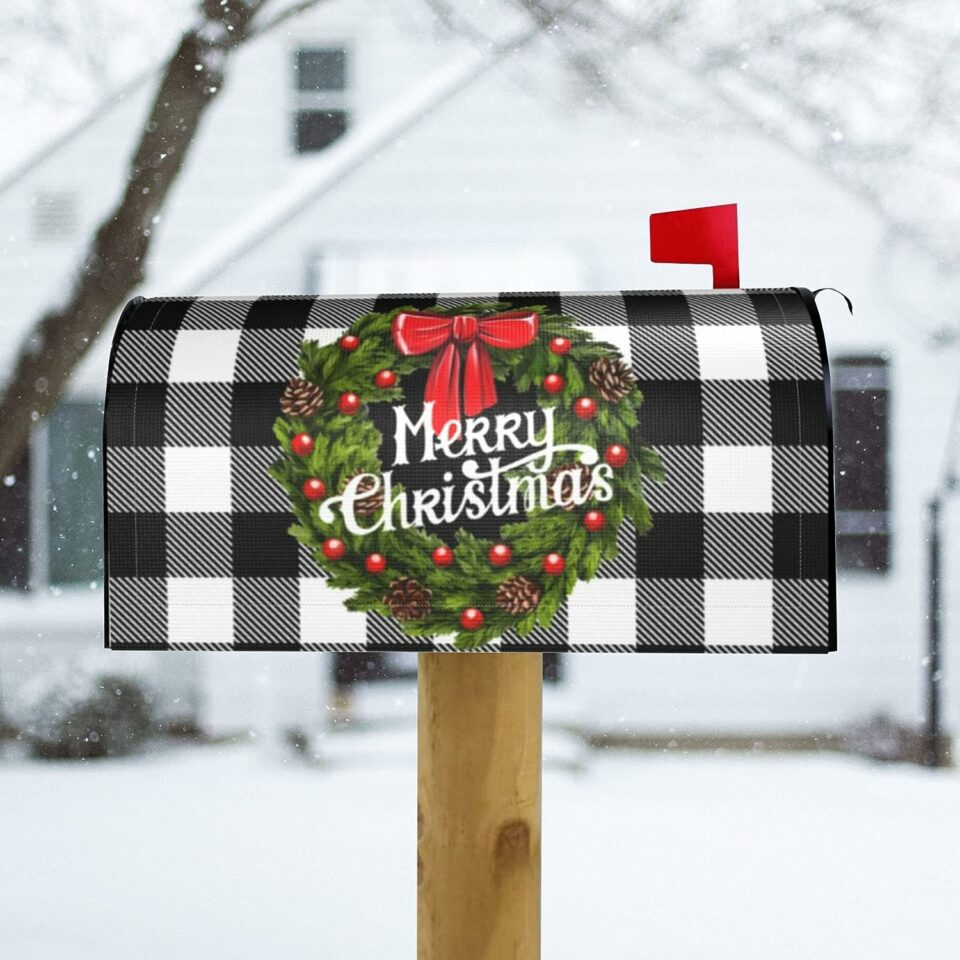

With this sweet touch, a practical item becomes a cheery conversation piece that embodies the spirit of the occasion. The Festive Mailbox gives your curb appeal a touch of Christmas enchantment and is decorated with traditional seasonal themes and a splash of whimsy.

### **10 Indoor Christmas House Decoration Ideas**

#### **1\. Christmas Tree**

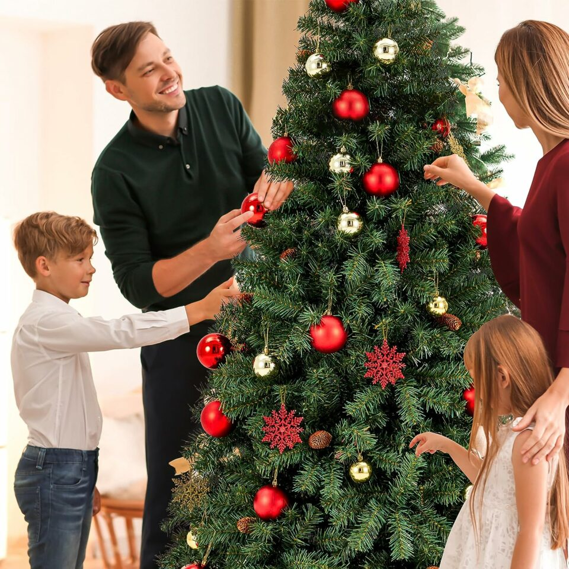

As we lovingly adorn our indoor sanctuary with the gorgeous Christmas tree, the comforting beauty of Christmas comes alive within the quiet nooks of our house. The tree becomes a living symbol of joy and unity with each meticulously hung ornament and glittering light, giving a gentle, welcoming glow that warms even the harshest winter evenings.

#### **2\. [Wooden Gift Box](https://www.amazon.com/Alpine-Corporation-3-Piece-Wooden-Christmas/dp/B0B359VTY8/)**

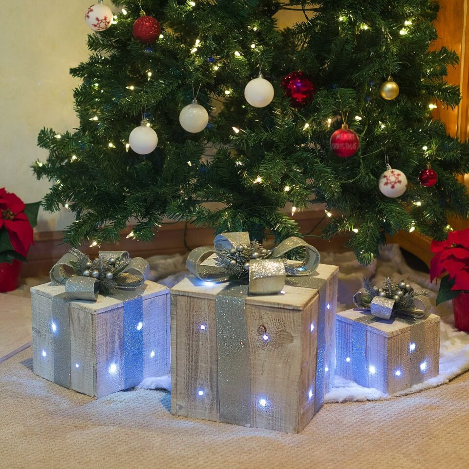

With our Wooden Gift Box Christmas Decor, you can participate in the thrill of gifting. Each meticulously created box exudes rustic charm and represents the real spirit of the season, with a combination of touching textures and authentic design. Allow this symbol of treasured memories and true charity to construct an amazing story of holiday delight in your home.

#### **3\. [Snowflake Hanging Ornament with LED Lights](https://www.amazon.com/Alpine-CRD100L-MC-Christmas-Snowflake-Multicolor/dp/B07HGTM53M/)**

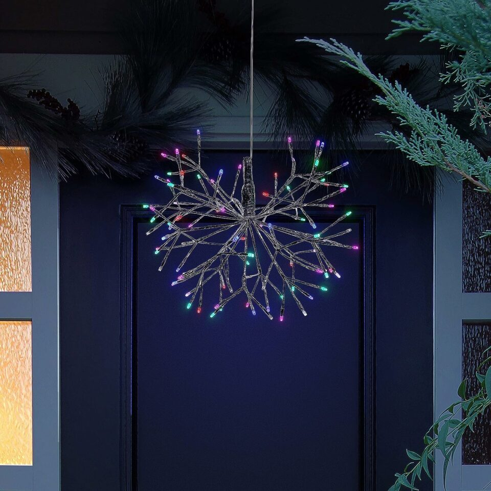

With our Snowflake Ornament with built-in LED lights, you can create a captivating environment. The combination of the frosty appeal of the ornament and the gentle illumination adds a touch of magic to your holiday décor.

#### **4. [Christmas Village Sets LED Lights](https://www.amazon.com/Yerliker-Christmas-Figurines-Operated-Collection/dp/B0BB2CSDFT/)**

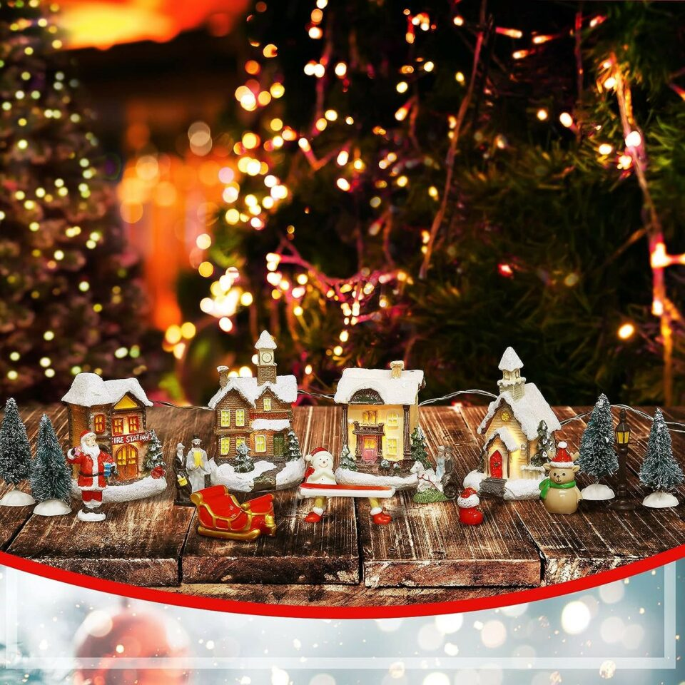

With this intriguing Christmas Village Sets LED Lights, you may enter a little world of seasonal magic. These sets are more than simply decorations; they’re portals to a fanciful world where the beauty of a small town coexists with the gleam of LED lights. 

#### **5\. Staircase Garland**

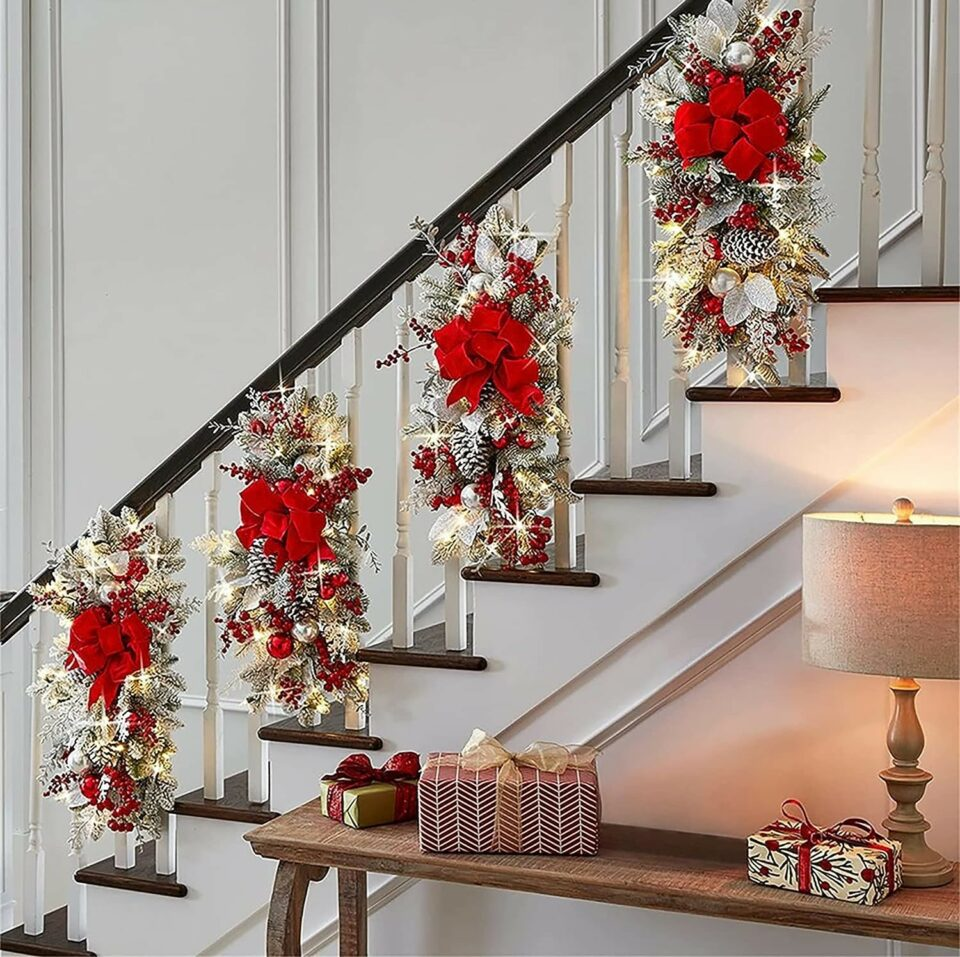

With this imaginative Christmas Staircase Garland, you can transform your staircase into a festive masterpiece. This garland is more than simply decoration; it’s a blank canvas for your imagination and a conduit for your feelings. You’re not simply beautifying your home when you creatively wrap it around the railing; you’re also creating a visual tale of seasonal warmth and shared delight. 

#### **6\. Candle Arrangements Holder**

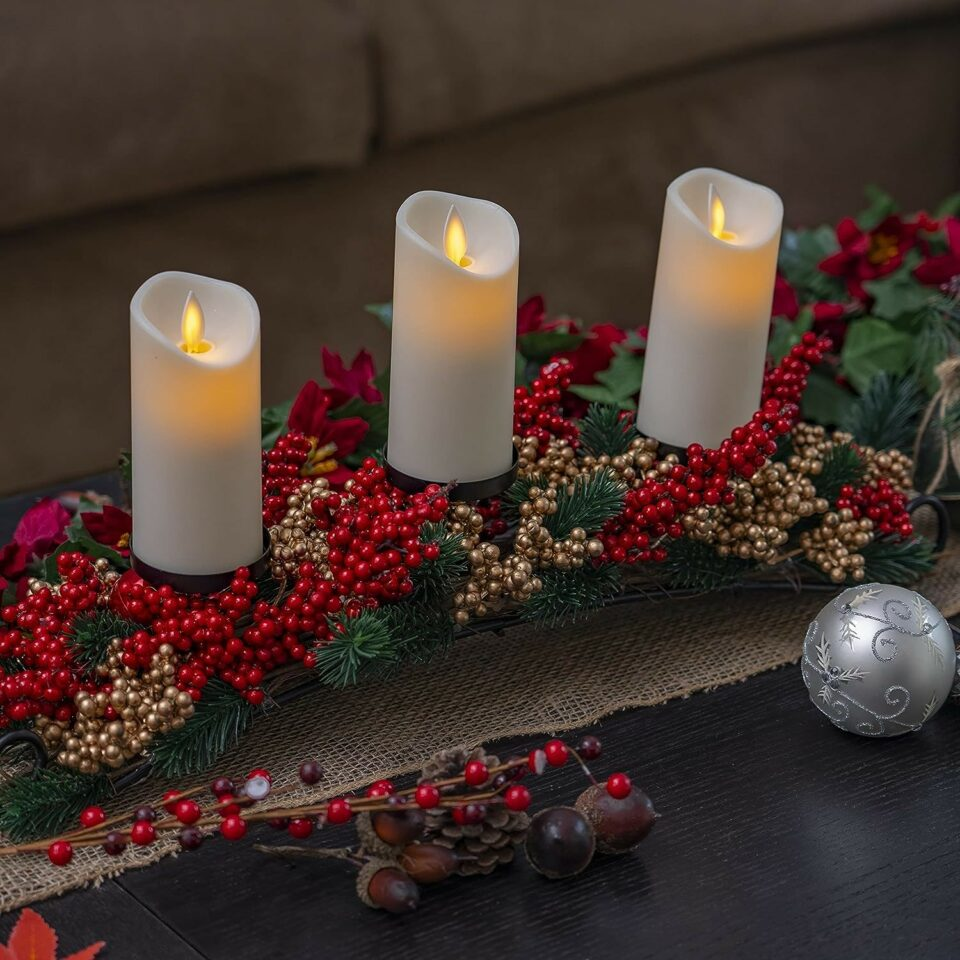

With these magnificent Christmas Candle Arrangement Holders, you can bring the spirit of the season to life. Each holder, handcrafted with skill, cradles the warm glow of candlelight, producing a delicate and lovely brilliance that dances over the room. These holders are more than simply items; they are emotional containers, conjuring memories of happy occasions. 

#### **7\. [Christmas Window Lights Decorations](https://www.amazon.com/LYUBASA-Christmas-Decorations-Battery-Fireplace/dp/B0B76TPVK6/)**

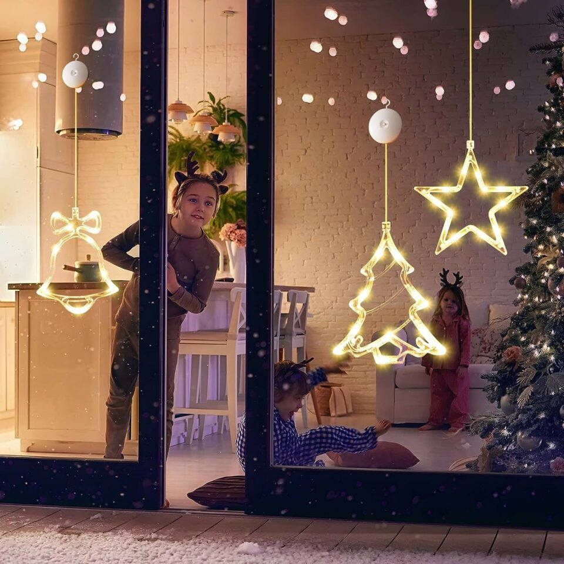

You may boost the sentimental appeal of the holiday season with our Christmas Window Lights Decorations. They cast a calm and inviting light that shines through the glass, charming hearts young and old alike. As the sun sets and these stunning lights dazzle, they create a Christmas paradise for everybody to enjoy. 

#### **8\. [Christmas String Lights](https://www.amazon.com/JEWHUN-Christmas-Waterproof-Halloween-Decoration-Safe/dp/B0C8BG87JD/)**

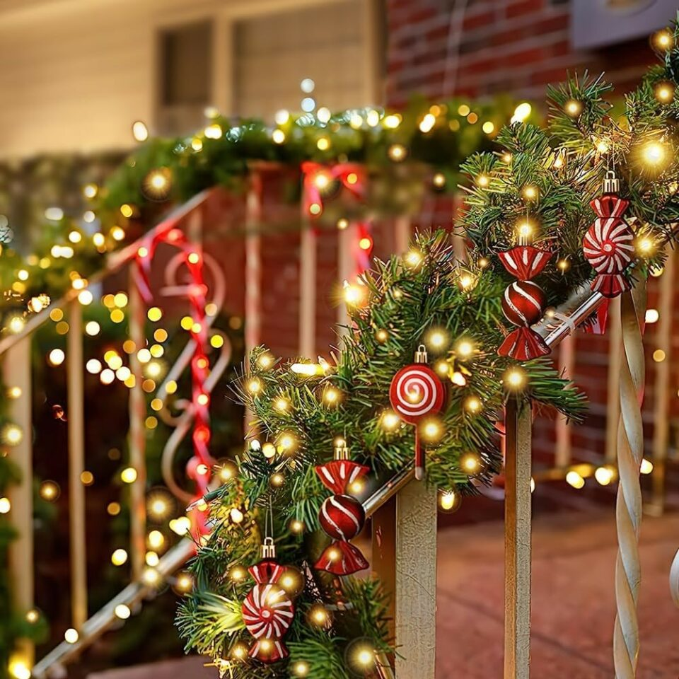

These Christmas String Lights are an embodiment of magic, glistening like stars dropped from the skies. As you softly drape them, a subtle waterfall of warmth and nostalgia floods the air, converting your room into a refuge of seasonal magic.

#### **9\. [Festive Pillows Cover](https://www.amazon.com/Boao-Christmas-Cushion-Reindeer-Decoration/dp/B07XRDL5ZC/)**

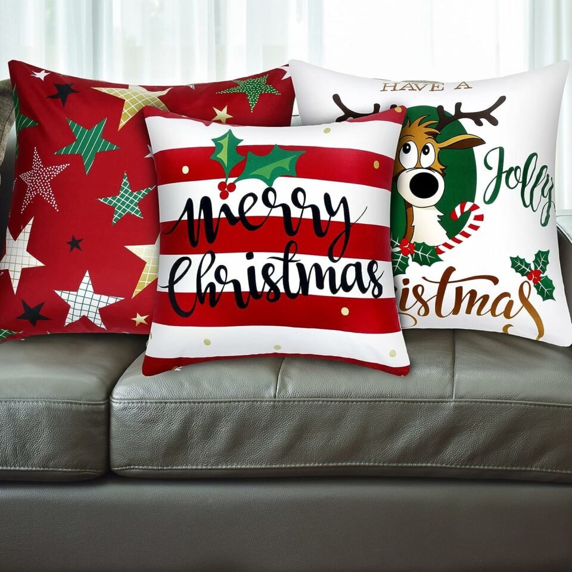

Infuse your house with the amazing charm of our Exclusively Unique Festive Christmas Pillow Covers. These covers are more than simply decorations; they are a symphony of emotions delicately woven throughout each thread. With each glimpse, they reveal a world of magic and nostalgia, crafted with extraordinary beauty.

#### **1[0\. Table Settings](https://www.amazon.com/Spode-Christmas-4-Piece-Place-Setting/dp/B00D774MHK/)**

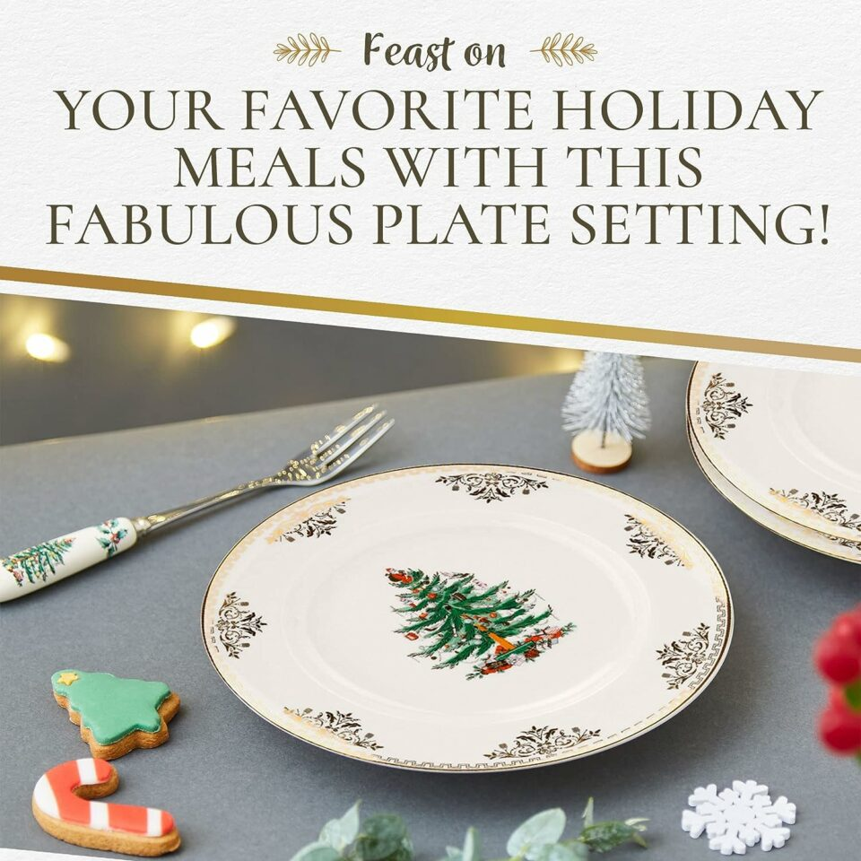

The Christmas Table Setting is a festive and beautiful dining set that captures the holiday mood. Each item is meticulously crafted with a classic Christmas tree design in dazzling gold, bringing a touch of elegance to your holiday table.

### **10 DIY Christmas House Decoration Ideas**

#### **1\. [Pinecone Ornaments](https://www.amazon.com/BESTOYARD-Christmas-Ornaments-Artificial-Decorations/dp/B08JLK1K7N/)**

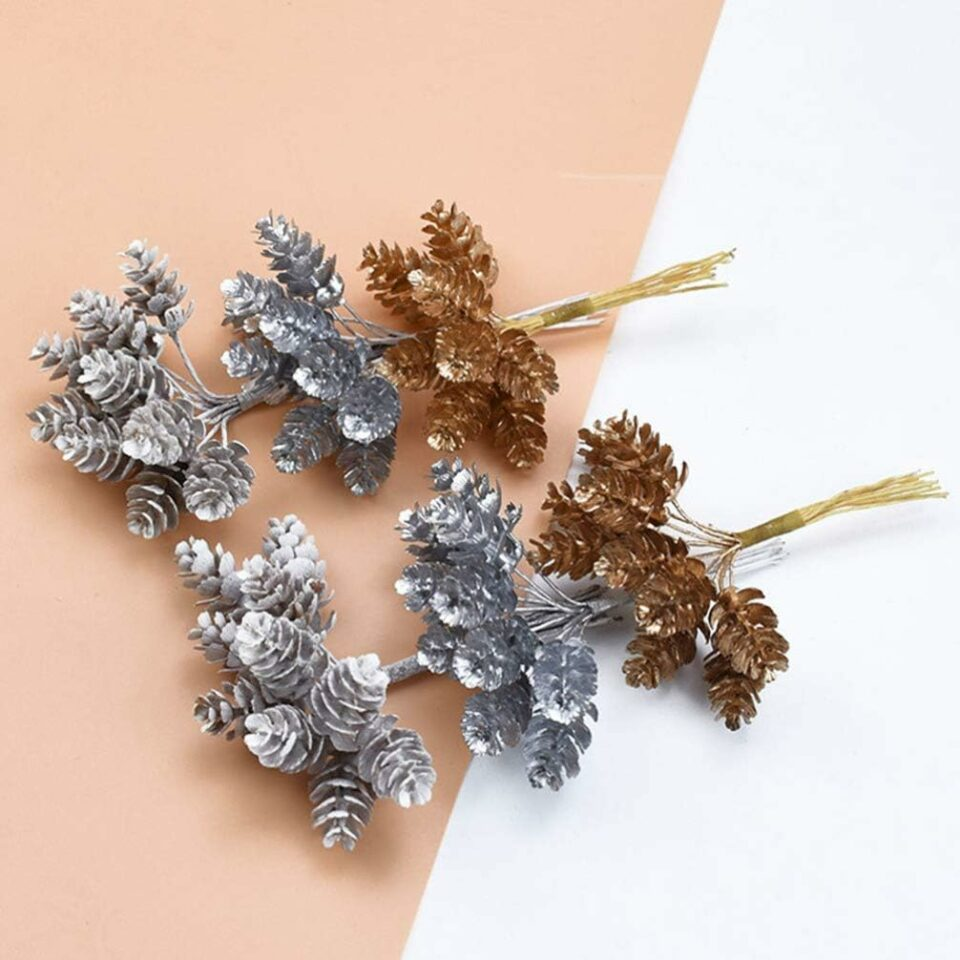

With our Christmas Pinecone Ornaments DIY kit, you can embrace the season’s touching tradition. Make your own ornaments to add personal significance and natural beauty to your Christmas decor. Pinecones, representing growth and perseverance, offer a touch of the outdoors, building a stronger connection to the festive spirit.

#### **2\. [Homemade Wreath](https://www.amazon.com/READY-LEARN-Christmas-Crafts-Decoration/dp/B0BH57KQ3P/)**

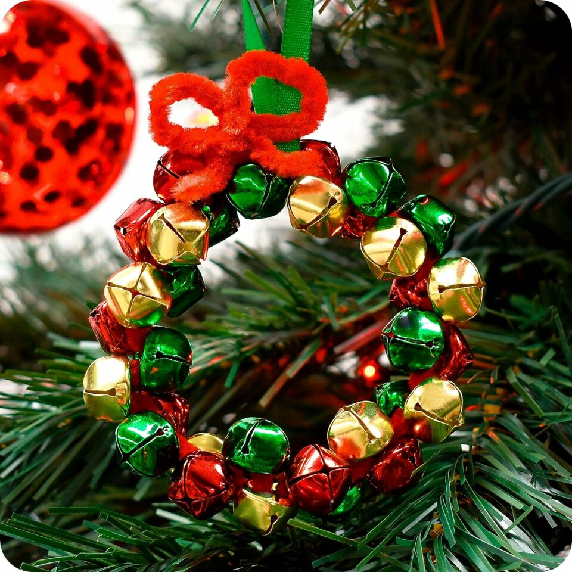

With our Homemade Wreath, you may reveal a sense of tradition and unity. This wreath is handcrafted and captures forever in its circular evergreen embrace, reflecting life’s cycles. Beyond aesthetics, it greets everyone who arrives with a fragrant greeting, filling your home with the enthusiasm of the season.

#### **3\. [Paper Snowflakes DIY](https://www.etsy.com/listing/481847452/snowmen-paper-snowflake-pattern-pdf)**

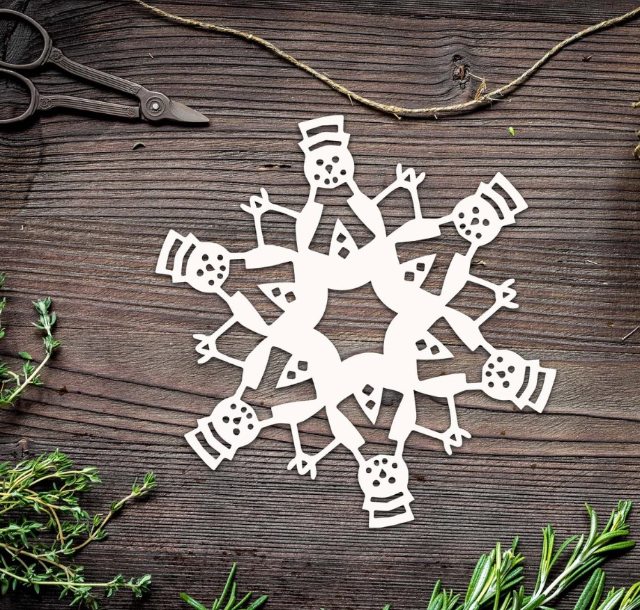

With our Paper Snowflakes DIY kit, you may unleash your inner artist. Explore the enchanting realm of winter crafts by creating delicate and elaborate paper snowflakes. This kit includes everything you need to bring the beauty of snow indoors, as well as the ability to customize your environment with unique designs. 

#### **4\. [Christmas Tree DIY KIT](https://www.etsy.com/listing/1086666178/macrame-christmas-tree-diy-kit-christmas)**

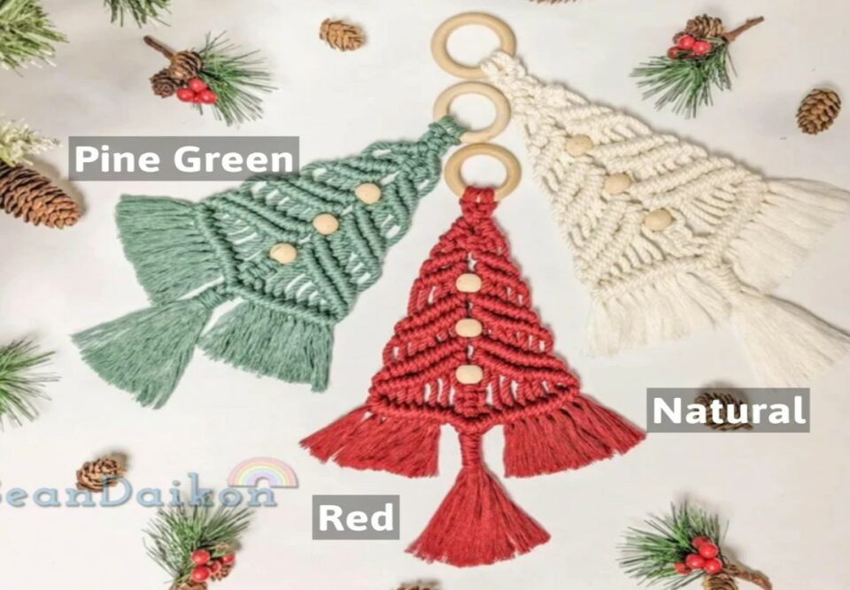

With the help of our DIY Christmas Tree Kit, discover the joy of the season. This kit is your pass to creating a unique work of art that captures the spirit of Christmas. Anything from the ornaments to the branches serves as a blank canvas for your artistic interpretation. Not only are you making a tree when you put it together, decorate it, and add your own flair to it, but you’re also making memories. 

#### **5\. [DIY Christmas ornaments](https://www.etsy.com/listing/882405102/diy-ornaments-christmas-craft-christmas)**

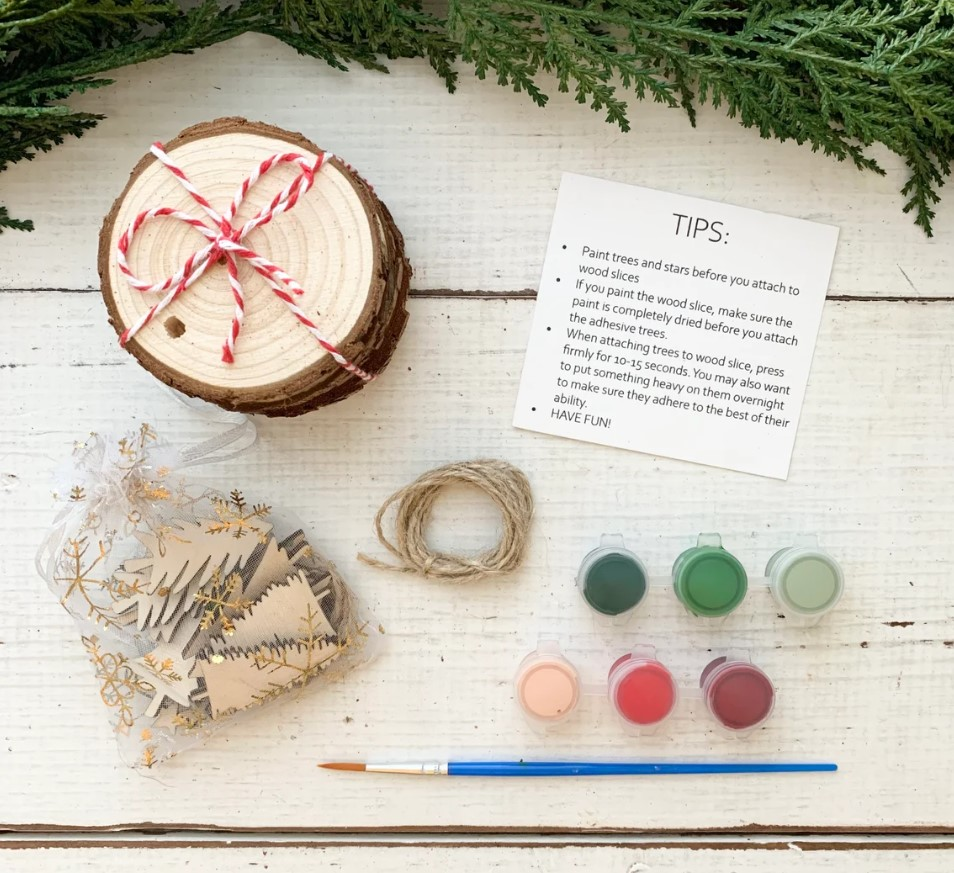

Experience the magic with our do-it-yourself Christmas ornaments, where meaning and creativity collide. Each piece is a painting of your joyous mood, with every hue and bead whispering a different narrative. They carry memories of creativity, joy, and the enchantment you bring to the season as they adorn your tree. 

#### **6\. [Mason Jar Lanterns](https://www.amazon.com/Bottle-Lights-Solar-Mason-Combo/dp/B0C8YMB6RS/)**

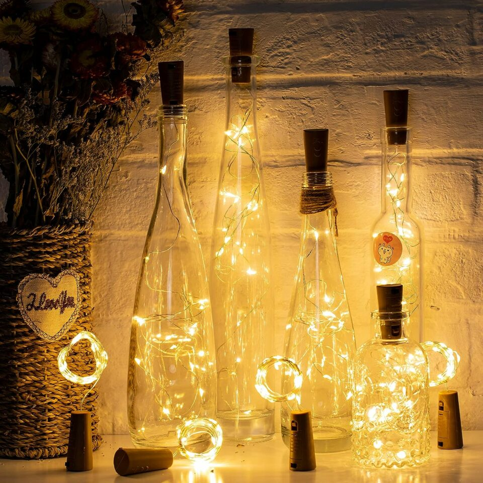

Mason jar lanterns are a favorite Christmas decoration due to their simplicity and elegance. They may be utilized indoors or outdoors and can be adorned in a number of ways to represent the Christmas season. The light from a mason jar lantern is frequently associated with hope and pleasure. The blazing flame symbolizes the warmth and comfort of the holiday season, while the glass jar symbolizes the purity and innocence of Christmas.

#### **7\. Felt Tree Ornaments**

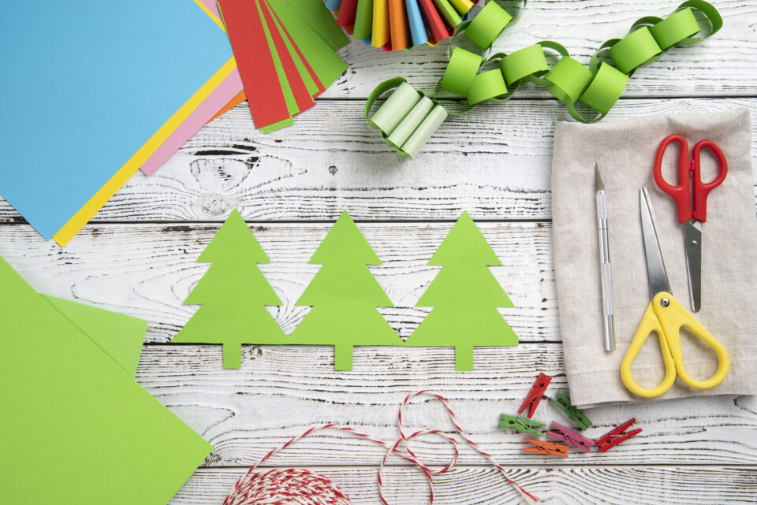

Felt tree ornaments are little ornaments made of felt fabric that are used to decorate Christmas trees throughout the holiday season. These decorations provide a charming and whimsical touch to Christmas trees. They are commonly used in conjunction with other ornaments, lights, and garlands to create a festive and magical ambiance. They may be hung from branches using strings or hooks. Felt tree decorations make excellent gifts or stocking stuffers since they may be personalized to the recipient’s tastes or hobbies.

#### **8\. [DYI Christmas Banners](https://www.amazon.com/Bottle-Lights-Solar-Mason-Combo/dp/B0C8YMB6RS/)**

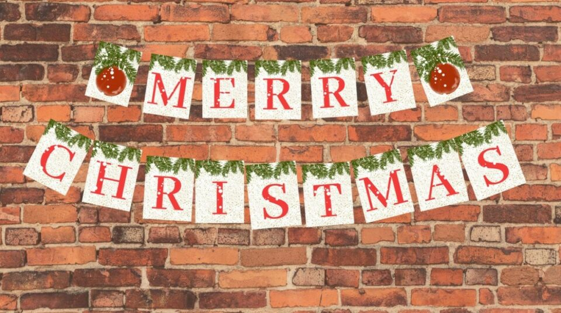

This holiday season, refresh your home decor with our DIY Christmas Banners. Unleash your creative side by making personalized banners that will brighten up your place. This kit includes everything you need to design and build attractive banners that reflect the spirit of the holidays. 

#### **9\. [Holiday Card Display](https://www.etsy.com/listing/1523273926/diy-card-kit-christmas-tree-cards-kit-to)**

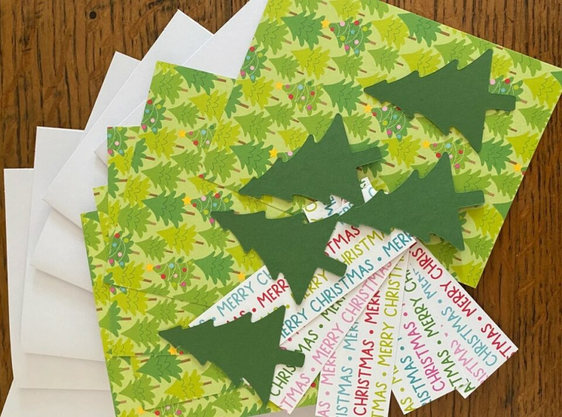

DIY Holiday Card Display is your gateway to transforming [Christmas cards](https://avada.io/loveable/personalized-christmas-cards/) into eye-catching décor. Allow your imagination to go wild as you create a customised artwork that not only displays loving wishes but also enhances your festive home ambiance. This kit is loaded with options, allowing you to create a one-of-a-kind display that combines purpose and appeal.

#### **10\.  [DIY Christmas String Art Kit Large Wood Tag](https://www.etsy.com/listing/564032416/diy-christmas-string-art-kit-large-wood)**

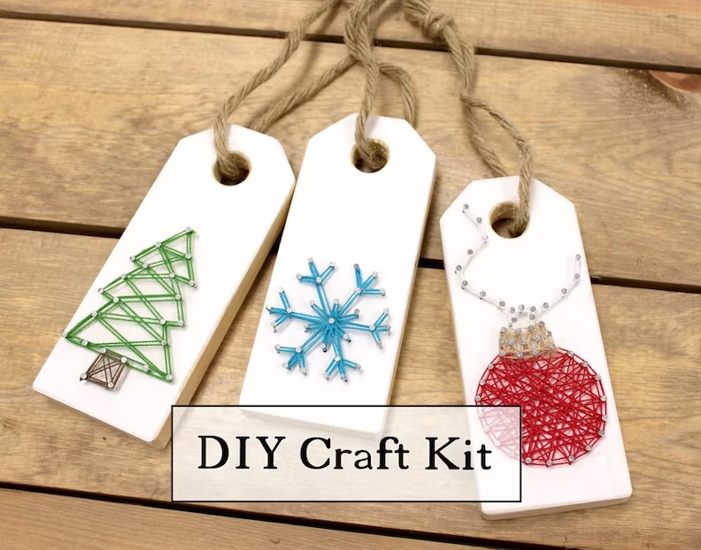

With our DIY Christmas String Art Kit – Large Wood Tag, you may embark on a journey of artistic expression and greater significance. This kit not only provides a creative outlet, but also a chance to integrate meaning and feeling into your Christmas decor. 

### **10 Kid-Friendly Christmas House Decoration Ideas**

#### **1\. [Gingerbread House Display](https://www.etsy.com/listing/1074059631/3d-freestanding-lace-gingerbread-house)**

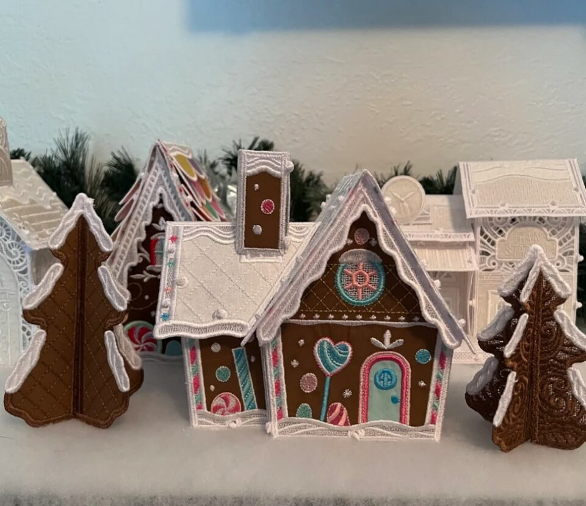

A Gingerbread House Display is a fun and festive addition to your holiday decorations. It encapsulates the season’s whimsy and appeal, evocative of traditional fairy tales in which gingerbread homes come to life. A Gingerbread House Display, often set on a table or countertop, contains a painstakingly designed edible structure made from gingerbread cookies, royal icing, and various multicolored candies. 

#### **2\. [Santa’s Footprints](https://www.etsy.com/listing/1111966579/santa-claus-footprint-stencil-elf)**

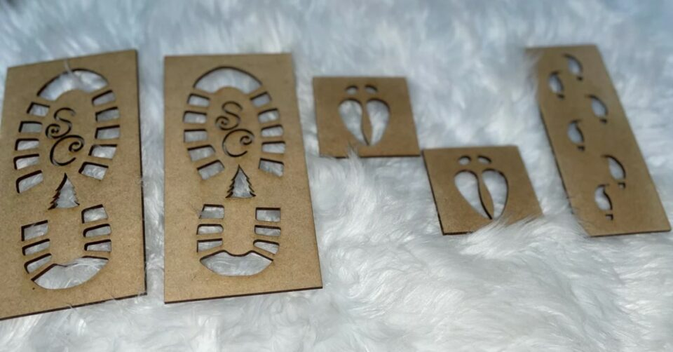

Santa’s Footprints is a funny and delightful Christmas house decoration for children. This beautiful custom brings Santa Claus’s enchantment to life in a fascinating and innovative manner. On Christmas morning, parents leave a trail of magical footprints to give the impression that Santa has visited their home. These flour or powdered sugar footprints occur around the fireplace, Christmas tree, or even leading from the chimney.

#### **3\. [DIY Advent Calendar](https://www.amazon.com/Christmas-Advent-Calendar-Stickers-Wooden/dp/B0CFJQBTMD/)**

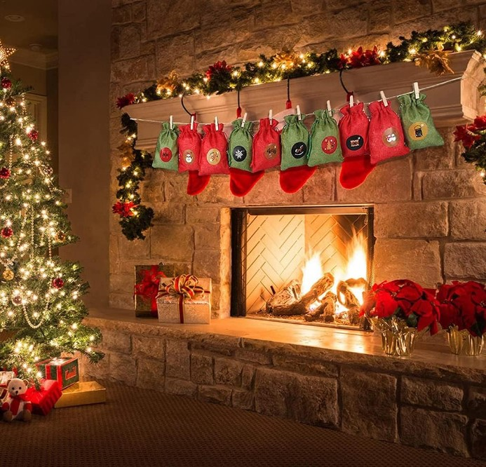

A DIY Christmas Advent Calendar is a fun and unique way to count down the days till Christmas. This interactive Christmas activity mixes crafts with anticipation, making it a wonderful tradition for both families and individuals.

#### **4\. [Christmas Bedding Set](https://www.amazon.com/spefrowx-Christmas-Bedding-Dinosaurs-Decorations/dp/B0C99FXM7B/)**

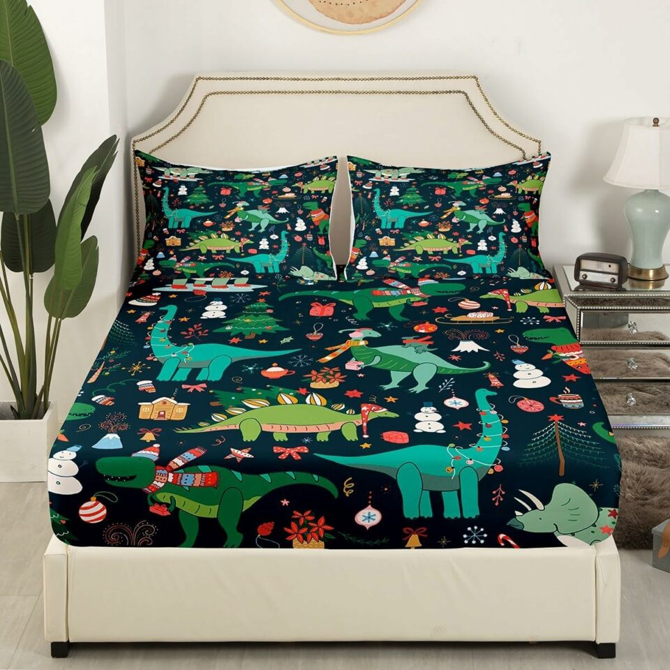

With our Christmas Bedding Set, you can transform your bedroom into a comfortable winter getaway. Embrace the holiday spirit with this set’s lovely festive motifs, rich colors, and excellent comfort. This bedding set, made of soft and sumptuous fabrics, guarantees a restful night’s sleep while adding a touch of seasonal enchantment to your home decor.

#### **5\. [Pink Christmas Blackout Curtains](https://www.amazon.com/Christmas-Blackout-Snowflake-Insulated-Darkening/dp/B0BFVYS6ZK/)**

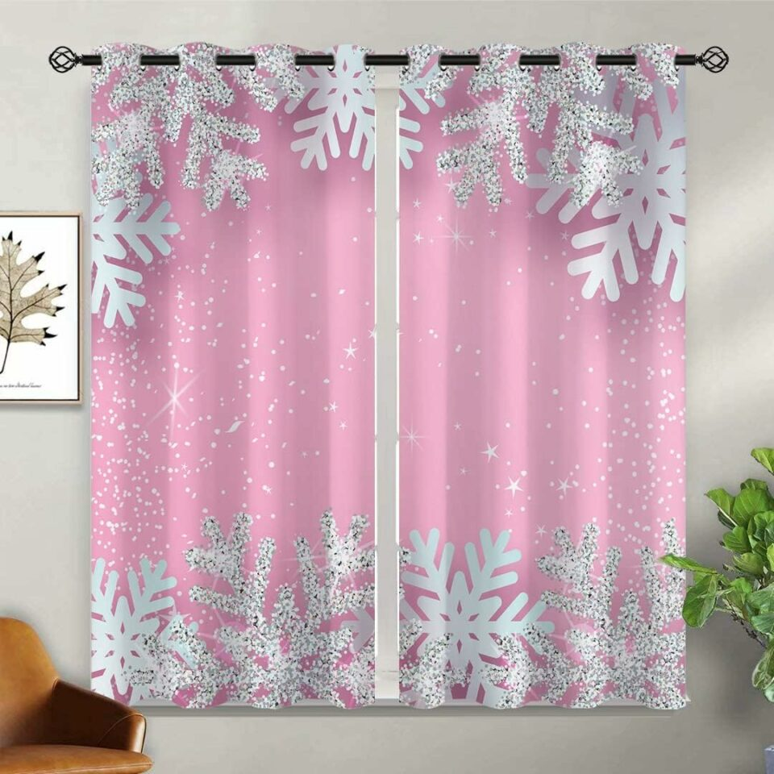

Pink Christmas Blackout Curtains combine the magic of the season with the refinement of pink appeal. Consider a winter’s dream with a subtle blush of pink intertwined with the joyful atmosphere of Christmas. These curtains aren’t simply window treatments; they’re magical experiences captured in fabric.

#### **6\. [Toy Train Display](https://www.amazon.com/Lionel-Christmas-Electric-Bluetooth-Capability/dp/B07QHMFXM1/)**

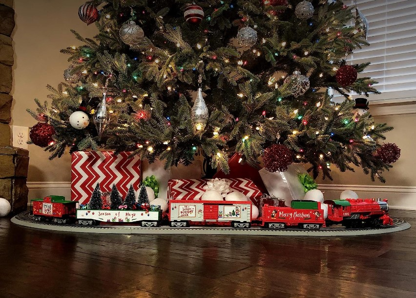

A Toy Train Display is a charming and nostalgic Christmas house decoration that captures the spirit of the season. A tiny train set weaves its way across a gorgeous winter countryside in this stunning image. The train, which is decked up in holiday lights and other touches, runs over tracks that pass past snow-covered villages, beneath dazzling bridges, and around a fanciful Christmas tree.

#### **7\. [Paper Chains](https://www.etsy.com/listing/1305758002/40-christmas-reindeer-paper-chains)**

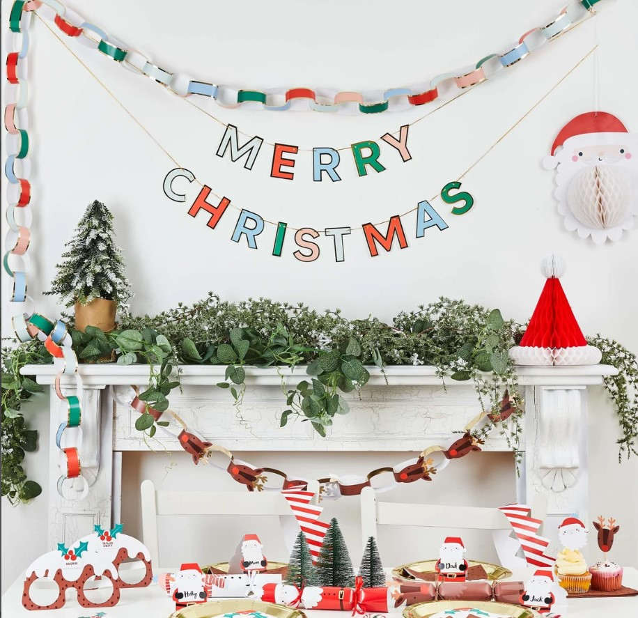

Paper Chains are a simple yet charming Christmas house decoration that captures the festive atmosphere. These lovely decorations are constructed by chaining together colored pieces of paper. Each link symbolizes a day leading up to Christmas, giving them a fun and engaging method to count down the days before the big day.

#### **8\. [Felt Reindeer Ornament](https://www.amazon.com/Mednkoku-Christmas-Pendants-Reindeer-Decorations/)**

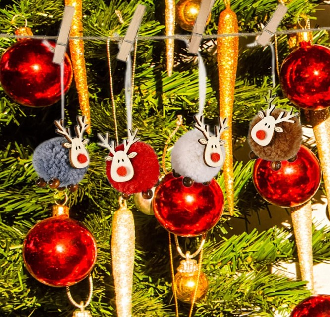

A Felt Reindeer Ornament is a beautiful and attractive addition to your [Christmas tree decor](https://avada.io/loveable/blog/christmas-tree-decorating-ideas/). This ornament is made of soft and textured felt material and has a fanciful reindeer design with meticulous elements like antlers, eyes, and a beautiful nose. The use of felt lends a comfortable and rustic vibe to the ornament, providing a touch of warmth to your Christmas décor.

#### **9\. [Christmas Piggy Bank](https://www.amazon.com/BESTOYARD-Christmas-Welcome-Children-Pattern/dp/B0BKKDC9N6/)**

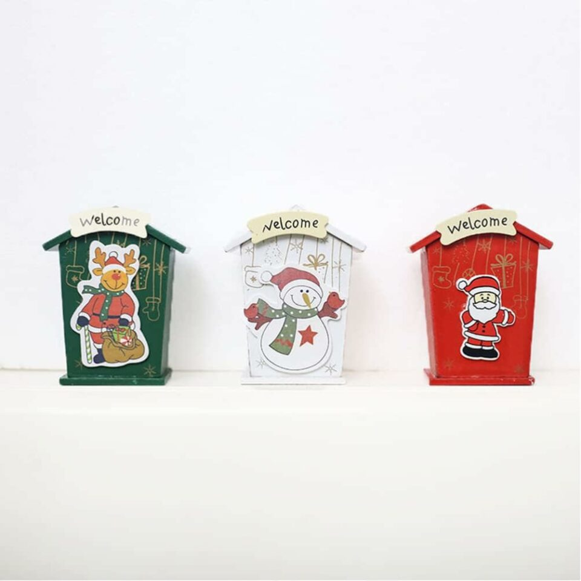

Christmas Piggy Bank is a lovely house ornament that provides children of all ages joy and financial education. This piggy bank, with its festive Christmas motif, gives a festive touch to any home. It was designed to create a sense of saving and to teach children the value of money while enjoying the wonder of the season.

#### **10\. [North Pole Direction Sign](https://www.etsy.com/listing/1286944650/christmas-arrow-sign-north-pole-sign)**

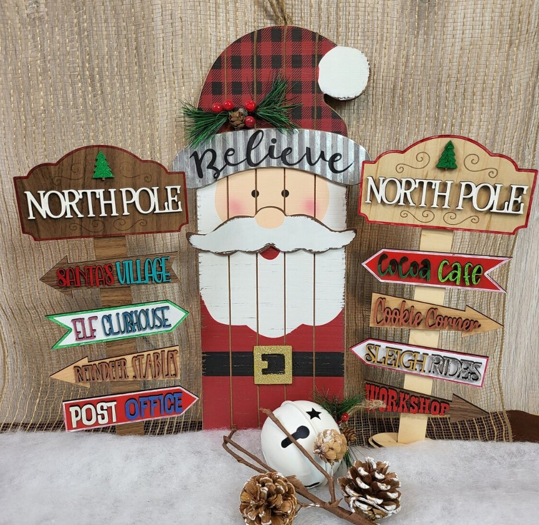

The North Pole Direction Sign is a delightful and quirky Christmas house decoration that will bring a magical touch to your festive room. This colorful sign, intended to convey the romance of the holiday season, generally displays quirky arrows pointing in the direction of the North Pole.

_**See More:**_

- [Christmas Wall Decor Ideas](https://avada.io/loveable/blog/christmas-wall-decor/)

- [Black Christmas Tree Decorations Ideas](https://avada.io/loveable/blog/black-christmas-tree-decorations/)

## **Bottom Line**

The festive season arrives with happiness, coziness, and a feeling of unity. Among the most beloved customs of this period is adorning your home for Christmas. Sparkling lights, joyful wreaths, and abundant ornaments come together in a symphony of decorations that illuminate your house, crafting a captivating atmosphere that embodies the essence of the season. Within this piece, we’ll delve into diverse ideas for **Christmas home decor**, guiding you to transform your dwelling into an enchanting winter paradise.

- [45 Festive Christmas House Decorations for a Joyful Home](https://avada.io/loveable/blog/christmas-house-decorations/#wp-block-heading-2-2)
    - [10 Outdoor Christmas House Decoration Ideas](https://avada.io/loveable/blog/christmas-house-decorations/#wp-block-heading-3-3)
        - [1\. Classic Wreath](https://avada.io/loveable/blog/christmas-house-decorations/#wp-block-heading-4-4)
        - [2\. Twinkle Fairy Christmas String Lights](https://avada.io/loveable/blog/christmas-house-decorations/#wp-block-heading-4-7)
        - [3\. Luminary Paper Bags with Flameless Tea Lights](https://avada.io/loveable/blog/christmas-house-decorations/#wp-block-heading-4-10)
        - [4\. Giant Inflatables](https://avada.io/loveable/blog/christmas-house-decorations/#wp-block-heading-4-13)
        - [5\. Snowflake Cutouts](https://avada.io/loveable/blog/christmas-house-decorations/#wp-block-heading-4-16)
        - [6\. Christmas Tinsel Garland](https://avada.io/loveable/blog/christmas-house-decorations/#wp-block-heading-4-19)
        - [7\. Pathway Markers](https://avada.io/loveable/blog/christmas-house-decorations/#wp-block-heading-4-22) 
        - [8\. Lighted Trees](https://avada.io/loveable/blog/christmas-house-decorations/#wp-block-heading-4-25)
        - [9\. Nutcracker Display](https://avada.io/loveable/blog/christmas-house-decorations/#wp-block-heading-4-28)
        - [10\. Festive Mailbox](https://avada.io/loveable/blog/christmas-house-decorations/#wp-block-heading-4-31)
    - [10 Indoor Christmas House Decoration Ideas](https://avada.io/loveable/blog/christmas-house-decorations/#wp-block-heading-3-34)
        - [1\. Christmas Tree](https://avada.io/loveable/blog/christmas-house-decorations/#wp-block-heading-4-35)
        - [2\. Wooden Gift Box](https://avada.io/loveable/blog/christmas-house-decorations/#wp-block-heading-4-38)
        - [3\. Snowflake Hanging Ornament with LED Lights](https://avada.io/loveable/blog/christmas-house-decorations/#wp-block-heading-4-41)
        - [4\. Christmas Village Sets LED Lights](https://avada.io/loveable/blog/christmas-house-decorations/#wp-block-heading-4-44)
        - [5\. Staircase Garland](https://avada.io/loveable/blog/christmas-house-decorations/#wp-block-heading-4-47)
        - [6\. Candle Arrangements Holder](https://avada.io/loveable/blog/christmas-house-decorations/#wp-block-heading-4-50)
        - [7\. Christmas Window Lights Decorations](https://avada.io/loveable/blog/christmas-house-decorations/#wp-block-heading-4-53)
        - [8\. Christmas String Lights](https://avada.io/loveable/blog/christmas-house-decorations/#wp-block-heading-4-56)
        - [9\. Festive Pillows Cover](https://avada.io/loveable/blog/christmas-house-decorations/#wp-block-heading-4-59)
        - [10\. Table Settings](https://avada.io/loveable/blog/christmas-house-decorations/#wp-block-heading-4-62)
    - [10 DIY Christmas House Decoration Ideas](https://avada.io/loveable/blog/christmas-house-decorations/#wp-block-heading-3-65)
        - [1\. Pinecone Ornaments](https://avada.io/loveable/blog/christmas-house-decorations/#wp-block-heading-4-66)
        - [2\. Homemade Wreath](https://avada.io/loveable/blog/christmas-house-decorations/#wp-block-heading-4-69)
        - [3\. Paper Snowflakes DIY](https://avada.io/loveable/blog/christmas-house-decorations/#wp-block-heading-4-72)
        - [4\. Christmas Tree DIY KIT](https://avada.io/loveable/blog/christmas-house-decorations/#wp-block-heading-4-75)
        - [5\. DIY Christmas ornaments](https://avada.io/loveable/blog/christmas-house-decorations/#wp-block-heading-4-78)
        - [6\. Mason Jar Lanterns](https://avada.io/loveable/blog/christmas-house-decorations/#wp-block-heading-4-81)
        - [7\. Felt Tree Ornaments](https://avada.io/loveable/blog/christmas-house-decorations/#wp-block-heading-4-84)
        - [8\. DYI Christmas Banners](https://avada.io/loveable/blog/christmas-house-decorations/#wp-block-heading-4-87)
        - [9\. Holiday Card Display](https://avada.io/loveable/blog/christmas-house-decorations/#wp-block-heading-4-90)
        - [10\.  DIY Christmas String Art Kit Large Wood Tag](https://avada.io/loveable/blog/christmas-house-decorations/#wp-block-heading-4-93)
    - [10 Kid-Friendly Christmas House Decoration Ideas](https://avada.io/loveable/blog/christmas-house-decorations/#wp-block-heading-3-96)
        - [1\. Gingerbread House Display](https://avada.io/loveable/blog/christmas-house-decorations/#wp-block-heading-4-97)
        - [2\. Santa’s Footprints](https://avada.io/loveable/blog/christmas-house-decorations/#wp-block-heading-4-100)
        - [3\. DIY Advent Calendar](https://avada.io/loveable/blog/christmas-house-decorations/#wp-block-heading-4-103)
        - [4\. Christmas Bedding Set](https://avada.io/loveable/blog/christmas-house-decorations/#wp-block-heading-4-106)
        - [5\. Pink Christmas Blackout Curtains](https://avada.io/loveable/blog/christmas-house-decorations/#wp-block-heading-4-109)
        - [6\. Toy Train Display](https://avada.io/loveable/blog/christmas-house-decorations/#wp-block-heading-4-112)
        - [7\. Paper Chains](https://avada.io/loveable/blog/christmas-house-decorations/#wp-block-heading-4-115)
        - [8\. Felt Reindeer Ornament](https://avada.io/loveable/blog/christmas-house-decorations/#wp-block-heading-4-118)
        - [9\. Christmas Piggy Bank](https://avada.io/loveable/blog/christmas-house-decorations/#wp-block-heading-4-121)
        - [10\. North Pole Direction Sign](https://avada.io/loveable/blog/christmas-house-decorations/#wp-block-heading-4-124)
- [Bottom Line](https://avada.io/loveable/blog/christmas-house-decorations/#wp-block-heading-2-130)

### [Blake Simpson](https://avada.io/loveable/author/blake/)

Hi, I'm Blake from Loveable. I help people find perfect gifts for occasions like anniversaries and weddings. I also write a blog about holidays, sharing insights to make them more meaningful. Let's create unforgettable moments together!

- [Twitter](https://twitter.com/intent/tweet)
- [Facebook](https://www.facebook.com/sharer/sharer.php)
- [instagram](https://avada.io/loveable/blog/christmas-house-decorations/)
- [pinterest](https://www.pinterest.com/loveablellc/)

## Related Posts

[### 120+ Christian Birthday Wishes To Spread Your Love](https://avada.io/loveable/blog/christian-birthday-wishes/) 

[

### 35 Best 70th Birthday Ideas To Celebrate The Special Milestone

](https://avada.io/loveable/blog/70th-birthday-ideas/)

[

### 50 Best 30th Birthday Decorations for a Remarkable Birthday Bash

](https://avada.io/loveable/blog/30th-birthday-decorations/)

[

### 40 Delicious Vegan Christmas Desserts to Delight Your Palate

](https://avada.io/loveable/blog/vegan-christmas-desserts/)

[

### 60 Christmas Team Building Activities to Boost Workplace Spirit

](https://avada.io/loveable/blog/christmas-team-building-activities/)
