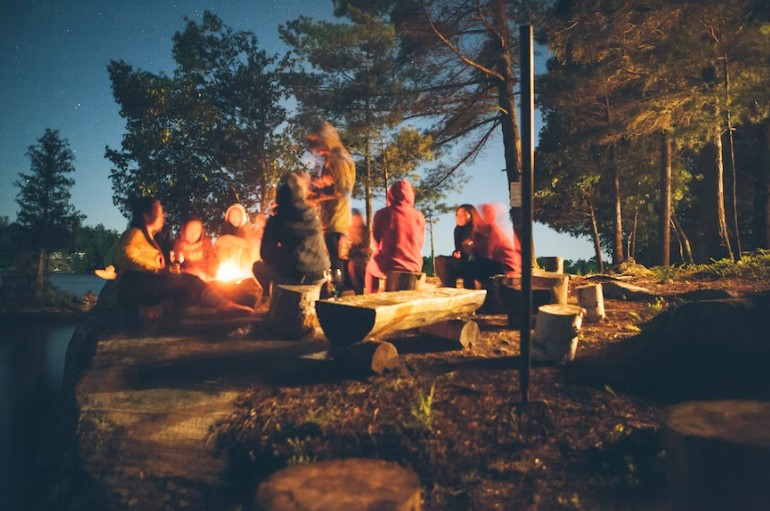

This article has been written and researched by our expert Loveable through a precise methodology. [Learn more about our methodology](https://avada.io/loveable/our-methodological.html)

[Loveable](https://avada.io/loveable/) > [Blog](https://avada.io/loveable/blog/) > [Family](https://avada.io/loveable/family/)

# 45+ Summer Camping Activities Outdoor Enthusiasts Should Try 

Written by [Rose Bryne](https://avada.io/loveable/author/rose/) Last Updated on August 21, 2023

- [45+ Summer Camping Activities Outdoor Enthusiasts Should Try](https://avada.io/loveable/blog/summer-camping-activities/#wp-block-heading-2-3) 
    - [Camping Activities for Relaxation and Enjoyment](https://avada.io/loveable/blog/summer-camping-activities/#wp-block-heading-3-4)
        - [1\. Share Campfire Tales](https://avada.io/loveable/blog/summer-camping-activities/#wp-block-heading-4-5)
        - [2\. Create Friendship Bracelets](https://avada.io/loveable/blog/summer-camping-activities/#wp-block-heading-4-8)
        - [3\. Skip Stones](https://avada.io/loveable/blog/summer-camping-activities/#wp-block-heading-4-10)
        - [4\. Write a Collaborative Story](https://avada.io/loveable/blog/summer-camping-activities/#wp-block-heading-4-12)
        - [5\. Hold a S’Mores Contest](https://avada.io/loveable/blog/summer-camping-activities/#wp-block-heading-4-15)
        - [6\. Take Photographs](https://avada.io/loveable/blog/summer-camping-activities/#wp-block-heading-4-17)
        - [7\. Collect Nature’s Treasures](https://avada.io/loveable/blog/summer-camping-activities/#wp-block-heading-4-20)
        - [8\. Create Colorful Flames](https://avada.io/loveable/blog/summer-camping-activities/#wp-block-heading-4-23)
        - [9\. Practice swimming](https://avada.io/loveable/blog/summer-camping-activities/#wp-block-heading-4-25)
        - [10\. Cook Over a Campfire](https://avada.io/loveable/blog/summer-camping-activities/#wp-block-heading-4-28)
        - [11\. Share Campfire Songs](https://avada.io/loveable/blog/summer-camping-activities/#wp-block-heading-4-30)
        - [12\. Enjoy Movie Night](https://avada.io/loveable/blog/summer-camping-activities/#wp-block-heading-4-32)
        - [13\. Get Creative with Bubbles and Sidewalk Chalk](https://avada.io/loveable/blog/summer-camping-activities/#wp-block-heading-4-35)
        - [14\. Toss a Frisbee](https://avada.io/loveable/blog/summer-camping-activities/#wp-block-heading-4-37)
        - [15\. Showcase Your Talents](https://avada.io/loveable/blog/summer-camping-activities/#wp-block-heading-4-39)
        - [16\. Jenga Glow-in-the-Dark](https://avada.io/loveable/blog/summer-camping-activities/#wp-block-heading-4-42)
        - [17\. Build a Fort](https://avada.io/loveable/blog/summer-camping-activities/#wp-block-heading-4-44)
    - [Adventurous Camping Activities for the Thrill-Seekers](https://avada.io/loveable/blog/summer-camping-activities/#wp-block-heading-3-46)
        - [1\. Play Capture the Flag](https://avada.io/loveable/blog/summer-camping-activities/#wp-block-heading-4-47)
        - [2\. Hike in nature](https://avada.io/loveable/blog/summer-camping-activities/#wp-block-heading-4-50)
        - [3\. Stand-Up Paddleboard Adventure](https://avada.io/loveable/blog/summer-camping-activities/#wp-block-heading-4-52)
        - [4\. Go Tubing](https://avada.io/loveable/blog/summer-camping-activities/#wp-block-heading-4-54)
        - [5\. Navigate a Map Maze](https://avada.io/loveable/blog/summer-camping-activities/#wp-block-heading-4-57)
        - [6\. Play Murder in the Dark](https://avada.io/loveable/blog/summer-camping-activities/#wp-block-heading-4-59)
        - [7\. Build an Obstacle Course](https://avada.io/loveable/blog/summer-camping-activities/#wp-block-heading-4-61)
        - [8\. Test Survival Skills](https://avada.io/loveable/blog/summer-camping-activities/#wp-block-heading-4-64)
        - [9\. Take Off-Road Adventures](https://avada.io/loveable/blog/summer-camping-activities/#wp-block-heading-4-66)
        - [10\. Try Axe Throwing](https://avada.io/loveable/blog/summer-camping-activities/#wp-block-heading-4-69)
        - [11\. Go Mountain Biking](https://avada.io/loveable/blog/summer-camping-activities/#wp-block-heading-4-71)
        - [12\. Go Rock Climbing and Rappelling](https://avada.io/loveable/blog/summer-camping-activities/#wp-block-heading-4-74)
    - [Unique Camping Activities for Nature Lovers](https://avada.io/loveable/blog/summer-camping-activities/#wp-block-heading-3-76)
        - [1\. Play Charades or Celebrity](https://avada.io/loveable/blog/summer-camping-activities/#wp-block-heading-4-77)
        - [2\. Explore Letterboxing](https://avada.io/loveable/blog/summer-camping-activities/#wp-block-heading-4-79)
        - [3\. Plan a Scavenger Hunt](https://avada.io/loveable/blog/summer-camping-activities/#wp-block-heading-4-82)
        - [4\. Sketch your surroundings](https://avada.io/loveable/blog/summer-camping-activities/#wp-block-heading-4-84)
        - [5\. Go Geocaching](https://avada.io/loveable/blog/summer-camping-activities/#wp-block-heading-4-87)
        - [6\. Have a Sleeping Bag Race](https://avada.io/loveable/blog/summer-camping-activities/#wp-block-heading-4-89)
        - [7\. Gaze at the Stars](https://avada.io/loveable/blog/summer-camping-activities/#wp-block-heading-4-92)
        - [8\. Practice Nature Yoga](https://avada.io/loveable/blog/summer-camping-activities/#wp-block-heading-4-95)
        - [9\. Play Flashlight Tag](https://avada.io/loveable/blog/summer-camping-activities/#wp-block-heading-4-97)
        - [10\. Connect with Nature through Forest Bathing](https://avada.io/loveable/blog/summer-camping-activities/#wp-block-heading-4-99)
        - [11\. Go Bird Watching](https://avada.io/loveable/blog/summer-camping-activities/#wp-block-heading-4-102)
        - [12\. Compete in Cornhole](https://avada.io/loveable/blog/summer-camping-activities/#wp-block-heading-4-105)
        - [13\. Play Ring Toss](https://avada.io/loveable/blog/summer-camping-activities/#wp-block-heading-4-107)
        - [14\. Enjoy a Kite-Flying Adventure](https://avada.io/loveable/blog/summer-camping-activities/#wp-block-heading-4-109)
        - [15\. Splash in the Water](https://avada.io/loveable/blog/summer-camping-activities/#wp-block-heading-4-112)
        - [16\. Learn Morse Code](https://avada.io/loveable/blog/summer-camping-activities/#wp-block-heading-4-114)
        - [17\. Have a Water Balloon Battle](https://avada.io/loveable/blog/summer-camping-activities/#wp-block-heading-4-116)
        - [18\. Try Fishing](https://avada.io/loveable/blog/summer-camping-activities/#wp-block-heading-4-119)
- [Safety Tips for Summer Camping Activities](https://avada.io/loveable/blog/summer-camping-activities/#wp-block-heading-2-121)
    - [1\. Prepare food safely and healthily while camping.](https://avada.io/loveable/blog/summer-camping-activities/#wp-block-heading-4-123)
    - [2\. Be aware of your surroundings.](https://avada.io/loveable/blog/summer-camping-activities/#wp-block-heading-4-125)
    - [3\. Get a medical check-up and keep vaccinations up-to-date before camping.](https://avada.io/loveable/blog/summer-camping-activities/#wp-block-heading-4-127)
    - [4\. Avoid interactions with wild animals.](https://avada.io/loveable/blog/summer-camping-activities/#wp-block-heading-4-129)
    - [5\. Protect yourself from the sun’s harmful rays.](https://avada.io/loveable/blog/summer-camping-activities/#wp-block-heading-4-131)
    - [6\. Protect yourself from bug bites and ticks.](https://avada.io/loveable/blog/summer-camping-activities/#wp-block-heading-4-133)
    - [7\. Take precautions to prevent water-related illnesses and injuries.](https://avada.io/loveable/blog/summer-camping-activities/#wp-block-heading-4-135)
    - [8\. Keep an eye out for poisonous plants.](https://avada.io/loveable/blog/summer-camping-activities/#wp-block-heading-4-137)
    - [9\. Follow campfire safety protocols.](https://avada.io/loveable/blog/summer-camping-activities/#wp-block-heading-4-139)
    - [10\. Store perishables away from heat to prevent spoilage.](https://avada.io/loveable/blog/summer-camping-activities/#wp-block-heading-4-141)
    - [11\. Protect yourself from carbon monoxide poisoning.](https://avada.io/loveable/blog/summer-camping-activities/#wp-block-heading-4-143)

- [Final thoughts](https://avada.io/loveable/blog/summer-camping-activities/#wp-block-heading-2-145) 

Summer weather can be difficult for some people to bear due to its hot and intense nature, which can cause irritability and anger in many individuals. However, there is no denying that summer is the ideal season for indulging in a range of outdoor activities, from swimming to hiking. Despite the harsh conditions, summer provides plenty of opportunities to create lasting memories and enjoy fun activities with loved ones.

Are you planning a summer camping vacation and searching for some fun outdoor activities? Congratulation! There is no need to look any further! We’ve put up a list of 45+ **summer camping activities** for outdoor enthusiasts of all ages. These **summer camping activities** are not only enjoyable and thrilling, but they also give an excellent opportunity to connect with nature and create lasting memories with family and friends. Let’s gather your camping supplies, gather your family and friends, and prepare for an exciting summer camping vacation full of fun and excitement!

## **45+ Summer Camping Activities Outdoor Enthusiasts Should Try** 

### **Camping Activities for Relaxation and Enjoyment**

#### **1\. Share Campfire Tales**

Sit around the campfire to tell scary or humorous stories. Encourage children to show their imaginations and creativity to create their own stories to tell. This activity is ideal for bonding with family or friends and creating long-lasting memories.

#### **2\. Create Friendship Bracelets**

[Make DIY friendship bracelets](https://avada.io/loveable/how-to-make-friendship-bracelets/) with colorful embroidery thread for yourself and your camping pals. This is an ideal activity for stimulating each others’ creativity while also providing a physical memento of the beautiful times together.

#### **3\. Skip Stones**

A familiar activity to recall childhood – Locate a body of water nearby and spend some time practicing stone skipping. This practice allows you to appreciate the serenity of nature while simultaneously boosting your hand-eye coordination and attention. 

#### **4\. Write a Collaborative Story**

Gather around the campfire and create a telling story. This exercise promotes creativity and collaboration while also being enjoyable. Mix the ideals of all members, maybe you will get an impressive story. 

#### **5\. Hold a S’Mores Contest**

See who can create the most creative s’mores recipe. You can unleash your creativity in cuisine while enjoying a traditional camping party. Let’s see who can satisfy the most demanding diners with their s’mores.

#### **6\. Take Photographs**

Taking photographs is certainly the best way to save memories in life. Let’s create humorous poses to remind you of how happy you are when looking back. Photograph your camping excursions to capture making long-lasting memories of your trip. 

#### **7\. Collect Nature’s Treasures**

Let’s make a competition to find something special in nature. The most valuable treasure must be made by oneself. Embark on gathering pebbles, shells, and leaves. It is considered an excellent game to teach awareness of the natural world while also fostering inquiry and discovery.

#### **8\. Create Colorful Flames**

This activity is perfect for inspiring a love of science and experimenting while adding fun to the camping trip. Making a ritual with a campfire at the center, you and your friends will turn into characters like the tribes in prehistoric Films.

#### **9\. Practice swimming**

Go to a lake, river, or pool near your camp; there’s nothing like diving into cool water on a hot summer day. You may work out by swimming laps and playing activities like Marco Polo. Bring pool toys, such as a splash pistol for a war game, or floats to add to the excitement.

#### **10\. Cook Over a Campfire**

While camping, just carries prepared ingredients and enjoy time cooking together. Cooking over a campfire is a traditional camping pastime in that everyone may participate. You may roast hot dogs, create s’mores, or prepare a substantial stew in a cast-iron kettle. The aroma of wood smoke and the fire’s crackling will enhance the food’s flavor.

#### **11\. Share Campfire Songs**

Come around the campfire and sing along to your favorite tunes. You are welcome to bring a guitar or other instrument to accompany your singing. Don’t be concerned if you can’t carry a tune; the joy of singing with others is what matters most.

#### **12\. Enjoy Movie Night**

Set up a portable movie screen or bring a laptop and projector to watch a movie beneath the stars. Don’t forget the popcorn and warm blankets for snuggling. It’s cozy when we lie together beside the light campfire. Enjoy a romantic film if you can invite your baby.

#### **13\. Get Creative with Bubbles and Sidewalk Chalk**

Bubbles and sidewalk chalk are lovely games to recall the ages of childhood for everyone. You may make your own bubble wands out of pipe cleaners or use a hula hoop to make gigantic bubbles. Play games like hopscotch or draw colorful drawings on the pavement using sidewalk chalk.

#### **14\. Toss a Frisbee**

The game will be best if you bring your baby pet. A frisbee is a pleasant and easy activity that people of all ages may enjoy. You may play catch or ultimate frisbee with your friends and family. It’s an excellent way to be active while enjoying the outdoors. 

#### **15\. Showcase Your Talents**

Let’s show what you can do that you even never reveal. Summer camping excursions are ideal for showcasing your abilities, whether they be singing, dancing, juggling, or magic shows. Put on a talent performance for your family or other campers, and then relax beneath the stars. 

#### **16\. Jenga Glow-in-the-Dark**

You will increase the difficulty of this game when doing it in the dark. Just paint each block with glow-in-the-dark paint and play as usual. The blocks will become increasingly apparent as the game progresses, providing a colorful and entertaining experience. Ideal for a night of stargazing with family and friends!

#### **17\. Build a Fort**

Have you ever had a dream of owning a fort? It is time to make your dream come true. Constructing a fort is a pleasant hobby for both children and adults. Collect materials for building, such as blankets, sheets, and pillows, to make your own warm retreat. With the addition of some fairy lights, you have the ideal setting for a family movie night or a quiet area to read a book.

### **Adventurous Camping Activities for the Thrill-Seekers**

#### **1\. Play Capture the Flag**

This outdoor pastime is not only enjoyable, but it also promotes teamwork and problem-solving skills. Split into two teams and draw a boundary line with the flags of each team on the opposing sides. The objective is to seize the other team’s flag and return it to your side without being captured. It’s a fun way to enjoy the outdoors and make memories with friends and family.

#### **2\. Hike in nature**

What a lack if you go camping without hiking! Hike to discover the natural surroundings. Bring lots of water, food, and sunscreen with you because you will probably have a long journey. This will be an ideal opportunity to learn about the local flora and animals.

#### **3\. Stand-Up Paddleboard Adventure**

Find somewhere around your place renting stand-up paddleboarding equipment. Paddleboarding on the calm waters of a neighboring lake or river is a fantastic activity. While paddling along the river, take in the scenic vistas of nature and test your balance skills.

#### **4\. Go Tubing**

Go tubing down a river or stream if you’re searching for fun playboating. When floating down the mild rapids, enjoy the refreshing water and the gorgeous surroundings around you.

#### **5\. Navigate a Map Maze**

Go through a map maze to test your problem-solving abilities. Hide treasures somewhere, create a map, and then give them to your partners. Use a compass and map to navigate the maze’s twists and turns and reach the finish line. However, ensure that it does not make it a dangerous risk.

#### **6\. Play Murder in the Dark**

The space in camping is super suitable for this activity to create a thrilling feeling. “Murder in the Dark” can add a dramatic twist to your camping adventure. The killer is selected, and they must try to “kill” the other players. Before they’re all “dead,” the gamers must find out who the culprit is. Anyway, know that it’s just a fantasy game but role-play to make it as realistic as possible.

#### **7\. Build an Obstacle Course**

The competitions will contribute to creating a meaningful trip that pushes your competitive spirit. Make your obstacle course out of natural objects in the woods, such as logs, pebbles, and branches. Challenge your campmates to see who can finish the course the fastest. 

#### **8\. Test Survival Skills**

Study and put your survival abilities to the test, such as starting a fire, purifying water, or constructing a shelter. Put their abilities to the test by having them spend the night in the wild with only the necessities. It’s an excellent approach to boosting self-esteem and resourcefulness.

#### **9\. Take Off-Road Adventures**

If you have an adequate budget, it will be the best adventurous activity for the Thrill-Seekers. Off-roading allows you to get off the main path and experience the great outdoors. Hit the trails with a four-wheel drive car, dirt bike, or ATV. It’s an exciting way to view some amazing landscapes while enjoying the ride’s excitement. 

#### **10\. Try Axe Throwing**

Consider that game to release your stress after exhausting working days. Axe throwing is a unique and thrilling pastime. It’s a terrific opportunity to put your aim to the test and let off some steam. With a little practice, you may become a pro!

#### **11\. Go Mountain Biking**

Camping on the hill, you cannot ignore unspoiled mountains to contemplate nature’s beauty. Take everyone on an exciting mountain bike adventure to relax and conquer new places. Mountain biking is a fun way to remain healthy and experience the great outdoors, with magnificent vistas and tough terrain. 

#### **12\. Go Rock Climbing and Rappelling**

Rappelling and rock climbing are thrilling outdoor activities that challenge both the body and the mind. You can safely climb and rappel down the side of a mountain with the assistance of a skilled guide. It’s exciting to test yourself and gain a new perspective on the vast outdoors. Rock climbing and rappelling may thus provide a really memorable experience for anyone looking for adventure.

### **Unique Camping Activities for Nature Lovers**

#### **1\. Play Charades or Celebrity**

These games are suitable for groups of all ages and may be played outside. Charades is a classic game that’s easy to learn and perfect for groups of all ages. In this game, players must act out clues without speaking, while their teammates try to guess the answer. If you’re looking to add some extra excitement, try playing Celebrity, where the clues are all famous people. Each round game will be more challenging as players are restricted in the clues they can give.

#### **2\. Explore Letterboxing**

This is an excellent activity for families or parties that like hiking and enjoying the outdoors. Players must follow instructions to find hidden letterboxes with rubber stamps and a logbook. When they find the mailbox, they use the rubber stamp to mark their logbook and leave a personal stamp in the logbook of the letterbox. 

#### **3\. Plan a Scavenger Hunt**

Scavenger hunts may be personalized to any age group or ability level, and items discovered in nature, man-made objects, or even specific locations can be included. You probably hand out paper bags and ask the kids to gather some of the materials, then use their findings to create an art piece.

#### **4\. Sketch your surroundings**

Bring a sketchbook and pencils to jot down the beauty of your destinations. It’s perfect for inspiring creativity and mindfulness while also creating a visual memory of your camping trip. When looking back, you will remind of this amazing camp.

#### **5\. Go Geocaching**

Participate in a high-tech treasure hunt that uses GPS coordinates to locate hidden containers containing trinkets and prizes. It’s a wonderful way to get outside and practice your navigation abilities.

#### **6\. Have a Sleeping Bag Race**

A fun and safe activity for all family members, including children. Make a sleeping bag race, in which you climb into a sleeping bag and race to the finish line. It’s a goofy and entertaining pastime that’s suitable for both children and adults.

#### **7\. Gaze at the Stars**

Certainly, camping is to contemplate the natural beauty, so ignoring lovely night stars is unacceptable. Be lost in the splendor of the night sky and marvel at the stars. It’s a serene and awe-inspiring pastime that’s ideal for romantic nights or alone reflection – Put your phone away and focus on enjoying the stars.

#### **8\. Practice Nature Yoga**

Do [yoga](https://avada.io/loveable/gifts-yoga-lovers/) and enjoy the scent of nature – Sound interesting. A session of nature yoga will help you connect with nature and your inner self. Consider nature as the best fitness room ever. When you pay attention to your breath, you probably see some strange energy go in – Comfort and Peace.

#### **9\. Play Flashlight Tag**

Another type of Hide and Seek – Flashlight tag can add an air of adventure to your camping excursion. It’s a classic childhood game that’ll get your competitive juices flowing. Ensure that no one is afraid of darkness and gets away too far.

#### **10\. Connect with Nature through Forest Bathing**

Surely, not a joke; it could be someone’s childhood dream. Take a calm, secret walk in the forest and let nature’s healing power wash over you. Forest bathing is a technique that has been proven to alleviate stress and boost general well-being. The freshwater that comes directly from the waterfall may give you great experiences. 

#### **11\. Go Bird Watching**

Let’s see how many types of birds are in your destination. You can also take pictures of them to make a collection. Immerse yourself in nature with feathery birds’ amazing colors. Whether you like it or not, bird-watching is a delightful and calming hobby for people of all ages.

#### **12\. Compete in Cornhole**

It’s quite popular, so not many things describe this activity. Get a group of friends and challenge them to a round of cornhole, the traditional bean bag tossing game. It’s easy to learn and can be played practically anywhere, making it an ideal camping sport. 

#### **13\. Play Ring Toss**

This will help you maintain your hand-eye coordination. You only need a few rings and some pegs or bottles to toss them at. It’s a basic yet interesting game that may keep you entertained for hours. You can think of preparing some gift for the winner to push the competitive spirit. 

#### **14\. Enjoy a Kite-Flying Adventure**

Nowadays, it’s not easy to find somewhere in the city to fly a kite, so you need to utilize this time. Do what you can’t do. Use the open area at your campground to go on a kite-flying excursion. You may create your own kite and experience the excitement of seeing it soar over the sky.

#### **15\. Splash in the Water**

It’s time to use the water gun without being yelled at by mom. Splashing in the water is a great way to cool off on a hot summer day. Nothing beats a nice swim or a fun water battle with friends and family, whether at the lake, river, or pool.

#### **16\. Learn Morse Code**

Morse code is a system of special symbols that sends messages using dots and dashes. Morse code may be a fun and valuable skill to learn. You may use it to send secret messages to friends and family and in emergencies. It’s fun to have your own language, right?

#### **17\. Have a Water Balloon Battle**

A water balloon battle is an amazing activity to beat the scorching on summer days. Preparing to fill up water balloons can be tiring, but there’s no regret while playing. The champion is the last person or team remaining with a dry shirt, whether you play one-on-one or in teams.

#### **18\. Try Fishing**

You shouldn’t forget to bring a fishing rod to camping to enjoy this peaceful activity. Fishing is a fun option to get outside and appreciates nature. To help conserve fish populations, it’s essential to obey local fishing restrictions. 

## **Safety Tips for Summer Camping Activities**

#### **1\. Prepare food safely and healthily while camping.**

Surely, it’s terrible that you have nothing to eat camping when camping. Let’s bring your favorite food and enjoy nature. To avoid foodborne disease, properly cook meats.

#### **2\. Be aware of your surroundings.**

Keep an eye out for risks such as uneven ground, unstable rocks, and other potentially deadly species like snakes and bears. It’s silly if you do not know carefully where you are. It’s just a time for enjoyment so don’t put yourselves in danger. 

#### **3\. Get a medical check-up and keep vaccinations up-to-date before camping.**

It is to ensure your health condition during long-trip camping. Before you go camping, have a medical check-up and ensure that your immunizations are up to date. This will aid with the prevention of infections that can be contracted when out in nature.

#### **4\. Avoid interactions with wild animals.**

You don’t want to talk with a snake or a lion, right? Approaching or feeding wild animals can be risky and cause them to become violent. you can make a campfire o keep animals away from your campground.

#### **5\. Protect yourself from the sun’s harmful rays.**

Sunrays, especially in the summer, can cause many potential illnesses related to the skin. To protect yourself, you should wear a long-sleeved shirt, and apply sunscreen with at least SPF 30. During the warmest portions of the day, stay in the shade. 

#### **6\. Protect yourself from bug bites and ticks.**

Bug bites and ticks will cause allergies and rashes. To prevent ticks from adhering to your skin, wear long sleeves and pants and tuck your pants into your socks.

#### **7\. Take precautions to prevent water-related illnesses and injuries.**

When playing activities underwater, follow the principles that equip a life jacket and stay in the designated places. Drinking untreated water from lakes or streams is not recommended since it may contain hazardous germs.

#### **8\. Keep an eye out for poisonous plants.**

Learn how to recognize these plants and stay away from them. If you touch them, immediately wash the affected area with soap and water to avoid allergic responses.

#### **9\. Follow campfire safety protocols.**

A fire can be a potential risk for the whole forest, so you must follow the local rules to keep everything smooth. 

#### **10\. Store perishables away from heat to prevent spoilage.**

Pack perishable food and ingredient in insulated coolers with plenty of ice and keep them in the shade. 

#### **11\. Protect yourself from carbon monoxide poisoning.**

Cooking and heating appliances should be kept far away from your sleeping space. Coal is necessary for a delicious BBQ party, but don’t abuse them too much.

## **Final thoughts** 

Are you getting excited when thinking of the next summer coming to enjoy memorable moments? Whatever, don’t waste the next time just because you have no idea of what to do. This guide is to provide you with a list of **45+ Summer Camping Activities Outdoor Enthusiasts Should Try**, so what you need to do now is just gather your companion for amazing camps. 

Summer offers the perfect chance for outdoor enthusiasts to engage in a range of activities, with camping being an excellent way to enjoy the outdoors. Taking necessary precautions to ensure safety before embarking on any adventure is important. While safety is a top priority, it doesn’t mean you can’t have fun. The activities on this list are designed to help you connect with nature, make lasting memories, and enjoy quality time with loved ones.

Disconnecting from the hustle and bustle of modern life and getting closer to nature can be achieved through camping. With your family and friends, pack your essentials and indulge in these exciting **summer camping activities** that will surely not disappoint.

- [45+ Summer Camping Activities Outdoor Enthusiasts Should Try](https://avada.io/loveable/blog/summer-camping-activities/#wp-block-heading-2-3) 
    - [Camping Activities for Relaxation and Enjoyment](https://avada.io/loveable/blog/summer-camping-activities/#wp-block-heading-3-4)
        - [1\. Share Campfire Tales](https://avada.io/loveable/blog/summer-camping-activities/#wp-block-heading-4-5)
        - [2\. Create Friendship Bracelets](https://avada.io/loveable/blog/summer-camping-activities/#wp-block-heading-4-8)
        - [3\. Skip Stones](https://avada.io/loveable/blog/summer-camping-activities/#wp-block-heading-4-10)
        - [4\. Write a Collaborative Story](https://avada.io/loveable/blog/summer-camping-activities/#wp-block-heading-4-12)
        - [5\. Hold a S’Mores Contest](https://avada.io/loveable/blog/summer-camping-activities/#wp-block-heading-4-15)
        - [6\. Take Photographs](https://avada.io/loveable/blog/summer-camping-activities/#wp-block-heading-4-17)
        - [7\. Collect Nature’s Treasures](https://avada.io/loveable/blog/summer-camping-activities/#wp-block-heading-4-20)
        - [8\. Create Colorful Flames](https://avada.io/loveable/blog/summer-camping-activities/#wp-block-heading-4-23)
        - [9\. Practice swimming](https://avada.io/loveable/blog/summer-camping-activities/#wp-block-heading-4-25)
        - [10\. Cook Over a Campfire](https://avada.io/loveable/blog/summer-camping-activities/#wp-block-heading-4-28)
        - [11\. Share Campfire Songs](https://avada.io/loveable/blog/summer-camping-activities/#wp-block-heading-4-30)
        - [12\. Enjoy Movie Night](https://avada.io/loveable/blog/summer-camping-activities/#wp-block-heading-4-32)
        - [13\. Get Creative with Bubbles and Sidewalk Chalk](https://avada.io/loveable/blog/summer-camping-activities/#wp-block-heading-4-35)
        - [14\. Toss a Frisbee](https://avada.io/loveable/blog/summer-camping-activities/#wp-block-heading-4-37)
        - [15\. Showcase Your Talents](https://avada.io/loveable/blog/summer-camping-activities/#wp-block-heading-4-39)
        - [16\. Jenga Glow-in-the-Dark](https://avada.io/loveable/blog/summer-camping-activities/#wp-block-heading-4-42)
        - [17\. Build a Fort](https://avada.io/loveable/blog/summer-camping-activities/#wp-block-heading-4-44)
    - [Adventurous Camping Activities for the Thrill-Seekers](https://avada.io/loveable/blog/summer-camping-activities/#wp-block-heading-3-46)
        - [1\. Play Capture the Flag](https://avada.io/loveable/blog/summer-camping-activities/#wp-block-heading-4-47)
        - [2\. Hike in nature](https://avada.io/loveable/blog/summer-camping-activities/#wp-block-heading-4-50)
        - [3\. Stand-Up Paddleboard Adventure](https://avada.io/loveable/blog/summer-camping-activities/#wp-block-heading-4-52)
        - [4\. Go Tubing](https://avada.io/loveable/blog/summer-camping-activities/#wp-block-heading-4-54)
        - [5\. Navigate a Map Maze](https://avada.io/loveable/blog/summer-camping-activities/#wp-block-heading-4-57)
        - [6\. Play Murder in the Dark](https://avada.io/loveable/blog/summer-camping-activities/#wp-block-heading-4-59)
        - [7\. Build an Obstacle Course](https://avada.io/loveable/blog/summer-camping-activities/#wp-block-heading-4-61)
        - [8\. Test Survival Skills](https://avada.io/loveable/blog/summer-camping-activities/#wp-block-heading-4-64)
        - [9\. Take Off-Road Adventures](https://avada.io/loveable/blog/summer-camping-activities/#wp-block-heading-4-66)
        - [10\. Try Axe Throwing](https://avada.io/loveable/blog/summer-camping-activities/#wp-block-heading-4-69)
        - [11\. Go Mountain Biking](https://avada.io/loveable/blog/summer-camping-activities/#wp-block-heading-4-71)
        - [12\. Go Rock Climbing and Rappelling](https://avada.io/loveable/blog/summer-camping-activities/#wp-block-heading-4-74)
    - [Unique Camping Activities for Nature Lovers](https://avada.io/loveable/blog/summer-camping-activities/#wp-block-heading-3-76)
        - [1\. Play Charades or Celebrity](https://avada.io/loveable/blog/summer-camping-activities/#wp-block-heading-4-77)
        - [2\. Explore Letterboxing](https://avada.io/loveable/blog/summer-camping-activities/#wp-block-heading-4-79)
        - [3\. Plan a Scavenger Hunt](https://avada.io/loveable/blog/summer-camping-activities/#wp-block-heading-4-82)
        - [4\. Sketch your surroundings](https://avada.io/loveable/blog/summer-camping-activities/#wp-block-heading-4-84)
        - [5\. Go Geocaching](https://avada.io/loveable/blog/summer-camping-activities/#wp-block-heading-4-87)
        - [6\. Have a Sleeping Bag Race](https://avada.io/loveable/blog/summer-camping-activities/#wp-block-heading-4-89)
        - [7\. Gaze at the Stars](https://avada.io/loveable/blog/summer-camping-activities/#wp-block-heading-4-92)
        - [8\. Practice Nature Yoga](https://avada.io/loveable/blog/summer-camping-activities/#wp-block-heading-4-95)
        - [9\. Play Flashlight Tag](https://avada.io/loveable/blog/summer-camping-activities/#wp-block-heading-4-97)
        - [10\. Connect with Nature through Forest Bathing](https://avada.io/loveable/blog/summer-camping-activities/#wp-block-heading-4-99)
        - [11\. Go Bird Watching](https://avada.io/loveable/blog/summer-camping-activities/#wp-block-heading-4-102)
        - [12\. Compete in Cornhole](https://avada.io/loveable/blog/summer-camping-activities/#wp-block-heading-4-105)
        - [13\. Play Ring Toss](https://avada.io/loveable/blog/summer-camping-activities/#wp-block-heading-4-107)
        - [14\. Enjoy a Kite-Flying Adventure](https://avada.io/loveable/blog/summer-camping-activities/#wp-block-heading-4-109)
        - [15\. Splash in the Water](https://avada.io/loveable/blog/summer-camping-activities/#wp-block-heading-4-112)
        - [16\. Learn Morse Code](https://avada.io/loveable/blog/summer-camping-activities/#wp-block-heading-4-114)
        - [17\. Have a Water Balloon Battle](https://avada.io/loveable/blog/summer-camping-activities/#wp-block-heading-4-116)
        - [18\. Try Fishing](https://avada.io/loveable/blog/summer-camping-activities/#wp-block-heading-4-119)
- [Safety Tips for Summer Camping Activities](https://avada.io/loveable/blog/summer-camping-activities/#wp-block-heading-2-121)
    - [1\. Prepare food safely and healthily while camping.](https://avada.io/loveable/blog/summer-camping-activities/#wp-block-heading-4-123)
    - [2\. Be aware of your surroundings.](https://avada.io/loveable/blog/summer-camping-activities/#wp-block-heading-4-125)
    - [3\. Get a medical check-up and keep vaccinations up-to-date before camping.](https://avada.io/loveable/blog/summer-camping-activities/#wp-block-heading-4-127)
    - [4\. Avoid interactions with wild animals.](https://avada.io/loveable/blog/summer-camping-activities/#wp-block-heading-4-129)
    - [5\. Protect yourself from the sun’s harmful rays.](https://avada.io/loveable/blog/summer-camping-activities/#wp-block-heading-4-131)
    - [6\. Protect yourself from bug bites and ticks.](https://avada.io/loveable/blog/summer-camping-activities/#wp-block-heading-4-133)
    - [7\. Take precautions to prevent water-related illnesses and injuries.](https://avada.io/loveable/blog/summer-camping-activities/#wp-block-heading-4-135)
    - [8\. Keep an eye out for poisonous plants.](https://avada.io/loveable/blog/summer-camping-activities/#wp-block-heading-4-137)
    - [9\. Follow campfire safety protocols.](https://avada.io/loveable/blog/summer-camping-activities/#wp-block-heading-4-139)
    - [10\. Store perishables away from heat to prevent spoilage.](https://avada.io/loveable/blog/summer-camping-activities/#wp-block-heading-4-141)
    - [11\. Protect yourself from carbon monoxide poisoning.](https://avada.io/loveable/blog/summer-camping-activities/#wp-block-heading-4-143)

- [Final thoughts](https://avada.io/loveable/blog/summer-camping-activities/#wp-block-heading-2-145) 

### [Rose Bryne](https://avada.io/loveable/author/rose/)

Hi, I'm Rose! I love animals and spending time with kids. At Loveable, I help people find unique gifts for special occasions like Valentine's Day, housewarmings, and graduations. I enjoy finding gifts for kids, teens, and animal lovers that match their interests and personalities. Making gift-giving a pleasant experience is my priority. Let me assist you in finding the perfect gift!

- [Twitter](https://twitter.com/intent/tweet)
- [Facebook](https://www.facebook.com/sharer/sharer.php)
- [instagram](https://avada.io/loveable/blog/summer-camping-activities/)
- [pinterest](https://www.pinterest.com/loveablellc/)

## Related Posts

[### 30 Best 4 Year Old Birthday Party Ideas For A Memorable Celebration](https://avada.io/loveable/blog/4-year-old-birthday-party-ideas/) 

[

### 16th Birthday Party Ideas to Make an Unforgettable Day

](https://avada.io/loveable/blog/16th-birthday-party-ideas/)

[

### 150+ Inspirational Birthday Quotes to Spread Joy on Special Day

](https://avada.io/loveable/blog/inspirational-birthday-quotes/)

[

### 160+ Birthday Wishes for Wife to Express Eternal Love

](https://avada.io/loveable/blog/birthday-wishes-for-wife/)

[### 90+ Heart Touching Birthday Wishes for Niece to Make Her Day Extra Special](https://avada.io/loveable/blog/birthday-wishes-for-niece/)
