This article has been written and researched by our expert Loveable through a precise methodology. [Learn more about our methodology](https://avada.io/loveable/our-methodological.html)

[Loveable](https://avada.io/loveable/) > [Blog](https://avada.io/loveable/blog/) > [Holiday](https://avada.io/loveable/holiday/)

# 49 Best Halloween Movies for 2023 Watch List

Written by [Blake Simpson](https://avada.io/loveable/author/blake/) Last Updated on September 11, 2023

- [Upcoming 2023 Halloween Horror Movies](https://avada.io/loveable/blog/best-halloween-movies/#wp-block-heading-2-4)
    - [The Nun II](https://avada.io/loveable/blog/best-halloween-movies/#wp-block-heading-3-5)
    - [No One Will Save You](https://avada.io/loveable/blog/best-halloween-movies/#wp-block-heading-3-9)
    - [Saw X (In theaters Sept. 29)](https://avada.io/loveable/blog/best-halloween-movies/#wp-block-heading-3-13)
    - [Pet Sematary: Bloodlines](https://avada.io/loveable/blog/best-halloween-movies/#wp-block-heading-3-18)
    - [Malibu Horror Story](https://avada.io/loveable/blog/best-halloween-movies/#wp-block-heading-3-23)
- [Famous Halloween Movies](https://avada.io/loveable/blog/best-halloween-movies/#wp-block-heading-2-27) 
    - [1\. Ghostbusters (1984)](https://avada.io/loveable/blog/best-halloween-movies/#wp-block-heading-3-28)
    - [2\. The Addams Family (1991)](https://avada.io/loveable/blog/best-halloween-movies/#wp-block-heading-3-31)
    - [3\. Scream (1996)](https://avada.io/loveable/blog/best-halloween-movies/#wp-block-heading-3-34)
    - [4\. Zombieland (2009)](https://avada.io/loveable/blog/best-halloween-movies/#wp-block-heading-3-37)
    - [5\. Hocus Pocus (1993)](https://avada.io/loveable/blog/best-halloween-movies/#wp-block-heading-3-40)
    - [6\. The Nightmare Before Christmas (1993)](https://avada.io/loveable/blog/best-halloween-movies/#wp-block-heading-3-44)
    - [7\. I Know What You Did Last Summer (1997)](https://avada.io/loveable/blog/best-halloween-movies/#wp-block-heading-3-47)
    - [8\. It’s the Great Pumpkin, Charlie Brown (1966)](https://avada.io/loveable/blog/best-halloween-movies/#wp-block-heading-3-50)
    - [9\. Get Out (2017)](https://avada.io/loveable/blog/best-halloween-movies/#wp-block-heading-3-54)
    - [10\. The Texas Chain Saw Massacre (1974)](https://avada.io/loveable/blog/best-halloween-movies/#wp-block-heading-3-57)
- [Most-Watched Halloween Moivie of All Time](https://avada.io/loveable/blog/best-halloween-movies/#wp-block-heading-2-60) 
    - [11\. Young Frankenstein (1974)](https://avada.io/loveable/blog/best-halloween-movies/#wp-block-heading-3-61)
    - [12\. Children of the Corn (1984)](https://avada.io/loveable/blog/best-halloween-movies/#wp-block-heading-3-64)
    - [13\. Suspiria (1977)](https://avada.io/loveable/blog/best-halloween-movies/#wp-block-heading-3-67)
    - [14\. Night of the Demons (1988)](https://avada.io/loveable/blog/best-halloween-movies/#wp-block-heading-3-71)
    - [15\. Parasite (2019)](https://avada.io/loveable/blog/best-halloween-movies/#wp-block-heading-3-74)
    - [16\. Paranormal Activity (2007)](https://avada.io/loveable/blog/best-halloween-movies/#wp-block-heading-3-77)
    - [17\. Poltergeist (1982)](https://avada.io/loveable/blog/best-halloween-movies/#wp-block-heading-3-80)
    - [18\. The Babadook (2014)](https://avada.io/loveable/blog/best-halloween-movies/#wp-block-heading-3-83)
    - [19\. Twilight (2008)](https://avada.io/loveable/blog/best-halloween-movies/#wp-block-heading-3-86)
    - [20\. Interview With the Vampire: The Vampire Chronicles (1994)](https://avada.io/loveable/blog/best-halloween-movies/#wp-block-heading-3-89)
    - [21\. The Thing (1982)](https://avada.io/loveable/blog/best-halloween-movies/#wp-block-heading-3-92)
    - [22\. Monster House (2006)](https://avada.io/loveable/blog/best-halloween-movies/#wp-block-heading-3-95)
    - [23\. Hereditary (2018)](https://avada.io/loveable/blog/best-halloween-movies/#wp-block-heading-3-98)
    - [24\. The Craft (1996)](https://avada.io/loveable/blog/best-halloween-movies/#wp-block-heading-3-101)
    - [25\. Ghostbusters (2016)](https://avada.io/loveable/blog/best-halloween-movies/#wp-block-heading-3-104)
    - [26\. Frankenstein (1931)](https://avada.io/loveable/blog/best-halloween-movies/#wp-block-heading-3-107)
    - [27\. Creepshow (1982)](https://avada.io/loveable/blog/best-halloween-movies/#wp-block-heading-3-110)
    - [28\. Poltergeist (1982)](https://avada.io/loveable/blog/best-halloween-movies/#wp-block-heading-3-113)
    - [29\. The Sixth Sense (1999)](https://avada.io/loveable/blog/best-halloween-movies/#wp-block-heading-3-116)
- [Best Jump Scare Halloween Movies](https://avada.io/loveable/blog/best-halloween-movies/#wp-block-heading-2-119)
    - [30\. The Conjuring (2013)](https://avada.io/loveable/blog/best-halloween-movies/#wp-block-heading-3-120)
    - [31\. Alien (1979)](https://avada.io/loveable/blog/best-halloween-movies/#wp-block-heading-3-123)
    - [32\. Haunt (2019)](https://avada.io/loveable/blog/best-halloween-movies/#wp-block-heading-3-126)
    - [33\. IT (2017)](https://avada.io/loveable/blog/best-halloween-movies/#wp-block-heading-3-129)
    - [34\. Clue (1985)](https://avada.io/loveable/blog/best-halloween-movies/#wp-block-heading-3-132)
    - [35\. The Shining (1980)](https://avada.io/loveable/blog/best-halloween-movies/#wp-block-heading-3-135)
    - [36\. The Invitation (2015)](https://avada.io/loveable/blog/best-halloween-movies/#wp-block-heading-3-138)
    - [37\. Men (2022)](https://avada.io/loveable/blog/best-halloween-movies/#wp-block-heading-3-141)
    - [38\. The Witches (1990)](https://avada.io/loveable/blog/best-halloween-movies/#wp-block-heading-3-144)
    - [39\. 28 Days Later (2002)](https://avada.io/loveable/blog/best-halloween-movies/#wp-block-heading-3-147)
    - [40\. Buffy the Vampire Slayer (1992)](https://avada.io/loveable/blog/best-halloween-movies/#wp-block-heading-3-150)
    - [41\. Edward Scissorhands (1990)](https://avada.io/loveable/blog/best-halloween-movies/#wp-block-heading-3-153)
    - [42\. Halloween (2018)](https://avada.io/loveable/blog/best-halloween-movies/#wp-block-heading-3-156)
    - [43\. The Pumpkin Karver (2006)](https://avada.io/loveable/blog/best-halloween-movies/#wp-block-heading-3-159)
    - [44\. Fantasy Island (2020)](https://avada.io/loveable/blog/best-halloween-movies/#wp-block-heading-3-162)
    - [45\. The Amityville Horror (1979)](https://avada.io/loveable/blog/best-halloween-movies/#wp-block-heading-3-165)
    - [46\. The Omen (1976)](https://avada.io/loveable/blog/best-halloween-movies/#wp-block-heading-3-168)
    - [47\. Candyman (2021)](https://avada.io/loveable/blog/best-halloween-movies/#wp-block-heading-3-171)
    - [48\. The House Of The Devil (2010)](https://avada.io/loveable/blog/best-halloween-movies/#wp-block-heading-3-174)
    - [49\. Us (2019)](https://avada.io/loveable/blog/best-halloween-movies/#wp-block-heading-3-178)
- [Bottom Line](https://avada.io/loveable/blog/best-halloween-movies/#wp-block-heading-2-181) 

Are you ready to elevate your Halloween movie marathon to new heights? Look no further! In this curated list, we present the 90 best Halloween movies for your 2023 watch list. From spine-chilling horror classics to family-friendly favorites, this collection has something for everyone to enjoy during the spookiest season of the year. 

If you’re in the mood for a heart-pounding slasher film like the classic Scream series or simply want a lighthearted option that everyone can enjoy, we’ve got you covered. We’ve put together a list of **the best Halloween movies** to stream on popular platforms like Netflix and Hulu, so you can get into the spooky spirit. And guess what? We’ve even included direct links to the movies, making it super easy for you to start watching right away. 

So, get ready to dive into a night of thrilling entertainment and [**have a spooktacular Halloween**](https://avada.io/loveable/halloween/)!

## **Upcoming 2023 Halloween Horror Movies**

### **The Nun II**

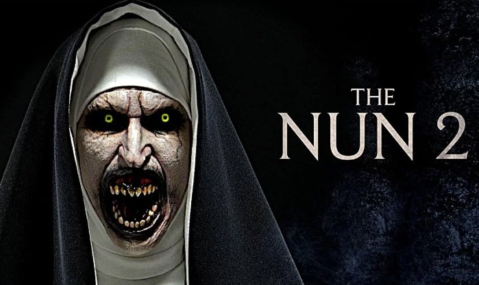

Five years after “The Nun” became the top-grossing film in “The Conjuring” series, raking in over $365 million worldwide, Sister Irene (Taissa Farmiga), our favorite demon-battling nun, is returning to face Valak (Bonnie Aarons) once more. In “The Nun II,” directed by Michael Chaves, the story picks up from the first film’s suspenseful ending, where Valak escapes from the Abbey of St. Carta in Romania by inhabiting Maurice (Jonas Bloquet) as a vessel. Chaves explained to MovieWeb that Maurice ends up in France, working as a handyman at a boarding school, but we’re aware from the previous movie that something dreadful lies within him – Valak. Events draw Irene back into a fateful reunion with her old friend.

Watch [The Nun II Movie Trailer](https://www.youtube.com/watch?v=QF-oyCwaArU)

### **No One Will Save You**

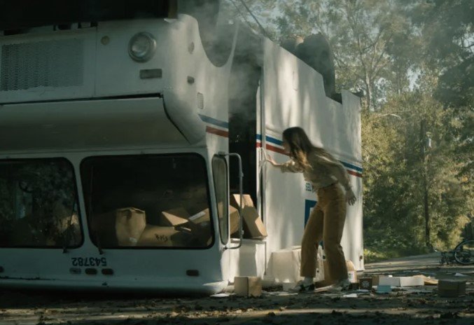

The sci-fi psychological thriller “No One Will Save You” features Kaitlyn Dever, known for her Emmy and Golden Globe nominations, in the role of Brynn Adams. Brynn is a highly anxious person who leads a sheltered life. One night, she’s startled awake by the intrusion of aliens into her home. As the night unfolds, Brynn is forced to fight for her survival against these extraterrestrial invaders in her once-safe haven. In July, the director, Brian Duffield, humorously summarized the movie on Twitter: “If you ever wanted to see a film where Kaitlyn Dever repeatedly rejects a group of aliens trying to abduct her, we’ve got that covered.

Watch [No One Will Save You Official Trailer](https://www.youtube.com/watch?v=IcA02w6rm44)

### **Saw X (In theaters Sept. 29)**

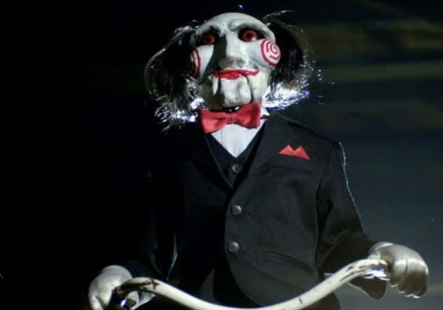

Set between the events of Saw I and II, the latest installment in the Saw series brings back Tobin Bell as the infamous Jigsaw Killer, John Kramer, for a sequel that delves into his past. Directed by Kevin Greutert, a veteran of the franchise, Saw X follows Kramer, who is terminally ill, as he travels to Mexico for an experimental medical procedure, only to discover it’s a fraudulent scheme. This doesn’t sit well with Jigsaw, prompting him to craft a series of sadistic torture traps for those who have deceived him.

Unlike previous films, this time the story is narrated from Kramer’s perspective, rather than that of his victims, as Greutert explained: “\[Saw X\] takes you on an emotional journey with John Kramer, rather than immersing you in a slaughterhouse from the victims’ point of view.” He believes it has the potential to appeal to a wider audience beyond just gore enthusiasts.

Watch [the official Saw X trailer](https://www.youtube.com/watch?v=t3PzUo4P21c)

### **Pet Sematary: Bloodlines**

Serving as a prequel to the 2019 film adaptation of Stephen King’s chilling 1983 novel, Pet Sematary, which King himself has dubbed his ‘scariest property of all time,’ Bloodlines is based on an untold chapter from the book, also penned by King. Set in 1969, the feature debut of filmmaker Lindsey Anderson Beer focuses on Jud Crandall (played by Jackson White), the elderly neighbor of the Creed Family from the original story, during his younger years when he harbored dreams of escaping his hometown, Ludlow, Maine.

Upon discovering a local cemetery with the eerie ability to bring the dead back to life, albeit with grim consequences, Jud grapples with a dark family legacy that forever binds him to Ludlow. Alongside his childhood friends, he confronts an ancient evil with the potential to obliterate everything in its path.

Watch [Pet Sematary: Bloodlines Official Trailer](https://www.youtube.com/watch?v=3pGiHwnObbQ)

### **Malibu Horror Story**

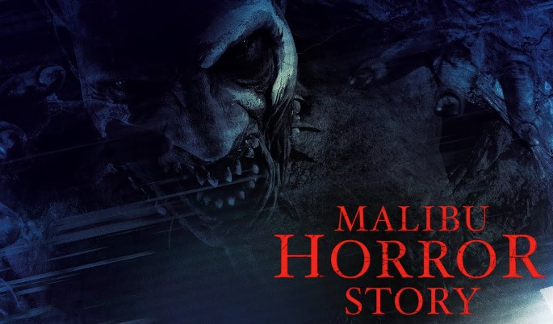

Spanning a decade, “Malibu Horror Story” chronicles the journey of a team of paranormal investigators as they delve into the mysterious vanishing of four teenagers who disappeared in the California hills after stumbling upon a sacred Indigenous cave. Written and directed by Scott Slone, this found footage film has been in the making for over ten years and sets out to offer a fresh take on the clichéd theme of haunted Native American burial grounds.

Slone explained, “Our narrative unfolds through various perspectives, timelines, and layers of media collected over numerous years. The aim was to incorporate these elements into a traditional horror movie structure, one that would not only resonate with found footage enthusiasts but also captivate a broader audience within the horror genre.

## **Famous Halloween Movies** 

### **1\. [Ghostbusters (1984)](https://www.amazon.com/Ghostbusters-Bill-Murray/dp/B000PEX1IE?tag=pur0e4-20&asc_source=purewow_web&asc_refurl=https%3A%2F%2Fwww.purewow.com%2Fentertainment%2Fbest-halloween-movies)**

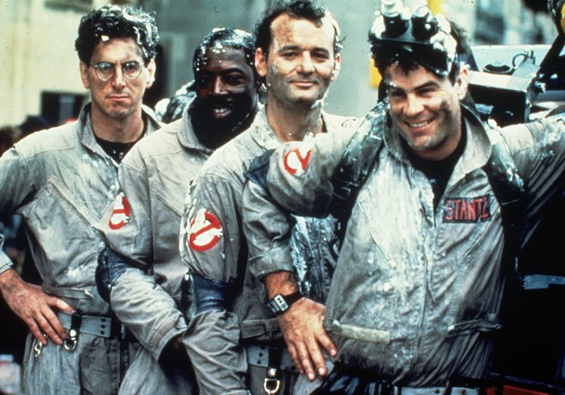

Ghostbusters is a must-watch comedy classic with a runtime of 105 minutes. Starring Bill Murray, Dan Aykroyd, and Sigourney Weaver, this film is a hilarious delight. Join a group of professors-turned-ghost removers in their paranormal adventures. If you enjoyed the 2016 version, you’re sure to love this original gem from 1984.

### **2\. [The Addams Family (1991)](https://www.amazon.com/Addams-Family-Christopher-Lloyd/dp/B000XVK30S/ref=as_li_ss_tl?ie=UTF8&linkCode=sl1&tag=pur0e4-20&linkId=6551d37920bb12a886b4394822771b33&language=en_US)**

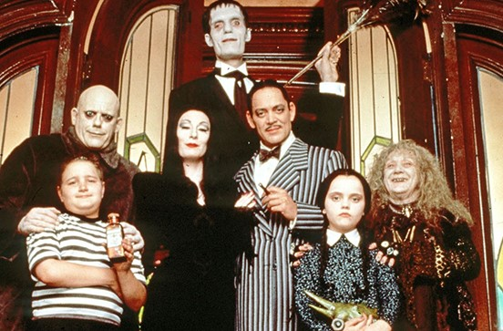

Featuring a stellar cast, including Raul Julia, Anjelica Huston, and Christopher Lloyd, this film has a runtime of 101 minutes. Anjelica Huston’s standout performance earned her an Oscar nomination. The story revolves around a group of con artists attempting to deceive the famously eccentric family. Prepare for a captivating and entertaining ride with this delightful film.

### **3\. [Scream (1996)](https://www.paramountplus.com/intl/?redirectUrl=%2Fmovies%2Fvideo%2FHHZr9_VdHqNp4OyrUILutROXwMyVmACD%2F%3Fcbsclick%3DUko2hMX6CxyNWKpRFe308Qm0UkF08u0MDw-JXo0%26vndid%3D10078%26clickid%3D10078%26sharedid%3Dseventeen.com%26ftag%3DPPM-09-10aag1f%26dclid%3DCOXVtJjXv_8CFdBZDwIdl38DuA)**

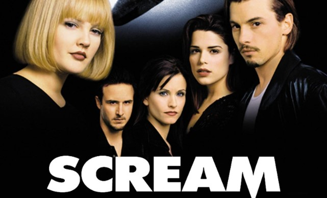

With an impressive six movies (yes, six!), the first installment stands tall as a Halloween classic. This is where it all began—the spine-chilling emergence of the Ghostface killer, who goes on a terrifying spree, targeting teenagers in a small town. Brace yourself as a courageous girl and her friends embark on a daring quest to unmask the killer, but beware, not everyone will make it out alive.

### **4\. [Zombieland (2009)](https://www.netflix.com/title/70123542)**

Set in the not-so-distant future, a mutation of mad cow disease transforms humans into zombies, unleashing chaos upon the world. Amidst this post-apocalyptic landscape, Columbus embarks on a journey across the country to reunite with his parents. Joining him is the tough and resourceful Tallahassee. However, their plans take an unexpected turn when they encounter Wichita and Little Rock, two survivors who bring new challenges and complexities to their quest for survival.

### **5\. [Hocus Pocus (1993)](https://www.preview.disneyplus.com/unavailable?irclickid=TWOUJO0vaxyPTVTTXwwkoVT0UkF08uXYDw-JXo0&irgwc=1&cid=DSS-Affiliate-Impact-Network-Skimbit+Ltd.-564546&tgclid=05010049-c17e-4b1a-bb00-0edb648815ee&dclid=CJ_FlYXYv_8CFShfDwIda3AJEg)**

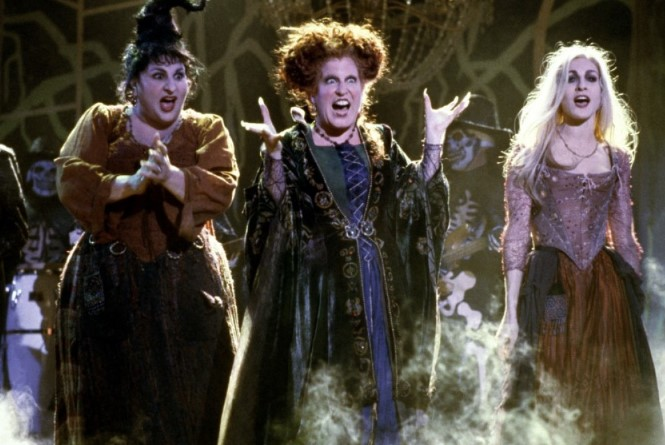

After being executed for their sorcery in 17th-century Salem, these mischievous witches resurface 300 years later. To maintain their immortality, they must extinguish the life of an innocent child. However, a group of three kids, inadvertently responsible for their revival, is determined to thwart the witches’ sinister plans and prevent Salem from reverting to its dark past.

**Related:** [Special Halloween Wedding Ideas](https://avada.io/loveable/blog/halloween-wedding-ideas/) that’ll Make Your Guests Impressed

### **6\. [The Nightmare Before Christmas (1993)](https://www.preview.disneyplus.com/unavailable?distributionPartner=google&irclickid=TWOUJO0vaxyPTVTTXwwkoVT0UkF08r3kDw-JXo0&irgwc=1&cid=DSS-Affiliate-Impact-Network-Skimbit+Ltd.-564546&tgclid=08010007-76bf-4657-8600-110564881665&dclid=CJeo9r3Yv_8CFY0FXAod_8ECnw)**

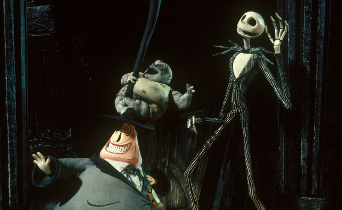

Jack Skellington, tired of Halloween, stumbles upon Christmas Town. Determined to put his own spin on the holiday, he kidnaps Santa Claus. However, Jack’s version of Christmas includes spooky surprises like shrunken heads and skeletal reindeer. This delightful tale combines the Christmas spirit with Halloween’s fun and thrills.

### **7\. [I Know What You Did Last Summer (1997)](https://www.amazon.com/Know-What-You-Last-Summer/dp/B008Y6Q6NM/?ots=1&slotNum=2&imprToken=d0c459c5-ea29-3d4c-299&linkCode=ogi&tag=seventeen_auto-append-20&ascsubtag=%5Bartid%7C10065.g.1558%5Bsrc%7Cwww.google.com%5Bch%7C%5Blt%7C%5Bpid%7C5ca1d400-2bb6-44b3-9c40-fd45bf57cf52)**

This spine-chilling film follows four friends who face the wrath of a hook-wielding stalker. It all begins one year after they concealed a tragic hit-and-run incident, resulting in the death of a man whose body they disposed of. Brace yourself for a suspenseful and thrilling ride as their past comes back to haunt them.

### **8\. [It’s the Great Pumpkin, Charlie Brown](https://tv.apple.com/us/movie/its-the-great-pumpkin-charlie-brown/umc.cmc.1c5nvp802hos5t3u0umlukkwh) (1966)**

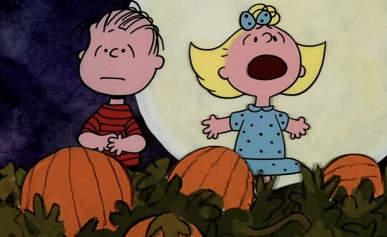

Featuring a talented cast including Peter Robbins, Christopher Shea, Kathy Steinberg, and Bill Melendez, this heartwarming film has a runtime of 96 minutes. Perfect for the whole family, join Linus as he eagerly awaits the arrival of the Great Pumpkin, even in the face of constant teasing from Lucy, Sally, and the rest of the beloved Peanuts gang.

**Related:** [Halloween Pumpkin Carving](https://avada.io/loveable/blog/halloween-pumpkin/) Ideas For 2023

### **9\. [Get Out](https://www.amazon.com/Get-Out-Daniel-Kaluuya/dp/B06Y1FYX25?tag=pur0e4-20&asc_source=purewow_web&asc_refurl=https%3A%2F%2Fwww.purewow.com%2Fentertainment%2Fbest-halloween-movies) (2017)**

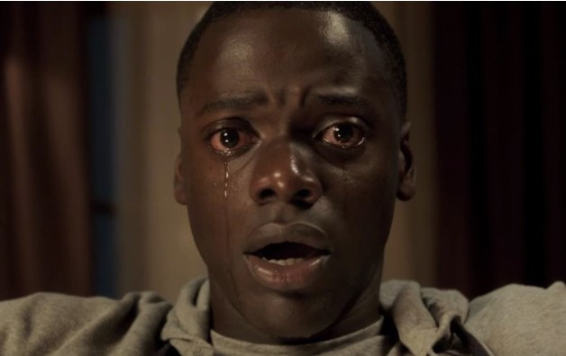

Chris embarks on a significant milestone in his relationship as he meets his girlfriend’s parents. Initially, they appear welcoming and accommodating, but he soon uncovers a chilling secret from their disturbing history. Brace yourself for a gripping and harrowing journey as Chris confronts the horrifying truth about his girlfriend’s family. 

### **10\. [The Texas Chain Saw Massacre (1974](https://www.timeout.com/movies/the-texas-chain-saw-massacre)**[)](https://www.timeout.com/movies/the-texas-chain-saw-massacre)

This year, gather the courage to experience Tobe Hooper’s underrated classic, a masterful satire of American class warfare and a chilling portrayal of teenage misadventure in the backwoods. Despite its infamous title, Texas Chainsaw Massacre is not excessively gory but stands as the scariest movie ever made.

## **Most-Watched Halloween Moivie of All Time** 

### **11\. [Young Frankenstein (1974)](https://www.hulu.com/movie/young-frankenstein-ddf6ae79-4389-4037-b502-c398a3c7af5d)**

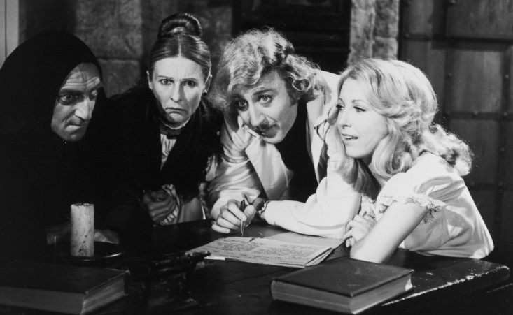

Mel Brooks directs a hilarious comedy about a scientist’s grandson who embarks on a journey to prove his grandfather’s sanity. When he visits Transylvania, he discovers his family’s legacy as he witnesses the resurrection of a dead body. 

### **12\. [Children of the Corn (1984)](https://www.amazon.com/dp/B07X9CSPHY?ots=1&slotNum=4&imprToken=92c459c9-e4c6-f217-584&linkCode=ogi&tag=countryliving_auto-append-20&ascsubtag=%5Bartid%7C10050.g.3624%5Bsrc%7Cwww.google.com%5Bch%7C%5Blt%7C%5Bpid%7C3907f23b-5cb4-4173-85bc-9df1268d3f08)**

In this film adaptation of Stephen King’s short story, a young couple finds themselves stranded in a remote Nebraska town. As they navigate their way through the vast cornfields, they stumble upon a particular religious sect consisting of children. Prepare for a suspenseful and eerie journey as they uncover the mysteries hidden within the thriving cornfields.

### **13\. [Suspiria (1977)](https://www.timeout.com/movies/suspiria)**

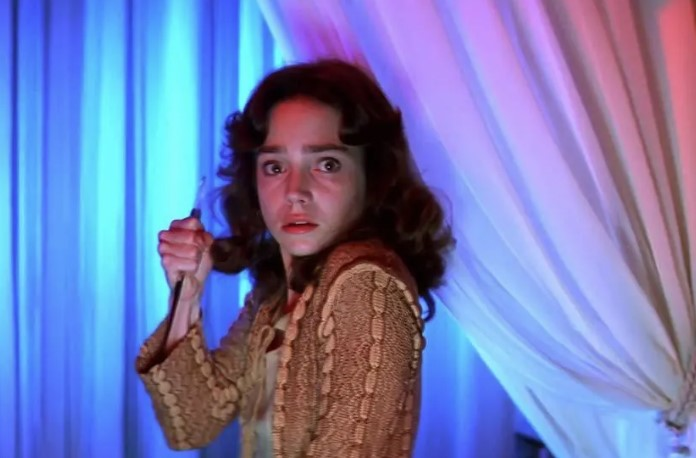

Dario Argento’s atmospheric film combines elements of fairy tales and giallo, as a timid American dancer discovers unsettling events at a European ballet academy. With striking visuals, intense death scenes, and a haunting score by Goblin, it offers a captivating and memorable cinematic experience.

**Related:** Easy [Halloween Makeup Ideas](https://avada.io/loveable/blog/easy-halloween-makeup-ideas/) To Try For 2023

### **14\. [Night of the Demons (1988)](https://www.amazon.com/Night-Demons-Hal-Havins/dp/B07SSY592Y/ref=as_li_ss_tl?ie=UTF8&linkCode=sl1&tag=pur0e4-20&linkId=e5966e5433f51ee48b8c98a1a7ba1fe1&language=en_US)**

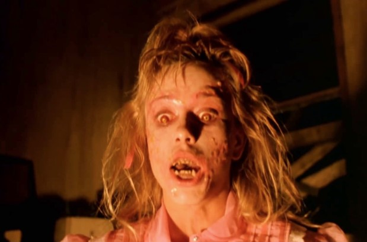

Two teenage girls decide to spook their friends by organizing a Halloween seance in an abandoned funeral parlor. Need we say more?

### **15\. [Parasite (2019)](https://www.hulu.com/movie/parasite-2fd691a0-f66b-467f-8635-00d7f151f3d4)**

This Korean horror film, which won the Best Picture Oscar in 2019, will captivate you by the halfway point. The Kim family, struggling with poverty, becomes entangled with the affluent Park family, leading to unforeseen consequences that will leave both families astonished.

### **16\. [Paranormal Activity (2007)](https://www.amazon.com/Paranormal-Activity-Katie-Featherston/dp/B00304LF0W?tag=pur0e4-20&asc_source=purewow_web&asc_refurl=https%3A%2F%2Fwww.purewow.com%2Fentertainment%2Fbest-halloween-movies)**

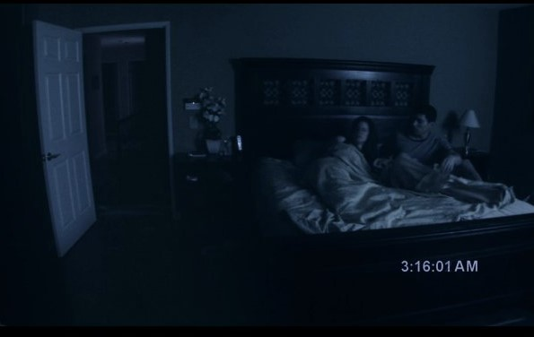

Katie and Micah are thrilled to start their new life in a new home, but their excitement quickly turns to fear when they realize they are not alone in the house.

### **17\. [Poltergeist (1982)](https://www.timeout.com/movies/poltergeist)**

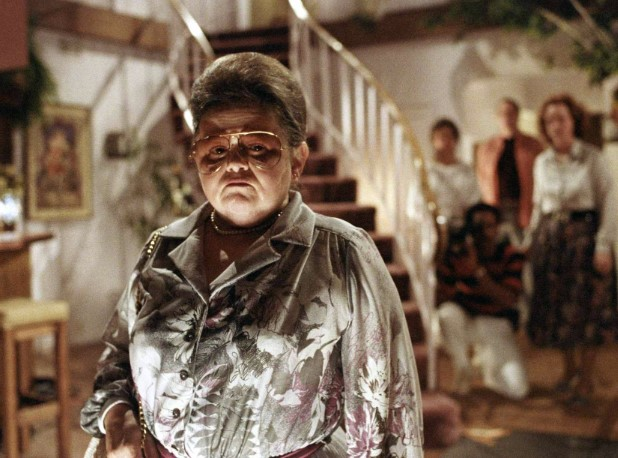

This suburban smash gives ghost stories a high-tech makeover, offering a chilling critique of materialism as your TV set becomes a devouring force. Directed by Steven Spielberg, the film features impressive production values and an unforgettable scare courtesy of a possessed toy clown.

### **18\. [The Babadook (2014)](https://amzn.to/3oz1ine)**

A single mom’s mission to help her son conquer his fear of monsters takes a terrifying turn when she confronts the sinister presence firsthand.

### **19\. [Twilight (2008)](https://go.skimresources.com/?id=74968X1525086&xs=1&url=https%3A%2F%2Fwww.hulu.com%2Fmovie%2Ftwilight-0984bd81-c037-49b1-a42a-1cbe93a1a4e9&sref=https%3A%2F%2Fwww.seventeen.com%2Flife%2Fg1558%2Fbest-halloween-movies%2F&xcust=%5Butm_source%7C%5Butm_campaign%7C%5Butm_medium%7C%5Bgclid%7C%5Bmsclkid%7C%5Bfbclid%7C%5Brefdomain%7Cwww.google.com%5Bcontent_id%7Cb2bab9a2-d6eb-4ed5-8a23-ef359bdee108%5Bcontent_product_id%7C121bec97-ff7b-4ed7-831c-35408ca55310%5Bproduct_retailer_id%7C0c297e82-9d73-4f58-a1ad-112fccecffb3%5Blt%7C)**

Twilight is a timeless classic that’s perfect for any season, but its vampires and werewolves make it particularly fitting for Halloween. With a saga of five movies, you can indulge in a complete Twilight-themed movie marathon over a weekend.

### **20\. [Interview With the Vampire: The Vampire Chronicles (1994)](https://www.amazon.com/dp/B003DDKAT2?ots=1&slotNum=5&imprToken=92c459c9-e4c6-f217-584&linkCode=ogi&tag=countryliving_auto-append-20&ascsubtag=%5Bartid%7C10050.g.3624%5Bsrc%7Cwww.google.com%5Bch%7C%5Blt%7C%5Bpid%7C49daa5c3-6cc6-4af2-864c-dfb13bc9177d)**

Based on Anne Rice’s gothic novel, this chilling film features a stellar cast including Tom Cruise, Brad Pitt, Christian Slater, and a young Kirsten Dunst, delivering a haunting experience.

### **21\. [The Thing (1982)](https://www.timeout.com/movies/the-thing)**

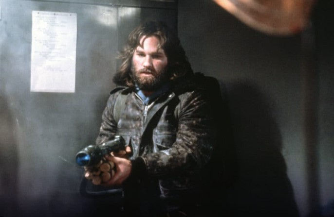

John Carpenter’s remake of The Thing outshines the original with its faithful adaptation, intense paranoia, and groundbreaking special effects by Rob Bottin.

### **22\. [Monster House (2006)](https://amzn.to/2WImNVa)**

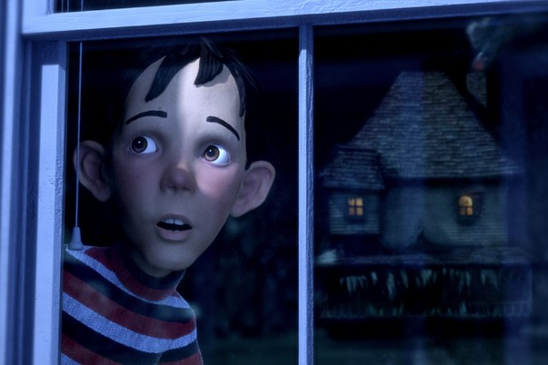

Three kids suspect a creature inhabiting the neighboring house, but their claims fall on deaf ears among the adults.

### **23\. [Hereditary (2018)](https://www.timeout.com/movies/hereditary)**

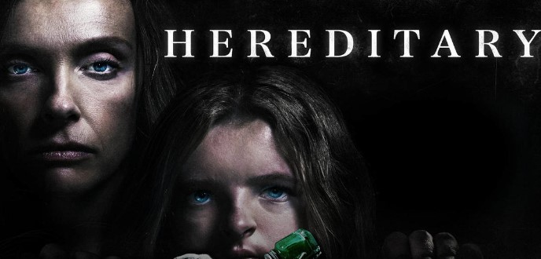

When a child’s sudden decapitation ranks as only the fourth most shocking event in a film, you know you’re witnessing a modern horror classic. Directed by Ari Aster, this deeply unsettling debut feature explores a family’s disintegration under the weight of hidden secrets. Prepare to be haunted by its disturbing impact long after the credits roll.

### **24\. [The Craft (1996)](https://amzn.to/3bb85AD)**

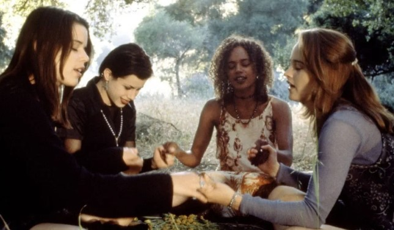

When Sarah (Robin Tunney) enrolls in a new school, she encounters a coven of witches who seek to exploit her telekinetic abilities.

### **25\. [Ghostbusters (2016)](https://www.amazon.com/gp/video/detail/amzn1.dv.gti.c2aadddb-8e5a-7cfe-3b18-4ee4ea855732?ots=1&slotNum=5&imprToken=d0c459c5-ea29-3d4c-299&autoplay=0&ref_=atv_cf_strg_wb&linkCode=ogi&tag=seventeen_auto-append-20&ascsubtag=%5Bartid%7C10065.g.1558%5Bsrc%7Cwww.google.com%5Bch%7C%5Blt%7C%5Bpid%7Cb7b5bf11-1c28-495a-8c4d-24a47a577a26)**

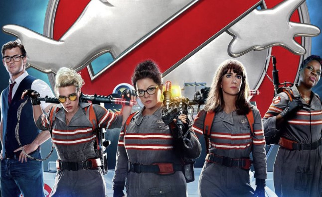

How can you make a fantastic Halloween movie like Ghostbusters even more amazing? How about a reboot featuring a group of badass women as the iconic team, with the hilarious Chris Hemsworth as their ditzy sidekick?

### **26\. [Frankenstein (1931)](https://www.amazon.com/dp/B002RXS1NQ?ots=1&slotNum=8&imprToken=92c459c9-e4c6-f217-584&linkCode=ogi&tag=countryliving_auto-append-20&ascsubtag=%5Bartid%7C10050.g.3624%5Bsrc%7Cwww.google.com%5Bch%7C%5Blt%7C%5Bpid%7Ccdbca9c7-7867-4b1d-bd02-6c983c9f4f0c)**

There’s a reason why Frankenstein is a popular Halloween costume. In this timeless 1931 film, a scientist creates a monstrous creature that ultimately leads to their own downfall.

### **27\. [Creepshow (1982)](https://www.timeout.com/movies/creepshow)**

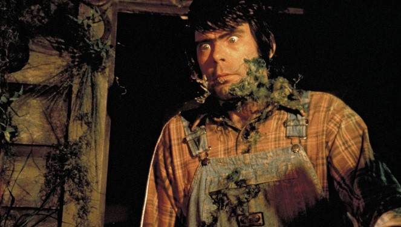

With notable appearances from talented actors like Ted Danson and Ed Harris, the film delivers a mix of humor and horror. The final segment, known for its infamous use of thousands of cockroaches, adds to the film’s memorable and unsettling atmosphere. Written by Stephen King during his peak period, “Creepshow” is a must-watch for horror enthusiasts.

### **28\. [Poltergeist](https://www.hbomax.com/feature/urn:hbo:feature:GX-y3ZgaJBMI1TwEAAAAJ) (1982)**

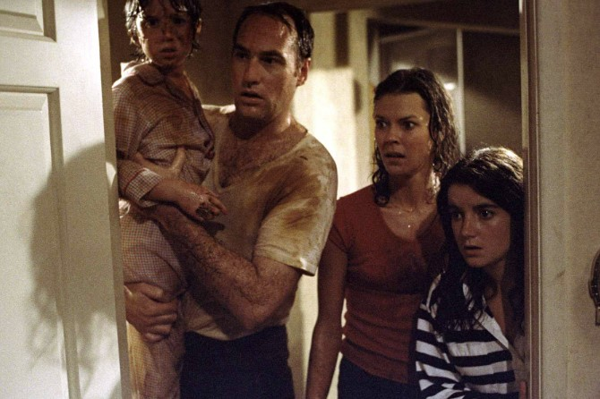

The Freeling family experiences a terrifying ordeal when they discover that ghosts can enter their home through the television set. 

### **29\. [The Sixth Sense (1999)](https://www.amazon.com/Sixth-Sense-Bruce-Willis/dp/B00X9LNFBI/?ots=1&slotNum=6&imprToken=d0c459c5-ea29-3d4c-299&linkCode=ogi&tag=seventeen_auto-append-20&ascsubtag=%5Bartid%7C10065.g.1558%5Bsrc%7Cwww.google.com%5Bch%7C%5Blt%7C%5Bpid%7C52de2146-6f50-46db-8a8e-5b1b3b49aeb2)**

No list of spooky films would be complete without mentioning The Sixth Sense. This chilling movie takes the top spot on any Halloween must-see list, as it follows a young boy who confides a supernatural secret only to his psychologist.

## **Best Jump Scare Halloween Movies**

### **30\. [The Conjuring (2013)](https://www.amazon.com/dp/B00FPH6PRK?ots=1&slotNum=9&imprToken=92c459c9-e4c6-f217-584&linkCode=ogi&tag=countryliving_auto-append-20&ascsubtag=%5Bartid%7C10050.g.3624%5Bsrc%7Cwww.google.com%5Bch%7C%5Blt%7C%5Bpid%7Ca4c9d1d7-e8d6-42e1-8f38-4322212eaec4)**

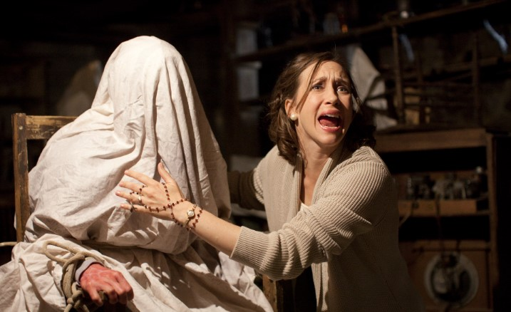

In this chilling narrative that draws inspiration from a real-life incident, Lorraine and Ed Warren, a pair of paranormal investigators, unite with a frightened family to confront a malevolent supernatural entity.

### **31\. [Alien (1979)](https://www.timeout.com/movies)**

Ridley Scott’s iconic horror masterpiece, known for its atmospheric visuals, chilling score by Jerry Goldsmith, and an oppressive sense of dread, goes beyond surface-level scares. “Alien” is a boundary-pushing sci-fi film that explores themes of sexuality and gender, transforming men into unsuspecting hosts and establishing Sigourney Weaver as an unforgettable and groundbreaking genre hero.

### **32\. [Haunt](https://amzn.to/33OQfvE) (2019)**

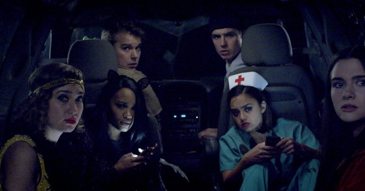

Embark on a chilling journey with a group of friends who dare to enter a legendary haunted house, only to discover that the terrifying reality surpasses the tales they’ve heard.

### **33\. [IT (2017)](https://go.skimresources.com/?id=74968X1525086&xs=1&url=https%3A%2F%2Fwww.hulu.com%2Fmovie%2Fit-73dfacd1-46f4-4c14-84a9-ed93c2ae1b12&sref=https%3A%2F%2Fwww.seventeen.com%2Flife%2Fg1558%2Fbest-halloween-movies%2F&xcust=%5Butm_source%7C%5Butm_campaign%7C%5Butm_medium%7C%5Bgclid%7C%5Bmsclkid%7C%5Bfbclid%7C%5Brefdomain%7Cwww.google.com%5Bcontent_id%7Cb2bab9a2-d6eb-4ed5-8a23-ef359bdee108%5Bcontent_product_id%7C092a3ada-abcb-4bbd-95bb-0f4704c0501a%5Bproduct_retailer_id%7C4ced181d-e447-4d1d-9601-663f66793fb7%5Blt%7C)**

The 2017 reboot of Stephen King’s spine-chilling “IT” delivers a perfect blend of laughter and terrifying moments. In the first film, a group of middle schoolers in Derry, Maine, confronts the evil shape-shifting clown, Pennywise, who emerges from the sewer every 27 years to prey on children. United by their mission to save young Georgie, a victim of Pennywise, the group forms a bond. In “IT: Chapter Two,” Pennywise resurfaces after 27 years, forcing the adult Derry losers to face their fears again.

### **34\. [Clue (1985)](https://www.amazon.com/dp/B000KWLRL4?ots=1&slotNum=11&imprToken=92c459c9-e4c6-f217-584&linkCode=ogi&tag=countryliving_auto-append-20&ascsubtag=%5Bartid%7C10050.g.3624%5Bsrc%7Cwww.google.com%5Bch%7C%5Blt%7C%5Bpid%7Cb93b88a7-239e-4ff4-b338-13e907eab927)**

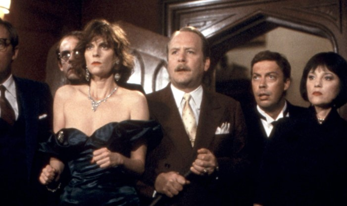

Just as entertaining as the board game, this thrilling movie revolves around a mysterious death that takes place during a dinner party. With twists and turns throughout, it keeps you guessing and even laughing until the shocking truth is revealed in the final moments.

### **35\. [The Shining (1980)](https://go.skimresources.com/?id=74968X1525086&xs=1&url=https%3A%2F%2Fwww.paramountplus.com%2Fmovies%2Fvideo%2FMnGvKKIs61XYgr0MxbbPhATmvPCYxi8Z%2F&sref=https%3A%2F%2Fwww.seventeen.com%2Flife%2Fg1558%2Fbest-halloween-movies%2F&xcust=%5Butm_source%7C%5Butm_campaign%7C%5Butm_medium%7C%5Bgclid%7C%5Bmsclkid%7C%5Bfbclid%7C%5Brefdomain%7Cwww.google.com%5Bcontent_id%7Cb2bab9a2-d6eb-4ed5-8a23-ef359bdee108%5Bcontent_product_id%7Cc3e8d86f-d664-40da-b5c2-480ada5d26b9%5Bproduct_retailer_id%7C5bf99655-91c2-4826-a2a4-d991cbdc97f5%5Blt%7C)**

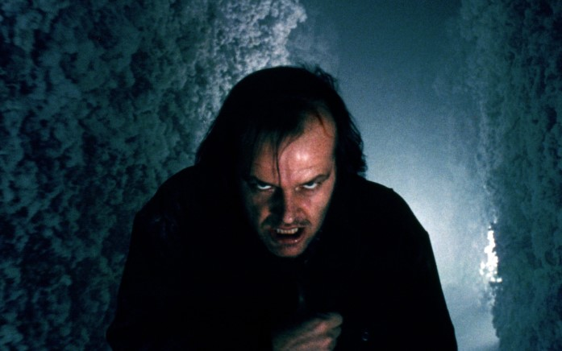

One could argue that all of Stanley Kubrick’s films are horror movies, whether it’s the chilling solitude of “2001,” the dark humor of “Dr. Strangelove,” or the deadly duels in “Barry Lyndon.” However, when Kubrick ventured into the realm of a true thriller, he paradoxically created the ultimate satirical commentary on the American family, complete with blood-filled elevators.

### **36\. [The Invitation (2015)](https://tubitv.com/movies/622282/the-invitation)**

Starring Logan Marshall-Green, Tammy Blanchard, and Michiel Huisman, this 96-minute film follows a man who discovers his ex-wife’s vengeful intentions towards him and the other guests at a dinner party.

### **37\. [Men (2022)](https://go.skimresources.com/?id=74968X1525086&xs=1&url=https%3A%2F%2Fwww.paramountplus.com%2Fmovies%2Fvideo%2FMnGvKKIs61XYgr0MxbbPhATmvPCYxi8Z%2F&sref=https%3A%2F%2Fwww.seventeen.com%2Flife%2Fg1558%2Fbest-halloween-movies%2F&xcust=%5Butm_source%7C%5Butm_campaign%7C%5Butm_medium%7C%5Bgclid%7C%5Bmsclkid%7C%5Bfbclid%7C%5Brefdomain%7Cwww.google.com%5Bcontent_id%7Cb2bab9a2-d6eb-4ed5-8a23-ef359bdee108%5Bcontent_product_id%7Cc3e8d86f-d664-40da-b5c2-480ada5d26b9%5Bproduct_retailer_id%7C5bf99655-91c2-4826-a2a4-d991cbdc97f5%5Blt%7C)**

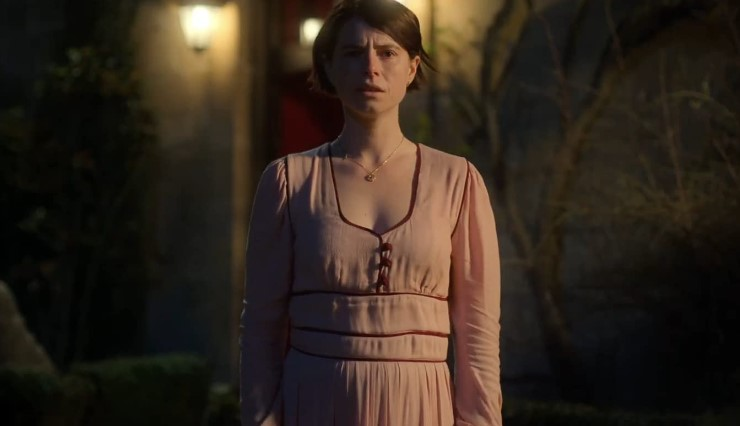

After the sudden death of her husband, Harper retreats to a secluded cottage in the English countryside. However, she soon realizes that she is not alone when she notices a mysterious man stalking her during a walk.

### **38\. [The Witches (1990)](https://www.amazon.com/dp/B002SQCR1O?ots=1&slotNum=14&imprToken=92c459c9-e4c6-f217-584&linkCode=ogi&tag=countryliving_auto-append-20&ascsubtag=%5Bartid%7C10050.g.3624%5Bsrc%7Cwww.google.com%5Bch%7C%5Blt%7C%5Bpid%7Cf4ec68fa-ed78-4df6-9f84-f38c46a9813f)**

This enchanting and popular tale revolves around a young boy who, during his adventures, stumbles upon a mysterious coven of witches. As he uncovers their sinister plans, he must summon courage and wit to outsmart them and protect himself and others.

### **39\. [28 Days Later (2002)](https://www.timeout.com/movies/28-days-later)**

Danny Boyle’s film, a captivating blend of digital video aesthetics and the chilling concept of a zombie apocalypse showcases a near-perfect portrayal of a post-traumatic stress disordered Britain. In this thrilling cinematic experience, Boyle takes us on a journey through a hauntingly empty London, where fast-running zombies become the flip side to the euphoric running of his earlier film, Trainspotting.

### **40\. [Buffy the Vampire Slayer (1992)](https://www.youtube.com/watch?v=xFFmTP0vqpU)**

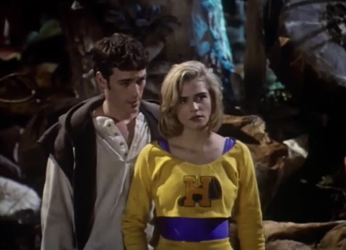

Starring Kristy Swanson, this film follows the story of a carefree teenager who unexpectedly discovers her inherent ability to combat vampires with her fearless powers. Alongside her, the popular heartthrob from Beverly Hills, 90210, Luke Perry, also graces the screen with his presence. Together, they embark on an exhilarating journey that blends teenage drama with thrilling vampire-slaying adventures.

### **41\. [Edward Scissorhands (1990)](https://go.skimresources.com/?id=74968X1525086&xs=1&url=https%3A%2F%2Fplay.max.com%2Fmovie%2Fd0055972-2ffe-4c20-ab77-ff6042cfc682&sref=https%3A%2F%2Fwww.seventeen.com%2Flife%2Fg1558%2Fbest-halloween-movies%2F&xcust=%5Butm_source%7C%5Butm_campaign%7C%5Butm_medium%7C%5Bgclid%7C%5Bmsclkid%7C%5Bfbclid%7C%5Brefdomain%7Cwww.google.com%5Bcontent_id%7Cb2bab9a2-d6eb-4ed5-8a23-ef359bdee108%5Bcontent_product_id%7Ccef97bfc-f98a-4683-99cf-29218d1859f7%5Bproduct_retailer_id%7C91d8bba5-4cd6-4596-a230-ecb58ff34fe4%5Blt%7C)**

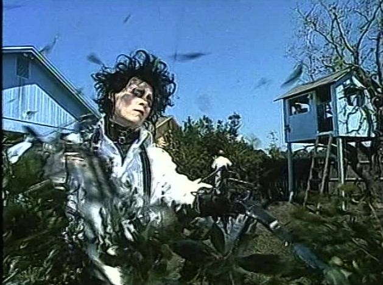

When a genius scientist dies before finishing his greatest creation, a special guy named Edward is left alone in a castle with scissors hands. But everything changes when a kind lady named Peg finds him and takes him in. At first, people accept him, but his strange look and gentle heart make him an outcast, especially when he falls in love with Peg’s daughter. Get ready for a Halloween movie that will make you cry instead of scream—it’s a touching story that will stay with you.

### **42\. [Halloween (2018)](https://www.amazon.com/dp/B07JDXGJ9Z?ots=1&slotNum=19&imprToken=92c459c9-e4c6-f217-584&linkCode=ogi&tag=countryliving_auto-append-20&ascsubtag=%5Bartid%7C10050.g.3624%5Bsrc%7Cwww.google.com%5Bch%7C%5Blt%7C%5Bpid%7C44fb96b4-aecf-45a4-88e4-a000690b028b)**

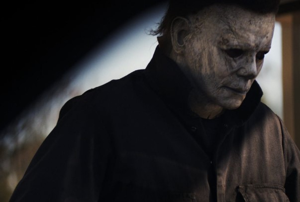

Jamie Lee Curtis returns as Laurie Strode in the 2018 installment of the beloved franchise. This film serves as a direct sequel to the original 1978 movie and is not connected to other reboots. For a complete experience, you can watch the Laurie Strode story unfold further in Halloween Kills (2021) and Halloween Ends (2022). Get ready for a thrilling Halloween marathon!

### **43\. [The Pumpkin Karver](https://go.skimresources.com/?id=27667X859343&xs=1&url=https%3A%2F%2Ftubitv.com%2Fmovies%2F491939%2Fthe_pumpkin_karver%3Futm_source%3Dgoogle-feed%26tracking%3Dgoogle-feed) (2006)**

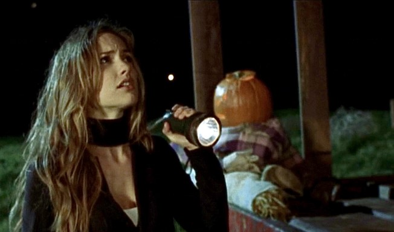

Following a Halloween prank that goes wrong, Lynn and Jonathan decide to begin anew in a different town. But their hopes for a fresh start are shattered when they discover eerie similarities to the haunting events of that fateful Halloween night. Prepare for a suspenseful journey as they find themselves trapped in a disturbing cycle of déjà vu.

### **44\. [Fantasy Island (2020)](https://www.amazon.com/Blumhouses-Fantasy-Island-Maggie-Q/dp/B084NWLTBP/?ots=1&slotNum=7&imprToken=d0c459c5-ea29-3d4c-299&linkCode=ogi&tag=seventeen_auto-append-20&ascsubtag=%5Bartid%7C10065.g.1558%5Bsrc%7Cwww.google.com%5Bch%7C%5Blt%7C%5Bpid%7C7383bdcd-9862-4424-9b9b-cf3e9aa4b5cd)**

A group of strangers is thrilled to learn that they have won the vacation they’ve always dreamed of. However, their excitement quickly turns to terror as they realize they are trapped in a nightmarish ordeal. With their lives at stake, they must find a way to escape and return home before it’s too late. 

### **45\. [The Amityville Horror (1979)](https://www.amazon.com/dp/B001NV3ZVG?ots=1&slotNum=20&imprToken=92c459c9-e4c6-f217-584&linkCode=ogi&tag=countryliving_auto-append-20&ascsubtag=%5Bartid%7C10050.g.3624%5Bsrc%7Cwww.google.com%5Bch%7C%5Blt%7C%5Bpid%7Cdf2f3141-a009-48a2-a1e7-b9f2d7565aee)**

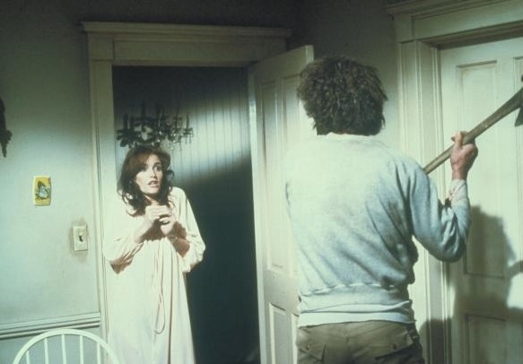

Based on a supposed true story, James Brolin and Margot Kidder take on the roles of the new owners of a house that was the site of a gruesome murder. As they settle into their new home, they soon discover that the past horrors still linger, and they must confront the chilling secrets that haunt the house.

### **46\. [The Omen (1976)](https://www.timeout.com/movies/the-omen-1)**

In Richard Donner’s blockbuster hit, every mother’s underlying concerns about their child’s future take a sinister turn when one woman discovers she is raising the literal son of Satan. This chilling tale has left an indelible mark on parents, forever causing them to question the innocence of their newborns.

### **47\. [Candyman (2021)](https://www.amazon.com/gp/video/detail/amzn1.dv.gti.3d48cf33-9020-41bf-b41e-e5b18087da78?ots=1&slotNum=8&imprToken=d0c459c5-ea29-3d4c-299&autoplay=0&ref_=atv_cf_strg_wb&linkCode=ogi&tag=seventeen_auto-append-20&ascsubtag=%5Bartid%7C10065.g.1558%5Bsrc%7Cwww.google.com%5Bch%7C%5Blt%7C%5Bpid%7C33d214b8-f36e-4f44-a89e-d48d9a2e34a4)**

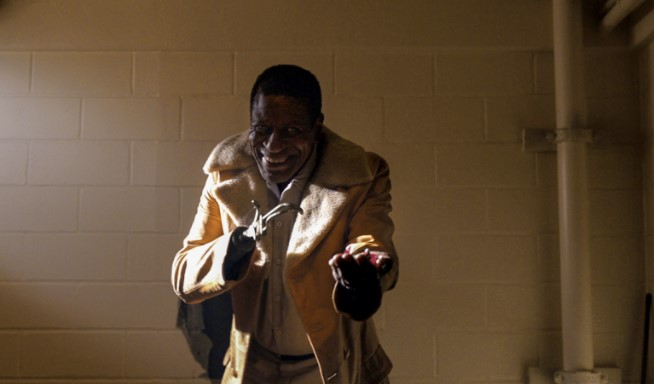

“Candyman” deserves its place among the creepiest films of all time. This gripping movie revolves around a graduate student who delves into the chilling legend of a hook-wielding killer, accompanied by swarms of bees, who materializes when his name is uttered. Prepare for a spine-tingling journey into the depths of terror and urban folklore.

### **48\. [The House Of The Devil (2010)](https://www.timeout.com/movies/the-house-of-the-devil-1)**

Director Ti West delivers a remarkable throwback to 1980s Satanic panic slashers with his unabashedly retro horror film. The attention to period details is so precise that you might mistake it for an authentic video nasty plucked from a rental store shelf in the Reagan era. 

Following a financially strapped college student who takes a babysitting gig at a sinister countryside house, the movie captures the essence of the time with pizza and solitary dance sessions accompanied by a Walkman. 

### **49\. [Us (2019)](https://www.amazon.com/Us-4K-UHD-Lupita-Nyongo/dp/B08F9Y61S8/?ots=1&slotNum=9&imprToken=d0c459c5-ea29-3d4c-299&linkCode=ogi&tag=seventeen_auto-append-20&ascsubtag=%5Bartid%7C10065.g.1558%5Bsrc%7Cwww.google.com%5Bch%7C%5Blt%7C%5Bpid%7C28f605b1-bcdf-4ec2-8411-9732e08319b0)**

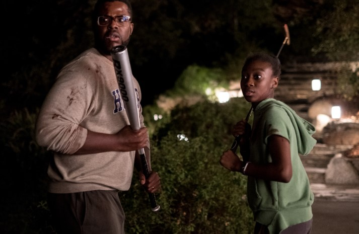

Jordan Peele’s second horror film takes viewers on a thrilling ride as a family’s peaceful vacation takes a sinister turn. When a group of doppelgängers emerges and begins to violently target them, the family must unravel the mystery behind their eerie counterparts and confront their own dark secrets.

## **Bottom Line** 

The **90 Best Halloween Movies for 2023 Watch List** offers a diverse range of spooky and thrilling films to enhance your Halloween viewing experience. From classic horror masterpieces to contemporary gems, this curated list is sure to satisfy every horror enthusiast’s craving for scares, suspense, and supernatural thrills. Whether you prefer chilling ghost stories, bone-chilling slashers, or mind-bending psychological thrillers, these movies will transport you into the captivating world of Halloween.

- [Upcoming 2023 Halloween Horror Movies](https://avada.io/loveable/blog/best-halloween-movies/#wp-block-heading-2-4)
    - [The Nun II](https://avada.io/loveable/blog/best-halloween-movies/#wp-block-heading-3-5)
    - [No One Will Save You](https://avada.io/loveable/blog/best-halloween-movies/#wp-block-heading-3-9)
    - [Saw X (In theaters Sept. 29)](https://avada.io/loveable/blog/best-halloween-movies/#wp-block-heading-3-13)
    - [Pet Sematary: Bloodlines](https://avada.io/loveable/blog/best-halloween-movies/#wp-block-heading-3-18)
    - [Malibu Horror Story](https://avada.io/loveable/blog/best-halloween-movies/#wp-block-heading-3-23)
- [Famous Halloween Movies](https://avada.io/loveable/blog/best-halloween-movies/#wp-block-heading-2-27) 
    - [1\. Ghostbusters (1984)](https://avada.io/loveable/blog/best-halloween-movies/#wp-block-heading-3-28)
    - [2\. The Addams Family (1991)](https://avada.io/loveable/blog/best-halloween-movies/#wp-block-heading-3-31)
    - [3\. Scream (1996)](https://avada.io/loveable/blog/best-halloween-movies/#wp-block-heading-3-34)
    - [4\. Zombieland (2009)](https://avada.io/loveable/blog/best-halloween-movies/#wp-block-heading-3-37)
    - [5\. Hocus Pocus (1993)](https://avada.io/loveable/blog/best-halloween-movies/#wp-block-heading-3-40)
    - [6\. The Nightmare Before Christmas (1993)](https://avada.io/loveable/blog/best-halloween-movies/#wp-block-heading-3-44)
    - [7\. I Know What You Did Last Summer (1997)](https://avada.io/loveable/blog/best-halloween-movies/#wp-block-heading-3-47)
    - [8\. It’s the Great Pumpkin, Charlie Brown (1966)](https://avada.io/loveable/blog/best-halloween-movies/#wp-block-heading-3-50)
    - [9\. Get Out (2017)](https://avada.io/loveable/blog/best-halloween-movies/#wp-block-heading-3-54)
    - [10\. The Texas Chain Saw Massacre (1974)](https://avada.io/loveable/blog/best-halloween-movies/#wp-block-heading-3-57)
- [Most-Watched Halloween Moivie of All Time](https://avada.io/loveable/blog/best-halloween-movies/#wp-block-heading-2-60) 
    - [11\. Young Frankenstein (1974)](https://avada.io/loveable/blog/best-halloween-movies/#wp-block-heading-3-61)
    - [12\. Children of the Corn (1984)](https://avada.io/loveable/blog/best-halloween-movies/#wp-block-heading-3-64)
    - [13\. Suspiria (1977)](https://avada.io/loveable/blog/best-halloween-movies/#wp-block-heading-3-67)
    - [14\. Night of the Demons (1988)](https://avada.io/loveable/blog/best-halloween-movies/#wp-block-heading-3-71)
    - [15\. Parasite (2019)](https://avada.io/loveable/blog/best-halloween-movies/#wp-block-heading-3-74)
    - [16\. Paranormal Activity (2007)](https://avada.io/loveable/blog/best-halloween-movies/#wp-block-heading-3-77)
    - [17\. Poltergeist (1982)](https://avada.io/loveable/blog/best-halloween-movies/#wp-block-heading-3-80)
    - [18\. The Babadook (2014)](https://avada.io/loveable/blog/best-halloween-movies/#wp-block-heading-3-83)
    - [19\. Twilight (2008)](https://avada.io/loveable/blog/best-halloween-movies/#wp-block-heading-3-86)
    - [20\. Interview With the Vampire: The Vampire Chronicles (1994)](https://avada.io/loveable/blog/best-halloween-movies/#wp-block-heading-3-89)
    - [21\. The Thing (1982)](https://avada.io/loveable/blog/best-halloween-movies/#wp-block-heading-3-92)
    - [22\. Monster House (2006)](https://avada.io/loveable/blog/best-halloween-movies/#wp-block-heading-3-95)
    - [23\. Hereditary (2018)](https://avada.io/loveable/blog/best-halloween-movies/#wp-block-heading-3-98)
    - [24\. The Craft (1996)](https://avada.io/loveable/blog/best-halloween-movies/#wp-block-heading-3-101)
    - [25\. Ghostbusters (2016)](https://avada.io/loveable/blog/best-halloween-movies/#wp-block-heading-3-104)
    - [26\. Frankenstein (1931)](https://avada.io/loveable/blog/best-halloween-movies/#wp-block-heading-3-107)
    - [27\. Creepshow (1982)](https://avada.io/loveable/blog/best-halloween-movies/#wp-block-heading-3-110)
    - [28\. Poltergeist (1982)](https://avada.io/loveable/blog/best-halloween-movies/#wp-block-heading-3-113)
    - [29\. The Sixth Sense (1999)](https://avada.io/loveable/blog/best-halloween-movies/#wp-block-heading-3-116)
- [Best Jump Scare Halloween Movies](https://avada.io/loveable/blog/best-halloween-movies/#wp-block-heading-2-119)
    - [30\. The Conjuring (2013)](https://avada.io/loveable/blog/best-halloween-movies/#wp-block-heading-3-120)
    - [31\. Alien (1979)](https://avada.io/loveable/blog/best-halloween-movies/#wp-block-heading-3-123)
    - [32\. Haunt (2019)](https://avada.io/loveable/blog/best-halloween-movies/#wp-block-heading-3-126)
    - [33\. IT (2017)](https://avada.io/loveable/blog/best-halloween-movies/#wp-block-heading-3-129)
    - [34\. Clue (1985)](https://avada.io/loveable/blog/best-halloween-movies/#wp-block-heading-3-132)
    - [35\. The Shining (1980)](https://avada.io/loveable/blog/best-halloween-movies/#wp-block-heading-3-135)
    - [36\. The Invitation (2015)](https://avada.io/loveable/blog/best-halloween-movies/#wp-block-heading-3-138)
    - [37\. Men (2022)](https://avada.io/loveable/blog/best-halloween-movies/#wp-block-heading-3-141)
    - [38\. The Witches (1990)](https://avada.io/loveable/blog/best-halloween-movies/#wp-block-heading-3-144)
    - [39\. 28 Days Later (2002)](https://avada.io/loveable/blog/best-halloween-movies/#wp-block-heading-3-147)
    - [40\. Buffy the Vampire Slayer (1992)](https://avada.io/loveable/blog/best-halloween-movies/#wp-block-heading-3-150)
    - [41\. Edward Scissorhands (1990)](https://avada.io/loveable/blog/best-halloween-movies/#wp-block-heading-3-153)
    - [42\. Halloween (2018)](https://avada.io/loveable/blog/best-halloween-movies/#wp-block-heading-3-156)
    - [43\. The Pumpkin Karver (2006)](https://avada.io/loveable/blog/best-halloween-movies/#wp-block-heading-3-159)
    - [44\. Fantasy Island (2020)](https://avada.io/loveable/blog/best-halloween-movies/#wp-block-heading-3-162)
    - [45\. The Amityville Horror (1979)](https://avada.io/loveable/blog/best-halloween-movies/#wp-block-heading-3-165)
    - [46\. The Omen (1976)](https://avada.io/loveable/blog/best-halloween-movies/#wp-block-heading-3-168)
    - [47\. Candyman (2021)](https://avada.io/loveable/blog/best-halloween-movies/#wp-block-heading-3-171)
    - [48\. The House Of The Devil (2010)](https://avada.io/loveable/blog/best-halloween-movies/#wp-block-heading-3-174)
    - [49\. Us (2019)](https://avada.io/loveable/blog/best-halloween-movies/#wp-block-heading-3-178)
- [Bottom Line](https://avada.io/loveable/blog/best-halloween-movies/#wp-block-heading-2-181) 

### [Blake Simpson](https://avada.io/loveable/author/blake/)

Hi, I'm Blake from Loveable. I help people find perfect gifts for occasions like anniversaries and weddings. I also write a blog about holidays, sharing insights to make them more meaningful. Let's create unforgettable moments together!

- [Twitter](https://twitter.com/intent/tweet)
- [Facebook](https://www.facebook.com/sharer/sharer.php)
- [instagram](https://avada.io/loveable/blog/best-halloween-movies/)
- [pinterest](https://www.pinterest.com/loveablellc/)

## Related Posts

[### 120+ Christian Birthday Wishes To Spread Your Love](https://avada.io/loveable/blog/christian-birthday-wishes/) 

[

### 35 Best 70th Birthday Ideas To Celebrate The Special Milestone

](https://avada.io/loveable/blog/70th-birthday-ideas/)

[

### 50 Best 30th Birthday Decorations for a Remarkable Birthday Bash

](https://avada.io/loveable/blog/30th-birthday-decorations/)

[

### 40 Delicious Vegan Christmas Desserts to Delight Your Palate

](https://avada.io/loveable/blog/vegan-christmas-desserts/)

[

### 60 Christmas Team Building Activities to Boost Workplace Spirit

](https://avada.io/loveable/blog/christmas-team-building-activities/)
