This article has been written and researched by our expert Loveable through a precise methodology. [Learn more about our methodology](https://avada.io/loveable/our-methodological.html)

[Loveable](https://avada.io/loveable/) > [Blog](https://avada.io/loveable/blog/) > [Holiday](https://avada.io/loveable/holiday/)

# 5 Absorbing Christmas Pickle Traditions that You Can’t Wait to Discover

Written by [Blake Simpson](https://avada.io/loveable/author/blake/) Last Updated on September 12, 2023

- [What is the Christmas Pickle Tradition?](https://avada.io/loveable/blog/christmas-pickle-traditions/#wp-block-heading-2-2) 
- [Origins of the Christmas Pickle Tradition](https://avada.io/loveable/blog/christmas-pickle-traditions/#wp-block-heading-2-6)
- [Where Can You Get a Christmas Pickle Ornament?](https://avada.io/loveable/blog/christmas-pickle-traditions/#wp-block-heading-2-9)
    - [1\. German traditional pickle ornament](https://avada.io/loveable/blog/christmas-pickle-traditions/#wp-block-heading-3-11)
    - [2\. Pickle ornament with cute bear’s face](https://avada.io/loveable/blog/christmas-pickle-traditions/#wp-block-heading-3-14)
    - [3\. Sliced pickle chips ornament](https://avada.io/loveable/blog/christmas-pickle-traditions/#wp-block-heading-3-17)
    - [4\. Pickle Christmas ornament with an adorable face](https://avada.io/loveable/blog/christmas-pickle-traditions/#wp-block-heading-3-20)
    - [5\. Pottery pickle ornament](https://avada.io/loveable/blog/christmas-pickle-traditions/#wp-block-heading-3-23)
    - [6\. Funny animal glass pickle ornament](https://avada.io/loveable/blog/christmas-pickle-traditions/#wp-block-heading-3-26)
    - [7\. Pickle ornament playing table tennis](https://avada.io/loveable/blog/christmas-pickle-traditions/#wp-block-heading-3-29)
    - [8\. Polymer clay pickle ornament](https://avada.io/loveable/blog/christmas-pickle-traditions/#wp-block-heading-3-32)
    - [9\. Sparkling pickle ornament](https://avada.io/loveable/blog/christmas-pickle-traditions/#wp-block-heading-3-35)
    - [10\. Hallmark pickle Christmas ornament](https://avada.io/loveable/blog/christmas-pickle-traditions/#wp-block-heading-3-38)
- [FAQs](https://avada.io/loveable/blog/christmas-pickle-traditions/#wp-block-heading-2-42)
    - [Q1: Is the Christmas Pickle Tradition only Practiced in Germany?](https://avada.io/loveable/blog/christmas-pickle-traditions/#wp-block-heading-3-43)
    - [Q2: Can I Use a Real Pickle for The Tradition?](https://avada.io/loveable/blog/christmas-pickle-traditions/#wp-block-heading-3-45)
    - [Q3: Are There Specific Rules for Hiding the Christmas Pickle?](https://avada.io/loveable/blog/christmas-pickle-traditions/#wp-block-heading-3-47)
    - [Q4: How do I Introduce the Christmas Pickle Tradition to My Family?](https://avada.io/loveable/blog/christmas-pickle-traditions/#wp-block-heading-3-49)
    - [Q5: Can the Christmas Pickle Tradition be Personalized?](https://avada.io/loveable/blog/christmas-pickle-traditions/#wp-block-heading-3-51)
- [To wrap up,](https://avada.io/loveable/blog/christmas-pickle-traditions/#wp-block-heading-2-57)

The **Christmas pickle tradition** has a fascinating origin. Legend has it that a weary and kind-hearted Civil War soldier held captive in a dungeon begged for a pickle as his last meal before being saved. To honor this tale of hope and preservation, families now hide a pickle ornament in their Christmas tree, and the sharp-eyed individual who finds it is blessed with an extra dose of good fortune for the upcoming year.

## **What is the Christmas Pickle Tradition?** 

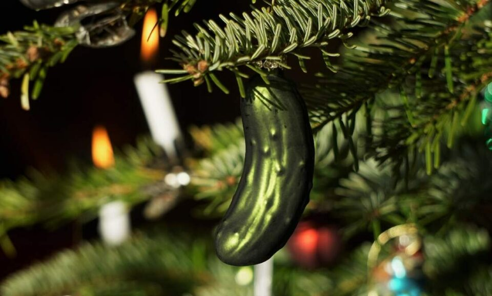

A pickle ornament gets tucked among the boughs between the time the tree is set up and December 25. The hunt starts on Christmas morning, and whoever finds the pickle receives the first present or an additional gift, as well as good luck for the rest of the year! It’s a delightfully hilarious moment that kids usually like.

Additionally, the practice encourages children to calm down and appreciate Christmas morning rather than ripping through their toys.

## **Origins of the Christmas Pickle Tradition**

Though it’s a popular misconception among Americans, this custom is known as a “Weihnachtsgurke” (Christmas Pickle in English) and is considered from Germany. It has been hypothesized that Christmas pickles might have emerged in the 1890s to correspond with the introduction of German glass ornaments for Christmas trees.

However, it has been argued that the custom originated during the American Civil War. Private John C. Lower – a Bavarian soldier who had joined the 103rd Pennsylvania Infantry, was taken prisoner in April 1864 and placed there. According to the legend, he asked a guard for a pickle on Christmas Eve because he was starving. The guard gave him the pickle, which Lower later said saved his life. After being released, he started hiding a pickle on a Christmas tree as a tradition annually.

## **Where Can You Get a Christmas Pickle Ornament?**

You can easily get a pickle ornament at every surrounding Christmas decoration store or every online base. Here are some suggestions:

### **1.** [**German traditional pickle ornament**](https://www.amazon.com/Christmas-Pickle-Ornament-Tradition-Decoration/dp/B07VZMZ69Q)

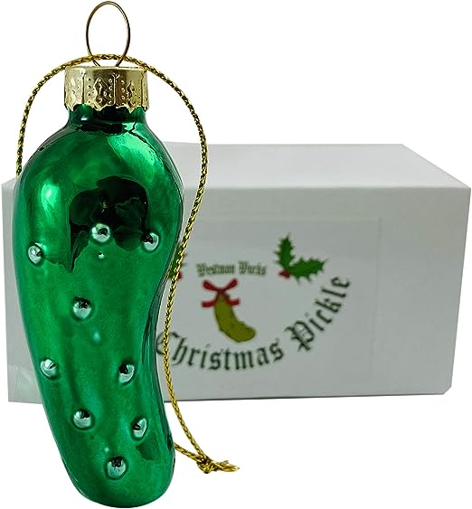

Hand-painted with meticulous care, this ornament holds the essence of centuries-old tales and heartwarming customs within its exquisite design. Its surface is adorned with delicate brushstrokes, each stroke telling a story of dedication and artistry.

### **2.** [**Pickle ornament with cute bear’s face**](https://www.amazon.com/dp/B011OTI7HS/)

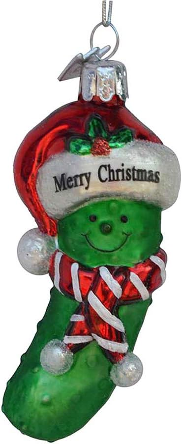

Crafted with meticulous attention to detail, this ornament captures the heartwarming essence of the season. A bright green pickle, donning a Santa hat and a playfully striped scarf, grins from ear to ear, spreading cheer to all who look at it. 

### **3.** [**Sliced pickle chips ornament**](https://www.amazon.com/Old-World-Christmas-Ornaments-Pickle/dp/B00J15GUOU)

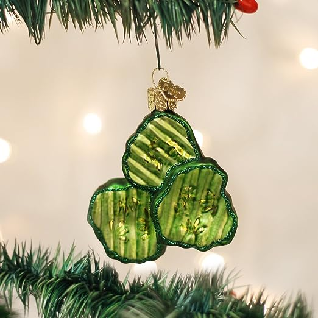

The ornament’s design, inspired by tradition, brings forth the iconic pickle chips, a symbol that resonates with many festive narratives. This design is the thrill of finding hidden treasures and the laughter that fills the air during the holiday season.

### **4\. [Pickle Christmas ornament with an adorable face](https://www.amazon.com/Tree-Buddees-Hiding-Christmas-Ornament/dp/B07D3ZG3N8/)**

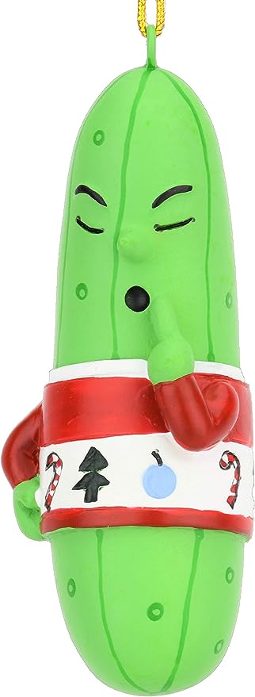

“Shh,” whispers the pickle ornament, peeking out from behind its hide-and-seek game. With a finger pressed to its lips, the pickle is determined to keep its hiding spot a secret, igniting giggles and smiles.

### **5.** [**Pottery pickle ornament**](https://www.etsy.com/listing/1134999875/ceramic-christmas-tree-pickle-ornament)

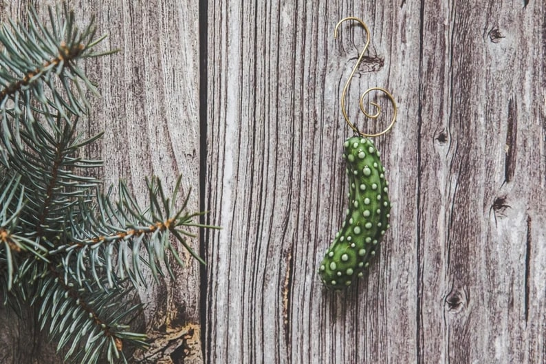

This enchanting Ceramic Pickle Ornament encapsulates the heartwarming tale of the hidden pickle, a beloved holiday custom that intrigues your festivities. As the legend goes, this ornament is hidden within the Christmas tree, and the first person to spot it receives a special blessing or an extra gift.

### **6\. [Funny animal glass pickle ornament](https://www.etsy.com/listing/1327453244/pickle-ornaments-miniature-pickle-tiny)**

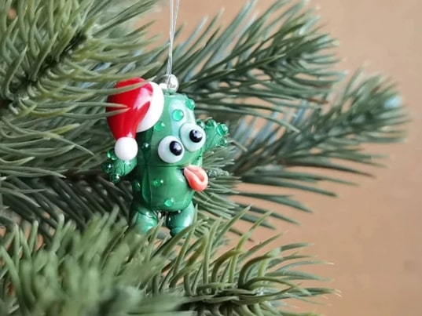

This tiny wonder brings a delightful twist to your festive decorations. This pickle ornament boasts a vibrant green hue, capturing the essence of the beloved tradition in a pint-sized package.

### **7\. [Pickle ornament playing table tennis](https://www.amazon.com/Ganz-Pickle-Ornament-Inches-Multicolor/dp/B07M5R6LKJ/ref=sr_1_12?keywords=pickle+ornament&qid=1693125804&sr=8-12)**

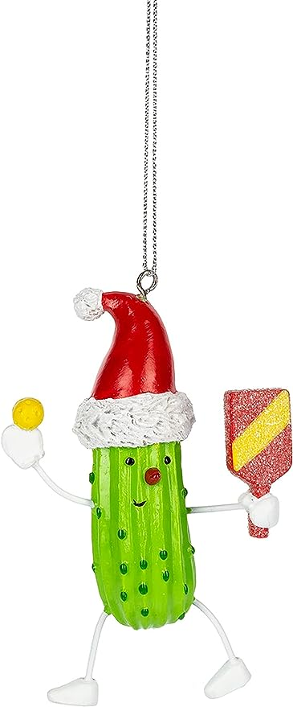

With intricate detailing and a vibrant multicolored design, this ornament is a naughty [decor for a Christmas tree](https://avada.io/loveable/blog/christmas-tree-decorating-ideas/). Crafted to perfection, it captures the essence of the beloved Christmas pickle hunt, making it a must-have for your festive decor.

### **8\. [Polymer clay pickle ornament](https://www.etsy.com/listing/664332577)**

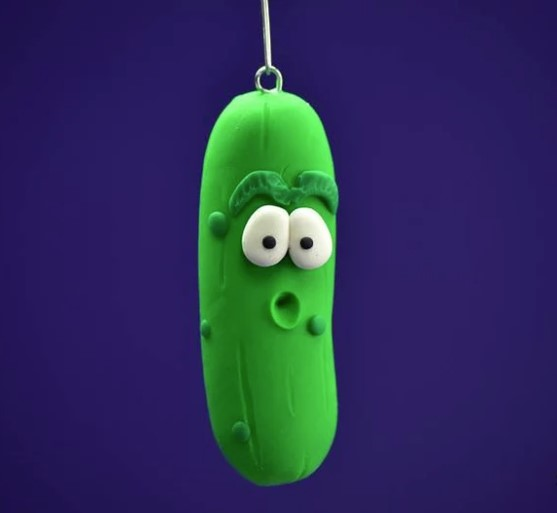

Its intricate design and attention to detail capture the essence of the timeless tradition, adding an extra layer of enchantment to your holiday festivities. Instead of glass, this ornament is made of polymer clay, adding a unique touch to your decoration.

### **9.** **[Sparkling pickle ornament](https://www.amazon.com/Old-World-Christmas-Ornaments-Glistening/dp/B002VZ9X32/)**

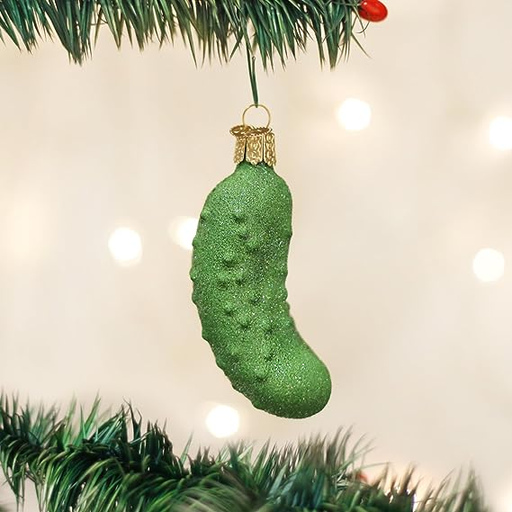

The glistening green pickle brings a unique and cherished tradition to life, making it a must-have for every holiday enthusiast.

### **10\.** [**Hallmark pickle Christmas ornament**](https://www.amazon.com/Hallmark-0001HGO3072-Pickle-Christmas-Ornament/dp/B09YT7V2TF)

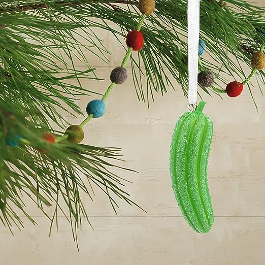

It has a decorative ribbon for easy hanging and is packaged in a protective box. The Ornament perfectly encapsulates this tradition’s spirit perfectly, making it an ideal choice for families to enhance their holiday festivities.

Furthermore, there is also a mountain of adorable items related to pickles that you will be into. If you want to get the uniqueness to your daily style with pickle details, you can discover here: [**Pickle gifts**](https://avada.io/loveable/pickle-gifts/).

## **FAQs**

### **Q1: Is the Christmas **Pickle Tradition** only Practiced in Germany?**

No. It has gained popularity in various countries, becoming a delightful addition to global Christmas celebrations.

### **Q2: Can I Use a Real Pickle for The Tradition?**

Using a glass or ornament pickle is recommended, as using a real pickle could lead to spoilage and mess. Glass or ornament pickles are safe, reusable, and suitable for hiding in the tree.

### **Q3: Are There Specific Rules for Hiding the Christmas Pickle?**

There are no strict rules for hiding the pickle, but it’s often hidden within the tree’s branches. The first person to find it is rewarded with a small gift or special privilege.

### **Q4: How do I Introduce the Christmas Pickle Tradition to My Family?**

Share the story of the Christmas pickle’s origins and the fun associated with finding it. Explain that the tradition adds an element of surprise and delight to the holiday celebration.

### **Q5: Can the Christmas Pickle Tradition be Personalized?**

Absolutely! Families can adapt the tradition to their preferences, like choosing the finder’s reward or creating additional challenges for finding the pickle.

Enjoy the happiness of unique holiday traditions with the Christmas pickle tradition, adding a playful twist to your festive celebrations.

**_See More:_**

- Best [Christmas Ornaments Diy Ideas](https://avada.io/loveable/blog/christmas-ornaments-diy/)

- Best [Paper Christmas Ornament Ideas](https://avada.io/loveable/blog/paper-christmas-ornament/)

## **To wrap up,**

The **Christmas pickle tradition** is a testament to the diversity of holiday customs worldwide. Whether you’re a staunch believer in its German origins or simply enjoy the excitement of the pickle hunt, there’s no denying the joy it brings to families during the holiday season.

This year, as you gather around the Christmas tree with your loved ones, keep an eye out for that elusive pickle ornament – who knows, you might just be the one to discover it and receive a little extra holiday magic.

- [What is the Christmas Pickle Tradition?](https://avada.io/loveable/blog/christmas-pickle-traditions/#wp-block-heading-2-2) 
- [Origins of the Christmas Pickle Tradition](https://avada.io/loveable/blog/christmas-pickle-traditions/#wp-block-heading-2-6)
- [Where Can You Get a Christmas Pickle Ornament?](https://avada.io/loveable/blog/christmas-pickle-traditions/#wp-block-heading-2-9)
    - [1\. German traditional pickle ornament](https://avada.io/loveable/blog/christmas-pickle-traditions/#wp-block-heading-3-11)
    - [2\. Pickle ornament with cute bear’s face](https://avada.io/loveable/blog/christmas-pickle-traditions/#wp-block-heading-3-14)
    - [3\. Sliced pickle chips ornament](https://avada.io/loveable/blog/christmas-pickle-traditions/#wp-block-heading-3-17)
    - [4\. Pickle Christmas ornament with an adorable face](https://avada.io/loveable/blog/christmas-pickle-traditions/#wp-block-heading-3-20)
    - [5\. Pottery pickle ornament](https://avada.io/loveable/blog/christmas-pickle-traditions/#wp-block-heading-3-23)
    - [6\. Funny animal glass pickle ornament](https://avada.io/loveable/blog/christmas-pickle-traditions/#wp-block-heading-3-26)
    - [7\. Pickle ornament playing table tennis](https://avada.io/loveable/blog/christmas-pickle-traditions/#wp-block-heading-3-29)
    - [8\. Polymer clay pickle ornament](https://avada.io/loveable/blog/christmas-pickle-traditions/#wp-block-heading-3-32)
    - [9\. Sparkling pickle ornament](https://avada.io/loveable/blog/christmas-pickle-traditions/#wp-block-heading-3-35)
    - [10\. Hallmark pickle Christmas ornament](https://avada.io/loveable/blog/christmas-pickle-traditions/#wp-block-heading-3-38)
- [FAQs](https://avada.io/loveable/blog/christmas-pickle-traditions/#wp-block-heading-2-42)
    - [Q1: Is the Christmas Pickle Tradition only Practiced in Germany?](https://avada.io/loveable/blog/christmas-pickle-traditions/#wp-block-heading-3-43)
    - [Q2: Can I Use a Real Pickle for The Tradition?](https://avada.io/loveable/blog/christmas-pickle-traditions/#wp-block-heading-3-45)
    - [Q3: Are There Specific Rules for Hiding the Christmas Pickle?](https://avada.io/loveable/blog/christmas-pickle-traditions/#wp-block-heading-3-47)
    - [Q4: How do I Introduce the Christmas Pickle Tradition to My Family?](https://avada.io/loveable/blog/christmas-pickle-traditions/#wp-block-heading-3-49)
    - [Q5: Can the Christmas Pickle Tradition be Personalized?](https://avada.io/loveable/blog/christmas-pickle-traditions/#wp-block-heading-3-51)
- [To wrap up,](https://avada.io/loveable/blog/christmas-pickle-traditions/#wp-block-heading-2-57)

### [Blake Simpson](https://avada.io/loveable/author/blake/)

Hi, I'm Blake from Loveable. I help people find perfect gifts for occasions like anniversaries and weddings. I also write a blog about holidays, sharing insights to make them more meaningful. Let's create unforgettable moments together!

- [Twitter](https://twitter.com/intent/tweet)
- [Facebook](https://www.facebook.com/sharer/sharer.php)
- [instagram](https://avada.io/loveable/blog/christmas-pickle-traditions/)
- [pinterest](https://www.pinterest.com/loveablellc/)

## Related Posts

[### 120+ Christian Birthday Wishes To Spread Your Love](https://avada.io/loveable/blog/christian-birthday-wishes/) 

[

### 35 Best 70th Birthday Ideas To Celebrate The Special Milestone

](https://avada.io/loveable/blog/70th-birthday-ideas/)

[

### 50 Best 30th Birthday Decorations for a Remarkable Birthday Bash

](https://avada.io/loveable/blog/30th-birthday-decorations/)

[

### 40 Delicious Vegan Christmas Desserts to Delight Your Palate

](https://avada.io/loveable/blog/vegan-christmas-desserts/)

[

### 60 Christmas Team Building Activities to Boost Workplace Spirit

](https://avada.io/loveable/blog/christmas-team-building-activities/)
