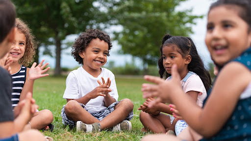
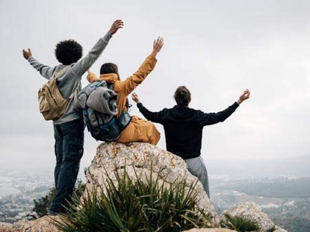
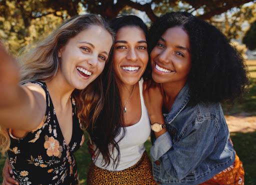
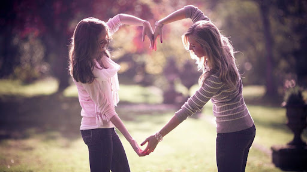
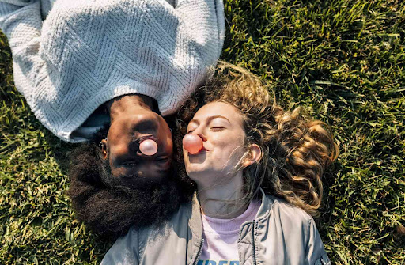
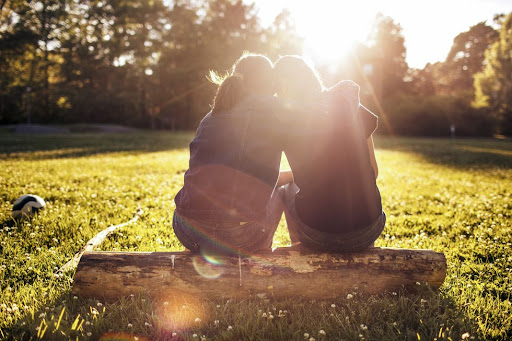
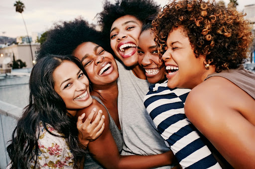
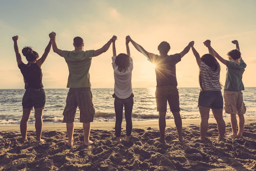

This article has been written and researched by our expert Loveable through a precise methodology. [Learn more about our methodology](https://avada.io/loveable/our-methodological.html)

[Loveable](https://avada.io/loveable/) > [Blog](https://avada.io/loveable/blog/) > [Relationship](https://avada.io/loveable/relationship/)

# 50+ Best Friend Poems to Deepen And Strengthen Relationship 

Written by [Luna Miller](https://avada.io/loveable/author/luna/) Last Updated on August 21, 2023

- [50+ Best Friend Poems to deepen and strengthen the relationship](https://avada.io/loveable/blog/best-friend-poems/#wp-block-heading-2-4)
    - [1\. A Time to Talk by Robert Frost](https://avada.io/loveable/blog/best-friend-poems/#wp-block-heading-3-5)
    - [2\. Will You Ever? by Kaitlin M. Yawn](https://avada.io/loveable/blog/best-friend-poems/#wp-block-heading-3-7)
    - [3\. A Poison Tree by William Blake](https://avada.io/loveable/blog/best-friend-poems/#wp-block-heading-3-10)
    - [4\. Alone by Maya Angelou](https://avada.io/loveable/blog/best-friend-poems/#wp-block-heading-3-12)
    - [5\. A Friend by Gillian Jones](https://avada.io/loveable/blog/best-friend-poems/#wp-block-heading-3-14)
    - [6\. Friends for Life by Angelica N. Brisset](https://avada.io/loveable/blog/best-friend-poems/#wp-block-heading-3-17)
    - [7\. To All My Friends by May Yang](https://avada.io/loveable/blog/best-friend-poems/#wp-block-heading-3-19)
    - [8\. Sonnet by04 by William Shakespeare](https://avada.io/loveable/blog/best-friend-poems/#wp-block-heading-3-21)
    - [9\. Hug ‘O War by Shel Silverstein](https://avada.io/loveable/blog/best-friend-poems/#wp-block-heading-3-23)
    - [10\. On Friendship by Khalil Gibran](https://avada.io/loveable/blog/best-friend-poems/#wp-block-heading-3-26)
    - [11\. It Would Be Water by Kathy Engel](https://avada.io/loveable/blog/best-friend-poems/#wp-block-heading-3-28)
    - [12\. The Friend by Matt Hart](https://avada.io/loveable/blog/best-friend-poems/#wp-block-heading-3-30)
    - [13\. I Love You by Roy Croft](https://avada.io/loveable/blog/best-friend-poems/#wp-block-heading-3-33)
    - [14\. We Have Been Friends Together by Caroline Elizabeth Sarah Norton](https://avada.io/loveable/blog/best-friend-poems/#wp-block-heading-3-35)
    - [15\. In the Company of Women by January Gill O’Neil](https://avada.io/loveable/blog/best-friend-poems/#wp-block-heading-3-37)
    - [16\. Red Brocade by Naomi Shihab Nye](https://avada.io/loveable/blog/best-friend-poems/#wp-block-heading-3-40)
    - [17\. Silhouette. by Janice Lobo Sapiago](https://avada.io/loveable/blog/best-friend-poems/#wp-block-heading-3-42)
    - [18\. Care and Happiness by Shishir](https://avada.io/loveable/blog/best-friend-poems/#wp-block-heading-3-44)
    - [19\. Us Two by A.A. Milne](https://avada.io/loveable/blog/best-friend-poems/#wp-block-heading-3-46)
    - [20\. The Power of the Dog by Rudyard Kipling](https://avada.io/loveable/blog/best-friend-poems/#wp-block-heading-3-49)
    - [21\. My Best Friend by Sally J. Thompson](https://avada.io/loveable/blog/best-friend-poems/#wp-block-heading-3-51)
    - [22\. Best Friend by Mizscorpio](https://avada.io/loveable/blog/best-friend-poems/#wp-block-heading-3-53)
    - [23\. Through Thick And Thin by Annie Hall](https://avada.io/loveable/blog/best-friend-poems/#wp-block-heading-3-56)
    - [24\. Best Buddies Forever by Jacqueline A. Smith](https://avada.io/loveable/blog/best-friend-poems/#wp-block-heading-3-58)
    - [25\. Our Friendship by Rogelio Morados](https://avada.io/loveable/blog/best-friend-poems/#wp-block-heading-3-61)
    - [26\. A Friend by Lisa M. Chapin](https://avada.io/loveable/blog/best-friend-poems/#wp-block-heading-3-63)
    - [27\. I’ll Be There by Nubia Valle](https://avada.io/loveable/blog/best-friend-poems/#wp-block-heading-3-65)
    - [28\. To My Treasured Friend by Alora M. Knight](https://avada.io/loveable/blog/best-friend-poems/#wp-block-heading-3-67)
    - [29\. You by Margery Wang](https://avada.io/loveable/blog/best-friend-poems/#wp-block-heading-3-70)
    - [30\. Her by Kelby And Randi](https://avada.io/loveable/blog/best-friend-poems/#wp-block-heading-3-72)
    - [31\. Forever Friends by Amber S. Pence](https://avada.io/loveable/blog/best-friend-poems/#wp-block-heading-3-74)
    - [32\. My Best Friend by Geraldine](https://avada.io/loveable/blog/best-friend-poems/#wp-block-heading-3-77)
    - [33\. Thanks To You by Elizabeth A. Nall](https://avada.io/loveable/blog/best-friend-poems/#wp-block-heading-3-79)
    - [34\. Poem About A Friend by Marilyn H. White](https://avada.io/loveable/blog/best-friend-poems/#wp-block-heading-3-81)
    - [35\. My Best Friend! by Jana C. Souder](https://avada.io/loveable/blog/best-friend-poems/#wp-block-heading-3-84)
    - [36\. When The Rain Falls Hard by Friel Grace](https://avada.io/loveable/blog/best-friend-poems/#wp-block-heading-3-86)
    - [37\. The Feeling Of Friendship by Marie Bellinger](https://avada.io/loveable/blog/best-friend-poems/#wp-block-heading-3-88)
    - [38\. Best Friends Forever by Melissa Magaliff](https://avada.io/loveable/blog/best-friend-poems/#wp-block-heading-3-91)
    - [39\. Together by Leandra Urbanek](https://avada.io/loveable/blog/best-friend-poems/#wp-block-heading-3-93)
    - [40\. Not Only My Brother But My Best Friend by Ashley O’Connor](https://avada.io/loveable/blog/best-friend-poems/#wp-block-heading-3-95)
    - [41\. My Best Friend, My Soul Mate by Mahnoor Awan](https://avada.io/loveable/blog/best-friend-poems/#wp-block-heading-3-97)
    - [42\. Having A Coke With You by Frank O’Hara](https://avada.io/loveable/blog/best-friend-poems/#wp-block-heading-3-100)
    - [43\. A Love Letter To My Best Friend by Andrew Warner](https://avada.io/loveable/blog/best-friend-poems/#wp-block-heading-3-102)
    - [44\. A Philia Love by Joann Foley](https://avada.io/loveable/blog/best-friend-poems/#wp-block-heading-3-104)
    - [45\. Your Catfish Friend by Richard Brautigan](https://avada.io/loveable/blog/best-friend-poems/#wp-block-heading-3-107)
    - [46\. Thank You by Cindy S. Baxter](https://avada.io/loveable/blog/best-friend-poems/#wp-block-heading-3-109)
    - [47\. The Best Friend Of You by Megan K. Crawford](https://avada.io/loveable/blog/best-friend-poems/#wp-block-heading-3-111)
    - [48\. Best Kinds by Alex](https://avada.io/loveable/blog/best-friend-poems/#wp-block-heading-3-113)
    - [49\. Forever And Always by Tanya M. Meadwell](https://avada.io/loveable/blog/best-friend-poems/#wp-block-heading-3-116)
    - [50\. A Friend From Afar by Natalie Gronner](https://avada.io/loveable/blog/best-friend-poems/#wp-block-heading-3-118)
    - [51\. I Am Always There – You’re Never Alone by Ashley Becker](https://avada.io/loveable/blog/best-friend-poems/#wp-block-heading-3-121)
- [Conclusion](https://avada.io/loveable/blog/best-friend-poems/#wp-block-heading-2-126)

Poems express emotions that can be difficult to put into words and make great [gifts for special occasions](https://avada.io/loveable/occasions/). It can be a challenge to find the right words to share your feelings, but with a best friend poem, it will be easier to make your friend feel special. Giving the best friend poem is an excellent way to deepen and strengthen your relationship.

Friends are basic relationships in life that everyone must get. What do you think about a life without friends? That is terrible, sure. It’s tasteless in case you don’t have anyone by your side to share achievements or even failures. To maintain these bonds, you also need many different ways to renew them to be interesting.  

The best friend poem is a suggestion. It’s the ideal approach to demonstrate to your friends that you’ll always be there for them, no matter what, whether written by you or shared by someone else. It is a beautiful way to express your feelings for your buddy. This article will leave you with some meaningful poem sources to thrill up your wonderful friends.

## **50+ Best Friend Poems to deepen and strengthen the relationship**

### **1\. A Time to Talk by Robert Frost**

It’s hard for you to have a short-break time to take a rest. What do you tend to do if you get one? Never-ending to-do lists can make it difficult to find time to catch up. However, spending time confiding with your friends is never a waste of time. Robert Frost reminds us that there are still partners ready to listen to our hearts. It would be better to share compassion. 

### **2\. Will You Ever? by Kaitlin M. Yawn**

Will You Ever? by Kaitlin M. Yawn

Have you ever done to share your compassion with your friend? This poem is to help you say that non-verbally. An artwork is created to take the tears of readers. Blessing our hearts with romantic words – This poetic work demonstrated a great deal of love and gratitude for friendship, among other things.

### **3\. A Poison Tree by William Blake**

Even the greatest friendships may be harmed by bottled-up emotions. If you’ve been pondering whether to offer up a sensitive subject with a buddy, William Blake’s poetry can help. The best way to maintain a long relationship is, to be honest, and sincere. Therefore, don’t be shy to truly talk with your friends about everything; get to know your buddy to understand and feel more comfortable when being with each other.

### **4\. Alone by Maya Angelou**

One of the most famous poems mentions the importance of bonds. Everyone requires the support of others as they travel through life instead of intending to be done alone. A companion – which cannot be bought at any price. Even the wealthiest individuals, who can purchase anything they want, require someone to accompany them on their journey; otherwise, they will get lonely. 

### **5\. A Friend by Gillian Jones**

A Friend by Gillian Jones

This brief and charming poem from Gillian Jones was written through her real experiences. Remember the beautiful moments besides bestie – a true friend is always ready to listen to the confide – a person has got through up and down together – a gift from God, is impossible to replace.No matter whether you are good or bad, rich or poor. As long as getting a call, this friend will be with you. 

### **6\. Friends for Life by Angelica N. Brisset**

“We are friends. I’ve got your back, And you have mine,” Angelica N. Brisset wrote. We are not alone, and we are together for weak moments. Don’t be fearful, and come over to welcome better things coming. It is believed that if you appear for a buddy, they will do the same for you. That is the material of which great friendships are created.

### **7\. To All My Friends by May Yang**

This thrilling poem by May Yang seems like a thank from the bottom of his heart to friends who stand by in difficult times. These people are concerned about his feelings and calm him down in aggression. Give useful advice to get through the pain. Your friends will feel what your heart is when sending them this invisible embracement. 

### **8\. Sonnet by04 by William Shakespeare**

William Shakespeare has been a familiar name for people who are keen on lyric poetry. He always provides readers with high-quality and deep artwork about love. It would be remiss not to mention this beautiful friendship work. High respect for a friend who is not a simple person but one who has followed your growth – A long-lasting relationship as a family member.

### **9\. Hug ‘O War by Shel Silverstein**

Hug ‘O War by Shel Silverstein

Initially, Silverstein tended to write Hug O’ War for children. He emphasizes the significance of being polite to people rather than striving to dominate them. However, in another aspect, it is possible to understand it as messages for friends. The simple but beautiful moments in the past are reproduced in the poem.

### **10\. On Friendship by Khalil Gibran**

What is a friend? Who is your friend? Why do we keep the friendship? All these questions are answered subtly in this artwork. He reminds the readers of one of the most important things that sometimes is underestimated by the loner. True friends don’t talk; they do. Finding a soulmate is more valuable than any treasure. 

### **11\. It Would Be Water by Kathy Engel**

Engel recalls an unexpected experience about a friend who died away in her writing about her personal sorrow. She warns us to treat our friends well and not to regret it until we can’t do it. Her elegant words reflect what it’s like to reminisce about a buddy when he/she leaves you left. As we know, those who stay are always the most miserable. 

### **12\. The Friend by Matt Hart**

The Friend by Matt Hart

Sharing a slice of chocolate cake while lying bare feet on the grass field. Hart explains all of the delightful times that make up relationships and how they form the strongest of bonds. It is certain that the two have been with each other to enjoy such feelings together. From trips to parties, your presence in my life is an indispensable part. Have you and your buddy experienced it together?

### **13\. I Love You by Roy Croft**

As its title says, you can see its romance in sending friends. Croft is frequently considered to be about a love connection in his poem. However, reading this declaration of profound love and appreciation would almost certainly link to the closest buddy. Love is not absolutely in opposite-sex love, and it can be the love for those who you respect too.

### **14\. We Have Been Friends Together by Caroline Elizabeth Sarah Norton**

Poet is very subtly when choosing tense for the title to emphasize her meaning. Present perfect tense to talk about something in the past that is still up to the present. Norton wants to maintain this relationship as long as possible and show appreciation for it. In spite of long-standing friendships, trivial disagreements can, tragically, cause them to dissolve.

### **15\. In the Company of Women by January Gill O’Neil**

Joyful excited close group of diverse friends smiling for selfie outdoors in a park

O’Neil understands that the girls can revive your soul. “Gossip isn’t a sin. It’s an art of women” do you know this idiom? Women often find it easier to share their feelings with others to get sympathy. A storyteller retells the lovely story, “I want to hoot and snort and cackle and chuckle / Let your laughter fill me like a bell.” 

### **16\. Red Brocade by Naomi Shihab Nye**

Before judging whether a person is a prospective friend, provide them assistance or hospitality. Check what your friend is before making a decision. “When a stranger appears at your door, / feed him for three days / before asking who he is, / where he’s come from, / where he’s headed.” The first look is very important to judge someone because it will stay in mind for a long time, so a brief understanding is necessary, right?

### **17\. Silhouette. by Janice Lobo Sapiago**

This poem is about Sapiago’s respect for the ladies she cherishes, and it is also a sad reminder that every connection is unique and will gradually strengthen over time.  There will be a day each other has to grow up, “more and more of my friends are becoming parents or partners to plants”. One thing that will keep inside forever is this eternal friendship.

### **18\. Care and Happiness by Shishir**

It is created to express gratitude to the closest friend as a thank for being with the poet in loneliness and sadness. Did you get support from the bottom of someone’s heart? In case you got it, the words of the poem can make you cry when you remember those moments. Came and made life cheerful and bright.

### **19\. Us Two by A.A. Milne**

Us Two by A.A. Milne

Milne’s poem tells a story about a boy’s bond with his teddy in childhood. However, the metaphorical meaning in the poem can think about close childhood friendships. The time every heart feeling is pure and unselfish affection. It is the best suitable choice for your childhood friends to remind them of the two’s carefree time.

### **20\. The Power of the Dog by Rudyard Kipling**

Some owners of the most profound connections with their pets than ever other relationships. Dogs have been well-known for being loyal so far. They are considered in the list that will never leave you alone, always by your side to listen, to accept no matter whether you are right or wrong.  Kipling expressed his disappointment in the friends who had such a short life to go with us to the end.

### **21\. My Best Friend by Sally J. Thompson**

Thompson describes the type of friendship that we always want to have from now to the future. “Whenever I am lonely, / You’re always by my side, /And when I call to you for help, / You never run or hide.” A true friend never leaves you alone if you require his/her presence. Sometimes, it’s hard to say some too romantic words to same-sex friends, but it is the fact that you need them.

### **22\. Best Friend by Mizscorpio**

Best Friend by Mizscorpio

This artwork is also written for Mizscorpio’s friends to say how they are amazing. The author’s moving narrative is about memories and experiences spent with his partners. These verses are constant affirmations of this undying friendship; borrow this non-verbal art to send to your precious friends. 

### **23\. Through Thick And Thin by Annie Hall**

Everyone has friends, no matter whether they have more or fewer. Are they ready to stand by while getting your call? Sometimes, it’s not true to judge their dignity. They don’t come, and it’s not that they don’t want to; it’s just that they can’t. You and they were once so great there is a thread that will forever bind us together. True friendship, whether close or distant, is a bond that lasts forever.

### **24\. Best Buddies Forever by Jacqueline A. Smith**

Best Buddies Forever by Jacqueline A. Smith

Smith’s words show high respect for the meeting of you and your friends. “God Sent Me You At A Moment In My Life,” a surprise from God as a special present for you. Remember that presents are always necessary things and were considered carefully by the giver. So, how about a gift from God? It is the one on top of the best treasures.

### **25\. Our Friendship by Rogelio Morados**

The poem is written in full normal words, not too sublime, but arranged suitably to thrill readers up. Sincere messages are believed to get close to your relationship. We shall always remain buddies till the end of time. Life may be difficult, but you will always have a special place in my heart. 

### **26\. A Friend by Lisa M. Chapin**

Friends help each other get through difficult times in life. This poem expresses how you feel for someone who entered your life and has been present far too many times to remember. Chapin wrote “A friend like you is hard to find”, it’s a simple thing that everyone knows, but we don’t really appreciate that. 

### **27\. I’ll Be There by Nubia Valle**

Give a heart-warming poem to your best friend to express your true friendship. “I’ll be there” is it is repeated four times as a strong promise to be with your friends. Whatever your feeling is, feeling alone or being betrayed, a hug will be done as a symbol of encouragement.

### **28\. To My Treasured Friend by Alora M. Knight**

To My Treasured Friend by Alora M. Knight

Knight compares this kind of friendship with treasure enough to understand how much he values it. The author recalled his achievement in the past, and what he appreciated the most was his friends. At a time, you will feel lonely; you will exist without them, and what you can do just reminisces about beautiful moments that have passed.

### **29\. You by Margery Wang**

The author describes his feeling as a confession, lovely and sincere. The beginning of the poem is to recall the first time meeting, shy looks because of scared about what your friend thought about you. The difficulties, obstacles, and ambitions that have been overcome have created this friendship. So it always deserves respect.

### **30\. Her by Kelby And Randi**

Look at its title; you will know that this one is for your girlfriend. An angel fallen from the sky to heal your heart is what Author wrote about this girl – a friend. This is a precious gift to the world. The importance of this relationship is truly indispensable when Kelby And Randi mentioned, “Without you, I think I would die.”

### **31\. Forever Friends by Amber S. Pence**

Forever Friends by Amber S. Pence

Any friendship is valuable and hard to find. However, we always are wise to realize those who are fake or real. When we think about each other, the distance is nothing. Are you confident that your relationship can last forever? Pence re-enacted friends together without any doubt to confide deep secrets.

### **32\. My Best Friend by Geraldine**

Geraldine wrote about her own experiences with her friend. It was amazing, it was the best, and it brought the best things for her. Using glowing reviews to describe the friend like “Angel” and “God’s Gift.” We know that it is imagination, but these words are just metaphors for showing her appreciation. One of the most important people in life seems like a family member – A best friend.

### **33\. Thanks To You by Elizabeth A. Nall**

A listener is always by your side to heal the hurt that the world has caused you. Who doesn’t like a friend like that? The one who is always ready to come and listen. It sounds simple but is really hard to find in a self-interested society. Give an acknowledgment to friends to show how they are wonderful in your life. 

### **34\. Poem About A Friend by Marilyn H. White**

Poem About A Friend by Marilyn H. White

No one in the world is fully perfect. The most important thing when finding a true friend is whether the two can accept each other, from strengths to drawbacks. Besides, trust always comes first in relationships, no doubt in helping. Like White reminded, “Accepts you as you are / Believes in you” while you get it in your relationship, congratulation, you have a great friendship.

### **35\. My Best Friend! by Jana C. Souder**

It is difficult to make a decision during important events in life, we know. At this time, no more individuals can confidently determine what is right, so it’s wonderful to have someone beside you and give useful advice. No one else, your best friend, who comprehends you clearly, sometimes it is more than parents can do. The one respects your decision without any reason and never leaves you alone despite being isolated.

### **36\. When The Rain Falls Hard by Friel Grace**

The image of heavy rain is often associated with sadness and secret things that cannot be said. While watching the rain, people often become weak and come up with negative thoughts. Does your friend accept your faults? “When you need a second chance, / I will give you mine.”. Pointing out your mistakes and helping you to correct them that’s friendship.

### **37\. The Feeling Of Friendship by Marie Bellinger**

The teenage girl shows her female friend something on her smart phone that makes both of them smile.

Friends bring special feelings that are hard to show in other people. Carefree, no calculation, no pressure. Do you get all that from your family and loved ones? “You give me so much energy it’s crazy because when I’m not with you, my body is weak and lazy.”, Bellinger wrote. That is the reason why sometimes it is more appreciated than heterosexual love.

### **38\. Best Friends Forever by Melissa Magaliff**

No matter how beautiful a friendship is, struggle and disagreement are inevitable. In some circumstances, it helps us to understand each other more, but otherwise, it will separate us and cannot attach again. Don’t let trifles cause you to lose important things. Think carefully about giving the same thought as Magaliff to your friend as an apology.

### **39\. Together by Leandra Urbanek**

Urbanek did his best to complete this poem as a gift for friends. A companion is one who has seen and gone through what you have overcome. A friend like that deserves to get compliments. “As we walk together, side by side,” let’s show your sincerity.

### **40\. Not Only My Brother But My Best Friend by Ashley O’Connor**

This poem is about a special situation in which her best friend is also her brother. We all know that saying love messages to family members is extremely hard, although it is simple, especially for a girl to her brother. In many cases, brother and sister always have agreements with other for silly reasons, but it’s certain that when one is in an emergency, the other will immediately appear to help. It will be the most bonded friendship because it is also a siblingship.

### **41\. My Best Friend, My Soul Mate by Mahnoor Awan**

My Best Friend, My Soul Mate by Mahnoor Awan

Getting through up and down moments in life – best friend. Sharing the dark side of things – best friend. Pulling you every time falling – best friend. “We are like two bodies and one soul,” a strong affirmation from Awan. 

### **42\. Having A Coke With You by Frank O’Hara**

A poem with deep meaning to your friend by Frank O’Hara. You can borrow his words to express your feelings. A voice is full of poetry and emotion. 

### **43\. A Love Letter To My Best Friend by Andrew Warner**

Love letters are essential in case you find it difficult to say love to your partner. Handwritten messages are the best way. It’s even more amazing if it is transformed into a poem. Love messages are conveyed in rhythm and echo in the mind of the reader. The best ideal poem to excite someone.

### **44\. A Philia Love by Joann Foley**

A Philia Love by Joann Foley

Foley named a special heading for the artwork. In Greek, Philia denotes intimate relationship or brotherly affection. Philia is a type of love that is founded on mutual respect, shared commitment, similar interests, and shared beliefs. It is the affection that close friends have for one another. It is one of the best friend poems to deepen and strengthen relationships. 

### **45\. Your Catfish Friend by Richard Brautigan**

The author is very subtle when bringing out the image of a catfish to write a poem about friendship. Richard Brautigan respects the beautiful affection between two separate individuals.

### **46\. Thank You by Cindy S. Baxter**

Giving praise from the bottom of my heart to your best friend, who doesn’t mind any obstruction to be with you.  “I thank you right now / for being my friend” the messages are simple but sincere. “I’m thankful you care” thanks for being a shield and inspiration and being by your side without conditions.

### **47\. The Best Friend Of You by Megan K. Crawford**

Failure is not scary; it’s scary to fail when no one is by your side. A buddy helps another person get through the difficult moments that life can often offer. “you’d never leave me standing on a corner in the rain, / you pick up the pieces when I’m going completely insane,”, it’s wonderful while we can be insane together, right!

### **48\. Best Kinds by Alex**

Best Kinds by Alex

People say that beauty is in the eye of the beholder. People who you love will be the best kind for you. You love their personality and their traits, and you love their true self. From posture to gesture, all of them are your type. Dear to your best friend, this poem expresses a huge emotion.

### **49\. Forever And Always by Tanya M. Meadwell**

“Whenever you feel sad and that no one is around / Always know I will be around,” Meadwell said, a strong promise to enhance trust. You will never be disappointed to have this amazing friend. Never alone, never isolated. Knowing that you have someone to turn to in times of need makes all the difference.

### **50\. A Friend From Afar by Natalie Gronner**

Have you dared to give thank friends who are always ready to comfort you when needing someone besides? A friend appeared in your life just when you required the most. You shall be eternally thankful for this friendship and the fantastic things and feelings he/she gave you. A valuable work borrowed from Gronner to convey your heart to your friend.

**_Related_**: [A Friend From Afar](https://www.poemhunter.com/poem/friend-from-afar/)

### **51\. I Am Always There – You’re Never Alone by Ashley Becker**

Friendship is a fair relationship in that we accept to share everything together with the same purpose of “finding pleasure.” What could be better than when we have a chance to meet like-minded people? The same purpose and same thinking; it’s great to never be lonely anymore. The world treats you badly, and friends will make up for your damage. 

**_Other poems you should read more:_**

- Best [Mother’s Day Poem](https://avada.io/loveable/mothers-day-poem/)

- Best [Poems About Retirement](https://avada.io/loveable/poems-about-retirement/)

## Conclusion

In a world where connections are cherished, Best Friend Poems symbolize appreciation and love. They encapsulate the beautiful journey of friendship – from laughter-filled memories to unwavering support during tough times. With the power to evoke emotions and touch hearts, these poems are a testament to the enduring bonds that enrich our lives.

- [50+ Best Friend Poems to deepen and strengthen the relationship](https://avada.io/loveable/blog/best-friend-poems/#wp-block-heading-2-4)
    - [1\. A Time to Talk by Robert Frost](https://avada.io/loveable/blog/best-friend-poems/#wp-block-heading-3-5)
    - [2\. Will You Ever? by Kaitlin M. Yawn](https://avada.io/loveable/blog/best-friend-poems/#wp-block-heading-3-7)
    - [3\. A Poison Tree by William Blake](https://avada.io/loveable/blog/best-friend-poems/#wp-block-heading-3-10)
    - [4\. Alone by Maya Angelou](https://avada.io/loveable/blog/best-friend-poems/#wp-block-heading-3-12)
    - [5\. A Friend by Gillian Jones](https://avada.io/loveable/blog/best-friend-poems/#wp-block-heading-3-14)
    - [6\. Friends for Life by Angelica N. Brisset](https://avada.io/loveable/blog/best-friend-poems/#wp-block-heading-3-17)
    - [7\. To All My Friends by May Yang](https://avada.io/loveable/blog/best-friend-poems/#wp-block-heading-3-19)
    - [8\. Sonnet by04 by William Shakespeare](https://avada.io/loveable/blog/best-friend-poems/#wp-block-heading-3-21)
    - [9\. Hug ‘O War by Shel Silverstein](https://avada.io/loveable/blog/best-friend-poems/#wp-block-heading-3-23)
    - [10\. On Friendship by Khalil Gibran](https://avada.io/loveable/blog/best-friend-poems/#wp-block-heading-3-26)
    - [11\. It Would Be Water by Kathy Engel](https://avada.io/loveable/blog/best-friend-poems/#wp-block-heading-3-28)
    - [12\. The Friend by Matt Hart](https://avada.io/loveable/blog/best-friend-poems/#wp-block-heading-3-30)
    - [13\. I Love You by Roy Croft](https://avada.io/loveable/blog/best-friend-poems/#wp-block-heading-3-33)
    - [14\. We Have Been Friends Together by Caroline Elizabeth Sarah Norton](https://avada.io/loveable/blog/best-friend-poems/#wp-block-heading-3-35)
    - [15\. In the Company of Women by January Gill O’Neil](https://avada.io/loveable/blog/best-friend-poems/#wp-block-heading-3-37)
    - [16\. Red Brocade by Naomi Shihab Nye](https://avada.io/loveable/blog/best-friend-poems/#wp-block-heading-3-40)
    - [17\. Silhouette. by Janice Lobo Sapiago](https://avada.io/loveable/blog/best-friend-poems/#wp-block-heading-3-42)
    - [18\. Care and Happiness by Shishir](https://avada.io/loveable/blog/best-friend-poems/#wp-block-heading-3-44)
    - [19\. Us Two by A.A. Milne](https://avada.io/loveable/blog/best-friend-poems/#wp-block-heading-3-46)
    - [20\. The Power of the Dog by Rudyard Kipling](https://avada.io/loveable/blog/best-friend-poems/#wp-block-heading-3-49)
    - [21\. My Best Friend by Sally J. Thompson](https://avada.io/loveable/blog/best-friend-poems/#wp-block-heading-3-51)
    - [22\. Best Friend by Mizscorpio](https://avada.io/loveable/blog/best-friend-poems/#wp-block-heading-3-53)
    - [23\. Through Thick And Thin by Annie Hall](https://avada.io/loveable/blog/best-friend-poems/#wp-block-heading-3-56)
    - [24\. Best Buddies Forever by Jacqueline A. Smith](https://avada.io/loveable/blog/best-friend-poems/#wp-block-heading-3-58)
    - [25\. Our Friendship by Rogelio Morados](https://avada.io/loveable/blog/best-friend-poems/#wp-block-heading-3-61)
    - [26\. A Friend by Lisa M. Chapin](https://avada.io/loveable/blog/best-friend-poems/#wp-block-heading-3-63)
    - [27\. I’ll Be There by Nubia Valle](https://avada.io/loveable/blog/best-friend-poems/#wp-block-heading-3-65)
    - [28\. To My Treasured Friend by Alora M. Knight](https://avada.io/loveable/blog/best-friend-poems/#wp-block-heading-3-67)
    - [29\. You by Margery Wang](https://avada.io/loveable/blog/best-friend-poems/#wp-block-heading-3-70)
    - [30\. Her by Kelby And Randi](https://avada.io/loveable/blog/best-friend-poems/#wp-block-heading-3-72)
    - [31\. Forever Friends by Amber S. Pence](https://avada.io/loveable/blog/best-friend-poems/#wp-block-heading-3-74)
    - [32\. My Best Friend by Geraldine](https://avada.io/loveable/blog/best-friend-poems/#wp-block-heading-3-77)
    - [33\. Thanks To You by Elizabeth A. Nall](https://avada.io/loveable/blog/best-friend-poems/#wp-block-heading-3-79)
    - [34\. Poem About A Friend by Marilyn H. White](https://avada.io/loveable/blog/best-friend-poems/#wp-block-heading-3-81)
    - [35\. My Best Friend! by Jana C. Souder](https://avada.io/loveable/blog/best-friend-poems/#wp-block-heading-3-84)
    - [36\. When The Rain Falls Hard by Friel Grace](https://avada.io/loveable/blog/best-friend-poems/#wp-block-heading-3-86)
    - [37\. The Feeling Of Friendship by Marie Bellinger](https://avada.io/loveable/blog/best-friend-poems/#wp-block-heading-3-88)
    - [38\. Best Friends Forever by Melissa Magaliff](https://avada.io/loveable/blog/best-friend-poems/#wp-block-heading-3-91)
    - [39\. Together by Leandra Urbanek](https://avada.io/loveable/blog/best-friend-poems/#wp-block-heading-3-93)
    - [40\. Not Only My Brother But My Best Friend by Ashley O’Connor](https://avada.io/loveable/blog/best-friend-poems/#wp-block-heading-3-95)
    - [41\. My Best Friend, My Soul Mate by Mahnoor Awan](https://avada.io/loveable/blog/best-friend-poems/#wp-block-heading-3-97)
    - [42\. Having A Coke With You by Frank O’Hara](https://avada.io/loveable/blog/best-friend-poems/#wp-block-heading-3-100)
    - [43\. A Love Letter To My Best Friend by Andrew Warner](https://avada.io/loveable/blog/best-friend-poems/#wp-block-heading-3-102)
    - [44\. A Philia Love by Joann Foley](https://avada.io/loveable/blog/best-friend-poems/#wp-block-heading-3-104)
    - [45\. Your Catfish Friend by Richard Brautigan](https://avada.io/loveable/blog/best-friend-poems/#wp-block-heading-3-107)
    - [46\. Thank You by Cindy S. Baxter](https://avada.io/loveable/blog/best-friend-poems/#wp-block-heading-3-109)
    - [47\. The Best Friend Of You by Megan K. Crawford](https://avada.io/loveable/blog/best-friend-poems/#wp-block-heading-3-111)
    - [48\. Best Kinds by Alex](https://avada.io/loveable/blog/best-friend-poems/#wp-block-heading-3-113)
    - [49\. Forever And Always by Tanya M. Meadwell](https://avada.io/loveable/blog/best-friend-poems/#wp-block-heading-3-116)
    - [50\. A Friend From Afar by Natalie Gronner](https://avada.io/loveable/blog/best-friend-poems/#wp-block-heading-3-118)
    - [51\. I Am Always There – You’re Never Alone by Ashley Becker](https://avada.io/loveable/blog/best-friend-poems/#wp-block-heading-3-121)
- [Conclusion](https://avada.io/loveable/blog/best-friend-poems/#wp-block-heading-2-126)

### [Luna Miller](https://avada.io/loveable/author/luna/)

I'm Luna Miller, a helpful employee at Loveable. I excel at giving great advice on birthday gifts. I love suggesting memorable experiences like concerts, spas, and getaways. As a reliable and supportive colleague, I'm always there to assist.

- [Twitter](https://twitter.com/intent/tweet)
- [Facebook](https://www.facebook.com/sharer/sharer.php)
- [instagram](https://avada.io/loveable/blog/best-friend-poems/)
- [pinterest](https://www.pinterest.com/loveablellc/)

## Related Posts

[

### 35 Unforgettable Exciting Adult Birthday Party Ideas

](https://avada.io/loveable/blog/adult-birthday-party-ideas/)

[

### 42 Best 21st Birthday Outfits to Rock the Party

](https://avada.io/loveable/blog/21st-birthday-outfits/)

[

### 50+ Happy 40th Anniversary Quotes, Messages, and Wishes

](https://avada.io/loveable/blog/happy-40th-anniversary-quotes/)

[

### 100+ Heartwarming Happy 30th Anniversary Quotes, Messages, and Wishes

](https://avada.io/loveable/blog/happy-30th-anniversary-quotes/)

[

### 120+ Heartfelt Thank You Messages for The Birthday Wishes

](https://avada.io/loveable/blog/thank-you-messages-birthday-wishes/)
