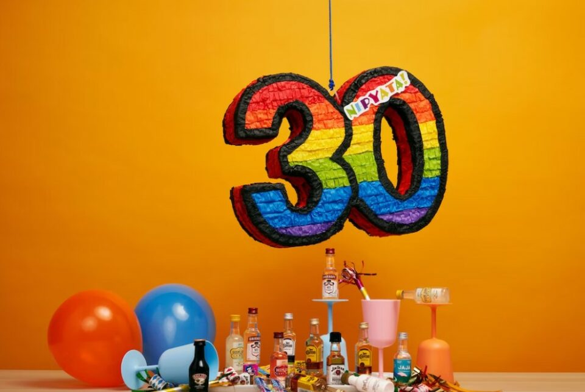
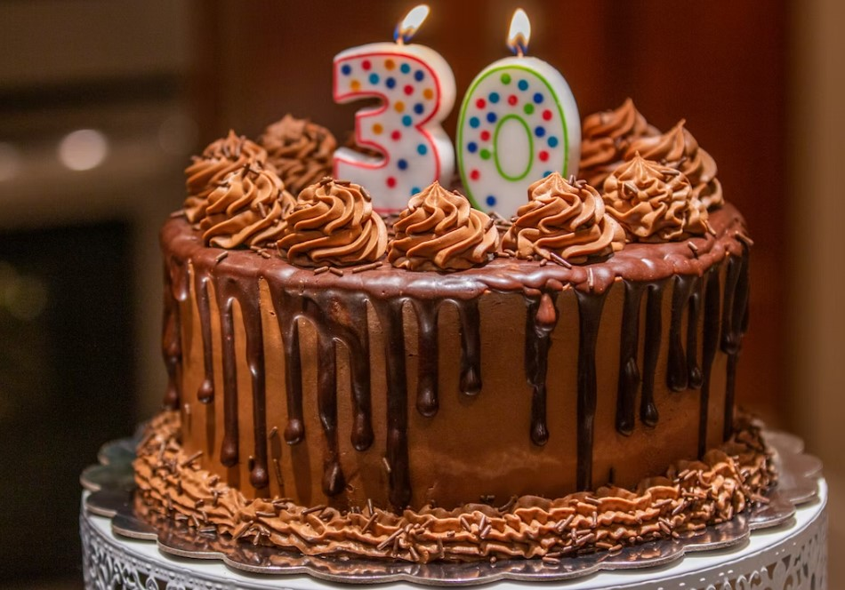
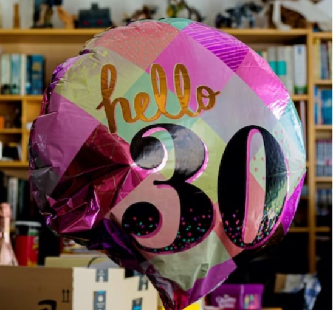

This article has been written and researched by our expert Loveable through a precise methodology. [Learn more about our methodology](https://avada.io/loveable/our-methodological.html)

[Loveable](https://avada.io/loveable/) > [Blog](https://avada.io/loveable/blog/) > [Family](https://avada.io/loveable/family/)

# 50+ Happy 30th Birthday Wishes, Messages And Quotes 

Written by [Rose Bryne](https://avada.io/loveable/author/rose/) Last Updated on August 10, 2023

- [Funny and Light-hearted Wishes For 30th Birthday](https://avada.io/loveable/blog/happy-30th-birthday/#wp-block-heading-2-3) 
- [Wishes for Women in Their 30s](https://avada.io/loveable/blog/happy-30th-birthday/#wp-block-heading-2-25)
- [Best 30th Birthday Quotes](https://avada.io/loveable/blog/happy-30th-birthday/#wp-block-heading-2-38) 
    - [Short 30th Birthday Wishes](https://avada.io/loveable/blog/happy-30th-birthday/#wp-block-heading-3-51) 
- [Bottom Line](https://avada.io/loveable/blog/happy-30th-birthday/#wp-block-heading-2-69) 

Welcome to a collection of over 90 heartfelt and joyous **30th birthday wishes**, messages, and quotes. Turning 30 is a significant milestone, marking the beginning of a new chapter filled with opportunities, growth, and adventures. In this compilation, you will find a variety of heartfelt and inspiring messages to celebrate this special occasion with your loved ones, friends, or colleagues. 

Whether you are looking for a funny quote to bring laughter or a heartfelt message to convey your love and best wishes, this collection has something for everyone. Let’s dive into this treasure trove of birthday greetings and make their 30th birthday a truly unforgettable and happy celebration. **Happy 30th Birthday!**

## **Funny and Light-hearted Wishes For 30th Birthday** 

- Happy 30th birthday! They say age is just a number, but in your case, it’s a hilarious punchline! Enjoy this milestone with a big smile and a belly full of laughter.

- Congrats on turning 30! You’re now at the age where it takes longer to recover from a night out than the actual night out. Embrace those early bedtimes and enjoy the beauty of Netflix marathons.

- Happy 30th! Remember, life is like a roller coaster—sometimes thrilling, sometimes terrifying, but always a wild ride. Strap yourself in and get ready for the adventure of your thirties!

- Cheers to 30 years of fabulousness! May your thirties be filled with less adulting and more fun, laughter, and ridiculously amazing moments. Let the good times roll!

- Happy 30th birthday! They say wisdom comes with age, but for now, let’s focus on the more important things—like finding the fountain of youth or at least a really good anti-aging cream!

- Congrats on hitting the big 3-0! It’s the perfect age where you’re still young enough to do stupid things but old enough to know better. So go ahead, make some hilariously questionable life choices!

- Happy 30th! Remember, age is just a number, but it’s a number that brings you closer to those coveted senior discounts. Embrace the perks of getting older!

- Congrats on turning 30! You’ve reached an age where you can start blaming forgetfulness on “senior moments” instead of just having a bad memory. Enjoy the benefits of selective recollection!

- Happy 30th birthday! They say life begins at 30, but so does the realization that you’re now officially a responsible adult. Just kidding! Keep that inner child alive and enjoy the ride!

- Congratulations on turning 30! Don’t worry, you’re not over the hill yet. You’re just standing at the bottom, looking up, and wondering how you’re going to climb that mountain. Good luck!

- Happy 30th! Now that you’re a fully-fledged adult, it’s time to embrace the joy of doing your taxes, paying bills, and pretending to know what you’re doing. Welcome to the world of “adulthood”!

- Congrats on reaching the big 3-0! You’ve officially entered the decade where you start using phrases like “when I was your age” and “back in my day.” Enjoy the journey of becoming a wise old soul!

- Happy 30th birthday! They say age is just a state of mind, so feel free to ignore the state of your joints and dance like nobody’s watching. Just be prepared for the consequences tomorrow!

- Congratulations on turning 30! Remember, you’re not getting older; you’re getting closer to being that cool eccentric person who has no filter and gets away with it. Embrace the freedom!

- Happy 30th! It’s time to start using words like “adulting,” “responsibility,” and “early bedtime” in your everyday vocabulary. Don’t worry, it’s not as bad as it sounds. Okay, maybe it is.

- Congrats on hitting the milestone of 30! They say age is a work of art, and you, my friend, are a masterpiece in progress. Embrace your quirks, imperfections, and awesomeness!

- Happy 30th birthday! They say life is like a box of chocolates, but at 30, you’re more like a jumbo bag of assorted candies—colorful, full of surprises, and sometimes a little nutty!

- Congratulations on turning 30! You’ve officially entered the age where you start finding random body parts hurting for no reason. Welcome to the world of mysterious aches and pains!

- Happy 30th! You know you’re getting older when you start appreciating a quiet night in over a wild night out. Embrace the joys of pajamas, Netflix, and a good cup of tea!

- Congrats on reaching the fabulous age of 30! Remember, age is just a number, and you’re rocking it like a boss. May your thirties be filled with laughter, joy, and epic adventures!

## **Wishes for Women in Their 30s**

- Happy 30th birthday! May this new decade bring you the wisdom, strength, and courage to chase your dreams fearlessly. Embrace the power and beauty that come with being a woman in your 30s.

- Congratulations on turning 30! May this milestone be the beginning of a remarkable journey filled with self-discovery, personal growth, and endless opportunities. You have so much to offer to the world, and I can’t wait to see you shine!

- Happy 30th! As you enter this exciting phase of life, may you continue to bloom and thrive like never before. May your 30s be a time of empowerment, self-love, and embracing your true worth.

- Cheers to 30 fabulous years! May your thirties be a decade of finding your voice, nurturing your passions, and building the life you’ve always envisioned. Remember, you are capable of achieving incredible things.

- Congratulations on reaching 30! May this new chapter bring you the confidence to embrace your uniqueness and celebrate your individuality. Never forget how amazing and deserving you are of all the happiness in the world.

- Happy 30th birthday! May your 30s be filled with laughter, adventure, and cherished moments with loved ones. May you continue to radiate kindness, grace, and the beautiful spirit that makes you truly exceptional.

- Cheers to the incredible woman you have become at 30! May this milestone be a reminder of your resilience, determination, and limitless potential. Embrace your strengths and let your light shine brighter than ever.

- Congratulations on entering your 30s! May this decade be a time of self-care, self-discovery, and self-love. Embrace the journey of knowing yourself deeply and embracing every aspect of who you are.

- Happy 30th! May this milestone bring you a sense of freedom, liberation, and the courage to pursue the life you’ve always envisioned. You are a force to be reckoned with, and I can’t wait to witness the incredible things you’ll achieve.

- Cheers to 30 years of resilience, growth, and grace! May your 30s be a time of embracing your passions, pursuing your dreams, and surrounding yourself with love and positivity. Remember, the best is yet to come!

**Suggestion for You:** Best [Gifts for Women In Their 30s](https://avada.io/loveable/gifts-for-women-in-their-30s/)

## **Best 30th Birthday Quotes** 

- “After 30, a body has a mind of its own.” — Bette Midler
- “When you turn 30, a whole new thing happens: you see yourself acting like your parents.” — Blair Sabol
- “The only time you really live fully is from thirty to sixty. The young are slaves to dreams; the old servants of regrets. Only the middle-aged have all their five senses in the keeping of their wits.” — Hervey Allen
- “Thirty was so strange for me. I’ve had to come to terms with the fact that I’m now a walking and talking adult.” — C.S. Lewis
- “Inside every 30 year old is an 18 year old asking what happened?” — Ann Landers
- “At 30 you finally start to catch up on those dreams you’ve been chasing for the last 10 plus years.” — Bonidette Lanz
- “At 20 years of age, the will reigns; at 30, the wit; and at 40, the judgment.” — Benjamin Franklin
- “The excess of our youth are checks written against our age, and they are payable with interest 30 years later.” — Charles Caleb Colton
- “Everything I know I learned after I was 30.” — Georges Clemenceau
- “Age is strictly a case of mind over matter. If you don’t mind, it doesn’t matter.” — Jack Benny
- “Time and tide wait for no man, but time always stands still for a woman of thirty.” — Robert Frost

### **Short 30th Birthday Wishes** 

- Don’t think of it as turning 30. We’re here to celebrate the 10th anniversary of your 20th birthday.

- Welcome to your 30s, where you know slightly more than you did in your 20s. Happy 30th!

- You’re 30 years old? You’re 3 perfect 10s! Happy birthday.

- Welcome to 30! The age when you should know better, but really don’t!
- When high schoolers start looking like preschoolers to you… you might be a 30-year-old. Happy Birthday!

- Congratulations on being one year closer to a senior citizen’s discount for all your tickets.

- Happy first anniversary of your 29th birthday.

- It could be worse, you could be turning 31…

- The biggest difference between your 20s and 30s is that your body doesn’t bounce back as quickly, so be nice to yourself! Happy 30th Birthday!

- Have fun on your birthday, but don’t get too crazy. Remember that you can’t blame your irresponsible behavior on “being in your 20s” anymore.

- Enjoy your 30th birthday, if such a thing is possible.

- Aren’t you a little glad to be out of the turbulent 20s? Make way for a superior decade! Happy 30th!

- I wanted to get you a birthday cake but I couldn’t afford that many candles! Have a good one anyway!

- Happy 30th Birthday, only 35 more years of working and you can retire.

- The excess of our youth are checks written against our age, and they are payable with interest 30 years later. — Charles Caleb Colton

- Age is strictly a case of mind over matter. If you don’t mind, it doesn’t matter. — Jack Benny

- Time and tide wait for no man, but time always stands still for a woman of thirty. — Robert Frost

## **Bottom Line** 

This collection of happy **30th birthday wishes**, messages, and quotes serves as a tribute to the milestone of turning 30. With a mix of humor, wisdom, and heartfelt sentiments, these messages aim to bring joy and celebration to those entering their thirties. Whether you’re looking for a funny remark to lighten the mood or a thoughtful message to inspire and uplift, this compilation offers a wide range of expressions to convey your warm wishes. May these words of congratulations and encouragement bring a smile to the faces of those celebrating their 30th birthday, marking the beginning of an exciting new chapter filled with growth, opportunities, and unforgettable experiences.

- [Funny and Light-hearted Wishes For 30th Birthday](https://avada.io/loveable/blog/happy-30th-birthday/#wp-block-heading-2-3) 
- [Wishes for Women in Their 30s](https://avada.io/loveable/blog/happy-30th-birthday/#wp-block-heading-2-25)
- [Best 30th Birthday Quotes](https://avada.io/loveable/blog/happy-30th-birthday/#wp-block-heading-2-38) 
    - [Short 30th Birthday Wishes](https://avada.io/loveable/blog/happy-30th-birthday/#wp-block-heading-3-51) 
- [Bottom Line](https://avada.io/loveable/blog/happy-30th-birthday/#wp-block-heading-2-69) 

### [Rose Bryne](https://avada.io/loveable/author/rose/)

Hi, I'm Rose! I love animals and spending time with kids. At Loveable, I help people find unique gifts for special occasions like Valentine's Day, housewarmings, and graduations. I enjoy finding gifts for kids, teens, and animal lovers that match their interests and personalities. Making gift-giving a pleasant experience is my priority. Let me assist you in finding the perfect gift!

- [Twitter](https://twitter.com/intent/tweet)
- [Facebook](https://www.facebook.com/sharer/sharer.php)
- [instagram](https://avada.io/loveable/blog/happy-30th-birthday/)
- [pinterest](https://www.pinterest.com/loveablellc/)

## Related Posts

[### 30 Best 4 Year Old Birthday Party Ideas For A Memorable Celebration](https://avada.io/loveable/blog/4-year-old-birthday-party-ideas/) 

[

### 16th Birthday Party Ideas to Make an Unforgettable Day

](https://avada.io/loveable/blog/16th-birthday-party-ideas/)

[

### 150+ Inspirational Birthday Quotes to Spread Joy on Special Day

](https://avada.io/loveable/blog/inspirational-birthday-quotes/)

[

### 160+ Birthday Wishes for Wife to Express Eternal Love

](https://avada.io/loveable/blog/birthday-wishes-for-wife/)

[### 90+ Heart Touching Birthday Wishes for Niece to Make Her Day Extra Special](https://avada.io/loveable/blog/birthday-wishes-for-niece/)
