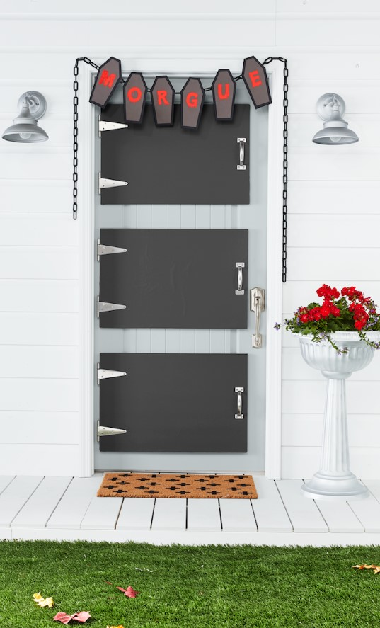

This article has been written and researched by our expert Loveable through a precise methodology. [Learn more about our methodology](https://avada.io/loveable/our-methodological.html)

[Loveable](https://avada.io/loveable/) > [Blog](https://avada.io/loveable/blog/) > [Holiday](https://avada.io/loveable/holiday/)

# 50+ Outdoor Halloween Decoration Ideas for Spooky Parties in 2023

Written by [Blake Simpson](https://avada.io/loveable/author/blake/) Last Updated on September 12, 2023

- [Spooky Outdoor Halloween Decor Ideas](https://avada.io/loveable/blog/outdoor-halloween-decoration-ideas/#wp-block-heading-2-4)
    - [1\. Skeleton Family Personalized Halloween Doormats](https://avada.io/loveable/blog/outdoor-halloween-decoration-ideas/#wp-block-heading-3-6)
    - [2\. Large Size Halloween Monster Face Archway Outdoor Decor With LED Eyes](https://avada.io/loveable/blog/outdoor-halloween-decoration-ideas/#wp-block-heading-3-9)
    - [3\. Fun Little Toys Halloween Scary Skeleton Curtain Door Cover](https://avada.io/loveable/blog/outdoor-halloween-decoration-ideas/#wp-block-heading-3-12)
    - [4\. Halloween Bats Garage Door Decorations](https://avada.io/loveable/blog/outdoor-halloween-decoration-ideas/#wp-block-heading-3-15)
    - [5\. Halloween Skeleton Garage Door Magnetic Sticker](https://avada.io/loveable/blog/outdoor-halloween-decoration-ideas/#wp-block-heading-3-18)
    - [6\. Halloween Lightshow Projection-Whirl-a-Motion Nightmare Before Christmas](https://avada.io/loveable/blog/outdoor-halloween-decoration-ideas/#wp-block-heading-3-21)
    - [7\. 9-Foot Animated Fire and Ice Dragon With Wings](https://avada.io/loveable/blog/outdoor-halloween-decoration-ideas/#wp-block-heading-3-24)
    - [8\. 8-Foot Halloween Inflatables Ghost Decoration](https://avada.io/loveable/blog/outdoor-halloween-decoration-ideas/#wp-block-heading-3-27)
    - [9\. Halloween Balloon Garland Arch](https://avada.io/loveable/blog/outdoor-halloween-decoration-ideas/#wp-block-heading-3-30)
    - [10\. 6-Foot Halloween Inflatable Scarecrow With Pumpkins and Built-In LEDs](https://avada.io/loveable/blog/outdoor-halloween-decoration-ideas/#wp-block-heading-3-33)
    - [11\. Demon’s Huge Eyes Blow-Up Yard Decoration With LED Lights](https://avada.io/loveable/blog/outdoor-halloween-decoration-ideas/#wp-block-heading-3-36)
    - [12\. LED Ghost Yard Stakes](https://avada.io/loveable/blog/outdoor-halloween-decoration-ideas/#wp-block-heading-3-39)
    - [13\. Haunted House Personalized Magnetic Garden Sign](https://avada.io/loveable/blog/outdoor-halloween-decoration-ideas/#wp-block-heading-3-42)
    - [14\. Twinkle Star Halloween Decorations Jack-o’-Lantern Garden Stakes](https://avada.io/loveable/blog/outdoor-halloween-decoration-ideas/#wp-block-heading-3-45)
    - [15\. Bloem Spooky Flamingo Plastic Halloween Yard Decor](https://avada.io/loveable/blog/outdoor-halloween-decoration-ideas/#wp-block-heading-3-48)
    - [16\. Halloween Glow-in-the-Dark Skeleton Flamingo Yard Decorations](https://avada.io/loveable/blog/outdoor-halloween-decoration-ideas/#wp-block-heading-3-51)
    - [17\. Halloween Decorations Outdoor Light-Up Skeleton Arm Decorations](https://avada.io/loveable/blog/outdoor-halloween-decoration-ideas/#wp-block-heading-3-54)
    - [18\. Yard Stake Witch Feet Halloween Decorative Holiday Scene Prop](https://avada.io/loveable/blog/outdoor-halloween-decoration-ideas/#wp-block-heading-3-57)
    - [19\. 63-Inch Halloween Realistic Hairy Spiders](https://avada.io/loveable/blog/outdoor-halloween-decoration-ideas/#wp-block-heading-3-60)
    - [20\. Halloween Decorations Skeleton Stakes](https://avada.io/loveable/blog/outdoor-halloween-decoration-ideas/#wp-block-heading-3-63)
    - [21\. Hanging Ghost Outdoor Halloween Decorations](https://avada.io/loveable/blog/outdoor-halloween-decoration-ideas/#wp-block-heading-3-66)
    - [22\. Halloween Animated Hanging Grim Reaper](https://avada.io/loveable/blog/outdoor-halloween-decoration-ideas/#wp-block-heading-3-69)
    - [23\. Halloween Yard Signs](https://avada.io/loveable/blog/outdoor-halloween-decoration-ideas/#wp-block-heading-3-72)
    - [24\. 12-Foot Giant Halloween Inflatables Stacked Pumpkins With Witch Hat](https://avada.io/loveable/blog/outdoor-halloween-decoration-ideas/#wp-block-heading-3-75)
    - [25\. 4-Foot Giant Spider and Colorful Hairy Spider With Red Eyes for Yard](https://avada.io/loveable/blog/outdoor-halloween-decoration-ideas/#wp-block-heading-3-78)
- [DIY Outdoor Halloween Decorations](https://avada.io/loveable/blog/outdoor-halloween-decoration-ideas/#wp-block-heading-2-81)
    - [1\. Grainsack Porch Display](https://avada.io/loveable/blog/outdoor-halloween-decoration-ideas/#wp-block-heading-3-83)
    - [2\. Crock, Pumpkin, and Mum Display](https://avada.io/loveable/blog/outdoor-halloween-decoration-ideas/#wp-block-heading-3-86)
    - [3\. Gnome House Pumpkin](https://avada.io/loveable/blog/outdoor-halloween-decoration-ideas/#wp-block-heading-3-89)
    - [4\. Leaf Motif Pumpkins](https://avada.io/loveable/blog/outdoor-halloween-decoration-ideas/#wp-block-heading-3-92)
    - [5\. Natural Leaf Pumpkins](https://avada.io/loveable/blog/outdoor-halloween-decoration-ideas/#wp-block-heading-3-95)
    - [6\. Painted Faux Bois Pumpkin](https://avada.io/loveable/blog/outdoor-halloween-decoration-ideas/#wp-block-heading-3-98)
    - [7\. Etched Vine Topiary Pumpkin](https://avada.io/loveable/blog/outdoor-halloween-decoration-ideas/#wp-block-heading-3-101)
    - [8\. Silvered Leaves Pumpkin](https://avada.io/loveable/blog/outdoor-halloween-decoration-ideas/#wp-block-heading-3-104)
    - [9\. Bittersweet Vine-Wrapped Pumpkins](https://avada.io/loveable/blog/outdoor-halloween-decoration-ideas/#wp-block-heading-3-107)
    - [10\. Spiderweb Wreath](https://avada.io/loveable/blog/outdoor-halloween-decoration-ideas/#wp-block-heading-3-110)
    - [11\. Butter Churn Pumpkin](https://avada.io/loveable/blog/outdoor-halloween-decoration-ideas/#wp-block-heading-3-113)
    - [12\. Vintage Halloween Mask Wreath](https://avada.io/loveable/blog/outdoor-halloween-decoration-ideas/#wp-block-heading-3-116)
    - [13\. Pumpkin Basket](https://avada.io/loveable/blog/outdoor-halloween-decoration-ideas/#wp-block-heading-3-119)
    - [14\. Balloon Spider](https://avada.io/loveable/blog/outdoor-halloween-decoration-ideas/#wp-block-heading-3-122)
    - [15\. Candy Wreath](https://avada.io/loveable/blog/outdoor-halloween-decoration-ideas/#wp-block-heading-3-125)
    - [16\. Bookish Outdoor Halloween Decorations](https://avada.io/loveable/blog/outdoor-halloween-decoration-ideas/#wp-block-heading-3-128)
    - [17\. Pumpkin Checkers](https://avada.io/loveable/blog/outdoor-halloween-decoration-ideas/#wp-block-heading-3-131)
    - [18\. Broom Halloween Door Decorations](https://avada.io/loveable/blog/outdoor-halloween-decoration-ideas/#wp-block-heading-3-134)
    - [19\. Simple & Sophisticated Halloween Decorations](https://avada.io/loveable/blog/outdoor-halloween-decoration-ideas/#wp-block-heading-3-137)
    - [20\. Morgue Door Decorations](https://avada.io/loveable/blog/outdoor-halloween-decoration-ideas/#wp-block-heading-3-140)
- [Cheap DIY Outdoor Halloween Decoration](https://avada.io/loveable/blog/outdoor-halloween-decoration-ideas/#wp-block-heading-2-143)
    - [1\. Ghost Logs](https://avada.io/loveable/blog/outdoor-halloween-decoration-ideas/#wp-block-heading-3-145)
    - [2\. Pumpkin Logs](https://avada.io/loveable/blog/outdoor-halloween-decoration-ideas/#wp-block-heading-3-148)
    - [3\. Log Pumpkins](https://avada.io/loveable/blog/outdoor-halloween-decoration-ideas/#wp-block-heading-3-151)
    - [4\. Skull Fire](https://avada.io/loveable/blog/outdoor-halloween-decoration-ideas/#wp-block-heading-3-154)
    - [5\. Timber Halloween Figures](https://avada.io/loveable/blog/outdoor-halloween-decoration-ideas/#wp-block-heading-3-157)
    - [6\. Skeletons by the Fire](https://avada.io/loveable/blog/outdoor-halloween-decoration-ideas/#wp-block-heading-3-160)
    - [7\. Scary Tree](https://avada.io/loveable/blog/outdoor-halloween-decoration-ideas/#wp-block-heading-3-163)
    - [8\. Skeleton Walking Spiders](https://avada.io/loveable/blog/outdoor-halloween-decoration-ideas/#wp-block-heading-3-166)
    - [9\. Day of The Dead Scarecrow](https://avada.io/loveable/blog/outdoor-halloween-decoration-ideas/#wp-block-heading-3-169)
    - [10\. Graveyard](https://avada.io/loveable/blog/outdoor-halloween-decoration-ideas/#wp-block-heading-3-172)
    - [11\. Pennywise the Clown Halloween Scene](https://avada.io/loveable/blog/outdoor-halloween-decoration-ideas/#wp-block-heading-3-175)
    - [12\. Dead Body](https://avada.io/loveable/blog/outdoor-halloween-decoration-ideas/#wp-block-heading-3-178)
- [Bottom Line](https://avada.io/loveable/blog/outdoor-halloween-decoration-ideas/#wp-block-heading-2-184)

Are you ready to take your Halloween celebrations to the great outdoors? Look no further! In this article, we will explore a collection of 50+ outdoor Halloween decoration ideas that will transform your yard into a spine-chilling spectacle for spooky parties in 2023. From haunted graveyards to creepy creatures lurking in the shadows, these ideas will inspire you to create an unforgettable Halloween [experience for your family](https://avada.io/loveable/halloween-family-costumes/) and friends. So, get your creative juices flowing, and let’s dive into the world of outdoor Halloween decor!

For a more whimsical approach to outdoor Halloween decor, consider a pumpkin patch theme. Line your walkway with carved and illuminated pumpkins of all shapes and sizes. Get creative with your designs, from classic jack-o’-lantern faces to more intricate and elaborate carvings. You can also incorporate scarecrows and hay bales to complete the pumpkin patch atmosphere. This playful outdoor [Halloween decoration idea](https://avada.io/loveable/blog/halloween-decoration-ideas/) is perfect for families and can add a touch of charm to your spooky party ambiance.

With these 50+ **outdoor Halloween decoration** ideas, you’re sure to create a truly spooky and memorable Halloween experience for your guests. Whether you opt for a haunted graveyard, [creepy Halloween animals](https://avada.io/loveable/blog/halloween-animals/), or a whimsical pumpkin patch, your outdoor decor will set the stage for a hauntingly good time. So, grab your decorations, unleash your imagination, and get ready to transform your yard into a Halloween wonderland that will leave everyone thrilled and spooked in 2023!

## **Spooky Outdoor Halloween Decor Ideas**

Get ready to embrace the spirit of Halloween and transform your outdoor space into a chilling wonderland with the best spooky outdoor Halloween decor ideas. From eerie inflatables to haunting yard stakes, these ideas will help you create a spine-tingling atmosphere that will delight and spook all who dare to venture into your domain. Whether you’re aiming for a playful and whimsical ambiance or a bone-chilling and sinister scene, these outdoor Halloween decor ideas will leave a lasting impression on your guests. So, prepare to unleash your creativity and let the haunting festivities begin!

### **1\. Skeleton Family Personalized Halloween Doormats**

Welcome your guests with a touch of spookiness using the Skeleton Family Personalized Halloween Personalized Doormats. These doormats feature a customizable design, allowing you to personalize them with the names of your family members or any chilling message you desire. Crafted with durability in mind, these doormats are perfect for outdoor use, ensuring that they withstand the elements while adding a bone-chilling touch to your doorstep.

### **2\. Large Size Halloween Monster Face Archway Outdoor Decor With LED Eyes**

Create a striking and ominous entrance with the Large Size Halloween Monster Face Archway Outdoor Decor. This eye-catching archway features a monstrous face with piercing LED eyes that light up the night. With its impressive size, it becomes a focal point of your outdoor Halloween decorations, welcoming guests to enter into a realm of frightful delights.

### **3\. Fun Little Toys Halloween Scary Skeleton Curtain Door Cover**

Set the stage for spine-chilling surprises with the Fun Little Toys Halloween Scary Skeleton Curtain Door Cover. This door cover depicts a realistic skeleton design that creates the illusion of skeletal figures lurking behind your door. Made from durable and weather-resistant materials, this door cover withstands outdoor conditions, giving your entrance a truly bone-chilling effect.

### **4\. Halloween Bats Garage Door Decorations**

Transform your garage into a haunting sight with the Halloween Bats Garage Door Decorations. This set of bat-shaped decals adheres easily to your garage door, instantly turning it into a swarm of eerie bats. The black silhouette design creates a chilling effect, setting a mysterious ambiance and signaling to visitors that they are about to enter a realm of spooky delights.

### **5\. Halloween Skeleton Garage Door Magnetic Sticker**

Give your garage a bone-chilling makeover with the Halloween Skeleton Garage Door Magnetic Sticker. This magnetic sticker features a life-sized skeleton design that creates the illusion of a skeletal figure attempting to break free from your garage. With its realistic details and easy application, it adds a touch of macabre to your outdoor Halloween decor.

### **6\. Halloween Lightshow Projection-Whirl-a-Motion Nightmare Before Christmas**

Experience the enchantment of “The Nightmare Before Christmas” with the Halloween Lightshow Projection-Whirl-a-Motion. This mesmerizing lightshow projection showcases iconic scenes and characters from the beloved movie. The swirling and spinning lights create a captivating display that will immerse your outdoor space in the whimsical and haunting world of Jack Skellington and his friends.

### **7\. 9-Foot Animated Fire and Ice Dragon With Wings**

Make a grand and fiery statement with the 9-Foot Animated Fire and Ice Dragon With Wings. This impressive outdoor decoration features a towering dragon with animated movements and breathtaking fire and ice effects. With its wings spread wide and eyes glowing, it becomes the center of attention, mesmerizing guests with its awe-inspiring presence.

### **8\. 8-Foot Halloween Inflatables Ghost Decoration**

Add a friendly and playful ghostly touch to your yard with the 8-Foot Halloween Inflatables Ghost Decoration. This towering inflatable ghost stands tall and features built-in LED lights, casting a gentle glow. With its welcoming smile and outstretched arms, it exudes a whimsical and inviting charm, making it a delightful addition to your outdoor Halloween display.

### **9\. Halloween Balloon Garland Arch**

Create a festive and vibrant atmosphere with the Halloween Balloon Garland Arch. This [decorative arch](https://avada.io/loveable/halloween-arch/) showcases a stunning arrangement of colorful balloons in Halloween-themed designs, such as pumpkins, ghosts, and bats. Easy to assemble and hang, it becomes a captivating focal point, adding a playful and joyful element to your outdoor Halloween decorations.

### **10\. 6-Foot Halloween Inflatable Scarecrow With Pumpkins and Built-In LEDs**

Guard your yard with the friendly presence of the 6-Foot Halloween Inflatable Scarecrow. This inflatable scarecrow stands tall, surrounded by cheerful pumpkins and glowing LED lights. With its charming smile and outstretched arms, it adds a touch of harvest spirit and Halloween magic to your outdoor decor, welcoming trick-or-treaters with open arms.

### **11\. Demon’s Huge Eyes Blow-Up Yard Decoration With LED Lights**

Give your outdoor space an eerie and captivating look with the Demon’s Huge Eyes Blow-Up Yard Decoration. This eye-catching inflatable features a pair of oversized demonic eyes that light up with LED lights. The glowing effect adds a chilling and mysterious ambiance to your Halloween display, making it a perfect centerpiece for your yard and leaving your guests with a spine-tingling impression.

### **12\. LED Ghost Yard Stakes**

Illuminate your garden with a ghostly glow using the LED Ghost Yard Stakes. These whimsical and charming yard stakes feature ghost-shaped designs with built-in LED lights. When the sun sets, the ghosts emit a soft and enchanting light, casting an ethereal ambiance over your outdoor space. Whether lining your walkway or scattered throughout your yard, these ghost yard stakes add a playful and inviting touch to your Halloween decor.

### **13\. Haunted House Personalized Magnetic Garden Sign**

Add a personalized and haunting touch to your garden with the Haunted House Personalized Magnetic Garden Sign. This customizable sign features a spooky haunted house design and allows you to add your family name or any other chilling message. The magnetic feature makes it easy to attach and remove, allowing you to change and update your Halloween display with ease. Welcome guests to your own haunted domain with this unique and personalized garden sign.

### **14\. Twinkle Star Halloween Decorations Jack-o’-Lantern Garden Stakes**

Infuse your garden with the spirit of Halloween using the Twinkle Star Halloween Decorations Jack-o’-Lantern Garden Stakes. These garden stakes feature charming jack-o’-lantern designs with built-in twinkling lights. As darkness falls, the jack-o’-lanterns emit a warm and playful glow, adding a magical and festive atmosphere to your outdoor space. Let these delightful garden stakes guide the way to your Halloween celebration.

### **15\. Bloem Spooky Flamingo Plastic Halloween Yard Decor**

Give your yard a whimsical and spooky makeover with the Bloem Spooky Flamingo Plastic [Halloween Yard Decor](https://avada.io/loveable/halloween-yard-decorations/). These black flamingo yard decorations feature skeletal designs, adding a touch of macabre charm to your outdoor Halloween display. Crafted from durable plastic, these flamingos are resistant to the elements, ensuring they can withstand the spookiest of seasons. With their unique and eye-catching appearance, they make for a fun and eerie addition to your yard.

### **16\. Halloween Glow-in-the-Dark Skeleton Flamingo Yard Decorations**

Create a hauntingly fun atmosphere in your yard with the Halloween Glow-in-the-Dark Skeleton Flamingo Yard Decorations. These fluorescent skeleton flamingos absorb sunlight during the day and emit an eerie glow at night. Their skeletal designs and phosphorescent effect bring a spooky and mesmerizing touch to your outdoor space, making them a standout addition to your Halloween decorations.

### **17\. Halloween Decorations Outdoor Light-Up Skeleton Arm Decorations**

Add a touch of macabre playfulness to your outdoor Halloween decor with the Halloween Decorations Outdoor Light-Up Skeleton Arm Decorations. These realistic-looking skeleton arms can be securely positioned in your yard or garden, creating the illusion of skeletal figures reaching out from the ground. The built-in LED lights bring a haunting glow to the skeletal arms, adding a bone-chilling ambiance to your outdoor Halloween scene.

### **18\. Yard Stake Witch Feet Halloween Decorative Holiday Scene Prop**

Bring a touch of whimsy and mischief to your yard with the Yard Stake Witch Feet Halloween Decorative Holiday Scene Prop. These witch feet stakes can be placed strategically in your garden or yard, creating the illusion that a witch has crash-landed into your Halloween party. The detailed and colorful design adds a playful and magical element to your outdoor decor, delighting both children and adults alike.

### **19\. 63-Inch Halloween Realistic Hairy Spiders**

Create a scene of arachnid terror with the 63-Inch Halloween Realistic Hairy Spiders. These large and hairy spiders add a creepy and realistic touch to your outdoor Halloween decor. Whether placed on trees, bushes, or hidden in corners, their lifelike appearance will give your guests a frightful surprise. With their impressive size and attention to detail, these spiders are sure to become a conversation piece during your Halloween festivities.

### **20\. Halloween Decorations Skeleton Stakes**

Add an eerie presence to your yard with [the Halloween Decorations](https://avada.io/loveable/halloween-decoration-ideas/) Skeleton Stakes. These skeletal stakes can be placed strategically throughout your outdoor space, creating the illusion of ghostly figures emerging from the ground. Their simple yet effective design brings a bone-chilling atmosphere to your Halloween decorations, captivating the imagination and setting the stage for spooky surprises.

### **21\. Hanging Ghost Outdoor Halloween Decorations**

Bring a ghostly presence to your outdoor space with the Hanging Ghost Outdoor Halloween Decorations. These ethereal and tattered white fabric ghosts can be hung from trees, porch ceilings, or any other suitable location. As they sway gently in the wind, they create a ghostly and haunting effect, adding an eerie atmosphere to your outdoor Halloween display.

### **22\. Halloween Animated Hanging Grim Reaper**

Set a spine-tingling scene with the Halloween Animated Hanging Grim Reaper. This animated decoration features a menacing grim reaper that hangs ominously from a tree or porch. With its eerie movements and ghostly moans, it creates an atmosphere of foreboding and mystery. The attention to detail and lifelike appearance make it a standout addition to your outdoor Halloween decor.

### **23\. Halloween Yard Signs**

Guide your guests with the Halloween Yard Signs. These decorative signs feature various Halloween-themed designs and can be placed along your pathway or in your yard. From witches and pumpkins to ghosts and black cats, these signs add a festive touch to your outdoor space, directing visitors to the heart of your Halloween celebration.

### **24\. 12-Foot Giant Halloween Inflatables Stacked Pumpkins With Witch Hat**

Make a bold statement with the 12-Foot Giant Halloween Inflatables Stacked Pumpkins With Witch Hat. This towering inflatable decoration features a stack of pumpkins topped with a whimsical witch hat. With its impressive size and vibrant colors, it becomes a focal point of your outdoor Halloween display, capturing the attention and imagination of all who pass by.

### **25\. 4-Foot Giant Spider and Colorful Hairy Spider With Red Eyes for Yard**

Create a scene of an arachnid invasion with the 4-Foot Giant Spider and Colorful Hairy Spider. These oversized spiders, vivid colors and menacing red eyes, make for a spine-chilling addition to your yard. Whether crawling up the side of your house or hidden in your garden, these giant spiders will send shivers down your guests’ spines, adding a creepy and thrilling element to your outdoor Halloween decor.

## **DIY Outdoor Halloween Decorations**

DIY outdoor Halloween decorations not only allow you to customize your space but also provide an opportunity to showcase your crafty skills. From spooky wreaths to whimsical pumpkin displays, these DIY projects will transform your yard into a frightfully festive and enchanting space. Whether you prefer a classic and eerie atmosphere or a playful and whimsical theme, these DIY outdoor Halloween decorations will inspire you to create a unique and memorable experience for all who visit. So roll up your sleeves, gather your materials, and let the magic of DIY bring your Halloween vision to life!

### **1\. Grainsack Porch Display**

Create a charming and rustic porch display with the Grainsack Porch Display. This DIY project involves repurposing old grainsacks into decorative elements for your outdoor Halloween decor. Hang grainsacks as banners or use them to cover pumpkins and other props. Pair them with cornstalks, hay bales, and vintage lanterns to achieve a cozy and nostalgic farmhouse aesthetic that welcomes guests with a touch of autumnal charm.

### **2\. Crock, Pumpkin, and Mum Display**

Combine classic elements of fall with Halloween flair using the Crock, Pumpkin, and Mum Display. Arrange an assortment of pumpkins, mums, and gourds in various sizes and colors inside an antique crock or large planter. Add spooky touches such as black cat cutouts, spiderwebs, or a miniature scarecrow to enhance the Halloween theme. This simple yet elegant display adds a festive and seasonal touch to your porch or outdoor space.

### **3\. Gnome House Pumpkin**

Transform an ordinary pumpkin into an enchanting gnome house with this whimsical DIY project. Carve windows and a door into a large pumpkin, then paint and decorate it to resemble a cozy woodland dwelling. Use natural elements like moss, twigs, and pinecones to create a charming and magical scene around the pumpkin. Place it on your porch or among your garden for a delightful and imaginative outdoor Halloween decoration.

### **4\. Leaf Motif Pumpkins**

Add a touch of sophistication to your outdoor Halloween decor with the Leaf Motif Pumpkins. This DIY project involves painting pumpkins with elegant leaf designs using metallic or matte paint. Choose stencils or create your own leaf patterns for a personalized touch. Arrange these beautifully embellished pumpkins on your porch steps or as a centerpiece for your outdoor Halloween display, creating an elegant and eye-catching autumnal ambiance.

### **5\. Natural Leaf Pumpkins**

Bring the beauty of nature to your outdoor Halloween decor with the Natural Leaf Pumpkins. Gather fallen leaves in various colors and shapes, and use decoupage glue to adhere them to the surface of pumpkins. This simple yet stunning DIY project showcases the vibrant hues of autumn and adds a natural and organic element to your outdoor Halloween display. Display these leaf-adorned pumpkins on your porch or scatter them throughout your yard for a breathtaking seasonal scene.

### **6\. Painted Faux Bois Pumpkin**

Embrace the rustic charm of faux bois with the Painted Faux Bois Pumpkin DIY project. Use acrylic paints and a wood grain tool to create a realistic wood grain effect on pumpkins. Opt for natural wood tones or experiment with vibrant colors to match your outdoor Halloween decor theme. These faux bois pumpkins bring a touch of warmth and texture to your porch or outdoor space, adding a unique and eye-catching element to your Halloween display.

### **7\. Etched Vine Topiary Pumpkin**

Add an elegant touch to your outdoor Halloween decor with the Etched Vine Topiary Pumpkin. Carve intricate vine patterns into pumpkins using a linoleum cutter or small knife. Arrange these etched pumpkins on top of stacked planters or urns to create a stunning topiary effect. Fill the planters with vibrant autumn foliage or spooky branches to complement the carved design. This sophisticated DIY project adds a touch of sophistication and artistry to your outdoor Halloween display.

### **8\. Silvered Leaves Pumpkin**

Create a stunning centerpiece for your outdoor Halloween decor with the Silvered Leaves Pumpkin. Apply metallic silver spray paint to a pumpkin, then press artificial leaves onto its surface. The metallic sheen combined with the textured leaves creates a captivating and glamorous effect. Place this silvered pumpkin on a pedestal or among a bed of autumn foliage for a dramatic and eye-catching Halloween decoration.

### **9\. Bittersweet Vine-Wrapped Pumpkins**

Enhance the natural beauty of pumpkins with the Bittersweet Vine-Wrapped Pumpkin DIY project. Wrap bittersweet vines or other twisting branches around the pumpkins, securing them with floral wire or twine. The vibrant orange and yellow berries of the bittersweet vine create a striking contrast against the pumpkins’ rich colors. Display these vine-wrapped pumpkins on your porch or scatter them throughout your yard to bring a touch of autumnal charm and whimsy to your outdoor Halloween decor.

### **10\. Spiderweb Wreath**

Give your front door a spooky makeover with the Spiderweb Wreath. Use a grapevine wreath as the base and wrap it with black ribbon or yarn to create a web-like pattern. Add faux spiders or spiderweb embellishments for a creepy touch. Hang this DIY wreath on your door to welcome guests with a hint of Halloween spookiness.

### **11\. Butter Churn Pumpkin**

Create a unique and vintage-inspired outdoor Halloween decoration with the Butter Churn Pumpkin DIY project. Find an old wooden butter churn or a similar vintage container. Carve a large hole in a pumpkin and place it inside the churn. Surround the pumpkin with dried cornstalks, colorful leaves, and rustic accents. This charming display evokes a sense of nostalgia and adds a touch of rustic elegance to your outdoor Halloween decor.

### **12\. Vintage Halloween Mask Wreath**

Add a nostalgic and whimsical touch to your outdoor Halloween decor with the Vintage Halloween Mask Wreath. Gather vintage Halloween masks or replica masks inspired by classic designs. Attach them to a foam wreath form using hot glue or wire. Add faux spiders, cobwebs, or spooky trinkets for an extra eerie effect. Hang this wreath on your door or a prominent spot in your yard for a playful and retro Halloween statement.

### **13\. Pumpkin Basket**

Create a unique and functional Halloween decoration with the Pumpkin Basket DIY project. Choose a medium-sized pumpkin and carve out the top to create a lid. Scoop out the insides, leaving a hollow cavity. Attach a sturdy handle made of twigs or rope to transform the pumpkin into a basket. Fill it with treats, mini pumpkins, or other Halloween goodies. Place this charming pumpkin basket on your porch or use it as a centerpiece for your outdoor Halloween display.

### **14\. Balloon Spider**

Add a touch of whimsy and playfulness to your outdoor Halloween decor with the Balloon Spider. Inflate black balloons and attach them to a foam or wireframe in the shape of a spider. Use additional balloons to create the spider’s legs. Hang this giant balloon spider from a tree branch or suspend it from your porch ceiling for a delightful and eye-catching Halloween decoration.

### **15\. Candy Wreath**

Delight trick-or-treaters with the Candy Wreath. Wrap a foam wreath form with colorful ribbon or fabric. Attach an assortment of wrapped candies using hot glue or floral pins, creating a vibrant and sweet display. Hang this festive wreath on your door or use it as a centerpiece for your outdoor Halloween decor, bringing a cheerful and enticing touch to your Halloween celebrations.

### **16\. Bookish Outdoor Halloween Decorations**

Unleash your creativity and transform old books into captivating outdoor Halloween decorations. Create book page garlands, paper bats, or spooky book covers. Arrange these bookish decorations on your porch railing or hang them from tree branches for an eerie and literary-inspired outdoor Halloween display.

### **17\. Pumpkin Checkers**

Entertain guests of all ages with the Pumpkin Checkers DIY project. Paint a large checkerboard pattern on a flat surface in your yard. Use mini pumpkins as checkers, painting half of them black and half of them white. Enjoy hours of fun and friendly competition with this charming and interactive outdoor Halloween game.

### **18\. Broom Halloween Door Decorations**

Give your front door a magical and whimsical touch with the Broom [Halloween Door Decorations](https://avada.io/loveable/halloween-door-decorations/). Attach a bundle of twigs or small branches together to create a broom shape. Add ribbons, faux flowers, or other decorative elements to the broom handle. Hang this DIY broom on your front door, creating the illusion that your house is home to a friendly witch or wizard.

### **19\. Simple & Sophisticated Halloween Decorations**

Elevate your outdoor Halloween decor with the Simple & Sophisticated Halloween Decorations. Choose elegant and minimalist designs such as black and white pumpkins, silver candlesticks, or sleek lanterns. Combine them with subtle Halloween accents like feathers, velvet ribbons, or metallic accents. This refined and understated approach to Halloween decor brings a touch of sophistication and style to your outdoor space.

### **20\. Morgue Door Decorations**

Create a spine-chilling scene with the Morgue Door Decorations. Attach “Morgue” signs, caution tape, and other macabre elements to your front door to create a faux morgue entrance. Add spooky accents like flickering candles or a ghostly silhouette to complete the eerie atmosphere. This DIY project adds a chilling and theatrical touch to your outdoor Halloween decor, setting the stage for a hauntingly good time.

## **Cheap DIY Outdoor Halloween Decoration**

From ghostly figures to eerie graveyards, these DIY projects will inspire you to create frighteningly fantastic outdoor Halloween displays using affordable materials and clever ideas. With a little imagination and some crafting skills, you can achieve spine-chilling effects that will impress your guests and delight trick-or-treaters. So, roll up your sleeves and get ready to embark on a thrifty Halloween decorating adventure that will bring your outdoor space to life in the most hauntingly affordable way possible!

### **1\. Ghost Logs**

Create an eerie and inexpensive outdoor Halloween decoration with Ghost Logs. Simply gather logs or tree branches and give them a ghostly makeover using white spray paint or white fabric. Arrange the ghost logs in your yard or create a spooky pathway leading up to your front door. These ghostly figures will add a haunting touch to your outdoor Halloween decor without breaking the bank.

### **2\. Pumpkin Logs**

Transform ordinary logs into delightful Pumpkin Logs for your outdoor Halloween display. Paint the logs orange and add Jack-o’-lantern faces using black paint or markers. Cluster them together in your yard or place them strategically along your walkway. These charming pumpkin logs will bring a festive and playful vibe to your outdoor Halloween decor at a fraction of the cost.

### **3\. Log Pumpkins**

Bring a rustic and natural touch to your outdoor Halloween decor with Log Pumpkins. Cut logs into varying sizes and paint them orange. Add green painted stems at the top to complete the pumpkin look. Arrange these log pumpkins in your yard or on your porch for a simple yet eye-catching Halloween display. These DIY decorations are not only budget-friendly but also provide a unique and organic aesthetic.

### **4\. Skull Fire**

Create a bone-chilling focal point with a Skull Fire decoration. Arrange logs in a fire pit or build a makeshift bonfire using sticks and twigs. Place a large plastic skull at the center of the fire pit, making it appear as if the skull is ablaze. Illuminate the area with flickering LED lights or candles for an eerie glow. This DIY outdoor Halloween decoration will captivate your guests and create a spooky atmosphere.

### **5\. Timber Halloween Figures**

Bring your outdoor space to life with Timber Halloween Figures. Cut out silhouettes of witches, ghosts, monsters, or other Halloween characters from plywood or cardboard. Attach these figures to stakes or hang them from trees to create a lively and whimsical Halloween scene. Paint them in vibrant colors or keep them classic black for a budget-friendly and visually striking outdoor Halloween display.

### **6\. Skeletons by the Fire**

Add a macabre touch to your outdoor Halloween decor with Skeletons by the Fire. Arrange plastic skeleton figures around a fire pit or bonfire setting. Position them in various poses, such as sitting on logs or roasting marshmallows on sticks. Create a spooky ambiance with additional lighting and eerie sound effects. This DIY decoration will give your outdoor space a bone-chilling and haunted look.

### **7\. Scary Tree**

Transform a tree in your yard into a spine-chilling Scary Tree. Hang faux spiderwebs, plastic spiders, and other creepy-crawlies from the branches. Add spooky ornaments such as mini skeletons, bats, or ghostly figures. Illuminate the tree with orange or purple string lights for a haunting glow. This budget-friendly DIY Halloween decoration will turn a regular tree into a focal point of fright.

### **8\. Skeleton Walking Spiders**

Combine the spookiness of skeletons with the creepiness of spiders with Skeleton Walking Spiders. Attach plastic skeleton arms and legs to large foam or plastic spiders. Position them in a crawling position on your porch steps, bushes, or around your yard. These DIY Halloween decorations will give your outdoor space a sinister and crawling vibe without emptying your wallet.

### **9\. Day of The Dead Scarecrow**

Put a unique twist on a traditional scarecrow with a Day of The Dead Scarecrow. Dress up a scarecrow figure in vibrant and ornate Day of the Dead-inspired clothing. Paint its face in sugar skull patterns and adorn it with colorful flowers. Place the scarecrow in your yard or garden for a festive and culturally inspired outdoor Halloween decoration.

### **10\. Graveyard**

Create a hauntingly realistic Graveyard scene in your yard with DIY tombstones. Cut tombstone shapes out of foam board or plywood and paint them to resemble weathered stone. Add spooky epitaphs or names to complete the eerie effect. Arrange the tombstones in your yard, partially burying them to create a realistic graveyard scene. Enhance the atmosphere with additional props, such as skeletons or flickering candles, for a spine-chilling outdoor Halloween display.

### **11\. Pennywise the Clown Halloween Scene**

Bring the terror of Pennywise the Clown to life with a Pennywise Halloween Scene. Create a life-sized cardboard cutout of Pennywise or use a store-bought prop. Set up the scene in your yard, incorporating elements from the movie, such as red balloons or sewer grates. Illuminate the area with eerie lighting to enhance the creepy ambiance. This DIY decoration will thrill and spook Halloween enthusiasts who dare to venture near.

### **12\. Dead Body**

Add a chilling and horrifying touch to your outdoor Halloween decor with a Dead Body prop. Stuff old clothes with newspaper or pillows to create the shape of a body. Position it strategically in your yard, making it appear as though a ghastly figure lies lifeless. Add fake blood, cobwebs, or other gruesome details to heighten the macabre effect. This DIY decoration is sure to send shivers down the spines of anyone who encounters it.

**Related:**

- Amazing [Halloween Tree Decorations](https://avada.io/loveable/halloween-tree-decorations/)

- Creative Ideas for [Decorated Halloween Homes](https://avada.io/loveable/decorated-halloween-homes/)

## **Bottom Line**

In conclusion, the realm of outdoor Halloween decoration ideas offers a myriad of possibilities to create a spellbinding and spooky atmosphere in your yard or porch. From DIY projects that embrace your creativity to affordable options that won’t break the bank, there is something for everyone to bring their Halloween vision to life. Whether you opt for ghostly apparitions, frightful skeletons, or whimsical pumpkins, the key is to infuse your outdoor space with an eerie ambiance that captivates and delights both young and old.

By exploring the world of outdoor **Halloween decoration ideas**, you can transform your home into a haunted haven that sets the stage for a thrilling and unforgettable Halloween experience. These decorations not only provide an opportunity to showcase your imagination and craftsmanship but also create an enchanting atmosphere that brings out the spirit of the season. So, let your creativity soar and let your outdoor space become a canvas for all things spooky and magical. With the right outdoor Halloween decorations, you can ensure that your home becomes the ultimate destination for trick-or-treaters and a source of delight for anyone who crosses its threshold.

- [Spooky Outdoor Halloween Decor Ideas](https://avada.io/loveable/blog/outdoor-halloween-decoration-ideas/#wp-block-heading-2-4)
    - [1\. Skeleton Family Personalized Halloween Doormats](https://avada.io/loveable/blog/outdoor-halloween-decoration-ideas/#wp-block-heading-3-6)
    - [2\. Large Size Halloween Monster Face Archway Outdoor Decor With LED Eyes](https://avada.io/loveable/blog/outdoor-halloween-decoration-ideas/#wp-block-heading-3-9)
    - [3\. Fun Little Toys Halloween Scary Skeleton Curtain Door Cover](https://avada.io/loveable/blog/outdoor-halloween-decoration-ideas/#wp-block-heading-3-12)
    - [4\. Halloween Bats Garage Door Decorations](https://avada.io/loveable/blog/outdoor-halloween-decoration-ideas/#wp-block-heading-3-15)
    - [5\. Halloween Skeleton Garage Door Magnetic Sticker](https://avada.io/loveable/blog/outdoor-halloween-decoration-ideas/#wp-block-heading-3-18)
    - [6\. Halloween Lightshow Projection-Whirl-a-Motion Nightmare Before Christmas](https://avada.io/loveable/blog/outdoor-halloween-decoration-ideas/#wp-block-heading-3-21)
    - [7\. 9-Foot Animated Fire and Ice Dragon With Wings](https://avada.io/loveable/blog/outdoor-halloween-decoration-ideas/#wp-block-heading-3-24)
    - [8\. 8-Foot Halloween Inflatables Ghost Decoration](https://avada.io/loveable/blog/outdoor-halloween-decoration-ideas/#wp-block-heading-3-27)
    - [9\. Halloween Balloon Garland Arch](https://avada.io/loveable/blog/outdoor-halloween-decoration-ideas/#wp-block-heading-3-30)
    - [10\. 6-Foot Halloween Inflatable Scarecrow With Pumpkins and Built-In LEDs](https://avada.io/loveable/blog/outdoor-halloween-decoration-ideas/#wp-block-heading-3-33)
    - [11\. Demon’s Huge Eyes Blow-Up Yard Decoration With LED Lights](https://avada.io/loveable/blog/outdoor-halloween-decoration-ideas/#wp-block-heading-3-36)
    - [12\. LED Ghost Yard Stakes](https://avada.io/loveable/blog/outdoor-halloween-decoration-ideas/#wp-block-heading-3-39)
    - [13\. Haunted House Personalized Magnetic Garden Sign](https://avada.io/loveable/blog/outdoor-halloween-decoration-ideas/#wp-block-heading-3-42)
    - [14\. Twinkle Star Halloween Decorations Jack-o’-Lantern Garden Stakes](https://avada.io/loveable/blog/outdoor-halloween-decoration-ideas/#wp-block-heading-3-45)
    - [15\. Bloem Spooky Flamingo Plastic Halloween Yard Decor](https://avada.io/loveable/blog/outdoor-halloween-decoration-ideas/#wp-block-heading-3-48)
    - [16\. Halloween Glow-in-the-Dark Skeleton Flamingo Yard Decorations](https://avada.io/loveable/blog/outdoor-halloween-decoration-ideas/#wp-block-heading-3-51)
    - [17\. Halloween Decorations Outdoor Light-Up Skeleton Arm Decorations](https://avada.io/loveable/blog/outdoor-halloween-decoration-ideas/#wp-block-heading-3-54)
    - [18\. Yard Stake Witch Feet Halloween Decorative Holiday Scene Prop](https://avada.io/loveable/blog/outdoor-halloween-decoration-ideas/#wp-block-heading-3-57)
    - [19\. 63-Inch Halloween Realistic Hairy Spiders](https://avada.io/loveable/blog/outdoor-halloween-decoration-ideas/#wp-block-heading-3-60)
    - [20\. Halloween Decorations Skeleton Stakes](https://avada.io/loveable/blog/outdoor-halloween-decoration-ideas/#wp-block-heading-3-63)
    - [21\. Hanging Ghost Outdoor Halloween Decorations](https://avada.io/loveable/blog/outdoor-halloween-decoration-ideas/#wp-block-heading-3-66)
    - [22\. Halloween Animated Hanging Grim Reaper](https://avada.io/loveable/blog/outdoor-halloween-decoration-ideas/#wp-block-heading-3-69)
    - [23\. Halloween Yard Signs](https://avada.io/loveable/blog/outdoor-halloween-decoration-ideas/#wp-block-heading-3-72)
    - [24\. 12-Foot Giant Halloween Inflatables Stacked Pumpkins With Witch Hat](https://avada.io/loveable/blog/outdoor-halloween-decoration-ideas/#wp-block-heading-3-75)
    - [25\. 4-Foot Giant Spider and Colorful Hairy Spider With Red Eyes for Yard](https://avada.io/loveable/blog/outdoor-halloween-decoration-ideas/#wp-block-heading-3-78)
- [DIY Outdoor Halloween Decorations](https://avada.io/loveable/blog/outdoor-halloween-decoration-ideas/#wp-block-heading-2-81)
    - [1\. Grainsack Porch Display](https://avada.io/loveable/blog/outdoor-halloween-decoration-ideas/#wp-block-heading-3-83)
    - [2\. Crock, Pumpkin, and Mum Display](https://avada.io/loveable/blog/outdoor-halloween-decoration-ideas/#wp-block-heading-3-86)
    - [3\. Gnome House Pumpkin](https://avada.io/loveable/blog/outdoor-halloween-decoration-ideas/#wp-block-heading-3-89)
    - [4\. Leaf Motif Pumpkins](https://avada.io/loveable/blog/outdoor-halloween-decoration-ideas/#wp-block-heading-3-92)
    - [5\. Natural Leaf Pumpkins](https://avada.io/loveable/blog/outdoor-halloween-decoration-ideas/#wp-block-heading-3-95)
    - [6\. Painted Faux Bois Pumpkin](https://avada.io/loveable/blog/outdoor-halloween-decoration-ideas/#wp-block-heading-3-98)
    - [7\. Etched Vine Topiary Pumpkin](https://avada.io/loveable/blog/outdoor-halloween-decoration-ideas/#wp-block-heading-3-101)
    - [8\. Silvered Leaves Pumpkin](https://avada.io/loveable/blog/outdoor-halloween-decoration-ideas/#wp-block-heading-3-104)
    - [9\. Bittersweet Vine-Wrapped Pumpkins](https://avada.io/loveable/blog/outdoor-halloween-decoration-ideas/#wp-block-heading-3-107)
    - [10\. Spiderweb Wreath](https://avada.io/loveable/blog/outdoor-halloween-decoration-ideas/#wp-block-heading-3-110)
    - [11\. Butter Churn Pumpkin](https://avada.io/loveable/blog/outdoor-halloween-decoration-ideas/#wp-block-heading-3-113)
    - [12\. Vintage Halloween Mask Wreath](https://avada.io/loveable/blog/outdoor-halloween-decoration-ideas/#wp-block-heading-3-116)
    - [13\. Pumpkin Basket](https://avada.io/loveable/blog/outdoor-halloween-decoration-ideas/#wp-block-heading-3-119)
    - [14\. Balloon Spider](https://avada.io/loveable/blog/outdoor-halloween-decoration-ideas/#wp-block-heading-3-122)
    - [15\. Candy Wreath](https://avada.io/loveable/blog/outdoor-halloween-decoration-ideas/#wp-block-heading-3-125)
    - [16\. Bookish Outdoor Halloween Decorations](https://avada.io/loveable/blog/outdoor-halloween-decoration-ideas/#wp-block-heading-3-128)
    - [17\. Pumpkin Checkers](https://avada.io/loveable/blog/outdoor-halloween-decoration-ideas/#wp-block-heading-3-131)
    - [18\. Broom Halloween Door Decorations](https://avada.io/loveable/blog/outdoor-halloween-decoration-ideas/#wp-block-heading-3-134)
    - [19\. Simple & Sophisticated Halloween Decorations](https://avada.io/loveable/blog/outdoor-halloween-decoration-ideas/#wp-block-heading-3-137)
    - [20\. Morgue Door Decorations](https://avada.io/loveable/blog/outdoor-halloween-decoration-ideas/#wp-block-heading-3-140)
- [Cheap DIY Outdoor Halloween Decoration](https://avada.io/loveable/blog/outdoor-halloween-decoration-ideas/#wp-block-heading-2-143)
    - [1\. Ghost Logs](https://avada.io/loveable/blog/outdoor-halloween-decoration-ideas/#wp-block-heading-3-145)
    - [2\. Pumpkin Logs](https://avada.io/loveable/blog/outdoor-halloween-decoration-ideas/#wp-block-heading-3-148)
    - [3\. Log Pumpkins](https://avada.io/loveable/blog/outdoor-halloween-decoration-ideas/#wp-block-heading-3-151)
    - [4\. Skull Fire](https://avada.io/loveable/blog/outdoor-halloween-decoration-ideas/#wp-block-heading-3-154)
    - [5\. Timber Halloween Figures](https://avada.io/loveable/blog/outdoor-halloween-decoration-ideas/#wp-block-heading-3-157)
    - [6\. Skeletons by the Fire](https://avada.io/loveable/blog/outdoor-halloween-decoration-ideas/#wp-block-heading-3-160)
    - [7\. Scary Tree](https://avada.io/loveable/blog/outdoor-halloween-decoration-ideas/#wp-block-heading-3-163)
    - [8\. Skeleton Walking Spiders](https://avada.io/loveable/blog/outdoor-halloween-decoration-ideas/#wp-block-heading-3-166)
    - [9\. Day of The Dead Scarecrow](https://avada.io/loveable/blog/outdoor-halloween-decoration-ideas/#wp-block-heading-3-169)
    - [10\. Graveyard](https://avada.io/loveable/blog/outdoor-halloween-decoration-ideas/#wp-block-heading-3-172)
    - [11\. Pennywise the Clown Halloween Scene](https://avada.io/loveable/blog/outdoor-halloween-decoration-ideas/#wp-block-heading-3-175)
    - [12\. Dead Body](https://avada.io/loveable/blog/outdoor-halloween-decoration-ideas/#wp-block-heading-3-178)
- [Bottom Line](https://avada.io/loveable/blog/outdoor-halloween-decoration-ideas/#wp-block-heading-2-184)

### [Blake Simpson](https://avada.io/loveable/author/blake/)

Hi, I'm Blake from Loveable. I help people find perfect gifts for occasions like anniversaries and weddings. I also write a blog about holidays, sharing insights to make them more meaningful. Let's create unforgettable moments together!

- [Twitter](https://twitter.com/intent/tweet)
- [Facebook](https://www.facebook.com/sharer/sharer.php)
- [instagram](https://avada.io/loveable/blog/outdoor-halloween-decoration-ideas/)
- [pinterest](https://www.pinterest.com/loveablellc/)

## Related Posts

[### 120+ Christian Birthday Wishes To Spread Your Love](https://avada.io/loveable/blog/christian-birthday-wishes/) 

[

### 35 Best 70th Birthday Ideas To Celebrate The Special Milestone

](https://avada.io/loveable/blog/70th-birthday-ideas/)

[

### 50 Best 30th Birthday Decorations for a Remarkable Birthday Bash

](https://avada.io/loveable/blog/30th-birthday-decorations/)

[

### 40 Delicious Vegan Christmas Desserts to Delight Your Palate

](https://avada.io/loveable/blog/vegan-christmas-desserts/)

[

### 60 Christmas Team Building Activities to Boost Workplace Spirit

](https://avada.io/loveable/blog/christmas-team-building-activities/)
