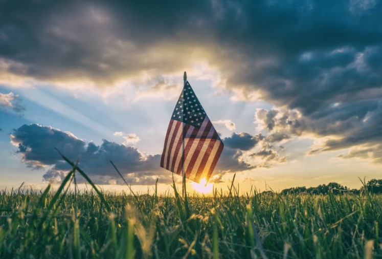
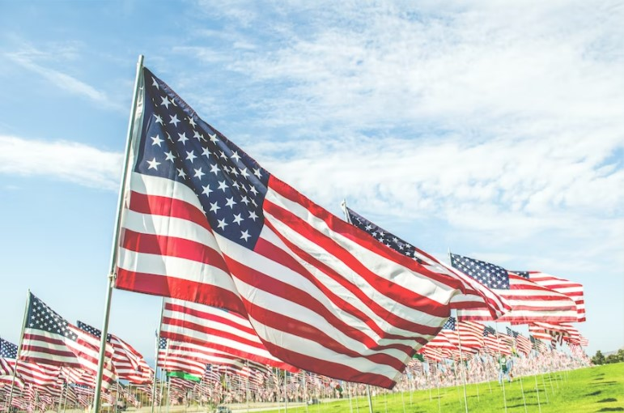
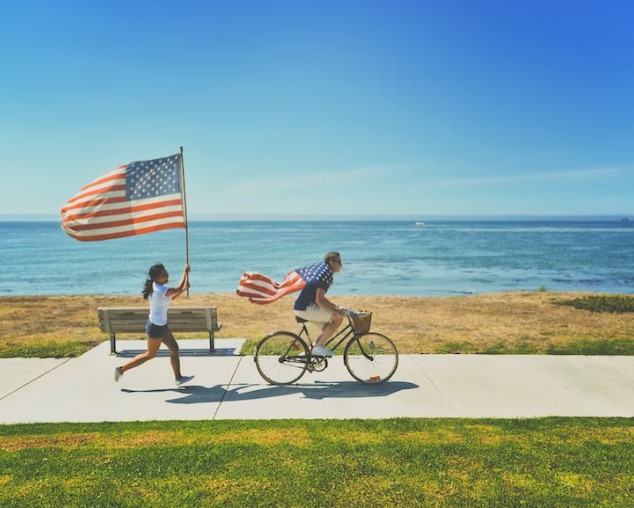
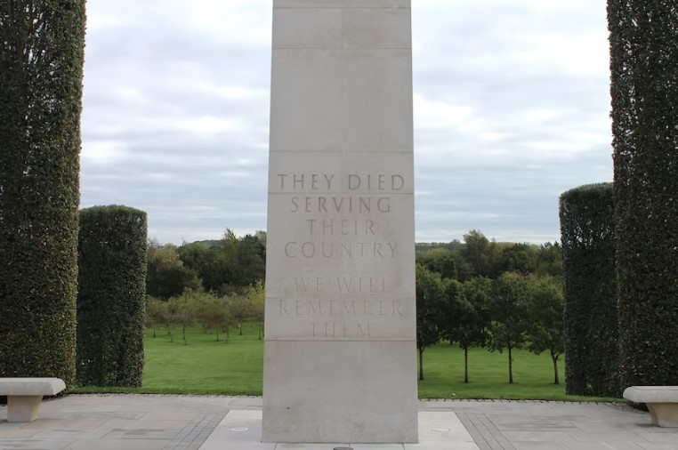
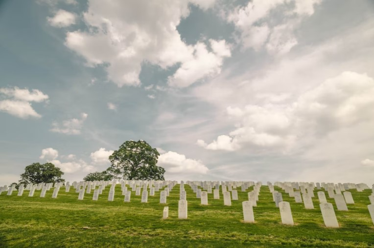
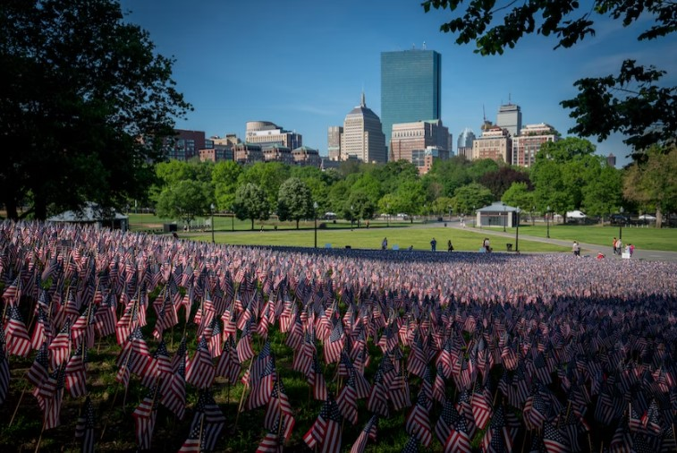
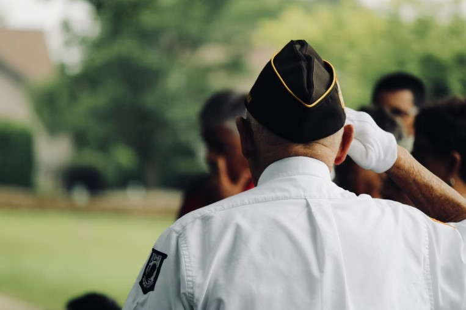

This article has been written and researched by our expert Loveable through a precise methodology. [Learn more about our methodology](https://avada.io/loveable/our-methodological.html)

[Loveable](https://avada.io/loveable/) > [Blog](https://avada.io/loveable/blog/) > [Holiday](https://avada.io/loveable/holiday/)

# 51 Memorial Day Quotes Ideas To Honor America’s Veterans

Written by [Blake Simpson](https://avada.io/loveable/author/blake/) Last Updated on August 21, 2023

- [The origins of memorial day](https://avada.io/loveable/blog/memorial-day-quotes/#wp-block-heading-2-3)
- [51 Memorial Day Quotes to honor America’s Veterans](https://avada.io/loveable/blog/memorial-day-quotes/#wp-block-heading-2-10)
- [Final Words](https://avada.io/loveable/blog/memorial-day-quotes/#wp-block-heading-2-68)

In America, People witness [memorial day](https://avada.io/loveable/memorial-gift-ideas/) – a day set aside to commemorate and remember the heroic men and women who have served in the United States Armed Forces. It is a day to remember their sacrifices and to rejoice in the freedom they have offered. Indigenous people may memorialize the heroes in a variety of ways, but one of the most powerful is to share inspirational Memorial Day quotations.

To honor these soldiers, here are 51 **Memorial Day Quotes** to remind us of the significance of their sacrifice. These quotations, which range from wise comments from famous personalities to encouraging sentiments from average folks, can give a meaningful way to celebrate this memorable day. Let these remarkable statements serve as a reminder of America’s soldiers’ bravery and strength.

## **The origins of memorial day**

Memorial Day – a special federal holiday in the United States, is often celebrated annually to honor the military sacrificed to gain freedom. In the United States, Memorial Day is often regarded as the unofficial early beginning of [summer](https://avada.io/loveable/summer-gifts/). What is its history?

The origins of memorial day

The Civil War ravaged the country, killing around 620,000 troops. Prior to the establishment of the holiday, Americans would pay their respects to both Union and Confederate troops, lighting vigils and decorating their graves with flowers. 

Looking back at history, on May 5, 1868, the Grand Army of the Republic (GAR), an association of Union army veterans, founded Decoration Day as a chance to decorate the war dead’s graves with flowers. After that, the schedule of Decoration Day was transferred to May 30 because it’s the time beautiful flowers bloom strongly in the year.

Beginning in 1873, official recognition as a holiday extended throughout the states, beginning with New York. Every Union state had accepted it by 1890. “Decoration Day” was declared a federal holiday by Congress in 1938, and the term “Memorial Day” became increasingly popular following World War II. However, that name was not officially approved by the federal government until 1967. Finally, in 1971, Congress renamed the holiday “Memorial Day” and moved it to the final Monday in May.

_**Related**_: [35 Best Gifts for Army Veterans To Show Your Appreciation & Gratitude](https://avada.io/loveable/gifts-for-army-veterans/)

## **51 Memorial Day Quotes to honor America’s Veterans**

51 Memorial Day Quotes Ideas To Honor America’s Veterans

1\. “How important it is for us to recognize and celebrate our heroes and she-roes.” by Maya Angelou

2\. “There is nothing wrong with America that cannot be cured with what is right in America.” by William J. Clinton

3\. “Without memory, there is no culture. Without memory, there would be no civilization, no society, no future.” by Elie Wiesel

4\. “We often take for granted the very things that most deserve our gratitude.” by Cynthia Ozick

5\. “Courage is almost a contradiction in terms. It means a strong desire to live taking the form of a readiness to die.” by G.K. Chesterton

6\. “May we never forget freedom isn’t free.” by Unknown

7\. “Regard your soldiers as your children, and they will follow you into the deepest valleys; look upon them as your own beloved sons, and they will stand by you even unto death.” by Sun Tzu

8\. “As we express our gratitude, we must never forget that the highest appreciation is not to utter words but to live by them.” by John F. Kennedy

9\. “…And if words cannot repay the debt we owe these men, surely with our actions we must strive to keep faith with them and with the vision that led them to battle and to final sacrifice.” by Ronald Reagan

51 Memorial Day Quotes Ideas To Honor America’s Veterans

10\. “The veterans of our military services have put their lives on the line to protect the freedoms that we enjoy. They have dedicated their lives to their country and deserve to be recognized for their commitment.” by Judd Gregg

11\. “Duty, honor, country. Those three hallowed words reverently dictate what you ought to be, what you can be, what you will be.” by Gen. Douglas MacArthur

12\. “As we set today aside to honor and thank our veterans, let us be mindful that we should do this every day of the year and not just one.” by Beth Pennington

13\. “The brave never taste of death but once.” by William Shakespeare

14\. “Our debt to the heroic men and valiant women in the service of our country can never be repaid. They have earned our undying gratitude. America will never forget their sacrifices.” by Harry S. Truman

15\. “And they who for their country die shall fill an honored grave, for glory lights the soldier’s tomb, and beauty weeps the brave.” by Joseph Rodman Drake

16\. “Our nation owes a debt to its fallen heroes that we can never fully repay.” by Barack Obama

17\. “Patriotism is not short, frenzied outbursts of emotion, but the tranquil and steady dedication of a lifetime.” by Adlai Stevenson II

18\. “To those in uniform serving today and to those who have served in the past, we honor you today and every day.” by Unknown

51 Memorial Day Quotes Ideas To Honor America’s Veterans

19\. “Ceremonies are important. But our gratitude has to be more than visits to the troops, and once-a-year Memorial Day ceremonies. We honor the dead best by treating the living well.” by Jennifer M. Granholm

20\. “Those who have long enjoyed such privileges as we enjoy forget in time that men have died to win them.” by Franklin D. Roosevelt

21\. “Heroism doesn’t always happen in a burst of glory. Sometimes small triumphs and large hearts change the course of history.” by Mary Roach

22\. “It doesn’t take a hero to order men into battle. It takes a hero to be one of those men who goes into battle.” by Norman Schwarzkopf

23\. “No man is entitled to the blessings of freedom unless he be vigilant in its preservation.” by General Douglas MacArthur

24\. “Freedom makes a huge requirement of every human being. With freedom comes responsibility.” by Eleanor Roosevelt

25\. “A hero is someone who has given his or her life to something bigger than oneself.” by Joseph Campbell

26\. “Home of the free, because of the brave.” by Unknown

27\. “Never was so much owed by so many few.” by Winston Churchill

51 Memorial Day Quotes Ideas To Honor America’s Veterans

28\. “The patriot’s blood is the seed of freedom’s tree.” by Thomas Campbell

29\. “Veterans are a symbol of what makes our nation great, and we must never forget all they have done to ensure our freedom.” by Rodney Frelinghuysen

30\. “It is foolish and wrong to mourn the men who died. Rather we should thank God such men lived.” by George S. Patton

31\. “The legacy of heroes is the memory of a great name and the inheritance of a great example.” by Benjamin Disraeli

32\. “For love of country they accepted death, and thus resolved all doubts, and made immortal their patriotism and their virtue.” by James A. Garfield

33\. “Who kept the faith and fought the fight; The glory theirs, the duty ours.” by Wallace Bruce

34\. “This nation will remain the land of the free only so long as it is the home of the brave.” by Elmer Davis

35\. “Courage is almost a contradiction in terms. It means a strong desire to live taking the form of readiness to die.” by G.K. Chesterson

36\. “America without her soldiers would be like God without His angels.” by Claudia Pemberton

51 Memorial Day Quotes Ideas To Honor America’s Veterans

37\. “Patriotism is when love of your own people comes first; nationalism, when hate for people other than your own comes first.” by Charles de Gaulle

38\. “I believe our flag is more than just cloth and ink. It is a universally recognized symbol that stands for liberty, and freedom. It is the history of our nation, and it’s marked by the blood of those who died defending it.” by John Thune

39\. “The willingness of America’s veterans to sacrifice for our country has earned them our lasting gratitude.” by Jeff Miller

40\. “In the End, we will remember not the words of our enemies, but the silence of our friends.” by Martin Luther King Jr

41\. “I only regret that I have but one life to lose for my country.” by Nathan Hale

42\. “Patriotism is supporting your country all the time, and your government when it deserves it.” by Mark Twain

43\. “What I can do for my country, I am willing to do.” by Christopher Gadsen

44\. “Freedom is never more than one generation away from extinction. We did not pass it to our children in the bloodstream. It must be fought for, protected, and handed on for them to do the same, or one day we will spend our sunset years telling our children and our children’s children what it was once like in the United States where men were free.” by Ronald Reagan

45\. “The brave die never, though they sleep in dust, their courage nerves a thousand living men.” by Minot J. Savage

51 Memorial Day Quotes Ideas To Honor America’s Veterans

46\. “This is the day we pay homage to all those who didn’t come home. This is not Veterans Day, it’s not a celebration, it is a day of solemn contemplation over the cost of freedom.” by Tamra Bolton

47\. “Our flag does not fly because the wind moves it. It flies with the last breath of each soldier who died protecting it.” by Unknown

48\. “Heroism is not only in the man, but in the occasion.” by Calvin Coolidge

49\. “Freedom is not free, but the U.S. Marine Corps will pay most of your share.” by Ned Dolan

50\. “Courage is not the absence of fear, but rather the judgment that something else is more important than fear.” by Ambrose Redmoon

51\. “Courage is contagious. When a brave man takes a stand, the spines of others are often stiffened.” by Billy Graham

## **Final Words**

After reading this article, it’s really necessary to know that Memorial Day is an important day to Americans. It is not only a celebration but also contains great values of both happiness and sadness. The remembrance of the trade-offs of those who sacrificed for that freedom. Romantic poets write to respect the peaceful life today. Memorial day is approaching; it’s time to Honor America’s Veterans not only by using these quotes but also giving them [Memory Of Gifts To Show Your Sympathy](https://avada.io/loveable/memory-gifts/), which offers a series of gifts that makes this day memorable. Gifts are never a bad choice for any celebration. 

- [The origins of memorial day](https://avada.io/loveable/blog/memorial-day-quotes/#wp-block-heading-2-3)
- [51 Memorial Day Quotes to honor America’s Veterans](https://avada.io/loveable/blog/memorial-day-quotes/#wp-block-heading-2-10)
- [Final Words](https://avada.io/loveable/blog/memorial-day-quotes/#wp-block-heading-2-68)

### [Blake Simpson](https://avada.io/loveable/author/blake/)

Hi, I'm Blake from Loveable. I help people find perfect gifts for occasions like anniversaries and weddings. I also write a blog about holidays, sharing insights to make them more meaningful. Let's create unforgettable moments together!

- [Twitter](https://twitter.com/intent/tweet)
- [Facebook](https://www.facebook.com/sharer/sharer.php)
- [instagram](https://avada.io/loveable/blog/memorial-day-quotes/)
- [pinterest](https://www.pinterest.com/loveablellc/)

## Related Posts

[### 120+ Christian Birthday Wishes To Spread Your Love](https://avada.io/loveable/blog/christian-birthday-wishes/) 

[

### 35 Best 70th Birthday Ideas To Celebrate The Special Milestone

](https://avada.io/loveable/blog/70th-birthday-ideas/)

[

### 50 Best 30th Birthday Decorations for a Remarkable Birthday Bash

](https://avada.io/loveable/blog/30th-birthday-decorations/)

[

### 40 Delicious Vegan Christmas Desserts to Delight Your Palate

](https://avada.io/loveable/blog/vegan-christmas-desserts/)

[

### 60 Christmas Team Building Activities to Boost Workplace Spirit

](https://avada.io/loveable/blog/christmas-team-building-activities/)
