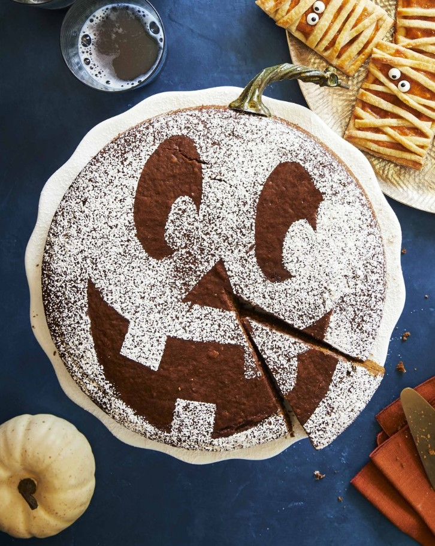
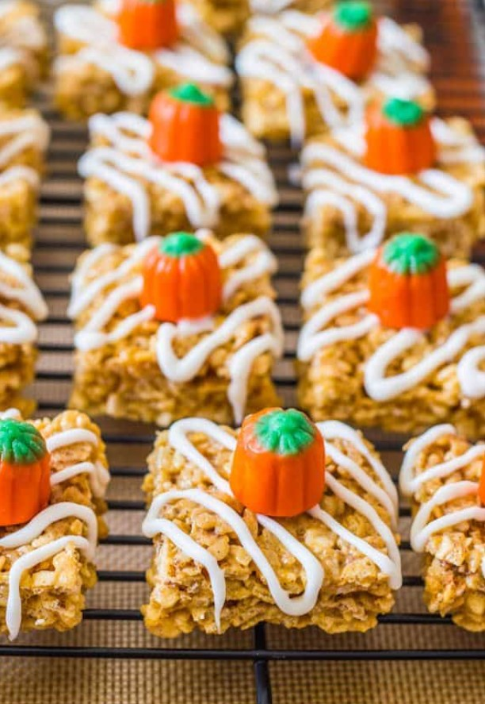

This article has been written and researched by our expert Loveable through a precise methodology. [Learn more about our methodology](https://avada.io/loveable/our-methodological.html)

[Loveable](https://avada.io/loveable/) > [Blog](https://avada.io/loveable/blog/) > [Holiday](https://avada.io/loveable/holiday/)

# 55 Best Halloween Treats: Spooktacular Delights for a Hauntingly Fun Celebration

Written by [Blake Simpson](https://avada.io/loveable/author/blake/) Last Updated on September 08, 2023

- [Best Spooky Halloween Treats for a Hauntingly Fun Celebration](https://avada.io/loveable/blog/halloween-treats/#wp-block-heading-2-3)
    - [1\. Rosemary-Pumpkin Seed Brittle](https://avada.io/loveable/blog/halloween-treats/#wp-block-heading-3-5)
    - [2\. Mummy Pumpkin Hand Pies](https://avada.io/loveable/blog/halloween-treats/#wp-block-heading-3-9)
    - [3\. Caramel Apples](https://avada.io/loveable/blog/halloween-treats/#wp-block-heading-3-13)
    - [4\. Marshmallow Ghost Brownies](https://avada.io/loveable/blog/halloween-treats/#wp-block-heading-3-17)
    - [5\. Spiced Pumpkin-Molasses Cake](https://avada.io/loveable/blog/halloween-treats/#wp-block-heading-3-21)
    - [6\. Pumpkin-Spiced Buns with Spiderweb Glaze](https://avada.io/loveable/blog/halloween-treats/#wp-block-heading-3-25)
    - [7\. Breadstick Rattlers](https://avada.io/loveable/blog/halloween-treats/#wp-block-heading-3-29)
    - [8\. Spider Cookie Truffles](https://avada.io/loveable/blog/halloween-treats/#wp-block-heading-3-33)
    - [9\. Coffin Sandwich Cookies](https://avada.io/loveable/blog/halloween-treats/#wp-block-heading-3-37)
    - [10\. Smokey Pumpkin Deviled Eggs](https://avada.io/loveable/blog/halloween-treats/#wp-block-heading-3-41)
    - [11\. Hats and Bats Chocolate Tarts](https://avada.io/loveable/blog/halloween-treats/#wp-block-heading-3-45)
    - [12\. Spooky Forest Pudding Cups](https://avada.io/loveable/blog/halloween-treats/#wp-block-heading-3-49)
    - [13\. Towering Haunted House Cake](https://avada.io/loveable/blog/halloween-treats/#wp-block-heading-3-53)
    - [14\. Black-Bottom Brownies](https://avada.io/loveable/blog/halloween-treats/#wp-block-heading-3-57)
    - [15\. “Poison” Candy Apples](https://avada.io/loveable/blog/halloween-treats/#wp-block-heading-3-61)
- [Best Frightfully Fun Halloween Treats](https://avada.io/loveable/blog/halloween-treats/#wp-block-heading-2-65)
    - [1\. Halloween Cocoa Ghost Pancakes](https://avada.io/loveable/blog/halloween-treats/#wp-block-heading-3-67)
    - [2\. Pretzel Spider Webs](https://avada.io/loveable/blog/halloween-treats/#wp-block-heading-3-71)
    - [3\. Easy Ghost Cookies](https://avada.io/loveable/blog/halloween-treats/#wp-block-heading-3-75)
    - [4\. Frankenstein Crispy Rice Treats](https://avada.io/loveable/blog/halloween-treats/#wp-block-heading-3-79)
    - [5\. Halloween Dirt Cups](https://avada.io/loveable/blog/halloween-treats/#wp-block-heading-3-83)
    - [6\. Cake Eyeballs](https://avada.io/loveable/blog/halloween-treats/#wp-block-heading-3-87)
    - [7\. Halloween Crispy Rice Treats](https://avada.io/loveable/blog/halloween-treats/#wp-block-heading-3-91)
    - [8\. Witch Crash Cupcakes](https://avada.io/loveable/blog/halloween-treats/#wp-block-heading-3-95)
    - [9\. Matcha Monster Meringues](https://avada.io/loveable/blog/halloween-treats/#wp-block-heading-3-99)
    - [10\. Halloween Chocolate Chip Cookies](https://avada.io/loveable/blog/halloween-treats/#wp-block-heading-3-103)
    - [11\. Ghost Crispy Rice Treats](https://avada.io/loveable/blog/halloween-treats/#wp-block-heading-3-107)
    - [12\. Peanut Butter Spider Cookies](https://avada.io/loveable/blog/halloween-treats/#wp-block-heading-3-111)
    - [13\. Halloween Cake Pops](https://avada.io/loveable/blog/halloween-treats/#wp-block-heading-3-115)
    - [14\. Blueberry-Vanilla Monster Cereal Treats](https://avada.io/loveable/blog/halloween-treats/#wp-block-heading-3-119)
    - [15\. Cobweb Hot Cocoa](https://avada.io/loveable/blog/halloween-treats/#wp-block-heading-3-123)
    - [16\. Peanut Butter Cookie Ghosts](https://avada.io/loveable/blog/halloween-treats/#wp-block-heading-3-127)
    - [17\. Concession Stand Crackers](https://avada.io/loveable/blog/halloween-treats/#wp-block-heading-3-131)
    - [18\. Dirt Cake](https://avada.io/loveable/blog/halloween-treats/#wp-block-heading-3-135)
    - [19\. Apple Spice Cake Mummies](https://avada.io/loveable/blog/halloween-treats/#wp-block-heading-3-139)
    - [20\. Tie-Dye Halloween Sugar Cookies](https://avada.io/loveable/blog/halloween-treats/#wp-block-heading-3-143)
    - [21\. Banana Mummies](https://avada.io/loveable/blog/halloween-treats/#wp-block-heading-3-147)
    - [22\. Ghostly Cupcakes](https://avada.io/loveable/blog/halloween-treats/#wp-block-heading-3-151)
    - [23\. Candy Bucket Cookies](https://avada.io/loveable/blog/halloween-treats/#wp-block-heading-3-155)
    - [24\. Halloween Buckeyes](https://avada.io/loveable/blog/halloween-treats/#wp-block-heading-3-159)
    - [25\. Halloween Confetti Cupcakes](https://avada.io/loveable/blog/halloween-treats/#wp-block-heading-3-163)
- [Best Terrifying No-Bake Halloween Treats](https://avada.io/loveable/blog/halloween-treats/#wp-block-heading-2-167)
    - [1\. Pumpkin Spice Puppy Chow](https://avada.io/loveable/blog/halloween-treats/#wp-block-heading-3-169)
    - [2\. Halloween Bark](https://avada.io/loveable/blog/halloween-treats/#wp-block-heading-3-173)
    - [3\. Silly Apple Bites](https://avada.io/loveable/blog/halloween-treats/#wp-block-heading-3-177)
    - [4\. Vampire Bat Marshmallow Pops](https://avada.io/loveable/blog/halloween-treats/#wp-block-heading-3-181)
    - [5\. Pumpkin Pie Rice Krispie Treats](https://avada.io/loveable/blog/halloween-treats/#wp-block-heading-3-185)
    - [6\. Monster Popcorn Balls](https://avada.io/loveable/blog/halloween-treats/#wp-block-heading-3-189)
    - [7\. Halloween Banana Popsicles](https://avada.io/loveable/blog/halloween-treats/#wp-block-heading-3-193)
    - [8\. Marshmallow Monsters](https://avada.io/loveable/blog/halloween-treats/#wp-block-heading-3-197)
    - [9\. Halloween Popcorn Snack Mix](https://avada.io/loveable/blog/halloween-treats/#wp-block-heading-3-201)
    - [10\. Halloween Chocolate Bark](https://avada.io/loveable/blog/halloween-treats/#wp-block-heading-3-205)
    - [11\. Spooky Halloween Pretzels](https://avada.io/loveable/blog/halloween-treats/#wp-block-heading-3-209)
    - [12\. Oreo Dirt Cups](https://avada.io/loveable/blog/halloween-treats/#wp-block-heading-3-213)
    - [13\. Halloween Totoro Rice Krispie Treats](https://avada.io/loveable/blog/halloween-treats/#wp-block-heading-3-217)
    - [14\. Halloween Mummy Nutter Butter Cookies](https://avada.io/loveable/blog/halloween-treats/#wp-block-heading-3-221)
    - [15\. Boo! Chocolate Peanut Butter Bars](https://avada.io/loveable/blog/halloween-treats/#wp-block-heading-3-225)
- [Bottom Line](https://avada.io/loveable/blog/halloween-treats/#wp-block-heading-2-232)

Get ready to embark on a tantalizing journey through the world of the Best **Halloween Treats**, where delightful confections and spine-chilling creations await to enchant your taste buds. As the air turns crisp and the leaves take on their fiery hues, Halloween approaches with its magical aura of mystery and excitement. And what better way to celebrate this spooky season than with a delectable assortment of [Halloween food ideas](https://avada.io/loveable/blog/halloween-food-ideas/) that will thrill both young and old alike?

In this bewitching collection, we have curated a mesmerizing array of Halloween treats that cater to every craving and delight in the spirit of the season. From sinfully delicious chocolates to whimsical and adorable creations, these treats will transport you to a world where ghouls, ghosts, and goblins come to life in sugary form. Whether you’re hosting a thrilling [Halloween party](https://avada.io/loveable/blog/halloween-party-games-adults/) or looking to surprise your trick-or-treaters with something extraordinary, our handpicked selection of Halloween treats promises to elevate the festivities to new heights.

## **Best Spooky Halloween Treats for a Hauntingly Fun Celebration**

Indulge in the eerie spirit of Halloween with a bewitching array of spooky delights! These Best Spooky Halloween Treats are guaranteed to send shivers down your spine while delighting your taste buds. From creepy confections to haunted masterpieces, there’s something for every ghoul and goblin to enjoy. Let’s explore these spine-chilling treats that promise to cast a spell of flavor-filled fright!

### **1\. Rosemary-Pumpkin Seed Brittle**

Experience the captivating juxtaposition of flavors with our Rosemary-Pumpkin Seed Brittle. This sinisterly delightful treat combines the earthy essence of fresh rosemary with the satisfying crunch of pumpkin seeds. As you take your first bite, you’ll be enchanted by the fragrant aroma and the harmonious blend of savory and sweet.

Get the recipe at [countryliving](https://www.countryliving.com/food-drinks/a33944366/rosemary-pumpkin-seed-brittle/)

### **2\. Mummy Pumpkin Hand Pies**

Unravel the mystery of these adorable yet spooky Mummy Pumpkin Hand Pies. Wrapped in a flaky, golden crust, these handheld delights are filled with a delectable pumpkin filling that’s bound to warm your soul on a chilling evening. The delicate pastry embraces the pumpkin goodness, creating a mesmerizing blend that’s simply irresistible.

Get the recipe at [countryliving](https://www.countryliving.com/food-drinks/a33944314/mummy-pumpkin-hand-pies/)

### **3\. Caramel Apples**

Step into a world of timeless Halloween charm with our luscious Caramel Apples. Each juicy apple is dipped in a velvety, buttery caramel coating, creating a harmonious contrast of flavors that evoke memories of crisp autumn nights and crackling bonfires.

Get the recipe at [sallysbakingaddiction](https://sallysbakingaddiction.com/homemade-caramel-apples/)

### **4\. Marshmallow Ghost Brownies**

Haunt your taste buds with the playful delight of Marshmallow Ghost Brownies. Deep, rich chocolate brownies serve as the canvas for adorable white marshmallow specters that float upon the surface, giving the treats an ethereal touch. The softness of the marshmallows beautifully complements the dense brownie base, creating a heavenly fusion of textures.

Get the recipe at [countryliving](https://www.countryliving.com/food-drinks/a28943165/marshmallow-ghost-brownies-recipe/)

### **5\. Spiced Pumpkin-Molasses Cake**

Indulge in the warm embrace of autumn with our Spiced Pumpkin-Molasses Cake. Moist and rich, this delectable cake brings together the comforting flavors of spiced pumpkin and the distinct sweetness of molasses. The tantalizing aroma of cinnamon, nutmeg, and cloves will fill your home, making it feel like a true Halloween haven.

Get the recipe at [countryliving](https://www.countryliving.com/food-drinks/a33944277/spiced-pumpkin-molasses-cake/)

### **6\. Pumpkin-Spiced Buns with Spiderweb Glaze**

Delight in the artistry of our Pumpkin-Spiced Buns with Spiderweb Glaze. These soft, pillowy buns are infused with the warm flavors of pumpkin and fall spices, making them a heavenly treat for your taste buds. But what sets these buns apart is the intricate spiderweb glaze delicately drizzled on top, adding a touch of spookiness to the already magical ensemble.

Get the recipe at [countryliving](https://www.countryliving.com/food-drinks/a33943653/pumpkin-spiced-buns/)

### **7\. Breadstick Rattlers**

Prepare to be charmed by our Breadstick Rattlers. These twisted breadsticks slither into your heart with their savory and buttery goodness. Their golden exteriors boast a crunchy texture, while the inside remains soft and fluffy. Shaped like sinuous snakes, they’re a delightful addition to any Halloween spread.

Get the recipe at [countryliving](https://www.countryliving.com/food-drinks/a36715589/breadstick-rattlers-recipe/)

### **8\. Spider Cookie Truffles**

Succumb to the enchantment of our Spider Cookie Truffles, where the world of arachnids meets irresistible sweetness. These truffles boast a rich, crumbly cookie center infused with delightful flavors like chocolate chips, cocoa, and aromatic spices.

Get the recipe at [countryliving](https://www.countryliving.com/food-drinks/a33943269/spider-cookie-truffles/)

### **9\. Coffin Sandwich Cookies**

Unearth the delicious secrets hidden within our Coffin Sandwich Cookies. These eerily delightful treats take the shape of tiny coffins with a sinful twist – a heavenly sandwich filling awaiting discovery. With their delightful appearance and delectable taste, these cookies are the epitome of Halloween enchantment.

Get the recipe at [countryliving](https://www.countryliving.com/food-drinks/a28943552/coffin-sandwich-cookies/)

### **10\. Smokey Pumpkin Deviled Eggs**

Embrace the bewitching fusion of flavors with our Smokey Pumpkin Deviled Eggs. Creamy and smooth, these deviled eggs are enriched with the subtle essence of pumpkin and a hint of smokiness, creating a tantalizing blend that will enchant your palate.

Get the recipe at [countryliving](https://www.countryliving.com/food-drinks/a33943583/smokey-pumpkin-deviled-eggs/)

### **11\. Hats and Bats Chocolate Tarts**

Step into a realm where darkness reigns supreme and sinister creatures take flight with the Hats and Bats Chocolate Tarts. These devilishly delectable treats boast a haunting combination of flavors and a mesmerizing appearance that will bewitch all who dare to indulge.

Get the recipe at [countryliving](https://www.countryliving.com/food-drinks/a28943641/hats-and-bats-chocolate-peanut-butter-tarts-recipe/)

### **12\. Spooky Forest Pudding Cups**

Embark on a spine-tingling journey into the heart of the Spooky Forest Pudding Cups, where taste and terror collide to create an unforgettable Halloween experience. Imagine layers of rich, velvety chocolate pudding, generously interspersed with crushed chocolate cookies that mimic the look and feel of dark forest soil.

Get the recipe at [countryliving](https://www.countryliving.com/food-drinks/a28943384/spooky-forest-pudding-cups/)

### **13\. Towering Haunted House Cake**

Prepare to be mesmerized by the grandeur of the Towering Haunted House Cake, an architectural marvel that bridges the gap between fantasy and reality. Standing tall like an imposing haunted mansion, this cake is a masterpiece that beckons with its eerily captivating appearance.

Get the recipe at [countryliving](https://www.countryliving.com/food-drinks/a28943697/towering-haunted-house-cake/)

### **14\. Black-Bottom Brownies**

Indulge in the darkness that lurks within the Black-Bottom Brownies, a treat that tempts with its decadence and delights with its devilish contrasts. With each bite, one is transported to a world where the line between light and shadow blurs, leaving only the irresistible allure of its fudgy essence.

Get the recipe at [countryliving](https://www.countryliving.com/food-drinks/a23317932/black-bottom-brownies-recipe/)

### **15\. “Poison” Candy Apples**

Beware, for within the alluring glimmer of the “Poison” Candy Apples lies a treat that both captivates and deceives. Inspired by the enchanting world of fairy tales, these crimson orbs beckon with their glossy exteriors, concealing a sinister secret. Picture crisp and succulent apples, handpicked for their unparalleled juiciness, coated in a syrup of a deep red hue.

Get the recipe at [countryliving](https://www.countryliving.com/food-drinks/recipes/a5710/poison-candy-apples-recipe-clx1014/)

## **Best Frightfully Fun Halloween Treats**

Get ready for a spine-chilling culinary adventure with our collection of the Best Frightfully Fun Halloween Treats! These spooky delights are perfect for embracing the spirit of the season and making delicious memories with your little ghouls and goblins. From hauntingly cute to eerily delectable, these treats promise to cast a spell on your taste buds and add a dash of playful fright to your Halloween festivities.

### **1\. Halloween Cocoa Ghost Pancakes**

Start your Halloween morning with a ghostly surprise! The Halloween Cocoa Ghost Pancakes are fluffy and flavorful, with a touch of cocoa to give them a bewitching hue. But what truly brings these flapjacks to life (or afterlife) are the spooky ghost shapes meticulously crafted on the griddle.

Get the recipe at [foodnetwork](https://www.foodnetwork.com/recipes/food-network-kitchen/kids-can-make-halloween-cocoa-ghost-pancakes-9344307)

### **2\. Pretzel Spider Webs**

Spin a web of excitement with these Pretzel Spider Webs! These crispy pretzel treats, dipped in velvety chocolate, form the foundation of an intricate web design. Let your little ones take the lead as they weave their edible cobwebs, adding a spooky touch to the snack.

Get the recipe at [foodnetwork](https://www.foodnetwork.com/recipes/ree-drummond/pretzel-spider-webs-9414999)

### **3\. Easy Ghost Cookies**

Whip up a batch of Easy Ghost Cookies for a hauntingly sweet treat. These charming cookies, shaped like adorable little ghosts, are a breeze to make and decorate. With a hint of vanilla, they offer a delightful crunch and a dash of spookiness in every bite.

Get the recipe at [foodnetwork](https://www.foodnetwork.com/recipes/food-network-kitchen/easy-ghost-cookies-12741329)

### **4\. Frankenstein Crispy Rice Treats**

Embrace the mad scientist within and create Frankenstein Crispy Rice Treats that will electrify your taste buds. These classic crispy rice treats get a monstrous makeover with a layer of green-tinted marshmallow goodness. Decorate them with candy eyes, chocolate stitches, and a menacing grin to transform them into the beloved Frankenstein’s monster.

Get the recipe at [foodnetwork](https://www.foodnetwork.com/recipes/food-network-kitchen/frankenstein-crispy-rice-treats-13317311)

### **5\. Halloween Dirt Cups**

Delve into the eerie unknown with Halloween Dirt Cups! These playful treats bring together layers of chocolate pudding, crumbled chocolate cookies, and gummy worms, all assembled to resemble a spooky graveyard scene.

Get the recipe at [foodnetwork](https://www.foodnetwork.com/recipes/ree-drummond/halloween-dirt-cups-9422040)

### **6\. Cake Eyeballs**

Peer into the unknown with these hauntingly realistic Cake Eyeballs! These eerie treats feature moist cake balls, coated in white chocolate to mimic the appearance of ghostly eyeballs. Each one is carefully adorned with edible markers to create intricate details that stare back at you from beyond the grave.

Get the recipe at [foodnetwork](https://www.foodnetwork.com/recipes/ree-drummond/cake-eyeballs-2269193)

### **7\. Halloween Crispy Rice Treats**

Add a touch of spookiness to a beloved classic with Halloween Crispy Rice Treats! These ooey-gooey delights are infused with the season’s vibrant colors and adorned with candy sprinkles and ghoulish shapes.

Get the recipe at [foodnetwork](https://www.foodnetwork.com/recipes/food-network-kitchen/halloween-crispy-rice-treats-8840903)

### **8\. Witch Crash Cupcakes**

Conjure up a bit of kitchen magic with Witch Crash Cupcakes! These bewitching cupcakes feature a deliciously moist base, crowned with vibrant green frosting to resemble a witch’s hat.

Get the recipe at [foodnetwork](https://www.foodnetwork.com/recipes/food-network-kitchen/witch-crash-cupcakes-5449199)

### **9\. Matcha Monster Meringues**

Unleash a horde of cute and spooky Matcha Monster Meringues upon your Halloween guests! These light and airy meringue cookies are infused with matcha, giving them a delightful green hue that complements the season perfectly.

Get the recipe at [foodnetwork](https://www.foodnetwork.com/recipes/food-network-kitchen/matcha-monster-meringues-11621728)

### **10\. Halloween Chocolate Chip Cookies**

Sink your fangs into these Halloween Chocolate Chip Cookies, a frightfully fun twist on a classic favorite. These cookies, studded with dark chocolate chips, boast a pumpkin-orange hue that evokes the spirit of the season.

Get the recipe at [foodnetwork](https://www.foodnetwork.com/recipes/food-network-kitchen/halloween-chocolate-chip-cookies-11558401)

### **11\. Ghost Crispy Rice Treats**

Boo! Get ready to be spooked by the delightful Ghost Crispy Rice Treats. These marshmallow-infused crispy rice treats are shaped into playful little ghosts, complete with white chocolate drizzles to give them an ethereal appearance.

Get the recipe at [foodnetwork](https://www.foodnetwork.com/recipes/food-network-kitchen/ghost-crispy-rice-treats-12701390)

### **12\. Peanut Butter Spider Cookies**

Weave a web of peanut buttery goodness with Peanut Butter Spider Cookies! Soft and chewy peanut butter cookies serve as the canvas for these edible arachnids. Top each cookie with a generous dollop of peanut butter frosting and add pretzel legs to complete the spooky spider look.

Get the recipe at [foodnetwork](https://www.foodnetwork.com/recipes/food-network-kitchen/scary-peanut-butter-spider-cookies-3561241)

### **13\. Halloween Cake Pops**

Enter a realm of cuteness and flavor with Halloween Cake Pops. These delectable treats combine moist cake crumbs with creamy frosting, forming a delectable mixture that is shaped into adorable little pumpkins, ghosts, and witches. Each cake pop is then coated in vibrant candy melts and lovingly decorated with icing details to bring these [playful cartoon characters](https://avada.io/loveable/blog/famous-halloween-cartoon-characters/) to life.

Get the recipe at [foodnetwork](https://www.foodnetwork.com/recipes/food-network-kitchen/halloween-cake-pops-9336321)

### **14\. Blueberry-Vanilla Monster Cereal Treats**

These colorful and crunchy cereal bars are infused with a burst of blueberry and vanilla flavors, making each bite an explosion of taste and texture. Adorn them with candy eyes and melts to transform them into charming little monsters that will charm kids and adults alike.

Get the recipe at [foodnetwork](https://www.foodnetwork.com/recipes/food-network-kitchen/blueberry-vanilla-monster-cereal-treats-11621800)

### **15\. Cobweb Hot Cocoa**

As the chilly winds of Halloween night blow, warm up with a comforting cup of Cobweb Hot Cocoa. This velvety-rich cocoa is topped with a hauntingly beautiful spiderweb design, meticulously crafted with whipped cream and chocolate syrup.

Get the recipe at [foodnetwork](https://www.foodnetwork.com/recipes/food-network-kitchen/cobweb-hot-cocoa-11621316)

### **16\. Peanut Butter Cookie Ghosts**

Evoke a delightful sense of Halloween whimsy with Peanut Butter Cookie Ghosts. These adorably spooky treats are made from soft and chewy peanut butter cookies that are transformed into charming little ghost shapes. A generous drizzle of white chocolate creates a ghostly apparition, while dark chocolate eyes add a touch of playfulness.

Get the recipe at [foodnetwork](https://www.foodnetwork.com/recipes/ree-drummond/peanut-butter-cookie-ghosts-9415000)

### **17\. Concession Stand Crackers**

Imagine crisp and buttery crackers dipped in luscious melted chocolate, then adorned with an assortment of Halloween-themed sprinkles and candy. These crunchy treats are a delightful addition to any Halloween gathering, offering a burst of color and excitement that will please kids and adults alike.

Get the recipe at [foodnetwork](https://www.foodnetwork.com/recipes/ree-drummond/concession-stand-crackers-9415001)

### **18\. Dirt Cake**

Prepare to dig into a wickedly indulgent treat with Dirt Cake, a [Halloween dessert](https://avada.io/loveable/blog/halloween-dessert-recipes/) that perfectly captures the essence of the season. Layers of creamy chocolate pudding alternate with crushed chocolate cookies to create the illusion of edible soil. Hidden within this delectable dirt are gummy worms, playfully peeking out to surprise and delight.

Get the recipe at [foodnetwork](https://www.foodnetwork.com/recipes/food-network-kitchen/dirt-cake-8817909)

### **19\. Apple Spice Cake Mummies**

Add a touch of whimsy to your Halloween festivities with Apple Spice Cake Mummies, a delightful twist on a classic treat. Imagine moist and flavorful apple spice cake, lovingly shaped into charming mummy figures. A generous drizzle of white icing creates the impression of mummy bandages, while candy eyes peer out playfully from beneath the sugary shroud.

Get the recipe at [foodnetwork](https://www.foodnetwork.com/recipes/food-network-kitchen/apple-spice-cake-mummies-7442469)

### **20\. Tie-Dye Halloween Sugar Cookies**

Unleash a burst of vibrant colors and delightful flavors with Tie-Dye Halloween Sugar Cookies. These eye-catching treats feature soft buttery sugar cookies, expertly swirled with spooky hues to create mesmerizing patterns. Each cookie is a unique masterpiece that evokes the enchantment of the season.

Get the recipe at [foodnetwork](https://www.foodnetwork.com/recipes/food-network-kitchen/tie-dye-halloween-sugar-cookies-5449445)

### **21\. Banana Mummies**

Get wrapped up in a delightfully healthy treat with Banana Mummies, a playful and nutritious Halloween snack. Fresh bananas are transformed into adorable mummy figures using strips of soft and chewy dried fruit. These spooky mummies are guaranteed to make snack time an exciting adventure for kids, encouraging them to embrace the fun side of healthy eating.

Get the recipe at [foodnetwork](https://www.foodnetwork.com/recipes/food-network-kitchen/banana-mummies-3363413)

### **22\. Ghostly Cupcakes**

Indulge in a hauntingly sweet experience with Ghostly Cupcakes, a classic treat that never goes out of style. Soft and moist cupcakes are frosted with smooth white buttercream, forming the canvas for adorable ghost designs. With a playful swirl of frosting and candy eyes that peer back at you, each cupcake is transformed into a lovable apparition.

Get the recipe at [foodnetwork](https://www.foodnetwork.com/recipes/food-network-kitchen/ghostly-cupcakes-3561230)

### **23\. Candy Bucket Cookies**

Open up a treasure trove of delight with Candy Bucket Cookies, an imaginative treat that combines the charm of cookies with the excitement of Halloween candy. Soft and chewy cookies, chock-full of colorful candy pieces, are shaped to resemble mini candy buckets. Each bite is a thrilling surprise, as the candies hidden within the cookies provide bursts of sweet goodness.

Get the recipe at [foodnetwork](https://www.foodnetwork.com/recipes/jeff-mauro/candy-bucket-cookies-2644292)

### **24\. Halloween Buckeyes**

Unleash a delightful fusion of sweet and nutty flavors with Halloween Buckeyes, a tempting treat that celebrates the season with every mouthwatering bite. Creamy peanut butter centers are enveloped in a coat of smooth chocolate, leaving just a glimpse of the nutty goodness peeking through. Adorned with festive Halloween-themed sprinkles, these buckeyes are the perfect way to satisfy a craving for something indulgent and delightful.

Get the recipe at [foodnetwork](https://www.foodnetwork.com/recipes/halloween-buckeyes-16934586)

### **25\. Halloween Confetti Cupcakes**

Embrace the festive spirit of Halloween with Halloween Confetti Cupcakes, a burst of color and flavor that will elevate your celebrations. Moist and flavorful cupcakes are speckled with colorful confetti sprinkles, reminiscent of the playful chaos of a Halloween parade. Topped with a swirl of creamy frosting and adorned with spooky candy decorations, these cupcakes promise a delightful surprise with each bite.

Get the recipe at [foodnetwork](https://www.foodnetwork.com/recipes/food-network-kitchen/halloween-confetti-cupcakes-16951883)

## **Best Terrifying No-Bake Halloween Treats**

Welcome to a spine-chilling world of delectable delights! This collection presents the Best Terrifying No-Bake Halloween Treats that promise to enchant and spook your taste buds. With a creative twist on classic recipes, these spooky and playful treats capture the essence of Halloween without the need for any baking. From charming marshmallow monsters to adorable mummy cookies, each treat is crafted with care to add a touch of magic to your Halloween celebrations.

### **1\. Pumpkin Spice Puppy Chow**

This no-bake treat combines crunchy Chex cereal with generous pumpkin spice and powdered sugar dusting, creating a bewitching blend of flavors. Each bite offers a tantalizing crunch and a burst of seasonal spices that perfectly capture the spirit of Halloween.

Get the recipe at [sallysbakingaddiction](https://sallysbakingaddiction.com/pumpkin-spice-puppy-chow/)

### **2\. Halloween Bark**

Indulge in a wickedly delicious treat with Halloween Bark, a no-bake dessert that combines rich chocolate with an assortment of spooky toppings. This hauntingly beautiful confection features a layer of velvety chocolate, adorned with colorful candy, edible eyes, and festive sprinkles. The contrasting textures and flavors create a delightful harmony in every bite.

Get the recipe at [dinnerthendessert](https://dinnerthendessert.com/halloween-bark/)

### **3\. Silly Apple Bites**

Bring a playful twist to healthy eating with Silly Apple Bites, a no-bake treat that is both adorable and nutritious. Crisp apple slices serve as the canvas for these delightful creations, adorned with peanut butter and an assortment of toppings to form charming monster faces.

Get the recipe at [forkandbeans](https://www.forkandbeans.com/2015/08/06/silly-apple-bites/)

### **4\. Vampire Bat Marshmallow Pops**

Sink your teeth into the spook-tacular goodness of Vampire Bat Marshmallow Pops, a no-bake treat that combines the whimsy of marshmallows with the thrill of Halloween. Each fluffy marshmallow is dipped in smooth melted chocolate, forming the base of these adorable bat-shaped pops. With a sprinkle of edible glitter and candy eyes, these Vampire Bat Marshmallow Pops come to life with playful charm.

Get the recipe at [cookingwithjanica](https://cookingwithjanica.com/vampire-bat-marshmallow-pops-recipe/)

### **5\. Pumpkin Pie Rice Krispie Treats**

Celebrate the season of pumpkins with Pumpkin Pie Rice Krispie Treats, a no-bake confection that adds a touch of fall flair to a classic treat. These gooey and delightful rice krispie bars are infused with pumpkin spice and pumpkin puree, offering a taste reminiscent of a cozy pumpkin pie. Topped with a dollop of whipped cream and a sprinkle of cinnamon, each treat is a bite-sized slice of autumn joy.

Get the recipe at [sallysbakingaddiction](https://sallysbakingaddiction.com/pumpkin-pie-rice-krispie-treats/)

### **6\. Monster Popcorn Balls**

Get ready for a monstrously fun treat with Monster Popcorn Balls, a no-bake confection that combines caramel and popcorn flavors with a playful twist. Each popcorn ball is transformed into a lovable monster with the addition of candy eyes, colorful sprinkles, and a sweet smile. The chewy texture and delightful sweetness make these treats a hit with both kids and adults.

Get the recipe at [sprinklebakes](https://www.sprinklebakes.com/2016/10/monster-popcorn-balls.html)

### **7\. Halloween Banana Popsicles**

Chill out with the refreshing goodness of Halloween Banana Popsicles, a no-bake treat that offers a healthy twist on frozen delights. Fresh bananas are dipped in creamy yogurt and adorned with an array of spooky toppings, such as candy eyes and chocolate drizzle.

Get the recipe at [wellplated](https://www.wellplated.com/halloween-banana-popsicles/)

### **8\. Marshmallow Monsters**

Fluffy marshmallows serve as the canvas for these charming monsters, decorated with colorful candy and edible markers to create unique and whimsical designs. The possibilities are endless, making these treats a perfect activity for Halloween parties or a fun-filled afternoon with family and friends.

Get the recipe at [workingmommagic](http://www.workingmommagic.com/2016/09/halloween-treats-marshmallow-monsters.html)

### **9\. Halloween Popcorn Snack Mix**

Get ready for a spook-tastic snacking experience with Halloween Popcorn Snack Mix, a no-bake treat that blends sweet and salty flavors in perfect harmony. Popcorn, pretzels, and an assortment of Halloween-themed candies and sprinkles come together to create an irresistible medley of textures and tastes.

Get the recipe at [5boysbaker](https://www.5boysbaker.com/halloween-popcorn-snack-mix/)

### **10\. Halloween Chocolate Bark**

Delight in the bewitching beauty of Halloween Chocolate Bark, a no-bake treat that is both striking and delicious. A smooth and velvety chocolate base is adorned with colorful candies, nuts, and edible decorations to create a mesmerizing mosaic of flavors and textures.

Get the recipe at [sallysbakingaddiction](https://sallysbakingaddiction.com/easy-halloween-recipes/)

### **11\. Spooky Halloween Pretzels**

Add a touch of spookiness to a beloved snack with Spooky Halloween Pretzels, a no-bake treat that combines the charm of pretzels with the thrill of Halloween. Crunchy pretzel rods are dipped in smooth melted chocolate and adorned with an assortment of creepy-crawly candy decorations.

Get the recipe at [halfbakedharvest](https://www.halfbakedharvest.com/spooky-halloween-pretzels/)

### **12\. Oreo Dirt Cups**

Take a journey into the unknown with Oreo Dirt Cups, a no-bake treat that perfectly captures the essence of Halloween. Layers of creamy pudding alternate with crushed Oreo cookies to create the illusion of a delectable dirt layer. Gummy worms are hidden within this delightful dirt, peeking out playfully to surprise and delight.

Get the recipe at [spendwithpennies](https://www.spendwithpennies.com/oreo-dirt-cups/)

### **13\. Halloween Totoro Rice Krispie Treats**

Experience the magic of Halloween with Halloween Totoro Rice Krispie Treats, a no-bake confection that blends the whimsy of Totoro with the charm of Halloween. Each rice krispie treat is shaped into an adorable Totoro figure, using chocolate and candy eyes to bring the lovable character to life.

Get the recipe at [iamafoodblog](https://iamafoodblog.com/halloween-rice-krispie-treats/)

### **14\. Halloween Mummy Nutter Butter Cookies**

Each cookie is dipped in white chocolate and adorned with candy eyes to create the appearance of wrapped mummies. These adorable treats are perfect for Halloween parties or as a sweet surprise in lunchboxes during the spooky season.

Get the recipe at [thecreativebite](https://www.thecreativebite.com/halloween-mummy-nutter-butter-cookies/)

### **15\. Boo! Chocolate Peanut Butter Bars**

Embrace the playfulness of Halloween with Boo! Chocolate Peanut Butter Bars, a no-bake treat that combines the richness of chocolate with the nutty goodness of peanut butter. Each square is topped with a playful “Boo!” message, crafted from white chocolate and adorned with colorful sprinkles. These delectable bars are perfect for a Halloween-themed dessert table or as a charming treat to share with friends and family.

Get the recipe at [halfbakedharvest](https://www.halfbakedharvest.com/boo-chocolate-peanut-butter-bars/)

**_Related:_**

- Best [Halloween Cake](https://avada.io/loveable/halloween-cake/)

- Spooktacular [Halloween Potluck Ideas](https://avada.io/loveable/halloween-potluck-ideas/)

## **Bottom Line**

In the spirit of Halloween, let the joy of indulging in these treats remind us that life is full of magic and surprises, waiting to be savored and shared with loved ones. So, may the enchantment of **Halloween treats** continue to ignite our taste buds and kindle the flames of imagination, making each day a celebration of creativity and wonder. Happy Halloween, and may the treats of this eerie season forever tickle your taste buds and warm your hearts.

- [Best Spooky Halloween Treats for a Hauntingly Fun Celebration](https://avada.io/loveable/blog/halloween-treats/#wp-block-heading-2-3)
    - [1\. Rosemary-Pumpkin Seed Brittle](https://avada.io/loveable/blog/halloween-treats/#wp-block-heading-3-5)
    - [2\. Mummy Pumpkin Hand Pies](https://avada.io/loveable/blog/halloween-treats/#wp-block-heading-3-9)
    - [3\. Caramel Apples](https://avada.io/loveable/blog/halloween-treats/#wp-block-heading-3-13)
    - [4\. Marshmallow Ghost Brownies](https://avada.io/loveable/blog/halloween-treats/#wp-block-heading-3-17)
    - [5\. Spiced Pumpkin-Molasses Cake](https://avada.io/loveable/blog/halloween-treats/#wp-block-heading-3-21)
    - [6\. Pumpkin-Spiced Buns with Spiderweb Glaze](https://avada.io/loveable/blog/halloween-treats/#wp-block-heading-3-25)
    - [7\. Breadstick Rattlers](https://avada.io/loveable/blog/halloween-treats/#wp-block-heading-3-29)
    - [8\. Spider Cookie Truffles](https://avada.io/loveable/blog/halloween-treats/#wp-block-heading-3-33)
    - [9\. Coffin Sandwich Cookies](https://avada.io/loveable/blog/halloween-treats/#wp-block-heading-3-37)
    - [10\. Smokey Pumpkin Deviled Eggs](https://avada.io/loveable/blog/halloween-treats/#wp-block-heading-3-41)
    - [11\. Hats and Bats Chocolate Tarts](https://avada.io/loveable/blog/halloween-treats/#wp-block-heading-3-45)
    - [12\. Spooky Forest Pudding Cups](https://avada.io/loveable/blog/halloween-treats/#wp-block-heading-3-49)
    - [13\. Towering Haunted House Cake](https://avada.io/loveable/blog/halloween-treats/#wp-block-heading-3-53)
    - [14\. Black-Bottom Brownies](https://avada.io/loveable/blog/halloween-treats/#wp-block-heading-3-57)
    - [15\. “Poison” Candy Apples](https://avada.io/loveable/blog/halloween-treats/#wp-block-heading-3-61)
- [Best Frightfully Fun Halloween Treats](https://avada.io/loveable/blog/halloween-treats/#wp-block-heading-2-65)
    - [1\. Halloween Cocoa Ghost Pancakes](https://avada.io/loveable/blog/halloween-treats/#wp-block-heading-3-67)
    - [2\. Pretzel Spider Webs](https://avada.io/loveable/blog/halloween-treats/#wp-block-heading-3-71)
    - [3\. Easy Ghost Cookies](https://avada.io/loveable/blog/halloween-treats/#wp-block-heading-3-75)
    - [4\. Frankenstein Crispy Rice Treats](https://avada.io/loveable/blog/halloween-treats/#wp-block-heading-3-79)
    - [5\. Halloween Dirt Cups](https://avada.io/loveable/blog/halloween-treats/#wp-block-heading-3-83)
    - [6\. Cake Eyeballs](https://avada.io/loveable/blog/halloween-treats/#wp-block-heading-3-87)
    - [7\. Halloween Crispy Rice Treats](https://avada.io/loveable/blog/halloween-treats/#wp-block-heading-3-91)
    - [8\. Witch Crash Cupcakes](https://avada.io/loveable/blog/halloween-treats/#wp-block-heading-3-95)
    - [9\. Matcha Monster Meringues](https://avada.io/loveable/blog/halloween-treats/#wp-block-heading-3-99)
    - [10\. Halloween Chocolate Chip Cookies](https://avada.io/loveable/blog/halloween-treats/#wp-block-heading-3-103)
    - [11\. Ghost Crispy Rice Treats](https://avada.io/loveable/blog/halloween-treats/#wp-block-heading-3-107)
    - [12\. Peanut Butter Spider Cookies](https://avada.io/loveable/blog/halloween-treats/#wp-block-heading-3-111)
    - [13\. Halloween Cake Pops](https://avada.io/loveable/blog/halloween-treats/#wp-block-heading-3-115)
    - [14\. Blueberry-Vanilla Monster Cereal Treats](https://avada.io/loveable/blog/halloween-treats/#wp-block-heading-3-119)
    - [15\. Cobweb Hot Cocoa](https://avada.io/loveable/blog/halloween-treats/#wp-block-heading-3-123)
    - [16\. Peanut Butter Cookie Ghosts](https://avada.io/loveable/blog/halloween-treats/#wp-block-heading-3-127)
    - [17\. Concession Stand Crackers](https://avada.io/loveable/blog/halloween-treats/#wp-block-heading-3-131)
    - [18\. Dirt Cake](https://avada.io/loveable/blog/halloween-treats/#wp-block-heading-3-135)
    - [19\. Apple Spice Cake Mummies](https://avada.io/loveable/blog/halloween-treats/#wp-block-heading-3-139)
    - [20\. Tie-Dye Halloween Sugar Cookies](https://avada.io/loveable/blog/halloween-treats/#wp-block-heading-3-143)
    - [21\. Banana Mummies](https://avada.io/loveable/blog/halloween-treats/#wp-block-heading-3-147)
    - [22\. Ghostly Cupcakes](https://avada.io/loveable/blog/halloween-treats/#wp-block-heading-3-151)
    - [23\. Candy Bucket Cookies](https://avada.io/loveable/blog/halloween-treats/#wp-block-heading-3-155)
    - [24\. Halloween Buckeyes](https://avada.io/loveable/blog/halloween-treats/#wp-block-heading-3-159)
    - [25\. Halloween Confetti Cupcakes](https://avada.io/loveable/blog/halloween-treats/#wp-block-heading-3-163)
- [Best Terrifying No-Bake Halloween Treats](https://avada.io/loveable/blog/halloween-treats/#wp-block-heading-2-167)
    - [1\. Pumpkin Spice Puppy Chow](https://avada.io/loveable/blog/halloween-treats/#wp-block-heading-3-169)
    - [2\. Halloween Bark](https://avada.io/loveable/blog/halloween-treats/#wp-block-heading-3-173)
    - [3\. Silly Apple Bites](https://avada.io/loveable/blog/halloween-treats/#wp-block-heading-3-177)
    - [4\. Vampire Bat Marshmallow Pops](https://avada.io/loveable/blog/halloween-treats/#wp-block-heading-3-181)
    - [5\. Pumpkin Pie Rice Krispie Treats](https://avada.io/loveable/blog/halloween-treats/#wp-block-heading-3-185)
    - [6\. Monster Popcorn Balls](https://avada.io/loveable/blog/halloween-treats/#wp-block-heading-3-189)
    - [7\. Halloween Banana Popsicles](https://avada.io/loveable/blog/halloween-treats/#wp-block-heading-3-193)
    - [8\. Marshmallow Monsters](https://avada.io/loveable/blog/halloween-treats/#wp-block-heading-3-197)
    - [9\. Halloween Popcorn Snack Mix](https://avada.io/loveable/blog/halloween-treats/#wp-block-heading-3-201)
    - [10\. Halloween Chocolate Bark](https://avada.io/loveable/blog/halloween-treats/#wp-block-heading-3-205)
    - [11\. Spooky Halloween Pretzels](https://avada.io/loveable/blog/halloween-treats/#wp-block-heading-3-209)
    - [12\. Oreo Dirt Cups](https://avada.io/loveable/blog/halloween-treats/#wp-block-heading-3-213)
    - [13\. Halloween Totoro Rice Krispie Treats](https://avada.io/loveable/blog/halloween-treats/#wp-block-heading-3-217)
    - [14\. Halloween Mummy Nutter Butter Cookies](https://avada.io/loveable/blog/halloween-treats/#wp-block-heading-3-221)
    - [15\. Boo! Chocolate Peanut Butter Bars](https://avada.io/loveable/blog/halloween-treats/#wp-block-heading-3-225)
- [Bottom Line](https://avada.io/loveable/blog/halloween-treats/#wp-block-heading-2-232)

### [Blake Simpson](https://avada.io/loveable/author/blake/)

Hi, I'm Blake from Loveable. I help people find perfect gifts for occasions like anniversaries and weddings. I also write a blog about holidays, sharing insights to make them more meaningful. Let's create unforgettable moments together!

- [Twitter](https://twitter.com/intent/tweet)
- [Facebook](https://www.facebook.com/sharer/sharer.php)
- [instagram](https://avada.io/loveable/blog/halloween-treats/)
- [pinterest](https://www.pinterest.com/loveablellc/)

## Related Posts

[### 120+ Christian Birthday Wishes To Spread Your Love](https://avada.io/loveable/blog/christian-birthday-wishes/) 

[

### 35 Best 70th Birthday Ideas To Celebrate The Special Milestone

](https://avada.io/loveable/blog/70th-birthday-ideas/)

[

### 50 Best 30th Birthday Decorations for a Remarkable Birthday Bash

](https://avada.io/loveable/blog/30th-birthday-decorations/)

[

### 40 Delicious Vegan Christmas Desserts to Delight Your Palate

](https://avada.io/loveable/blog/vegan-christmas-desserts/)

[

### 60 Christmas Team Building Activities to Boost Workplace Spirit

](https://avada.io/loveable/blog/christmas-team-building-activities/)
