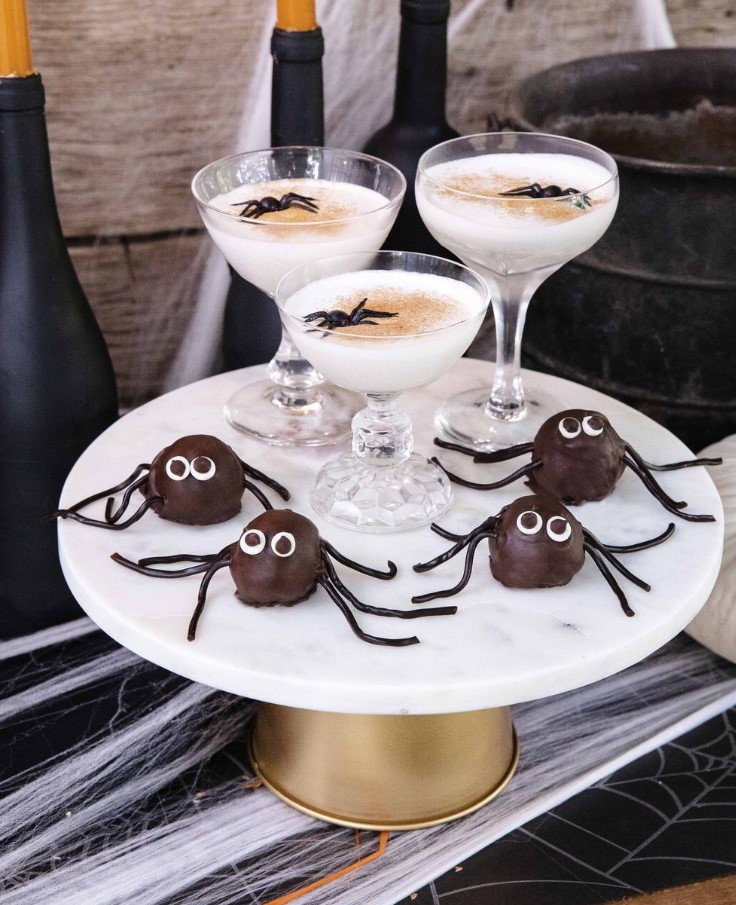
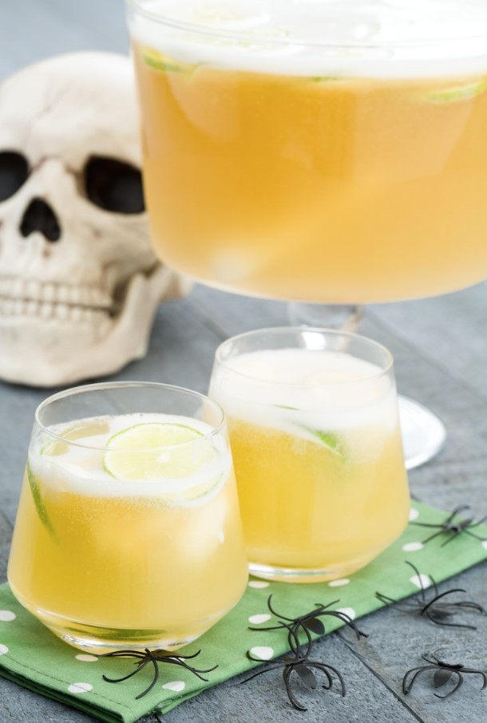
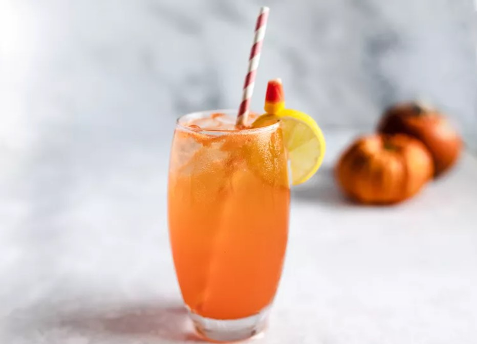

This article has been written and researched by our expert Loveable through a precise methodology. [Learn more about our methodology](https://avada.io/loveable/our-methodological.html)

[Loveable](https://avada.io/loveable/) > [Blog](https://avada.io/loveable/blog/) > [Holiday](https://avada.io/loveable/holiday/)

# 55+ Haunting Halloween Cocktails for an Unforgettable Night

Written by [Blake Simpson](https://avada.io/loveable/author/blake/) Last Updated on September 07, 2023

- [Spooky Fun Halloween Cocktails](https://avada.io/loveable/blog/halloween-cocktails/#wp-block-heading-2-3)
    - [1\. Witch’s Brew Punch with Ice Hands](https://avada.io/loveable/blog/halloween-cocktails/#wp-block-heading-3-5)
    - [2\. Candy Corn Cocktail](https://avada.io/loveable/blog/halloween-cocktails/#wp-block-heading-3-9)
    - [3\. Bloody Mule Cocktail](https://avada.io/loveable/blog/halloween-cocktails/#wp-block-heading-3-13)
    - [4\. Apple Cider Punch](https://avada.io/loveable/blog/halloween-cocktails/#wp-block-heading-3-17)
    - [5\. Tart Cherry Eyeball Punch](https://avada.io/loveable/blog/halloween-cocktails/#wp-block-heading-3-21)
    - [6\. Liquid Web Cocktails](https://avada.io/loveable/blog/halloween-cocktails/#wp-block-heading-3-25)
    - [7\. Pomegranate-Rum Punch](https://avada.io/loveable/blog/halloween-cocktails/#wp-block-heading-3-29)
    - [8\. Old Scholar](https://avada.io/loveable/blog/halloween-cocktails/#wp-block-heading-3-33)
    - [9\. Cranberry Mulled White Wine](https://avada.io/loveable/blog/halloween-cocktails/#wp-block-heading-3-37)
    - [10\. Grilled Orange Old-Fashioned](https://avada.io/loveable/blog/halloween-cocktails/#wp-block-heading-3-41)
    - [11\. Sparkling Cider and Bourbon Cocktail](https://avada.io/loveable/blog/halloween-cocktails/#wp-block-heading-3-45)
    - [12\. Pumpkin Spice White Russian](https://avada.io/loveable/blog/halloween-cocktails/#wp-block-heading-3-49)
    - [13\. Haymaker](https://avada.io/loveable/blog/halloween-cocktails/#wp-block-heading-3-53)
    - [14\. Hot Toddy with Charred Oranges](https://avada.io/loveable/blog/halloween-cocktails/#wp-block-heading-3-57)
    - [15\. Cider Sidecar](https://avada.io/loveable/blog/halloween-cocktails/#wp-block-heading-3-61)
- [Scarily Delicious Halloween Cocktails](https://avada.io/loveable/blog/halloween-cocktails/#wp-block-heading-2-65)
    - [1\. Morton’s Candy Corn Old Fashioned](https://avada.io/loveable/blog/halloween-cocktails/#wp-block-heading-3-67)
    - [2\. The Grave Digger](https://avada.io/loveable/blog/halloween-cocktails/#wp-block-heading-3-71)
    - [3\. Poison Apple](https://avada.io/loveable/blog/halloween-cocktails/#wp-block-heading-3-75)
    - [4\. Diabolique](https://avada.io/loveable/blog/halloween-cocktails/#wp-block-heading-3-79)
    - [5\. The Smashing Pumpkin](https://avada.io/loveable/blog/halloween-cocktails/#wp-block-heading-3-83)
    - [6\. NOLET’S Silver Corpse Reviver](https://avada.io/loveable/blog/halloween-cocktails/#wp-block-heading-3-87)
    - [7\. Smoke, Mirrors and Colors](https://avada.io/loveable/blog/halloween-cocktails/#wp-block-heading-3-91)
    - [8\. A Spell On You…](https://avada.io/loveable/blog/halloween-cocktails/#wp-block-heading-3-95)
    - [9\. Zombie Smash](https://avada.io/loveable/blog/halloween-cocktails/#wp-block-heading-3-99)
    - [10\. Black Cauldron](https://avada.io/loveable/blog/halloween-cocktails/#wp-block-heading-3-103)
    - [11\. Mystery Machine](https://avada.io/loveable/blog/halloween-cocktails/#wp-block-heading-3-107)
    - [12\. Death Wish](https://avada.io/loveable/blog/halloween-cocktails/#wp-block-heading-3-111)
- [Easy Halloween Cocktails](https://avada.io/loveable/blog/halloween-cocktails/#wp-block-heading-2-115)
    - [1\. Apple Cider Spritz](https://avada.io/loveable/blog/halloween-cocktails/#wp-block-heading-3-117)
    - [2\. Halloween Sangria](https://avada.io/loveable/blog/halloween-cocktails/#wp-block-heading-3-121)
    - [3\. Boozy Screamsicle Shakes](https://avada.io/loveable/blog/halloween-cocktails/#wp-block-heading-3-125)
    - [4\. Pumpkin Juice](https://avada.io/loveable/blog/halloween-cocktails/#wp-block-heading-3-129)
    - [5\. Poison Apple Cocktails](https://avada.io/loveable/blog/halloween-cocktails/#wp-block-heading-3-133)
    - [6\. Last Word Cocktail](https://avada.io/loveable/blog/halloween-cocktails/#wp-block-heading-3-137)
    - [7\. Bloody Mary Syringes](https://avada.io/loveable/blog/halloween-cocktails/#wp-block-heading-3-141)
    - [8\. Boozy Butterbeer Punch](https://avada.io/loveable/blog/halloween-cocktails/#wp-block-heading-3-145)
    - [9\. Black Magic Margaritas](https://avada.io/loveable/blog/halloween-cocktails/#wp-block-heading-3-149)
    - [10\. Brain Big Batch Jell-O Shot](https://avada.io/loveable/blog/halloween-cocktails/#wp-block-heading-3-153)
    - [11\. Drunken Peanut Butter Cups](https://avada.io/loveable/blog/halloween-cocktails/#wp-block-heading-3-157)
    - [12\. Frankenpunch](https://avada.io/loveable/blog/halloween-cocktails/#wp-block-heading-3-161)
    - [13\. Jekyll & Gin](https://avada.io/loveable/blog/halloween-cocktails/#wp-block-heading-3-165)
    - [14\. Color-Changing Margaritas](https://avada.io/loveable/blog/halloween-cocktails/#wp-block-heading-3-169)
    - [15\. Witches’ Brew Lemonade](https://avada.io/loveable/blog/halloween-cocktails/#wp-block-heading-3-173)
- [Haunting Halloween Cocktails](https://avada.io/loveable/blog/halloween-cocktails/#wp-block-heading-2-177)
    - [1\. Candy Corn Shot](https://avada.io/loveable/blog/halloween-cocktails/#wp-block-heading-3-179)
    - [2\. Wolf Bite](https://avada.io/loveable/blog/halloween-cocktails/#wp-block-heading-3-183)
    - [3\. Peach Candy Corn Cocktail](https://avada.io/loveable/blog/halloween-cocktails/#wp-block-heading-3-187)
    - [4\. Zombie](https://avada.io/loveable/blog/halloween-cocktails/#wp-block-heading-3-191)
    - [5\. Ghostbuster](https://avada.io/loveable/blog/halloween-cocktails/#wp-block-heading-3-195)
    - [6\. Black Widow](https://avada.io/loveable/blog/halloween-cocktails/#wp-block-heading-3-199)
    - [7\. Skeleton Key](https://avada.io/loveable/blog/halloween-cocktails/#wp-block-heading-3-203)
    - [8\. Swamp Water Surprise](https://avada.io/loveable/blog/halloween-cocktails/#wp-block-heading-3-207)
    - [9\. Frog in a Blender](https://avada.io/loveable/blog/halloween-cocktails/#wp-block-heading-3-211)
    - [10\. Candy Appley Cocktail](https://avada.io/loveable/blog/halloween-cocktails/#wp-block-heading-3-215)
    - [11\. Vampire Kiss Martini](https://avada.io/loveable/blog/halloween-cocktails/#wp-block-heading-3-219)
    - [12\. Blood and Sand](https://avada.io/loveable/blog/halloween-cocktails/#wp-block-heading-3-223)
    - [13\. Mad Eye Martini](https://avada.io/loveable/blog/halloween-cocktails/#wp-block-heading-3-227)
    - [14\. Children of the Corn](https://avada.io/loveable/blog/halloween-cocktails/#wp-block-heading-3-231)
    - [15\. Halloween Hypnotist](https://avada.io/loveable/blog/halloween-cocktails/#wp-block-heading-3-235)
- [Conclusion](https://avada.io/loveable/blog/halloween-cocktails/#wp-block-heading-2-243)

Prepare to embark on a spine-tingling journey through the world of mixology with our selection of “55+ Haunting Halloween Cocktails for an Unforgettable Night.” Halloween, the season of shadows and spirits, beckons us to indulge in libations that are as mysterious and enchanting as the holiday itself.

In this curated collection, we’ve conjured up a bewitching array of haunting Halloween cocktails, each one designed to elevate your Halloween soirée to unforgettable heights. From eerie elixirs to sinister sips, these concoctions promise to cast a spell on your taste buds and leave your guests under their flavorful charm. So, dim the lights, summon the spirits, and let the haunting Halloween cocktails take center stage at your ghoulish gathering.

## **Spooky Fun Halloween Cocktails**

Each of these Halloween cocktails offers a unique and enchanting experience, from the eerie and whimsical to the warm and comforting. Choose the one that best suits the atmosphere of your Halloween gathering and raise a glass to the magic of the season.

### **1\. Witch’s Brew Punch with Ice Hands**

Enter the mystical world of Halloween with our Witch’s Brew Punch, a bewitching concoction that will cast a spell on your senses. This eerie elixir begins with a bubbling cauldron of fruit juices, including orange, pineapple, and lime, mixed with sparkling soda for a fizzy kick.

Get the recipe at [countryliving](https://www.countryliving.com/food-drinks/a44689593/witch-brew-punch-recipe-halloween/)

### **2\. Candy Corn Cocktail**

Celebrate Halloween with a burst of nostalgia and a touch of elegance with our Candy Corn Cocktail. This whimsical libation is a visual delight, featuring three perfectly layered colors reminiscent of the iconic candy corn.

Get the recipe at [countryliving](https://www.countryliving.com/food-drinks/a44664565/easy-candy-corn-cocktail-recipe/)

### **3\. Bloody Mule Cocktail**

The Bloody Mule Cocktail is a wickedly tempting twist on the classic Moscow Mule. We’ve conjured up this chilling creation by combining premium vodka with the fiery kick of ginger beer, creating a base with a bold and spicy character.

Get the recipe at [countryliving](https://www.countryliving.com/food-drinks/a44663632/bloody-mule-cocktail-recipe/)

### **4\. Apple Cider Punch**

Embrace the essence of autumn with our Apple Cider Punch, a drink that captures the cozy spirit of Halloween gatherings. This heartwarming elixir begins with a base of freshly pressed apple cider, simmered with cinnamon sticks and infused with the warmth of bourbon.

Get the recipe at [countryliving](https://www.countryliving.com/food-drinks/a44662558/apple-cider-punch-recipe/)

### **5\. Tart Cherry Eyeball Punch**

Dare to take a sip of our Tart Cherry Eyeball Punch, a concoction that adds a ghoulish twist to a classic favorite. This blood-red potion combines tart cherry juice with the effervescence of ginger ale, creating a tangy and refreshing base. Floating on its eerie surface are lychee “eyeballs,” each one filled with a sinister blueberry center.

Get the recipe at [countryliving](https://www.countryliving.com/food-drinks/a36687070/tart-cherry-eyeball-punch/)

### **6\. Liquid Web Cocktails**

Behold the enigmatic allure of our Liquid Web Cocktails, a bewitching blend of flavors that promises to ensnare your senses. These mysterious libations are as much a work of art as they are a drink, each one a unique web of flavors and colors. Crafted from a secret concoction of spirits, fruit juices, and special elixirs, each Liquid Web Cocktail is a unique creation with intricate patterns that seem to dance in your glass.

Get the recipe at [countryliving](https://www.countryliving.com/food-drinks/a33943308/liquid-web-cocktails/)

### **7\. Pomegranate-Rum Punch**

Unleash the dark and fruity side of Halloween with our Pomegranate-Rum Punch, a libation that will awaken your inner vampire. Garnished with pomegranate seeds and a sprig of fresh mint, it’s a concoction that tantalizes your taste buds with a tantalizing blend of sweet, tart, and spicy notes.

Get the recipe at [countryliving](https://www.countryliving.com/food-drinks/a23390880/pomegranate-rum-punch-recipe/)

### **8\. Old Scholar**

For those who prefer their Halloween libations with a touch of elegance, the Old Scholar cocktail is a refined choice that pays homage to the classics. Crafted with the utmost care, this drink combines aged bourbon with a hint of smoky maple syrup, creating a rich and velvety concoction that warms your soul.

Get the recipe at [countryliving](https://www.countryliving.com/food-drinks/a41332837/old-scholar-rye-whiskey-cocktail-recipe/)

### **9\. Cranberry Mulled White Wine**

Experience the comfort of a crackling fireplace and the rustling of fallen leaves with our Cranberry Mulled White Wine. This delightful concoction combines crisp white wine with the comforting spices of autumn, including cinnamon, cloves, and star anise.

Get the recipe at [countryliving](https://www.countryliving.com/food-drinks/a41338303/cranberry-mulled-white-wine-recipe/)

### **10\. Grilled Orange Old-Fashioned**

Step into the shadows of Halloween with the Grilled Orange Old-Fashioned, a cocktail that marries tradition with a touch of mystery. A blend of bourbon, bitters, and a hint of grilled orange syrup creates a rich and complex flavor profile that lingers on your palate.

Get the recipe at [countryliving](https://www.countryliving.com/food-drinks/a40993393/grilled-orange-old-fashioned-recipe/)

### **11\. Sparkling Cider and Bourbon Cocktail**

Raise your glass to the crisp beauty of autumn with our Sparkling Cider and Bourbon Cocktail. This effervescent potion combines the earthy warmth of bourbon with the sparkling sweetness of apple cider, creating a drink that’s as refreshing as it is invigorating.

Get the recipe at [countryliving](https://www.countryliving.com/food-drinks/a40993369/sparkling-cider-and-bourbon-cocktail-recipe/)

### **12\. Pumpkin Spice White Russian**

Indulge in the flavors of the season with our Pumpkin Spice White Russian, a creamy and decadent treat that captures the essence of autumn. This delightful concoction combines the smoothness of vodka and coffee liqueur with the comforting warmth of pumpkin spice creamer.

Get the recipe at [countryliving](https://www.countryliving.com/food-drinks/a33944101/pumpkin-spice-white-russian/)

### **13\. Haymaker**

The Haymaker is a rustic and robust cocktail that embodies the spirit of the harvest season. Crafted with care, it combines the earthy notes of dark rum with the sweetness of honey and the zing of fresh lemon juice. The addition of a sprig of rosemary lends a hint of herbal sophistication to this down-to-earth libation.

Get the recipe at [countryliving](https://www.countryliving.com/food-drinks/a37598524/haymaker-cocktail-recipe/)

### **14\. Hot Toddy with Charred Oranges**

Warm your bones and chase away the autumn chill with our Hot Toddy with Charred Oranges. This comforting elixir starts with a base of soothing whiskey, infused with the sweetness of honey and the zesty tang of lemon juice. What sets it apart is the charred orange slice that crowns the glass, imparting a smoky and citrusy depth to each sip.

Get the recipe at [countryliving](https://www.countryliving.com/food-drinks/a34945104/hot-toddy-with-charred-oranges-recipe/)

### **15\. Cider Sidecar**

Our Cider Sidecar is a delightful twist on a classic cocktail, showcasing the vibrant flavors of fall. This enchanting concoction blends the bright and crisp notes of apple cider with the sophistication of brandy and a hint of orange liqueur. Served in a sugar-rimmed glass with a twist of orange peel, it’s a drink that marries the sweetness of the season with the timeless elegance of a Sidecar.

Get the recipe at [countryliving](https://www.countryliving.com/food-drinks/a23326064/cider-sidecar-recipe/)

## **Scarily Delicious Halloween Cocktails**

These bewitching concoctions combine a blend of intriguing ingredients, sinister colors, and enchanting garnishes to create drinks that both thrill and delight the palate. Whether they feature eerie ice hands, candy corn infusions, or a smoky mystique, these cocktails promise a taste adventure that’s perfect for adding a spooky twist to your Halloween festivities. Sip cautiously, for in every bewitched glass lies a deliciously wicked surprise.

### **1\. Morton’s Candy Corn Old Fashioned**

Morton’s Candy Corn Old Fashioned is a hauntingly delightful twist on a classic cocktail. It captures the nostalgic essence of Halloween with the rich flavors of caramel and candy corn-infused bourbon.

Get the recipe at [bbcgoodfood](https://www.bbcgoodfood.com/recipes/candy-corn-old-fashioned)

### **2\. The Grave Digger**

The Grave Digger is a cocktail that digs deep into the dark and mysterious. Crafted with black vodka, blackberry liqueur, and a hint of citrus, it’s a drink that lingers on your palate like a ghostly whisper. Served in a chilled glass rimmed with black sugar, it’s the perfect choice for those who enjoy their cocktails on the shadowy side.

Get the recipe at [boulderlocavore](https://boulderlocavore.com/the-grave-digger-cocktail/)

### **3\. Poison Apple**

The Poison Apple cocktail is a sinister sip that captures the essence of a wicked witch’s brew. This delectable elixir combines apple brandy with a touch of blackcurrant liqueur, creating a deep and intoxicating flavor profile.

Get the recipe at [theseasidebaker](https://theseasidebaker.com/poison-apple-halloween-cocktail/)

### **4\. Diabolique**

Diabolique is a devilishly delicious cocktail that embraces the darker side of Halloween. A blend of dark rum, amaretto, and espresso liqueur, it’s a drink that packs a punch of rich and complex flavors. Served in a glass with a hint of smoky ambiance, it’s the perfect libation for those who revel in the macabre and mysterious.

Get the recipe at [pandorascigarbox](https://www.pandorascigarbox.com/2020/11/08/diabolique-cocktail/)

### **5\. The Smashing Pumpkin**

The Smashing Pumpkin cocktail is a celebration of the season’s bounty with a hint of mischief. Crafted with pumpkin-infused bourbon, a touch of cinnamon syrup, and a splash of orange liqueur, it’s a drink that’s both spicy and sweet. Garnished with a twist of orange peel and a dusting of cinnamon, it’s a delightful way to toast to Halloween and the magic of autumn.

Get the recipe at [liquor](https://www.liquor.com/recipes/smashing-pumpkin/)

### **6\. NOLET’S Silver Corpse Reviver**

NOLET’S Silver Corpse Reviver is a revitalizing potion that awakens the senses. This hauntingly clear cocktail combines the premium NOLET’S Silver Gin with Lillet Blanc, Cointreau, and a hint of absinthe, creating a bright and invigorating elixir. Served in an absinthe-rinsed glass with a lemon twist, it’s the perfect choice for those who seek a touch of elegance with their Halloween thrills.

Get the recipe at [noletsgin](https://noletsgin.com/recipe/corpse/)

### **7\. Smoke, Mirrors and Colors**

Smoke, Mirrors and Colors is a cocktail that’s as mesmerizing as it is delicious. Crafted with mezcal, elderflower liqueur, and a splash of violet liqueur, it’s a drink that captures the essence of a magician’s show. The addition of a smoky mezcal rinse adds a layer of intrigue, while a colorful garnish of edible flowers adds a touch of enchantment to each sip.

Get the recipe at [dujour](https://dujour.com/life/drink-dujour-smoke-mirrors-and-colors/)

### **8\. A Spell On You…**

A Spell On You… is a bewitching libation that promises to enchant your taste buds. This magical cocktail combines blueberry vodka with blackberry liqueur and a splash of lemon juice, creating a potion that’s both sweet and tangy. Served in a glass rimmed with purple sugar and garnished with a twist of lemon peel, it’s a drink that casts a spell of deliciousness on anyone who dares to indulge.

Get the recipe at [thegandmkitchen](https://thegandmkitchen.com/hocus-pocus-inspired-cocktail-i-put-a-spell-on-you/)

### **9\. Zombie Smash**

The Zombie Smash is a cocktail that will leave you feeling like the undead in the best way possible. Made with a blend of dark and light rums, tropical fruit juices, and a hint of almond syrup, it’s a drink that’s as fruity as it is potent.

Get the recipe at [AngryCocktails](https://www.youtube.com/watch?v=COvU-mxPXzQ)

### **10\. Black Cauldron**

The Black Cauldron is a dark and mysterious concoction that captures the essence of a witch’s brew. This inky elixir combines black vodka with blackcurrant liqueur and a splash of cranberry juice, creating a drink that’s both enchanting and chilling.

Get the recipe at [alushlifemanual](https://alushlifemanual.com/hornitos-black-cauldron)

### **11\. Mystery Machine**

The Mystery Machine cocktail is a playful and whimsical libation that pays homage to everyone’s favorite crime-solving gang. This colorful concoction blends blue curaçao, coconut rum, and pineapple juice, creating a drink that’s as vibrant as it is delicious. Served with a gummy worm garnish and a splash of mystery, it’s a cocktail that’s perfect for Halloween parties and nostalgic gatherings.

Get the recipe at [pinterestcocktail](https://www.pinterest.com/pin/631278072753660068/)

### **12\. Death Wish**

The Death Wish cocktail is a daring and intense libation for those who seek a thrill on Halloween night. Crafted with a potent combination of high-proof bourbon, coffee liqueur, and a dash of bitters, it’s a drink that packs a punch and leaves a lasting impression.

Get the recipe at [thegourmetinside](https://thegourmetinsider.com/death-wish/)

## **Easy Halloween Cocktails**

These Halloween cocktails offer a wide range of flavors and experiences, from playful and sweet to dark and mysterious, making them perfect additions to your spooky celebrations. Choose the ones that most intrigue you and your guests and let the magic of Halloween come to life in each sip.

### **1\. Apple Cider Spritz**

The Apple Cider Spritz is a refreshing and crisp Halloween concoction that celebrates the essence of fall. It combines the comforting flavors of apple cider with the effervescence of sparkling wine, creating a bubbly and delightful potion. Garnished with a cinnamon stick and a slice of apple, it’s the perfect way to toast to the changing leaves and cool autumn nights.

Get the recipe at [delish](https://www.delish.com/cooking/recipe-ideas/a41312899/apple-cider-spritz-recipe/)

### **2\. Halloween Sangria**

Halloween Sangria is a vibrant and fruity libation that captures the spirited colors of the season. This bewitching beverage blends red wine with a medley of fresh fruits and a splash of brandy. Served in a glass garnished with a blackberry “eyeball,” it’s a delightful way to add a touch of elegance to your Halloween celebrations.

Get the recipe at [delish](https://www.delish.com/cooking/recipe-ideas/a44787887/halloween-sangria-recipe/)

### **3\. Boozy Screamsicle Shakes**

Boozy Screamsicle Shakes are a playful and indulgent treat that’s perfect for Halloween festivities. These creamy concoctions combine vanilla ice cream with orange liqueur and a splash of vodka, creating a delightful fusion of flavors reminiscent of the classic creamsicle. Served with a swirl of whipped cream and a sprinkle of orange zest, they’re a sweet and spooky delight.

Get the recipe at [delish](https://www.delish.com/holiday-recipes/halloween/a29007809/boozy-screamsicle-shakes-recipe/)

### **4\. Pumpkin Juice**

Pumpkin Juice is a quintessential Halloween libation that pays homage to the enchanting world of wizards and witches. Crafted with pumpkin puree, spices, and a hint of apple cider, it’s a drink that captures the cozy magic of fall. Served in rustic mugs with a cinnamon stick, it’s a potion that transports you to a realm of enchantment and wonder.

Get the recipe at [delish](https://www.delish.com/cooking/a41447206/harry-potter-pumpkin-juice-recipe/)

### **5\. Poison Apple Cocktails**

Poison Apple Cocktails are a tantalizing blend of dark and mysterious flavors. These sinister elixirs combine apple brandy with blackcurrant liqueur and a hint of lemon juice, creating a concoction that’s as intriguing as it is delicious. Garnished with a slice of green apple, they promise a bewitched taste experience that lingers on the palate.

Get the recipe at [delish](https://www.delish.com/cooking/recipe-ideas/a23878264/poison-apple-cocktails-recipe/)

### **6\. Last Word Cocktail**

The Last Word Cocktail is a classic libation that exudes an air of intrigue and sophistication. Crafted with equal parts gin, green Chartreuse, maraschino liqueur, and freshly squeezed lime juice, it’s a drink that’s both balanced and bold.

Get the recipe at [delish](https://www.delish.com/cooking/recipe-ideas/a42831436/last-word-cocktail-recipe/)

### **7\. Bloody Mary Syringes**

Bloody Mary Syringes are a playful and spooky twist on the classic brunch cocktail. These chilling concoctions feature a blend of vodka, tomato juice, spices, and a dash of hot sauce. Served in syringes for a gory effect, they’re a fun and interactive way to enjoy the bold flavors of a Bloody Mary.

Get the recipe at [delish](https://www.delish.com/cooking/recipe-ideas/a24132876/bloody-mary-syringes-recipe/)

### **8\. Boozy Butterbeer Punch**

Boozy Butterbeer Punch is a magical libation that brings the wizarding world of Harry Potter to life. It combines the warmth of butterscotch schnapps with the creamy notes of cream soda and a touch of rum.

Get the recipe at [delish](https://www.delish.com/cooking/recipe-ideas/recipes/a55804/boozy-butterbeer-punch-recipe/)

### **9\. Black Magic Margaritas**

Black Magic Margaritas are a mysterious and alluring cocktail that captures the essence of a moonlit Halloween night. These dark and enchanting libations blend blackberry liqueur with tequila and lime juice, creating a drink that’s both sweet and tangy.

Get the recipe at [delish](https://www.delish.com/cooking/recipe-ideas/recipes/a55953/black-magic-margaritas-recipe/)

### **10\. Brain Big Batch Jell-O Shot**

The Brain Big Batch Jell-O Shot is a ghoulishly fun treat that’s perfect for Halloween parties. These gelatin shots are made with fruit-flavored vodka and a touch of grenadine, creating a vibrant and wobbly concoction that resembles a brain.

Get the recipe at [delish](https://www.delish.com/cooking/recipe-ideas/recipes/a49582/brain-big-batch-jell-o-shot-recipe/)

### **11\. Drunken Peanut Butter Cups**

Drunken Peanut Butter Cups are a sinfully delicious treat that combines the flavors of peanut butter and chocolate with a boozy twist. These sweet and savory delights are crafted with a peanut butter-infused liqueur and a touch of chocolate liqueur, creating a dessert cocktail that’s as indulgent as it is delightful.

Get the recipe at [delish](https://www.delish.com/cooking/recipe-ideas/recipes/a58358/drunken-peanut-butter-cups-recipe/)

### **12\. Frankenpunch**

Frankenpunch is a monstrous punch that’s sure to electrify your Halloween party. This eerie elixir combines green apple vodka with melon liqueur and lemon-lime soda, creating a radioactive-hued potion that’s both refreshing and chilling.

Get the recipe at [delish](https://www.delish.com/cooking/recipe-ideas/recipes/a44172/frankenpunch-lime-sherbert-recipe/)

### **13\. Jekyll & Gin**

Jekyll & Gin is a cocktail that explores the duality of flavors. It blends gin with absinthe, creating a drink that’s both herbal and mysterious. Served with a twist of lemon, it’s a libation that invites you to embrace the adventurous side of mixology, making it a perfect choice for Halloween gatherings.

Get the recipe at [delish](https://www.delish.com/cooking/recipe-ideas/recipes/a44311/jekyll-gin-glowing-cocktails-glow-party-ideas/)

### **14\. Color-Changing Margaritas**

Color-Changing Margaritas are a mesmerizing and magical cocktail that transforms before your eyes. These vibrant concoctions are made with butterfly pea flower tea, which changes the color of the drink from deep blue to purple when mixed with citrus juice.

Get the recipe at [delish](https://www.delish.com/cooking/recipe-ideas/a27183454/color-changing-margaritas-recipe/)

### **15\. Witches’ Brew Lemonade**

Witches’ Brew Lemonade is a spellbinding and tangy concoction that’s perfect for Halloween. This bewitching beverage combines lemonade with black vodka and a splash of elderflower liqueur, creating a dark and mysterious elixir.

Get the recipe at [delis](https://www.delish.com/holiday-recipes/halloween/a29178988/witches-brew-lemonade-recipe/)[h](https://www.delish.com/holiday-recipes/halloween/a29178988/witches-brew-lemonade-recipe/)

## **Haunting Halloween Cocktails**

With sinister names and bewitching ingredients, these cocktails are a thrilling addition to any Halloween gathering. Each sip is an experience that dances between the realms of the supernatural and the delicious, promising a hauntingly good time that lingers long after the night has passed. Raise your glass to the macabre, for in these cocktails, you’ll find a taste of the dark and mysterious side of Halloween.

### **1\. Candy Corn Shot**

The Candy Corn Shot is a sweet and colorful Halloween treat that pays homage to the iconic candy. This layered concoction features a combination of vibrant orange, sunny yellow, and creamy white layers, mimicking the look of candy corn. Each sip is a burst of sugary delight, making it the perfect shot for those with a sweet tooth.

Get the recipe at [thespruceeats](https://www.thespruceeats.com/candy-corn-shooter-recipe-759614)

### **2\. Wolf Bite**

The Wolf Bite cocktail is a bewitching libation that captures the essence of the mysterious night. Crafted with black vodka, blue curaçao, and a splash of cranberry juice, it’s a drink that’s as dark and enigmatic as the night itself.

Get the recipe at [thespruceeat](https://www.thespruceeats.com/wolf-bite-shot-recipe-759565)

### **3\. Peach Candy Corn Cocktail**

The Peach Candy Corn Cocktail is a delightful fusion of fruity flavors with a touch of Halloween whimsy. Blending peach schnapps with orange liqueur and cream creates a creamy and peachy concoction that’s reminiscent of candy corn.

Get the recipe at [thespruceeats](https://www.thespruceeats.com/peach-candy-corn-cocktail-a-sweet-izze-drink-for-halloween-4101012)

### **4\. Zombie**

The Zombie cocktail is a spine-tingling classic known for its potent combination of rums and tropical flavors. It features a mix of light and dark rum, apricot brandy, lime juice, and a hint of grenadine for a vibrant hue.

Get the recipe at [thespruceeats](https://www.thespruceeats.com/zombie-cocktail-recipe-761643)

### **5\. Ghostbuster**

Description: The Ghostbuster cocktail is a playful and vibrant libation that captures the spirit of Halloween with a sense of fun. Crafted with citrus vodka, blue curaçao, and lemonade, it creates a vivid blue potion that’s both refreshing and electrifying.

Get the recipe at [thespruceeats](https://www.thespruceeats.com/ghostbuster-cocktail-recipe-759668)

### **6\. Black Widow**

The Black Widow cocktail is a sultry and mysterious libation that weaves a web of dark and delightful flavors. Combining black vodka with black raspberry liqueur and cranberry juice, it creates a drink that’s as dark and alluring as its namesake. Served with a blackberry garnish, it’s a sip that leaves a lasting impression.

Get the recipe at [thespruceeats](https://www.thespruceeats.com/black-widow-recipe-761008)

### **7\. Skeleton Key**

The Skeleton Key cocktail is a sophisticated and intriguing concoction that opens the door to a world of flavors. This elixir combines gin with elderflower liqueur and a splash of lemon juice, creating a floral and citrusy drink.

Get the recipe at [thespruceeats](https://www.thespruceeats.com/skeleton-key-cocktail-recipe-761383)

### **8\. Swamp Water Surprise**

The Swamp Water Surprise is a spooky and mysterious potion that takes you deep into the eerie depths of the bayou. Combining melon liqueur, coconut rum, and pineapple juice, it creates a green-hued drink that’s both tropical and haunting.

Get the recipe at [thespruceeats](https://www.thespruceeats.com/swamp-water-surprise-recipe-760569)

### **9\. Frog in a Blender**

Frog in a Blender is a whimsical and playful cocktail that adds a touch of humor to your Halloween festivities. Blending melon liqueur, citrus vodka, and a splash of sour mix, it creates a bright green concoction that’s as zesty as it is fun.

Get the recipe at [thespruceeats](https://www.thespruceeats.com/frog-in-a-blender-recipe-761055)

### **10\. Candy Appley Cocktail**

The Candy Appley Cocktail is a delightful fusion of apple and caramel flavors with a Halloween twist. Combining apple schnapps with caramel vodka and a hint of butterscotch liqueur, it creates a drink that’s sweet and comforting. Served with a caramel rim and an apple slice, it’s a treat for your taste buds.

Get the recipe at [thespruceeats](https://www.thespruceeats.com/candy-appley-cocktail-recipe-761341)

### **11\. Vampire Kiss Martini**

The Vampire Kiss Martini is a seductive and elegant libation that captures the allure of the night. Crafted with vodka, Chambord raspberry liqueur, and a splash of cranberry juice, it creates a deep red elixir that’s as tantalizing as a vampire’s kiss.

Get the recipe at [thespruceeats](https://www.thespruceeats.com/vampire-kiss-martini-recipe-761200)

### **12\. Blood and Sand**

Blood and Sand is a classic cocktail with a name that’s perfect for Halloween. It combines Scotch whisky, sweet vermouth, orange juice, and a hint of cherry liqueur, creating a harmonious blend of smoky, sweet, and citrusy flavors.

Get the recipe at [thespruceeats](https://www.thespruceeats.com/blood-and-sand-cocktail-recipe-761336)

### **13\. Mad Eye Martini**

The Mad Eye Martini is a whimsical and eye-catching cocktail that adds a touch of playful madness to your Halloween celebrations. Crafted with blue raspberry vodka, blue curaçao, and a splash of lemonade, it creates a bright blue potion that’s as fun to look at as it is to sip.

Get the recipe at [thespruceeats](https://www.thespruceeats.com/mad-eye-martini-recipe-761104)

### **14\. Children of the Corn**

Children of the Corn is a chillingly named cocktail that captures the eerie essence of Halloween. Blending rum with cream of coconut and pineapple juice, it creates a tropical potion that’s both creamy and refreshing. Served with a sprinkle of cinnamon, it’s a drink that conjures visions of cornfields and creepy tales.

Get the recipe at [thespruceeats](https://www.thespruceeats.com/children-of-the-corn-cocktail-recipe-759057)

### **15\. Halloween Hypnotist**

The Halloween Hypnotist cocktail is a mesmerizing and mystical libation that adds an air of enchantment to your celebrations.

Get the recipe at [thespruceeats](https://www.thespruceeats.com/halloween-hpnotist-recipe-761076)

**_See More:_**

- Best [Halloween Drinks](https://avada.io/loveable/blog/halloween-drinks/)

- Best [Halloween Punch Ideas](https://avada.io/loveable/blog/halloween-punch/)

- Best [Halloween Party Games For Adults](https://avada.io/loveable/blog/halloween-party-games-adults/)

## **Conclusion**

As the witching hour approaches and the moon casts its eerie glow, we hope you’ve found inspiration in our **55+ haunting Halloween cocktails**. These chilling libations are more than just drinks; they are potions that transport you to a world of spookiness and delight.

Whether you choose to sip on a Candy Corn Shot, summon the spirits with a Ghostbuster, or embrace the allure of a Vampire Kiss Martini, these cocktails are sure to be the highlight of your Halloween festivities. So, as you raise your glass to toast the season of the supernatural, may the haunting Halloween cocktails continue to enchant and mystify, making your night truly unforgettable. Here’s to a Halloween filled with thrills, chills, and deliciously eerie sips!

- [Spooky Fun Halloween Cocktails](https://avada.io/loveable/blog/halloween-cocktails/#wp-block-heading-2-3)
    - [1\. Witch’s Brew Punch with Ice Hands](https://avada.io/loveable/blog/halloween-cocktails/#wp-block-heading-3-5)
    - [2\. Candy Corn Cocktail](https://avada.io/loveable/blog/halloween-cocktails/#wp-block-heading-3-9)
    - [3\. Bloody Mule Cocktail](https://avada.io/loveable/blog/halloween-cocktails/#wp-block-heading-3-13)
    - [4\. Apple Cider Punch](https://avada.io/loveable/blog/halloween-cocktails/#wp-block-heading-3-17)
    - [5\. Tart Cherry Eyeball Punch](https://avada.io/loveable/blog/halloween-cocktails/#wp-block-heading-3-21)
    - [6\. Liquid Web Cocktails](https://avada.io/loveable/blog/halloween-cocktails/#wp-block-heading-3-25)
    - [7\. Pomegranate-Rum Punch](https://avada.io/loveable/blog/halloween-cocktails/#wp-block-heading-3-29)
    - [8\. Old Scholar](https://avada.io/loveable/blog/halloween-cocktails/#wp-block-heading-3-33)
    - [9\. Cranberry Mulled White Wine](https://avada.io/loveable/blog/halloween-cocktails/#wp-block-heading-3-37)
    - [10\. Grilled Orange Old-Fashioned](https://avada.io/loveable/blog/halloween-cocktails/#wp-block-heading-3-41)
    - [11\. Sparkling Cider and Bourbon Cocktail](https://avada.io/loveable/blog/halloween-cocktails/#wp-block-heading-3-45)
    - [12\. Pumpkin Spice White Russian](https://avada.io/loveable/blog/halloween-cocktails/#wp-block-heading-3-49)
    - [13\. Haymaker](https://avada.io/loveable/blog/halloween-cocktails/#wp-block-heading-3-53)
    - [14\. Hot Toddy with Charred Oranges](https://avada.io/loveable/blog/halloween-cocktails/#wp-block-heading-3-57)
    - [15\. Cider Sidecar](https://avada.io/loveable/blog/halloween-cocktails/#wp-block-heading-3-61)
- [Scarily Delicious Halloween Cocktails](https://avada.io/loveable/blog/halloween-cocktails/#wp-block-heading-2-65)
    - [1\. Morton’s Candy Corn Old Fashioned](https://avada.io/loveable/blog/halloween-cocktails/#wp-block-heading-3-67)
    - [2\. The Grave Digger](https://avada.io/loveable/blog/halloween-cocktails/#wp-block-heading-3-71)
    - [3\. Poison Apple](https://avada.io/loveable/blog/halloween-cocktails/#wp-block-heading-3-75)
    - [4\. Diabolique](https://avada.io/loveable/blog/halloween-cocktails/#wp-block-heading-3-79)
    - [5\. The Smashing Pumpkin](https://avada.io/loveable/blog/halloween-cocktails/#wp-block-heading-3-83)
    - [6\. NOLET’S Silver Corpse Reviver](https://avada.io/loveable/blog/halloween-cocktails/#wp-block-heading-3-87)
    - [7\. Smoke, Mirrors and Colors](https://avada.io/loveable/blog/halloween-cocktails/#wp-block-heading-3-91)
    - [8\. A Spell On You…](https://avada.io/loveable/blog/halloween-cocktails/#wp-block-heading-3-95)
    - [9\. Zombie Smash](https://avada.io/loveable/blog/halloween-cocktails/#wp-block-heading-3-99)
    - [10\. Black Cauldron](https://avada.io/loveable/blog/halloween-cocktails/#wp-block-heading-3-103)
    - [11\. Mystery Machine](https://avada.io/loveable/blog/halloween-cocktails/#wp-block-heading-3-107)
    - [12\. Death Wish](https://avada.io/loveable/blog/halloween-cocktails/#wp-block-heading-3-111)
- [Easy Halloween Cocktails](https://avada.io/loveable/blog/halloween-cocktails/#wp-block-heading-2-115)
    - [1\. Apple Cider Spritz](https://avada.io/loveable/blog/halloween-cocktails/#wp-block-heading-3-117)
    - [2\. Halloween Sangria](https://avada.io/loveable/blog/halloween-cocktails/#wp-block-heading-3-121)
    - [3\. Boozy Screamsicle Shakes](https://avada.io/loveable/blog/halloween-cocktails/#wp-block-heading-3-125)
    - [4\. Pumpkin Juice](https://avada.io/loveable/blog/halloween-cocktails/#wp-block-heading-3-129)
    - [5\. Poison Apple Cocktails](https://avada.io/loveable/blog/halloween-cocktails/#wp-block-heading-3-133)
    - [6\. Last Word Cocktail](https://avada.io/loveable/blog/halloween-cocktails/#wp-block-heading-3-137)
    - [7\. Bloody Mary Syringes](https://avada.io/loveable/blog/halloween-cocktails/#wp-block-heading-3-141)
    - [8\. Boozy Butterbeer Punch](https://avada.io/loveable/blog/halloween-cocktails/#wp-block-heading-3-145)
    - [9\. Black Magic Margaritas](https://avada.io/loveable/blog/halloween-cocktails/#wp-block-heading-3-149)
    - [10\. Brain Big Batch Jell-O Shot](https://avada.io/loveable/blog/halloween-cocktails/#wp-block-heading-3-153)
    - [11\. Drunken Peanut Butter Cups](https://avada.io/loveable/blog/halloween-cocktails/#wp-block-heading-3-157)
    - [12\. Frankenpunch](https://avada.io/loveable/blog/halloween-cocktails/#wp-block-heading-3-161)
    - [13\. Jekyll & Gin](https://avada.io/loveable/blog/halloween-cocktails/#wp-block-heading-3-165)
    - [14\. Color-Changing Margaritas](https://avada.io/loveable/blog/halloween-cocktails/#wp-block-heading-3-169)
    - [15\. Witches’ Brew Lemonade](https://avada.io/loveable/blog/halloween-cocktails/#wp-block-heading-3-173)
- [Haunting Halloween Cocktails](https://avada.io/loveable/blog/halloween-cocktails/#wp-block-heading-2-177)
    - [1\. Candy Corn Shot](https://avada.io/loveable/blog/halloween-cocktails/#wp-block-heading-3-179)
    - [2\. Wolf Bite](https://avada.io/loveable/blog/halloween-cocktails/#wp-block-heading-3-183)
    - [3\. Peach Candy Corn Cocktail](https://avada.io/loveable/blog/halloween-cocktails/#wp-block-heading-3-187)
    - [4\. Zombie](https://avada.io/loveable/blog/halloween-cocktails/#wp-block-heading-3-191)
    - [5\. Ghostbuster](https://avada.io/loveable/blog/halloween-cocktails/#wp-block-heading-3-195)
    - [6\. Black Widow](https://avada.io/loveable/blog/halloween-cocktails/#wp-block-heading-3-199)
    - [7\. Skeleton Key](https://avada.io/loveable/blog/halloween-cocktails/#wp-block-heading-3-203)
    - [8\. Swamp Water Surprise](https://avada.io/loveable/blog/halloween-cocktails/#wp-block-heading-3-207)
    - [9\. Frog in a Blender](https://avada.io/loveable/blog/halloween-cocktails/#wp-block-heading-3-211)
    - [10\. Candy Appley Cocktail](https://avada.io/loveable/blog/halloween-cocktails/#wp-block-heading-3-215)
    - [11\. Vampire Kiss Martini](https://avada.io/loveable/blog/halloween-cocktails/#wp-block-heading-3-219)
    - [12\. Blood and Sand](https://avada.io/loveable/blog/halloween-cocktails/#wp-block-heading-3-223)
    - [13\. Mad Eye Martini](https://avada.io/loveable/blog/halloween-cocktails/#wp-block-heading-3-227)
    - [14\. Children of the Corn](https://avada.io/loveable/blog/halloween-cocktails/#wp-block-heading-3-231)
    - [15\. Halloween Hypnotist](https://avada.io/loveable/blog/halloween-cocktails/#wp-block-heading-3-235)
- [Conclusion](https://avada.io/loveable/blog/halloween-cocktails/#wp-block-heading-2-243)

### [Blake Simpson](https://avada.io/loveable/author/blake/)

Hi, I'm Blake from Loveable. I help people find perfect gifts for occasions like anniversaries and weddings. I also write a blog about holidays, sharing insights to make them more meaningful. Let's create unforgettable moments together!

- [Twitter](https://twitter.com/intent/tweet)
- [Facebook](https://www.facebook.com/sharer/sharer.php)
- [instagram](https://avada.io/loveable/blog/halloween-cocktails/)
- [pinterest](https://www.pinterest.com/loveablellc/)

## Related Posts

[### 120+ Christian Birthday Wishes To Spread Your Love](https://avada.io/loveable/blog/christian-birthday-wishes/) 

[

### 35 Best 70th Birthday Ideas To Celebrate The Special Milestone

](https://avada.io/loveable/blog/70th-birthday-ideas/)

[

### 50 Best 30th Birthday Decorations for a Remarkable Birthday Bash

](https://avada.io/loveable/blog/30th-birthday-decorations/)

[

### 40 Delicious Vegan Christmas Desserts to Delight Your Palate

](https://avada.io/loveable/blog/vegan-christmas-desserts/)

[

### 60 Christmas Team Building Activities to Boost Workplace Spirit

](https://avada.io/loveable/blog/christmas-team-building-activities/)
