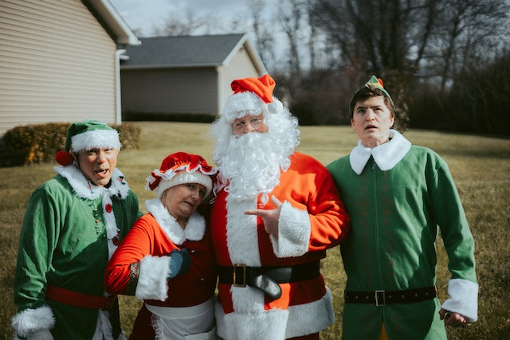
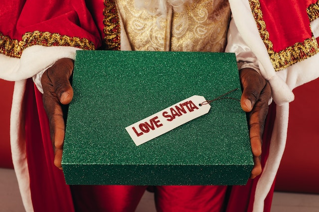

This article has been written and researched by our expert Loveable through a precise methodology. [Learn more about our methodology](https://avada.io/loveable/our-methodological.html)

[Loveable](https://avada.io/loveable/) > [Blog](https://avada.io/loveable/blog/) > [Holiday](https://avada.io/loveable/holiday/)

# 60+ Best Christmas Knock Knock Jokes That Spread Holiday Cheer With Laughter

Written by [Blake Simpson](https://avada.io/loveable/author/blake/) Last Updated on September 07, 2023

- [60+ Christmas Knock Knock Jokes For Festive Fun](https://avada.io/loveable/blog/christmas-knock-knock-jokes/#wp-block-heading-2-3) 
    - [Christmas Jokes With A Knock Knock Twist For Kids](https://avada.io/loveable/blog/christmas-knock-knock-jokes/#wp-block-heading-3-4)
    - [Knock Knock Jokes Featuring Playful Elves](https://avada.io/loveable/blog/christmas-knock-knock-jokes/#wp-block-heading-3-30)
    - [Santa-Themed Knock Knock Humor](https://avada.io/loveable/blog/christmas-knock-knock-jokes/#wp-block-heading-3-60)
    - [Christmas Tree Jokes](https://avada.io/loveable/blog/christmas-knock-knock-jokes/#wp-block-heading-3-86)
    - [Knock Knock Puns With A Reindeer Flair](https://avada.io/loveable/blog/christmas-knock-knock-jokes/#wp-block-heading-3-109)
- [Bottom Line](https://avada.io/loveable/blog/christmas-knock-knock-jokes/#wp-block-heading-2-154)

Envision the scenes of jubilant merriment that these **Christmas Knock Knock Jokes** are poised to engender. Enjoy playful exchanges that dance around iconic holiday figures such as Santa’s reindeer or the allure of mistletoe, each joke serving as a whimsical thread that binds hearts in laughter. From jovial interplays about snowmen’s secret lives to delightful narratives of gift-giving hilarity, these witty anecdotes are tailored to amplify the festive ambiance.

Picture the jovial expressions lighting up the faces of children and adults alike, a testament to the timeless magic of well-crafted humor. As you are interested in the journey of sharing these gems, whether around a crackling fireplace or at a lively holiday gathering, let them be the cornerstone of joyful camaraderie, forging connections and fostering the true essence of the Christmas spirit.

## **60+ Christmas Knock Knock Jokes For Festive Fun** 

### **Christmas Jokes With A Knock Knock Twist For Kids**

These jovial punchlines are perfect for your [holiday cards](https://avada.io/loveable/personalized-christmas-cards/), workplace interactions, or gatherings, spreading laughter and holiday cheer. Inject a dose of merriment into your celebrations with these delightful jokes that capture the season’s essence.

- Knock, knock. _Who’s there_? Noah. _Noah who_? Noah good Christmas joke?
- Knock, knock. _Who’s there_? Mary. _Mary who_? Mary Christmas!
- Knock Knock. _Who’s there_? Donut. _Donut who_? Donuts are open ’til Christmas!
- Knock Knock. _Who’s there_? Holly. _Holly who_? Holly days are here again!
- Knock, knock. _Who’s there_? Howard. _Howard who_? Howard, you like to sing Christmas carols with me?
- Knock, knock. _Who’s there_? Honda. _Honda who_? Honda first day of Christmas my true love sent to me…
- Knock, knock. _Who’s there_? Oakham. _Oakham who_? Oakham all ye faithful…
- Knock, knock. _Who’s there_? Ima. _Ima who_? Ima dreaming of a white Christmas…
- Knock, knock. _Who’s there_? Luke. _Luke who_? Luke at all those presents! 
- Knock, knock. _Who’s there_? Canoe. _Canoe who_? Canoe help me bake some Christmas cookies?
- Knock, knock! _Who’s there_? Dexter. _Dexter who_? Dexter halls with boughs of holly…
- Knock, knock! _Who’s there_? Freeze. _Freeze who_? Freeze a jolly good fellow. Freeze a jolly good fellow…
- Knock, knock! _Who’s there_? Pikachu. _Pikachu who_? Pikachu Christmas presents and you’ll be in trouble.
- Knock, knock! _Who’s there_? Harry. _Harry who_? Harry up and open your gift!
- Knock, knock! _Who’s there_? Norway. _Norway who_? Norway am I kissing anyone under the mistletoe!
- Knock, knock! _Who’s there_? Tank. _Tank who_? Tank you for my Christmas present!
- Knock, knock! _Who’s there_? Kanye. _Kanye who_? Kanye help me untangle my Christmas lights?
- Knock, knock! _Who’s there_? Gladys. _Gladys who_? Gladys Christmas, aren’t you?
- Knock, knock! _Who’s there_? Anna. _Anna who_? Anna partridge in a pear tree.
- Knock, knock! _Who’s there_? Alaska. _Alaska who_? Alaska again. What do you want for Christmas?
- Knock, knock! _Who’s there_? Chris. _Chris who_? Christmas is here!
- ​​Knock, knock! _Who’s there_? Hannah. _Hannah who_? Hannah partridge in a pear tree.
- Knock, knock! _Who’s there_? Olive. _Olive who_? Olive the other reindeer.

### **Knock Knock Jokes Featuring Playful Elves**

Share these whimsical punchlines with friends, family, or colleagues, infusing your holiday moments with extra delight. Let the playful spirit of these elf-themed jokes enhance your festive atmosphere and bring smiles to young and old faces.

- Knock! Knock! _Who’s there_? Elf. _Elf who_? Elf I knock once more, will you give me some eggnog?
- Knock, knock! _Who’s there_? Elf. _Elf who_? Elf I knock again will you let me in?
- Knock, knock. _Who’s there?_ Dewey. _Dewey who?_ Dewey know how long it is until Santa gets here?
- Knock, Knock. _Who’s there_? Elf. _Elf who_? Elf me wrap this present for Santa!
- Knock Knock. _Who’s there_? Yule. _Yule who_? Yule be sorry if you don’t holly up and elf me wrap this present for Santa!
- Knock, knock. _Who’s there_? Elf. _Elf who_? Elf I knock again will you let me in?
- Knock, knock. _Who’s there_? Elf. _Elves who_? Elves that need directions to the North Pole!
- Knock Knock. _Who’s there_? Elf. _Elf who_? Elfant likes peanuts for Christmas.
- Knock, knock! _Who’s there?_ Wayne. _Wayne who?_ Wayne in a manager…
- Knock, knock! _Who’s there?_ Noah. _Noah who?_ Noah good Christmas joke?
- Knock, knock! _Who’s there?_ Mary. _Mary who?_ Mary Christmas!
- Knock, knock! _Who’s there?_ Chris. _Chris who?_ Christmas is here!
- Knock, knock! _Who’s there?_ Olive. _Olive who?_ Olive Christmastime, don’t you?
- Knock, knock _Who’s there?_ Honda. _Honda who?_ Honda first day of Christmas my true love sent to me…
- Knock, knock! _Who’s there?_ Dexter. _Dexter who?_ Dexter halls with boughs of holly…
- Knock, knock! _Who’s there?_ Santa. _Santa who?_ Santa Christmas card to you, did you get it?
- Knock, knock! _Who’s there?_ Elf. _Elf who?_ Elf me wrap this present for Santa!
- Knock, knock! _Who’s there?_ Holly. _Holly who?_ Holly-days are here again!
- Knock, knock! _Who’s there?_ Interrupting Santa. _Inter–_ Ho ho ho! Merry Christmas!
- Knock, knock! _Who’s there?_ Anna. _Anna who?_ Anna partridge in a pear tree.
- Knock, knock! _Who’s there?_ Avery. _Avery who?_ Avery Merry Christmas to you!
- Knock, knock! _Who’s there?_ Snow. _Snow who?_ Snow time to waste. It’s almost Christmas!
- Knock, knock! _Who’s there?_ Coal. _Coal who?_ Coal me if you hear Santa coming.
- Knock, knock! _Who’s there?_ Donut. _Donut who?_ Donut open til Christmas!
- Knock, knock! _Who’s there?_ Justin. _Justin who?_ Justin time for Christmas cookies!
- Knock, knock! _Who’s there_? Gladys. _Gladys who_? Gladys Christmas!
- Knock, knock! _Who’s there?_ Ho Ho. _Ho Ho who?_ Your Santa impression needs a little work!

### **Santa-Themed Knock Knock Humor**

Join in the holiday fun with these [Santa-inspired](https://avada.io/loveable/secret-santa-gift-ideas/) knock-knock jokes. Share them at parties, in notes, or just whenever you want a good laugh. These jokes are all about Santa and his adventures, spreading happiness and holiday spirit wherever you go.

- Knock, knock. Who’s there? Coal. Coal who? Coal me when Santa’s on his way.
- Knock, knock. Who’s there? Santa. Santa who? Santa Christmas card to you. Did you get it?
- Knock, knock. Who’s there? Ho Ho. Ho Ho who? Your Santa impression needs a little work!
- Knock, knock. Who’s there? Hosanna. Hosanna who? How’s sanna claus gonna get in? We have no chimney.
- Knock, knock. Who’s there? Santa. Santa who? Santa Claus is coming to town.
- Knock, knock! _Who’s there?_ Coal. _Coal who?_ Coal me when Santa’s on his way.
- Knock, knock! _Who’s there?_ Ima. _Ima who?_ Ima hoping to be on Santa’s nice list this year.
- Knock, knock! _Who’s there?_ Santa. _Santa who?_ Santa Claus, duh!
- Knock, knock! _Who’s there?_ Water. _Water who?_ Water you askin’ Santa for Christmas?
- Knock, knock! _Who’s there?_ Knot. _Knot who?_ Knot another Santa joke, pul-eez!
- Knock, knock! _Who’s there?_ Interrupting Santa. _Interrupting …_ Ho, ho, ho! Merry Christmas.
- Knock, knock! _Who’s there?_ Howard. _Howard who?_ Howard you like to get some presents from Santa?
- Knock, knock! _Who’s there?_ Olive. _Olive who?_ Olive the other reindeer are jealous that Santa likes Rudolph best.
- Knock, knock! Who’s there? Kris. _Kris who?_ Kris Kringle. Merry Christmas to you!
- Knock, knock! _Who’s there?_ Yule. _Yule who?_ Yule be sorry if you’re on Santa’s naughty list.
- Knock, knock! _Who’s there?_ Luke. _Luke who?_ Luke at all the presents that Santa brought!
- Knock, knock! _Who’s there?_ Auto. _Auto who?_ You auto know who Santa is by now.
- Knock, knock! _Who’s there?_ Kenya. _Kenya who?_ Kenya stop with the Santa jokes already!
- Knock, knock! _Who’s there?_ Wren. _Wren who?_ Wren will these Santa jokes ever end?
- Knock, knock! _Who’s there?_ Yeah. _Yeah who?_ Yeah who, I’m excited for Santa too!
- Knock, knock! _Who’s there?_ Harry. _Harry who?_ Harry up and go to bed so Santa can come down the chimney.
- Knock, knock! _Who’s there?_ Ida. _Ida who?_ Ida know, but I sure hope it’s Santa.
- Knock, knock! _Who’s there?_ Harmony. _Harmony who?_ Harmony Santa Claus knock-knock jokes can one person tell?

### **Christmas Tree Jokes**

Share these Christmas tree jokes with your family over dinner, or write them on cards for your friends. These jokes all have something to do with Christmas trees, and they will make your celebrations even more joyful and entertaining.

- Which former president planted the most Christmas trees? Wood-row Wilson
- What do they sing to Christmas trees at their retirement parties? Fir he’s a jolly good fellow, fir he’s a jolly good fellow…
- What’s as big as a Christmas tree but is lighter than a feather? Its shadow.
- What did the Christmas tree do after its bank closed? It started its own branch.
- How do Christmas trees get their email? They log-on.
- Why did the Christmas tree go to the dentist? It needed a root canal!
- What did Luke Skywalker say after he planted a Christmas tree farm? May the forest be with you!
- How did the two rival Christmas trees get along? They signed a peace tree-ty!
- How do Christmas trees get ready for a night out? They spruce up!
- What was the Christmas tree’s favorite shape? A treeangle!
- What is a Christmas tree’s favorite candy? Orna-mints!
- Why are Christmas trees so fond of the past? Because the present’s beneath them.
- What do you call cutting down a Christmas tree? Christmas chopping!
- Why are Christmas trees so bad at knitting? They have too many needles.
- What happens if you eat Christmas decorations? You get tinsel-it is.
- Who is a Christmas tree’s favorite singer? Spruce Springsteen.
- What did the beaver say to the Christmas Tree? Nice gnawing you!
- What do you get when you mix a Christmas tree and an iPad?A pineapple!
- What did one Christmas tree say to another? Lighten up!
- What month does a Christmas tree hate the most? Sep-timber!

### **Knock Knock Puns With A Reindeer Flair**

Laugh out loud with our hilarious reindeer-themed knock-knock jokes below! Share them with your pals, tell them at school, or use them to make your family chuckle. These jokes are all about Santa’s reindeer, and they’ll bring a touch of fun and excitement to your holiday season.

- Knock, knock. _Who’s there_? Noah. Noah who? Noah eye deer.
- Knock Knock _Who’s there_? Red. Red who? Rudolph the red-nosed reindeer.
- Knock, knock. _Who’s there_? Reindeer. Reindeer who? Reindeer last night instead of snow.
- What do you call a reindeer with bad manners? Rude-olph!
- What do you call a blind reindeer with no eyes? No eye-deer.
- What do you call a reindeer with one eye above the other? Eyes-higher.
- What do you call a reindeer at Halloween? A cari-boo!
- What do you call a reindeer wearing earmuffs? Anything you like, they won’t hear you!
- What do you call a reindeer with three eyes? A Reindeer.
- What do you call a reindeer that can write with its left hand and its right hand? Bambi-dextrous.
- What do you call a reindeer with no eyes and no legs? Still no i-deer.
- What does a young reindeer want for Christmas? A pony sleigh station.
- What do reindeer hang on their Christmas trees? Horn-aments.
- Which reindeer has the cleanest antlers? Comet.
- How do you get into a reindeer’s house? By ringing the deer bell.
- Why did Rudolph the [red-nosed reindeer](https://kidadl.com/facts/rudolph-the-red-nosed-reindeer-facts-all-you-need-to-know) cross the road? Because it was tied to a chicken.
- When should you give reindeer milk to a baby? When it’s a baby reindeer!
- Why doesn’t Santa put reindeer milk in his coffee? Because he’s on a non-deery diet.
- What is Rudolph’s favorite day of the year? Red Nose Day.
- What do reindeer say before telling a joke? This one will sleigh you!
- What do reindeer say to their kids? I love you deerly.
- What game do reindeer like to play? Truth or deer.
- Why do reindeer wear fur coats? Because they look silly in snowsuits.
- Why don’t you see reindeer in zoos? Because they can’t afford a ticket.
- Which of [Santa’s reindeer](https://kidadl.com/baby-names/inspiration/a-comprehensive-list-of-santas-reindeer-names) has the best dance moves? Dancer.
- What did the reindeer say to the [elf](https://kidadl.com/funnies/jokes/elf-jokes-that-sleigh)? Nothing, reindeer can’t talk.
- What did the reindeer say when it won the lottery? Christmas be my lucky day.
- Who won the race between Prancer and Rudolph? Rudolph did, by a nose.
- What did Santa say when he stepped in a puddle? It must have reind-heer.
- What do you get when you cross a reindeer with a skunk? Jingle smells.
- What do reindeer sing to Santa on cold winter nights? Freeze a jolly good fellow.
- What do reindeer use to buy things? Jingle bills.
- Why do reindeer call Christmas ‘Noe’? Because they heard Santa say ‘No L’ when he walked by.
- Where would you find reindeer? Where Santa left them.
- Knock knock! _Who’s there_? Olive. _Olive who_? Olive the other reindeer!
- Knock knock. _Who’s there_? Rudolph. _Rudolph who_? Loving money is Rudolph all evil.

- Knock knock! Who’s there? Reindeer. _Reindeer who_? It looks like rain, dear!
- Knock knock. Who’s there? Anita. _Anita who_? Anita lift please, Rudolph!
- Knock knock. Who’s there? Rudolph. _Rudolph who_? Rudolph the red-nosed reindeer.

**_See More:_**

- Best [Halloween Jokes](https://avada.io/loveable/blog/halloween-jokes/)

- Playful [Kids Christmas Jokes](https://avada.io/loveable/blog/kids-christmas-jokes/)

## **Bottom Line**

As your holiday gatherings draw near, consider adding a touch of merriment and laughter to the mix. Our thoughtfully curated collection of **Christmas Knock Knock Jokes** offers a delightful blend of humor to infuse your celebrations with a newfound sense of joy. Whether you’re sharing these playful quips around the table, tucking them into your heartfelt cards, or playfully exchanging them with friends, each joke promises to evoke genuine smiles and warm laughter.

- [60+ Christmas Knock Knock Jokes For Festive Fun](https://avada.io/loveable/blog/christmas-knock-knock-jokes/#wp-block-heading-2-3) 
    - [Christmas Jokes With A Knock Knock Twist For Kids](https://avada.io/loveable/blog/christmas-knock-knock-jokes/#wp-block-heading-3-4)
    - [Knock Knock Jokes Featuring Playful Elves](https://avada.io/loveable/blog/christmas-knock-knock-jokes/#wp-block-heading-3-30)
    - [Santa-Themed Knock Knock Humor](https://avada.io/loveable/blog/christmas-knock-knock-jokes/#wp-block-heading-3-60)
    - [Christmas Tree Jokes](https://avada.io/loveable/blog/christmas-knock-knock-jokes/#wp-block-heading-3-86)
    - [Knock Knock Puns With A Reindeer Flair](https://avada.io/loveable/blog/christmas-knock-knock-jokes/#wp-block-heading-3-109)
- [Bottom Line](https://avada.io/loveable/blog/christmas-knock-knock-jokes/#wp-block-heading-2-154)

### [Blake Simpson](https://avada.io/loveable/author/blake/)

Hi, I'm Blake from Loveable. I help people find perfect gifts for occasions like anniversaries and weddings. I also write a blog about holidays, sharing insights to make them more meaningful. Let's create unforgettable moments together!

- [Twitter](https://twitter.com/intent/tweet)
- [Facebook](https://www.facebook.com/sharer/sharer.php)
- [instagram](https://avada.io/loveable/blog/christmas-knock-knock-jokes/)
- [pinterest](https://www.pinterest.com/loveablellc/)

## Related Posts

[### 120+ Christian Birthday Wishes To Spread Your Love](https://avada.io/loveable/blog/christian-birthday-wishes/) 

[

### 35 Best 70th Birthday Ideas To Celebrate The Special Milestone

](https://avada.io/loveable/blog/70th-birthday-ideas/)

[

### 50 Best 30th Birthday Decorations for a Remarkable Birthday Bash

](https://avada.io/loveable/blog/30th-birthday-decorations/)

[

### 40 Delicious Vegan Christmas Desserts to Delight Your Palate

](https://avada.io/loveable/blog/vegan-christmas-desserts/)

[

### 60 Christmas Team Building Activities to Boost Workplace Spirit

](https://avada.io/loveable/blog/christmas-team-building-activities/)
