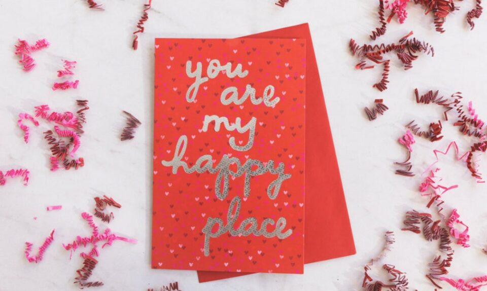

This article has been written and researched by our expert Loveable through a precise methodology. [Learn more about our methodology](https://avada.io/loveable/our-methodological.html)

[Loveable](https://avada.io/loveable/) > [Blog](https://avada.io/loveable/blog/) > [Holiday](https://avada.io/loveable/holiday/)

# 60 Best Valentine’s Day Captions To Express Your Love

Written by [Blake Simpson](https://avada.io/loveable/author/blake/) Last Updated on August 22, 2023

- [Best romantic Valentine’s Day captions](https://avada.io/loveable/blog/valentines-day-captions/#wp-block-heading-2-3)
- [Single life Valentine’s Day captions](https://avada.io/loveable/blog/valentines-day-captions/#wp-block-heading-2-15)
- [Funny Valentine’s Day captions](https://avada.io/loveable/blog/valentines-day-captions/#wp-block-heading-2-26)
- [Valentine’s Day Quote captions](https://avada.io/loveable/blog/valentines-day-captions/#wp-block-heading-2-38)
- [Pet-inspired Valentine’s Day captions](https://avada.io/loveable/blog/valentines-day-captions/#wp-block-heading-2-49)
- [Food-inspired Valentine’s Day captions](https://avada.io/loveable/blog/valentines-day-captions/#wp-block-heading-2-61)
- [Wrapping up](https://avada.io/loveable/blog/valentines-day-captions/#wp-block-heading-2-74)

Although most people associate Valentine’s Day with a romantic relationship, it is possible to have a wonderful day celebrating all of the people you care about on February 14, even if you don’t have a significant other. Valentine’s Day is the ideal occasion for lavishing more love onto one’s offspring, spouse, [closest friends](https://avada.io/loveable/friendaversary-gifts/), and even oneself. However, regardless of who you choose to celebrate the Hallmark holiday with, it is common knowledge that Valentine’s Day is an excellent time to share pictures on social media of the people you care about the most. The one and only thing that might make this the ideal social post? A lovely text that perfectly complements the cuteness of the picture.

Include some Valentine’s Day jokes in your conversation with anyone who will be spending this Valentine’s Day on their own and encourage them to “Netflix is my one true love.” After all, what could be more enjoyable than staying in for the night, [munching on chocolate](https://avada.io/loveable/valentines-day-chocolate-gifts/), and watching some of your favorite shows? Exactly. In addition to that, anyone who enjoys a good knee-slapper will value the inclusion of some Valentine’s Day jokes in the mix as well. Check out some of these adorable **Valentine’s Day captions** and phrases to add a little spice to your social media posts, and good luck!

## Best romantic Valentine’s Day captions

1. My Valentine today, tomorrow, and every Day for the rest of my life.
2. Cheers to a lifetime of Valentine’s Days with this one.
3. Your sweater must be made out of boyfriend/girlfriend material.
4. Life is better when we’re going through it together.
5. Love, kisses, and Valentine’s wishes.
6. You’ll always be my sweetheart.
7. How do I love thee? Let me count the ways.
8. All you need is love — all I need is yours.
9. Loving you is easy.
10. Love is giving someone the power to destroy you… but trusting them not to.

## Single life Valentine’s Day captions

1. In a relationship with me.
2. Netflix is my one true love.
3. Why fall in love when you can fall asleep?
4. It’s date night. Table for one.
5. I’m going to spend Valentine’s Day with my true love: food.
6. Happy Valentine’s Day to myself. I love you.
7. Roses are red. Violets are blue. Keep the flowers. I’d rather have shoes.
8. Valentine’s Day? More like another day to celebrate being my own best friend.
9. I don’t need a significant other to be significant.
10. My heart is full, even without a Valentine.

## Funny Valentine’s Day captions

1. If you were a steak, you’d be well done.
2. Happy Pal-entine’s Day. Celebrating with my squad.
3. The person in the world who annoys me the least.
4. I love you even when I’m hangry.
5. The world needs more love and fewer emails.
6. Found the person who annoys me the least and called it love.
7. If we were on a sinking ship, I’d share my door with you.
8. So glad that I went from your snack to your meal.
9. I’d press pause on my favorite song for you.
10. So happy we both swiped right.

## Valentine’s Day Quote captions

1. “I fell in love the way you fall asleep: slowly, and then all at once.” — John Green
2. “True love stories never have endings.” — Richard Bach
3. “In all the world, there is no heart for me like yours. In all the world, there is no love for you like mine.” — Maya Angelou
4. “Lucky I’m in love with my best friend. :)” —Jason Mraz and Colbie Caillat
5. “I see it, I like it, I want it, I got it.” —Ariana Grande
6. “I’d love to hold you close, tonight and always.” — Zayn Malik, ‘Pillowtalk’
7. “You are the best thing, that’s ever been mine.”— Taylor Swift, ‘Mine’
8. “Every time I see you baby I get lost. If I’m dreaming, baby, please don’t wake me up.”— Shawn Mendes, ‘Fallin in You’
9. “It’s not always easy, and sometimes life can be deceiving. I’ll tell you one thing, it’s always better when we’re together.” — Jack Johnson, “Better Together”
10. “Honey, I’d walk through fire for you; Just let me adore you.” — Harry Styles, “Adore You”

## Pet-inspired Valentine’s Day captions

1. I’ll always woof you!
2. Together Furever.
3. A cuddle a day keeps the vet away.
4. I like you bear-y much!
5. Owls always love you.
6. Don’t go bacon my heart!
7. “Slugs and kisses.”
8. “You’re such a tweet-heart.”
9. “You make my heart dinosaur.”
10. “Honey, you’re un-bee-lievable.”

## Food-inspired Valentine’s Day captions

1. “You’re the loaf of my life.”
2. “Orange you glad I’m yours?”
3. “You are tea-rrific.”
4. “I’ll never dessert you.”
5. Every pizza me loves every pizza you.
6. And it all started with [Netflix and chill](https://avada.io/loveable/netflix-gifts/).
7. “All you need is love. But a little chocolate now and then doesn’t hurt.” — Charles M. Schulz
8. Don’t go bacon my heart. I couldn’t if I fried.
9. Accepting any and all chocolate donations, please inquire within.
10. ‘ Bout to have a conversation with THESE hearts.

**_Related_**: [25+ Funny Valentine’s Day Memes That Will Generate The Virtues](https://avada.io/loveable/funny-valentines-day-memes/)

## Wrapping up

The feeling of love is in the air, and Valentine’s Day is just around the corner. Regardless of whether you want to celebrate the event with your significant other, your closest friends, or some much-needed me-time, you can bet that you’ll be snapping a lot of pictures to save as a memento of the big Day. As a result, we have high hopes that one of the many **Valentine’s Day captions** shown above will fulfill your expectations.

When we were kids, celebrating Valentine’s Day meant putting a card and some candy into a cardboard box for each of our classmates. However, in the year 2023, the best way to wish someone a happy Valentine’s Day is probably by posting it on Instagram. It might be a memento of your love for your Valentine, your valentines, or even your love for yourself, in the form of a picture from February 14 this year, depicting how you spent the Day.

- [Best romantic Valentine’s Day captions](https://avada.io/loveable/blog/valentines-day-captions/#wp-block-heading-2-3)
- [Single life Valentine’s Day captions](https://avada.io/loveable/blog/valentines-day-captions/#wp-block-heading-2-15)
- [Funny Valentine’s Day captions](https://avada.io/loveable/blog/valentines-day-captions/#wp-block-heading-2-26)
- [Valentine’s Day Quote captions](https://avada.io/loveable/blog/valentines-day-captions/#wp-block-heading-2-38)
- [Pet-inspired Valentine’s Day captions](https://avada.io/loveable/blog/valentines-day-captions/#wp-block-heading-2-49)
- [Food-inspired Valentine’s Day captions](https://avada.io/loveable/blog/valentines-day-captions/#wp-block-heading-2-61)
- [Wrapping up](https://avada.io/loveable/blog/valentines-day-captions/#wp-block-heading-2-74)

### [Blake Simpson](https://avada.io/loveable/author/blake/)

Hi, I'm Blake from Loveable. I help people find perfect gifts for occasions like anniversaries and weddings. I also write a blog about holidays, sharing insights to make them more meaningful. Let's create unforgettable moments together!

- [Twitter](https://twitter.com/intent/tweet)
- [Facebook](https://www.facebook.com/sharer/sharer.php)
- [instagram](https://avada.io/loveable/blog/valentines-day-captions/)
- [pinterest](https://www.pinterest.com/loveablellc/)

## Related Posts

[### 120+ Christian Birthday Wishes To Spread Your Love](https://avada.io/loveable/blog/christian-birthday-wishes/) 

[

### 35 Best 70th Birthday Ideas To Celebrate The Special Milestone

](https://avada.io/loveable/blog/70th-birthday-ideas/)

[

### 50 Best 30th Birthday Decorations for a Remarkable Birthday Bash

](https://avada.io/loveable/blog/30th-birthday-decorations/)

[

### 40 Delicious Vegan Christmas Desserts to Delight Your Palate

](https://avada.io/loveable/blog/vegan-christmas-desserts/)

[

### 60 Christmas Team Building Activities to Boost Workplace Spirit

](https://avada.io/loveable/blog/christmas-team-building-activities/)
