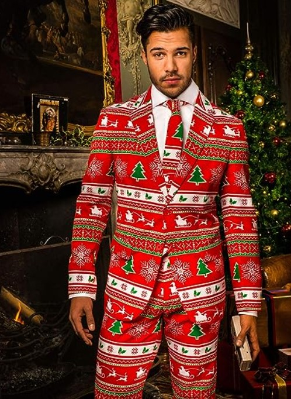
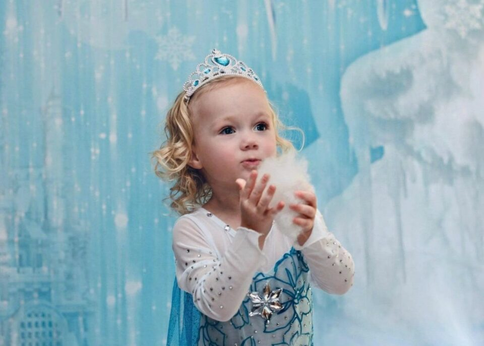

This article has been written and researched by our expert Loveable through a precise methodology. [Learn more about our methodology](https://avada.io/loveable/our-methodological.html)

[Loveable](https://avada.io/loveable/) > [Blog](https://avada.io/loveable/blog/) > [Holiday](https://avada.io/loveable/holiday/)

# 60+ Christmas Photoshoot Outfit Ideas That You Will Love

Written by [Blake Simpson](https://avada.io/loveable/author/blake/) Last Updated on September 07, 2023

- [Christmas Photoshoot Outfit Ideas for Men](https://avada.io/loveable/blog/christmas-photoshoot-outfit-ideas/#wp-block-heading-2-3)
    - [1\. Men’s Navigator Fleece Button Up Shirt](https://avada.io/loveable/blog/christmas-photoshoot-outfit-ideas/#wp-block-heading-3-5)
    - [2\. Christmas Tree & Stars Outfit Slim Fit](https://avada.io/loveable/blog/christmas-photoshoot-outfit-ideas/#wp-block-heading-3-8)
    - [3\. OppoSuits Fun Ugly Christmas Costumes](https://avada.io/loveable/blog/christmas-photoshoot-outfit-ideas/#wp-block-heading-3-11)
    - [4\. Photo-Realistic Ugly Christmas Sweater T-Shirt](https://avada.io/loveable/blog/christmas-photoshoot-outfit-ideas/#wp-block-heading-3-14)
    - [5\. Men’s Cashanova Party Costume Suit](https://avada.io/loveable/blog/christmas-photoshoot-outfit-ideas/#wp-block-heading-3-17)
    - [6\. Disco Glitter Party Blazer for Men](https://avada.io/loveable/blog/christmas-photoshoot-outfit-ideas/#wp-block-heading-3-20)
    - [7\. Men’s Santa vs Shark Ugly Christmas Sweater](https://avada.io/loveable/blog/christmas-photoshoot-outfit-ideas/#wp-block-heading-3-23)
    - [8\. SUITMEISTER Halloween Black Blood](https://avada.io/loveable/blog/christmas-photoshoot-outfit-ideas/#wp-block-heading-3-26)
    - [9\. Santa Claus Cosplay Christmas Suit](https://avada.io/loveable/blog/christmas-photoshoot-outfit-ideas/#wp-block-heading-3-29)
    - [10\. Whitetails Men’s Buck Camp Flannel Plaid Shirt](https://avada.io/loveable/blog/christmas-photoshoot-outfit-ideas/#wp-block-heading-3-33)
    - [11\. Star Wars Men’s Fleece Jogger Sweatpants](https://avada.io/loveable/blog/christmas-photoshoot-outfit-ideas/#wp-block-heading-3-36)
    - [12\. Westerley Zip Up Cardigan Sweater](https://avada.io/loveable/blog/christmas-photoshoot-outfit-ideas/#wp-block-heading-3-39)
    - [13\. Van Heusen Men’s Regular Fit Suit](https://avada.io/loveable/blog/christmas-photoshoot-outfit-ideas/#wp-block-heading-3-42)
    - [14\. Men’s Camp Night Berber Lined Jacket](https://avada.io/loveable/blog/christmas-photoshoot-outfit-ideas/#wp-block-heading-3-45)
    - [15\. Hawaiian Outfits Button Down Shirts And Shorts](https://avada.io/loveable/blog/christmas-photoshoot-outfit-ideas/#wp-block-heading-3-48)
- [Christmas Photoshoot Outfit Ideas for Women](https://avada.io/loveable/blog/christmas-photoshoot-outfit-ideas/#wp-block-heading-2-51)
    - [1\. Winter Feels](https://avada.io/loveable/blog/christmas-photoshoot-outfit-ideas/#wp-block-heading-3-53)
    - [2\. Lady in Green](https://avada.io/loveable/blog/christmas-photoshoot-outfit-ideas/#wp-block-heading-3-56)
    - [3\. Hats Off](https://avada.io/loveable/blog/christmas-photoshoot-outfit-ideas/#wp-block-heading-3-59)
    - [4\. Pretty in Pink](https://avada.io/loveable/blog/christmas-photoshoot-outfit-ideas/#wp-block-heading-3-62)
    - [5\. Queens in White](https://avada.io/loveable/blog/christmas-photoshoot-outfit-ideas/#wp-block-heading-3-65)
    - [6\. Mommy’s Girl](https://avada.io/loveable/blog/christmas-photoshoot-outfit-ideas/#wp-block-heading-3-68)
    - [7\. Christmas Buddies](https://avada.io/loveable/blog/christmas-photoshoot-outfit-ideas/#wp-block-heading-3-71)
    - [8\. Red Season](https://avada.io/loveable/blog/christmas-photoshoot-outfit-ideas/#wp-block-heading-3-74)
    - [9\. Mother’s Boy](https://avada.io/loveable/blog/christmas-photoshoot-outfit-ideas/#wp-block-heading-3-77)
    - [10\. Hot Cocoa Season](https://avada.io/loveable/blog/christmas-photoshoot-outfit-ideas/#wp-block-heading-3-80)
    - [11\. Picnic Vibe](https://avada.io/loveable/blog/christmas-photoshoot-outfit-ideas/#wp-block-heading-3-83)
    - [12\. Chef’s Special](https://avada.io/loveable/blog/christmas-photoshoot-outfit-ideas/#wp-block-heading-3-86)
    - [13\. Santa’s Mail](https://avada.io/loveable/blog/christmas-photoshoot-outfit-ideas/#wp-block-heading-3-89)
- [Christmas Photoshoot Outfit Ideas for Kids](https://avada.io/loveable/blog/christmas-photoshoot-outfit-ideas/#wp-block-heading-2-92)
    - [1\. Put on Santa Suits and Hats](https://avada.io/loveable/blog/christmas-photoshoot-outfit-ideas/#wp-block-heading-3-94)
    - [2\. Christmas Sweater](https://avada.io/loveable/blog/christmas-photoshoot-outfit-ideas/#wp-block-heading-3-97)
    - [3\. Get Comfortable with a Pajama Outfit](https://avada.io/loveable/blog/christmas-photoshoot-outfit-ideas/#wp-block-heading-3-100)
    - [4\. Opt for a Chic Winter Look](https://avada.io/loveable/blog/christmas-photoshoot-outfit-ideas/#wp-block-heading-3-103)
    - [5\. Dress Up as Your Favorite Movie Characters](https://avada.io/loveable/blog/christmas-photoshoot-outfit-ideas/#wp-block-heading-3-106)
    - [6\. Be Silly with “Elf on the Shelf” Onesies](https://avada.io/loveable/blog/christmas-photoshoot-outfit-ideas/#wp-block-heading-3-109)
    - [7\. Wear Festive Floral Prints](https://avada.io/loveable/blog/christmas-photoshoot-outfit-ideas/#wp-block-heading-3-112)
    - [8\. Choose a Classic Black and White Ensemble](https://avada.io/loveable/blog/christmas-photoshoot-outfit-ideas/#wp-block-heading-3-115)
    - [9\. Go with a Traditional Red and Green Outfit](https://avada.io/loveable/blog/christmas-photoshoot-outfit-ideas/#wp-block-heading-3-118)
    - [10\. Choose a Solid Color](https://avada.io/loveable/blog/christmas-photoshoot-outfit-ideas/#wp-block-heading-3-121)
    - [11\. Be Simple with a Neutral Color Scheme](https://avada.io/loveable/blog/christmas-photoshoot-outfit-ideas/#wp-block-heading-3-124)
    - [12\. Experiment with Silhouette Cuts and Shapes](https://avada.io/loveable/blog/christmas-photoshoot-outfit-ideas/#wp-block-heading-3-127)
    - [13\. Santa Hats and Elf Hats Are Always a Safe Choice](https://avada.io/loveable/blog/christmas-photoshoot-outfit-ideas/#wp-block-heading-3-130)
    - [14\. Get Crafty and DIY Rudolph Costumes](https://avada.io/loveable/blog/christmas-photoshoot-outfit-ideas/#wp-block-heading-3-133)
    - [15\. Think Outside of Red and Green](https://avada.io/loveable/blog/christmas-photoshoot-outfit-ideas/#wp-block-heading-3-136)
    - [16\. Accessorize Wisely](https://avada.io/loveable/blog/christmas-photoshoot-outfit-ideas/#wp-block-heading-3-139)
    - [17\. Try Out Vintage Christmas Outfits](https://avada.io/loveable/blog/christmas-photoshoot-outfit-ideas/#wp-block-heading-3-142)
    - [18\. Explore Textures](https://avada.io/loveable/blog/christmas-photoshoot-outfit-ideas/#wp-block-heading-3-145)
    - [19\. Have Fun with Classic Holiday Themes](https://avada.io/loveable/blog/christmas-photoshoot-outfit-ideas/#wp-block-heading-3-148)
    - [20\. Use Pieces with Symbolic Meaning](https://avada.io/loveable/blog/christmas-photoshoot-outfit-ideas/#wp-block-heading-3-151)
- [Christmas Photoshoot Outfit Ideas for Couples](https://avada.io/loveable/blog/christmas-photoshoot-outfit-ideas/#wp-block-heading-2-154)
    - [1\. Decorate The House](https://avada.io/loveable/blog/christmas-photoshoot-outfit-ideas/#wp-block-heading-3-156)
    - [2\. Add the Final Decorations to The Christmas Tree](https://avada.io/loveable/blog/christmas-photoshoot-outfit-ideas/#wp-block-heading-3-159)
    - [3\. Decorate Your Heads With Your Christmas Hats](https://avada.io/loveable/blog/christmas-photoshoot-outfit-ideas/#wp-block-heading-3-162)
    - [4\. Show Off Your Decorations](https://avada.io/loveable/blog/christmas-photoshoot-outfit-ideas/#wp-block-heading-3-165)
    - [5\. Pose With Your Child](https://avada.io/loveable/blog/christmas-photoshoot-outfit-ideas/#wp-block-heading-3-168)
    - [6\. Don’t Forget the Dog](https://avada.io/loveable/blog/christmas-photoshoot-outfit-ideas/#wp-block-heading-3-171)
    - [7\. Incorporate the Cat](https://avada.io/loveable/blog/christmas-photoshoot-outfit-ideas/#wp-block-heading-3-174)
    - [8\. Group Photo in the Grotto](https://avada.io/loveable/blog/christmas-photoshoot-outfit-ideas/#wp-block-heading-3-177)
    - [9\. Mischief Under The Mistletoe](https://avada.io/loveable/blog/christmas-photoshoot-outfit-ideas/#wp-block-heading-3-180)
    - [10\. The Heels-Up Kiss](https://avada.io/loveable/blog/christmas-photoshoot-outfit-ideas/#wp-block-heading-3-183)
    - [11\. Put Your Feet Up](https://avada.io/loveable/blog/christmas-photoshoot-outfit-ideas/#wp-block-heading-3-186)
    - [12\. Get Cosy By The Tree](https://avada.io/loveable/blog/christmas-photoshoot-outfit-ideas/#wp-block-heading-3-189)
    - [13\. Curl Up With Cocoa](https://avada.io/loveable/blog/christmas-photoshoot-outfit-ideas/#wp-block-heading-3-192)
    - [14\. See The Christmas Sights](https://avada.io/loveable/blog/christmas-photoshoot-outfit-ideas/#wp-block-heading-3-195)
- [Christmas Photoshoot Outfit Ideas for Family](https://avada.io/loveable/blog/christmas-photoshoot-outfit-ideas/#wp-block-heading-2-198)
    - [1\. Commence with Mom’s Ensemble](https://avada.io/loveable/blog/christmas-photoshoot-outfit-ideas/#wp-block-heading-3-199)
    - [2\. Harmonious Color Palette Selection](https://avada.io/loveable/blog/christmas-photoshoot-outfit-ideas/#wp-block-heading-3-202)
    - [3\. Versatility of White](https://avada.io/loveable/blog/christmas-photoshoot-outfit-ideas/#wp-block-heading-3-205)
    - [4\. Visualize with Canva](https://avada.io/loveable/blog/christmas-photoshoot-outfit-ideas/#wp-block-heading-3-208)
    - [5\. Mix Solids and Prints](https://avada.io/loveable/blog/christmas-photoshoot-outfit-ideas/#wp-block-heading-3-211)
- [Bottom Line](https://avada.io/loveable/blog/christmas-photoshoot-outfit-ideas/#wp-block-heading-2-217)

The holiday season is upon us, and what better way to capture the warmth, joy, and togetherness of Christmas than with a festive family photoshoot? Choosing the perfect outfits for your Christmas photos can be a delightful endeavor, as it allows you to express your family’s unique style while creating cherished memories.

Whether you’re planning a cozy gathering by the fireplace or an outdoor winter wonderland adventure, your outfit choices play a pivotal role in bringing your family’s holiday spirit to life. In this guide, we will explore some creative Christmas photoshoot outfit ideas that are sure to make your family portraits truly special, reflecting the magic of the season and your family’s distinct personality.

## **Christmas Photoshoot Outfit Ideas for Men**

Capture the magic of the holiday season with our curated list of Christmas photoshoot outfit ideas for men. Whether you’re aiming for a traditional, whimsical, or even offbeat look, we’ve gathered a diverse selection of outfits that will help you stand out in your holiday photos. From festive sweaters to playful costumes, these outfits are perfect for adding a touch of style and charm to your Christmas memories. Explore the options and find the perfect ensemble to make your holiday photoshoot merry and memorable.

### **1\. [Men’s Navigator Fleece Button Up Shirt](https://www.amazon.com/Legendary-Whitetails-Navigator-Fleece-X-Large/dp/B07XH4SB1K/ref=sr_1_1_sspa?keywords=mens%2Bchristmas%2Boutfits&qid=1693715498&sr=8-1-spons&sp_csd=d2lkZ2V0TmFtZT1zcF9hdGY&th=1&psc=1)**

This is perfect for capturing the essence of a cozy, woodsy Christmas. Crafted from durable twill fabric, it offers both comfort and style. With its earthy tones and robust feel, it brings to mind the image of a rugged lumberjack out in the wilderness, making it an ideal choice for an outdoorsy holiday photoshoot.

### **2\. [Christmas Tree & Stars Outfit Slim Fit](https://www.amazon.com/Suitmeister-Christmas-Suits-Men-Costumes/dp/B08KTJQPXF/ref=sr_1_4?keywords=mens+christmas+outfits&qid=1693715498&sr=8-4)**

Make your holiday photoshoot shine with the Christmas Tree & Stars Outfit in a slim fit. The design features cheerful Christmas trees and stars, instantly evoking the festive spirit. The slim fit adds a modern touch, making it perfect for a lively and spirited photoshoot.

### **3\. [OppoSuits Fun Ugly Christmas Costumes](https://www.amazon.com/OppoSuits-Christmas-Suits-Different-Prints/dp/B01HE01QQ0/ref=sr_1_3?keywords=mens+christmas+outfits&qid=1693715498&sr=8-3)**

Embrace the whimsy and playfulness of the season with OppoSuits Fun Ugly Christmas Costumes. These outfits are designed to make a statement, perfect for adding a touch of humor to your holiday photos. From bold patterns to vibrant colors, these costumes capture the spirit of Christmas in a fun and quirky way.

### **4\. [Photo-Realistic Ugly Christmas Sweater T-Shirt](https://www.amazon.com/Faux-Real-Santa-Tattoos-Sleeves/dp/B010HSDU4M/ref=sr_1_2?keywords=mens+christmas+outfits&qid=1693715498&sr=8-2)**

Get all the charm of the classic ugly Christmas sweater without the bulk in this Photo-Realistic Ugly Christmas Sweater T-Shirt. The photo-realistic print mimics the look of a traditional ugly sweater but in a lightweight and easy-to-wear t-shirt form. It’s perfect for capturing the fun and lightheartedness of the season in a relaxed and comfortable way.

### **5\. [Men’s Cashanova Party Costume Suit](https://www.amazon.com/OppoSuits-Mens-Cashanova-Party-Costume/dp/B013E989SI)**

Elevate your holiday photoshoot with the Men’s Cashanova Party Costume Suit. This dapper and whimsical suit is an excellent choice for a sophisticated Christmas photoshoot. Its design features a playful money pattern, making it a unique and memorable outfit.

### **6\. [Disco Glitter Party Blazer for Men](https://www.amazon.com/SUITMEISTER-Gold-Sequin-Jacket-Christmas/dp/B0851LFLW8/ref=sr_1_6?keywords=mens+christmas+outfits&qid=1693655901&sr=8-6)**

If you’re looking to add a touch of glamour and excitement to your Christmas photoshoot, the Disco Glitter Party Blazer for Men is the perfect choice. This blazer is designed to make you stand out and shine during the holiday season. The glittering fabric catches the light, creating a dazzling effect that’s ideal for capturing the festive atmosphere.

### **7\. [Men’s Santa vs Shark Ugly Christmas Sweater](https://www.amazon.com/Santa-Shark-Christmas-Costume-Sweater/dp/B01CKFGSFI/ref=sr_1_7?keywords=mens+christmas+outfits&qid=1693655901&sr=8-7)**

Bring a touch of humor and whimsy to your holiday photoshoot with the Men’s Santa vs Shark Ugly Christmas Sweater. This unique and entertaining sweater features a playful Santa vs. Shark design, adding a delightful twist to the traditional holiday theme. It’s a conversation starter that’s sure to make your photoshoot memorable and fun.

### **8\. [SUITMEISTER Halloween Black Blood](https://www.amazon.com/Suitmeister-Christmas-Suits-Men-Costumes/dp/B07QX8F696/ref=sr_1_8?keywords=mens+christmas+outfits&qid=1693655901&sr=8-8)**

While originally designed for Halloween, the SUITMEISTER Halloween Black Blood suit can also add a touch of edgy style to your Christmas photoshoot. The sleek black design with blood splatters creates a mysterious and unconventional look that’s perfect for those who want to embrace a darker side of the holiday season.

### **9\. [Santa Claus Cosplay Christmas Suit](https://www.amazon.com/iiniim-Men%C3%A2%E2%82%ACs-Cosplay-Costume-Christmas/dp/B08JPCWVVD/ref=sr_1_10?keywords=mens+christmas+outfits&qid=1693655901&sr=8-10)**

Transform into the jolly old Saint Nick himself with the Santa Claus Cosplay Christmas Suit. This suit captures the magic and warmth of Christmas, making it a classic choice for spreading holiday cheer. Whether you’re posing with children, playing Santa at a holiday event, or simply want to embody the spirit of giving, this cosplay suit will help you create heartwarming and memorable holiday photos.

### **10\. [Whitetails Men’s Buck Camp Flannel Plaid Shirt](https://www.amazon.com/Legendary-Whitetails-Flannels-Cedarwood-Plaid/dp/B01K0ETB6E/ref=sr_1_13?keywords=mens+christmas+outfits&qid=1693655901&sr=8-13)**

For a cozy and rustic Christmas photoshoot set amidst the great outdoors, the Whitetails Men’s Buck Camp Flannel Plaid Shirt is the perfect choice. Crafted from warm and comfortable flannel fabric, it offers both style and functionality. The classic plaid pattern exudes timeless charm, making it ideal for capturing the warmth and coziness of the holiday season.

### **11\. [Star Wars Men’s Fleece Jogger Sweatpants](https://www.amazon.com/Amazon-Essentials-Disney-Sweatpants-Heather/dp/B09G3BWT62/ref=sr_1_18?keywords=mens%2Bchristmas%2Boutfits&qid=1693655901&sr=8-18&th=1)**

Combine your love for the Star Wars universe with the holiday season by wearing these comfortable and themed fleece jogger sweatpants for your photoshoot. Featuring iconic Star Wars graphics, they’re perfect for adding a touch of galactic fun to your holiday photos.

### **12\. [Westerley Zip Up Cardigan Sweater](https://www.amazon.com/Pendleton-Short-Sleeve-Frontier-Turquoise-X-Large/dp/B004L63RAE/ref=sr_1_20?keywords=mens+christmas+outfits&qid=1693655901&sr=8-20)**

Channel the iconic “The Dude” style from The Big Lebowski with this Westerley Zip Up Cardigan Sweater. It’s a laid-back and comfortable choice for a relaxed and unconventional Christmas photoshoot. The sweater’s distinctive design pays homage to a cult classic character, making it a conversation piece that adds a touch of humor and nostalgia to your holiday photos.

### **13\. [Van Heusen Men’s Regular Fit Suit](https://www.amazon.com/Van-Heusen-Regular-Separate-Medium/dp/B0B2ZPYPFW/ref=sr_1_28_sspa?keywords=mens+christmas+outfits&qid=1693655901&sr=8-28-spons&sp_csd=d2lkZ2V0TmFtZT1zcF9tdGY&psc=1)**

Opt for a classic and polished look with the Van Heusen Men’s Regular Fit Suit. This suit exudes elegance and sophistication, making it an excellent choice for a timeless and refined Christmas photoshoot.

### **14\. [Men’s Camp Night Berber Lined Jacket](https://www.amazon.com/Legendary-Whitetails-Hooded-Flannel-Cardinal/dp/B07GT8698K/ref=sr_1_44?keywords=mens+christmas+outfits&qid=1693655901&sr=8-44)**

Stay warm and stylish during your Christmas photoshoot with the Men’s Camp Night Berber Lined Jacket. Crafted for comfort and coziness, it’s perfect for a photoshoot set in the great outdoors. The Berber-lined interior provides warmth, while the rugged design adds a touch of rustic charm.

### **15\. [Hawaiian Outfits Button Down Shirts And Shorts](https://www.amazon.com/Watercolor-Christmas-2-Piece-Hawaiian-Outfits/dp/B0CGVC1CSZ/ref=sr_1_50?keywords=mens+christmas+outfits&qid=1693655901&sr=8-50)**

Bring a touch of the tropics to your holiday photoshoot with these Hawaiian button-down shirts and shorts. Ideal for creating a unique and beachy Christmas theme, they offer a relaxed and laid-back style.

## **Christmas Photoshoot Outfit Ideas for Women**

From classic and elegant to playful and heartwarming, our list offers a delightful array of concepts to help you capture the spirit of the season. Whether you’re aiming for a traditional family portrait, a cozy winter scene, or a whimsical holiday theme, these outfit ideas provide inspiration for creating cherished memories that will last a lifetime. Explore our list and discover the perfect look to make your Christmas photoshoot truly magical!

### **1\. Winter Feels**

This is all about capturing the essence of the cozy winter season in your Christmas photoshoot. This outfit idea combines layers of warmth and style to ensure you’re both snug and fashionable. Imagine donning a stylish coat, a chic scarf, and a cute beanie, all in wintry hues.

### **2\. Lady in Green**

This idea is a timeless choice for a Christmas photoshoot. This elegant ensemble celebrates the classic beauty of the holiday season. Picture yourself in a stunning green dress or a stylish outfit with festive touches. The rich green color exudes the warmth and charm of Christmas, making it ideal for capturing your holiday spirit.

### **3\. Hats Off**

Add a dash of whimsy and fun to your Christmas photoshoot with this photoshoot idea. This playful outfit idea focuses on showcasing a variety of festive headwear, from Santa hats to reindeer antlers and everything in between. Imagine a joyful and carefree photoshoot where you and your loved ones don these delightful hats, spreading cheer and laughter throughout your pictures. It’s all about celebrating the spirit of Christmas with a touch of style and humor.

### **4\. Pretty in Pink**

Pretty in Pink brings a sweet and feminine touch to your Christmas photos. This outfit idea revolves around various shades of pink, creating a soft and charming look that’s perfect for capturing the gentler side of the holiday season. Picture yourself in a blush-toned dress or cozy pink sweater, surrounded by soft holiday decor.

### **5\. Queens in White**

This perfect idea offers an elegant and timeless choice for a Christmas photoshoot. This outfit idea revolves around classic white attire, creating a pure and angelic appearance that’s ideal for spreading holiday cheer. Imagine wearing a beautiful white gown or a stylish white ensemble, surrounded by the soft glow of holiday lights.

### **6\. Mommy’s Girl**

Celebrate the special bond between mothers and daughters with adoring ideas. This outfit encourages matching or coordinated outfits, perfect for creating heartwarming and memorable family photos. Picture yourselves in charming mother-daughter outfits that reflect the joy and love of the holiday season.

### **7\. Christmas Buddies**

Share the joy of Christmas with your furry friends in “Christmas Buddies.” This outfit idea focuses on capturing the playful and heartwarming moments between you and your pets during the holiday season. Imagine you and your beloved pets wearing adorable matching outfits or festive accessories, posing in a winter wonderland.

### **8\. Red Season**

“Red Season” is all about embracing the festive spirit with bold and vibrant red outfits. Whether you choose a dazzling red dress or stylish red separates, this outfit idea ensures you’re dressed to impress during the holiday season. Picture yourself amidst cheerful holiday decorations, spreading warmth and joy in every photo.

### **9\. Mother’s Boy**

Check out this idea which is a charming outfit idea that celebrates the bond between mothers and sons. This concept allows you to capture precious moments between mom and her little one. Picture the love and laughter shared between a mother and her son, dressed in charming holiday-themed outfits.

### **10\. Hot Cocoa Season**

Cozy up to the warmth and comfort of Hot Cocoa Season in this outfit idea. It revolves around soft and comfortable loungewear, perfect for capturing the relaxed and delightful moments of the holiday season. Imagine yourself wrapped in a cozy blanket, sipping hot cocoa by the fireplace, and enjoying the simple pleasures of the holidays.

### **11\. Picnic Vibe**

Bring a touch of outdoor magic to your Christmas photoshoot with Picnic Vibe. This outfit idea combines casual yet stylish attire with a picnic-themed setting, creating a unique and playful holiday backdrop. Picture yourself in fashionable yet comfortable clothing, surrounded by holiday snacks and decor in a charming outdoor setting.

### **12\. Chef’s Special**

Get creative in the kitchen with Chef’s Special. This outfit idea is perfect for capturing the joy of holiday baking and cooking. Don your favorite apron, chef’s hat, and festive kitchen attire, and let the culinary festivities begin. Picture yourself whipping up delicious holiday treats and sharing the warmth of the kitchen with loved ones.

### **13\. Santa’s Mail**

Santa’s Mail is a fun and imaginative outfit idea that involves posing with letters to Santa Claus. Whether you’re writing heartfelt wishes, playful requests, or sharing your Christmas list, this concept adds a touch of nostalgia to your Christmas photos. Picture yourself surrounded by holiday letters, envelopes, and all things Santa-related, creating a whimsical and heartwarming atmosphere.

## **Christmas Photoshoot Outfit Ideas for Kids**

These creative Christmas photoshoot outfit ideas for kids will help you capture the magic and joy of the holiday season in your family portraits

### **1\. Put on Santa Suits and Hats**

Let your little ones step into the role of Santa’s merry helpers by donning adorable Santa suits and matching hats. These festive ensembles instantly transform your kids into Santa’s little elves, ready to spread holiday cheer with every smile and laugh. Picture the sheer excitement in their eyes as they embrace the magic of Christmas, making your photoshoot a heartwarming and unforgettable experience.

### **2\. Christmas Sweater**

Embrace the timeless charm of Christmas with cozy and delightful Christmas sweaters for your kids. These warm and festive knits not only keep them snug but also infuse your photos with the spirit of the season. Imagine your little ones wrapped in the softness of holiday-themed sweaters, radiating joy and warmth.

### **3\. Get Comfortable with a Pajama Outfit**

Create a scene of pure holiday comfort and togetherness by dressing your kids in matching Christmas pajamas. These comfortable and adorable outfits set the stage for capturing candid moments of laughter, snuggles, and shared stories. Picture your little ones in their coziest attire, sipping cocoa by the fire or reading their favorite holiday tales.

### **4\. Opt for a Chic Winter Look**

Elevate your kids’ holiday style with chic winter outfits that combine warmth and fashion. Think stylish coats, scarves, and mittens that not only keep them cozy but also make them look like little fashionistas ready for a winter adventure. Envision your kids strolling through a snow-covered park, their chic winter ensembles enhancing the beauty of the season.

### **5\. Dress Up as Your Favorite Movie Characters**

Transport your kids into the enchanting world of their beloved holiday movies by letting them dress up as iconic characters like Buddy the Elf, Frosty the Snowman, or characters from “The Polar Express.” This creative idea adds an extra layer of whimsy and storytelling to your Christmas photoshoot. Imagine your little ones stepping into character, reenacting their favorite scenes, and capturing the wonder of the holiday season through their imaginative play.

### **6\. Be Silly with “Elf on the Shelf” Onesies**

Embrace Christmas’s playful and mischievous spirit with “Elf on the Shelf” onesies for your kids. These delightful outfits capture the whimsy and fun of this beloved holiday tradition. Imagine your little ones dressed as mischievous elves, hiding in unexpected places, and bringing laughter and surprises to your photoshoot.

### **7\. Wear Festive Floral Prints**

Infuse your kids’ holiday attire with a burst of color and charm by choosing outfits featuring festive floral prints. These vibrant and joyful prints create a lively and picturesque atmosphere in your photos. Envision your little ones adorned in outfits adorned with cheerful blooms and patterns, surrounded by holiday decorations.

### **8\. Choose a Classic Black and White Ensemble**

For a timeless and sophisticated look, opt for classic black and white ensembles for your kids. These elegant and contrasting outfits create a refined backdrop for your holiday photos. Picture your little ones in sleek black and white attire, against a backdrop of twinkling lights and festive decor.

### **9\. Go with a Traditional Red and Green Outfit**

Embrace the quintessential colors of Christmas by dressing your kids in traditional red and green outfits. These classic hues instantly evoke the holiday spirit, making your photos feel warm and festive.

### **10\. Choose a Solid Color**

Keep it simple yet striking by selecting solid-colored outfits for your kids. Whether it’s a vibrant red, a deep green, or a regal blue, solid colors create a bold and memorable look in your Christmas photos. Picture your children standing out against a backdrop of white snow or rustic holiday decor, their solid-colored ensembles making a striking statement.

### **11\. Be Simple with a Neutral Color Scheme**

Achieve a serene and minimalist aesthetic by dressing your kids in a neutral color scheme. Creams, grays, and soft pastels create a calm and sophisticated backdrop for your holiday photos. Imagine your little ones in understated yet stylish attire, surrounded by the gentle glow of candlelight or the softness of winter landscapes.

### **12\. Experiment with Silhouette Cuts and Shapes**

Add an artistic touch to your kids’ outfits by experimenting with unique silhouette cuts and shapes. Whether it’s A-line dresses, tailored blazers, or flared pants, these distinctive silhouettes can infuse your photos with a sense of creativity and flair. Picture your little ones striking poses in outfits that emphasize their individuality and style, turning your photos into a captivating display of fashion and personality.

### **13\. Santa Hats and Elf Hats Are Always a Safe Choice**

When in doubt, you can never go wrong with the timeless charm of Santa hats and elf hats for your kids. These classic holiday accessories instantly make your children look like Santa’s little helpers, adding charm and whimsy to your photos.

### **14\. Get Crafty and DIY Rudolph Costumes**

Embark on a creative adventure by crafting DIY Rudolph costumes for your kids. With some antlers, a red nose, and a little imagination, your children can become the stars of their very own Christmas tale. Imagine your little ones embodying the spirit of Rudolph the Red-Nosed Reindeer, prancing and playing in a winter wonderland.

### **15\. Think Outside of Red and Green**

Break away from tradition by exploring a palette of colors beyond the classic red and green. Consider blues, purples, or even pastels to create a unique and eye-catching holiday look for your kids. Envision your children dressed in unexpected yet captivating colors, their outfits adding a sense of novelty and creativity to your Christmas photos.

### **16\. Accessorize Wisely**

Pay attention to the finer details by carefully selecting accessories for your kids’ holiday outfits. Scarves, mittens, and holiday-themed headbands can add charm and personality to their attire, enhancing the overall festive vibe of your photos.

### **17\. Try Out Vintage Christmas Outfits**

Transport your family back in time by dressing your kids in vintage-inspired Christmas outfits. Think classic knits, suspenders, and bonnets that harken back to the charm of yesteryears. Envision your little ones in timeless attire, evoking the nostalgia of bygone eras, while surrounded by vintage holiday decor.

### **18\. Explore Textures**

Add depth and visual interest to your kids’ outfits by exploring different textures. Velvet, faux fur, and cable knits can create a tactile and inviting look in your Christmas photos. Imagine your little ones in outfits that invite touch and sensory exploration, their soft and textured attire creating a warm and inviting atmosphere.

### **19\. Have Fun with Classic Holiday Themes**

Infuse your photoshoot with the joy of classic holiday themes by dressing your kids in outfits adorned with symbols like nutcrackers, gingerbread, or snowflakes. These thematic elements turn your photos into a whimsical holiday story, capturing the playful and magical spirit of Christmas.

### **20\. Use Pieces with Symbolic Meaning**

Infuse your Christmas photos with layers of meaning by incorporating outfits or accessories that hold sentimental value. Whether it’s a cherished heirloom, a piece that symbolizes togetherness, or an accessory that represents a special memory, these items can add a touching and meaningful dimension to your holiday photos.

## **Christmas Photoshoot Outfit Ideas for Couples**

These Christmas photoshoot outfit ideas for couples offer diverse options to celebrate your love and the magic of the holiday season. Whether you prefer cozy and intimate scenes or playful and glamorous moments, these ideas provide the perfect backdrop for creating cherished memories together.

### **1\. Decorate The House**

Transform your home into a holiday wonderland and capture the enchantment of decorating together. Cozy up in your favorite festive sweaters or matching PJs as you adorn your living space with lights, garlands, and ornaments. This idea allows you to document the joy of preparing your home for the holiday season, creating heartwarming memories that celebrate your love and the spirit of Christmas.

### **2\. Add the Final Decorations to The Christmas Tree**

The tree is the heart of your holiday decor, and adding the final touches together is a cherished moment. Dress in elegant attire, perhaps a classic red dress for her and a dapper suit for him, as you place ornaments and tinsel on your Christmas tree. This idea captures the magic of the season and your partnership in creating a festive ambiance.

### **3\. Decorate Your Heads With Your Christmas Hats**

Embrace the whimsy of the season by adorning your heads with matching Christmas hats. Whether it’s Santa hats, reindeer antlers, or elf hats, these accessories add a touch of playful festivity to your photos. Picture yourselves laughing and sharing sweet moments while wearing these fun headpieces, creating a lighthearted and spirited atmosphere.

### **4\. Show Off Your Decorations**

Display your love for holiday decorating by posing proudly with your beautifully adorned Christmas tree or mantle. Dress in sophisticated and festive outfits that complement your decor, and let your love for the season shine through in your photos. This idea celebrates your shared passion for creating a festive and inviting home.

### **5\. Pose With Your Child**

If you have a child, involve them in your photoshoot to capture the magic of family during the holidays. Dress in coordinating outfits and gather around the tree or a festive backdrop. This idea highlights the love and unity of your family, creating heartwarming memories to cherish.

### **6\. Don’t Forget the Dog**

If your furry friend is an important part of your family, include them in your Christmas photoshoot. Dress in coordinating outfits and cuddle up with your dog amidst holiday decor. This idea celebrates the love and companionship that your pet brings to your relationship, adding an extra layer of warmth to your photos.

### **7\. Incorporate the Cat**

Extend your holiday photoshoot to include your feline companion. Dress in outfits that harmonize with your cat’s presence, and capture intimate moments of togetherness. This idea showcases the coziness and affection that your cat adds to your relationship, creating heartwarming memories.

### **8\. Group Photo in the Grotto**

Gather your family, pets included, in your holiday grotto for a group photo that encapsulates the essence of the season. Coordinate your outfits and bask in the warmth of your home’s festive ambiance. This idea emphasizes your family’s unity and love, making it a treasured keepsake.

### **9\. Mischief Under The Mistletoe**

Share a mischievous moment under the mistletoe as you steal a kiss from each other. Dress in elegant and romantic attire, and let your love shine in this tender and playful photo. This idea captures the romance and affection that the holiday season inspires.

### **10\. The Heels-Up Kiss**

Elevate the romance by sharing a passionate kiss while striking a pose with your legs in the air. Dress in sophisticated and glamorous attire, and let your love take center stage. This idea adds a touch of sensuality to your Christmas photos, celebrating the fiery connection between you.

### **11\. Put Your Feet Up**

Embrace the cozy charm of the holidays by putting your feet up and enjoying a moment of relaxation together. Dress in comfortable yet stylish loungewear, and capture the bliss of being wrapped in each other’s arms. This idea highlights the comfort and contentment that your love brings, making it a heartwarming scene.

### **12\. Get Cosy By The Tree**

Create an intimate and cozy scene by snuggling up together by the Christmas tree. Dress in warm and inviting attire, like chunky sweaters and plaid scarves, and capture the tenderness of your embrace. This idea emphasizes the comfort and love that the holiday season represents.

### **13\. Curl Up With Cocoa**

Share a sweet moment by sipping cocoa together in front of the fireplace or Christmas tree. Dress in comfy and casual attire, like matching pajamas, and let the warmth of the cocoa and your love fill the frame. This idea celebrates the simple pleasures and closeness that the holidays bring.

### **14\. See The Christmas Sights**

Venture outdoors to explore the beauty of the holiday season together. Dress in stylish and weather-appropriate outfits, and embark on a holiday adventure. Whether it’s strolling through a winter wonderland, visiting a holiday market, or admiring festive lights, this idea captures the excitement and wonder of the season as you explore together.

## **Christmas Photoshoot Outfit Ideas for Family**

### **1\. Commence with Mom’s Ensemble**

Begin your family Christmas photoshoot by curating the perfect outfit for Mom. She can set the tone for the entire family’s style, making her the centerpiece of the festive portrait. Whether she opts for a classic red dress, a cozy winter sweater, or a chic plaid skirt, Mom’s outfit will serve as the starting point for coordinating the rest of the family’s ensembles.

### **2\. Harmonious Color Palette Selection**

Creating a visually cohesive family look is as simple as selecting colors from the same harmonious palette. This Christmas, choose a color scheme that complements one another. Whether it’s deep burgundy and forest green, elegant silver and gold, or soft pastels, coordinating colors will make your family photos radiate warmth and togetherness.

### **3\. Versatility of White**

Embrace the versatility of white for your family Christmas photoshoot outfits. Crisp and clean, white pairs effortlessly with any color or pattern. Whether it’s a white sweater, blouse, or pants, incorporating white pieces into your family’s attire ensures a timeless and elegant appearance that signifies the purity of the holiday season.

### **4\. Visualize with Canva**

To streamline your family’s Christmas outfit coordination, harness the power of Canva. This user-friendly design tool allows you to create a visual representation of all the outfits together. Simply upload photos of each family member in their chosen attire, and Canva will help you arrange and adjust the elements, making it easier to visualize how the entire family will look as a unit.

### **5\. Mix Solids and Prints**

Inject some playful variety into your family Christmas photos by incorporating a mix of solids and prints. While some family members sport solid-colored garments, others can showcase festive patterns like plaid, stripes, or chevron. This juxtaposition of textures and designs will add depth and character to your holiday portraits, capturing the essence of your unique family style.

**_See More:_**

- Best [Christmas Knock Knock Jokes](https://avada.io/loveable/blog/christmas-knock-knock-jokes/)

- Heartwarming [Christmas Friendship Quotes](https://avada.io/loveable/blog/christmas-friendship-quotes/)

## **Bottom Line**

As you embark on your Christmas photoshoot journey, remember that the outfits you select for your family are not just clothes; they are a canvas for your family’s love and joy. From coordinating color palettes to mixing solids and prints, and even starting with mom’s outfit as the centerpiece, there are countless ways to create stunning and memorable holiday portraits. These outfit ideas are not only about looking good but also about feeling the warmth and togetherness that define the spirit of Christmas.

- [Christmas Photoshoot Outfit Ideas for Men](https://avada.io/loveable/blog/christmas-photoshoot-outfit-ideas/#wp-block-heading-2-3)
    - [1\. Men’s Navigator Fleece Button Up Shirt](https://avada.io/loveable/blog/christmas-photoshoot-outfit-ideas/#wp-block-heading-3-5)
    - [2\. Christmas Tree & Stars Outfit Slim Fit](https://avada.io/loveable/blog/christmas-photoshoot-outfit-ideas/#wp-block-heading-3-8)
    - [3\. OppoSuits Fun Ugly Christmas Costumes](https://avada.io/loveable/blog/christmas-photoshoot-outfit-ideas/#wp-block-heading-3-11)
    - [4\. Photo-Realistic Ugly Christmas Sweater T-Shirt](https://avada.io/loveable/blog/christmas-photoshoot-outfit-ideas/#wp-block-heading-3-14)
    - [5\. Men’s Cashanova Party Costume Suit](https://avada.io/loveable/blog/christmas-photoshoot-outfit-ideas/#wp-block-heading-3-17)
    - [6\. Disco Glitter Party Blazer for Men](https://avada.io/loveable/blog/christmas-photoshoot-outfit-ideas/#wp-block-heading-3-20)
    - [7\. Men’s Santa vs Shark Ugly Christmas Sweater](https://avada.io/loveable/blog/christmas-photoshoot-outfit-ideas/#wp-block-heading-3-23)
    - [8\. SUITMEISTER Halloween Black Blood](https://avada.io/loveable/blog/christmas-photoshoot-outfit-ideas/#wp-block-heading-3-26)
    - [9\. Santa Claus Cosplay Christmas Suit](https://avada.io/loveable/blog/christmas-photoshoot-outfit-ideas/#wp-block-heading-3-29)
    - [10\. Whitetails Men’s Buck Camp Flannel Plaid Shirt](https://avada.io/loveable/blog/christmas-photoshoot-outfit-ideas/#wp-block-heading-3-33)
    - [11\. Star Wars Men’s Fleece Jogger Sweatpants](https://avada.io/loveable/blog/christmas-photoshoot-outfit-ideas/#wp-block-heading-3-36)
    - [12\. Westerley Zip Up Cardigan Sweater](https://avada.io/loveable/blog/christmas-photoshoot-outfit-ideas/#wp-block-heading-3-39)
    - [13\. Van Heusen Men’s Regular Fit Suit](https://avada.io/loveable/blog/christmas-photoshoot-outfit-ideas/#wp-block-heading-3-42)
    - [14\. Men’s Camp Night Berber Lined Jacket](https://avada.io/loveable/blog/christmas-photoshoot-outfit-ideas/#wp-block-heading-3-45)
    - [15\. Hawaiian Outfits Button Down Shirts And Shorts](https://avada.io/loveable/blog/christmas-photoshoot-outfit-ideas/#wp-block-heading-3-48)
- [Christmas Photoshoot Outfit Ideas for Women](https://avada.io/loveable/blog/christmas-photoshoot-outfit-ideas/#wp-block-heading-2-51)
    - [1\. Winter Feels](https://avada.io/loveable/blog/christmas-photoshoot-outfit-ideas/#wp-block-heading-3-53)
    - [2\. Lady in Green](https://avada.io/loveable/blog/christmas-photoshoot-outfit-ideas/#wp-block-heading-3-56)
    - [3\. Hats Off](https://avada.io/loveable/blog/christmas-photoshoot-outfit-ideas/#wp-block-heading-3-59)
    - [4\. Pretty in Pink](https://avada.io/loveable/blog/christmas-photoshoot-outfit-ideas/#wp-block-heading-3-62)
    - [5\. Queens in White](https://avada.io/loveable/blog/christmas-photoshoot-outfit-ideas/#wp-block-heading-3-65)
    - [6\. Mommy’s Girl](https://avada.io/loveable/blog/christmas-photoshoot-outfit-ideas/#wp-block-heading-3-68)
    - [7\. Christmas Buddies](https://avada.io/loveable/blog/christmas-photoshoot-outfit-ideas/#wp-block-heading-3-71)
    - [8\. Red Season](https://avada.io/loveable/blog/christmas-photoshoot-outfit-ideas/#wp-block-heading-3-74)
    - [9\. Mother’s Boy](https://avada.io/loveable/blog/christmas-photoshoot-outfit-ideas/#wp-block-heading-3-77)
    - [10\. Hot Cocoa Season](https://avada.io/loveable/blog/christmas-photoshoot-outfit-ideas/#wp-block-heading-3-80)
    - [11\. Picnic Vibe](https://avada.io/loveable/blog/christmas-photoshoot-outfit-ideas/#wp-block-heading-3-83)
    - [12\. Chef’s Special](https://avada.io/loveable/blog/christmas-photoshoot-outfit-ideas/#wp-block-heading-3-86)
    - [13\. Santa’s Mail](https://avada.io/loveable/blog/christmas-photoshoot-outfit-ideas/#wp-block-heading-3-89)
- [Christmas Photoshoot Outfit Ideas for Kids](https://avada.io/loveable/blog/christmas-photoshoot-outfit-ideas/#wp-block-heading-2-92)
    - [1\. Put on Santa Suits and Hats](https://avada.io/loveable/blog/christmas-photoshoot-outfit-ideas/#wp-block-heading-3-94)
    - [2\. Christmas Sweater](https://avada.io/loveable/blog/christmas-photoshoot-outfit-ideas/#wp-block-heading-3-97)
    - [3\. Get Comfortable with a Pajama Outfit](https://avada.io/loveable/blog/christmas-photoshoot-outfit-ideas/#wp-block-heading-3-100)
    - [4\. Opt for a Chic Winter Look](https://avada.io/loveable/blog/christmas-photoshoot-outfit-ideas/#wp-block-heading-3-103)
    - [5\. Dress Up as Your Favorite Movie Characters](https://avada.io/loveable/blog/christmas-photoshoot-outfit-ideas/#wp-block-heading-3-106)
    - [6\. Be Silly with “Elf on the Shelf” Onesies](https://avada.io/loveable/blog/christmas-photoshoot-outfit-ideas/#wp-block-heading-3-109)
    - [7\. Wear Festive Floral Prints](https://avada.io/loveable/blog/christmas-photoshoot-outfit-ideas/#wp-block-heading-3-112)
    - [8\. Choose a Classic Black and White Ensemble](https://avada.io/loveable/blog/christmas-photoshoot-outfit-ideas/#wp-block-heading-3-115)
    - [9\. Go with a Traditional Red and Green Outfit](https://avada.io/loveable/blog/christmas-photoshoot-outfit-ideas/#wp-block-heading-3-118)
    - [10\. Choose a Solid Color](https://avada.io/loveable/blog/christmas-photoshoot-outfit-ideas/#wp-block-heading-3-121)
    - [11\. Be Simple with a Neutral Color Scheme](https://avada.io/loveable/blog/christmas-photoshoot-outfit-ideas/#wp-block-heading-3-124)
    - [12\. Experiment with Silhouette Cuts and Shapes](https://avada.io/loveable/blog/christmas-photoshoot-outfit-ideas/#wp-block-heading-3-127)
    - [13\. Santa Hats and Elf Hats Are Always a Safe Choice](https://avada.io/loveable/blog/christmas-photoshoot-outfit-ideas/#wp-block-heading-3-130)
    - [14\. Get Crafty and DIY Rudolph Costumes](https://avada.io/loveable/blog/christmas-photoshoot-outfit-ideas/#wp-block-heading-3-133)
    - [15\. Think Outside of Red and Green](https://avada.io/loveable/blog/christmas-photoshoot-outfit-ideas/#wp-block-heading-3-136)
    - [16\. Accessorize Wisely](https://avada.io/loveable/blog/christmas-photoshoot-outfit-ideas/#wp-block-heading-3-139)
    - [17\. Try Out Vintage Christmas Outfits](https://avada.io/loveable/blog/christmas-photoshoot-outfit-ideas/#wp-block-heading-3-142)
    - [18\. Explore Textures](https://avada.io/loveable/blog/christmas-photoshoot-outfit-ideas/#wp-block-heading-3-145)
    - [19\. Have Fun with Classic Holiday Themes](https://avada.io/loveable/blog/christmas-photoshoot-outfit-ideas/#wp-block-heading-3-148)
    - [20\. Use Pieces with Symbolic Meaning](https://avada.io/loveable/blog/christmas-photoshoot-outfit-ideas/#wp-block-heading-3-151)
- [Christmas Photoshoot Outfit Ideas for Couples](https://avada.io/loveable/blog/christmas-photoshoot-outfit-ideas/#wp-block-heading-2-154)
    - [1\. Decorate The House](https://avada.io/loveable/blog/christmas-photoshoot-outfit-ideas/#wp-block-heading-3-156)
    - [2\. Add the Final Decorations to The Christmas Tree](https://avada.io/loveable/blog/christmas-photoshoot-outfit-ideas/#wp-block-heading-3-159)
    - [3\. Decorate Your Heads With Your Christmas Hats](https://avada.io/loveable/blog/christmas-photoshoot-outfit-ideas/#wp-block-heading-3-162)
    - [4\. Show Off Your Decorations](https://avada.io/loveable/blog/christmas-photoshoot-outfit-ideas/#wp-block-heading-3-165)
    - [5\. Pose With Your Child](https://avada.io/loveable/blog/christmas-photoshoot-outfit-ideas/#wp-block-heading-3-168)
    - [6\. Don’t Forget the Dog](https://avada.io/loveable/blog/christmas-photoshoot-outfit-ideas/#wp-block-heading-3-171)
    - [7\. Incorporate the Cat](https://avada.io/loveable/blog/christmas-photoshoot-outfit-ideas/#wp-block-heading-3-174)
    - [8\. Group Photo in the Grotto](https://avada.io/loveable/blog/christmas-photoshoot-outfit-ideas/#wp-block-heading-3-177)
    - [9\. Mischief Under The Mistletoe](https://avada.io/loveable/blog/christmas-photoshoot-outfit-ideas/#wp-block-heading-3-180)
    - [10\. The Heels-Up Kiss](https://avada.io/loveable/blog/christmas-photoshoot-outfit-ideas/#wp-block-heading-3-183)
    - [11\. Put Your Feet Up](https://avada.io/loveable/blog/christmas-photoshoot-outfit-ideas/#wp-block-heading-3-186)
    - [12\. Get Cosy By The Tree](https://avada.io/loveable/blog/christmas-photoshoot-outfit-ideas/#wp-block-heading-3-189)
    - [13\. Curl Up With Cocoa](https://avada.io/loveable/blog/christmas-photoshoot-outfit-ideas/#wp-block-heading-3-192)
    - [14\. See The Christmas Sights](https://avada.io/loveable/blog/christmas-photoshoot-outfit-ideas/#wp-block-heading-3-195)
- [Christmas Photoshoot Outfit Ideas for Family](https://avada.io/loveable/blog/christmas-photoshoot-outfit-ideas/#wp-block-heading-2-198)
    - [1\. Commence with Mom’s Ensemble](https://avada.io/loveable/blog/christmas-photoshoot-outfit-ideas/#wp-block-heading-3-199)
    - [2\. Harmonious Color Palette Selection](https://avada.io/loveable/blog/christmas-photoshoot-outfit-ideas/#wp-block-heading-3-202)
    - [3\. Versatility of White](https://avada.io/loveable/blog/christmas-photoshoot-outfit-ideas/#wp-block-heading-3-205)
    - [4\. Visualize with Canva](https://avada.io/loveable/blog/christmas-photoshoot-outfit-ideas/#wp-block-heading-3-208)
    - [5\. Mix Solids and Prints](https://avada.io/loveable/blog/christmas-photoshoot-outfit-ideas/#wp-block-heading-3-211)
- [Bottom Line](https://avada.io/loveable/blog/christmas-photoshoot-outfit-ideas/#wp-block-heading-2-217)

### [Blake Simpson](https://avada.io/loveable/author/blake/)

Hi, I'm Blake from Loveable. I help people find perfect gifts for occasions like anniversaries and weddings. I also write a blog about holidays, sharing insights to make them more meaningful. Let's create unforgettable moments together!

- [Twitter](https://twitter.com/intent/tweet)
- [Facebook](https://www.facebook.com/sharer/sharer.php)
- [instagram](https://avada.io/loveable/blog/christmas-photoshoot-outfit-ideas/)
- [pinterest](https://www.pinterest.com/loveablellc/)

## Related Posts

[### 120+ Christian Birthday Wishes To Spread Your Love](https://avada.io/loveable/blog/christian-birthday-wishes/) 

[

### 35 Best 70th Birthday Ideas To Celebrate The Special Milestone

](https://avada.io/loveable/blog/70th-birthday-ideas/)

[

### 50 Best 30th Birthday Decorations for a Remarkable Birthday Bash

](https://avada.io/loveable/blog/30th-birthday-decorations/)

[

### 40 Delicious Vegan Christmas Desserts to Delight Your Palate

](https://avada.io/loveable/blog/vegan-christmas-desserts/)

[

### 60 Christmas Team Building Activities to Boost Workplace Spirit

](https://avada.io/loveable/blog/christmas-team-building-activities/)
