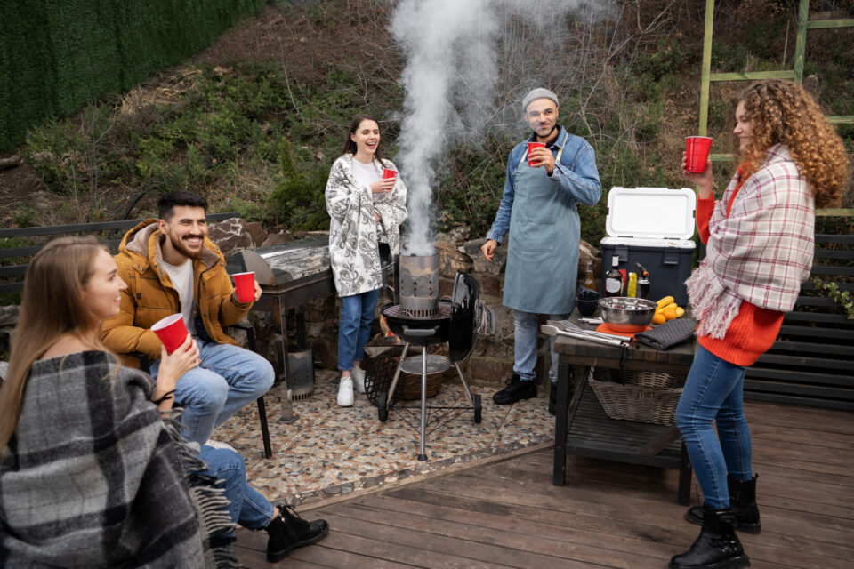

This article has been written and researched by our expert Loveable through a precise methodology. [Learn more about our methodology](https://avada.io/loveable/our-methodological.html)

[Loveable](https://avada.io/loveable/) > [Blog](https://avada.io/loveable/blog/) > [Holiday](https://avada.io/loveable/holiday/)

# 60 Christmas Team Building Activities to Boost Workplace Spirit

Written by [Blake Simpson](https://avada.io/loveable/author/blake/) Last Updated on October 05, 2023

- [60 Christmas Team Building Activities to Build Stronger Teams](https://avada.io/loveable/blog/christmas-team-building-activities/#wp-block-heading-2-4)
    - [30 Outdoor Christmas Team Building Activities](https://avada.io/loveable/blog/christmas-team-building-activities/#wp-block-heading-3-5)
        - [1\. Christmas caroling](https://avada.io/loveable/blog/christmas-team-building-activities/#wp-block-heading-4-6)
        - [2\. Attend a Christmas parade](https://avada.io/loveable/blog/christmas-team-building-activities/#wp-block-heading-4-9)
        - [3\. Ice skating](https://avada.io/loveable/blog/christmas-team-building-activities/#wp-block-heading-4-12)
        - [4\. Snowshoeing](https://avada.io/loveable/blog/christmas-team-building-activities/#wp-block-heading-4-15)
        - [5\. Sledding](https://avada.io/loveable/blog/christmas-team-building-activities/#wp-block-heading-4-18)
        - [6\. Building a snowman](https://avada.io/loveable/blog/christmas-team-building-activities/#wp-block-heading-4-21)
        - [7\. Singing Christmas songs around a campfire](https://avada.io/loveable/blog/christmas-team-building-activities/#wp-block-heading-4-24)
        - [8\. Swap gifts](https://avada.io/loveable/blog/christmas-team-building-activities/#wp-block-heading-4-27)
        - [9\. Go hiking](https://avada.io/loveable/blog/christmas-team-building-activities/#wp-block-heading-4-30)
        - [10\. Have an outdoor dinner](https://avada.io/loveable/blog/christmas-team-building-activities/#wp-block-heading-4-33)
        - [11\. Nature photography](https://avada.io/loveable/blog/christmas-team-building-activities/#wp-block-heading-4-36)
        - [12\. Do volunteer](https://avada.io/loveable/blog/christmas-team-building-activities/#wp-block-heading-4-39)
        - [13\. Outdoor Christmas movie screening](https://avada.io/loveable/blog/christmas-team-building-activities/#wp-block-heading-4-42)
        - [14\. Find Santa’s treasures](https://avada.io/loveable/blog/christmas-team-building-activities/#wp-block-heading-4-45)
        - [15\. Go to the Christmas market](https://avada.io/loveable/blog/christmas-team-building-activities/#wp-block-heading-4-48)
        - [16\. Santa’s sack race](https://avada.io/loveable/blog/christmas-team-building-activities/#wp-block-heading-4-51)
        - [17\. Have a winter trip](https://avada.io/loveable/blog/christmas-team-building-activities/#wp-block-heading-4-54)
        - [18\. Snowball fight](https://avada.io/loveable/blog/christmas-team-building-activities/#wp-block-heading-4-57)
        - [19\. Christmas tree lighting ceremony](https://avada.io/loveable/blog/christmas-team-building-activities/#wp-block-heading-4-60)
        - [20\. Christmas Tree farm visit](https://avada.io/loveable/blog/christmas-team-building-activities/#wp-block-heading-4-63)
        - [21\. Outdoor holiday BBQ](https://avada.io/loveable/blog/christmas-team-building-activities/#wp-block-heading-4-66)
        - [22\. Skiing or snowboarding](https://avada.io/loveable/blog/christmas-team-building-activities/#wp-block-heading-4-69)
        - [23\. Ice fishing](https://avada.io/loveable/blog/christmas-team-building-activities/#wp-block-heading-4-72)
        - [24\. Winter wildlife observation](https://avada.io/loveable/blog/christmas-team-building-activities/#wp-block-heading-4-75)
        - [25\. Holiday campout](https://avada.io/loveable/blog/christmas-team-building-activities/#wp-block-heading-4-78)
        - [26\.  Winter picnic](https://avada.io/loveable/blog/christmas-team-building-activities/#wp-block-heading-4-81)
        - [27\. Snowball toss challenge](https://avada.io/loveable/blog/christmas-team-building-activities/#wp-block-heading-4-84)
        - [28\. Go on a winter scavenger hunt](https://avada.io/loveable/blog/christmas-team-building-activities/#wp-block-heading-4-87)
        - [29\. Outdoor snow volleyball](https://avada.io/loveable/blog/christmas-team-building-activities/#wp-block-heading-4-90)
        - [30\. Winter nature walk](https://avada.io/loveable/blog/christmas-team-building-activities/#wp-block-heading-4-93)
    - [30 Indoor Christmas Team Building Activities](https://avada.io/loveable/blog/christmas-team-building-activities/#wp-block-heading-3-96)
        - [1\. Have a virtual holiday party](https://avada.io/loveable/blog/christmas-team-building-activities/#wp-block-heading-4-97)
        - [2\. Escape room](https://avada.io/loveable/blog/christmas-team-building-activities/#wp-block-heading-4-100)
        - [3\. Christmas trivia](https://avada.io/loveable/blog/christmas-team-building-activities/#wp-block-heading-4-103)
        - [4\. Have a Christmas dinner](https://avada.io/loveable/blog/christmas-team-building-activities/#wp-block-heading-4-106)
        - [5\. Christmas pictionary game](https://avada.io/loveable/blog/christmas-team-building-activities/#wp-block-heading-4-109)
        - [6\. Wrap gift](https://avada.io/loveable/blog/christmas-team-building-activities/#wp-block-heading-4-112)
        - [7\. Christmas karaoke](https://avada.io/loveable/blog/christmas-team-building-activities/#wp-block-heading-4-115)
        - [8\. Holiday movie marathon](https://avada.io/loveable/blog/christmas-team-building-activities/#wp-block-heading-4-118)
        - [9\. Christmas scavenger hunt](https://avada.io/loveable/blog/christmas-team-building-activities/#wp-block-heading-4-121)
        - [10\. Ugly sweater Christmas contest](https://avada.io/loveable/blog/christmas-team-building-activities/#wp-block-heading-4-124)
        - [11\. Design festive wrapping paper](https://avada.io/loveable/blog/christmas-team-building-activities/#wp-block-heading-4-127)
        - [12\. Christmas craft workshop](https://avada.io/loveable/blog/christmas-team-building-activities/#wp-block-heading-4-130)
        - [13\. Holiday meeting](https://avada.io/loveable/blog/christmas-team-building-activities/#wp-block-heading-4-133)
        - [14\. Christmas cooking together](https://avada.io/loveable/blog/christmas-team-building-activities/#wp-block-heading-4-136)
        - [15\. Create a gingerbread house village](https://avada.io/loveable/blog/christmas-team-building-activities/#wp-block-heading-4-139)
        - [16\. Play poker](https://avada.io/loveable/blog/christmas-team-building-activities/#wp-block-heading-4-142)
        - [17\. Holiday potluck](https://avada.io/loveable/blog/christmas-team-building-activities/#wp-block-heading-4-145)
        - [18\. DIY Christmas cards](https://avada.io/loveable/blog/christmas-team-building-activities/#wp-block-heading-4-148)
        - [19\. Christmas tree decoration relay](https://avada.io/loveable/blog/christmas-team-building-activities/#wp-block-heading-4-151)
        - [20\. Charity giving](https://avada.io/loveable/blog/christmas-team-building-activities/#wp-block-heading-4-154)
        - [21\. Have free photo together](https://avada.io/loveable/blog/christmas-team-building-activities/#wp-block-heading-4-157)
        - [22\. Have a cocktail bar night](https://avada.io/loveable/blog/christmas-team-building-activities/#wp-block-heading-4-160)
        - [23\. Memory scrap collage](https://avada.io/loveable/blog/christmas-team-building-activities/#wp-block-heading-4-163)
        - [24\. Christmas tree trimming relay](https://avada.io/loveable/blog/christmas-team-building-activities/#wp-block-heading-4-166)
        - [25\.  Holiday bingo](https://avada.io/loveable/blog/christmas-team-building-activities/#wp-block-heading-4-169)
        - [26\. Christmas jigsaw puzzle race](https://avada.io/loveable/blog/christmas-team-building-activities/#wp-block-heading-4-172)
        - [27\. Christmas memory game](https://avada.io/loveable/blog/christmas-team-building-activities/#wp-block-heading-4-175)
        - [28\. Cookie swaps](https://avada.io/loveable/blog/christmas-team-building-activities/#wp-block-heading-4-178)
        - [29\. Secret Santa game](https://avada.io/loveable/blog/christmas-team-building-activities/#wp-block-heading-4-181)
        - [30\. Decorate the office for Christmas](https://avada.io/loveable/blog/christmas-team-building-activities/#wp-block-heading-4-184)
- [Bottom line](https://avada.io/loveable/blog/christmas-team-building-activities/#wp-block-heading-2-187)

Tis the season to unite, ignite, and excite! Welcome to a winter wonderland of camaraderie and collaboration, where the jingle of bells harmonizes with the laughter of colleagues. At the heart of the holiday season, we present to you “60 **Christmas Team-Building Activities** to boost workplace spirit.

These activities will infuse your workplace with the warmth of unity as we travel outside the frozen windows of the office. Your teammates should prepare to open the gift of reinforced ties, shared experiences, and a revived spirit of collaboration. This Christmas team-building activity can brighten your Christmas season and pave the path to a more unified and inspired workplace.

To create a more personal touch during the team-building event, you may want to consider giving your [coworkers affordable Christmas presents](https://avada.io/loveable/cheap-christmas-gifts-coworkers/) to enhance the memorable experience together.

## **60 Christmas Team Building Activities to Build Stronger Teams**

### **30 Outdoor Christmas Team Building Activities**

#### **1\. Christmas caroling**

Christmas carolling, as a Christmas team-building activity, involves a group of individuals coming together to sing [traditional Christmas songs](https://avada.io/loveable/best-christmas-songs/) or carols in a festive manner. This team-building exercise promotes collaboration, communication, and camaraderie among participants. Through rehearsing and performing carols as a team, participants develop a sense of unity and shared purpose.

#### **2\. Attend a Christmas parade**

Attending a Christmas parade as a team-building activity is about more than just watching the festivities. It’s a shared experience that brings your team together to celebrate the holiday season. As you witness the dazzling floats, hear the music, and feel the joy in the air, you’ll strengthen bonds, create lasting memories, and foster a sense of unity. 

#### **3\. Ice skating**

Ice skating is a wonderful journey on frozen paths that knits collaboration with twirls and laughter as a Christmas team-building activity. The ice takes on the concept of cooperation as people skate hand in hand or encourage one another. The team develops unity as they learn to support and rely on one another while overcoming the frigid challenge of keeping upright on the ice.

#### **4\. Snowshoeing**

A magical journey through snowy wonderlands, snowshoeing as a Christmas team-building activity brings coworkers together while embracing the festive spirit. The squad must work together to properly manage the terrain as they set out on their winter expedition. As they converse and laugh together, the rhythmic crunch of snow underfoot serves as a background, fostering their togetherness.

#### **5.** **Sledding**

Sledding is a cherished Christmas activity where individuals or groups ride down snowy hills on sleds or toboggans. This exhilarating winter pastime brings joy and laughter, making it a perfect way to celebrate the holiday season. It encourages teamwork when enjoyed with friends or family and provides a fun-filled experience amidst the snowy landscapes of winter.

#### **6\. Building a snowman**

Building a snowman as a Christmas team-building project is a fun and creative way for coworkers to get together during the holidays. Teams work together to construct a cheerful snow figure, drawing on their creative ingenuity to create the ideal snowman. This playful and hands-on activity improves cooperation, communication, and problem-solving as teammates design, shape, and decorate their snowy models.

#### **7.** **Singing Christmas songs around a campfire**

A lovely way for coworkers to enjoy the holiday season is to get together around a campfire and sing Christmas carols. Coworkers celebrate the joy of the season outside while fortifying the bond via music as voices mingle in festive songs. 

#### **8\. Swap gifts**

A swap gift team-building activity involves participants exchanging [Christmas gifts](https://avada.io/loveable/christmas/), often with a specific theme or set of rules, to foster camaraderie and teamwork. This fun and interactive exercise makes a memorable and lighthearted way for team members to connect and build stronger relationships.

#### **9\. Go hiking**

A Christmas team-building trek is like opening a gift of nature together. Colleagues get together to enjoy the great outdoors, immersing in the beauty of winter sceneries. This activity gives a unique opportunity to establish friendships as they explore routes decked with frosted trees and gleaming snow.

#### **10\. Have an outdoor dinner**

Team members gather for a meal outside, such as in a park, garden, or campground, as part of an outdoor dinner team-building activity. It offers a comfortable and pleasurable setting for coworkers to interact, form bonds, and promote a sense of togetherness.

#### **11\. Nature photography**

Nature photography may be a fun and productive team-building activity that blends a love of nature with the skill of photography. When groups go on a nature photography adventure, they are not only capturing the beauty of the natural world, but they are also encouraging communication among coworkers.

#### **12\. Do volunteer**

Volunteering as a team-building exercise is a meaningful activity for a team to positively affect a cause or community. It promotes teamwork, empathy, and [new skill development](https://avada.io/loveable/learning-new-skill/) while raising spirits. The team, as well as the larger community, benefit from the more cohesive and rewarding work environment brought about by this shared goal.

#### **13\. Outdoor Christmas movie screening**

If you want to level up your [classic Christmas movies](https://avada.io/loveable/classic-christmas-movies/) this holiday season, let’s take the projector outside, and it will let you down. It involves gathering team members outdoors, often under a starry winter sky, to watch classic Christmas movies projected on a large screen. 

#### **14\. Find Santa’s treasures**

Together, let’s start the journey to find Santa treasures this Christmas time to have a memorable day with your loved ones. This is a team-building activity where participants search for hidden “treasures” or clues related to Santa and the holiday season. It’s a festive and engaging way to encourage teamwork, problem-solving, and collaboration among team members.

#### **15\. Go to the Christmas market**

As a team-building exercise, going to a Christmas market is like entering a merry paradise filled with lights, scents, and seasonal spirit. This game promotes cooperation among teams as they shop for one-of-a-kind presents and goodies while navigating the market together. 

#### **16\. Santa’s sack race**

Santa’s sack race is a fun and festive team-building activity where participants hop or race while wearing oversized sacks resembling Santa’s sack of gifts. The objective is to be the first to reach the finish line. This lively and lighthearted game encourages physical activity, laughter, and camaraderie among team members.

#### **17\. Have a winter trip**

The organization of a group excursion to a winter destination throughout the holiday season counts as having a winter trip as a team-building activity. This team-building activity enables team members to get to know one another in a casual, non-work environment while taking part in winter sports. 

#### **18\. Snowball fight**

[A snowball battle](https://onwisconsin.uwalumni.com/bascom-hill-snowball-fights/) turns the wintery landscape into a playground of shared delight and cordial competitiveness as a team-building exercise. Colleagues gather to build complex snow forts, plan their assaults, and fight in thrilling combat with freezing missiles. This icy adventure is more than simply a snowball fight; it’s also a creative test of cooperation, communication, and flexibility. 

#### **19\. Christmas tree lighting ceremony**

The Christmas tree lighting Ceremony serves as a metaphor for cooperation, harmony, and communal joy within a team or business. It entails assembling the group around a beautifully decorated Christmas tree and lighting it jointly, usually by flicking a switch or igniting candles or light strings.

#### **20\. Christmas Tree farm visit**

As a team-building exercise, visiting a Christmas tree farm is like entering a winter wonderland. Teams work together to select, cut, and transport the trees they have picked, making it a shared adventure that promotes collaboration. As co-workers cooperate to choose the tree that best embodies their shared vision, this exercise boosts collaboration and decision-making. 

#### **21\. Outdoor holiday BBQ**

Outside holiday BBQ team building is a fun and laid-back team-building activity that blends the pleasure of the holidays with an outside barbeque and great cuisine. Team members join together to plan, serve, and eat a barbecue meal with a holiday theme, which fosters camaraderie and togetherness in a relaxed setting. 

#### **22\. Skiing or snowboarding**

Skiing or snowboarding as a Christmas team-building activity is like unwrapping a winter wonderland filled with adrenaline and togetherness. As you carve through the powdery trails, you’ll discover that this activity isn’t just about conquering the mountain; it’s about conquering challenges as a team.

#### **23\. Ice fishing**

Ice fishing as a team-building activity is gathering a group of people to fish on a frozen lake. It’s an opportunity to practice cooperation, problem-solving, and flexibility in an unusual context. While waiting for a catch, team members interact, chill, and build trust in the tranquil natural settings.

#### **24\. Winter wildlife observation**

Teams can work together to discover and observe the marvels of nature during the winter by participating in winter wildlife observation. This activity forces team members to work together to locate and recognize animals, follow their movements, and report their findings to the group. 

#### **25\. Holiday campout**

A group may get together over the holidays in an exciting and festive way by going on a holiday campout as a team-building activity. To celebrate the holidays, people gather to spend one or more nights outside, usually camping. Team members cooperate to set up camp, make meals, and participate in outdoor activities like hiking or campfire storytelling.

#### **26\.  Winter picnic**

A winter picnic is a delightful gathering where friends and family come together to enjoy a meal outdoors during the colder months. Bundled up in warm clothing and blankets, participants share food, laughter, and the beauty of nature in its wintry splendor.

#### **27\. Snowball toss challenge**

In the enjoyable team-building activity known as the [snowball toss challenge](https://www.carnivalsavers.com/winter-carnival/frosty-snowball-toss-winter-game.html), players take turns flinging snowballs at predetermined targets. Teams compete amicably while working together to reach their goals accurately in this winter-themed exercise. 

#### **28\. Go on a winter scavenger hunt**

A fun team-building exercise is going on a winter scavenger hunt, where participants look for hidden objects or answer winter-themed puzzles. Teams negotiate the winter terrain and enjoy the Christmas spirit; this outdoor activity encourages cooperation, problem-solving, and effective communication.

#### **29\. Outdoor snow volleyball**

[Setting up a volleyball net in the snow-covered](https://www.steamboatpilot.com/news/sliding-to-victory-steamboats-1st-snow-volleyball-tournament/) outdoors is an exciting team-building activity known as outdoor snow volleyball. On the icy ground, participants divide into teams and play a nice game of volleyball. Players must modify their abilities to the slippery and uneven surface to succeed in this original take on the traditional sport. 

#### **30\. Winter nature walk**

Enjoy this nature walk when your members discover the beauty of the winter season, see animals, and take in the peace of nature under the guidance of an experienced guide. During the winter, this exercise fosters awareness and an appreciation for nature, offering a welcome reprieve from every day of work.

### 30 Indoor Christmas Team Building Activities

#### **1\. Have a virtual holiday party**

It will be funnier to have a face-to-face party; however, a virtual holiday party is not a bad choice. This is a modern twist on team-building that brings remote or dispersed teams together to celebrate the festive season. Through video conferencing platforms, team members can join in from the comfort of their homes or offices. 

#### **2\. Escape room**

An [escape room](https://www.escapelive.co.uk/what-makes-escape-rooms-so-popular/) challenges participants to work together to solve mysteries in a confined space. This engaging experience encourages teamwork, problem-solving, and critical thinking skills. Team members must collaborate effectively, leverage each other’s strengths, and think outside the box to accomplish their mission.

#### **3\. [Christmas trivia](http://pp.slack.com/client/T10HVQC4X/C04PU0Z7AVB)**

This team-building activity brings colleagues together for a jolly competition filled with Christmas-themed questions and challenges. Test your knowledge of holiday traditions, movies, music, and more while collaborating with your team to earn points and win fantastic prizes.!

#### **4\. Have a Christmas dinner**

Having a Christmas dinner is a heartwarming and engaging team-building activity that allows colleagues to come together in a relaxed, festive setting. It fosters collaboration, and appreciation for each other, making it a meaningful way to celebrate and strengthen workplace relationships during the season.

#### **5\. [Christmas pictionary game](https://www.etsy.com/au/listing/1131799881/christmas-pictionary-game-christmas)**

Divide into teams, get your markers, and let the games begin. Draw and guess your way through everything Christmas, from reindeer to gingerbread homes, all while creating treasured holiday memories with coworkers. It’s a zany take on a traditional favorite that will have everyone jumping with delight!

#### **6\. Wrap gift**

Gift wrapping is a one-of-a-kind and hands-on Christmas team-building exercise that fosters teamwork, creativity, and attention to detail. Team members collaborate to wrap gifts neatly and thoughtfully in this enjoyable practice. This practice highlights the significance of precision and quality in their work, which may be carried over into their professional activities.

#### **7\. Christmas karaoke**

Christmas karaoke is a delightful way for teams to come together during the holiday season. It involves singing favourite Christmas songs in a fun and relaxed setting, promoting teamwork, communication, and a joyful spirit among colleagues. 

#### **8\. Holiday movie marathon**

Holiday movie marathon as an outdoor team-building activity is fun for colleagues to come together, strengthen their bonds, relax, and enjoy a shared experience during the holiday season. Enjoying a movie after work is a break from work-related stressors, contributing to a positive and cohesive team atmosphere.

#### **9\. [Christmas scavenger hunt](https://www.etsy.com/se-en/listing/745748092/indoor-merry-christmas-scavenger-hunt)**

This exciting activity combines the joy of a traditional scavenger hunt with the enchantment of the holiday season. Your team will collaborate, solve puzzles, and immerse themselves in festive challenges. Whether it’s in your office or a virtual space, this adventure is a delightful way to celebrate the holidays while strengthening bonds within your team.

#### **10\. Ugly sweater Christmas contest**

A fun and festive team-building activity, an [ugly sweater contest](https://www.newriverelectrical.com/ugly-christmas-sweater-contest/) encourages team members to embrace the Christmas season with a sense of humor. Participants meet to exchange laughter, improve spirits, and build team collaboration. 

#### **11\. Design festive wrapping paper**

Design festive wrapping paper by yourself is a wonderful addition to holiday parties, team-building events, or as a creative break during work gatherings. It promotes creativity, teamwork, and a sense of accomplishment when teams produce their own unique wrapping paper, making the gift-giving season even more meaningful.

#### **12\. Christmas craft workshop**

This hands-on activity brings your team together to make beautiful [Christmas wood crafts](https://avada.io/loveable/blog/christmas-wood-crafts/) or papper crafts while encouraging teamwork, creativity, and a fun environment. Your team will bond over crafts, problem-solving, and getting into the Christmas spirit, whether in person or digitally.

#### **13\. Holiday meeting**

A holiday meeting for team building is a special gathering that combines the spirit of the season with opportunities for team members to connect and grow. It’s a time to reflect on past achievements, set future goals, and reinforce team bonds. 

#### **14\. Christmas cooking together**

Spice up your team’s holiday spirit with our ‘Christmas cooking together’ team-building activity! It’s a delightful blend of teamwork and culinary creativity, where teams cook together to create delicious holiday dishes. From gingerbread masterpieces to festive feasts, this hands-on experience fosters unity and a taste of holiday magic.

#### **15\. Create a gingerbread house village**

This fun-filled activity brings your team closer while you collaborate, design, and construct your very own gingerbread houses. It’s a festive journey of teamwork, imagination, and holiday cheer, resulting in beautiful gingerbread houses and stronger bonds within your team.

#### **16\. Play poker**

Poker, a classic card game, can be a unique and effective tool for team building. It encourages teamwork, strategic thinking, and adaptability while enhancing communication among team members. It’s a fun and engaging way to develop important workplace skills.

#### **17\. Holiday potluck**

A holiday potluck is a delightful team-building activity that combines the festive spirit of the holidays with the opportunity to strengthen bonds within a group. In this heartwarming event, team members come together to share homemade dishes, treats, and stories. Each member prepares and brings a dish to the potluck, reflecting their unique culinary talents and cultural backgrounds.

#### **18\. DIY Christmas cards**

Let’s bond and spread holiday joy with [DIY Christmas cards](https://avada.io/loveable/blog/christmas-card-messages/)! This activity is not just fun; it’s a fantastic way to strengthen our team spirit. Whether we’re together in person or online, let’s make memorable cards that reflect our team’s closeness. So, get some supplies, wear your festive gear, and let’s get crafting!

#### **19\. Christmas tree decoration relay**

The Christmas tree decoration relay is a fun and collaborative team-building activity that adds a festive twist to teamwork. In this event, teams come up with various [white Christmas tree decoration ideas](https://avada.io/loveable/blog/white-christmas-tree-decoration/) and compete to decorate them as quickly and creatively as possible. A team member takes on a different decorating task, promoting communication, coordination, and creativity.

#### **20\. Charity giving**

With a charity giving program, you can take your team-building experience to the next level. This touching exercise mixes collaboration and social responsibility, allowing your group to make a big difference in the neighbourhood. Your team will unite over common objectives and beliefs while generating lasting impact via fundraising or volunteering.

#### **21\. Have free photo together**

Capturing a free group photo is a simple yet powerful team-building activity. It brings team members together to create a lasting memory and a visual representation of their unity. It’s a tangible reminder of the value of working together as a cohesive team.

#### **22\. Have a cocktail bar night**

A meeting with a cocktail is excellent for team celebrations, holiday parties, or as a unique opportunity to unwind and interact with coworkers. Join together for a night of mixing and mingling with your team and establishing lasting connections!

#### **23\. Memory scrap collage**

A memory scrap collage is a creative team-building activity where team members come together to create a visual representation of shared memories and experiences. They contribute mementos, photos, and personal items to collectively craft a meaningful collage that celebrates their shared journey and strengthens team bonds.

#### **24\. Christmas tree trimming relay**

An activity in which participants work together to decorate a Christmas tree in a fun and competitive way will be a nice option for the company’s Christmas team building. Teams compete to trim the tree by hanging ornaments and decorations on it. Each member has a role and must communicate effectively to ensure the tree is beautifully decorated within a set time limit.

#### **25\.  [Holiday bingo](https://www.amazon.com/Holiday-Christmas-Decorations-Classroom-Supplies/dp/B08L6822HR)**

Holiday bingo encourages social interaction, networking, and engagement among team members. It provides opportunities for individuals to connect and bond over shared experiences, creating a festive and enjoyable atmosphere within the team. The competitive element adds extra excitement, making it a delightful and memorable team-building activity during the holiday season.

#### **26\. [Christmas jigsaw puzzle race](https://www.amazon.com/Piece-Jigsaw-Puzzle-Adult-Family/dp/B092KLQL1C)**

All members of your company will be extremely engaged in activities with a little bit challenging and competitive. Thus, solving this picture is obviously a wonderful idea as players work against the clock to piece together the puzzle. It will make all people closer and more understand about each other.

#### **27\. Christmas memory game**

As a team-building game, the Christmas memory game is more than simply a memory test; it’s a fun and festive method to improve memory abilities, encourage collaboration, and enjoy the holiday season.

#### **28\. Cookie swaps**

Cookie swap  activity, you can indulge in the sweetness of teamwork!” It’s a lovely occasion where team members create and exchange their favorite handmade cookies. This exercise encourages teamwork, communication, and a spice of festive happiness by sharing recipes, stories, and delectable sweets.

#### **29\. [Secret Santa game](https://www.etsy.com/nz/listing/1116697042/editable-christmas-gift-exchange-dice)**

Hosing a game with your company-close ones is a wonderful option to create a funny moment together. Therefore, the Christmas gift exchange dice game card is a one-of-a-kind and enjoyable method to encourage team connection over the holiday season. It’s a heartwarming and unforgettable addition to any team-building or holiday celebration event.

#### **30\. Decorate the office for Christmas**

Work together to transform our workspace into a festive wonderland, and let your creativity shine. This [office Christmas decoration](https://avada.io/loveable/blog/office-christmas-decorations/) is a  fun activity to celebrate the season and effectively strengthens team bonds via planning unique themes to hanging ornaments and stringing lights. 

## Bottom line

These fun activities are designed to promote friendship, teamwork, and better communication within your team. Whether you’re tackling creative challenges, friendly competitions, or acts of kindness, these experiences will create lasting memories and foster a positive work environment. Don’t miss the chance to bring the festive spirit to your workplace and leave a lasting impact on team dynamics and morale. Plan a special **Christmas team-building activity**, enjoy the moments, and watch the Christmas spirit soar among your wonderful team members!

- [60 Christmas Team Building Activities to Build Stronger Teams](https://avada.io/loveable/blog/christmas-team-building-activities/#wp-block-heading-2-4)
    - [30 Outdoor Christmas Team Building Activities](https://avada.io/loveable/blog/christmas-team-building-activities/#wp-block-heading-3-5)
        - [1\. Christmas caroling](https://avada.io/loveable/blog/christmas-team-building-activities/#wp-block-heading-4-6)
        - [2\. Attend a Christmas parade](https://avada.io/loveable/blog/christmas-team-building-activities/#wp-block-heading-4-9)
        - [3\. Ice skating](https://avada.io/loveable/blog/christmas-team-building-activities/#wp-block-heading-4-12)
        - [4\. Snowshoeing](https://avada.io/loveable/blog/christmas-team-building-activities/#wp-block-heading-4-15)
        - [5\. Sledding](https://avada.io/loveable/blog/christmas-team-building-activities/#wp-block-heading-4-18)
        - [6\. Building a snowman](https://avada.io/loveable/blog/christmas-team-building-activities/#wp-block-heading-4-21)
        - [7\. Singing Christmas songs around a campfire](https://avada.io/loveable/blog/christmas-team-building-activities/#wp-block-heading-4-24)
        - [8\. Swap gifts](https://avada.io/loveable/blog/christmas-team-building-activities/#wp-block-heading-4-27)
        - [9\. Go hiking](https://avada.io/loveable/blog/christmas-team-building-activities/#wp-block-heading-4-30)
        - [10\. Have an outdoor dinner](https://avada.io/loveable/blog/christmas-team-building-activities/#wp-block-heading-4-33)
        - [11\. Nature photography](https://avada.io/loveable/blog/christmas-team-building-activities/#wp-block-heading-4-36)
        - [12\. Do volunteer](https://avada.io/loveable/blog/christmas-team-building-activities/#wp-block-heading-4-39)
        - [13\. Outdoor Christmas movie screening](https://avada.io/loveable/blog/christmas-team-building-activities/#wp-block-heading-4-42)
        - [14\. Find Santa’s treasures](https://avada.io/loveable/blog/christmas-team-building-activities/#wp-block-heading-4-45)
        - [15\. Go to the Christmas market](https://avada.io/loveable/blog/christmas-team-building-activities/#wp-block-heading-4-48)
        - [16\. Santa’s sack race](https://avada.io/loveable/blog/christmas-team-building-activities/#wp-block-heading-4-51)
        - [17\. Have a winter trip](https://avada.io/loveable/blog/christmas-team-building-activities/#wp-block-heading-4-54)
        - [18\. Snowball fight](https://avada.io/loveable/blog/christmas-team-building-activities/#wp-block-heading-4-57)
        - [19\. Christmas tree lighting ceremony](https://avada.io/loveable/blog/christmas-team-building-activities/#wp-block-heading-4-60)
        - [20\. Christmas Tree farm visit](https://avada.io/loveable/blog/christmas-team-building-activities/#wp-block-heading-4-63)
        - [21\. Outdoor holiday BBQ](https://avada.io/loveable/blog/christmas-team-building-activities/#wp-block-heading-4-66)
        - [22\. Skiing or snowboarding](https://avada.io/loveable/blog/christmas-team-building-activities/#wp-block-heading-4-69)
        - [23\. Ice fishing](https://avada.io/loveable/blog/christmas-team-building-activities/#wp-block-heading-4-72)
        - [24\. Winter wildlife observation](https://avada.io/loveable/blog/christmas-team-building-activities/#wp-block-heading-4-75)
        - [25\. Holiday campout](https://avada.io/loveable/blog/christmas-team-building-activities/#wp-block-heading-4-78)
        - [26\.  Winter picnic](https://avada.io/loveable/blog/christmas-team-building-activities/#wp-block-heading-4-81)
        - [27\. Snowball toss challenge](https://avada.io/loveable/blog/christmas-team-building-activities/#wp-block-heading-4-84)
        - [28\. Go on a winter scavenger hunt](https://avada.io/loveable/blog/christmas-team-building-activities/#wp-block-heading-4-87)
        - [29\. Outdoor snow volleyball](https://avada.io/loveable/blog/christmas-team-building-activities/#wp-block-heading-4-90)
        - [30\. Winter nature walk](https://avada.io/loveable/blog/christmas-team-building-activities/#wp-block-heading-4-93)
    - [30 Indoor Christmas Team Building Activities](https://avada.io/loveable/blog/christmas-team-building-activities/#wp-block-heading-3-96)
        - [1\. Have a virtual holiday party](https://avada.io/loveable/blog/christmas-team-building-activities/#wp-block-heading-4-97)
        - [2\. Escape room](https://avada.io/loveable/blog/christmas-team-building-activities/#wp-block-heading-4-100)
        - [3\. Christmas trivia](https://avada.io/loveable/blog/christmas-team-building-activities/#wp-block-heading-4-103)
        - [4\. Have a Christmas dinner](https://avada.io/loveable/blog/christmas-team-building-activities/#wp-block-heading-4-106)
        - [5\. Christmas pictionary game](https://avada.io/loveable/blog/christmas-team-building-activities/#wp-block-heading-4-109)
        - [6\. Wrap gift](https://avada.io/loveable/blog/christmas-team-building-activities/#wp-block-heading-4-112)
        - [7\. Christmas karaoke](https://avada.io/loveable/blog/christmas-team-building-activities/#wp-block-heading-4-115)
        - [8\. Holiday movie marathon](https://avada.io/loveable/blog/christmas-team-building-activities/#wp-block-heading-4-118)
        - [9\. Christmas scavenger hunt](https://avada.io/loveable/blog/christmas-team-building-activities/#wp-block-heading-4-121)
        - [10\. Ugly sweater Christmas contest](https://avada.io/loveable/blog/christmas-team-building-activities/#wp-block-heading-4-124)
        - [11\. Design festive wrapping paper](https://avada.io/loveable/blog/christmas-team-building-activities/#wp-block-heading-4-127)
        - [12\. Christmas craft workshop](https://avada.io/loveable/blog/christmas-team-building-activities/#wp-block-heading-4-130)
        - [13\. Holiday meeting](https://avada.io/loveable/blog/christmas-team-building-activities/#wp-block-heading-4-133)
        - [14\. Christmas cooking together](https://avada.io/loveable/blog/christmas-team-building-activities/#wp-block-heading-4-136)
        - [15\. Create a gingerbread house village](https://avada.io/loveable/blog/christmas-team-building-activities/#wp-block-heading-4-139)
        - [16\. Play poker](https://avada.io/loveable/blog/christmas-team-building-activities/#wp-block-heading-4-142)
        - [17\. Holiday potluck](https://avada.io/loveable/blog/christmas-team-building-activities/#wp-block-heading-4-145)
        - [18\. DIY Christmas cards](https://avada.io/loveable/blog/christmas-team-building-activities/#wp-block-heading-4-148)
        - [19\. Christmas tree decoration relay](https://avada.io/loveable/blog/christmas-team-building-activities/#wp-block-heading-4-151)
        - [20\. Charity giving](https://avada.io/loveable/blog/christmas-team-building-activities/#wp-block-heading-4-154)
        - [21\. Have free photo together](https://avada.io/loveable/blog/christmas-team-building-activities/#wp-block-heading-4-157)
        - [22\. Have a cocktail bar night](https://avada.io/loveable/blog/christmas-team-building-activities/#wp-block-heading-4-160)
        - [23\. Memory scrap collage](https://avada.io/loveable/blog/christmas-team-building-activities/#wp-block-heading-4-163)
        - [24\. Christmas tree trimming relay](https://avada.io/loveable/blog/christmas-team-building-activities/#wp-block-heading-4-166)
        - [25\.  Holiday bingo](https://avada.io/loveable/blog/christmas-team-building-activities/#wp-block-heading-4-169)
        - [26\. Christmas jigsaw puzzle race](https://avada.io/loveable/blog/christmas-team-building-activities/#wp-block-heading-4-172)
        - [27\. Christmas memory game](https://avada.io/loveable/blog/christmas-team-building-activities/#wp-block-heading-4-175)
        - [28\. Cookie swaps](https://avada.io/loveable/blog/christmas-team-building-activities/#wp-block-heading-4-178)
        - [29\. Secret Santa game](https://avada.io/loveable/blog/christmas-team-building-activities/#wp-block-heading-4-181)
        - [30\. Decorate the office for Christmas](https://avada.io/loveable/blog/christmas-team-building-activities/#wp-block-heading-4-184)
- [Bottom line](https://avada.io/loveable/blog/christmas-team-building-activities/#wp-block-heading-2-187)

### [Blake Simpson](https://avada.io/loveable/author/blake/)

Hi, I'm Blake from Loveable. I help people find perfect gifts for occasions like anniversaries and weddings. I also write a blog about holidays, sharing insights to make them more meaningful. Let's create unforgettable moments together!

- [Twitter](https://twitter.com/intent/tweet)
- [Facebook](https://www.facebook.com/sharer/sharer.php)
- [instagram](https://avada.io/loveable/blog/christmas-team-building-activities/)
- [pinterest](https://www.pinterest.com/loveablellc/)

## Related Posts

[### 120+ Christian Birthday Wishes To Spread Your Love](https://avada.io/loveable/blog/christian-birthday-wishes/) 

[

### 35 Best 70th Birthday Ideas To Celebrate The Special Milestone

](https://avada.io/loveable/blog/70th-birthday-ideas/)

[

### 50 Best 30th Birthday Decorations for a Remarkable Birthday Bash

](https://avada.io/loveable/blog/30th-birthday-decorations/)

[

### 40 Delicious Vegan Christmas Desserts to Delight Your Palate

](https://avada.io/loveable/blog/vegan-christmas-desserts/)

[

### 60 Christmas Team Building Activities to Boost Workplace Spirit

](https://avada.io/loveable/blog/christmas-team-building-activities/)
