This article has been written and researched by our expert Loveable through a precise methodology. [Learn more about our methodology](https://avada.io/loveable/our-methodological.html)

[Loveable](https://avada.io/loveable/) > [Blog](https://avada.io/loveable/blog/) > [Holiday](https://avada.io/loveable/holiday/)

# 60+ Last-Minute Halloween Costume Ideas that’ll Save Your Spooky Night

Written by [Blake Simpson](https://avada.io/loveable/author/blake/) Last Updated on October 03, 2023

- [60+ Last-Minute Halloween Costume Ideas You Can DIY in Minutes](https://avada.io/loveable/blog/last-minute-halloween-costume-ideas/#wp-block-heading-2-2)
    - [1\. ‘Operation’ Costume](https://avada.io/loveable/blog/last-minute-halloween-costume-ideas/#wp-block-heading-3-3)
    - [2\. Gumball Machine Costume](https://avada.io/loveable/blog/last-minute-halloween-costume-ideas/#wp-block-heading-3-7)
    - [3\. ‘The Marvelous Mrs. Maisel’ Costume](https://avada.io/loveable/blog/last-minute-halloween-costume-ideas/#wp-block-heading-3-11)
    - [4\. Itsy Bitsy Spider Costume](https://avada.io/loveable/blog/last-minute-halloween-costume-ideas/#wp-block-heading-3-15)
    - [5\. Frankenstein Costume](https://avada.io/loveable/blog/last-minute-halloween-costume-ideas/#wp-block-heading-3-19)
    - [6\. Pizza Costume](https://avada.io/loveable/blog/last-minute-halloween-costume-ideas/#wp-block-heading-3-23)
    - [7\. Ghost Costume](https://avada.io/loveable/blog/last-minute-halloween-costume-ideas/#wp-block-heading-3-27)
    - [8\. Ice Cream Truck Costumes](https://avada.io/loveable/blog/last-minute-halloween-costume-ideas/#wp-block-heading-3-31)
    - [9\. Butterfly Costume](https://avada.io/loveable/blog/last-minute-halloween-costume-ideas/#wp-block-heading-3-35)
    - [10\. Mummy Costumes](https://avada.io/loveable/blog/last-minute-halloween-costume-ideas/#wp-block-heading-3-39)
    - [11\. ‘Alice in Wonderland’ Costume](https://avada.io/loveable/blog/last-minute-halloween-costume-ideas/#wp-block-heading-3-43)
    - [12\. Beehive Costume](https://avada.io/loveable/blog/last-minute-halloween-costume-ideas/#wp-block-heading-3-47)
    - [13\. Scarecrow Costumes](https://avada.io/loveable/blog/last-minute-halloween-costume-ideas/#wp-block-heading-3-51)
    - [14\. ‘Peter Pan’ and the Lost Boys Costumes](https://avada.io/loveable/blog/last-minute-halloween-costume-ideas/#wp-block-heading-3-55)
    - [15\. ‘Wizard of Oz’ Costumes](https://avada.io/loveable/blog/last-minute-halloween-costume-ideas/#wp-block-heading-3-59)
    - [16\. Cactus Costume](https://avada.io/loveable/blog/last-minute-halloween-costume-ideas/#wp-block-heading-3-63)
    - [17\. Cowboy and Cowgirl Costumes](https://avada.io/loveable/blog/last-minute-halloween-costume-ideas/#wp-block-heading-3-67)
    - [18\. ‘Little House on the Prairie’ Costume](https://avada.io/loveable/blog/last-minute-halloween-costume-ideas/#wp-block-heading-3-71)
    - [19\. Ice Cream Cone Costume](https://avada.io/loveable/blog/last-minute-halloween-costume-ideas/#wp-block-heading-3-75)
    - [20\. Strawberry Costume](https://avada.io/loveable/blog/last-minute-halloween-costume-ideas/#wp-block-heading-3-79)
    - [21\. Cat Burglar Costume](https://avada.io/loveable/blog/last-minute-halloween-costume-ideas/#wp-block-heading-3-83)
    - [22\. Cool Cucumber Costume](https://avada.io/loveable/blog/last-minute-halloween-costume-ideas/#wp-block-heading-3-87)
    - [23\. Jack O’Lantern Costume](https://avada.io/loveable/blog/last-minute-halloween-costume-ideas/#wp-block-heading-3-91)
    - [24\. Snow White Halloween Costume](https://avada.io/loveable/blog/last-minute-halloween-costume-ideas/#wp-block-heading-3-95)
    - [25\. Sabrina’s Halloween Costume](https://avada.io/loveable/blog/last-minute-halloween-costume-ideas/#wp-block-heading-3-98)
    - [26\. Burrito Costume](https://avada.io/loveable/blog/last-minute-halloween-costume-ideas/#wp-block-heading-3-102)
    - [27\. ‘Troop Beverly Hills’ Halloween Costume](https://avada.io/loveable/blog/last-minute-halloween-costume-ideas/#wp-block-heading-3-106)
    - [28\. Bouquet of Pencils Costume](https://avada.io/loveable/blog/last-minute-halloween-costume-ideas/#wp-block-heading-3-110)
    - [29\. ’80s Rock Band Costume](https://avada.io/loveable/blog/last-minute-halloween-costume-ideas/#wp-block-heading-3-114)
    - [30\. ‘Where’s Waldo?’ Costume](https://avada.io/loveable/blog/last-minute-halloween-costume-ideas/#wp-block-heading-3-118)
    - [31\. White Swan Costume](https://avada.io/loveable/blog/last-minute-halloween-costume-ideas/#wp-block-heading-3-122)
    - [32\. Frosted Animal Cookie Costume](https://avada.io/loveable/blog/last-minute-halloween-costume-ideas/#wp-block-heading-3-126)
    - [33\. Wednesday Addams Costume](https://avada.io/loveable/blog/last-minute-halloween-costume-ideas/#wp-block-heading-3-130)
    - [34\. Skeleton Costume](https://avada.io/loveable/blog/last-minute-halloween-costume-ideas/#wp-block-heading-3-134)
    - [35\. Pumpkin Cape Costume](https://avada.io/loveable/blog/last-minute-halloween-costume-ideas/#wp-block-heading-3-138)
    - [36\. RBG Costume](https://avada.io/loveable/blog/last-minute-halloween-costume-ideas/#wp-block-heading-3-142)
    - [37\. Peter Pan Family Costume](https://avada.io/loveable/blog/last-minute-halloween-costume-ideas/#wp-block-heading-3-146)
    - [38\. Mime Costume](https://avada.io/loveable/blog/last-minute-halloween-costume-ideas/#wp-block-heading-3-150)
    - [39\. Safari Costume](https://avada.io/loveable/blog/last-minute-halloween-costume-ideas/#wp-block-heading-3-154)
    - [40\. Witch Costume](https://avada.io/loveable/blog/last-minute-halloween-costume-ideas/#wp-block-heading-3-158)
    - [41\. Cruella de Vil Costume](https://avada.io/loveable/blog/last-minute-halloween-costume-ideas/#wp-block-heading-3-162)
    - [42\. Devil and Angel Costume](https://avada.io/loveable/blog/last-minute-halloween-costume-ideas/#wp-block-heading-3-166)
    - [43\. Knight in Shining Armor Costume](https://avada.io/loveable/blog/last-minute-halloween-costume-ideas/#wp-block-heading-3-170)
    - [44\. Mother Earth DIY Halloween Costume](https://avada.io/loveable/blog/last-minute-halloween-costume-ideas/#wp-block-heading-3-174)
    - [45\. Queen of Hearts Halloween Costume](https://avada.io/loveable/blog/last-minute-halloween-costume-ideas/#wp-block-heading-3-178)
    - [46\. Bjork Swan Costume](https://avada.io/loveable/blog/last-minute-halloween-costume-ideas/#wp-block-heading-3-181)
    - [47\. Little Red Riding Hood Costume](https://avada.io/loveable/blog/last-minute-halloween-costume-ideas/#wp-block-heading-3-185)
    - [48\. Women’s Wednesday Addams Dance Dress](https://avada.io/loveable/blog/last-minute-halloween-costume-ideas/#wp-block-heading-3-188)
    - [49\. Easy TinkerBell Costume](https://avada.io/loveable/blog/last-minute-halloween-costume-ideas/#wp-block-heading-3-191)
    - [50\. Cereal Killer Costume](https://avada.io/loveable/blog/last-minute-halloween-costume-ideas/#wp-block-heading-3-195)
    - [51\. Gingham Witch Costume](https://avada.io/loveable/blog/last-minute-halloween-costume-ideas/#wp-block-heading-3-199)
    - [52\. Wind Up Doll Costume](https://avada.io/loveable/blog/last-minute-halloween-costume-ideas/#wp-block-heading-3-203)
    - [53\. Superquilter Costume](https://avada.io/loveable/blog/last-minute-halloween-costume-ideas/#wp-block-heading-3-206)
    - [54\. Patriotic Popsicle Costume](https://avada.io/loveable/blog/last-minute-halloween-costume-ideas/#wp-block-heading-3-210)
    - [55\. Hungry Hippo Baby Costume](https://avada.io/loveable/blog/last-minute-halloween-costume-ideas/#wp-block-heading-3-214)
    - [56\. ‘E.T. the Extra-Terrestrial’ Costume](https://avada.io/loveable/blog/last-minute-halloween-costume-ideas/#wp-block-heading-3-218)
    - [57\. Vampire Costume](https://avada.io/loveable/blog/last-minute-halloween-costume-ideas/#wp-block-heading-3-222)
    - [58\. Crayon Kids Costume Idea](https://avada.io/loveable/blog/last-minute-halloween-costume-ideas/#wp-block-heading-3-226)
    - [59\. Pasta Halloween Costumes](https://avada.io/loveable/blog/last-minute-halloween-costume-ideas/#wp-block-heading-3-230)
    - [60\. Regina George Costume](https://avada.io/loveable/blog/last-minute-halloween-costume-ideas/#wp-block-heading-3-234)
    - [61\. Smokey Bear](https://avada.io/loveable/blog/last-minute-halloween-costume-ideas/#wp-block-heading-3-237)
- [Final thought,](https://avada.io/loveable/blog/last-minute-halloween-costume-ideas/#wp-block-heading-2-241)

Time seems to speed by when you’re enjoying yourself, and there’s plenty of enjoyment leading up to Halloween. But what do you do when you’re pressed for time and still need to prepare your costume? You need quick **last-minute Halloween costume ideas**, pronto! Whether you’re looking for pop culture outfits, amusing pun-based costumes, or even last-minute options for couples and the whole family, we’ve got plenty of great suggestions suitable for all ages. So, grab your creativity, and let’s get into the Halloween spirit!

## **60+ Last-Minute Halloween Costume Ideas You Can DIY in Minutes**

### **1\. ‘Operation’ Costume**

Creating this costume is a piece of cake, even when you’re dealing with a game as high-pressure as “Operation.” It’s the ideal option when you’re in a hurry to put together a Halloween costume, and it’s a real hit among couples!

Get the tutorial at [C.R.A.F.T.](https://www.creatingreallyawesomefunthings.com/operation-costume-diy/)

### **2\. Gumball Machine Costume**

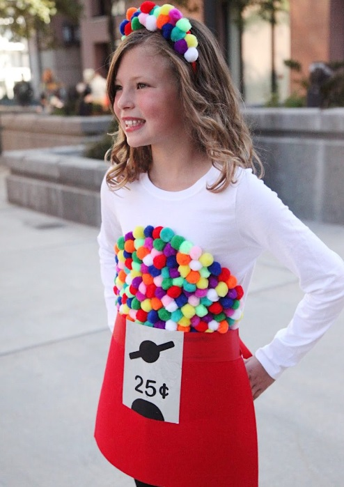

With this last-minute Halloween costume, your little candy enthusiast can transform into a gumball machine. This transformation is made possible with colorful pom-poms, a plain T-shirt, and red felt.

Get the tutorial at [The Pretty Life Girls](https://prettylifegirls.com/2019/10/diy-gumball-machine-costume.html)

### **3\. ‘The Marvelous Mrs. Maisel’ Costume**

If you’re a fan of the popular show The Marvelous Mrs. Maisel, then this costume is perfect for you! All you need is to take on Midge’s look with a chic ’60s outfit that includes a chic pillbox hat and pink coat. It’s an ideal choice if you don’t know what to wear at the last second of Halloween!

Get the tutorial at [The Lovely Lo Down](https://www.thelovelylodown.com/marvelous-mrs-maisel-halloween-costume/)

### **4\. Itsy Bitsy Spider Costume**

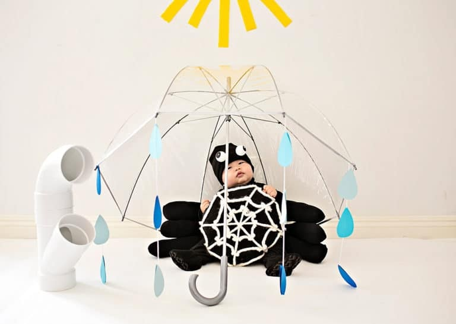

No need to fear this adorable little spider! As your baby wears this adorable costume with a little umbrella and waterspout, you may pay respect to the well-known nursery rhyme. It won’t take much time to dress up, making this outfit ideal for a last-minute Halloween costume.

Get the tutorial at [Hello Wonderful](https://www.hellowonderful.co/post/diy-itsy-bitsy-spider-baby-costume/)

### **5\. Frankenstein Costume**

Crafting this Frankenstein costume is a breeze, a great idea for a last-minute costume! You can use items from your child’s wardrobe and some tin foil and soda bottles to put together this spooky look.

Get the tutorial at [Twist Me Pretty](https://www.twistmepretty.com/diy-frankenstein-costumes/)

### **6\. Pizza Costume**

Who wouldn’t want to become a pizza slice for a last-minute Halloween costume? The best part is that this pizza outfit comes with detachable toppings, so your child can change them whenever they like.

Get the tutorial at [Oh Yay Studio](https://ohyaystudio.com/an-easy-halloween-pizza-costume-with-removable-toppings/)

### **7\. Ghost Costume**

This adorable ghost costume is crafted by hand and is super comfy for a last-minute Halloween choice. You can easily put it together using white fleece and black adhesive felt.

Get the tutorial at [Gina Michele](https://gina-michele.com/2018/10/no-sew-ghost-costume.html)

### **8\. Ice Cream Truck Costumes**

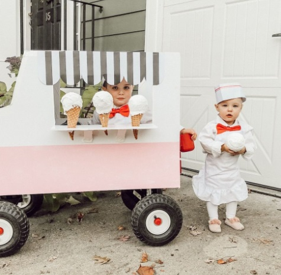

We all cheer for ice cream! Get your kids dressed up as charming ice cream vendors this Halloween. And if you happen to have some extra time, imagine how delightful a cardboard ice cream truck would be!

Get the tutorial at [Momma Society](https://www.mommasociety.com/momma-society/ice-cream-truck-halloween-costume)

### **9\. Butterfly Costume**

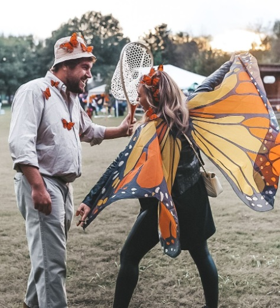

You can flutter and float in style this Halloween, all thanks to a set of butterfly wings and a crown adorned with butterflies to complete the look. You and your partner can even go as a matching pair – one as the butterfly, and the other as the butterfly catcher. What a great idea for a last-minute Halloween costume, right?

Get the tutorial at [Yes, Please](https://www.yespleasedaily.com/last-minute-halloween-costume-diy-butterfly-butterfly-catcher-cheap-easy/)

### **10\. Mummy Costumes**

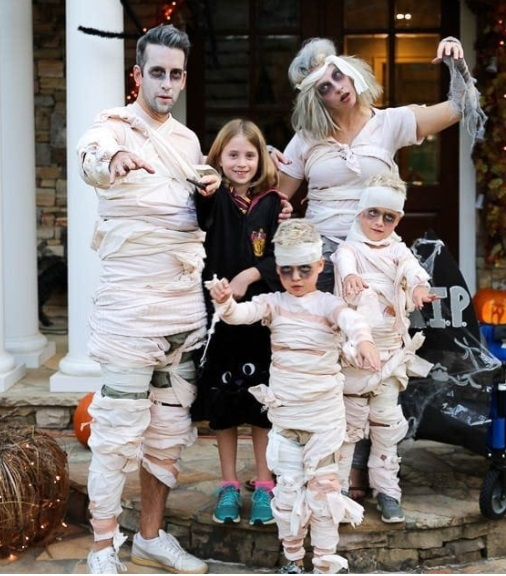

Give those old bedsheets a new lease on life by transforming them into mummy costumes. This last-minute Halloween idea will be a hit with your kids, especially because the whole family can join the fun!

Get the tutorial at [Bluegraygal](https://www.bluegraygal.com/easy-do-it-yourself-costumes/)

### **11\. ‘Alice in Wonderland’ Costume**

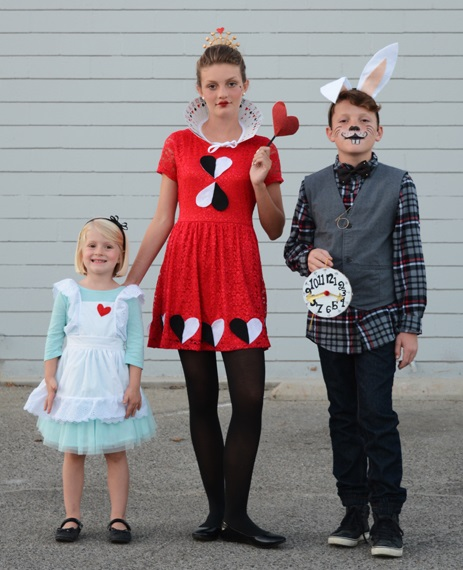

Here’s a last-minute Halloween costume that your young Alice in Wonderland enthusiast will absolutely love. Simply combine a blue shirt and tulle skirt, add a white apron (don’t forget to attach a little red heart), and you’ve got the perfect storybook look.

Get the tutorial at [Oleander + Palm](https://oleanderandpalm.com/2015/11/alice-in-wonderland-halloween-costumes-for-siblings/)

### **12\. Beehive Costume**

Buzz, buzz! The word on the street is that you’ll look fantastic in this sweet last-minute Halloween costume. It’s crafted with a Cricut Maker and adorned with bee decals.

Get the tutorial at [The House That Lars Built](http://thehousethatlarsbuilt.com/2017/10/4-easy-iron-costumes.html/)

### **13\. Scarecrow Costumes**

A scarecrow is a timeless choice for a last-minute Halloween costume, and it becomes even more charming when you have a mini scarecrow by your side.

Get the tutorial at [Lately with Alexa](https://latelywithalexa.com/halloween-2019-scarecrow-edition/)

### **14\. ‘Peter Pan’ and the Lost Boys Costumes**

Crafted with care, these delightful costumes inspired by Peter Pan are made using basic materials. They’re the perfect option if you’re unsure about your last-minute Halloween attire. Anyone can accomplish these easy techniques, like attaching faux fur ears to a hat.

Get the tutorial at [A Beautiful Mess](https://abeautifulmess.com/peter-pan-and-the-lost-boys-costume-diy/)

### **15\. ‘Wizard of Oz’ Costumes**

These wonderful family costumes from The Wizard of Oz prove that you can craft perfect outfits using your own items! From reusing the Dorothy costume from a past Halloween to those practical (and adorable!) boots, you won’t need to spend a fortune on this year’s costumes.

Get the tutorial at [Shoptini](http://shoptini.com/fashion/top-ten-last-minute-halloween-costume-ideas/)

### **16\. Cactus Costume**

We’re smitten with this cactus costume, and the best part is you only need a green dress, some white yarn, and a basic headband to put it together. Gather a bunch of friends to join in the excitement and create your own desert of cacti for a last-minute Halloween costume!

Get the tutorial at [Studio DIY](https://studiodiy.com/diy-cactus-costume//)

### **17\. Cowboy and Cowgirl Costumes**

If you’re searching for a last-minute Halloween Western-inspired costume, you’re in for a treat because this one can be assembled right from the comfort of your home. (And if you have a banjo, you earn some bonus points!)

Get the tutorial at [A Beautiful Mess](https://abeautifulmess.com/last-minute-costume-ideas-for-couples/)

### **18\. ‘Little House on the Prairie’ Costume**

If you love Laura Ingalls Wilder as much as Ree does, you will adore this quick and easy Halloween costume. Don’t have time for sewing? No worries! A kitchen apron and a store-bought bonnet will do the trick just fine.

Get the tutorial at [Scattered Thoughts of a Crafty Mom](https://www.scatteredthoughtsofacraftymom.com/little-house-on-the-prairie-costume-bonnet-tutorial/)

### **19\. Ice Cream Cone Costume**

This ice cream costume will be the perfect finishing touch for your last-minute Halloween festivities. It’s sweet, imaginative, and incredibly endearing.

Get the tutorial at [Studio DIY](https://studiodiy.com/diy-ice-cream-cone-costume//)

### **20\. Strawberry Costume**

Chances are, if you’re reading this, you’re running low on time. Fortunately, this blogger has your back with a template you can use to create this Halloween costume in just a few minutes.

Get the tutorial at [Studio DIY](https://studiodiy.com/diy-strawberry-costume//)

### **21\. Cat Burglar Costume**

There’s no need to do anything illegal to become a genuine “cat burglar” this Halloween. Simply combine a DIY money bag with a few black accessories, and you’re ready to go.

Get the tutorial at [Keiko Lynn](https://keikolynn.com/2015/10/spirit-halloween-costume-ideas.html)

### **22\. Cool Cucumber Costume**

You’ll feel as calm as possible when you wear this last-minute Halloween attire. Transform the saying into reality by attaching felt “squiggles” to an all-green ensemble—then throw on a backward cap and some sunglasses.

Get the tutorial at [Handmade Charlotte](https://www.handmadecharlotte.com/diy-cool-cucumber-halloween-costume/)

### **23\. Jack O’Lantern Costume**

It’s the ultimate Halloween costume for a reason: It’s incredibly simple to put together and perfectly aligned with the theme. Whether you have a baby bump to show off, you’ll enjoy sporting bright orange all night.

Get the tutorial at [Aww Sam](http://www.awwsam.com/2020/10/jack-o-lantern-costume.html)

### **24\. [Snow White Halloween Costume](https://www.etsy.com/listing/1517572360/snow-white-adult-costume-dress-halloween)**

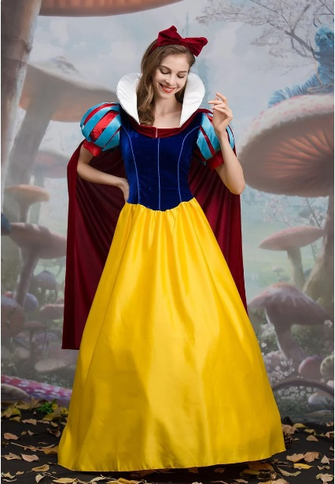

Your fellow partygoers will be captivated when you make an entrance in this last-minute Halloween DIY outfit. Red lipstick is essential; be sure to pick up an apple as you head out the door!

### **25\. Sabrina’s Halloween Costume**

What’s Halloween without a Sabrina, the Teenage Witch marathon? Get the last-minute Halloween vibe by wearing a red dress, a blonde wig, and a preppy black headband to mimic this iconic look.

Read more at [Noelle Downing](https://www.instagram.com/p/B4Fx389pKcZ/)

### **26\. Burrito Costume**

Burrito enthusiasts, get ready to make your friends laugh! You can easily recreate this last-minute Halloween costume with a tan top, a silver skirt, and a homemade felted “lettuce” accessory.

Get the tutorial at [Aww Sam](http://www.awwsam.com/2017/10/diy-burrito-halloween-costume.html)

### **27\. ‘Troop Beverly Hills’ Halloween Costume**

Round up a fellow procrastinator and recreate this enjoyable ’90s-inspired appearance! Chances are, you have some vintage Girl Scout clothing stashed away somewhere that is perfect for your last-minute Halloween costume option.

Read more at [Living After Midnite](https://livingaftermidnite.com/10-last-minute-halloween-costumes-you-can-amazon-prime/)

### **28\. Bouquet of Pencils Costume**

You probably wouldn’t have guessed that the pencils in this costume are actually pool noodles painted to look like pencils! Teachers and students will find this delightful to become an ideal Halloween costume.

Get the tutorial at [Oh Yay Studio](https://ohyaystudio.com/a-bouquet-of-newly-sharpened-pencils-costume-and-how-much-i-love-youve-got-mail/)

### **29\. ’80s Rock Band Costume**

Snatch up an inflatable guitar and get ready to rock with this effortless last-minute Halloween outfit idea. Plus, it’s a great way to bring the whole family together—a win-win!

Get the tutorial at [Design Improvised](https://designimprovised.com/2017/10/family-halloween-costume-idea-80s-rock.html)

### **30\. ‘Where’s Waldo?’ Costume**

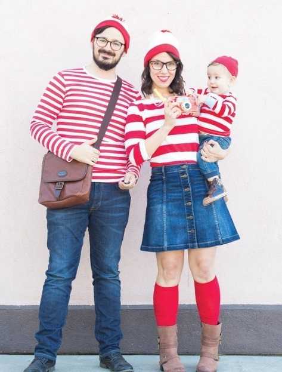

Give your fellow partygoers a hearty chuckle with this family-friendly Where’s Waldo? Costume for the eleventh hour of Halloween. It’s a breeze to put together using items you already have in your wardrobe.

Get the tutorial at [Lovely Indeed](https://lovelyindeed.com/wheres-waldo-family-halloween-costumes/)

### **31\. White Swan Costume**

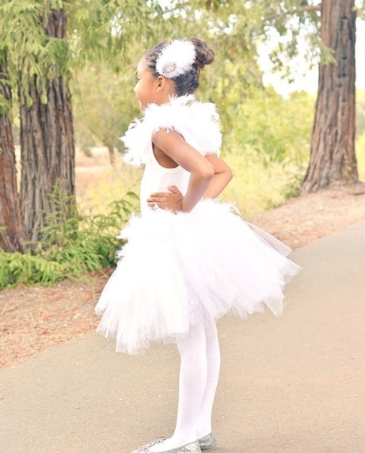

Would you believe all you need is white tulle and a feather boa to create this glamorous costume? It’s sure to earn you heaps of compliments! Don’t you agree that it’s a fantastic idea for a swift and effortless Halloween costume?

Get the tutorial at [A Pumpkin and a Princess](https://apumpkinandaprincess.com/diy-white-swan-costume/)

### **32\. Frosted Animal Cookie Costume**

Why didn’t we come up with this last-minute Halloween costume idea sooner? The lively colors of a classic frosted animal cookie create the ideal, cheerful Halloween outfit.

Get the tutorial at [Studio DIY](https://studiodiy.com/2016/09/29/diy-frosted-animal-cookie-costume/)

### **33\. Wednesday Addams Costume**

Wednesday Addams is essentially the quintessential Halloween icon, and it’s incredibly simple to mimic her iconic appearance, making it the perfect last-minute costume. Just gather a black dress, stockings, shoes, and some white felt for the collar. You won’t even need a wig if you already have dark hair!

Get the tutorial at [Dream a Little Bigger](https://www.dreamalittlebigger.com/post/wednesday-and-pugsley-addams-family-halloween-costumes.html)

### **34\. Skeleton Costume**

Here’s another fantastic last-minute Halloween costume idea: turn any old black clothing into a spine-chilling skeleton costume! This blogger used her Cricut machine and iron-on vinyl to craft this deadly look.

Get the tutorial at [Polkadot Chair](https://www.polkadotchair.com/diy-skeleton-halloween-costumes-free-cricut-svg-files/)

### **35\. Pumpkin Cape Costume**

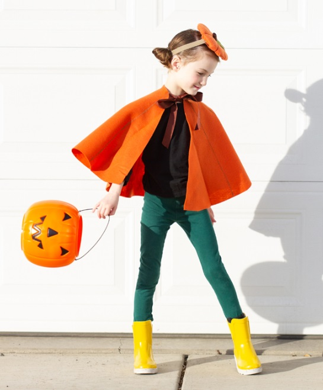

It’s true – you can whip up this pumpkin costume at home in less than ten minutes! While this blogger created it for her daughter, you can easily adjust the size to fit adults.

Get the tutorial at [Delia Creates](https://www.deliacreates.com/five-minute-felt-costume-cape-tutorial-no-sew/)

### **36\. RBG Costume**

If you want to honor remarkable women in U.S. history, the late Ruth Bader Ginsburg is an excellent choice! This last-minute Halloween costume is quite straightforward and suitable for work-related events.

Get the tutorial at [The House That Lars Built](https://thehousethatlarsbuilt.com/2018/09/influential-women-halloween-costumes.html/)

### **37\. Peter Pan Family Costume**

Every element of this last-minute Halloween costume can be easily assembled in one afternoon. You can opt to do it as a family group costume or select individual adult costumes as desired.

Get the tutorial at [Lovely Indeed](https://lovelyindeed.com/family-peter-pan-costume-halloween/)

### **38\. Mime Costume**

Mimes are a timeless choice for last-minute Halloween costumes, and for good reason – they are incredibly simple to assemble! What’s more, you can keep wearing the clothes and bandana even after the holiday.

Get the tutorial at [Dream a Little Bigger](https://www.dreamalittlebigger.com/post/easy-diy-mime-costume.html)

### **39\. Safari Costume**

Get ready to have a blast with these fantastic last-minute Halloween costume ideas! If you have a furry feline friend, this one’s even more exciting. All you’ll require are some everyday khaki clothes you can find in your wardrobe.

Get the tutorial at [Camille Styles](https://camillestyles.com/design/safari-couples-costume/)

### **40\. Witch Costume**

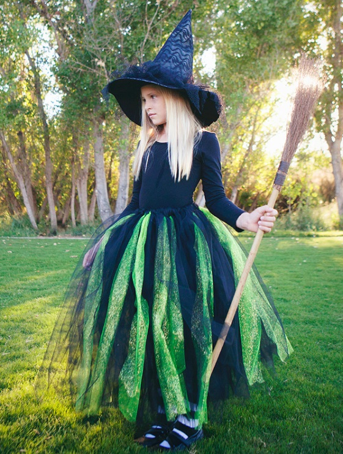

This one truly captivated us right away! Just slip into some black attire as your starting point, and craft a tulle skirt in lively Halloween colors – you can even buy or create your very own witch hat. And voila, you’ve conjured up some magic!

Get the tutorial at [Simple as That](https://simpleasthatblog.com/diy-glinda-and-wicked-witch-of-the-west-halloween-costumes/)

### **41\. Cruella de Vil Costume**

If you’re leaning more towards a Disney villain vibe than a Disney princess one, you’ll adore becoming Cruella de Vil. The fantastic part about this costume is how effortlessly you can assemble it as a last-minute Halloween option: simply buy Cruella’s iconic black and white wig and gather the rest from your closet!

Get the tutorial at [The Merrythought](https://themerrythought.com/halloween-2/diy-cruella-costume/)

### **42\. Devil and Angel Costume**

It’s a classic choice, yet incredibly adorable! Any red and white attire will work perfectly for this last-minute Halloween costume suggestion. For extra festive fun, you can spice it up with accessories such as wings, a halo, horns, and a pitchfork.

Get the tutorial at [City Threads](https://www.citythreads.com/blogs/news/angel-devil-diy-halloween-costume)

### **43\. Knight in Shining Armor Costume**

This DIY costume is your last-minute Halloween day savior! Everything can be effortlessly created right at home except for the chainmail shirt. Paint a dragon on any old shirt, and fashion your sword and shield (we recommend using cardboard). What a blast!

Get the tutorial at [DoodleCraft](https://www.doodlecraftblog.com/2017/09/diy-knight-in-shining-armor-halloween.html)

### **44\. Mother Earth DIY Halloween Costume**

Be the star of the Halloween party with this last-minute Halloween costume! Whether you’re a mom or simply someone who cares for the environment, this homemade Mother Earth costume is so stunning that you’ll be tempted to wear it every year (and that’s good for the planet!).

Get the tutorial at [Lia Griffith](https://liagriffith.com/mother-earth-costume-headwreath/)

### **45\. [Queen of Hearts Halloween Costume](https://www.amazon.com/Amoretu-Sleeve-Shoulder-Dresses-Pockets/dp/B08R76NPDZ)**

To make the collar for this last-minute Alice in Wonderland-inspired costume, encircle your neck with a big sheet of paper, allowing you to cut it to the perfect size. Next, affix playing cards from a deck around the paper collar, stacking them to create a fan-like appearance.

### **46\. Bjork Swan Costume**

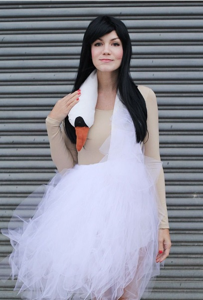

To create a striking fashion statement at your Halloween costume party, stitch together this Bjork dress that will leave a lasting impression in just a short span. While some sewing expertise and materials are required for this costume, it’s the ideal last-minute costume choice if you’ve got some sewing experience.

Get the tutorial at [A Beautiful Mess](https://abeautifulmess.com/bjork-swan-dress-costume-tutorial/)

### **47\. [Little Red Riding Hood Costume](https://www.amazon.com/Ferand-Fringed-Crochet-Knitting-Patterns/dp/B06XKRVFDM/)**

If you’re up for a showdown with the Big Bad Wolf, all it takes is draping a red hooded poncho over a red dress to transform into Little Red Riding Hood at the last minute of Halloween. And, of course, don’t leave behind your basket of goodies!

### **48\. [Women’s Wednesday Addams Dance Dress](https://www.amazon.com/Aphratti-Wednesday-Halloween-Costume-Collared/dp/B0C2Q4LX2K)**

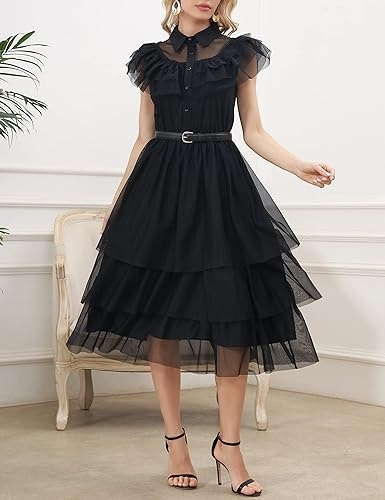

The women’s Wednesday Addams dance dress is perfect for those looking for last-minute Halloween costume ideas. Inspired by the iconic character from “The Addams Family,” this dress exudes a dark and gothic charm while incorporating a modern and feminine touch. 

### **49\. Easy TinkerBell Costume**

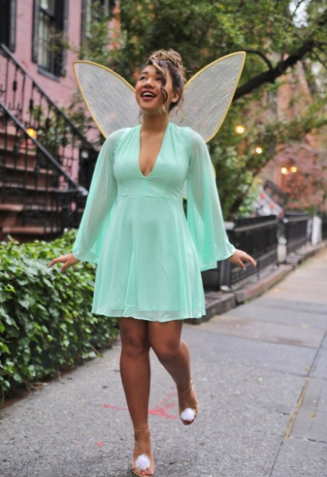

This easy Tinkerbell costume is perfect for those who are short on time or resources leading up to Halloween. Its simplicity and charm guarantee to captivate everyone with its magical allure. So don’t fret if you need a last-minute Halloween costume!

Get the tutorial at [Color Me Courtney](https://www.colormecourtney.com/disney-diy-2-easy-halloween-costumes/)

### **50\. Cereal Killer Costume**

If you have time for the glue to cure, this easy and cheap last-minute pun costume may be made. These t-shirts are the ideal option to show off your festive enthusiasm, whether going to a holiday party or spreading Halloween happiness.

Get the tutorial at [Paging Fun Mums](https://pagingfunmums.com/2017/11/02/diy-cereal-killer-halloween-costume/)

### **51\. Gingham Witch Costume**

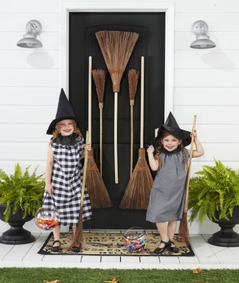

These country-chic witches are a source of amusement for us. Of course, you can easily assemble a store-bought witch costume, but your kids will be all set to work magic in no time with these simple-to-sew last-minute dresses.

See more at [Countryling](https://www.countryliving.com/diy-crafts/g28304812/diy-witch-costume/) 

### **52\. [Wind Up Doll Costume](https://www.amazon.com/Allegra-Womens-Ruffle-Contrast-Vintage/dp/B09KT4PQTJ)**

This imaginative DIY costume will earn you awards for the best last-minute Halloween costume. To complete the costume, you can buy a red gingham dress and a red bow tie. However, you’ll need cardboard and metallic spray paint to create the wind-up feature.

### **53\. Superquilter Costume**

Quilters (and knitters and crocheters), gather ’round! This enjoyable last-minute Halloween costume is here to rescue the day, or at least the “crafter-noon.” Plus, you can proudly flaunt your crafty skills at it!

Get the tutorial at [Countryliving.](https://www.countryliving.com/diy-crafts/a41601734/superquilter-yarn-girl-halloween-costumes/)

### **54\. Patriotic Popsicle Costume**

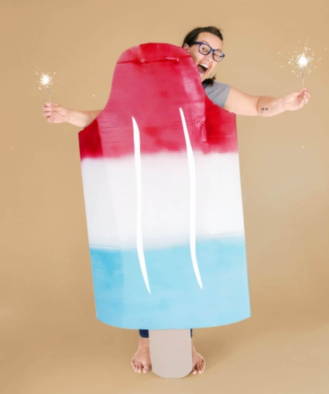

As delightful (and minimal effort) as those leisurely summer days, this last-minute Halloween costume simply demands some sizable cardboard pieces, red, white, and blue spray paint, and some white acrylic paint. You can even add sparklers for extra flair!

Get the tutorial at [Oh Yay Studio](https://ohyaystudio.com/how-to-make-an-easy-bomb-pop-popsicle-costume/)

### **55\. Hungry Hippo Baby Costume**

Did you overlook planning a last-minute Halloween costume for your littlest one? No need to fret! This Hungry Hungry Hippo-inspired ensemble can be assembled in a jiffy with nothing more than some felt and a trusty hot glue gun.

Get the tutorial at [Sugar & Cloth](https://sugarandcloth.com/our-family-diy-hungry-hippos-costume-idea/)

### **56\. ‘E.T. the Extra-Terrestrial’ Costume**

Ring home this Halloween with this uncomplicated DIY appearance. All you truly require to become Elliot is a red jacket! And for the effortless E.T., a white sheet is all you need.

Get the tutorial at [Do It Yourself Divas](https://www.doityourselfdivas.com/2017/10/diy-et-and-elliot-halloween-costume.html)

### **57\. Vampire Costume**

We believe this last-minute Halloween choice is fantastic! Grown-ups and youngsters alike can go as a timeless vampire with just a white button-up shirt, a vest, and black pants. Crafting a cape is a breeze with any black fabric, or you can purchase one!

Get the tutorial at [Heather Handmade](https://www.heatherhandmade.com/easy-diy-vampire-costume/)

### **58\. Crayon Kids Costume Idea**

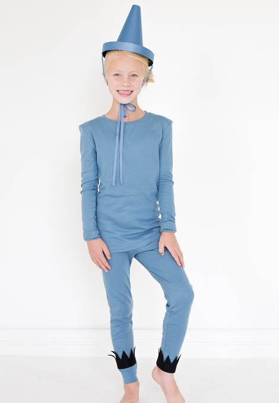

Taking inspiration from the children’s novel “The Day the Crayons Quit,” this last-minute Halloween costume is a breeze. All you need is a monochromatic pajama set and a homemade hat. This concept is ideal for families with several kids—each one can pick their favorite color from the crayon box!

Get the tutorial at [The House That Lars Built](https://thehousethatlarsbuilt.com/2015/10/the-day-the-crayons-quit-costumes.html/#more-16403)

### **59\. Pasta Halloween Costumes**

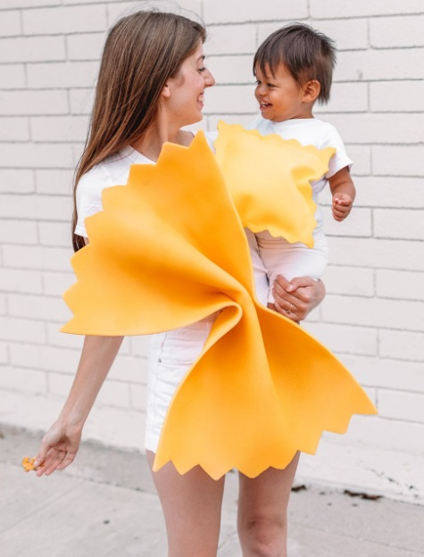

Running low on time? Fear not, as whipping up a speedy, spur-of-the-moment costume is entirely feasible. This matching carb-inspired outfit has got both you and your little one all set before you embark on your trick-or-treating adventure.

Get the tutorial at [Studio DIY](https://studiodiy.com/2018/10/10/diy-pasta-costume/)

### **60.** **[Regina George Costume](https://www.amazon.com/Rubies-Womens-Regina-George-Halloween/dp/B082NFYYF4)**

A Regina George costume is trendy and eye-catching for a last-minute Halloween party. Inspired by the iconic character from the movie “Mean Girl”, this costume allows you to channel your inner popular girl with a touch of sassiness. 

### **61\. Smokey Bear**

Even at the last minute on Halloween, you can show your support for forest fire awareness by dressing up as Smokey Bear, a United States Forest Service spokesperson. A bit of charming makeup, a shovel, and a wide-brimmed brown hat should make you instantly recognizable to kids everywhere.

Get the tutorial at [The Merrythought](https://themerrythought.com/diy/diy-smokey-bear-costume/)

## **Final thought,**

Don’t let **last-minute Halloween costume** panic get the best of you. With these creative and easy-to-make ideas, you’ll have a fantastic costume ready in no time. Embrace the Halloween spirit and have a spooktacular time!

- [60+ Last-Minute Halloween Costume Ideas You Can DIY in Minutes](https://avada.io/loveable/blog/last-minute-halloween-costume-ideas/#wp-block-heading-2-2)
    - [1\. ‘Operation’ Costume](https://avada.io/loveable/blog/last-minute-halloween-costume-ideas/#wp-block-heading-3-3)
    - [2\. Gumball Machine Costume](https://avada.io/loveable/blog/last-minute-halloween-costume-ideas/#wp-block-heading-3-7)
    - [3\. ‘The Marvelous Mrs. Maisel’ Costume](https://avada.io/loveable/blog/last-minute-halloween-costume-ideas/#wp-block-heading-3-11)
    - [4\. Itsy Bitsy Spider Costume](https://avada.io/loveable/blog/last-minute-halloween-costume-ideas/#wp-block-heading-3-15)
    - [5\. Frankenstein Costume](https://avada.io/loveable/blog/last-minute-halloween-costume-ideas/#wp-block-heading-3-19)
    - [6\. Pizza Costume](https://avada.io/loveable/blog/last-minute-halloween-costume-ideas/#wp-block-heading-3-23)
    - [7\. Ghost Costume](https://avada.io/loveable/blog/last-minute-halloween-costume-ideas/#wp-block-heading-3-27)
    - [8\. Ice Cream Truck Costumes](https://avada.io/loveable/blog/last-minute-halloween-costume-ideas/#wp-block-heading-3-31)
    - [9\. Butterfly Costume](https://avada.io/loveable/blog/last-minute-halloween-costume-ideas/#wp-block-heading-3-35)
    - [10\. Mummy Costumes](https://avada.io/loveable/blog/last-minute-halloween-costume-ideas/#wp-block-heading-3-39)
    - [11\. ‘Alice in Wonderland’ Costume](https://avada.io/loveable/blog/last-minute-halloween-costume-ideas/#wp-block-heading-3-43)
    - [12\. Beehive Costume](https://avada.io/loveable/blog/last-minute-halloween-costume-ideas/#wp-block-heading-3-47)
    - [13\. Scarecrow Costumes](https://avada.io/loveable/blog/last-minute-halloween-costume-ideas/#wp-block-heading-3-51)
    - [14\. ‘Peter Pan’ and the Lost Boys Costumes](https://avada.io/loveable/blog/last-minute-halloween-costume-ideas/#wp-block-heading-3-55)
    - [15\. ‘Wizard of Oz’ Costumes](https://avada.io/loveable/blog/last-minute-halloween-costume-ideas/#wp-block-heading-3-59)
    - [16\. Cactus Costume](https://avada.io/loveable/blog/last-minute-halloween-costume-ideas/#wp-block-heading-3-63)
    - [17\. Cowboy and Cowgirl Costumes](https://avada.io/loveable/blog/last-minute-halloween-costume-ideas/#wp-block-heading-3-67)
    - [18\. ‘Little House on the Prairie’ Costume](https://avada.io/loveable/blog/last-minute-halloween-costume-ideas/#wp-block-heading-3-71)
    - [19\. Ice Cream Cone Costume](https://avada.io/loveable/blog/last-minute-halloween-costume-ideas/#wp-block-heading-3-75)
    - [20\. Strawberry Costume](https://avada.io/loveable/blog/last-minute-halloween-costume-ideas/#wp-block-heading-3-79)
    - [21\. Cat Burglar Costume](https://avada.io/loveable/blog/last-minute-halloween-costume-ideas/#wp-block-heading-3-83)
    - [22\. Cool Cucumber Costume](https://avada.io/loveable/blog/last-minute-halloween-costume-ideas/#wp-block-heading-3-87)
    - [23\. Jack O’Lantern Costume](https://avada.io/loveable/blog/last-minute-halloween-costume-ideas/#wp-block-heading-3-91)
    - [24\. Snow White Halloween Costume](https://avada.io/loveable/blog/last-minute-halloween-costume-ideas/#wp-block-heading-3-95)
    - [25\. Sabrina’s Halloween Costume](https://avada.io/loveable/blog/last-minute-halloween-costume-ideas/#wp-block-heading-3-98)
    - [26\. Burrito Costume](https://avada.io/loveable/blog/last-minute-halloween-costume-ideas/#wp-block-heading-3-102)
    - [27\. ‘Troop Beverly Hills’ Halloween Costume](https://avada.io/loveable/blog/last-minute-halloween-costume-ideas/#wp-block-heading-3-106)
    - [28\. Bouquet of Pencils Costume](https://avada.io/loveable/blog/last-minute-halloween-costume-ideas/#wp-block-heading-3-110)
    - [29\. ’80s Rock Band Costume](https://avada.io/loveable/blog/last-minute-halloween-costume-ideas/#wp-block-heading-3-114)
    - [30\. ‘Where’s Waldo?’ Costume](https://avada.io/loveable/blog/last-minute-halloween-costume-ideas/#wp-block-heading-3-118)
    - [31\. White Swan Costume](https://avada.io/loveable/blog/last-minute-halloween-costume-ideas/#wp-block-heading-3-122)
    - [32\. Frosted Animal Cookie Costume](https://avada.io/loveable/blog/last-minute-halloween-costume-ideas/#wp-block-heading-3-126)
    - [33\. Wednesday Addams Costume](https://avada.io/loveable/blog/last-minute-halloween-costume-ideas/#wp-block-heading-3-130)
    - [34\. Skeleton Costume](https://avada.io/loveable/blog/last-minute-halloween-costume-ideas/#wp-block-heading-3-134)
    - [35\. Pumpkin Cape Costume](https://avada.io/loveable/blog/last-minute-halloween-costume-ideas/#wp-block-heading-3-138)
    - [36\. RBG Costume](https://avada.io/loveable/blog/last-minute-halloween-costume-ideas/#wp-block-heading-3-142)
    - [37\. Peter Pan Family Costume](https://avada.io/loveable/blog/last-minute-halloween-costume-ideas/#wp-block-heading-3-146)
    - [38\. Mime Costume](https://avada.io/loveable/blog/last-minute-halloween-costume-ideas/#wp-block-heading-3-150)
    - [39\. Safari Costume](https://avada.io/loveable/blog/last-minute-halloween-costume-ideas/#wp-block-heading-3-154)
    - [40\. Witch Costume](https://avada.io/loveable/blog/last-minute-halloween-costume-ideas/#wp-block-heading-3-158)
    - [41\. Cruella de Vil Costume](https://avada.io/loveable/blog/last-minute-halloween-costume-ideas/#wp-block-heading-3-162)
    - [42\. Devil and Angel Costume](https://avada.io/loveable/blog/last-minute-halloween-costume-ideas/#wp-block-heading-3-166)
    - [43\. Knight in Shining Armor Costume](https://avada.io/loveable/blog/last-minute-halloween-costume-ideas/#wp-block-heading-3-170)
    - [44\. Mother Earth DIY Halloween Costume](https://avada.io/loveable/blog/last-minute-halloween-costume-ideas/#wp-block-heading-3-174)
    - [45\. Queen of Hearts Halloween Costume](https://avada.io/loveable/blog/last-minute-halloween-costume-ideas/#wp-block-heading-3-178)
    - [46\. Bjork Swan Costume](https://avada.io/loveable/blog/last-minute-halloween-costume-ideas/#wp-block-heading-3-181)
    - [47\. Little Red Riding Hood Costume](https://avada.io/loveable/blog/last-minute-halloween-costume-ideas/#wp-block-heading-3-185)
    - [48\. Women’s Wednesday Addams Dance Dress](https://avada.io/loveable/blog/last-minute-halloween-costume-ideas/#wp-block-heading-3-188)
    - [49\. Easy TinkerBell Costume](https://avada.io/loveable/blog/last-minute-halloween-costume-ideas/#wp-block-heading-3-191)
    - [50\. Cereal Killer Costume](https://avada.io/loveable/blog/last-minute-halloween-costume-ideas/#wp-block-heading-3-195)
    - [51\. Gingham Witch Costume](https://avada.io/loveable/blog/last-minute-halloween-costume-ideas/#wp-block-heading-3-199)
    - [52\. Wind Up Doll Costume](https://avada.io/loveable/blog/last-minute-halloween-costume-ideas/#wp-block-heading-3-203)
    - [53\. Superquilter Costume](https://avada.io/loveable/blog/last-minute-halloween-costume-ideas/#wp-block-heading-3-206)
    - [54\. Patriotic Popsicle Costume](https://avada.io/loveable/blog/last-minute-halloween-costume-ideas/#wp-block-heading-3-210)
    - [55\. Hungry Hippo Baby Costume](https://avada.io/loveable/blog/last-minute-halloween-costume-ideas/#wp-block-heading-3-214)
    - [56\. ‘E.T. the Extra-Terrestrial’ Costume](https://avada.io/loveable/blog/last-minute-halloween-costume-ideas/#wp-block-heading-3-218)
    - [57\. Vampire Costume](https://avada.io/loveable/blog/last-minute-halloween-costume-ideas/#wp-block-heading-3-222)
    - [58\. Crayon Kids Costume Idea](https://avada.io/loveable/blog/last-minute-halloween-costume-ideas/#wp-block-heading-3-226)
    - [59\. Pasta Halloween Costumes](https://avada.io/loveable/blog/last-minute-halloween-costume-ideas/#wp-block-heading-3-230)
    - [60\. Regina George Costume](https://avada.io/loveable/blog/last-minute-halloween-costume-ideas/#wp-block-heading-3-234)
    - [61\. Smokey Bear](https://avada.io/loveable/blog/last-minute-halloween-costume-ideas/#wp-block-heading-3-237)
- [Final thought,](https://avada.io/loveable/blog/last-minute-halloween-costume-ideas/#wp-block-heading-2-241)

### [Blake Simpson](https://avada.io/loveable/author/blake/)

Hi, I'm Blake from Loveable. I help people find perfect gifts for occasions like anniversaries and weddings. I also write a blog about holidays, sharing insights to make them more meaningful. Let's create unforgettable moments together!

- [Twitter](https://twitter.com/intent/tweet)
- [Facebook](https://www.facebook.com/sharer/sharer.php)
- [instagram](https://avada.io/loveable/blog/last-minute-halloween-costume-ideas/)
- [pinterest](https://www.pinterest.com/loveablellc/)

## Related Posts

[### 120+ Christian Birthday Wishes To Spread Your Love](https://avada.io/loveable/blog/christian-birthday-wishes/) 

[

### 35 Best 70th Birthday Ideas To Celebrate The Special Milestone

](https://avada.io/loveable/blog/70th-birthday-ideas/)

[

### 50 Best 30th Birthday Decorations for a Remarkable Birthday Bash

](https://avada.io/loveable/blog/30th-birthday-decorations/)

[

### 40 Delicious Vegan Christmas Desserts to Delight Your Palate

](https://avada.io/loveable/blog/vegan-christmas-desserts/)

[

### 60 Christmas Team Building Activities to Boost Workplace Spirit

](https://avada.io/loveable/blog/christmas-team-building-activities/)
