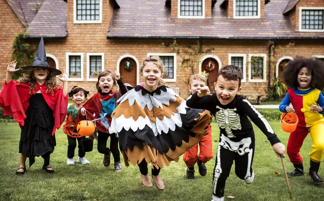

This article has been written and researched by our expert Loveable through a precise methodology. [Learn more about our methodology](https://avada.io/loveable/our-methodological.html)

[Loveable](https://avada.io/loveable/) > [Blog](https://avada.io/loveable/blog/) > [Holiday](https://avada.io/loveable/holiday/)

# 60 Spooktacular Halloween Activities for Kids: Fun, Creativity, and Safety

Written by [Blake Simpson](https://avada.io/loveable/author/blake/) Last Updated on September 07, 2023

- [20 Fun Halloween Activities for Kids For a Memorable Holiday](https://avada.io/loveable/blog/halloween-activities-kids/#wp-block-heading-2-4)
    - [1\. Mummy Bowling](https://avada.io/loveable/blog/halloween-activities-kids/#wp-block-heading-3-5)
    - [2\. Witch’s Hat Toss](https://avada.io/loveable/blog/halloween-activities-kids/#wp-block-heading-3-8)
    - [3\. Pumpkin Seed Art](https://avada.io/loveable/blog/halloween-activities-kids/#wp-block-heading-3-11)
    - [4\. Make Pom Pom Spiders](https://avada.io/loveable/blog/halloween-activities-kids/#wp-block-heading-3-14)
    - [5\. Ghostly Hide and Seek](https://avada.io/loveable/blog/halloween-activities-kids/#wp-block-heading-3-17)
    - [6\. Halloween Bingo Dab](https://avada.io/loveable/blog/halloween-activities-kids/#wp-block-heading-3-20)
    - [7\. Spider Web Hopscotch](https://avada.io/loveable/blog/halloween-activities-kids/#wp-block-heading-3-23)
    - [8\. Monster Mash Freeze Dance](https://avada.io/loveable/blog/halloween-activities-kids/#wp-block-heading-3-26)
    - [9\. Creepy Crawly Limbo](https://avada.io/loveable/blog/halloween-activities-kids/#wp-block-heading-3-29)
    - [10\. Pumpkin Ring Toss](https://avada.io/loveable/blog/halloween-activities-kids/#wp-block-heading-3-32)
    - [11\. Candy Corn Guessing Games](https://avada.io/loveable/blog/halloween-activities-kids/#wp-block-heading-3-35)
    - [12\. Witches vs. Wizards Tag](https://avada.io/loveable/blog/halloween-activities-kids/#wp-block-heading-3-38)
    - [13\. Pumpkin Patch Hop](https://avada.io/loveable/blog/halloween-activities-kids/#wp-block-heading-3-41)
    - [14\. Halloween Story Chain](https://avada.io/loveable/blog/halloween-activities-kids/#wp-block-heading-3-44)
    - [15\. Costume Dress-Up Relay](https://avada.io/loveable/blog/halloween-activities-kids/#wp-block-heading-3-47)
    - [16\. Halloween Puzzles](https://avada.io/loveable/blog/halloween-activities-kids/#wp-block-heading-3-50)
    - [17\. Halloween Origami](https://avada.io/loveable/blog/halloween-activities-kids/#wp-block-heading-3-53)
    - [18\. Monster Dice Roll Craft](https://avada.io/loveable/blog/halloween-activities-kids/#wp-block-heading-3-56)
    - [19\. Pumpkin Decorating Relay](https://avada.io/loveable/blog/halloween-activities-kids/#wp-block-heading-3-59)
    - [20\. Halloween Scavenger Hunt](https://avada.io/loveable/blog/halloween-activities-kids/#wp-block-heading-3-62)
- [20 Best Halloween Party Activities for Kids](https://avada.io/loveable/blog/halloween-activities-kids/#wp-block-heading-2-65) 
    - [1\. Pumpkin Decorating Contest](https://avada.io/loveable/blog/halloween-activities-kids/#wp-block-heading-3-66)
    - [2\. Costume Parade](https://avada.io/loveable/blog/halloween-activities-kids/#wp-block-heading-3-69)
    - [3\. Halloween Bingo](https://avada.io/loveable/blog/halloween-activities-kids/#wp-block-heading-3-72)
    - [4\. Mummy Wrap Game](https://avada.io/loveable/blog/halloween-activities-kids/#wp-block-heading-3-75)
    - [5\. Go For A Hayride](https://avada.io/loveable/blog/halloween-activities-kids/#wp-block-heading-3-78)
    - [6\. Apple Bobbing](https://avada.io/loveable/blog/halloween-activities-kids/#wp-block-heading-3-81)
    - [7\. Visit A Pumpkin Patch](https://avada.io/loveable/blog/halloween-activities-kids/#wp-block-heading-3-84)
    - [8\. Pin the Face on Pumpkin](https://avada.io/loveable/blog/halloween-activities-kids/#wp-block-heading-3-87)
    - [9\. Halloween Craft Station](https://avada.io/loveable/blog/halloween-activities-kids/#wp-block-heading-3-90)
    - [10\. Spooky Storytime](https://avada.io/loveable/blog/halloween-activities-kids/#wp-block-heading-3-93)
    - [11\. Glow-in-the-Dark Treasure Hunt](https://avada.io/loveable/blog/halloween-activities-kids/#wp-block-heading-3-96)
    - [12\. Create A Collection Of Books on Halloween](https://avada.io/loveable/blog/halloween-activities-kids/#wp-block-heading-3-99)
    - [13\. Dress Up The Home](https://avada.io/loveable/blog/halloween-activities-kids/#wp-block-heading-3-102)
    - [14\. Mystery Box Guessing Game](https://avada.io/loveable/blog/halloween-activities-kids/#wp-block-heading-3-105)
    - [15\. Make a Halloween Events Bin](https://avada.io/loveable/blog/halloween-activities-kids/#wp-block-heading-3-108)
    - [16\. Enjoy a Halloween Festival](https://avada.io/loveable/blog/halloween-activities-kids/#wp-block-heading-3-111) 
    - [17\. Go Trick-or-treating](https://avada.io/loveable/blog/halloween-activities-kids/#wp-block-heading-3-114)
    - [18\. Face Painting](https://avada.io/loveable/blog/halloween-activities-kids/#wp-block-heading-3-117)
    - [19\. Spider Race](https://avada.io/loveable/blog/halloween-activities-kids/#wp-block-heading-3-120)
    - [20\. Cauldron Cooking](https://avada.io/loveable/blog/halloween-activities-kids/#wp-block-heading-3-123)
- [20 Creative DIY Craft Activities for Kids](https://avada.io/loveable/blog/halloween-activities-kids/#wp-block-heading-2-126) 
    - [1\. Paper Plate Jack-O’-Lanterns](https://avada.io/loveable/blog/halloween-activities-kids/#wp-block-heading-3-127)
    - [2\. Halloween Photo Booth](https://avada.io/loveable/blog/halloween-activities-kids/#wp-block-heading-3-131)
    - [3\. Spooky Spider Webs](https://avada.io/loveable/blog/halloween-activities-kids/#wp-block-heading-3-134)
    - [4\. Monster Masks](https://avada.io/loveable/blog/halloween-activities-kids/#wp-block-heading-3-137)
    - [5\. Batty Handprints](https://avada.io/loveable/blog/halloween-activities-kids/#wp-block-heading-3-140)
    - [6\. Haunted House Diorama](https://avada.io/loveable/blog/halloween-activities-kids/#wp-block-heading-3-143)
    - [7\. Cotton Ball Ghosts](https://avada.io/loveable/blog/halloween-activities-kids/#wp-block-heading-3-146)
    - [8\. A Candy Wreath](https://avada.io/loveable/blog/halloween-activities-kids/#wp-block-heading-3-149)
    - [9\. Baked Creepy Cake](https://avada.io/loveable/blog/halloween-activities-kids/#wp-block-heading-3-152)
    - [10\. Mummy Mason Jars](https://avada.io/loveable/blog/halloween-activities-kids/#wp-block-heading-3-155)
    - [11\. Candy Corn Garland](https://avada.io/loveable/blog/halloween-activities-kids/#wp-block-heading-3-158)
    - [12\. Frankenstein’s Monster Puppets](https://avada.io/loveable/blog/halloween-activities-kids/#wp-block-heading-3-161)
    - [13\. Produced Leaf Ghosts](https://avada.io/loveable/blog/halloween-activities-kids/#wp-block-heading-3-164)
    - [14\. Rustic Halloween Wreath](https://avada.io/loveable/blog/halloween-activities-kids/#wp-block-heading-3-167)
    - [15\. DIY Children’s Halloween Attire](https://avada.io/loveable/blog/halloween-activities-kids/#wp-block-heading-3-170)
    - [16\. Pumpkin Seed Necklaces](https://avada.io/loveable/blog/halloween-activities-kids/#wp-block-heading-3-173)
    - [17\. Haunted Lanterns](https://avada.io/loveable/blog/halloween-activities-kids/#wp-block-heading-3-176)
    - [18\. Glow-in-the-Dark Ghosts](https://avada.io/loveable/blog/halloween-activities-kids/#wp-block-heading-3-179)
    - [19\. Delicious Delights In Little Cauldrons](https://avada.io/loveable/blog/halloween-activities-kids/#wp-block-heading-3-182)
    - [20\. Halloween Story Stones](https://avada.io/loveable/blog/halloween-activities-kids/#wp-block-heading-3-185)
- [Bottom Line](https://avada.io/loveable/blog/halloween-activities-kids/#wp-block-heading-2-188)
    - 

The arrival of autumn brings the perfect opportunity to embrace the festive spirit of Halloween, when the leaves transform into a mesmerizing array of brilliant crimson and gold shades, and a gentle coolness starts to fill the air. It’s a season that invites us to partake in many delightful and secure activities tailored specifically for children.

With a selection of no less than 60 enchanting **Halloween activities for kids** at your disposal, you are guaranteed to kindle the flames of imagination within every child. These activities promise to entertain and create cherished and irreplaceable memories. 

Whether you find yourself orchestrating an elaborate Halloween-themed extravaganza, arranging an intimate gathering for the family, or simply aiming for a day of spine-tingling and jovial scares, these diverse activities are the key to unlocking a world of festive and wholesome enjoyment for kids.

## **20 Fun Halloween Activities for Kids For a Memorable Holiday**

### **1\. Mummy Bowling**

[Mummy Bowling](https://www.tosso.com/blogs/news/mummy-bowling-diy-halloween-game) is a fun and spooky variation of the traditional bowling game. Players take turns rolling to knock down the wrapped pins while armed with a soft ball and pins that have been wrapped up to resemble mummies. Players aspire for the ideal “Mummy Strike,” which is met with laughter and applause with each roll.

### **2\. Witch’s Hat Toss**

[Witch’s Hat Toss](https://www.amazon.co.uk/Inflatable-Witch-Halloween-Adults-Favors/dp/B07VC7PKHR) is a captivating game that blends skill and fun. In this activity, players take turns throwing rings or hoops toward a tall witch’s hat placed at a central point. The objective is to successfully loop the rings over the hat’s cone or brim to score points. With designated throwing lines and assigned scoring, players aim to achieve the highest score after a set number of tosses.

### **3\. Pumpkin Seed Art**

Put your pumpkin seeds aside to dry once you’ve removed the seeds. Once they’re prepared, you can turn these seeds into little [pieces of seed art](https://intheplayroom.co.uk/painted-pumpkin-seed-craft/) using acrylic paints, markers, or even glue. The options are boundless, ranging from complex patterns to eerie forms. Create a unique work of art that embodies the season by arranging your painted seeds on paper or canvas.

### **4\. Make Pom Pom Spiders**

With the help of soft pom poms, flexible pipe cleaners, and googly eyes, kids can create their very own charming [pom-pom spiders](https://www.firstpalette.com/craft/pompom-spider.html). Kids may make their very own little arachnids by moulding the pipe cleaners and glueing them on the pom poms.

### **5\. Ghostly Hide and Seek**

Give the age-old game of hide and seek a frightening twist. Your kids take turns hiding under hanging sheets or amid cardboard ghost cutouts, which makes the game much more exciting.

### **6\. Halloween Bingo Dab**

Kids use dabbers to check out eerie images on their bingo cards as they are called out in this humorous twist on traditional bingo. It’s an entertaining and engaging approach to include many Kids.

### **7\. Spider Web Hopscotch**

Players take turns tossing an object onto [a spider web design](https://starfishtherapies.com/2014/01/spider-web-activity/) marked on the ground, each section adorned with Halloween-themed markers like plastic spiders. Depending on where the object lands, players navigate the web’s sections by hopping on one or both feet, avoiding the marker.

### **8\. Monster Mash Freeze Dance**

Halloween-themed music can be effectively utilized to cultivate [a lively dance party](https://partygames4kids.com/monster-freeze-dance) atmosphere. As the music reverberates through the air, palpable energy envelops the surroundings, encouraging everyone to surrender to the rhythm and move their bodies with uninhibited enthusiasm.

### **9\. Creepy Crawly Limbo**

Players take turns attempting to bend backward and pass under the prop without touching it or falling. As the game progresses, [the creepy Crawly Limbo](https://www.amazon.com/Vinyl-Inflatable-Halloween-Limbo-Tall/dp/B0134QUKVU) pole is lowered, making it more challenging to clear. The player who can contort their way the lowest without touching the prop wins.

### **10\. Pumpkin Ring Toss**

Rings are thrown by each player in turn in an effort to land them on the stems of the pumpkins. Depending on how challenging the goals are, assign various points. This [Pumpkin Ring Toss](https://www.oursuttonplace.com/easy-pumpkin-ring-toss-game/) game, which can be enjoyed both indoors and outdoors, combines skill and entertainment, making it the ideal complement to Halloween celebrations.

### **11\. Candy Corn Guessing Games**

Kids can try to predict how many candy corn pieces are in a jar of candy corn. Each visitor provides an estimate, and the closest guess wins a reward or the candy jar. Alternatively, you may play a game called “[Guess the Flavor](https://www.etsy.com/listing/731716970/)” in which Kids sample several kinds of candy corn while being blindfolded and attempting to name them. 

### **12\. Witches vs. Wizards Tag**

Take part in a lively adaptation of the traditional game of tag as you set off on an enchanted adventure into a realm of magic and fun. In this comical rendition, one team adopts the role of the brave wizards, and the other team assumes that of the beguiling witches.

### **13\. Pumpkin Patch Hop**

[Pumpkin Patch Hop](https://www.pinkoatmeal.com/pumpkin-patch-hop/) is a fun and interesting seasonal activity that perfectly encapsulates the spirit of autumn and Halloween celebrations. Explore a colorful pumpkin patch that is decorated with a plethora of orange, white, and even multicolored pumpkins at this family-friendly event. 

### **14\. Halloween Story Chain**

Children take turns writing brief phrases to a developing narrative that features friendly ghosts, cunning witches, and cute creatures in this fascinating game. The Halloween story chain develops in surprising ways with each input, fusing humor and inventiveness.

### **15\. Costume Dress-Up Relay**

Teams of kids compete in an exciting [Costume Dress-Up Relay](https://www.ehow.com/list_5910979_halloween-relay-games.html) while changing into various characters utilizing a variety of costumes and props. With time running out, youngsters scramble to put on hats, capes, masks, and other accessories to transform into superheroes, princesses, pirates, and other silly characters.

### **16\. Halloween Puzzles**

These puzzles have eerie and quirky illustrations and come in several difficulty levels, making them appropriate for children and adults. The pleasant task of putting the puzzle together can be enjoyed by yourself or with friends and family.

### **17\. Halloween Origami**

Using the age-old technique of paper folding, aficionados may create beautiful Halloween-themed objects like bats, ghosts, pumpkins, and more from plain sheets of paper. Lovely origami offers a special way to decorate, make personalized decorations, or take on festive DIY projects. 

### **18\. Monster Dice Roll Craft**

Create a [Monster Dice Roll Craft](https://activity-mom.com/2021/10/draw-a-monster-dice-game/) depending on the rolled combination by rolling dice with various monster characteristics (eyes, mouths, and arms). This practice encourages creative expression and creativity.

### **19\. Pumpkin Decorating Relay**

Create a [Monster Dice Roll Craft](https://activity-mom.com/2021/10/draw-a-monster-dice-game/) depending on the rolled combination by rolling dice with various monster characteristics (eyes, mouths, and arms). This practice encourages creative expression and creativity.

### **20\. Halloween Scavenger Hunt**

Set up a [scavenger hunt](https://www.amazon.com/Scavenger-Hunt-Game-Kids-Family/dp/B07Y7NZYRY/) with clues that lead to Halloween-themed treasures or treats. This game engages children’s curiosity and problem-solving skills, guaranteeing their excitement to play.

## **20 Best Halloween Party Activities for Kids** 

### **1\. Pumpkin Decorating Contest**

[Pumpkin Decorating Contest](https://egcsd.org/2019/10/25/bell-top-classes-compete-in-pumpkin-decorating-contest/) is given to kids as blank canvases, along with a variety of art tools, including paint, markers, stickers, and googly eyes. By painting their pumpkins with eerie, absurd, or creative designs, they let their creative side run wild. After everyone has done creating their creations, kids or judges, cast their votes for the pumpkin they believe is the most captivating.

### **2\. Costume Parade**

[Costume Parade](https://listenlearnmusic.com/costumes-on-parade-halloween-song-with-lyrics-video/) – a gathering of excited people, both young and elderly, gathered together, dressed in their most creative costumes. Set up a predetermined route, whether it’s indoors or outside, and direct the Kids to walk, dance, or perform along the route. Encourage people to dress up in their best Halloween attire and celebrate the holiday. 

### **3\. Halloween Bingo**

Play a thrilling game of [bingo with Halloween-themed card](https://www.amazon.com/WERNNSAI-Halloween-Bingo-Classroom-Activities/dp/B0B9G7QYY4/)s. From bats to broomsticks, the anticipation of shouting “bingo” adds to the excitement.

### **4\. Mummy Wrap Game**

Using toilet paper rolls, teams fight to turn one of their own into a mummy. As youngsters experiment in this [Mummy Wrap Game](https://kidsactivitiesblog.com/19941/halloween-game/) with different wrapping methods, laughter is certain to ensue.

### **5\. Go For A Hayride**

The world slows down as you lie down on the fragrant bed of hay, and the cool fall air caresses your cheeks. While the rural picture develops all around you, the calming tune of hoofbeats plays in the background. 

### **6\. Apple Bobbing**

A classic Halloween activity, children attempt to catch floating apples using only their mouths. It’s a hilarious and entertaining challenge but will bring a lot of funny moments together.

### **7\. Visit A Pumpkin Patch**

Visit a pumpkin patch to begin a fun Halloween experience. Explore rows of ripe, orange pumpkins tucked away in the earthy countryside as you take in the vivid autumnal colors. As you choose the ideal pumpkin, feel its cold, rough surface beneath your hands and consider the imaginative ideas it may provide. 

### **8\. Pin the Face on Pumpkin**

[Pin the Face on Pumpkin](https://www.amazon.com/JOYIN-Assorted-Decorating-Stickers-Halloween/dp/B07GSH3YMK/) is a funny activity for kids. A charming pumpkin takes center stage, missing its friendly features. Kids, blindfolded in turns, embark on a giggly adventure to place paper eyes, noses, and mouths on the pumpkin while gently spun around. Laughter fills the room as they aim to get the features just right.

### **9\. Halloween Craft Station**

Set up a crafting area with a variety of supplies so that children may make their own creepy or adorable creations. The options are boundless, from foam bat puppets to paper plate ghosts.

### **10\. Spooky Storytime**

Children might tell their own tales or popular classics, enveloping listeners in the spooky mood of the time of year. This game is ideal for encouraging a sense of anticipation, creativity, and teamwork.

### **11\. Glow-in-the-Dark Treasure Hunt**

Set the stage by hiding glow-in-the-dark objects or treasures throughout a designated area, indoors or outdoors. As children follow the glowing trail, their senses of curiosity and exploration are ignited, transforming the hunt into an unforgettable experience. 

### **12\. Create A Collection Of Books on Halloween**

Each book’s title serves as a key to a universe filled with terrifying legends, intriguing stories, and fascinating folklore. This carefully picked selection perfectly captures the season’s spirit with everything from uplifting tales of magical animals and curious witches to spine-tingling ghost stories.

### **13\. Dress Up The Home**

As you decorate your home with cobwebs, cauldrons, and other whimsy items that reflect the wonder of Halloween, embrace the spirit of the occasion. By decorating your house, you invite everyone—young and old—to participate in the magic and turn each minute spent there into a joyous occasion.

### **14\. Mystery Box Guessing Game**

Immerse yourself in the Mystery Box Guessing Game, where children embrace the thrill of uncertainty. Before them lie intriguing boxes, each holding a hidden surprise. With curiosity and excitement, they unlock the mysteries within, turning guessing into an exciting adventure of endless possibilities

### **15\. Make a Halloween Events Bin**

A carefully chosen Halloween Events Bin will help your kids create the best Halloween ever. This thoughtfully curated collection of festive treats and scary pleasures is your one-stop shop for all things spooktacular.

### **16\. Enjoy a Halloween Festival** 

Enjoy enthralling performances, indulge in mouthwatering seasonal fare, and bask in the company of festival-goers who share your passion for all things eerie and lively. A Halloween festival promises a fantastic experience that reflects the spirit of this enchanting time of year, from exhilarating thrills to fascinating sights and sounds.

### **17\. Go Trick-or-treating**

You go through the neighborhood with a bucket, dressed in costumes that turn you into fantasy characters, prepared to gather a treasure trove of delectable gifts. As the door creaks open with each doorbell ring, suspense builds, and you are met with candy-filled jars and happy smiles. 

### **18\. Face Painting**

Little faces are transformed into figures right out of children’s Halloween fantasies by skilled painters using paints that are suitable for children and sensitive skin. The choices are as unlimited as a child’s imagination, from sweet pumpkins and amiable ghosts to fearsome superheroes and funny creatures.

### **19\. Spider Race**

Each paper spider that children create is original and inventive. The spiders are positioned at the starting line of a [spider race](https://partygames4kids.com/spider-race-game) track that has been built up with lanes and a finish line. Children pump air through straws to move their spiders ahead as they race to the finish line.

### **20\. Cauldron Cooking**

Enter the ethereal world of [Cauldron Cooking](https://www.phillymag.com/things-to-do/2022/10/12/the-cauldron-potion-making/), where Halloween treats and culinary magic meet! In this interactive culinary experience, aspiring witches and wizards are invited to create a variety of spellbinding delicacies that are all motivated by the mystery of cauldron-stirring customs. 

## **20 Creative DIY Craft Activities for Kids** 

### **1\. Paper Plate Jack-O’-Lanterns**

Paper Plate Jack-O’-Lanterns are a great way to encourage your child’s creativity. Kids may create their own eerie or humorous [pumpkin](https://avada.io/loveable/halloween-pumpkin/) faces using basic supplies like paper plates, paint, and markers, giving your Halloween décor a festive touch.

### **2\. Halloween Photo Booth**

Use masks, hats, and frightening backdrops to create a themed photo booth. Allow visitors to dress up for fun and memorable photographs.

### **3\. Spooky Spider Webs**

Let kids weave their own Spooky Spider Webs with yarn and cardboard. This craft not only develops fine motor skills but also adds a touch of eerie elegance to any Halloween setting.

### **4\. Monster Masks**

Use Monster Masks to promote imaginative play! Children may create their own monstrous disguises using a range of craft materials, developing creativity as they turn into entertaining animals.

### **5\. Batty Handprints**

Halloween’s spirit may be captured with [Batty Handprints](https://www.madebyteachers.com/products/batty-for-daddy-bat-happy-halloween-handprint-october-printable/)! Paint and a little bit of creativity may transform little hands into adorable bats, creating a treasured souvenir.

### **6\. Haunted House Diorama**

Transform the [Haunted House Diorama craft](https://www.amazon.com/Rolife-Adults-Miniature-Diorama-Indoor/dp/B0B3DN4DPL/) into an engaging narrative endeavor. Young artists painstakingly piece together scenarios that vividly bring their menacing themes to life by transforming flat surfaces into an alluring three-dimensional reality.

### **7\. Cotton Ball Ghosts**

Cotton Ball Ghosts are a craft that combines creativity and physical involvement; embrace their gentle, whimsy character. Children embark on a journey that blends creative expression with sensory inquiry by creating these ethereal apparitions out of nothing more than cotton balls and googly eyes. 

### **8\. A Candy Wreath**

Create a lovely and mouthwatering [candy wreath](https://thoughtfulgiftclub.com/how-to-make-a-diy-candy-wreath-step-by-step/) to bring some sweetness into your environment. A holiday masterpiece emerges before your eyes as you meticulously arrange a bright assortment of candy into a circular arrangement.

### **9\. Baked Creepy Cake**

You’ll create a wonderful [Halloween treat](https://avada.io/loveable/halloween-treats/) that blurs the boundary between delectable and spooky as you mix, pour, and bake. The decorations on the cake are chilling, from marbled swirls that resemble foggy landscapes to spooky eyes that appear to watch your every step.

### **10\. Mummy Mason Jars**

Simple mason jars may be transformed into charming mummy figurines by adding a little gauze and using your creativity. These beautiful inventions may be used as unique candle holders, imaginative storage options, or just as adorable decorations that add a sense of scary whimsy to any room. 

### **11\. Candy Corn Garland**

The arrangement of paper triangles in the iconic candy corn hues becomes more than just a [Candy Corn Garland](https://www.bhg.com/halloween/crafts/easy-to-make-candy-corn-halloween-garland/). It’s a journey into design principles and aesthetic sensibilities.

### **12\. Frankenstein’s Monster Puppets**

With [Frankenstein’s Monster Puppets](https://thinkeryaustin.org/blog/make-halloween-paper-bag-puppet/), foster your imagination via puppetry. Young artists give life to their own tiny monstrosities using the chemistry of craft sticks, felt, and markers.

### **13\. Produced Leaf Ghosts**

You turn fallen leaves into attractive spectres that dance in the breeze using their brilliant hues. Each [leaf ghost](https://woodlarkblog.com/diy-leaf-ghosts-and-bats/) can be transformed into a blank canvas for your imagination with a few easy steps, complete with googly eyes and a spooky grin.

### **14\. Rustic Halloween Wreath**

Kids go beyond just decorating their houses by mixing a variety of eerie accents to actively contribute to developing a festive atmosphere. This [Halloween Wreath](https://www.architectureartdesigns.com/17-spooky-handmade-halloween-wreath-designs-the-kids-are-going-to-adore/) is more than just putting things together; it’s an investigation into composition, color harmony, and design principles that results in a beautiful decoration.

### **15\. DIY Children’s Halloween Attire**

By making your own children’s Halloween costumes, you may unleash creative magic. You create spectacular outfits out of everyday items with a splash of creativity and DIY flair. Every costume, from fanciful fairies to valiant superheroes, becomes a blank canvas for your personal expression.

### **16\. Pumpkin Seed Necklaces**

Create [necklaces out of pumpkin](https://makezine.com/article/craft/how-to_pumpkin_seed_necklace/) seeds to combine the worlds of craft with nature’s beauty. Each necklace made by stringing together painted pumpkin seeds becomes a special illustration of creativity and a celebration of the season’s wealth.

### **17\. Haunted Lanterns**

With the Haunted Lanterns craft, you may transform lanterns from simple light sources into magic objects. Children turn common glass jars into interesting objects that emit a spooky light using paint, embellishments, and a little imagination.

### **18\. Glow-in-the-Dark Ghosts**

[Glow-in-the-Dark Ghosts](http://www.handmadebykelly.com/halloween-glow-in-the-dark-ghost-decorations/) will elevate your handicraft to the next level by adding the element of light. Young artists turn static decorations into captivating shows by using fabric paint that comes to life in the dark.

### **19\. Delicious Delights In Little Cauldrons**

[Create mouthwatering treats in tiny cauldrons](https://www.thepurplepumpkinblog.co.uk/magical-hocus-pocus-cauldron-pudding-cups-for-halloween-movie-nights/) to create an enthralling cooking experience. As you create delights that are as enticing as they are tasty, these little containers serve as a canvas for your imagination. 

### **20\. Halloween Story Stones**

These special [story stones](https://www.myfrugalhalloween.com/Making-Decorative-Halloween-Stones.html) feature fun and friendly Halloween-themed pictures and characters. Children take turns drawing stones and weaving a whimsical story based on the images they reveal. 

## **Bottom Line**

These magical **Halloween activities for kids** offer a captivating fusion of creativity, play, and family fun, from eerie spectres to playful inventions. Allow your young children to explore their imaginations as they construct, produce, and revel in the Halloween spirit like never before. Discover the season’s charm with these intriguing DIY projects that will fill your heart with priceless memories and your house with their artistic brilliance.

- [20 Fun Halloween Activities for Kids For a Memorable Holiday](https://avada.io/loveable/blog/halloween-activities-kids/#wp-block-heading-2-4)
    - [1\. Mummy Bowling](https://avada.io/loveable/blog/halloween-activities-kids/#wp-block-heading-3-5)
    - [2\. Witch’s Hat Toss](https://avada.io/loveable/blog/halloween-activities-kids/#wp-block-heading-3-8)
    - [3\. Pumpkin Seed Art](https://avada.io/loveable/blog/halloween-activities-kids/#wp-block-heading-3-11)
    - [4\. Make Pom Pom Spiders](https://avada.io/loveable/blog/halloween-activities-kids/#wp-block-heading-3-14)
    - [5\. Ghostly Hide and Seek](https://avada.io/loveable/blog/halloween-activities-kids/#wp-block-heading-3-17)
    - [6\. Halloween Bingo Dab](https://avada.io/loveable/blog/halloween-activities-kids/#wp-block-heading-3-20)
    - [7\. Spider Web Hopscotch](https://avada.io/loveable/blog/halloween-activities-kids/#wp-block-heading-3-23)
    - [8\. Monster Mash Freeze Dance](https://avada.io/loveable/blog/halloween-activities-kids/#wp-block-heading-3-26)
    - [9\. Creepy Crawly Limbo](https://avada.io/loveable/blog/halloween-activities-kids/#wp-block-heading-3-29)
    - [10\. Pumpkin Ring Toss](https://avada.io/loveable/blog/halloween-activities-kids/#wp-block-heading-3-32)
    - [11\. Candy Corn Guessing Games](https://avada.io/loveable/blog/halloween-activities-kids/#wp-block-heading-3-35)
    - [12\. Witches vs. Wizards Tag](https://avada.io/loveable/blog/halloween-activities-kids/#wp-block-heading-3-38)
    - [13\. Pumpkin Patch Hop](https://avada.io/loveable/blog/halloween-activities-kids/#wp-block-heading-3-41)
    - [14\. Halloween Story Chain](https://avada.io/loveable/blog/halloween-activities-kids/#wp-block-heading-3-44)
    - [15\. Costume Dress-Up Relay](https://avada.io/loveable/blog/halloween-activities-kids/#wp-block-heading-3-47)
    - [16\. Halloween Puzzles](https://avada.io/loveable/blog/halloween-activities-kids/#wp-block-heading-3-50)
    - [17\. Halloween Origami](https://avada.io/loveable/blog/halloween-activities-kids/#wp-block-heading-3-53)
    - [18\. Monster Dice Roll Craft](https://avada.io/loveable/blog/halloween-activities-kids/#wp-block-heading-3-56)
    - [19\. Pumpkin Decorating Relay](https://avada.io/loveable/blog/halloween-activities-kids/#wp-block-heading-3-59)
    - [20\. Halloween Scavenger Hunt](https://avada.io/loveable/blog/halloween-activities-kids/#wp-block-heading-3-62)
- [20 Best Halloween Party Activities for Kids](https://avada.io/loveable/blog/halloween-activities-kids/#wp-block-heading-2-65) 
    - [1\. Pumpkin Decorating Contest](https://avada.io/loveable/blog/halloween-activities-kids/#wp-block-heading-3-66)
    - [2\. Costume Parade](https://avada.io/loveable/blog/halloween-activities-kids/#wp-block-heading-3-69)
    - [3\. Halloween Bingo](https://avada.io/loveable/blog/halloween-activities-kids/#wp-block-heading-3-72)
    - [4\. Mummy Wrap Game](https://avada.io/loveable/blog/halloween-activities-kids/#wp-block-heading-3-75)
    - [5\. Go For A Hayride](https://avada.io/loveable/blog/halloween-activities-kids/#wp-block-heading-3-78)
    - [6\. Apple Bobbing](https://avada.io/loveable/blog/halloween-activities-kids/#wp-block-heading-3-81)
    - [7\. Visit A Pumpkin Patch](https://avada.io/loveable/blog/halloween-activities-kids/#wp-block-heading-3-84)
    - [8\. Pin the Face on Pumpkin](https://avada.io/loveable/blog/halloween-activities-kids/#wp-block-heading-3-87)
    - [9\. Halloween Craft Station](https://avada.io/loveable/blog/halloween-activities-kids/#wp-block-heading-3-90)
    - [10\. Spooky Storytime](https://avada.io/loveable/blog/halloween-activities-kids/#wp-block-heading-3-93)
    - [11\. Glow-in-the-Dark Treasure Hunt](https://avada.io/loveable/blog/halloween-activities-kids/#wp-block-heading-3-96)
    - [12\. Create A Collection Of Books on Halloween](https://avada.io/loveable/blog/halloween-activities-kids/#wp-block-heading-3-99)
    - [13\. Dress Up The Home](https://avada.io/loveable/blog/halloween-activities-kids/#wp-block-heading-3-102)
    - [14\. Mystery Box Guessing Game](https://avada.io/loveable/blog/halloween-activities-kids/#wp-block-heading-3-105)
    - [15\. Make a Halloween Events Bin](https://avada.io/loveable/blog/halloween-activities-kids/#wp-block-heading-3-108)
    - [16\. Enjoy a Halloween Festival](https://avada.io/loveable/blog/halloween-activities-kids/#wp-block-heading-3-111) 
    - [17\. Go Trick-or-treating](https://avada.io/loveable/blog/halloween-activities-kids/#wp-block-heading-3-114)
    - [18\. Face Painting](https://avada.io/loveable/blog/halloween-activities-kids/#wp-block-heading-3-117)
    - [19\. Spider Race](https://avada.io/loveable/blog/halloween-activities-kids/#wp-block-heading-3-120)
    - [20\. Cauldron Cooking](https://avada.io/loveable/blog/halloween-activities-kids/#wp-block-heading-3-123)
- [20 Creative DIY Craft Activities for Kids](https://avada.io/loveable/blog/halloween-activities-kids/#wp-block-heading-2-126) 
    - [1\. Paper Plate Jack-O’-Lanterns](https://avada.io/loveable/blog/halloween-activities-kids/#wp-block-heading-3-127)
    - [2\. Halloween Photo Booth](https://avada.io/loveable/blog/halloween-activities-kids/#wp-block-heading-3-131)
    - [3\. Spooky Spider Webs](https://avada.io/loveable/blog/halloween-activities-kids/#wp-block-heading-3-134)
    - [4\. Monster Masks](https://avada.io/loveable/blog/halloween-activities-kids/#wp-block-heading-3-137)
    - [5\. Batty Handprints](https://avada.io/loveable/blog/halloween-activities-kids/#wp-block-heading-3-140)
    - [6\. Haunted House Diorama](https://avada.io/loveable/blog/halloween-activities-kids/#wp-block-heading-3-143)
    - [7\. Cotton Ball Ghosts](https://avada.io/loveable/blog/halloween-activities-kids/#wp-block-heading-3-146)
    - [8\. A Candy Wreath](https://avada.io/loveable/blog/halloween-activities-kids/#wp-block-heading-3-149)
    - [9\. Baked Creepy Cake](https://avada.io/loveable/blog/halloween-activities-kids/#wp-block-heading-3-152)
    - [10\. Mummy Mason Jars](https://avada.io/loveable/blog/halloween-activities-kids/#wp-block-heading-3-155)
    - [11\. Candy Corn Garland](https://avada.io/loveable/blog/halloween-activities-kids/#wp-block-heading-3-158)
    - [12\. Frankenstein’s Monster Puppets](https://avada.io/loveable/blog/halloween-activities-kids/#wp-block-heading-3-161)
    - [13\. Produced Leaf Ghosts](https://avada.io/loveable/blog/halloween-activities-kids/#wp-block-heading-3-164)
    - [14\. Rustic Halloween Wreath](https://avada.io/loveable/blog/halloween-activities-kids/#wp-block-heading-3-167)
    - [15\. DIY Children’s Halloween Attire](https://avada.io/loveable/blog/halloween-activities-kids/#wp-block-heading-3-170)
    - [16\. Pumpkin Seed Necklaces](https://avada.io/loveable/blog/halloween-activities-kids/#wp-block-heading-3-173)
    - [17\. Haunted Lanterns](https://avada.io/loveable/blog/halloween-activities-kids/#wp-block-heading-3-176)
    - [18\. Glow-in-the-Dark Ghosts](https://avada.io/loveable/blog/halloween-activities-kids/#wp-block-heading-3-179)
    - [19\. Delicious Delights In Little Cauldrons](https://avada.io/loveable/blog/halloween-activities-kids/#wp-block-heading-3-182)
    - [20\. Halloween Story Stones](https://avada.io/loveable/blog/halloween-activities-kids/#wp-block-heading-3-185)
- [Bottom Line](https://avada.io/loveable/blog/halloween-activities-kids/#wp-block-heading-2-188)
    - 

### [Blake Simpson](https://avada.io/loveable/author/blake/)

Hi, I'm Blake from Loveable. I help people find perfect gifts for occasions like anniversaries and weddings. I also write a blog about holidays, sharing insights to make them more meaningful. Let's create unforgettable moments together!

- [Twitter](https://twitter.com/intent/tweet)
- [Facebook](https://www.facebook.com/sharer/sharer.php)
- [instagram](https://avada.io/loveable/blog/halloween-activities-kids/)
- [pinterest](https://www.pinterest.com/loveablellc/)

## Related Posts

[### 120+ Christian Birthday Wishes To Spread Your Love](https://avada.io/loveable/blog/christian-birthday-wishes/) 

[

### 35 Best 70th Birthday Ideas To Celebrate The Special Milestone

](https://avada.io/loveable/blog/70th-birthday-ideas/)

[

### 50 Best 30th Birthday Decorations for a Remarkable Birthday Bash

](https://avada.io/loveable/blog/30th-birthday-decorations/)

[

### 40 Delicious Vegan Christmas Desserts to Delight Your Palate

](https://avada.io/loveable/blog/vegan-christmas-desserts/)

[

### 60 Christmas Team Building Activities to Boost Workplace Spirit

](https://avada.io/loveable/blog/christmas-team-building-activities/)
