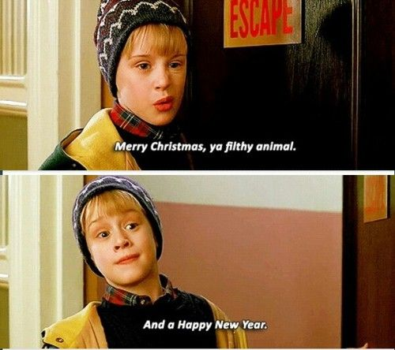
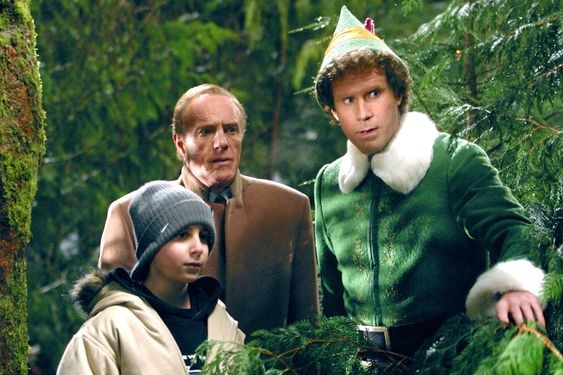
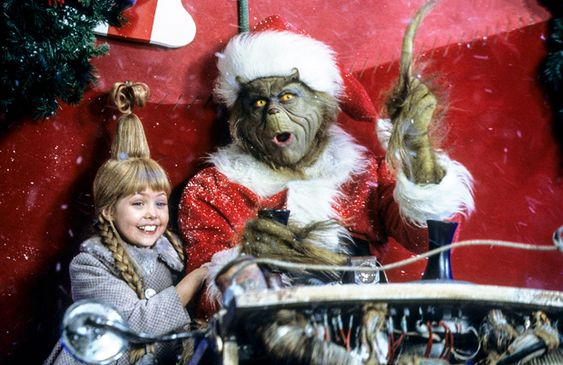

This article has been written and researched by our expert Loveable through a precise methodology. [Learn more about our methodology](https://avada.io/loveable/our-methodological.html)

[Loveable](https://avada.io/loveable/) > [Blog](https://avada.io/loveable/blog/) > [Holiday](https://avada.io/loveable/holiday/)

# 70+ Best Christmas Movie Quotes that Capture the Joy of the Season

Written by [Blake Simpson](https://avada.io/loveable/author/blake/) Last Updated on September 13, 2023

- [70+ Impressive Christmas Movie Quotes Of All Time](https://avada.io/loveable/blog/christmas-movie-quotes/#wp-block-heading-2-3)
    - [Famous Christmas Movie Quotes](https://avada.io/loveable/blog/christmas-movie-quotes/#wp-block-heading-3-4)
    - [Funny Christmas Movie Quotes](https://avada.io/loveable/blog/christmas-movie-quotes/#wp-block-heading-3-38)
    - [Short Christmas Movie Quotes](https://avada.io/loveable/blog/christmas-movie-quotes/#wp-block-heading-3-61)
- [To Wrap Up,](https://avada.io/loveable/blog/christmas-movie-quotes/#wp-block-heading-2-93)

The enchanting charm of the holiday season is beautifully encapsulated in the timeless tradition of **Christmas movie quotes**. These carefully selected quotes serve as twinkling fragments from some of the most beloved Christmas movies; each quote encapsulates the essence of the film’s charm, capturing the joy, love, and camaraderie that defines the holiday season.

Look elsewhere if you’re seeking the perfect sentiment to add to your holiday cards, Instagram captions, or simply to share with loved ones around the hearth. Let the enchantment of these Christmas movie quotes wrap you in the warmth and splendor of the season! 

## **70+ Impressive Christmas Movie Quotes Of All Time**

### **Famous Christmas Movie Quotes**

Home Alone (1990)

Ranked among the most cherished holiday traditions, the world of cinema has gifted us with timeless Christmas movie quotes that continue to warm our hearts year after year. Here are the legendary Christmas lines, unfolding within the frames of the best Christmas movies.

1\. “Faith is believing in things when common sense tells you not to.” —  Miracle on 34th Street

2\. “Tell her that you love her. You’ve got nothing to lose, and you’ll always regret it if you don’t.”— Love Actually

3\. “I just woke up thinking about going home with you and got very excited about Christmas.” — The Happiest Season

4\. “The thing about trains … it doesn’t matter where they’re going. What matters is deciding to get on.”— The Polar Express

5\. “This is extremely important. Will you please tell Santa that instead of presents this year, I just want my family back?” —Home Alone

6\. “Never be afraid when people can’t see what you see. Only be afraid if you no longer see it.” — Jingle Jangle: A Christmas Journey

7\. “It’s Christmas Eve. It’s the one night of the year when we all act a little nicer, we smile a little easier, we cheer a little more.”— Scrooged

8\. “I realized that Christmas is the time to be with the people you love.”— Love Actually

9\. “You can mess with a lot of things. But you can’t mess with kids on Christmas.” — Home Alone 2: Lost in New York

10\. “If you’re worried and you can’t sleep, count your blessings instead of sheep. Then you’ll fall asleep counting your blessings.” — White Christmas

11\. “Just because I cannot see it doesn’t mean I can’t believe it! —The Nightmare   Before Christmas

12\. “I never thought it was such a bad little tree. It’s not bad at all, really. Maybe it just needs a little love.” — A Charlie Brown Christmas

13\. “We’re not just doing this for us. We’re doing it for the kids. For every kid who ever sat on Santa’s lap.”— Jingle All the Way

14\. “That’s what Christmas memories are made from; they’re not planned, they’re not scheduled, nobody puts them in their Blackberry, they just happen.”— Deck the Halls

15.  “Christmas was on its way. Lovely, glorious, beautiful Christmas, upon which the entire kid year revolved.”— A Christmas Story

16\. “This is Christmas. The season of perpetual hope.” — Home Alone

17\. “It’s Christmas Eve, and we are going to go celebrate being young and being alive.” — The Holiday

18\. “Just remember, the true spirit of Christmas lies in your heart.”— The Polar Express

19\. “That’s the one good thing about regret: It’s never too late. You can always change tomorrow if you want to.”—Scrooged

20\. “Thank you for trying to get me to like Christmas. I love that you love it. I’m just so content taking care of other people’s pets when they’re away for the holiday.” — The Happiest Season

21\. “Strange, isn’t it? Each man’s life touches so many other lives. When he isn’t around, he leaves an awful hole, doesn’t he?” — It’s a Wonderful Life

22\. “The best way to spread Christmas cheer is singing loud for all to hear.” — Elf

23\. “If you look for it, I’ve got a sneaky feeling you’ll find that love is actually all around.” —Love Actually

24\. “What if Christmas, he thought, doesn’t come from a store. What if Christmas … Perhaps … means a little bit more!”— How the Grinch Stole Christmas

25\. “Seeing is believing, but sometimes the most real things in the world are the things we can’t see.”— The Polar Express

26\. “I think something must be wrong with me, Linus. Christmas is coming, but I’m not happy. I don’t feel the way I’m supposed to feel.” — A Charlie Brown Christmas

27\. “Yes! Yes, I do! I like Christmas! I love Christmas!” — A Christmas Card

28\. “Just because you can’t see something, doesn’t mean it doesn’t exist.” —  The Santa Clause

29\. “You have such a pretty face, you should be on a Christmas card.” — Elf

30\. “This is extremely important. Will you please tell Santa that instead of presents this year, I just want my family back.” — Home Alone

### **Funny Christmas Movie Quotes**

What better way to spread laughter as the holiday season approaches than by revisiting classic moments from beloved films that never fail to bring a smile? Just hang up your stockings, pour yourself a cup of hot cocoa, and get ready to relive some of the most side-splitting scenes as we present a jolly assortment of “[funny Christmas movie quotes](https://avada.io/loveable/blog/funny-christmas-movie-quotes/).” 

31\. “You’re skipping Christmas! Isn’t that against the law?”— Christmas with the Kranks

32\. “You’ll shoot your eye out kid!”—A Christmas Story

33\. “I want my house to be seen from space.” — Deck the Halls

34\. “You say you hate Washington’s birthday or Thanksgiving, and nobody cares, but you say you hate Christmas, and people treat you like you’re a leper.” — Gremlins

35\. “We elves try to stick to the four main food groups: candy, candy canes, candy corn, and syrup.” — Elf

36.“I don’t know what to say, but it’s Christmas, and we’re all in misery.”— National Lampoon’s Christmas Vacation

37\. “Merry Christmas, ya filthy animals!”— Home Alone 2

38\. “I spend months picking out the perfect present for everyone. You know the only thing I get in return? Coupons, free back rubs.” — A Bad Moms Christmas

39\. “And we’re going to have the hap-hap-happiest Christmas —National Lampoon’s Christmas Vacation

40\. “Nobody’s walking out on this fun, old-fashioned family Christmas.”— National Lampoon’s Christmas Vacation

41\. “I think you’re really beautiful, and I feel really warm when I’m around you, and my tongue swells up.” — Elf

42\. “The thing about trains… it doesn’t matter where they’re going. What matters is deciding to get on.” — The Polar Express

43\. “There’s a certain magic that comes with the very first snow. For when the first snow is also a Christmas snow, well, something wonderful is bound to happen.”  — Frosty the Snowman

44\. “Christmas is just about my favorite time. Ever since I was a little kid, I always felt like it was my own personal holiday” — Ernest Saves Christmas

45\. “Merry Christmas, you filthy animal.” — Home Alone 2: Lost in New York

46\. “Strange, isn’t it? Each man’s life touches so many other lives. When he isn’t around, he leaves an awful hole, doesn’t he?” — It’s a Wonderful Life

47\. “Every setback is a setup for a comeback” — The Best Man Holiday

48\. “Maybe Christmas… perhaps… means a little bit more.” — How the Grinch Stole Christmas

49\. “Everybody likes Denny’s; it’s an American institution”  — The Santa Clause

50\. “What’s the matter? Haven’t you ever seen a talking snowman before?” — Rudolph, The Red-Nosed Reindeer

### **Short Christmas Movie Quotes**

How the Grinch Stole Christmas (2000)

In the heartwarming spirit of the holiday season, nothing captures the essence of Christmas quite like the magic of short Christmas movie quotes. As we gather around with loved ones and sip on cups of cocoa, here are some unforgettable snippets of dialogue that remind us of the true meaning of this festive time: “Short Christmas movie quotes.”

51\. “But sir, Christmas is a time for giving… a time to be with one’s family.” — A Christmas Carol

52\. “It’s all humbug, I tell you.” — A Christmas Carol

53\. “Well, in Whoville, they say that the Grinch’s heart grew three sizes that day.” — How the Grinch Stole Christmas

54\. “No one should be alone on Christmas.” — How the Grinch Stole Christmas

55\. “Isn’t there anyone who knows what Christmas is all about?” — A Charlie Brown Christmas

56\. “A toy is never truly happy until it is loved by a child.” — Rudolph the Red-Nosed Reindeer

57\. “I will honor Christmas in my heart and try to keep it all the year”—  A Christmas Carol

58\. “It’s Christmas Eve. A time of mystery, expectations, who knows what might happen.” — The Nutcracker and the Four Realms

59\. “Seeing isn’t believing; believing is seeing.” — The Santa Clause 2

60\. “To me, you are perfect.” — Love Actually

61\. “God bless us, everyone!” — A Christmas Carol

62\. “I am a cotton-headed ninny muggins!”— Elf

63\. “Cheer up, dude. It’s Christmas”  — How the Grinch Stole Christmas

64\. “HELP ME…I’m FEELING.” — How the Grinch Stole Christmas

65\. “It’s Turbo time!” — Jingle All the Way

66\. “Christmas isn’t just a day. It’s a frame of mind.” — Miracle on 34th

67\. “All I want is what I have coming to me. All I want is my fair share.”  — A Charlie Brown Christmas

68\. “When I figure out what that means, I’ll come up with a crushing reply.”— White Christmas

69\. “This isn’t charity. It’s family.” — National Lampoon’s Christmas Vacation

70\. “I’m gonna deck your halls, bub.” — Jingle All the Way

71\. “Blast this Christmas music. It’s joyful and triumphant.” — How the Grinch Stole Christmas

72\. “Now you listen to me, young lady! Even if we’re horribly mangled, there’ll be no sad faces on Christmas.” —  How the Grinch Stole Christmas

73\. “There’s room for everyone on the nice list” —  Elf

74\. “Just once I’d like a regular, normal Christmas!” — Die Hard 2

75\. “Maybe scarlet fever. It’s a better color for Christmas.” — Christmas in Connecticut

**_See More:_**

- [Christmas Movie Characters](https://avada.io/loveable/blog/christmas-movie-characters/)

- Captivating [Animated Christmas Movies](https://avada.io/loveable/blog/animated-christmas-movies/)

## **To Wrap Up,**

In essence, the collection of over 70 carefully chosen **Christmas movie quotes** encapsulates the true spirit and delight of the holiday season. Whether you aim to spread yuletide cheer or fully immerse yourself in the festive atmosphere, these meticulously ranked Christmas movie quotes and sayings encapsulate the season’s true spirit, resonating with individuals of every generation.

- [70+ Impressive Christmas Movie Quotes Of All Time](https://avada.io/loveable/blog/christmas-movie-quotes/#wp-block-heading-2-3)
    - [Famous Christmas Movie Quotes](https://avada.io/loveable/blog/christmas-movie-quotes/#wp-block-heading-3-4)
    - [Funny Christmas Movie Quotes](https://avada.io/loveable/blog/christmas-movie-quotes/#wp-block-heading-3-38)
    - [Short Christmas Movie Quotes](https://avada.io/loveable/blog/christmas-movie-quotes/#wp-block-heading-3-61)
- [To Wrap Up,](https://avada.io/loveable/blog/christmas-movie-quotes/#wp-block-heading-2-93)

### [Blake Simpson](https://avada.io/loveable/author/blake/)

Hi, I'm Blake from Loveable. I help people find perfect gifts for occasions like anniversaries and weddings. I also write a blog about holidays, sharing insights to make them more meaningful. Let's create unforgettable moments together!

- [Twitter](https://twitter.com/intent/tweet)
- [Facebook](https://www.facebook.com/sharer/sharer.php)
- [instagram](https://avada.io/loveable/blog/christmas-movie-quotes/)
- [pinterest](https://www.pinterest.com/loveablellc/)

## Related Posts

[### 120+ Christian Birthday Wishes To Spread Your Love](https://avada.io/loveable/blog/christian-birthday-wishes/) 

[

### 35 Best 70th Birthday Ideas To Celebrate The Special Milestone

](https://avada.io/loveable/blog/70th-birthday-ideas/)

[

### 50 Best 30th Birthday Decorations for a Remarkable Birthday Bash

](https://avada.io/loveable/blog/30th-birthday-decorations/)

[

### 40 Delicious Vegan Christmas Desserts to Delight Your Palate

](https://avada.io/loveable/blog/vegan-christmas-desserts/)

[

### 60 Christmas Team Building Activities to Boost Workplace Spirit

](https://avada.io/loveable/blog/christmas-team-building-activities/)
