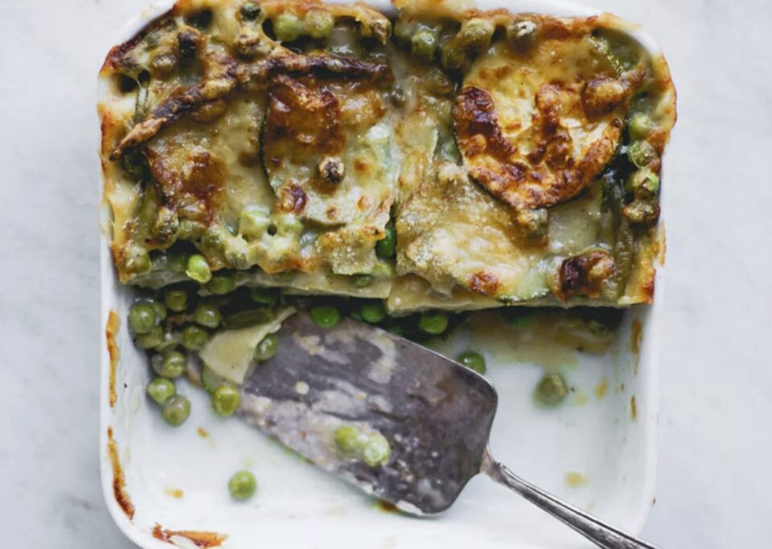
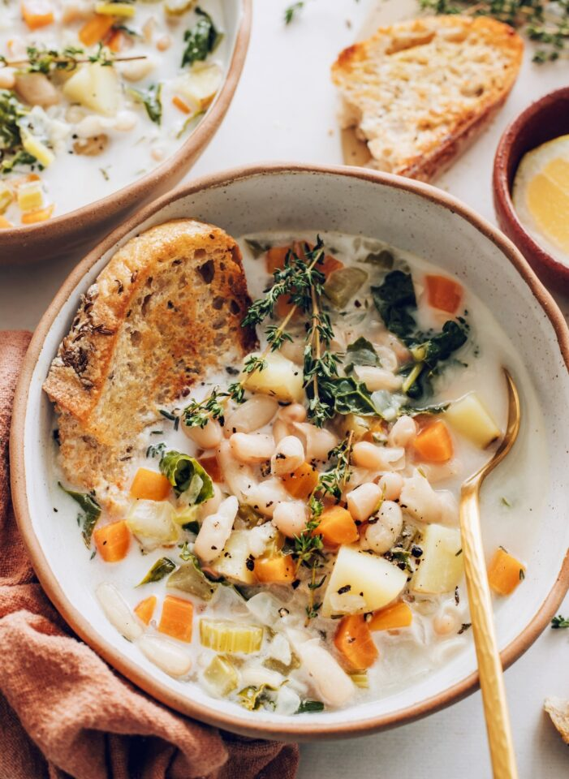

This article has been written and researched by our expert Loveable through a precise methodology. [Learn more about our methodology](https://avada.io/loveable/our-methodological.html)

[Loveable](https://avada.io/loveable/) > [Blog](https://avada.io/loveable/blog/) > [Family](https://avada.io/loveable/family/)

# 70+ Delicious Birthday Dinner Ideas to Delight Your Palate

Written by [Rose Bryne](https://avada.io/loveable/author/rose/) Last Updated on September 27, 2023

- [70+ Delicious Birthday Dinner Ideas for Your Special Day](https://avada.io/loveable/blog/birthday-dinner-ideas/#wp-block-heading-2-2)
    - [1\. Moules-Frites (Mussels And Fries)](https://avada.io/loveable/blog/birthday-dinner-ideas/#wp-block-heading-3-3)
    - [2\. Whole Roasted Chipotle Chicken](https://avada.io/loveable/blog/birthday-dinner-ideas/#wp-block-heading-3-7)
    - [3\. Slow Cooker Pork Carnitas](https://avada.io/loveable/blog/birthday-dinner-ideas/#wp-block-heading-3-11)
    - [4\. Rodney Scott’s Honey-butter Fish](https://avada.io/loveable/blog/birthday-dinner-ideas/#wp-block-heading-3-15)
    - [5\. Chrissy Teigen’s Cheesy Chicken Milanese](https://avada.io/loveable/blog/birthday-dinner-ideas/#wp-block-heading-3-19)
    - [6\. Cheater’s Spicy Sausage Pizza With Burrata](https://avada.io/loveable/blog/birthday-dinner-ideas/#wp-block-heading-3-23)
    - [7\. Perfect Meatballs With Cherry Tomato Sauce](https://avada.io/loveable/blog/birthday-dinner-ideas/#wp-block-heading-3-27)
    - [8\. Fried Chicken Blt With Jalapeño Honey](https://avada.io/loveable/blog/birthday-dinner-ideas/#wp-block-heading-3-31)
    - [9\. Flank Steak Tacos With Cucumber Salsa](https://avada.io/loveable/blog/birthday-dinner-ideas/#wp-block-heading-3-35)
    - [10\. Slow Cooker Beef Bourguignon](https://avada.io/loveable/blog/birthday-dinner-ideas/#wp-block-heading-3-39)
    - [11\. Pistachio Crusted Salmon](https://avada.io/loveable/blog/birthday-dinner-ideas/#wp-block-heading-3-43)
    - [12\. Instant Pot Buffalo Wings](https://avada.io/loveable/blog/birthday-dinner-ideas/#wp-block-heading-3-47)
    - [13\. Meatball With Chimichurri Sauce](https://avada.io/loveable/blog/birthday-dinner-ideas/#wp-block-heading-3-51)
    - [14\. Grilled Rack Of Lamb](https://avada.io/loveable/blog/birthday-dinner-ideas/#wp-block-heading-3-55)
    - [15\. Roast Wine Beef Tenderloin Recipe](https://avada.io/loveable/blog/birthday-dinner-ideas/#wp-block-heading-3-59)
    - [16\. Slow Cooker Lamb Ragu](https://avada.io/loveable/blog/birthday-dinner-ideas/#wp-block-heading-3-63)
    - [17\. 15-Minute Hunan Beef Recipe](https://avada.io/loveable/blog/birthday-dinner-ideas/#wp-block-heading-3-67)
    - [18\. Grilled Garlic Butter Steaks](https://avada.io/loveable/blog/birthday-dinner-ideas/#wp-block-heading-3-71)
    - [19\. Shredded Lamb Sliders](https://avada.io/loveable/blog/birthday-dinner-ideas/#wp-block-heading-3-75)
    - [20\. Pineapple-Onion Pork Chops](https://avada.io/loveable/blog/birthday-dinner-ideas/#wp-block-heading-3-79)
    - [21\. Blue Cheese-Mushroom Stuffed Tenderloin](https://avada.io/loveable/blog/birthday-dinner-ideas/#wp-block-heading-3-83)
    - [22\. Cheesy Tomato Basil Baked Orzo](https://avada.io/loveable/blog/birthday-dinner-ideas/#wp-block-heading-3-87)
    - [23\. Creamy Vodka Sauce Pasta](https://avada.io/loveable/blog/birthday-dinner-ideas/#wp-block-heading-3-91)
    - [24\. Chimichurri Quinoa with Flank Steak](https://avada.io/loveable/blog/birthday-dinner-ideas/#wp-block-heading-3-95)
    - [25\. Lemon Pasta](https://avada.io/loveable/blog/birthday-dinner-ideas/#wp-block-heading-3-99)
    - [26\. Prosecco Marshmallows](https://avada.io/loveable/blog/birthday-dinner-ideas/#wp-block-heading-3-103)
    - [27\. Asparagus Puff Pastry Pocket Squares](https://avada.io/loveable/blog/birthday-dinner-ideas/#wp-block-heading-3-107)
    - [28\. Salty Butter Chocolate Chip Cookies](https://avada.io/loveable/blog/birthday-dinner-ideas/#wp-block-heading-3-111)
    - [30\. Strawberry Lemonade Arnold Palmers](https://avada.io/loveable/blog/birthday-dinner-ideas/#wp-block-heading-3-115)
    - [31\. Prosciutto Parmesan Twists](https://avada.io/loveable/blog/birthday-dinner-ideas/#wp-block-heading-3-119)
    - [32\. Chicken Enchilada Bake](https://avada.io/loveable/blog/birthday-dinner-ideas/#wp-block-heading-3-123)
    - [33\. One Pot Marry Me Chicken](https://avada.io/loveable/blog/birthday-dinner-ideas/#wp-block-heading-3-127)
    - [34\. Cucumber Cilatro Margarita](https://avada.io/loveable/blog/birthday-dinner-ideas/#wp-block-heading-3-131)
    - [35\. Tomato Herb Pepperoni Pizza](https://avada.io/loveable/blog/birthday-dinner-ideas/#wp-block-heading-3-135)
    - [36\. Red Curry Basil Garlic Noodles](https://avada.io/loveable/blog/birthday-dinner-ideas/#wp-block-heading-3-139)
    - [37\. Chewy Chocolate Peanut Butter Bars](https://avada.io/loveable/blog/birthday-dinner-ideas/#wp-block-heading-3-143)
    - [38\. Sweet Potato Gnocchi](https://avada.io/loveable/blog/birthday-dinner-ideas/#wp-block-heading-3-147)
    - [39\. Coq Au Vin Blanc](https://avada.io/loveable/blog/birthday-dinner-ideas/#wp-block-heading-3-151)
    - [40\. Brown Sugar Cornish Hens](https://avada.io/loveable/blog/birthday-dinner-ideas/#wp-block-heading-3-155)
    - [41\. Pasta Piselli](https://avada.io/loveable/blog/birthday-dinner-ideas/#wp-block-heading-3-159)
    - [42\. Garlic Butter Baked Salmon](https://avada.io/loveable/blog/birthday-dinner-ideas/#wp-block-heading-3-163)
    - [43\. Vegetable Biryani](https://avada.io/loveable/blog/birthday-dinner-ideas/#wp-block-heading-3-167)
    - [44\. Sweet & Savory Burger](https://avada.io/loveable/blog/birthday-dinner-ideas/#wp-block-heading-3-171) 
    - [45\. Green Vegetables Lasagna with Zucchini, Peas, and Green Bean](https://avada.io/loveable/blog/birthday-dinner-ideas/#wp-block-heading-3-175)
    - [46\. Linguine With Clams, Parsley & Lemon](https://avada.io/loveable/blog/birthday-dinner-ideas/#wp-block-heading-3-179)
    - [47\. Risotto Alla Carbonara](https://avada.io/loveable/blog/birthday-dinner-ideas/#wp-block-heading-3-183)
    - [48\. Blackened Mahi Taco Bowls](https://avada.io/loveable/blog/birthday-dinner-ideas/#wp-block-heading-3-187)
    - [49\. Pan-Fried Schnitzel with Fried Lemons and Capers](https://avada.io/loveable/blog/birthday-dinner-ideas/#wp-block-heading-3-191)
    - [50\. Lemony Risotto with Fresh Herbs & Garlic](https://avada.io/loveable/blog/birthday-dinner-ideas/#wp-block-heading-3-195)
    - [51\. Vegan Pasta Primavera with Roasted Veggies](https://avada.io/loveable/blog/birthday-dinner-ideas/#wp-block-heading-3-199)
    - [52\. 1-Pot Vegan White Bean Soup](https://avada.io/loveable/blog/birthday-dinner-ideas/#wp-block-heading-3-203)
    - [53\. Creamy Vegan Mushroom Stroganoff](https://avada.io/loveable/blog/birthday-dinner-ideas/#wp-block-heading-3-207)
    - [54\. Vodka Sauce and Green Bean Cauliflower Gnocchi](https://avada.io/loveable/blog/birthday-dinner-ideas/#wp-block-heading-3-211)
    - [55\. Curried Pumpkin Soup](https://avada.io/loveable/blog/birthday-dinner-ideas/#wp-block-heading-3-215)
    - [56\. Sesame Garlic Ramen Noodles](https://avada.io/loveable/blog/birthday-dinner-ideas/#wp-block-heading-3-219)
    - [57\. Filipino Chicken Adobo](https://avada.io/loveable/blog/birthday-dinner-ideas/#wp-block-heading-3-223)
    - [58\. Stuffed Shells](https://avada.io/loveable/blog/birthday-dinner-ideas/#wp-block-heading-3-227)
    - [59\. Orecchiette with Broccoli Rabe](https://avada.io/loveable/blog/birthday-dinner-ideas/#wp-block-heading-3-231)
    - [60\. Creamy Chicken Pot Pie Soup](https://avada.io/loveable/blog/birthday-dinner-ideas/#wp-block-heading-3-235)
    - [61\. Skillet Cod with Lemon and Capers](https://avada.io/loveable/blog/birthday-dinner-ideas/#wp-block-heading-3-239)
    - [62\. Grilled Chipotle Steak With Okra and Corn](https://avada.io/loveable/blog/birthday-dinner-ideas/#wp-block-heading-3-243)
    - [63\. Glazed Pork Chops With Turnips and Carrots](https://avada.io/loveable/blog/birthday-dinner-ideas/#wp-block-heading-3-247)
    - [64\. Tortellini and Veggies en Brodo](https://avada.io/loveable/blog/birthday-dinner-ideas/#wp-block-heading-3-251)
    - [65\. Smoky-Sweet Steak Supper](https://avada.io/loveable/blog/birthday-dinner-ideas/#wp-block-heading-3-255)
    - [66\. Balsamic Steak With Radicchio and Pears](https://avada.io/loveable/blog/birthday-dinner-ideas/#wp-block-heading-3-259)
    - [67\. Lobster Tails With Cilantro Butter](https://avada.io/loveable/blog/birthday-dinner-ideas/#wp-block-heading-3-263)
    - [68\. Gnocchi Alla Vodka](https://avada.io/loveable/blog/birthday-dinner-ideas/#wp-block-heading-3-267)
    - [69\. Linguine With Cherry Tomato Sauce](https://avada.io/loveable/blog/birthday-dinner-ideas/#wp-block-heading-3-271)
    - [70\. Crockpot Pulled-Pork Tacos](https://avada.io/loveable/blog/birthday-dinner-ideas/#wp-block-heading-3-275)
    - [71\. Sheet Pan Chicken and Sweet Potatoes](https://avada.io/loveable/blog/birthday-dinner-ideas/#wp-block-heading-3-279)
    - [72\. Sheet Pan Cod and Potatoes](https://avada.io/loveable/blog/birthday-dinner-ideas/#wp-block-heading-3-283)
    - [73\. Crispy Pork Cutlets with Fennel-Chickpea Slaw](https://avada.io/loveable/blog/birthday-dinner-ideas/#wp-block-heading-3-287)
    - [74\. Sheet Pan Chicken Thighs with Salsa Verde](https://avada.io/loveable/blog/birthday-dinner-ideas/#wp-block-heading-3-291)
    - [75\. Spicy Summer Squash Stir-Fry](https://avada.io/loveable/blog/birthday-dinner-ideas/#wp-block-heading-3-295)
- [In Conclusion](https://avada.io/loveable/blog/birthday-dinner-ideas/#wp-block-heading-2-302)

When it comes to celebrating birthdays, a special dinner can set the tone for a memorable and joyful evening. Whether you’re planning an intimate gathering or a lively party, choosing the right **birthday dinner ideas** can make all the difference. In this article, we’ll explore a variety of delectable dishes and themes that will make your birthday dinner an unforgettable culinary experience.

## **70+ Delicious Birthday Dinner Ideas for Your Special Day**

### **1\. Moules-Frites (Mussels And Fries)**

Delight in the briny freshness of mussels perfectly paired with the crispy allure of golden fries. It’s a dish that captures the essence of seaside dining and culinary satisfaction.

How to cook [Moules-frites (Mussels And Fries)](https://www.purewow.com/recipes/moules-frites-mussels-fries-recipe) 

### **2\. Whole Roasted Chipotle Chicken**

A surefire way to impress? Roast a whole bird. A symphony of smoky chipotle flavors envelopes succulent roasted chicken, creating a fiery and tender masterpiece that ignites the taste buds.

How to cook [Whole Roasted Chipotle Chicken](https://www.purewow.com/recipes/whole-roasted-chipotle-chicken)

### **3\. Slow Cooker Pork Carnitas**

Because a pot of fall-apart-tender pork is guaranteed to make anyone feel loved. Use the meat for tacos, nachos, burritos or rice bowls. Each tender morsel tells a story of meticulous preparation and a rich, savory heritage.

How to cook [Slow Cooker Pork Carnitas](https://www.purewow.com/recipes/Slow-Cooker-Pork-Carnitas-Tacos)

### **4\. Rodney Scott’s Honey-butter Fish**

Summer babies, fire up that barbecue. Take your pick of trout, catfish, red snapper or branzino fillets.  It’s a harmony of flavors that dances on your palate.

How to cook [Rodney Scott’s Honey-butter Fish](https://www.purewow.com/recipes/honey-butter-fish)

### **5\. Chrissy Teigen’s Cheesy Chicken Milanese**

If you’re going all out, who better to lend a hand than Chrissy Teigen and her crispy, indulgent chicken? It’s a taste of Italian sophistication with a touch of decadence.

How to cook [Chrissy Teigen’s Cheesy Chicken Milanese](https://www.purewow.com/recipes/chrissy-teigen-cheesy-chicken-milanese)

### **6\. Cheater’s Spicy Sausage Pizza With Burrata**

All we want on our birthday is a creamy puddle of burrata and a fork. This dish is a delightful cheat sheet to gourmet dining, crowned with creamy burrata cheese.

How to cook [Cheater’s Spicy Sausage Pizza With Burrata](https://www.purewow.com/recipes/cheaters-spicy-sausage-pizza-burrata) 

### **7\. Perfect Meatballs With Cherry Tomato Sauce**

These juicy, tender meatballs are even better than reservations at a fancy Italian restaurant. It’s the taste of home-cooked love.

How to cook [Perfect Meatballs With Cherry Tomato Sauce](https://www.purewow.com/recipes/perfect-meatballs-with-cherry-tomato-sauce)

### **8\. Fried Chicken Blt With Jalapeño Honey**

This sandwich needs no introduction. Make it for the comfort food-obsessed guy or gal in your life. t’s a sandwich that’s anything but ordinary.

How to  [Fried Chicken Blt With Jalapeño Honey](https://www.purewow.com/recipes/fried-chicken-blt-jalapeno-honey) 

### **9\. Flank Steak Tacos With Cucumber Salsa**

One year older? That means you can eat one more taco than last year. Don’t forget the guac. Experience the vibrant flavors of perfectly grilled flank steak, nestled within soft tortillas, and crowned with refreshing cucumber salsa. 

How to cook  [Flank Steak Tacos With Cucumber Salsa](https://www.purewow.com/recipes/flank-steak-tacos-cucumber-salsa-recipe)

### **10\. Slow Cooker Beef Bourguignon**

Trust us, no one will know it only took you ten minutes of prep. Savor the rich, complex flavors of beef bourguignon without the hassle. 

How to cook [Slow Cooker Beef Bourguignon](https://www.purewow.com/recipes/cheaters-slow-cooker-beef-bourguignon) 

### **11\. Pistachio Crusted Salmon**

This salmon dish is amazingly rich and delicious. The crushed pistachios put the flavor and taste over the top and give it just the right crunch. It’s a dish that marries the buttery richness of fish with the nutty appeal of pistachios.

How to cook [Pistachio Crusted Salmon](https://aubreyskitchen.com/pistachio-maple-dijon-crusted-salmon/)

### **12\. Instant Pot Buffalo Wings**

Once you make these hot wings in the Instant Pot, you’ll never be ordering them take-out again. A birthday menu doesn’t have to be too over the top. If your kids like wings, make these! Serve with some sweet potato fries for a casual dinner they’ll love. Each bite is a burst of spicy, tangy goodness that’s impossible to resist.

How to cook [Instant Pot Buffalo Wings](https://www.hodgepodgehippie.com/easy-hot-wings-recipe-2/)

### **13\. Meatball With Chimichurri Sauce**

The best way to serve the perfect meatballs is with a tangy chimichurri sauce. I’m always looking for different ways to serve up old favorites. It makes them feel new again. It’s a dish that celebrates the flavors of South America.

How to cook [Meatball With Chimichurri Sauce](https://theoregondietitian.com/meatballs-with-chimichurri-sauce)

### **14\. Grilled Rack Of Lamb**

Cooking lamb chops doesn’t have to be hard. This recipe for lamb shanks walks you through the entire process step by step. This is one of the tastiest birthday dinner ideas that feels extra celebratory.

How to cook [Grilled Rack Of Lamb](https://basilandbubbly.com/grilled-rack-of-lamb/)

### **15\. Roast Wine Beef Tenderloin Recipe**

Adding a bit of red wine sauce adds so much flavor. Revel in the opulence of roast beef tenderloin, bathed in a luxurious red wine sauce.  This is one of my top ideas for red meat lovers.

How to cook [Roast Wine Beef Tenderloin Recipe](https://theforkedspoon.com/roast-beef-tenderloin/)

### **16\. Slow Cooker Lamb Ragu**

Give your tastebuds a true treat with this simple lamb ragu recipe. It’s loaded with flavor and so tender, it will literally melt in your mouth.

How to cook [Slow Cooker Lamb Ragu](https://aussiehomecook.com/slow-cooker-lamb-ragu/)

### **17\.** **15-Minute Hunan Beef Recipe**

What many people llove about this easy beef recipe is that, with just a few minutes of prep, it’s ready in about 15 minutes. No more spending hours in the kitchen trying to make up a meal.

How to cook [15-Minute Hunan Beef Recipe](https://www.wholesomeyum.com/recipes/hunan-beef-recipe-paleo-low-carb-gluten-free/)

### **18\. Grilled Garlic Butter Steaks**

Knowing how to cook a good steak is key. This simple steak recipe gives you all the tips that you could ever want to know. A two-minute sear really adds flavor.

How to cook [Grilled Garlic Butter Steaks](https://outgrilling.com/garlic-butter-steaks/)

### **19\. Shredded Lamb Sliders**

Lamb, a wonderful special occasion meat, is a big crowd-pleaser in these delicious sliders. You can be served up about 1,500 in two days when you make them for the Great American Beer Fest, using every little bit to satisfy the very last customer. It’s a great birthday dinner idea, too! 

How to cook [Shredded Lamb Sliders](https://www.tasteofhome.com/recipes/shredded-lamb-sliders/)

### **20\. Pineapple-Onion Pork Chops**

These succulent pork chops are a symphony of flavors, combining the sweetness of pineapple with the savory depth of onions. Brown sugar and pineapple juice provide the onion-topped entree with its sweetness. 

How to cook [Pineapple-Onion Pork Chops](https://www.tasteofhome.com/recipes/pineapple-onion-pork-chops/)

### **21\. Blue Cheese-Mushroom Stuffed Tenderloin**

Experience the opulence of tenderloin steak elevated to new heights with earthy mushrooms and the bold tang of blue cheese. Filled with savory stuffing, the sliced tenderloin looks and tastes like a specialty from an upscale restaurant. 

How to cook [Blue Cheese-Mushroom Stuffed Tenderloin](https://www.tasteofhome.com/recipes/blue-cheese-mushroom-stuffed-tenderloin/)

### **22\. Cheesy Tomato Basil Baked Orzo**

This orzo baked with tomato and fresh basil is parmesan heaven. It’s sort of like a pasta dish with imposter syndrome. This dish captures the essence of comfort food, reminiscent of cherished family gatherings.

How to cook [Cheesy Tomato Basil Baked Orzo](https://www.howsweeteats.com/2022/05/tomato-basil-baked-orzo/)

### **23\. Creamy Vodka Sauce Pasta**

The vodka is already gonna be out on the counter for this recipe so you’ve already got yourself a party. The creamy vodka sauce enveloping this pasta is a revelation of rich, velvety flavor.

How to cook [Creamy Vodka Sauce Pasta](https://www.howsweeteats.com/2020/10/vodka-sauce/) 

### **24\. Chimichurri Quinoa with Flank Steak**

Don’t you love when a fresh, light meal and a hearty main dish join forces to create the perfect plate? This dish is a celebration of Latin American zest and hearty satisfaction.

How to cook [Chimichurri Quinoa with Flank Steak](https://www.howsweeteats.com/2...https://www.howsweeteats.com/2019/08/chimichurri-quinoa-flank-steak/)

### **25\. Lemon Pasta**

Cozy, creamy, classic—what more do you need in an at-home recipe? Bonus: This pasta only requires six ingredients, most of which are already taking up space in your fridge.

How to cook [Lemon Pasta](https://www.howsweeteats.com/2019/01/lemon-pasta/)

### **26\. Prosecco Marshmallows**

Prosecco marshmallows are apparently very much a thing, and TBH, it’s the sort of celebratory dessert the world has been patiently waiting for. Each airy bite is a taste of celebration, making ordinary moments extraordinary.

How to cook [Prosecco Marshmallows](https://www.rosalynndaniels.com/prosecco-marshmallows/).

### **27\. Asparagus Puff Pastry Pocket Squares**

One bite of this pocket square and you’ve got a taste of asparagus/prosciutto/smoked gouda deliciousness. If you need to undo the top button on your jeans, now is the time.

How to cook [Asparagus Puff Pastry Pocket Squares](https://www.rosalynndaniels.com/how-to-make-easy-asparagus-puff-pastry-pocket-squares/)

### **28\. Salty Butter Chocolate Chip Cookies**

There must be a scientific reason as to why a sprinkle of salt on top of chocolate chip cookies elevates your mood and the dessert. These cookies are a dance of sweet and salty, featuring the richness of brown butter and the decadence of chocolate chips. 

How to cook [Salty Butter Chocolate Chip Cookies](https://go.redirectingat.com/?id=74968X1525071&url=https%3A%2F%2Fcravingsbychrissyteigen.com%2Frecipes%2Fsalty-brown-butter-milk-chocolate-chip-cookies%2F&sref=https%3A%2F%2Fwww.cosmopolitan.com%2Flifestyle%2Fg40103880%2Fbirthday-dinner-ideas%2F&xs=1&xcust=%5Butm_source%7C%5Butm_campaign%7C%5Butm_medium%7C%5Bgclid%7C%5Bmsclkid%7C%5Bfbclid%7C%5Brefdomain%7C%5Bcontent_id%7C1f8805d8-908d-4d8e-baa0-7655384e2915%5Bcontent_product_id%7Cf85c02b6-0bde-47de-84db-39ca02f6f57f%5Bproduct_retailer_id%7Cbc115554-f85f-4087-afeb-349d0d26012f%5Blt%7C%5Boptxid%7C%5Boptvid%7C)

### **30\. Strawberry Lemonade Arnold Palmers**

This summery drink is the perfect pre-dinner treat. Mint leaves go the extra mile and make these casual cocktails feel extra fancy. Quench your thirst with the bold combination of strawberry sweetness, zesty lemonade, and a spirited twist.

How to cook [Strawberry Lemonade Arnold Palmers](https://go.redirectingat.com/?id=74968X1525071&url=https%3A%2F%2Fcravingsbychrissyteigen.com%2Frecipes%2Fspiked-strawberry-lemonade-arnold-palmers%2F&sref=https%3A%2F%2Fwww.cosmopolitan.com%2Flifestyle%2Fg40103880%2Fbirthday-dinner-ideas%2F&xs=1&xcust=%5Butm_source%7C%5Butm_campaign%7C%5Butm_medium%7C%5Bgclid%7C%5Bmsclkid%7C%5Bfbclid%7C%5Brefdomain%7C%5Bcontent_id%7C1f8805d8-908d-4d8e-baa0-7655384e2915%5Bcontent_product_id%7Cd9a996e4-4271-4865-8601-08a8fd8847b8%5Bproduct_retailer_id%7C8ef001bd-7b70-4a1c-9132-0b97ad98dec0%5Blt%7C%5Boptxid%7C%5Boptvid%7C).

### **31\. Prosciutto Parmesan Twists**

Did someone call for the most impressive appetizer ever? These twisted delights are a harmony of salty prosciutto and sharp Parmesan, encased in flaky pastry. 

How to cook [Prosciutto Parmesan Twists](https://go.redirectingat.com/?id=74968X1525071&url=https%3A%2F%2Fcravingsbychrissyteigen.com%2Frecipes%2Fprosciutto-parmesan-puff-pastry-twists%2F&sref=https%3A%2F%2Fwww.cosmopolitan.com%2Flifestyle%2Fg40103880%2Fbirthday-dinner-ideas%2F&xs=1&xcust=%5Butm_source%7C%5Butm_campaign%7C%5Butm_medium%7C%5Bgclid%7C%5Bmsclkid%7C%5Bfbclid%7C%5Brefdomain%7C%5Bcontent_id%7C1f8805d8-908d-4d8e-baa0-7655384e2915%5Bcontent_product_id%7Cd52979de-963e-4e5d-916b-409ff11e4462%5Bproduct_retailer_id%7C767a6d56-9483-4787-b822-50e9aa61ef7e%5Blt%7C%5Boptxid%7C%5Boptvid%7C).

### **32\. Chicken Enchilada Bake**

This enchilada dish leaves a lot of room for versatility and ingredient swaps (as long as you keep the avocado, because let’s be honest, that’s a staple). This bake is a fiesta of Mexican flavors that’s hearty, satisfying, and utterly comforting.

How to cook [Chicken Enchilada Bake](https://joythebaker.com/2018/05/chicken-enchilada-bake/)

### **33\. One Pot Marry Me Chicken**

One taste of this and you’ll understand the meaning behind the name. Something about this creamy chicken TikTok recipe inspires lifelong commitment in diners everywhere.

How to cook [One Pot Marry Me Chicken](https://joythebaker.com/2022/02/one-pot-marry-me-chicken/)

### **34\. Cucumber Cilatro Margarita**

This is the ultimate refreshing cocktail to top off just about any alfresco meal. The fresh cucumber-lime-cilantro combo goes down just as easy as seltzer.

How to cook [Cucumber Cilatro Margarita](https://joythebaker.com/2021/07/cucumber-cilantro-margarita/)

### **35\. Tomato Herb Pepperoni Pizza**

This pie checks all of your pizza boxes, with high marks for crispy, cheesy, gooey edges. Throw it in the oven ASAP.

How to cook [Tomato Herb Pepperoni Pizza 403](https://www.halfbakedharvest.com/tomato-herb-pepperoni-pizza/)

### **36\. Red Curry Basil Garlic Noodles**

The curry basil flavors here are next-level, and the whole dish comes together in just 20 minutes. That’s the way all dinner recipes should be.

How to cook [Red Curry Basil Garlic Noodles](https://www.halfbakedharvest.com/basil-garlic-oil-noodles/)

### **37\. Chewy Chocolate Peanut Butter Bars**

Chocolate and PB is such a tried-and-true combo. These bars are a marriage of velvety chocolate and creamy peanut butter, resulting in a chewy, irresistible treat. 

How to cook [Half Baked Harvest](https://www.halfbakedharvest.com/chewy-chocolate-peanut-butter-bars/)

### **38\. Sweet Potato Gnocchi**

Gnocchi with this sweet potato spin adds a layer of flavor that’ll blow your mind and your taste buds. It’s a dish that embodies comfort and warmth, perfect for cozy gatherings.

How to cook [Sweet Potato Gnocchi](https://preppykitchen.com/sweet-potato-gnocchi-recipe/)

### **39\. Coq Au Vin Blanc**

Searching for something sophisticated to serve on your special day? This classic French dish will do the trick. It’s a dish that pays homage to the artistry of French cuisine.

How to cook [Coq Au Vin Blanc](https://www.monpetitfour.com/chicken-in-white-wine-sauce/)

### **40\. Brown Sugar Cornish Hens**

It is believed that cornbread dressing should be an all-year thing, not just a treat reserved for Turkey Day. If you agree, then this recipe is the savory dinner you’ve been waiting all year for even on [Christmas](https://avada.io/loveable/christmas/).

How to cook [Brown Sugar Cornish Hens](https://www.chefwillcoleman.com/post/brown-sugar-cornish-hens-corn-bread-dressing).

### **41\. Pasta Piselli**

This fresh Italian meal is beyond delish. A humble yet heartwarming Italian dish, Pasta Piselli, is a culinary embodiment of love and simplicity. Who knew peas and pasta were such a dream pairing?

How to cook [Pasta Piselli](https://go.redirectingat.com/?id=74968X1525071&url=https%3A%2F%2Ffood52.com%2Frecipes%2F20605-pasta-piselli&sref=https%3A%2F%2Fwww.cosmopolitan.com%2Flifestyle%2Fg40103880%2Fbirthday-dinner-ideas%2F&xs=1&xcust=%5Butm_source%7C%5Butm_campaign%7C%5Butm_medium%7C%5Bgclid%7C%5Bmsclkid%7C%5Bfbclid%7C%5Brefdomain%7C%5Bcontent_id%7C1f8805d8-908d-4d8e-baa0-7655384e2915%5Bcontent_product_id%7Cd2f1bc00-526c-4276-8be1-706d50ce71bc%5Bproduct_retailer_id%7C802a0e24-f590-40a1-939f-14f301244598%5Blt%7C%5Boptxid%7C%5Boptvid%7C).

### **42\. Garlic Butter Baked Salmon**

Crispy salmon is sure to be a crowd fave. Plus, paired with fingerling potatoes? Good luck getting your dinner guests out of your apartment at the end of the night.

How to cook [Garlic Butter Baked Salmon](https://cafedelites.com/sheet-pan-garlic-butter-baked-salmon/)

### **43\. Vegetable Biryani**

No meat, no problem. This traditional Indian spicy rice and veggie recipe could function as a side dish, but honestly, it’s hearty enough to take center stage.

How to cook [Vegetable Biryani](https://go.redirectingat.com/?id=74968X1525071&url=https%3A%2F%2Ffood52.com%2Frecipes%2F40182-my-mother-s-bengali-vegetable-biryani&sref=https%3A%2F%2Fwww.cosmopolitan.com%2Flifestyle%2Fg40103880%2Fbirthday-dinner-ideas%2F&xs=1&xcust=%5Butm_source%7C%5Butm_campaign%7C%5Butm_medium%7C%5Bgclid%7C%5Bmsclkid%7C%5Bfbclid%7C%5Brefdomain%7C%5Bcontent_id%7C1f8805d8-908d-4d8e-baa0-7655384e2915%5Bcontent_product_id%7Cbb644146-327c-4097-882f-92a048b28ce2%5Bproduct_retailer_id%7Cc83f76a5-dc25-4d7c-abc5-8289f62efc2d%5Blt%7C%5Boptxid%7C%5Boptvid%7C)

### **44\. Sweet & Savory Burger** 

Now, this is how you properly elevate your classic burger. Whipping these up with your crew is the ultimate outdoor dinner activity.

How to cook [Sweet & Savory Burger](https://go.redirectingat.com/?id=74968X1525071&url=https%3A%2F%2Ffood52.com%2Frecipes%2F38178-sweet-and-savory-burger-with-fig-jam-goat-cheese-and-arugula&sref=https%3A%2F%2Fwww.cosmopolitan.com%2Flifestyle%2Fg40103880%2Fbirthday-dinner-ideas%2F&xs=1&xcust=%5Butm_source%7C%5Butm_campaign%7C%5Butm_medium%7C%5Bgclid%7C%5Bmsclkid%7C%5Bfbclid%7C%5Brefdomain%7C%5Bcontent_id%7C1f8805d8-908d-4d8e-baa0-7655384e2915%5Bcontent_product_id%7Cff968722-54a7-4363-8f52-24ff96f03236%5Bproduct_retailer_id%7Cbadf1c1d-2af6-4fe4-9ecd-af9efd2a35bb%5Blt%7C%5Boptxid%7C%5Boptvid%7C)

### **45\. Green Vegetables Lasagna with Zucchini, Peas, and Green Bean**

This remixed lasagna recipe is one you’re gonna wanna save long after your special dinner, that’s for sure.

How to cook [Green Vegetables Lasagna with Zucchini, Peas, and Green Bean](https://go.redirectingat.com/?id=74968X1525071&url=https%3A%2F%2Ffood52.com%2Frecipes%2F37586-green-vegetables-lasagna-with-zucchini-peas-and-green-beans&sref=https%3A%2F%2Fwww.cosmopolitan.com%2Flifestyle%2Fg40103880%2Fbirthday-dinner-ideas%2F&xs=1&xcust=%5Butm_source%7C%5Butm_campaign%7C%5Butm_medium%7C%5Bgclid%7C%5Bmsclkid%7C%5Bfbclid%7C%5Brefdomain%7C%5Bcontent_id%7C1f8805d8-908d-4d8e-baa0-7655384e2915%5Bcontent_product_id%7C6dd054ad-9923-4956-8f48-b5bc5a8c51da%5Bproduct_retailer_id%7C1465e16a-6095-4075-b1e7-996a0e0f677b%5Blt%7Csale%5Boptxid%7C%5Boptvid%7C).

### **46\. Linguine With Clams, Parsley & Lemon**

Is your mouth already watering? No, just me? This recipe is ridiculously easy to prep, with an obviously delicious payoff (not to mention it looks super fancy).

How to cook [Linguine With Clams, Parsley & Lemon](https://go.redirectingat.com/?id=74968X1525071&url=https%3A%2F%2Ffood52.com%2Frecipes%2F80842-linguine-with-clams-parsley-lemon&sref=https%3A%2F%2Fwww.cosmopolitan.com%2Flifestyle%2Fg40103880%2Fbirthday-dinner-ideas%2F&xs=1&xcust=%5Butm_source%7C%5Butm_campaign%7C%5Butm_medium%7C%5Bgclid%7C%5Bmsclkid%7C%5Bfbclid%7C%5Brefdomain%7C%5Bcontent_id%7C1f8805d8-908d-4d8e-baa0-7655384e2915%5Bcontent_product_id%7C11afabe4-11aa-4ae8-9767-8f9d98e58e28%5Bproduct_retailer_id%7C39c3e784-74db-4283-ac27-f0d7035a576f%5Blt%7Csale%5Boptxid%7C%5Boptvid%7C)

### **47\. Risotto Alla Carbonara**

Swap out traditional spaghetti for Arborio rice and you’ve got a new-age carb mashup that’s an absolute winner-winner risotto dinner. And yup, those are absolutely crispy pancetta bits sprinkled on top.

How to cook [Risotto Alla Carbonara](https://go.redirectingat.com/?id=74968X1525071&url=https%3A%2F%2Ffood52.com%2Frecipes%2F82672-risotto-carbonara-recipe&sref=https%3A%2F%2Fwww.cosmopolitan.com%2Flifestyle%2Fg40103880%2Fbirthday-dinner-ideas%2F&xs=1&xcust=%5Butm_source%7C%5Butm_campaign%7C%5Butm_medium%7C%5Bgclid%7C%5Bmsclkid%7C%5Bfbclid%7C%5Brefdomain%7C%5Bcontent_id%7C1f8805d8-908d-4d8e-baa0-7655384e2915%5Bcontent_product_id%7C4e9fa85b-e73b-4ad8-b6f3-bc77eac750dd%5Bproduct_retailer_id%7C8fda65f9-829b-46ca-adf8-1b2fbda320eb%5Blt%7C%5Boptxid%7C%5Boptvid%7C)

### **48\. Blackened Mahi Taco Bowls**

Your Taco Tuesdays have never looked this good. Spice ’em up by first blackening the fish, then topping everything off with a coconut-chipotle-lime dressing.

How to cook [Blackened Mahi Taco Bowls](https://go.redirectingat.com/?id=74968X1525071&url=https%3A%2F%2Fwww.lecreuset.com%2Fblackened-mahi-taco-bowls%2FLCR-2519.html&sref=https%3A%2F%2Fwww.cosmopolitan.com%2Flifestyle%2Fg40103880%2Fbirthday-dinner-ideas%2F&xs=1&xcust=%5Butm_source%7C%5Butm_campaign%7C%5Butm_medium%7C%5Bgclid%7C%5Bmsclkid%7C%5Bfbclid%7C%5Brefdomain%7C%5Bcontent_id%7C1f8805d8-908d-4d8e-baa0-7655384e2915%5Bcontent_product_id%7Cab9e74ce-2b7e-4d7a-a06b-028c0ba401aa%5Bproduct_retailer_id%7C1371e9fe-9201-451c-906d-83bd406793e2%5Blt%7C%5Boptxid%7C%5Boptvid%7C)

### **49\. Pan-Fried Schnitzel with Fried Lemons and Capers**

You’ve never had a Schnitzel quite like this one. And if you’ve never had a Schnitzel, this savory recipe is the place to start. (Now say that back five times fast.)

How to cook [Pan-Fried Schnitzel with Fried Lemons and Capers](https://go.redirectingat.com/?id=74968X1525071&url=https%3A%2F%2Fwww.lecreuset.com%2Fpan-fried-schnitzel-with-fried-lemons-and-capers%2FLCR-2582.html&sref=https%3A%2F%2Fwww.cosmopolitan.com%2Flifestyle%2Fg40103880%2Fbirthday-dinner-ideas%2F&xs=1&xcust=%5Butm_source%7C%5Butm_campaign%7C%5Butm_medium%7C%5Bgclid%7C%5Bmsclkid%7C%5Bfbclid%7C%5Brefdomain%7C%5Bcontent_id%7C1f8805d8-908d-4d8e-baa0-7655384e2915%5Bcontent_product_id%7C1d05ace3-d948-4f7a-b584-dfa525eaba52%5Bproduct_retailer_id%7C8c1cc153-201f-47ae-81fa-2fd793a4a83d%5Blt%7C%5Boptxid%7C%5Boptvid%7C)

### **50\. Lemony Risotto with Fresh Herbs & Garlic**

An Italian villa-themed bday! Creamy and comforting risotto, delicately perfumed with zesty lemon and enriched with the warmth of garlic, transports you to the heart of Italy. 

How to cook  [Lemony Risotto with Fresh Herbs & Garlic](https://minimalistbaker.com/lemon-risotto-with-fresh-herbs-garlic/)

### **51\. Vegan Pasta Primavera with Roasted Veggies**

Rejoice in the fact that this is a meal that everyone can dig into and wanna cook again and again, regardless of dietary restrictions.

How to cook [Vegan Pasta Primavera with Roasted Veggies](https://minimalistbaker.com/vegan-pasta-primavera-with-roasted-veggies/)

### **52\. 1-Pot Vegan White Bean Soup**

A cozy side dish for a fall or chilly spring night. It’s also so colorful—nutritionists everywhere would be proud.

How to cook [1-Pot Vegan White Bean Soup](https://minimalistbaker.com/1-pot-vegan-white-bean-soup/)

### **53\. Creamy Vegan Mushroom Stroganoff**

Trust when I say that this dairy-free dish is everything. Cheese or no cheese, this mushroom stroganoff doesn’t skimp on creaminess or deliciousness.

How to cook [Creamy Vegan Mushroom Stroganoff](https://minimalistbaker.com/creamy-vegan-mushroom-stroganoff-gf-optional/)

### **54\. Vodka Sauce and Green Bean Cauliflower Gnocchi**

Who could get enough of this actual masterpiece of a meal? No one, not a single person. It truly is the perfect birthday treat.

How to cook [Vodka Sauce and Green Bean Cauliflower Gnocchi](https://themodernproper.com/vodka-sauce-and-green-bean-cauliflower-gnocchi)

### **55\. Curried Pumpkin Soup**

Yes, pumpkin curry is on the menu, and it’s a no-brainer recipe for autumnal dinners. This velvety soup is a comforting and soul-warming dish, perfect for cool autumn evenings or as an appetizer for a festive holiday meal.

How to cook [Curried Pumpkin Soup](https://themodernproper.com/curried-pumpkin-coconut-soup)

### **56\. Sesame Garlic Ramen Noodles**

Watch! No, this one doesn’t come from a cup. It’s the elevated version of ramen noodles. This iss the meal of dreams.

How to cook [Sesame Garlic Ramen Noodles](https://themodernproper.com/sesame-garlic-ramen-noodles)

### **57\. Filipino Chicken Adobo**

Run, don’t walk to your kitchen for this crowd-pleaser. If you’ve never cooked Filipino food, you’ve been missing out on this chicken staple.

How to cook [Filipino Chicken Adobo](https://themodernproper.com/chicken-adobo)

### **58\. Stuffed Shells**

Stuffed shells are the love language, and this cheesy, ricotta-filled recipe calls for fresh lemon zest and spinach (which basically makes it a health food, right?)

How to cook [Stuffed Shells](https://www.loveandlemons.com/stuffed-shells-recipe/)

### **59\. Orecchiette with Broccoli Rabe**

Orecchiette are pretty much the cutest pasta ever, and when paired with sautéed broccoli rabe and sundried tomatoes, it’s the ultimate crowd-pleasing dinner choice.

How to cook [Orecchiette with Broccoli Rabe](https://www.loveandlemons.com/orecchiette-with-broccoli-rabe/).

### **60\. Creamy Chicken Pot Pie Soup**

Yes indeed, this is a soup rendition of a classic comfort food. Double the batch, because you’re definitely going back for seconds.

How to cook [Creamy Chicken Pot Pie Soup](https://www.thechunkychef.com/creamy-chicken-pot-pie-soup/).

### **61\. Skillet Cod with Lemon and Capers**

Michelin-level meals are possible to achieve at home, and this dish is proof. Tender cod fish is gently seared to perfection in a skillet, creating a delicate, flaky texture that melts in your mouth. 

How to cook [Skillet Cod with Lemon and Capers](https://www.thekitchn.com/recipe-skillet-cod-with-lemon-and-capers-233709).

### **62\. Grilled Chipotle Steak With Okra and Corn**

This fresh and vibrant dish is delicious and satisfying, and perfect for feeding a crowd on a budget. You’ll want to make this seasoned steak over a bed of summer corn and okra all season long.

How to cook [Grilled Chipotle Steak With Okra and Corn](https://www.realsimple.com/grilled-chipotle-steak-with-okra-and-corn-recipe-7495153)

### **63\. Glazed Pork Chops With Turnips and Carrots**

A simple, homemade sweet and sour sauce elevates these seared pork chops. While you could pair them with any type of vegetable, hearty turnips and carrots are ideal for soaking up that delectable sauce.

How to cook [Glazed Pork Chops With Turnips and Carrots](https://www.realsimple.com/sweet-and-sour-glazed-pork-chops-with-turnips-and-carrots-recipe-7229740)

### **64\. Tortellini and Veggies en Brodo**

This iconic Italian dish consists of irresistible cheesy tortellini and fragrant greens, like arugula, peas, asparagus, and thyme. This is the perfect spring dish to make for your guests—simply pair it with crusty bread for dipping, and a chilled Sancerre.

How to cook [Tortellini and Veggies en Brodo](https://www.realsimple.com/tortellini-and-veggies-en-brodo-recipe-7229770)

### **65\. Smoky-Sweet Steak Supper**

You can’t go wrong with a classic strip steak and fresh, crunchy veggies. This meal comes together so quickly, but looks and tastes like it’s from a fancy restaurant.

How to cook [Smoky-Sweet Steak Supper](https://www.realsimple.com/food-recipes/browse-all-recipes/steak-supper-recipe)

### **66\. Balsamic Steak With Radicchio and Pears**

Another great way to cook a flank steak? Pair it with roasted radicchio and pears with a drizzle of quality balsamic vinegar and crumbled blue cheese. Are you drooling yet?

How to cook [Balsamic Steak With Radicchio and Pears](https://www.realsimple.com/food-recipes/browse-all-recipes/balsamic-steak-with-radicchio-and-pears-recipe)

### **67\. Lobster Tails With Cilantro Butter**

It doesn’t get more simple or straightforward than grilled lobster tails, drizzled in a homemade cilantro butter. This meal is perfect for special occasions, and what better way to celebrate a birthday?

How to cook [Lobster Tails With Cilantro Butter](https://www.realsimple.com/food-recipes/browse-all-recipes/lobster-tails-and-cilantro-butter)

### **68\. Gnocchi Alla Vodka**

Vodka sauce is always a fan favorite, and that’s especially the case when it’s served with soft, pillowy gnocchi. Since this dish is filling, it’s best served with a garden salad and grilled vegetables.

How to cook [Gnocchi Alla Vodka](https://www.realsimple.com/food-recipes/browse-all-recipes/gnocchi-alla-vodka-recipe)

### **69\. Linguine With Cherry Tomato Sauce**

Salty pancetta, garlic, and sweet cherry tomatoes are all you need to make this pasta sauce. It’s also a great way to use up fresh basil and tomatoes from your garden.

How to cook [Linguine With Cherry Tomato Sauce](https://www.realsimple.com/food-recipes/browse-all-recipes/linguine-with-cherry-tomato-sauce-recipe)

### **70\. Crockpot Pulled-Pork Tacos**

A crockpot dish is always a good idea when hosting a large crowd. The savory pulled pork in this recipe can be prepared a day or hours ahead of your party, and is a fun addition to a taco bar.

How to cook [Crockpot Pulled-Pork Tacos](https://www.realsimple.com/food-recipes/browse-all-recipes/pulled-pork-tacos-0)

### **71\. Sheet Pan Chicken and Sweet Potatoes**

Very little can go wrong with a sheet pan meal—it truly doesn’t get any easier. This recipe calls for bone-in chicken legs and roasted sweet potatoes, but you can use whatever vegetables you have on hand.

How to cook [Sheet Pan Chicken and Sweet Potatoes](https://www.realsimple.com/food-recipes/browse-all-recipes/sheet-pan-chicken-and-sweet-potatoes)

### **72\. Sheet Pan Cod and Potatoes**

This is basically a lightened-up version of fish and chips, but it’s just as tasty. The light and flaky cod combines perfectly with creamy potatoes and a sautéed green, like spinach or kale.

How to cook [Sheet Pan Cod and Potatoes](https://www.realsimple.com/food-recipes/browse-all-recipes/cod-potatoes-recipe)

### **73\. Crispy Pork Cutlets with Fennel-Chickpea Slaw**

Light yet satisfying, simple yet elegant, these cutlets with homemade slaw are ideal for a dinner party or backyard barbecue.

How to cook [Crispy Pork Cutlets With Fennel-Chickpea Slaw](https://www.realsimple.com/food-recipes/browse-all-recipes/oven-fried-pork-cutlets)

### **74\. Sheet Pan Chicken Thighs with Salsa Verde**

Here’s another sheet pan meal that is certain to be in frequent rotation. The chicken thighs are incredibly flavorful on their own, but the salsa verde, grilled onions, herbs, and queso fresco really bring it all together.

How to cook [Sheet Pan Chicken Thighs With Salsa Verde](https://www.realsimple.com/food-recipes/browse-all-recipes/sheet-pan-chicken-thighs-with-salsa-verde)

### **75\. Spicy Summer Squash Stir-Fry**

Take advantage of summer squash season by whipping up this vegetarian stir-fry in just 20 minutes. It’s great as a side dish or main, and will be loved by all.

How to cook [Spicy Summer Squash Stir-Fry](https://www.realsimple.com/food-recipes/browse-all-recipes/spicy-summer-squash-stir-fry-recipe)

_**See More:**_

- Top [Halloween Dinner Ideas](https://avada.io/loveable/blog/halloween-dinner-ideas/)

- Must-Try [Christmas Dinner Ideas](https://avada.io/loveable/blog/christmas-dinner-ideas/)

## **In Conclusion**

The world of birthday dinners is as diverse as the individuals we celebrate. With these 70+ delicious **birthday dinner ideas**, you have a treasure trove of culinary inspiration to create a memorable and mouthwatering celebration. The recipe for a perfect birthday dinner isn’t solely about what’s on the menu but about the love, laughter, and connections that make the occasion truly unforgettable. Here’s to many more birthdays filled with delectable dishes and heartwarming moments around the table. Cheers to the gift of another year, and may each birthday dinner be more delicious and meaningful than the last.

- [70+ Delicious Birthday Dinner Ideas for Your Special Day](https://avada.io/loveable/blog/birthday-dinner-ideas/#wp-block-heading-2-2)
    - [1\. Moules-Frites (Mussels And Fries)](https://avada.io/loveable/blog/birthday-dinner-ideas/#wp-block-heading-3-3)
    - [2\. Whole Roasted Chipotle Chicken](https://avada.io/loveable/blog/birthday-dinner-ideas/#wp-block-heading-3-7)
    - [3\. Slow Cooker Pork Carnitas](https://avada.io/loveable/blog/birthday-dinner-ideas/#wp-block-heading-3-11)
    - [4\. Rodney Scott’s Honey-butter Fish](https://avada.io/loveable/blog/birthday-dinner-ideas/#wp-block-heading-3-15)
    - [5\. Chrissy Teigen’s Cheesy Chicken Milanese](https://avada.io/loveable/blog/birthday-dinner-ideas/#wp-block-heading-3-19)
    - [6\. Cheater’s Spicy Sausage Pizza With Burrata](https://avada.io/loveable/blog/birthday-dinner-ideas/#wp-block-heading-3-23)
    - [7\. Perfect Meatballs With Cherry Tomato Sauce](https://avada.io/loveable/blog/birthday-dinner-ideas/#wp-block-heading-3-27)
    - [8\. Fried Chicken Blt With Jalapeño Honey](https://avada.io/loveable/blog/birthday-dinner-ideas/#wp-block-heading-3-31)
    - [9\. Flank Steak Tacos With Cucumber Salsa](https://avada.io/loveable/blog/birthday-dinner-ideas/#wp-block-heading-3-35)
    - [10\. Slow Cooker Beef Bourguignon](https://avada.io/loveable/blog/birthday-dinner-ideas/#wp-block-heading-3-39)
    - [11\. Pistachio Crusted Salmon](https://avada.io/loveable/blog/birthday-dinner-ideas/#wp-block-heading-3-43)
    - [12\. Instant Pot Buffalo Wings](https://avada.io/loveable/blog/birthday-dinner-ideas/#wp-block-heading-3-47)
    - [13\. Meatball With Chimichurri Sauce](https://avada.io/loveable/blog/birthday-dinner-ideas/#wp-block-heading-3-51)
    - [14\. Grilled Rack Of Lamb](https://avada.io/loveable/blog/birthday-dinner-ideas/#wp-block-heading-3-55)
    - [15\. Roast Wine Beef Tenderloin Recipe](https://avada.io/loveable/blog/birthday-dinner-ideas/#wp-block-heading-3-59)
    - [16\. Slow Cooker Lamb Ragu](https://avada.io/loveable/blog/birthday-dinner-ideas/#wp-block-heading-3-63)
    - [17\. 15-Minute Hunan Beef Recipe](https://avada.io/loveable/blog/birthday-dinner-ideas/#wp-block-heading-3-67)
    - [18\. Grilled Garlic Butter Steaks](https://avada.io/loveable/blog/birthday-dinner-ideas/#wp-block-heading-3-71)
    - [19\. Shredded Lamb Sliders](https://avada.io/loveable/blog/birthday-dinner-ideas/#wp-block-heading-3-75)
    - [20\. Pineapple-Onion Pork Chops](https://avada.io/loveable/blog/birthday-dinner-ideas/#wp-block-heading-3-79)
    - [21\. Blue Cheese-Mushroom Stuffed Tenderloin](https://avada.io/loveable/blog/birthday-dinner-ideas/#wp-block-heading-3-83)
    - [22\. Cheesy Tomato Basil Baked Orzo](https://avada.io/loveable/blog/birthday-dinner-ideas/#wp-block-heading-3-87)
    - [23\. Creamy Vodka Sauce Pasta](https://avada.io/loveable/blog/birthday-dinner-ideas/#wp-block-heading-3-91)
    - [24\. Chimichurri Quinoa with Flank Steak](https://avada.io/loveable/blog/birthday-dinner-ideas/#wp-block-heading-3-95)
    - [25\. Lemon Pasta](https://avada.io/loveable/blog/birthday-dinner-ideas/#wp-block-heading-3-99)
    - [26\. Prosecco Marshmallows](https://avada.io/loveable/blog/birthday-dinner-ideas/#wp-block-heading-3-103)
    - [27\. Asparagus Puff Pastry Pocket Squares](https://avada.io/loveable/blog/birthday-dinner-ideas/#wp-block-heading-3-107)
    - [28\. Salty Butter Chocolate Chip Cookies](https://avada.io/loveable/blog/birthday-dinner-ideas/#wp-block-heading-3-111)
    - [30\. Strawberry Lemonade Arnold Palmers](https://avada.io/loveable/blog/birthday-dinner-ideas/#wp-block-heading-3-115)
    - [31\. Prosciutto Parmesan Twists](https://avada.io/loveable/blog/birthday-dinner-ideas/#wp-block-heading-3-119)
    - [32\. Chicken Enchilada Bake](https://avada.io/loveable/blog/birthday-dinner-ideas/#wp-block-heading-3-123)
    - [33\. One Pot Marry Me Chicken](https://avada.io/loveable/blog/birthday-dinner-ideas/#wp-block-heading-3-127)
    - [34\. Cucumber Cilatro Margarita](https://avada.io/loveable/blog/birthday-dinner-ideas/#wp-block-heading-3-131)
    - [35\. Tomato Herb Pepperoni Pizza](https://avada.io/loveable/blog/birthday-dinner-ideas/#wp-block-heading-3-135)
    - [36\. Red Curry Basil Garlic Noodles](https://avada.io/loveable/blog/birthday-dinner-ideas/#wp-block-heading-3-139)
    - [37\. Chewy Chocolate Peanut Butter Bars](https://avada.io/loveable/blog/birthday-dinner-ideas/#wp-block-heading-3-143)
    - [38\. Sweet Potato Gnocchi](https://avada.io/loveable/blog/birthday-dinner-ideas/#wp-block-heading-3-147)
    - [39\. Coq Au Vin Blanc](https://avada.io/loveable/blog/birthday-dinner-ideas/#wp-block-heading-3-151)
    - [40\. Brown Sugar Cornish Hens](https://avada.io/loveable/blog/birthday-dinner-ideas/#wp-block-heading-3-155)
    - [41\. Pasta Piselli](https://avada.io/loveable/blog/birthday-dinner-ideas/#wp-block-heading-3-159)
    - [42\. Garlic Butter Baked Salmon](https://avada.io/loveable/blog/birthday-dinner-ideas/#wp-block-heading-3-163)
    - [43\. Vegetable Biryani](https://avada.io/loveable/blog/birthday-dinner-ideas/#wp-block-heading-3-167)
    - [44\. Sweet & Savory Burger](https://avada.io/loveable/blog/birthday-dinner-ideas/#wp-block-heading-3-171) 
    - [45\. Green Vegetables Lasagna with Zucchini, Peas, and Green Bean](https://avada.io/loveable/blog/birthday-dinner-ideas/#wp-block-heading-3-175)
    - [46\. Linguine With Clams, Parsley & Lemon](https://avada.io/loveable/blog/birthday-dinner-ideas/#wp-block-heading-3-179)
    - [47\. Risotto Alla Carbonara](https://avada.io/loveable/blog/birthday-dinner-ideas/#wp-block-heading-3-183)
    - [48\. Blackened Mahi Taco Bowls](https://avada.io/loveable/blog/birthday-dinner-ideas/#wp-block-heading-3-187)
    - [49\. Pan-Fried Schnitzel with Fried Lemons and Capers](https://avada.io/loveable/blog/birthday-dinner-ideas/#wp-block-heading-3-191)
    - [50\. Lemony Risotto with Fresh Herbs & Garlic](https://avada.io/loveable/blog/birthday-dinner-ideas/#wp-block-heading-3-195)
    - [51\. Vegan Pasta Primavera with Roasted Veggies](https://avada.io/loveable/blog/birthday-dinner-ideas/#wp-block-heading-3-199)
    - [52\. 1-Pot Vegan White Bean Soup](https://avada.io/loveable/blog/birthday-dinner-ideas/#wp-block-heading-3-203)
    - [53\. Creamy Vegan Mushroom Stroganoff](https://avada.io/loveable/blog/birthday-dinner-ideas/#wp-block-heading-3-207)
    - [54\. Vodka Sauce and Green Bean Cauliflower Gnocchi](https://avada.io/loveable/blog/birthday-dinner-ideas/#wp-block-heading-3-211)
    - [55\. Curried Pumpkin Soup](https://avada.io/loveable/blog/birthday-dinner-ideas/#wp-block-heading-3-215)
    - [56\. Sesame Garlic Ramen Noodles](https://avada.io/loveable/blog/birthday-dinner-ideas/#wp-block-heading-3-219)
    - [57\. Filipino Chicken Adobo](https://avada.io/loveable/blog/birthday-dinner-ideas/#wp-block-heading-3-223)
    - [58\. Stuffed Shells](https://avada.io/loveable/blog/birthday-dinner-ideas/#wp-block-heading-3-227)
    - [59\. Orecchiette with Broccoli Rabe](https://avada.io/loveable/blog/birthday-dinner-ideas/#wp-block-heading-3-231)
    - [60\. Creamy Chicken Pot Pie Soup](https://avada.io/loveable/blog/birthday-dinner-ideas/#wp-block-heading-3-235)
    - [61\. Skillet Cod with Lemon and Capers](https://avada.io/loveable/blog/birthday-dinner-ideas/#wp-block-heading-3-239)
    - [62\. Grilled Chipotle Steak With Okra and Corn](https://avada.io/loveable/blog/birthday-dinner-ideas/#wp-block-heading-3-243)
    - [63\. Glazed Pork Chops With Turnips and Carrots](https://avada.io/loveable/blog/birthday-dinner-ideas/#wp-block-heading-3-247)
    - [64\. Tortellini and Veggies en Brodo](https://avada.io/loveable/blog/birthday-dinner-ideas/#wp-block-heading-3-251)
    - [65\. Smoky-Sweet Steak Supper](https://avada.io/loveable/blog/birthday-dinner-ideas/#wp-block-heading-3-255)
    - [66\. Balsamic Steak With Radicchio and Pears](https://avada.io/loveable/blog/birthday-dinner-ideas/#wp-block-heading-3-259)
    - [67\. Lobster Tails With Cilantro Butter](https://avada.io/loveable/blog/birthday-dinner-ideas/#wp-block-heading-3-263)
    - [68\. Gnocchi Alla Vodka](https://avada.io/loveable/blog/birthday-dinner-ideas/#wp-block-heading-3-267)
    - [69\. Linguine With Cherry Tomato Sauce](https://avada.io/loveable/blog/birthday-dinner-ideas/#wp-block-heading-3-271)
    - [70\. Crockpot Pulled-Pork Tacos](https://avada.io/loveable/blog/birthday-dinner-ideas/#wp-block-heading-3-275)
    - [71\. Sheet Pan Chicken and Sweet Potatoes](https://avada.io/loveable/blog/birthday-dinner-ideas/#wp-block-heading-3-279)
    - [72\. Sheet Pan Cod and Potatoes](https://avada.io/loveable/blog/birthday-dinner-ideas/#wp-block-heading-3-283)
    - [73\. Crispy Pork Cutlets with Fennel-Chickpea Slaw](https://avada.io/loveable/blog/birthday-dinner-ideas/#wp-block-heading-3-287)
    - [74\. Sheet Pan Chicken Thighs with Salsa Verde](https://avada.io/loveable/blog/birthday-dinner-ideas/#wp-block-heading-3-291)
    - [75\. Spicy Summer Squash Stir-Fry](https://avada.io/loveable/blog/birthday-dinner-ideas/#wp-block-heading-3-295)
- [In Conclusion](https://avada.io/loveable/blog/birthday-dinner-ideas/#wp-block-heading-2-302)

### [Rose Bryne](https://avada.io/loveable/author/rose/)

Hi, I'm Rose! I love animals and spending time with kids. At Loveable, I help people find unique gifts for special occasions like Valentine's Day, housewarmings, and graduations. I enjoy finding gifts for kids, teens, and animal lovers that match their interests and personalities. Making gift-giving a pleasant experience is my priority. Let me assist you in finding the perfect gift!

- [Twitter](https://twitter.com/intent/tweet)
- [Facebook](https://www.facebook.com/sharer/sharer.php)
- [instagram](https://avada.io/loveable/blog/birthday-dinner-ideas/)
- [pinterest](https://www.pinterest.com/loveablellc/)

## Related Posts

[### 30 Best 4 Year Old Birthday Party Ideas For A Memorable Celebration](https://avada.io/loveable/blog/4-year-old-birthday-party-ideas/) 

[

### 16th Birthday Party Ideas to Make an Unforgettable Day

](https://avada.io/loveable/blog/16th-birthday-party-ideas/)

[

### 150+ Inspirational Birthday Quotes to Spread Joy on Special Day

](https://avada.io/loveable/blog/inspirational-birthday-quotes/)

[

### 160+ Birthday Wishes for Wife to Express Eternal Love

](https://avada.io/loveable/blog/birthday-wishes-for-wife/)

[### 90+ Heart Touching Birthday Wishes for Niece to Make Her Day Extra Special](https://avada.io/loveable/blog/birthday-wishes-for-niece/)
