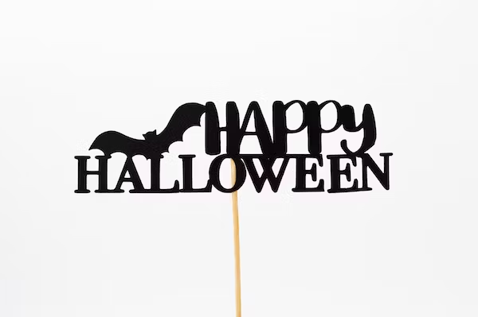
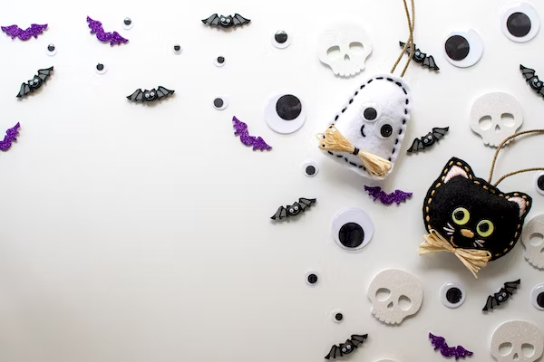
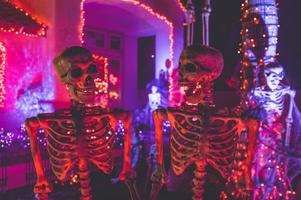
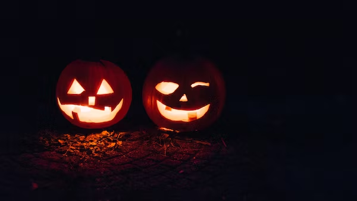

This article has been written and researched by our expert Loveable through a precise methodology. [Learn more about our methodology](https://avada.io/loveable/our-methodological.html)

[Loveable](https://avada.io/loveable/) > [Blog](https://avada.io/loveable/blog/) > [Holiday](https://avada.io/loveable/holiday/)

# 70+ Easy Halloween Craft Ideas for Kids to Stimulate Creativity

Written by [Blake Simpson](https://avada.io/loveable/author/blake/) Last Updated on August 30, 2023

- [Bat Halloween Crafts](https://avada.io/loveable/blog/easy-halloween-craft-ideas/#wp-block-heading-2-3) 
- [Black Cat Halloween Crafts](https://avada.io/loveable/blog/easy-halloween-craft-ideas/#wp-block-heading-2-21) 
- [Spider Halloween Crafts](https://avada.io/loveable/blog/easy-halloween-craft-ideas/#wp-block-heading-2-40) 
- [Ghost Halloween Crafts](https://avada.io/loveable/blog/easy-halloween-craft-ideas/#wp-block-heading-2-54) 
- [Pumpkin Halloween Crafts](https://avada.io/loveable/blog/easy-halloween-craft-ideas/#wp-block-heading-2-71)
- [Bottom Line](https://avada.io/loveable/blog/easy-halloween-craft-ideas/#wp-block-heading-2-95)

All children enjoy Halloween! And while getting a chance to snag their preferred Halloween treats is certainly the main motivation, we are confident they will also enjoy exercising their artistic muscles by preparing some Halloween crafts. With alternatives for children of all ages, including toddlers and teens (with the occasional adult helping to operate the hot-glue gun), this **collection of simple Halloween crafts for kids** will delight, inspire, and occupy them for hours.

With handmade cardboard monster puppets and joyful and festive Halloween finger puppets, the kids will have a blast performing a puppet show.  With the help of these homemade [Halloween costume ideas for kids](https://avada.io/loveable/halloween-costumes-for-kids/), they may create their own eerie ensemble. Alternatively, you could organize a party with lots of [Halloween party activities](https://avada.io/loveable/blog/kids-halloween-party/), assemble the family over a campfire to share some not-too-scary ghost tales, or schedule a family Halloween movie night. And the list below will be a great suggestion if you have not found the perfect Halloween crafts!

## **Bat Halloween Crafts** 

The holiday season is made more spooky and mysterious by bat crafts, which are ideal for adding a little Halloween enchantment to your décor and activities. These bat-inspired crafts are designed to delight and enthrall you, whether you’re looking to make enjoyable crafts with children or add spooky flair to your house. 

This assortment of bat-themed [Halloween crafts](https://avada.io/loveable/blog/easy-halloween-craft-ideas/) gives inventive and innovative ways to embrace the eerie fascination of these creatures of the night during the Halloween season, including paper crafts, lanterns, and more.

1. Bat Paper Lanterns
2. Balloon Garland Bat for Kids
3. Bat Wreath
4. Suncatchers Bat 
5. Headband Bat Craft
6. HalloweenBat Pop-up Card
7. Bat Cupcake Toppers
8. Origami bat Head
9. Halloween Bat Mason Jar Lanterns
10. Scary Bat Paper Plate Masks
11. Spooky Paper Bag Bat
12. Bat Wall Decals
13. Bat Handprint Art
14. Bat Pom-Pom Garland

## **Black Cat Halloween Crafts** 

You are invited to appreciate the magic and intrigue connected to these traditional holiday emblems by black cat crafts for Halloween. Black cats are the ideal subject matter for crafts with a Halloween theme, thanks to their svelte and enigmatic appearance. This assortment of black cat crafts offers a variety of imaginative ideas to add feline elegance to your Halloween celebrations. 

Whether you want to decorate your home[,](https://avada.io/loveable/blog/decorated-halloween-homes/) make unique costumes, or engage in entertaining activities with children, these are perfect choices. These black cat-inspired crafts, including paper crafts, decorations, and more, will surely bring a dash of whimsy and intrigue to your Halloween celebrations.

15. Black Cat Paper Lanterns
16. Cat Painted Rocks in Black
17. Haunted House Diorama With Black
18. Foam Masks for Black Cat
19. Black Cat Yarn Art
20. Finger Puppets Black Cat Shape
21. Black Paper Garland Kitty
22. Black Cat Bookmark
23. Halloween Cards Black Cat Image
24. Black Cat Clay Figurines
25. Bathtub Soap Black Cat Draft
26. Halloween Black Cat Tote Bag
27. Black Cat Paperclip Bookmarks
28. Black Cat Door Hanger
29. Black Cat Paper Fan Decorations

## **Spider Halloween Crafts** 

Spider Halloween Crafts will provide a frightening touch to your Halloween celebrations, so get caught up in the web of your own creativity. The frightening mood of Halloween is connected with spiders because of their eight limbs and elaborate webs. 

This assortment of spider-themed crafts provides a wide range of suggestions to help you turn your house, costumes, and events into a spooky refuge. These activities, ranging from spider decor and costumes to crafts inspired by spider webs, will create a captivating environment that perfectly captures the essence of Halloween’s beloved arachnid.

30. Spider Web Halloween Coasters
31. Web Soap for Spider
32. Halloween Spider Web Yarn Art
33. Scary Spider Web Napkin Rings
34. Horror Table Centerpiece  Spider Web 
35. Spider Web Treat Cups
36. Halloween Banner Printed Spider Web
37. Spider Web Luminaries
38. Spider Web String Art
39. Paper Plate Masks with Spider 
40. Spider Web Balloon Decorations

## **Ghost Halloween Crafts** 

With a variety of spine-chilling Halloween crafts, you may unleash your inner child this Halloween. These DIY suggestions can assist you in creating a spine-tingling ambiance for your Halloween celebrations, from frightening skeletons to spooky tombstones. 

This assortment of Halloween activities will lead you into a world of macabre imagination, whether you’re crafting frightful party favors, creating the perfect bone-chilling costume, or [decorating your haunted house](https://avada.io/loveable/blog/decorated-halloween-homes/). With these spooky crafts, you can embrace the eerie and let your creativity soar as you bring the spooky spirit of Halloween to life.

41. Cotton Ball Ghost Craft
42. Easy Fabric Ghosts 
43. Handprint Ghosts
44. Ghost Slime Jar
45. Paper Plate Ghosts
46. Ghost Window Clings
47. String White Ghost Lights
48. Ghost Paper Mache Bowls
49. Trick-or-Treat Bucket Ghost
50. Ghost Wall Decals
51. GhostT-Shirt Stencil
52. Hair Accessories with Ghost
53. Ghost Stained Glass Craft

## **Pumpkin Halloween Crafts**

Pumpkin Halloween Crafts will add a festive shine to your celebrations, so get ready to carve out some Halloween fun. These project suggestions will motivate you to advance your pumpkin decoration because pumpkins are linked with this cherished holiday. 

This assortment of crafts with a pumpkin theme offers a variety of artistic tasks for people of all ages, from pumpkin carving ideas to [pumpkin-inspired décor](https://avada.io/loveable/calabaza-halloween/) and sweets. These crafts will enable you to celebrate Halloween in a joyful and enjoyable way, whether you favor traditional jack-o-lanterns or want to experiment with one-of-a-kind and innovative pumpkin designs.

54. My Little Pumpkin Keepsake Craft
55. Paper Strip Pumpkins
56. Build your own Jack-O-Lantern 
57. Halloween Pumpkin Slime
58. Paper Plate Pumpkin Strips Craft
59. Jack-O-Lantern Jars 
60. Handprint Clay Pumpkins
61. Paper Pumpkin Craft
62. Witch Halloween Crafts
63. Chalkboard Pumpkin
64. Easy Fist Bumpkins Craft
65. Sock Pumpkin
66. Pumpkin Patch Art
67. Soda Bottle Pumpkins
68. Terra Cotta Pumpkins 
69. Wooden Craft Stick Pumpkins
70. Easy Rolled Paper Pumpkin

**SEE MORE:**

- Spooktacular [DIY Halloween Wreath](https://avada.io/loveable/diy-halloween-wreath/) Ideas

- [Easy Draw Halloween](https://avada.io/loveable/easy-draw-halloween/) – Typical Halloween Characters to Draw

## Bottom Line

To conclude, these Halloween crafts provide kids countless chances to expand their imaginations and express their original ideas, from easy paper crafts to eerie décor and costumes. Halloween crafts encourage youngsters’ fine motor skills, problem-solving capacity, and sense of success as they watch their creations come to life. They also provide delight and excitement.

These **Halloween crafts ideas** give countless opportunities for kids to participate in hands-on activities and make priceless memories, whether they make a vibrant paper pumpkin, a terrifying ghost, or their own trick-or-treat bag. By introducing your children to the realm of crafting, where they may turn common materials into unique masterpieces, you can encourage them to embrace the Halloween spirit. Watch as their creativity soars in the enchanted world of Halloween crafts as they are free to let their imaginations run wild.

- [Bat Halloween Crafts](https://avada.io/loveable/blog/easy-halloween-craft-ideas/#wp-block-heading-2-3) 
- [Black Cat Halloween Crafts](https://avada.io/loveable/blog/easy-halloween-craft-ideas/#wp-block-heading-2-21) 
- [Spider Halloween Crafts](https://avada.io/loveable/blog/easy-halloween-craft-ideas/#wp-block-heading-2-40) 
- [Ghost Halloween Crafts](https://avada.io/loveable/blog/easy-halloween-craft-ideas/#wp-block-heading-2-54) 
- [Pumpkin Halloween Crafts](https://avada.io/loveable/blog/easy-halloween-craft-ideas/#wp-block-heading-2-71)
- [Bottom Line](https://avada.io/loveable/blog/easy-halloween-craft-ideas/#wp-block-heading-2-95)

### [Blake Simpson](https://avada.io/loveable/author/blake/)

Hi, I'm Blake from Loveable. I help people find perfect gifts for occasions like anniversaries and weddings. I also write a blog about holidays, sharing insights to make them more meaningful. Let's create unforgettable moments together!

- [Twitter](https://twitter.com/intent/tweet)
- [Facebook](https://www.facebook.com/sharer/sharer.php)
- [instagram](https://avada.io/loveable/blog/easy-halloween-craft-ideas/)
- [pinterest](https://www.pinterest.com/loveablellc/)

## Related Posts

[### 120+ Christian Birthday Wishes To Spread Your Love](https://avada.io/loveable/blog/christian-birthday-wishes/) 

[

### 35 Best 70th Birthday Ideas To Celebrate The Special Milestone

](https://avada.io/loveable/blog/70th-birthday-ideas/)

[

### 50 Best 30th Birthday Decorations for a Remarkable Birthday Bash

](https://avada.io/loveable/blog/30th-birthday-decorations/)

[

### 40 Delicious Vegan Christmas Desserts to Delight Your Palate

](https://avada.io/loveable/blog/vegan-christmas-desserts/)

[

### 60 Christmas Team Building Activities to Boost Workplace Spirit

](https://avada.io/loveable/blog/christmas-team-building-activities/)
