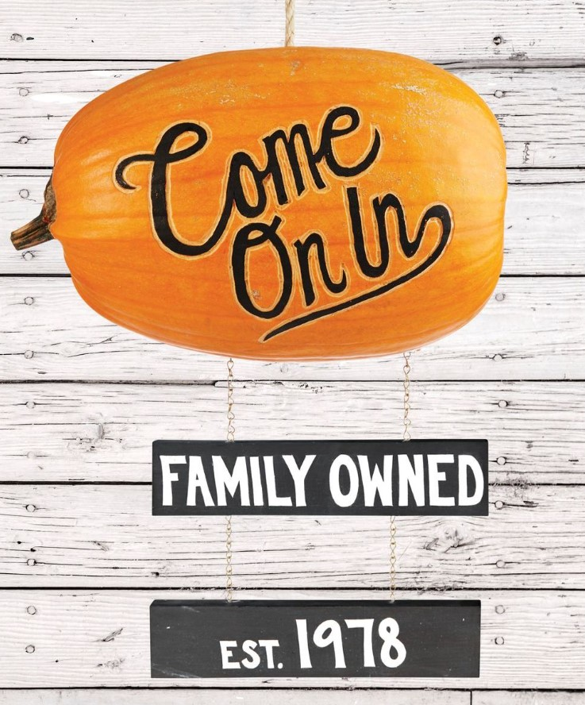
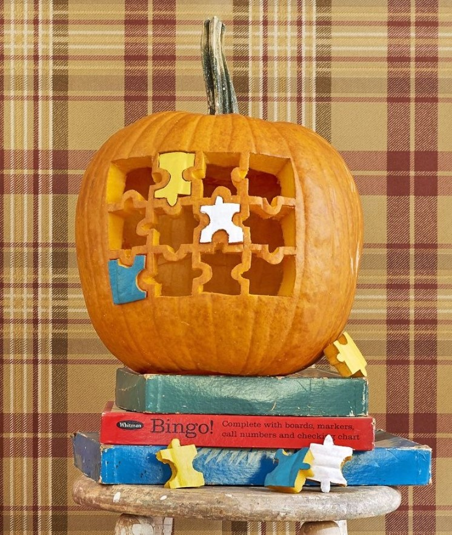
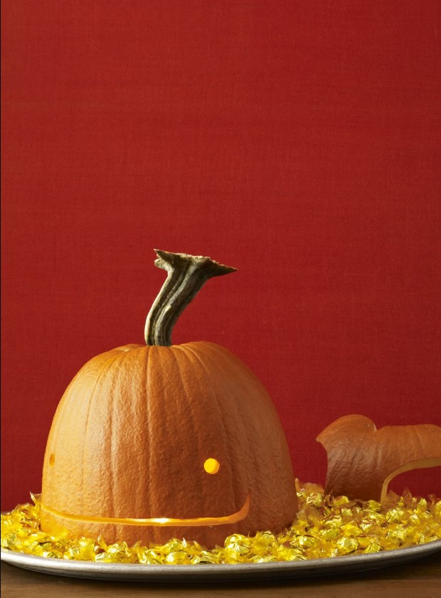

This article has been written and researched by our expert Loveable through a precise methodology. [Learn more about our methodology](https://avada.io/loveable/our-methodological.html)

[Loveable](https://avada.io/loveable/) > [Blog](https://avada.io/loveable/blog/) > [Holiday](https://avada.io/loveable/holiday/)

# 70+ Halloween Pumpkin Carving Ideas For 2023

Written by [Blake Simpson](https://avada.io/loveable/author/blake/) Last Updated on August 07, 2023

- [Best Creative Pumpkin Carving Ideas](https://avada.io/loveable/blog/halloween-pumpkin/#wp-block-heading-2-4)
    - [1\. Zombie Pumpkin](https://avada.io/loveable/blog/halloween-pumpkin/#wp-block-heading-3-6)
    - [2\. Puking Pumpkin](https://avada.io/loveable/blog/halloween-pumpkin/#wp-block-heading-3-9)
    - [3\. Eyeball Pumpkin](https://avada.io/loveable/blog/halloween-pumpkin/#wp-block-heading-3-12)
    - [4\. Cottage Pumpkin](https://avada.io/loveable/blog/halloween-pumpkin/#wp-block-heading-3-15)
    - [5\. Instagram Pumpkin](https://avada.io/loveable/blog/halloween-pumpkin/#wp-block-heading-3-18)
    - [6\. Baby Yoda Pumpkin](https://avada.io/loveable/blog/halloween-pumpkin/#wp-block-heading-3-21)
    - [7\. Thorny Pumpkin](https://avada.io/loveable/blog/halloween-pumpkin/#wp-block-heading-3-24)
    - [8\. Mickey Mouse Pumpkin](https://avada.io/loveable/blog/halloween-pumpkin/#wp-block-heading-3-27)
    - [9\. Be Kind Pumpkin](https://avada.io/loveable/blog/halloween-pumpkin/#wp-block-heading-3-30)
    - [10\. Scared Pumpkin](https://avada.io/loveable/blog/halloween-pumpkin/#wp-block-heading-3-33)
    - [11\. Impaled Fence Pumpkins](https://avada.io/loveable/blog/halloween-pumpkin/#wp-block-heading-3-36)
    - [12\. Cute Cat Pumpkin](https://avada.io/loveable/blog/halloween-pumpkin/#wp-block-heading-3-39)
    - [13\. Black Spray-Painted Pumpkin](https://avada.io/loveable/blog/halloween-pumpkin/#wp-block-heading-3-42)
    - [14\. RV Pumpkin](https://avada.io/loveable/blog/halloween-pumpkin/#wp-block-heading-3-45)
    - [15\. Pineapple Pumpkin](https://avada.io/loveable/blog/halloween-pumpkin/#wp-block-heading-3-48)
    - [16\. Ceramic-Inspired Pumpkins](https://avada.io/loveable/blog/halloween-pumpkin/#wp-block-heading-3-51)
    - [17\. Skull Pumpkin](https://avada.io/loveable/blog/halloween-pumpkin/#wp-block-heading-3-54)
    - [18\. Modern Cat Pumpkin](https://avada.io/loveable/blog/halloween-pumpkin/#wp-block-heading-3-57)
    - [19\. Toothy Grin Pumpkin](https://avada.io/loveable/blog/halloween-pumpkin/#wp-block-heading-3-60)
    - [20\. Witch’s Brew Pumpkin](https://avada.io/loveable/blog/halloween-pumpkin/#wp-block-heading-3-63)
- [Best Easy and Cute Halloween Pumpkin Carving Ideas](https://avada.io/loveable/blog/halloween-pumpkin/#wp-block-heading-2-66)
    - [1\. Haunted Jack-o’-Lantern Village](https://avada.io/loveable/blog/halloween-pumpkin/#wp-block-heading-3-68)
    - [2\. Pumpkin Sign](https://avada.io/loveable/blog/halloween-pumpkin/#wp-block-heading-3-71)
    - [3\. Skeleton Hand Jack-o’-Lantern](https://avada.io/loveable/blog/halloween-pumpkin/#wp-block-heading-3-75)
    - [4\. Big Dipper Pumpkin](https://avada.io/loveable/blog/halloween-pumpkin/#wp-block-heading-3-78)
    - [5\. Pumpkin Barrel](https://avada.io/loveable/blog/halloween-pumpkin/#wp-block-heading-3-81)
    - [6\. Cross-Stitch Pumpkins](https://avada.io/loveable/blog/halloween-pumpkin/#wp-block-heading-3-84)
    - [7\. Sunflower Pumpkin Stacks](https://avada.io/loveable/blog/halloween-pumpkin/#wp-block-heading-3-87)
    - [8\. Vintage Pumpkin Truck](https://avada.io/loveable/blog/halloween-pumpkin/#wp-block-heading-3-90)
    - [9\. Jigsaw Pumpkin](https://avada.io/loveable/blog/halloween-pumpkin/#wp-block-heading-3-93)
    - [10\. Hen and Chicks Pumpkins](https://avada.io/loveable/blog/halloween-pumpkin/#wp-block-heading-3-96)
    - [11\. Wood-Burning Stove Pumpkin](https://avada.io/loveable/blog/halloween-pumpkin/#wp-block-heading-3-99)
    - [12\. Pumpkin Marquee](https://avada.io/loveable/blog/halloween-pumpkin/#wp-block-heading-3-102)
    - [13\. Cemetery Pumpkin Diorama](https://avada.io/loveable/blog/halloween-pumpkin/#wp-block-heading-3-105)
    - [14\. Bean Bag Toss Pumpkins](https://avada.io/loveable/blog/halloween-pumpkin/#wp-block-heading-3-108)
    - [15\. Pumpkin Candy Dispenser](https://avada.io/loveable/blog/halloween-pumpkin/#wp-block-heading-3-111)
    - [16\. Honeycomb Pumpkin](https://avada.io/loveable/blog/halloween-pumpkin/#wp-block-heading-3-114)
    - [17\. Mason Jar Pumpkin](https://avada.io/loveable/blog/halloween-pumpkin/#wp-block-heading-3-117)
    - [18\. Night Sky Pumpkins](https://avada.io/loveable/blog/halloween-pumpkin/#wp-block-heading-3-120)
    - [19\. Painted Faux-Bois Pumpkin](https://avada.io/loveable/blog/halloween-pumpkin/#wp-block-heading-3-123)
    - [20\. Pumpkin Fairy House](https://avada.io/loveable/blog/halloween-pumpkin/#wp-block-heading-3-126)
    - [21\. Apothecary Jar Pumpkins](https://avada.io/loveable/blog/halloween-pumpkin/#wp-block-heading-3-129)
    - [22\. Jack-o’-lantern Masquerade Ball](https://avada.io/loveable/blog/halloween-pumpkin/#wp-block-heading-3-132)
    - [23\. Easy Twinkling Dots Pumpkin](https://avada.io/loveable/blog/halloween-pumpkin/#wp-block-heading-3-135)
    - [24\. Sweet Scarecrow Pumpkin](https://avada.io/loveable/blog/halloween-pumpkin/#wp-block-heading-3-137)
    - [25\. Silly Witch Pumpkin](https://avada.io/loveable/blog/halloween-pumpkin/#wp-block-heading-3-140)
    - [26\. Owl Family Pumpkins](https://avada.io/loveable/blog/halloween-pumpkin/#wp-block-heading-3-143)
    - [27\. Thirsty Vampire Pumpkin](https://avada.io/loveable/blog/halloween-pumpkin/#wp-block-heading-3-146)
    - [28\. Thorny Vines Pumpkin](https://avada.io/loveable/blog/halloween-pumpkin/#wp-block-heading-3-148)
    - [29\. Lollipop Pumpkin](https://avada.io/loveable/blog/halloween-pumpkin/#wp-block-heading-3-150)
    - [30\. Lamp Jack-o’-Lanterns](https://avada.io/loveable/blog/halloween-pumpkin/#wp-block-heading-3-153)
    - [31\. Fox Pumpkin](https://avada.io/loveable/blog/halloween-pumpkin/#wp-block-heading-3-156)
    - [32\. Mummy Pumpkin](https://avada.io/loveable/blog/halloween-pumpkin/#wp-block-heading-3-159)
    - [34\. Crescent Moon Pumpkin](https://avada.io/loveable/blog/halloween-pumpkin/#wp-block-heading-3-162)
    - [35\. Happy Haunters Pumpkins](https://avada.io/loveable/blog/halloween-pumpkin/#wp-block-heading-3-165)
    - [36\. Pumpkin Basket](https://avada.io/loveable/blog/halloween-pumpkin/#wp-block-heading-3-168)
    - [37\. Smiling Face Pumpkins](https://avada.io/loveable/blog/halloween-pumpkin/#wp-block-heading-3-171)
    - [38\. Roaring Hearth Pumpkins](https://avada.io/loveable/blog/halloween-pumpkin/#wp-block-heading-3-174)
    - [39\. Masked Pumpkin](https://avada.io/loveable/blog/halloween-pumpkin/#wp-block-heading-3-177)
    - [40\. Porcupine Pumpkin](https://avada.io/loveable/blog/halloween-pumpkin/#wp-block-heading-3-180)
    - [41\. Scarecrow Pumpkin](https://avada.io/loveable/blog/halloween-pumpkin/#wp-block-heading-3-183)
    - [42\. Cat Drilled Pumpkin](https://avada.io/loveable/blog/halloween-pumpkin/#wp-block-heading-3-186)
    - [43\. Terrazzo Pumpkins](https://avada.io/loveable/blog/halloween-pumpkin/#wp-block-heading-3-189)
- [Best Fun Halloween Pumpkin Carving Ideas](https://avada.io/loveable/blog/halloween-pumpkin/#wp-block-heading-2-192)
    - [1\. Little Miss Curlicue](https://avada.io/loveable/blog/halloween-pumpkin/#wp-block-heading-3-194)
    - [2\. A Smooch for You](https://avada.io/loveable/blog/halloween-pumpkin/#wp-block-heading-3-197)
    - [3\. Jester Pumpkin](https://avada.io/loveable/blog/halloween-pumpkin/#wp-block-heading-3-200)
    - [4\. Batty Pumpkin](https://avada.io/loveable/blog/halloween-pumpkin/#wp-block-heading-3-203)
    - [5\. Eyes Wide Shut](https://avada.io/loveable/blog/halloween-pumpkin/#wp-block-heading-3-206)
    - [6\. Eyes On Me Pumpkin](https://avada.io/loveable/blog/halloween-pumpkin/#wp-block-heading-3-209)
    - [7\. Witch Legs Pumpkin](https://avada.io/loveable/blog/halloween-pumpkin/#wp-block-heading-3-212)
    - [8\. Fantastic Fox](https://avada.io/loveable/blog/halloween-pumpkin/#wp-block-heading-3-215)
    - [9\. Whale of a Time](https://avada.io/loveable/blog/halloween-pumpkin/#wp-block-heading-3-218)
    - [10\. Pumpkin Cooler](https://avada.io/loveable/blog/halloween-pumpkin/#wp-block-heading-3-221)
    - [11\. Spiderweb Pumpkin](https://avada.io/loveable/blog/halloween-pumpkin/#wp-block-heading-3-224)
    - [12\. Warts and All](https://avada.io/loveable/blog/halloween-pumpkin/#wp-block-heading-3-227)
    - [13\. The Cat’s Meow Pumpkin](https://avada.io/loveable/blog/halloween-pumpkin/#wp-block-heading-3-230)
    - [14\. All Wrapped Up Mummy Pumpkin](https://avada.io/loveable/blog/halloween-pumpkin/#wp-block-heading-3-233)
    - [15\. Absolutely Radishing](https://avada.io/loveable/blog/halloween-pumpkin/#wp-block-heading-3-237)
- [Bottom Line](https://avada.io/loveable/blog/halloween-pumpkin/#wp-block-heading-2-243)

Halloween, a beloved and spooky holiday celebrated on the eve of October 31st, brings with it a myriad of fascinating traditions and customs. Among the most iconic symbols of this festive occasion is the Halloween pumpkin, which takes center stage as a canvas for creative expression. Pumpkin carving has evolved into an art form, captivating both the young and old alike, and giving rise to a vast array of Halloween pumpkin carving ideas that ignite the spirit of the season.

From eerie faces to intricate designs, these innovative concepts have become an essential part of the Halloween experience, adding a touch of ghoulish delight to doorsteps and gatherings everywhere. The art of pumpkin carving has come a long way from simple, traditional jack-o’-lantern faces.

Today, the possibilities are boundless, with an astonishing assortment of Halloween pumpkin ideas to suit all tastes and skill levels. From classic spooky faces that evoke a sense of nostalgia to intricate designs inspired by popular culture, movies, and folklore, enthusiasts can channel their creativity and bring their visions to life on the canvas of these enchanting pumpkins. Now, take no more hesitation to explore **the best Halloween pumpkin ideas** to take your day to the next level.

## **Best Creative Pumpkin Carving Ideas**

These Halloween pumpkin carving ideas are just the beginning of the endless possibilities for creative expression during this bewitching holiday. From the spookily surreal to the heartwarming and humorous, these pumpkin designs allow you to showcase your artistic flair and add a personal touch to your Halloween festivities. So, grab your carving tools, let your imagination guide you, and get ready to illuminate the night with these fantastic pumpkin creations!

### **1\. Zombie Pumpkin**

Step into the realm of the undead with the hair-raising “Zombie Pumpkin” carving idea that will leave your Halloween guests in awe and fear. This eerie design takes pumpkin carving to a whole new level by transforming an ordinary pumpkin into a menacing and flesh-eating creature straight out of a horror movie.

### **2**. **Puking Pumpkin**

If you’re looking to add a touch of gross humor to your Halloween decor, the “Puking Pumpkin” carving idea is just what you need. This delightfully revolting design features a carved mouth with a messy, drippy effect, as if the pumpkin is regurgitating its own seeds and pulp. The comical twist on traditional pumpkin carving is sure to bring laughter and amusement to your Halloween gatherings.

### **3\. Eyeball Pumpkin**

Infuse an element of creepy fascination into your Halloween decorations with the mesmerizing “Eyeball Pumpkin” carving idea. This spine-chilling design involves skillfully carving large, lifelike eyes onto the pumpkin’s surface, giving it a watchful and haunting appearance.

### **4\. Cottage Pumpkin**

This whimsical design involves intricately carving windows, doors, and even chimneys onto the pumpkin’s surface, transforming it into a miniature pumpkin house. Add a warm glow from within, and the Cottage Pumpkin comes to life, radiating a welcoming and enchanting atmosphere. It’s the perfect centerpiece for your Halloween table or front porch, evoking a sense of nostalgia and celebrating the spirit of autumn. The Cottage Pumpkin is a celebration of the simple joys of life and the beauty of nature during the magical season of Halloween.

### **5\. Instagram Pumpkin**

Carve the iconic Instagram logo onto the pumpkin and create space for a personalized Halloween-themed hashtag. This creative design invites guests to take photos with the Instagram Pumpkin, encouraging them to share their Halloween experiences with a fun and social media-inspired twist. It’s an interactive and engaging addition to your Halloween decor that connects the virtual world with the physical, reminding everyone that moments of joy and celebration can be shared and celebrated both online and offline.

### **6\. Baby Yoda Pumpkin**

For Star Wars fans and lovers of all things adorable, the “Baby Yoda Pumpkin” carving idea is an absolute must-try. Capture the captivating essence of the beloved character, also known as Grogu, from the Mandalorian series. With oversized ears and wide, innocent eyes, the Baby Yoda Pumpkin becomes an endearing and heartwarming addition to your Halloween display.

### **7\. Thorny Pumpkin**

Inspired by the ethereal beauty of fairy tales and mystical realms, this captivating design involves intricately carving winding vines and thorns onto the pumpkin’s surface. The delicate and intricate patterns give the pumpkin an otherworldly appearance, as if it holds the secrets of an ancient and magical forest.

### **8\. Mickey Mouse Pumpkin**

Celebrate the magic of Disney and bring a touch of nostalgia to your Halloween festivities with the classic “Mickey Mouse Pumpkin” carving idea. Pay homage to the iconic and beloved cartoon character by skillfully carving Mickey’s unmistakable ears, large expressive eyes, and cheerful smile onto the pumpkin’s surface.

### **9\. Be Kind Pumpkin**

Amidst the spooky and eerie elements of Halloween, the “Be Kind Pumpkin” carving idea brings a meaningful and heartwarming touch to your seasonal decor. Carve the words “Be Kind” onto the pumpkin’s surface, accompanied by cheerful designs like hearts or flowers. This thoughtful and powerful message serves as a gentle reminder to embrace empathy, compassion, and kindness during the Halloween season and beyond.

### **10\. Scared Pumpkin**

Unleash your creativity and add a touch of lighthearted humor to your Halloween decorations with the “Scared Pumpkin” carving idea. Craft an expressive face onto the pumpkin, conveying a look of utter fright or surprise. The wide-eyed expression and comically raised eyebrows evoke a sense of playful surprise, as if the pumpkin itself is startled by the spooky happenings of the season.

### **11\. Impaled Fence Pumpkins**

For a truly haunting display, consider the spine-chilling “Impaled Fence Pumpkins” carving idea. Crafted to create an eerie scene, this design involves arranging several pumpkins on wooden stakes, as if they have been impaled on a sinister fence. Each pumpkin features a unique and expressive face, adding to the macabre ambiance.

### **12\. Cute Cat Pumpkin**

Embrace the adorably bewitching charm of the “Cute Cat Pumpkin” carving idea. This delightful design brings the playful spirit of a feline friend to your Halloween decor. Carve endearing cat ears, whiskers, and a heartwarming smile onto the pumpkin’s surface, capturing the essence of a mischievous kitty.

### **13\. Black Spray-Painted Pumpkin**

For a chic and stylish twist on traditional pumpkin carving, the “Black Spray-Painted Pumpkin” idea is a must-try. Elevate your decor with a touch of elegance by spray-painting your pumpkin in a sleek black hue. You can leave it as a minimalist statement piece or carve intricate patterns onto its dark canvas to create a striking contrast. The Black Spray-Painted Pumpkin exudes a sophisticated allure that complements modern and upscale Halloween settings.

### **14\. RV Pumpkin**

Hit the road to a spook-tastic adventure with the whimsical “RV Pumpkin” carving idea. Recreate the charm of a vintage camper on your pumpkin canvas, complete with windows, wheels, and even a little door. This playful design adds a touch of wanderlust and nostalgia to your Halloween decorations, reminding us that the holiday spirit can be enjoyed even on the go. Park the RV Pumpkin among your other pumpkin creations for a delightful and unexpected surprise.

### **15\. Pineapple Pumpkin**

Bring a tropical twist to your Halloween festivities with the “Pineapple Pumpkin” carving idea. Carve the iconic diamond pattern onto the pumpkin’s surface, mimicking the texture of a real pineapple. The Pineapple Pumpkin is a delightful departure from traditional designs, infusing a dose of summer fun into the spooky season.

### **16\. Ceramic-Inspired Pumpkins**

Elevate your pumpkin carving skills with the elegant “Ceramic-Inspired Pumpkins” idea. Taking inspiration from delicate ceramic pottery, this carving style involves intricate patterns and geometric motifs etched onto the pumpkin’s surface. The result is a stunning and sophisticated pumpkin masterpiece, reminiscent of fine art. Display the Ceramic-Inspired Pumpkins as the focal point of your Halloween setup, celebrating the beauty of craftsmanship and the artistry of the season.

### **17\. Skull Pumpkin**

Unleash the eerie charm of the “Skull Pumpkin” carving idea, a hauntingly captivating design that pays homage to the realm of the dead. With intricate carvings mimicking bones and skeletal features, this macabre creation exudes an air of mystery and spookiness. Illuminate it with candles or LED lights to cast haunting shadows, transforming any space into a bone-chilling Halloween scene that will leave a lasting impression on your guests.

### **18\. Modern Cat Pumpkin**

Celebrate the sleek and contemporary with the “Modern Cat Pumpkin” carving idea. Embrace clean lines and minimalist design as you carve a sophisticated cat silhouette onto the pumpkin’s surface. This elegant creation adds a touch of modern flair to your Halloween decorations, making it a chic centerpiece for your seasonal display. The Modern Cat Pumpkin is a perfect blend of simplicity and creativity, leaving an understated yet stylish mark on your Halloween celebrations.

### **19\. Toothy Grin Pumpkin**

Infuse your Halloween festivities with a healthy dose of humor using the “Toothy Grin Pumpkin” carving idea. Carve a wide, hilarious grin onto the pumpkin’s face, revealing a row of whimsical teeth that add a playful touch. This lighthearted design is sure to bring smiles and laughter to anyone who encounters it, spreading joy and delight throughout the holiday season.

### **20\. Witch’s Brew Pumpkin**

Concoct a bewitching potion with the “Witch’s Brew Pumpkin” carving idea. Transform your pumpkin into a cauldron brimming with bubbling green potion, complete with mysterious ingredients and magical symbols carved onto its surface. Place a fog machine or dry ice inside the pumpkin to create an eerie, smoky effect, giving the illusion of a witch’s potion coming to life. The Witch’s Brew Pumpkin is an enchanting addition to any Halloween setting, adding a touch of sorcery and enchantment to the spooky festivities.

## **Best Easy and Cute Halloween Pumpkin Carving Ideas**

These best easy and cute Halloween pumpkin carving ideas” offer an enchanting array of creative and imaginative options to make your Halloween celebrations truly special. Each idea brings its own unique charm and personality, making it easy to find the perfect pumpkin carving project to suit your style and taste. From charming villages and vintage trucks to celestial wonders and heartwarming family scenes, these pumpkin carving ideas are sure to impress and delight all who encounter them. So, gather your carving tools and let your creativity shine as you embark on a pumpkin carving adventure that will illuminate the night with wonder, joy, and the magic of Halloween.

### **1\. Haunted Jack-o’-Lantern Village**

As the sun sets and darkness descends, the Haunted Jack-o’-Lantern Village comes alive with an enchanting radiance that captures the attention of passersby and becomes a focal point of your Halloween decorations. Trick-or-treaters will be delighted by the whimsical and spooky charm of the village, as it adds a touch of magic and wonder to your festive display.

### **2\. Pumpkin Sign**

Once the Pumpkin Sign is complete, attach it to a sturdy wooden stake or a post for easy placement in your front yard or at the entrance of your Halloween party. The Pumpkin Sign serves as a friendly and inviting welcome, guiding guests and trick-or-treaters to the heart of your Halloween festivities.

**Related:** Best [Halloween Yard Decorations](https://avada.io/loveable/halloween-yard-decorations/)

### **3\. Skeleton Hand Jack-o’-Lantern**

To achieve this spine-chilling effect, consider using wire or wooden dowels to create the illusion of a skeletal hand. Place the hand so that it appears to be supporting the pumpkin, as if it’s rising from the depths of the earth.

### **4\. Big Dipper Pumpkin**

The Big Dipper Pumpkin is perfect for astronomy enthusiasts and nature lovers who wish to bring a touch of the cosmos into their Halloween decor. It is also an educational and captivating way to teach kids about the wonders of the night sky.

### **5\. Pumpkin Barrel**

Transport your Halloween decor to a rustic and charming harvest scene with the delightful “Pumpkin Barrel” carving idea that captures the essence of an abundant autumn harvest. This concept involves selecting a large pumpkin and skillfully carving it to resemble a wooden barrel.

### **6\. Cross-Stitch Pumpkins**

Combine the art of cross-stitching with the joy of pumpkin carving for the delightful and crafty “Cross-Stitch Pumpkins” carving idea. This unique concept offers a fresh and artistic twist on traditional pumpkin carving, creating a stunning and intricate pumpkin design that resembles a handcrafted cross-stitch masterpiece.

### **7\. Sunflower Pumpkin Stacks**

To add an extra touch of authenticity, consider placing real sunflower blooms or silk sunflower petals on the top pumpkin. The Sunflower Pumpkin Stacks exude a joyful and vibrant aura, reminding everyone of the beauty and warmth of the season.

### **8\. Vintage Pumpkin Truck**

The Vintage Pumpkin Truck exudes old-world charm and invites everyone to hop aboard and take a trip down memory lane. Display it on your front porch or as part of a vintage-themed Halloween party, and watch as it becomes a charming focal point of your seasonal decor. This unique and endearing pumpkin carving idea captures the magic of nostalgia and the joy of simpler times, celebrating the spirit of the season with a touch of whimsy and delight.

### **9\. Jigsaw Pumpkin**

The Jigsaw Pumpkin is a fun and interactive addition to your Halloween decor, inviting guests to piece together the mystery and unlock the enchantment within. This unique and playful carving idea encourages laughter and engagement, making it an ideal choice for families and Halloween parties. As the completed image comes into view, everyone will be delighted by the surprise and creativity of the Jigsaw Pumpkin, adding an element of puzzle-solving fun to your festive celebrations.

### **10\. Hen and Chicks Pumpkins**

Arrange the “chicks” around the “hen” pumpkin, creating a heartwarming family scene that symbolizes the bonds of love and unity. This delightful display celebrates the spirit of togetherness during the festive season, reminding everyone of the importance of family and the joy of companionship. The Hen and Chicks Pumpkins serve as a tender and heartwarming addition to your Halloween decor, capturing the essence of love and nurturing during this magical time of year.

### **11\. Wood-Burning Stove Pumpkin**

Add a rustic and cozy touch to your Halloween decor with the creative “Wood-Burning Stove Pumpkin” carving idea. This charming concept takes pumpkin carving to a whole new level by transforming the pumpkin into a miniature wood-burning stove. Carve realistic details such as a stovepipe, a door with knobs, and even logs inside the stove. To enhance the effect, paint the pumpkin in warm and earthy tones, resembling the look of aged wood.

### **12\. Pumpkin Marquee**

Light up the night with the dazzling “Pumpkin Marquee” carving idea that brings a touch of vintage glamour to your Halloween decor. This creative concept involves carving a large pumpkin and cutting out the letters of your desired word or phrase, such as “BOO” or “TRICK OR TREAT.” Place battery-operated LED lights or fairy lights inside the pumpkin, so they shine brightly through the cutout letters.

### **13\. Cemetery Pumpkin Diorama**

Step into the eerie world of the supernatural with our Cemetery Pumpkin Diorama carving idea. Create a hauntingly realistic scene by carving gravestones, spooky trees, and eerie silhouettes of ghostly figures into the pumpkins. Arrange the pumpkins in a diorama setting, resembling a haunted graveyard that will send shivers down everyone’s spine.

### **14\. Bean Bag Toss Pumpkins**

Combine fun and games with pumpkin carving using the entertaining “Bean Bag Toss Pumpkins” carving idea that guarantees laughter and excitement for all ages. Instead of traditional carving, create openings on the pumpkin’s surface in various shapes and sizes, each worth different points. Guests can take turns tossing bean bags into the openings, aiming for the highest score.

### **15\. Pumpkin Candy Dispenser**

Make trick-or-treating even more thrilling with the clever “Pumpkin Candy Dispenser” carving idea that delights young Halloween visitors. This fun concept involves carving a pumpkin with a wide opening at the top and a smaller opening at the bottom.

### **16\. Honeycomb Pumpkin**

Add a touch of nature-inspired elegance to your Halloween decor with the beautiful “Honeycomb Pumpkin” carving idea. This creative concept involves carving hexagonal shapes onto the pumpkin’s surface, mimicking the intricate patterns of a honeycomb.

### **17\. Mason Jar Pumpkin**

Combine rustic charm with a hint of vintage nostalgia with the delightful “Mason Jar Pumpkin” carving idea. This creative concept involves carving a pumpkin to resemble a classic mason jar, complete with a carved lid and glass jar details. Add a battery-operated LED tea light inside the pumpkin to create the illusion of a glowing jar.

### **18\. Night Sky Pumpkins**

This creative concept involves carving the silhouettes of stars, crescent moons, and other celestial motifs onto the pumpkin’s surface. When illuminated from within, the Night Sky Pumpkin casts a magical and dreamy glow that captures the allure of the cosmos.

### **19\. Painted Faux-Bois Pumpkin**

Instead of traditional carving, paint the pumpkin’s surface to resemble the look of faux bois (imitation wood grain). Use soft and natural colors to create the illusion of wood, adding depth and texture to the pumpkin’s exterior.

### **20\. Pumpkin Fairy House**

Bring a touch of enchantment and whimsy to your Halloween display with the magical “Pumpkin Fairy House” carving idea. This imaginative concept involves carving a pumpkin to resemble a miniature house, complete with windows, doors, and even a little chimney.

### **21\. Apothecary Jar Pumpkins**

Evoke the charm of a mysterious apothecary with the spellbinding “Apothecary Jar Pumpkins” carving idea that brings an aura of magic and curiosity to your Halloween decorations. Carve pumpkin designs to resemble ancient jars, each with a label denoting magical ingredients like “Eye of Newt” or “Witch’s Brew.”

### **22\. Jack-o’-lantern Masquerade Ball**

Get ready for a spooktacular Halloween celebration with our Jack-o’-lantern Masquerade Ball pumpkin carving idea! Unleash your creativity as you transform ordinary pumpkins into enchanting works of art. Carve intricate masks on the pumpkins to give them a mysterious and elegant appeal. Illuminate them with flickering candles, casting an ethereal glow over your Masquerade Ball setup.

### **23\. Easy Twinkling Dots Pumpkin**

Illuminate the night with the dazzling “Easy Twinkling Dots Pumpkin” carving idea that brings a touch of starry splendor to your Halloween display. This delightful concept involves carving small, evenly spaced holes in the pumpkin’s surface. Place battery-operated LED lights inside the pumpkin, and when lit, the dots emit a twinkling effect, reminiscent of a starry night sky.

### **24\. Sweet Scarecrow Pumpkin**

Embrace the charm of the harvest season with the endearing “Sweet Scarecrow Pumpkin” carving idea that adds a touch of rural whimsy to your Halloween decor. Carve a traditional jack-o’-lantern face on the pumpkin and then add a scarecrow hat and a straw-filled shirt to transform it into a friendly and lovable scarecrow.

### **25\. Silly Witch Pumpkin**

Instead of the traditional spooky and scary witches, create a comical and quirky witch face on the pumpkin, complete with a crooked nose, a big grin, and oversized hat.

### **26\. Owl Family Pumpkins**

The Owl Family Pumpkins exude a sense of warmth and togetherness, symbolizing the bonds of family and friendship.

### **27\. Thirsty Vampire Pumpkin**

### **28\. Thorny Vines Pumpkin**

### **29\. Lollipop Pumpkin**

Delight the young and young-at-heart with the charming “Lollipop Pumpkin” carving idea that brings a touch of sweetness to your Halloween display. Instead of traditional carving, create circular openings on the pumpkin’s surface to resemble lollipops. Paint the openings in vibrant colors, mimicking the look of delicious candies.

### **30\. Lamp Jack-o’-Lanterns**

Add a touch of vintage charm to your Halloween decorations with the delightful “Lamp Jack-o’-Lanterns” carving idea. This creative concept involves carving pumpkins to resemble vintage-style lamps, complete with intricate designs and patterns.

### **31\. Fox Pumpkin**

Embrace the beauty of the animal kingdom with the endearing “Fox Pumpkin” carving idea that brings a touch of woodland charm to your Halloween decor. Carve the pumpkin to resemble a delightful fox face, complete with pointy ears and a sweet expression.

### **32\. Mummy Pumpkin**

This concept involves wrapping the pumpkin in strips of gauze or cheesecloth, leaving gaps to create the illusion of a mummy’s face.

### **34\. Crescent Moon Pumpkin**

The Crescent Moon Pumpkin exudes a sense of mystery and wonder, making it a captivating centerpiece for your Halloween display. Place it on your front porch or as part of a celestial-themed Halloween party, and watch as it becomes a focal point of admiration and fascination.

### **35\. Happy Haunters Pumpkins**

The Happy Haunters Pumpkins exude a sense of humor and camaraderie, making them a standout piece in your Halloween display.

### **36\. Pumpkin Basket**

The Pumpkin Basket becomes a delightful centerpiece of your Halloween display, inviting guests to indulge in the bountiful joys of the season. Fill it with smaller pumpkins, gourds, and colorful autumn leaves to complete the picturesque and abundant scene.

### **37\. Smiling Face Pumpkins**

The Smiling Face Pumpkins create an inviting and welcoming atmosphere, making them an ideal addition to a family-friendly Halloween party.

### **38\. Roaring Hearth Pumpkins**

The Roaring Hearth Pumpkins become a charming centerpiece for your Halloween display, evoking the sense of gathering around a crackling fire on a chilly autumn night. Whether placed indoors or on your front porch, this easy pumpkin carving idea adds a touch of rustic charm and comfort to your festive celebrations, as it invites guests to experience the cozy joys of the season.

### **39\. Masked Pumpkin**

The Masked Pumpkin exudes an aura of mystique and sophistication, making it a captivating centerpiece for your Halloween display. Whether placed on your front porch or as part of a themed masquerade Halloween party, this easy and unique pumpkin carving idea celebrates the allure of disguise and adds a touch of elegance to your festive celebrations.

### **40\. Porcupine Pumpkin**

The Porcupine Pumpkin exudes a sense of nature’s wonder and whimsy, making it a standout piece in your Halloween display. Whether displayed on your front porch or as part of a nature-themed Halloween party, this easy and cute pumpkin carving idea captures the essence of the wilderness and adds a touch of playful spirit to your festive celebrations.

### **41\. Scarecrow Pumpkin**

The Scarecrow Pumpkin exudes warmth and hospitality, making it a delightful centerpiece for your seasonal display. Whether placed on your front porch or as part of a harvest-themed Halloween party, this easy and cute pumpkin carving idea celebrates the spirit of autumn and invites guests to enjoy the bountiful joys of the season.

### **42\. Cat Drilled Pumpkin**

The Cat Drilled Pumpkin exudes a sense of mystery and allure, making it a captivating centerpiece for your Halloween display. Whether displayed indoors or on your front porch, this easy pumpkin carving idea casts a spell of fascination and adds a touch of enchantment to your festive celebrations, as it celebrates the captivating charm of cats and the magic of Halloween.

### **43\. Terrazzo Pumpkins**

The Terrazzo Pumpkins become stunning centerpieces for your Halloween display, showcasing the beauty of artistic craftsmanship. Whether displayed indoors or on your front porch, this easy pumpkin carving idea adds a touch of modern elegance and style to your festive celebrations, as it celebrates the beauty of art and creativity during the magical season.

## **Best Fun Halloween Pumpkin Carving Ideas**

These best fun Halloween pumpkin carving ideas” offer an enchanting array of creative and imaginative options to make your Halloween celebrations truly special. Each idea brings its own unique charm and personality, making it easy to find the perfect pumpkin carving project to suit your style and taste. Whether you opt for charming characters, playful designs, or spooky delights, these pumpkin carving ideas are sure to impress and delight all who encounter them. So, let your creativity shine as you embark on a pumpkin carving adventure that will add a touch of fun, laughter, and magic to your Halloween festivities.

### **1\. Little Miss Curlicue**

The Little Miss Curlicue pumpkin exudes a sense of innocent joy, making it a delightful addition to your Halloween display. Whether placed on your front porch or as part of a festive Halloween party, this fun pumpkin carving idea brings a sense of laughter and happiness to your seasonal celebrations, as it showcases the playful side of Halloween.

### **2\. A Smooch for You**

The A Smooch for You pumpkin adds a touch of affection and warmth to your Halloween display, making it a perfect gift for loved ones or a charming centerpiece for a romantic Halloween dinner. This fun and unique pumpkin carving idea celebrates the joy of togetherness and the spirit of love during the festive season.

### **3\. Jester Pumpkin**

The Jester Pumpkin exudes a sense of joy and merriment, making it a standout piece in your Halloween display. Whether displayed on your front porch or as part of a lively Halloween gathering, this fun pumpkin carving idea brings a sense of playfulness and humor to your seasonal celebrations, as it showcases the lighter side of Halloween’s spooky traditions.

### **4\. Batty Pumpkin**

The Batty Pumpkin creates an enchanting and haunting ambiance, making it an ideal addition to a Halloween party or a spooky-themed display. This fun and unique pumpkin carving idea celebrates the mysterious allure of bats and adds a touch of intrigue to your festive celebrations.

### **5\. Eyes Wide Shut**

The Eyes Wide Shut pumpkin exudes a sense of mystery and curiosity, making it a captivating centerpiece for your Halloween display. Whether placed indoors or on your front porch, this fun pumpkin carving idea adds a touch of intrigue and wonder to your festive celebrations, as it invites guests to encounter the unexpected during the magical season.

### **6\. Eyes On Me Pumpkin**

The Eyes On Me Pumpkin becomes a captivating and interactive addition to your Halloween display, inviting guests to explore its amusing and expressive features. This fun and unique pumpkin carving idea celebrate the joy of self-expression and adds a touch of lightheartedness to your seasonal celebrations, as it showcases the diverse and expressive nature of Halloween’s traditions.

### **7\. Witch Legs Pumpkin**

Add a touch of witchy charm and humor to your Halloween decorations with the delightful “Witch Legs Pumpkin” carving idea. This creative concept involves carving a witch’s face on the pumpkin and attaching doll legs and shoes to the bottom, creating the illusion of a witch peeking out from within.

### **8\. Fantastic Fox**

Embrace the beauty of nature with the endearing “Fantastic Fox” pumpkin carving idea that brings a touch of woodland charm to your Halloween decor. Carve the pumpkin to resemble a friendly and adorable fox face, complete with pointy ears and a sweet expression.

### **9\. Whale of a Time**

Celebrate the wonders of the deep blue sea with the delightful “Whale of a Time” pumpkin carving idea that brings a touch of aquatic charm to your Halloween decor. Carve the pumpkin to resemble a friendly and whimsical whale, complete with a big smile and cute fins.

### **10\. Pumpkin Cooler**

Add a touch of practicality and fun to your Halloween decor with the clever “Pumpkin Cooler” carving idea. This creative concept involves hollowing out a large pumpkin, lining it with a waterproof bag or container, and filling it with ice and your favorite beverages.

### **11\. Spiderweb Pumpkin**

Embrace the spooky charm of Halloween with the “Spiderweb Pumpkin” carving idea. This concept involves carving a spiderweb design onto the pumpkin’s surface, complete with a friendly spider perched on the web.

### **12\. Warts and All**

Add a touch of humor and whimsy to your Halloween decorations with the entertaining “Warts and All” pumpkin carving idea. This creative concept involves carving a traditional jack-o’-lantern face on the pumpkin and adding warts and moles using small seeds or beans.

### **13\. The Cat’s Meow Pumpkin**

Embrace the enchanting allure of feline grace with the endearing “The Cat’s Meow Pumpkin” carving idea that brings a touch of cat-like elegance to your display. Carve the pumpkin to resemble a charming cat face, complete with pointy ears and a mysterious expression.

### **14\. All Wrapped Up Mummy Pumpkin**

Add a touch of eerie charm to your Halloween decor with the hauntingly creative “All Wrapped Up Mummy Pumpkin” carving idea. This concept involves carving the pumpkin’s surface to resemble a mummy’s face, with gauze or cheesecloth draped over it to create the illusion of bandages.

The All Wrapped Up Mummy Pumpkin creates a spooky and mysterious ambiance, making it a captivating addition to a haunted house display or a Halloween party. This fun and unique pumpkin carving idea celebrate the allure of mummies and add a touch of eerie enchantment to your seasonal celebrations.

### **15\. Absolutely Radishing**

Celebrate the spirit of Halloween with the delightful “Absolutely Radishing” pumpkin carving idea that brings a touch of punny charm to your Halloween decor. This creative concept involves carving a pumpkin to resemble a radiant sun, with carved radishes surrounding it.

Related:

- Amazing [Halloween Tree Decorations](https://avada.io/loveable/halloween-tree-decorations/)

- Spooktacular [DIY Halloween Wreath](https://avada.io/loveable/diy-halloween-wreath/) Ideas

## **Bottom Line**

In conclusion, **Halloween pumpkin carving ideas** have evolved beyond the traditional spooky faces and have become a canvas for creativity, imagination, and self-expression. With a vast array of options available, enthusiasts can now transform ordinary pumpkins into extraordinary works of art that capture the essence of the Halloween spirit in unique and captivating ways. From cute and whimsical designs that bring smiles to faces, to eerie and haunting concepts that send shivers down spines, these Halloween pumpkin ideas offer something for everyone to enjoy.

Whether one chooses to craft a spooky jack-o’-lantern or a heartwarming pumpkin family, the tradition of pumpkin carving remains an integral part of Halloween celebrations, infusing homes and neighborhoods with the playful, mysterious, and magical spirit of the holiday. So, this Halloween, let your imagination run wild and embrace the joy of carving pumpkins to create unforgettable memories and bring the spirit of Halloween to life with your own unique touch of creativity and flair. Happy carving!

- [Best Creative Pumpkin Carving Ideas](https://avada.io/loveable/blog/halloween-pumpkin/#wp-block-heading-2-4)
    - [1\. Zombie Pumpkin](https://avada.io/loveable/blog/halloween-pumpkin/#wp-block-heading-3-6)
    - [2\. Puking Pumpkin](https://avada.io/loveable/blog/halloween-pumpkin/#wp-block-heading-3-9)
    - [3\. Eyeball Pumpkin](https://avada.io/loveable/blog/halloween-pumpkin/#wp-block-heading-3-12)
    - [4\. Cottage Pumpkin](https://avada.io/loveable/blog/halloween-pumpkin/#wp-block-heading-3-15)
    - [5\. Instagram Pumpkin](https://avada.io/loveable/blog/halloween-pumpkin/#wp-block-heading-3-18)
    - [6\. Baby Yoda Pumpkin](https://avada.io/loveable/blog/halloween-pumpkin/#wp-block-heading-3-21)
    - [7\. Thorny Pumpkin](https://avada.io/loveable/blog/halloween-pumpkin/#wp-block-heading-3-24)
    - [8\. Mickey Mouse Pumpkin](https://avada.io/loveable/blog/halloween-pumpkin/#wp-block-heading-3-27)
    - [9\. Be Kind Pumpkin](https://avada.io/loveable/blog/halloween-pumpkin/#wp-block-heading-3-30)
    - [10\. Scared Pumpkin](https://avada.io/loveable/blog/halloween-pumpkin/#wp-block-heading-3-33)
    - [11\. Impaled Fence Pumpkins](https://avada.io/loveable/blog/halloween-pumpkin/#wp-block-heading-3-36)
    - [12\. Cute Cat Pumpkin](https://avada.io/loveable/blog/halloween-pumpkin/#wp-block-heading-3-39)
    - [13\. Black Spray-Painted Pumpkin](https://avada.io/loveable/blog/halloween-pumpkin/#wp-block-heading-3-42)
    - [14\. RV Pumpkin](https://avada.io/loveable/blog/halloween-pumpkin/#wp-block-heading-3-45)
    - [15\. Pineapple Pumpkin](https://avada.io/loveable/blog/halloween-pumpkin/#wp-block-heading-3-48)
    - [16\. Ceramic-Inspired Pumpkins](https://avada.io/loveable/blog/halloween-pumpkin/#wp-block-heading-3-51)
    - [17\. Skull Pumpkin](https://avada.io/loveable/blog/halloween-pumpkin/#wp-block-heading-3-54)
    - [18\. Modern Cat Pumpkin](https://avada.io/loveable/blog/halloween-pumpkin/#wp-block-heading-3-57)
    - [19\. Toothy Grin Pumpkin](https://avada.io/loveable/blog/halloween-pumpkin/#wp-block-heading-3-60)
    - [20\. Witch’s Brew Pumpkin](https://avada.io/loveable/blog/halloween-pumpkin/#wp-block-heading-3-63)
- [Best Easy and Cute Halloween Pumpkin Carving Ideas](https://avada.io/loveable/blog/halloween-pumpkin/#wp-block-heading-2-66)
    - [1\. Haunted Jack-o’-Lantern Village](https://avada.io/loveable/blog/halloween-pumpkin/#wp-block-heading-3-68)
    - [2\. Pumpkin Sign](https://avada.io/loveable/blog/halloween-pumpkin/#wp-block-heading-3-71)
    - [3\. Skeleton Hand Jack-o’-Lantern](https://avada.io/loveable/blog/halloween-pumpkin/#wp-block-heading-3-75)
    - [4\. Big Dipper Pumpkin](https://avada.io/loveable/blog/halloween-pumpkin/#wp-block-heading-3-78)
    - [5\. Pumpkin Barrel](https://avada.io/loveable/blog/halloween-pumpkin/#wp-block-heading-3-81)
    - [6\. Cross-Stitch Pumpkins](https://avada.io/loveable/blog/halloween-pumpkin/#wp-block-heading-3-84)
    - [7\. Sunflower Pumpkin Stacks](https://avada.io/loveable/blog/halloween-pumpkin/#wp-block-heading-3-87)
    - [8\. Vintage Pumpkin Truck](https://avada.io/loveable/blog/halloween-pumpkin/#wp-block-heading-3-90)
    - [9\. Jigsaw Pumpkin](https://avada.io/loveable/blog/halloween-pumpkin/#wp-block-heading-3-93)
    - [10\. Hen and Chicks Pumpkins](https://avada.io/loveable/blog/halloween-pumpkin/#wp-block-heading-3-96)
    - [11\. Wood-Burning Stove Pumpkin](https://avada.io/loveable/blog/halloween-pumpkin/#wp-block-heading-3-99)
    - [12\. Pumpkin Marquee](https://avada.io/loveable/blog/halloween-pumpkin/#wp-block-heading-3-102)
    - [13\. Cemetery Pumpkin Diorama](https://avada.io/loveable/blog/halloween-pumpkin/#wp-block-heading-3-105)
    - [14\. Bean Bag Toss Pumpkins](https://avada.io/loveable/blog/halloween-pumpkin/#wp-block-heading-3-108)
    - [15\. Pumpkin Candy Dispenser](https://avada.io/loveable/blog/halloween-pumpkin/#wp-block-heading-3-111)
    - [16\. Honeycomb Pumpkin](https://avada.io/loveable/blog/halloween-pumpkin/#wp-block-heading-3-114)
    - [17\. Mason Jar Pumpkin](https://avada.io/loveable/blog/halloween-pumpkin/#wp-block-heading-3-117)
    - [18\. Night Sky Pumpkins](https://avada.io/loveable/blog/halloween-pumpkin/#wp-block-heading-3-120)
    - [19\. Painted Faux-Bois Pumpkin](https://avada.io/loveable/blog/halloween-pumpkin/#wp-block-heading-3-123)
    - [20\. Pumpkin Fairy House](https://avada.io/loveable/blog/halloween-pumpkin/#wp-block-heading-3-126)
    - [21\. Apothecary Jar Pumpkins](https://avada.io/loveable/blog/halloween-pumpkin/#wp-block-heading-3-129)
    - [22\. Jack-o’-lantern Masquerade Ball](https://avada.io/loveable/blog/halloween-pumpkin/#wp-block-heading-3-132)
    - [23\. Easy Twinkling Dots Pumpkin](https://avada.io/loveable/blog/halloween-pumpkin/#wp-block-heading-3-135)
    - [24\. Sweet Scarecrow Pumpkin](https://avada.io/loveable/blog/halloween-pumpkin/#wp-block-heading-3-137)
    - [25\. Silly Witch Pumpkin](https://avada.io/loveable/blog/halloween-pumpkin/#wp-block-heading-3-140)
    - [26\. Owl Family Pumpkins](https://avada.io/loveable/blog/halloween-pumpkin/#wp-block-heading-3-143)
    - [27\. Thirsty Vampire Pumpkin](https://avada.io/loveable/blog/halloween-pumpkin/#wp-block-heading-3-146)
    - [28\. Thorny Vines Pumpkin](https://avada.io/loveable/blog/halloween-pumpkin/#wp-block-heading-3-148)
    - [29\. Lollipop Pumpkin](https://avada.io/loveable/blog/halloween-pumpkin/#wp-block-heading-3-150)
    - [30\. Lamp Jack-o’-Lanterns](https://avada.io/loveable/blog/halloween-pumpkin/#wp-block-heading-3-153)
    - [31\. Fox Pumpkin](https://avada.io/loveable/blog/halloween-pumpkin/#wp-block-heading-3-156)
    - [32\. Mummy Pumpkin](https://avada.io/loveable/blog/halloween-pumpkin/#wp-block-heading-3-159)
    - [34\. Crescent Moon Pumpkin](https://avada.io/loveable/blog/halloween-pumpkin/#wp-block-heading-3-162)
    - [35\. Happy Haunters Pumpkins](https://avada.io/loveable/blog/halloween-pumpkin/#wp-block-heading-3-165)
    - [36\. Pumpkin Basket](https://avada.io/loveable/blog/halloween-pumpkin/#wp-block-heading-3-168)
    - [37\. Smiling Face Pumpkins](https://avada.io/loveable/blog/halloween-pumpkin/#wp-block-heading-3-171)
    - [38\. Roaring Hearth Pumpkins](https://avada.io/loveable/blog/halloween-pumpkin/#wp-block-heading-3-174)
    - [39\. Masked Pumpkin](https://avada.io/loveable/blog/halloween-pumpkin/#wp-block-heading-3-177)
    - [40\. Porcupine Pumpkin](https://avada.io/loveable/blog/halloween-pumpkin/#wp-block-heading-3-180)
    - [41\. Scarecrow Pumpkin](https://avada.io/loveable/blog/halloween-pumpkin/#wp-block-heading-3-183)
    - [42\. Cat Drilled Pumpkin](https://avada.io/loveable/blog/halloween-pumpkin/#wp-block-heading-3-186)
    - [43\. Terrazzo Pumpkins](https://avada.io/loveable/blog/halloween-pumpkin/#wp-block-heading-3-189)
- [Best Fun Halloween Pumpkin Carving Ideas](https://avada.io/loveable/blog/halloween-pumpkin/#wp-block-heading-2-192)
    - [1\. Little Miss Curlicue](https://avada.io/loveable/blog/halloween-pumpkin/#wp-block-heading-3-194)
    - [2\. A Smooch for You](https://avada.io/loveable/blog/halloween-pumpkin/#wp-block-heading-3-197)
    - [3\. Jester Pumpkin](https://avada.io/loveable/blog/halloween-pumpkin/#wp-block-heading-3-200)
    - [4\. Batty Pumpkin](https://avada.io/loveable/blog/halloween-pumpkin/#wp-block-heading-3-203)
    - [5\. Eyes Wide Shut](https://avada.io/loveable/blog/halloween-pumpkin/#wp-block-heading-3-206)
    - [6\. Eyes On Me Pumpkin](https://avada.io/loveable/blog/halloween-pumpkin/#wp-block-heading-3-209)
    - [7\. Witch Legs Pumpkin](https://avada.io/loveable/blog/halloween-pumpkin/#wp-block-heading-3-212)
    - [8\. Fantastic Fox](https://avada.io/loveable/blog/halloween-pumpkin/#wp-block-heading-3-215)
    - [9\. Whale of a Time](https://avada.io/loveable/blog/halloween-pumpkin/#wp-block-heading-3-218)
    - [10\. Pumpkin Cooler](https://avada.io/loveable/blog/halloween-pumpkin/#wp-block-heading-3-221)
    - [11\. Spiderweb Pumpkin](https://avada.io/loveable/blog/halloween-pumpkin/#wp-block-heading-3-224)
    - [12\. Warts and All](https://avada.io/loveable/blog/halloween-pumpkin/#wp-block-heading-3-227)
    - [13\. The Cat’s Meow Pumpkin](https://avada.io/loveable/blog/halloween-pumpkin/#wp-block-heading-3-230)
    - [14\. All Wrapped Up Mummy Pumpkin](https://avada.io/loveable/blog/halloween-pumpkin/#wp-block-heading-3-233)
    - [15\. Absolutely Radishing](https://avada.io/loveable/blog/halloween-pumpkin/#wp-block-heading-3-237)
- [Bottom Line](https://avada.io/loveable/blog/halloween-pumpkin/#wp-block-heading-2-243)

### [Blake Simpson](https://avada.io/loveable/author/blake/)

Hi, I'm Blake from Loveable. I help people find perfect gifts for occasions like anniversaries and weddings. I also write a blog about holidays, sharing insights to make them more meaningful. Let's create unforgettable moments together!

- [Twitter](https://twitter.com/intent/tweet)
- [Facebook](https://www.facebook.com/sharer/sharer.php)
- [instagram](https://avada.io/loveable/blog/halloween-pumpkin/)
- [pinterest](https://www.pinterest.com/loveablellc/)

## Related Posts

[### 120+ Christian Birthday Wishes To Spread Your Love](https://avada.io/loveable/blog/christian-birthday-wishes/) 

[

### 35 Best 70th Birthday Ideas To Celebrate The Special Milestone

](https://avada.io/loveable/blog/70th-birthday-ideas/)

[

### 50 Best 30th Birthday Decorations for a Remarkable Birthday Bash

](https://avada.io/loveable/blog/30th-birthday-decorations/)

[

### 40 Delicious Vegan Christmas Desserts to Delight Your Palate

](https://avada.io/loveable/blog/vegan-christmas-desserts/)

[

### 60 Christmas Team Building Activities to Boost Workplace Spirit

](https://avada.io/loveable/blog/christmas-team-building-activities/)
