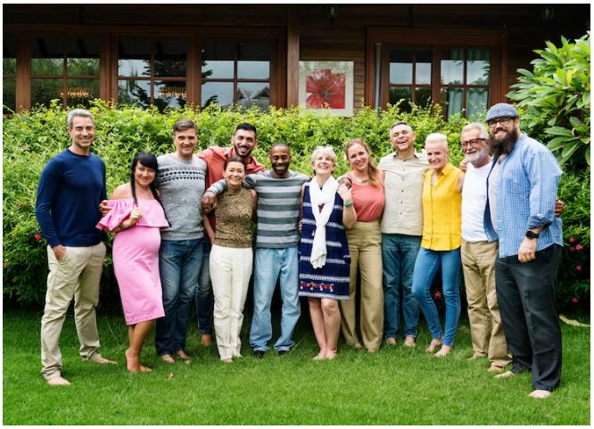
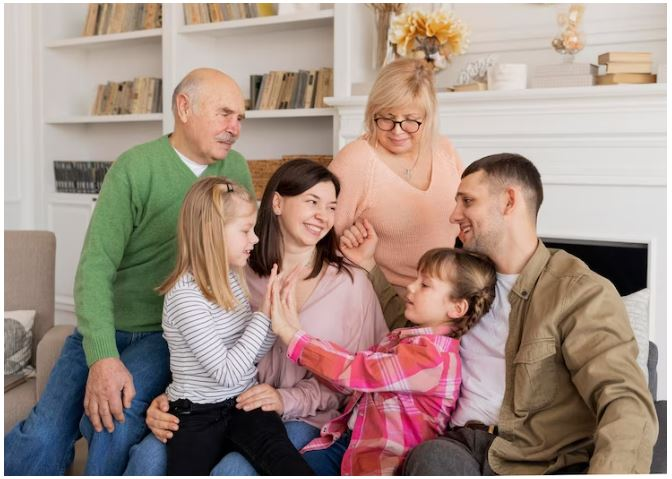

This article has been written and researched by our expert Loveable through a precise methodology. [Learn more about our methodology](https://avada.io/loveable/our-methodological.html)

[Loveable](https://avada.io/loveable/) > [Blog](https://avada.io/loveable/blog/) > [Family](https://avada.io/loveable/family/)

# 71 Best Love And Family Quotes To Share Your Love In 2023

Written by [Rose Bryne](https://avada.io/loveable/author/rose/) Last Updated on August 17, 2023

- [71 love and family quotes to show your love](https://avada.io/loveable/blog/family-quotes/#wp-block-heading-2-4)
- [To conclude,](https://avada.io/loveable/blog/family-quotes/#wp-block-heading-2-85)

Family is everything, and it might be hard to express how much your loved ones mean to you in words. This collection of the greatest romantic love and family quotes might help you when you want to convey your unwavering love and respect for your family.

Because no two families are exactly similar, this list offers a little bit of everything for every type of family. We have a ton of emotional phrases if your crew is sensitive.

As a way to honor parents and grandparents who seem to be present at all times, we have also included particular blessed family [quotes about moms and dads](https://avada.io/loveable/quotes-happy-anniversary-mom-dad/). And best friend quotes describe the true closeness experienced via such interactions for individuals who are not related by blood but nevertheless feel like brothers and sisters. Celebrate your extended family because, in Sister Sledge’s words, “We are family”!

## 71 love and family quotes to show your love

Best Love And Family Quotes To Share Your Love

1. “It didn’t matter how big our house was; it mattered that there was love in it.” — Peter Buffett
2. “Call it a clan, call it a network, call it a tribe, call it a family: Whatever you call it, whoever you are, you need one.” — Jane Howard
3. “Family means nobody gets left behind or forgotten.” — David Ogden Stiers
4. “We may have our differences, but nothing’s more important than family.” –Coco
5. “The bond that links your true family is not one of blood, but of respect and joy in each other’s life.” – Richard Bach
6. “A happy family is but an earlier heaven.” – George Bernard Shaw
7. “Being a family means you are a part of something very wonderful. It means you will love and be loved for the rest of your life.” – Lisa Weed
8. “Happiness is having a large, loving, caring, close-knit family in another city.” ― George Burns
9. “A family is a risky venture, because the greater the love, the greater the loss… That’s the trade-off. But I’ll take it all.” — Brad Pitt
10. “The strength of a family, like the strength of an army, lies in its loyalty to each other.” – Mario Puzo
11. The most important thing in the world is family and love.” – John Wooden
12. “When everything goes to hell, the people who stand by you without flinching–they are your family.” – Jim Butcher
13. “To us, family means putting your arms around each other and being there.” — Barbara Bush
14. “In family life, love is the oil that eases friction, the cement that binds closer together, and the music that brings harmony.” – Friedrich Nietzsche
15. “The other night I ate at a real nice family restaurant. Every table had an argument going.” — George Carlin

The most important thing in the world is family and love.” – John Wooden

16\. “Families are messy. Immortal families are eternally messy. Sometimes the best we can do is to remind each other that we’re related for better or for worse…and try to keep the maiming and killing to a minimum.” ― Rick Riordan

17\. “Family is not an important thing. It’s everything.” –Michael J. Fox

18\. “Family faces are magic mirrors. Looking at people who belong to us, we see the past, present, and future.” – Gail Lumet Buckley

19\. “The greatest thing in family life is to take a hint when a hint is intended-and not to take a hint when a hint isn’t intended.” — Robert Frost

20\. “The family is one of nature’s masterpieces.” – George Santayana

21\. “Families are the compass that guides us. They are the inspiration to reach great heights, and our comfort when we occasionally falter.” – Brad Henry

22\. “You are the bows from which your children as living arrows are sent forth.¨  — Khalil Gibran

23\. “So much of what is best in us is bound up in our love of family, that it remains the measure of our stability because it measures our sense of loyalty.” — Haniel Long

24\. ¨A man should never neglect his family for business.” — Walt Disney

25\. “The homemaker has the ultimate career. All other careers exist for one purpose only – and that is to support the ultimate career.” ― C.S. Lewis

26\. ¨Sister is probably the most competitive relationship within the family, but once the sisters are grown, it becomes the strongest relationship.¨ — Margaret Mead

27\. “Everyone needs a house to live in, but a supportive family is what builds a home.” – Anthony Liccione

28\. There is no such thing as fun for the whole family.¨ — Jerry Seinfeld

29\. “My grandmother started walking five miles a day when she was sixty. She’s ninety-seven now, and we don’t know where the heck she is.” ― Ellen DeGeneres

30\. ¨You don’t choose your family. They are God’s gift to you, as you are to them.¨ — Desmond Tutu

The most important thing in the world is family and love.” – John Wooden

 31. “Parents are like God because you wanna know they’re out there, and you want them to think well of you, but you really only call when you need something.”― Chuck Palahniuk

32\. “Other things may change us, but we start and end with the family.” –Anthony Brandt

33\. “Nothing is better than going home to family and eating good food and relaxing.” –Irina Shayk

34\. “Having somewhere to go is home. Having someone to love is family. And having both is a blessing.”

35\. “It’s all about the quality of life and finding a happy balance between work and friends and family.” –Philip Green

36\. “Family and friendships are two of the greatest facilitators of happiness.” –John C. Maxwell

37\. “Treat your family like friends and your friends like family.”

38\. “Family and friends are hidden treasures, seek them and enjoy their riches.” –Wanda Hope Carter

39\. “Stick to the basics, hold on to your family and friends – they will never go out of fashion.” –Niki Taylor

40\. “My family is my life, and everything else comes second as far as what’s important to me.” –Michael Imperioli

41\. “The family is the test of freedom; because the family is the only thing that the free man makes for himself and by himself.” –Gilbert K. Chesterton

42\. “Think of your family today and every day thereafter, don’t let the busy world of today keep you from showing how much you love and appreciate your family.” –Josiah

43\. “Rejoice with your family in the beautiful land of life.” –Albert Einstein

44\. “Family: A social unit where the father is concerned with parking space, the children with outer space, and the mother with closet space.” –Evan Esar

45\. “Where there is family, there is love.”

“Where there is family, there is love.”

46\. “Family gives you the roots to stand tall and strong.”

47\. “Family is the heart of a home.”

48\. “The family – that dear octopus from whose tentacles we never quite escape, nor, in our inmost hearts, ever quite wish to.” –Dodie Smith

49\. “The only rock I know that stays steady, the only institution I know that works, is the family.” –Lee Iacocca

50\. “When trouble comes, it’s your family that supports you.” –Guy Lafleur

51\. “In time of test, family is best.” –Burmese Proverb

52\. “Being part of a family means smiling for photos.” – Harry Morgan

53\. “I have a wonderful shelter, which is my family.” – José Carreras

54\. “The informality of family life is a blessed condition that allows us all to become our best while looking our worst.” – Marge Kennedy

55\. “There is no rule book, no right or wrong; you just have to make it up and do the very best you can to care for your family.” – Kate Middleton

56\. “I don’t think quantity time is as special as quality time with your family.” – Reba McEntire

57\. “May you be surrounded by friends and family, and if this is not your lot, may the blessings find you in your solitude.” – Leonard Cohen

58\. “I sustain myself with the love of family.” – Maya Angelou

59\. “My mother used to tell me that when push comes to shove, you always know who to turn to. That being a family isn’t a social construct but an instinct.” – Jodi Picoult

60\. “Family members can be your best friends, you know. And best friends, whether or not they are related to you, can be your family.” – Trenton Lee Stewart

“I don’t think quantity time is as special as quality time with your family.” – Reba McEntire

61\. “‘Ohana’ means family and family means nobody gets left behind or forgotten.” – Stitch, ‘Lilo and Stitch’

62\. “A dysfunctional family is any family with more than one person in it.” – Mary Karr

63\. “With every word we utter, with every action we take, we know our kids are watching us. We as parents are their most important role models.” – Michelle Obama

64\. “You are born into your family and your family is born into you. No returns. No exchanges.” – Elizabeth Berg

65\. “There is no doubt that it is around the family and the home that all the greatest virtues, the most dominating virtues of human, are created, strengthened and maintained.” – Winston Churchill

66\. “The world, we’d discovered, doesn’t love you like your family loves you.” – Louis Zamperini

67\. “When all the dust is settled and all the crowds are gone, the things that matter are faith, family and friends.” – Barbara Bush

68\. “Our most basic instinct is not for survival but for family.” – Paul Pearsall

69\. “Family is the most important thing in the world.” – Princess Diana

70\. “Children have never been very good at listening to their elders, but they have never failed to imitate them.” – James Baldwin

71\. “In every conceivable manner, the family is a link to our past, bridge to our future.” – Alex Haley

“Family is the most important thing in the world.” – Princess Diana

**_Related_**:

- [Gift For Your Family](https://avada.io/loveable/best-gift-family/)
- [Missing Mom Quotes](https://avada.io/loveable/missing-mom-quotes/)

## To conclude,

How can you put into words the sense that this is a bunch of individuals who will love you completely, pick you up when you’re down, but also drive you insane because they know just which buttons to press? With **these great peace, love, and family quotes**, you may honor the persons that shaped you into the person you are today.

Go no further than these profound family sayings the next time you need to compose a card, come up with a family-reunion Instagram remark (particularly for Mother’s Day or Father’s Day), or simply want to put a smile on your sister’s face. Whichever way you interact with your loved ones, these beautiful family quotes will help you put your feelings into words.

- [71 love and family quotes to show your love](https://avada.io/loveable/blog/family-quotes/#wp-block-heading-2-4)
- [To conclude,](https://avada.io/loveable/blog/family-quotes/#wp-block-heading-2-85)

### [Rose Bryne](https://avada.io/loveable/author/rose/)

Hi, I'm Rose! I love animals and spending time with kids. At Loveable, I help people find unique gifts for special occasions like Valentine's Day, housewarmings, and graduations. I enjoy finding gifts for kids, teens, and animal lovers that match their interests and personalities. Making gift-giving a pleasant experience is my priority. Let me assist you in finding the perfect gift!

- [Twitter](https://twitter.com/intent/tweet)
- [Facebook](https://www.facebook.com/sharer/sharer.php)
- [instagram](https://avada.io/loveable/blog/family-quotes/)
- [pinterest](https://www.pinterest.com/loveablellc/)

## Related Posts

[### 30 Best 4 Year Old Birthday Party Ideas For A Memorable Celebration](https://avada.io/loveable/blog/4-year-old-birthday-party-ideas/) 

[

### 16th Birthday Party Ideas to Make an Unforgettable Day

](https://avada.io/loveable/blog/16th-birthday-party-ideas/)

[

### 150+ Inspirational Birthday Quotes to Spread Joy on Special Day

](https://avada.io/loveable/blog/inspirational-birthday-quotes/)

[

### 160+ Birthday Wishes for Wife to Express Eternal Love

](https://avada.io/loveable/blog/birthday-wishes-for-wife/)

[### 90+ Heart Touching Birthday Wishes for Niece to Make Her Day Extra Special](https://avada.io/loveable/blog/birthday-wishes-for-niece/)
