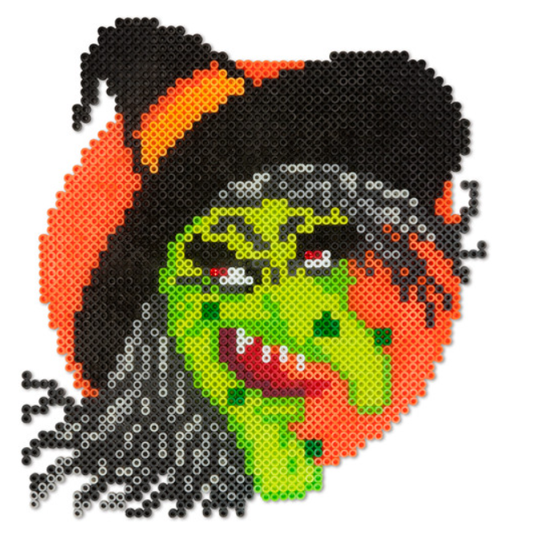
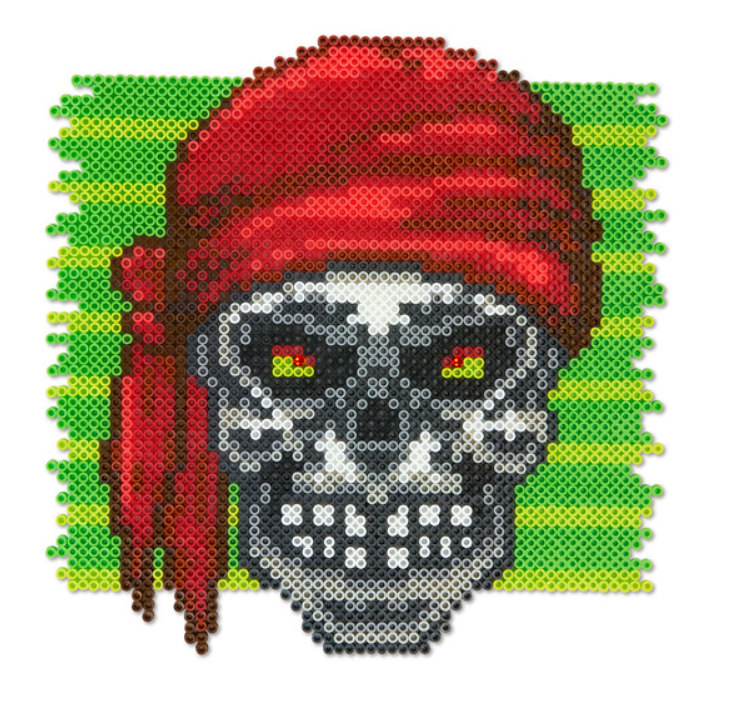
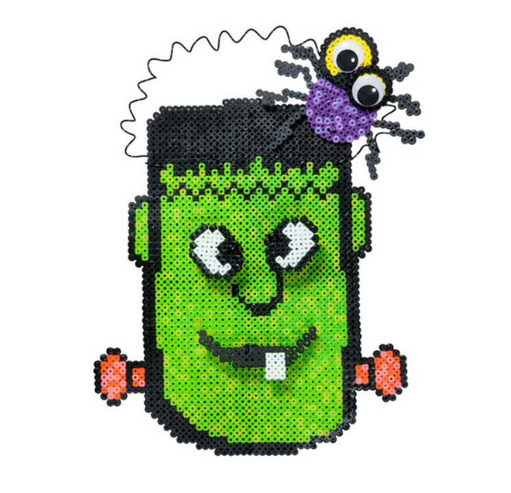
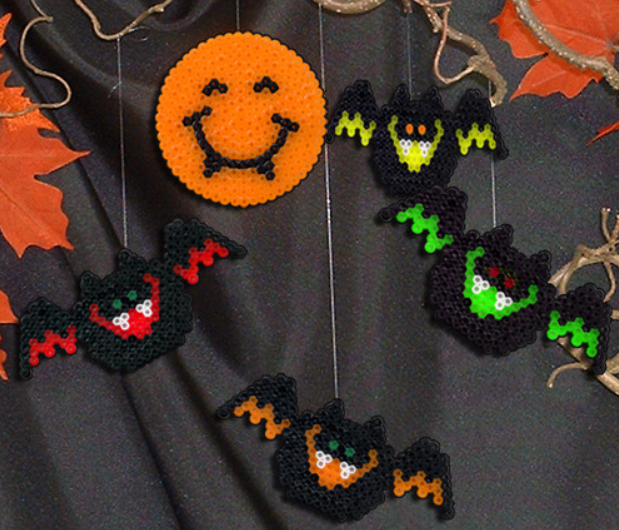
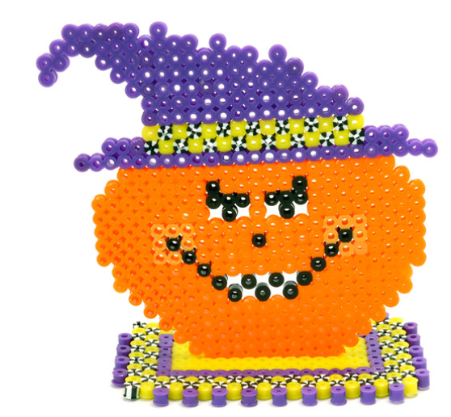
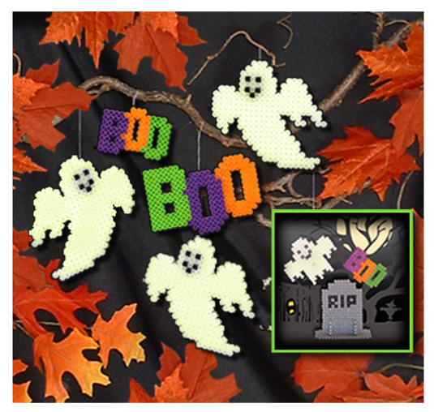
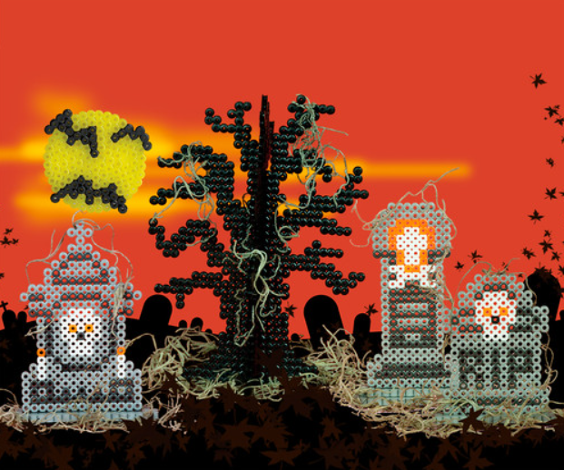
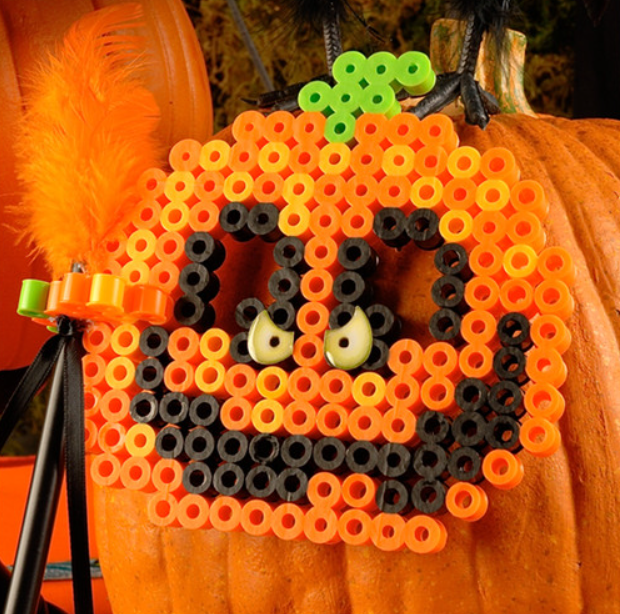

This article has been written and researched by our expert Loveable through a precise methodology. [Learn more about our methodology](https://avada.io/loveable/our-methodological.html)

[Loveable](https://avada.io/loveable/) > [Blog](https://avada.io/loveable/blog/) > [Holiday](https://avada.io/loveable/holiday/)

# 8 Best Halloween Perler Beads and Step-by-step instructions

Written by [Blake Simpson](https://avada.io/loveable/author/blake/) Last Updated on August 29, 2023

- [8 Most Popular Halloween Perler Bead Designs You Will Love In 2023 (With DIY Guide)](https://avada.io/loveable/blog/halloween-perler-beads/#wp-block-heading-2-4)
    - [1\. Wicked Witch Halloween Perler Bead](https://avada.io/loveable/blog/halloween-perler-beads/#wp-block-heading-3-5)
    - [2\. Pirate Skull](https://avada.io/loveable/blog/halloween-perler-beads/#wp-block-heading-3-20)
    - [3\. Frankenstein Halloween Perler Bead](https://avada.io/loveable/blog/halloween-perler-beads/#wp-block-heading-3-34)
    - [4\. Bats Halloween Perler Bead](https://avada.io/loveable/blog/halloween-perler-beads/#wp-block-heading-3-48)
    - [5\. JACK-O’-LANTERN Halloween Perler Bead](https://avada.io/loveable/blog/halloween-perler-beads/#wp-block-heading-3-62)
    - [6\. Scary Ghosties Halloween Perler Bead](https://avada.io/loveable/blog/halloween-perler-beads/#wp-block-heading-3-75)
    - [7\. Graveyard Halloween Perler Bead](https://avada.io/loveable/blog/halloween-perler-beads/#wp-block-heading-3-89)
    - [8\. Halloween Perler Beads Pumpkin Masks](https://avada.io/loveable/blog/halloween-perler-beads/#wp-block-heading-3-105)
- [Ideas for Incorporating Perler Bead Creations into Halloween Decorations](https://avada.io/loveable/blog/halloween-perler-beads/#wp-block-heading-2-126)
- [Halloween Perler Beads – Bottom Line](https://avada.io/loveable/blog/halloween-perler-beads/#wp-block-heading-2-133) 

Are you excited to explore the enchanting realm of Halloween crafts? Look no further than Halloween Perler Beads! These small and colorful beads have the incredible ability to turn ordinary projects into extraordinary works of art. With their vibrant colors and limitless potential, Halloween Perler Beads are a must-have for any [DIY Halloween enthusiast](https://avada.io/loveable/blog/diy-halloween-wreath/).

Curious about what makes **Halloween Perler Beads** so versatile? Let’s dive in and uncover how these simple beads can bring your spooky visions to life. Whether you’re a seasoned crafter or a beginner, Halloween Perler Beads provide a delightful way to express your creativity. From eerie ghosts and wicked witches to adorable [carved pumpkins](https://avada.io/loveable/blog/halloween-pumpkin/) and creepy spiders, the second paragraph will reveal the magic behind these captivating beads.

So, why wait any longer? Unleash your creativity, share your thoughts, and join a vibrant community of Halloween crafters. Get ready for an exciting artistic journey and craft unforgettable [Halloween decorations](https://avada.io/loveable/blog/halloween-decoration-ideas/) that will leave everyone spellbound. Start your Halloween Perler Beads adventure today!

## **8 Most Popular Halloween Perler Bead Designs You Will Love In 2023 (With DIY Guide)**

### **1\. Wicked Witch Halloween Perler Bead**

Give your trick-or-treaters a frightful surprise with this eerie witch Halloween decoration. Whether placed at your door, party table, or trunk-or-treat event, it’s sure to add a spooky touch to your Halloween festivities.

**Download printable pattern at** [**Peler**](https://perler.com/content/project_guides/perler-project-guide_wicked-witch.pdf) 

**Step-by-step instructions**

1. **Gather your materials:** Prepare Perler beads in various colors, a square pegboard, ironing paper, and an iron.
2. **Start with the witch’s face**: Place black beads on the pegboard in the shape of a witch’s face, using a template or your own design.
3. **Add the witch’s hat**: Place purple beads to form the triangular shape of the witch’s hat above the face.
4. **Create the brim of the hat:** Use black beads to create the brim of the witch’s hat, extending outward from the base of the hat.
5. **Form the witch’s hair:** Place green or black beads to create strands of hair around the witch’s face and hat.
6. **Complete the details:** Add beads for the witch’s eyes, nose, mouth, and any other desired facial features.
7. **Ironing:** Cover the design with ironing paper and iron it on a medium heat setting until the beads fuse together evenly.
8. **Let it cool:** Allow the design to cool completely before removing it from the pegboard.
9. **Optional:** Attach a string or magnet to the back of the witch to hang or display it as desired.
10. **Display and enjoy:** Place your wicked witch creation as a Halloween decoration, whether on a wall, window, or tabletop.

### **2\. Pirate Skull**

Create a menacing pirate skull Halloween [decoration to give your door](https://avada.io/loveable/blog/halloween-door-decorations/), party table, or trunk-or-treat event a spooky touch. This fierce pirate skull will surely send shivers down the spines of your guests.

**Download printable pattern at** [**peler**](https://perler.com/content/project_guides/perler-project-guide_pirate-skull.pdf) 

**Step-by-step instructions**

1. **Gather your materials:** Prepare Perler beads in various colors, a square pegboard, ironing paper, and an iron.
2. **Start with the skull base:** Place white beads on the pegboard to create the outline and fill in the shape of the skull, using a template or your own design.
3. **Add the eye sockets**: Place black beads to form the hollow spaces for the eyes within the skull shape.
4. **Create the nose and mouth:** Use black beads to outline and fill in the triangular nose shape, and place additional black beads to form the teeth.
5. **Decorate the skull:** Add beads in different colors to create details such as a bandana, earring, or any other desired decorations.
6. **Ironing:** Cover the design with ironing paper and iron it on a medium heat setting until the beads fuse together evenly.
7. **Let it cool:** Allow the design to cool completely before removing it from the pegboard.
8. Optional: Attach a string or magnet to the back of the skull to hang or display it as desired.
9. **Display and enjoy:** Place your fierce pirate skull creation as a Halloween decoration, whether on a wall, window, or tabletop.

### **3\. Frankenstein Halloween Perler Bead**

Get ready to have some fun by creating a goofy-eyed monster for Halloween! This playful decoration is perfect for adorning your door or school locker. The eyes and mouth pop out from the head, giving it a whimsical look, and to add an extra touch, a wacky spider brings a dimensional element to the design. Let your creativity run wild and bring this silly monster to life!

**Download printable pattern at** [**peler**](https://perler.com/content/project_guides/perler-project-guide_monster-door-hanger.pdf)

**Step-by-step instructions**

1. **Gather your materials:** Prepare Perler beads in various colors, a square pegboard, ironing paper, an iron, and a door hanger or string for hanging.
2. **Start with the monster’s head:** Place beads on the pegboard to form a large circle or oval shape for the monster’s head, using a template or your own design.
3. **Create the eyes:** Use different colored beads to create large, googly eyes for the monster. You can experiment with different shapes and sizes to make them goofy and playful.
4. **Make the mouth:** Use beads to create a wide, open-mouth shape for the monster. You can add teeth or other details to make it even more fun.
5. **Add dimensional elements:** Create a spider using black beads and place it on the monster’s head or nearby, giving it a three-dimensional appearance.
6. **Ironing:** Cover the design with ironing paper and iron it on a medium heat setting until the beads fuse together evenly.
7. **Let it cool:** Allow the design to cool completely before removing it from the pegboard.
8. **Attach a hanger:** Once the design is cool, attach a door hanger or string to the top of the monster’s head, ensuring it is secure and ready for hanging.
9. **Hang and enjoy:** Hang your goofy-eyed monster on your door or school locker to add a playful and festive touch to your Halloween decorations.

### **4\. Bats Halloween Perler Bead**

Get ready to create some spooky fun with Perler Beads! Make these bloodthirsty bat designs that soar under the glow of the vampire moon. With Perler Beads, you can easily bring these Halloween designs to life. Let your imagination take flight and have a ghoulishly good time crafting these creepy bats!

**Download printable pattern at** [**peler**](https://perler.com/content/project_guides/perler-project-guide_vampire-moon-and-bats.pdf)

**Step-by-step instructions**

1. **Gather your materials:** Prepare Perler beads in various colors, a square pegboard, ironing paper, an iron, and any additional supplies mentioned in the project.
2. **Start with the vampire moon:** Place black beads on the pegboard in a circular shape to create the moon’s outline, following the provided template or your own design.
3. **Fill in the moon:** Use black beads to fill in the entire circular shape of the moon, ensuring a solid and even coverage.
4. **Create the bats:** Use black beads to make bat shapes on the pegboard, using the provided template or your own creativity. Make sure to create wings, bodies, and heads for each bat.
5. **Add details:** Use different colored beads to add eyes, mouths, or any desired details to the bats to give them personality.
6. **Ironing:** Cover the designs with ironing paper and iron them on a medium heat setting until the beads fuse together evenly.
7. **Let them cool:** Allow the designs to cool completely before removing them from the pegboard.
8. **Optional:** Attach a string or adhesive to the back of the vampire moon and bats for hanging or displaying purposes.
9. **Display and enjoy:** Place your vampire moon and bats creations as Halloween decorations on walls, windows, or any desired location, and let them add a spooky touch to your space.

### **5\. JACK-O’-LANTERN Halloween Perler Bead**

Get ready to add a devilishly delightful touch to your Halloween decorations with our festive Jack-o’-Lantern made from Perler beads! This playful pumpkin is easy to create and features just the right mischievous smile to set the spooky mood. Whether you want to enhance your party table or create a captivating display on your front porch, this Jack-o’-Lantern will be the perfect addition. Let your creativity shine as you bring this charming [Halloween cartoon character](https://avada.io/loveable/blog/famous-halloween-cartoon-characters/) to life with Perler beads!

**Download printable pattern at** [**peler**](https://perler.com/content/project_guides/perler-project-guide_jack-o-lantern-centerpiece.pdf)

**Step-by-step instructions**

1. **Gather your materials:** Prepare Perler beads in various colors, a square pegboard, ironing paper, an iron, and any additional supplies mentioned in the project.
2. **Start with the pumpkin shape:** Place orange beads on the pegboard in a pumpkin shape, following the provided template or your own design. This will serve as the base for your Jack-o’-Lantern.
3. **Add facial features:** Use black beads to create the eyes, nose, and mouth for your Jack-o’-Lantern. Get creative with different shapes and expressions to give it that unique, devilish smile.
4. **Add details:** Use green beads to create the stem of the pumpkin. You can also add additional details like vines or leaves to enhance the overall design.
5. **Ironing:** Cover the design with ironing paper and iron it on a medium heat setting until the beads fuse together evenly.
6. **Let it cool:** Allow the design to cool completely before removing it from the pegboard.
7. **Optional:** Attach a base or stand to the back of the Jack-o’-Lantern to make it a centerpiece or place it on your front porch display.
8. **Display and enjoy:** Showcase your Jack-o’-Lantern centerpiece on your party table or front porch to add a festive and spooky touch to your Halloween decorations.

### **6\. Scary Ghosties Halloween Perler Bead**

This fun and festive project will add a touch of ghostly charm to your Halloween decorations. With Perler beads, you can easily bring these ghostly figures and eerie tombstones to life. Set the stage for a hauntingly good time and let your imagination run wild as you craft these spooky designs.

**Download printable pattern at** [**peler**](https://perler.com/content/project_guides/perler-project-guide_scary-ghosties.pdf)

**Step-by-step instructions**

1. **Gather your materials:** Collect Perler beads in various colors, a pegboard, ironing paper, an iron, and any additional supplies mentioned in the project.
2. **Design the ghosts:** Place white beads on the pegboard in ghost shapes, following the provided template or your own creative design. Don’t forget to leave spaces for the eyes and mouth.
3. **Add facial features**: Use black beads to create the eyes and mouth for each ghost. You can make them spooky, goofy, or anything in between to give each ghost its own personality.
4. **Ironing:** Cover the design with ironing paper and carefully iron it on a medium heat setting until the beads melt and fuse together. Make sure to iron both sides to ensure durability.
5. **Shape the ghosts (optional):** While the beads are still warm, carefully lift the design from the pegboard and gently shape the ghosts into a three-dimensional form. Be cautious as the beads may still be hot.
6. **Create the tombstones:** Use gray or black beads to create tombstone shapes on the pegboard. Get creative with different shapes and sizes to add variety to your display.
7. **Ironing:** Cover the tombstone designs with ironing paper and iron them as you did with the ghosts.
8. **Display and enjoy:** Once everything has cooled down, arrange your Perler bead ghosts and tombstones in a spooky Halloween display. You can place them on a table, hang them from string, or incorporate them into other decorations.
9. **Optional:** Add extra touches to your display, such as cobwebs, bats, or a haunted backdrop, to enhance the overall spooky atmosphere.

### **7\. Graveyard Halloween Perler Bead**

This project will allow you to craft self-standing pieces that will bring your spooky cemetery to life. With a touch of Spanish moss for an eerie effect, you’ll have the perfect setting for a haunting Halloween display. Let’s dive in and unleash our creativity to make a scene that will give everyone the chills!

**Download printable pattern at** [**peler**](https://perler.com/projects/ghastly-graveyard/)

**Materials you’ll need:**

- Perler beads in various colors
- Pegboards
- Ironing paper
- Iron
- Optional: Spanish moss or other materials for added effect

**Steps:**

1. **Plan your design:** Visualize the layout of your graveyard scene. Decide on the number and arrangement of tombstones, trees, and any other elements you want to include.

2. **Create tombstones:** Use gray or black Perler beads to craft tombstones on the pegboard. Get creative with different shapes and sizes to add variety to your graveyard. Leave some space at the bottom to ensure stability when the pieces are self-standing.

3. **Design trees:** Use green or brown beads to form tree shapes on the pegboard. You can make them tall and spindly or short and stubby, depending on the atmosphere you want to create.

4. **Ironing:** Cover your designs with ironing paper and carefully iron them, following the instructions provided by the manufacturer. Be sure to iron both sides of the pieces to ensure they hold together properly.

5. **Assembly:** Once your pieces have cooled down, assemble your graveyard scene. Place the tombstones and trees on a flat surface, arranging them in a way that creates a creepy atmosphere. You can also add additional elements like fences, cobwebs, or ghostly figures if desired.

### **8\. Halloween Perler Beads Pumpkin Masks**

Create your own basic Pumpkin Masks and let your creativity run wild as you embellish them with feathers, ribbon, and crazy eyeball stickers. These masks are not only enjoyable to make but also perfect for trick-or-treating or attending a Halloween party. Let’s get started on this exciting project!

**Download Printable Pattern at** [**peler**](https://perler.com/content/project_guides/perler-project-guide_biggie-beads-pumpkin-masks.pdf) 

**Materials you’ll need:**

- Perler Biggie Beads in orange
- Perler pegboard (large square or circle)
- Ironing paper
- Iron
- Feathers
- Ribbon
- Crazy eyeball stickers
- Scissors
- Glue (optional)

**Steps:**

1. **Arrange the beads:** Using the large square or circle pegboard, place the orange Perler Biggie Beads in the shape of a pumpkin face. You can follow a template or create your own unique design.

2. **Ironing:** Cover your bead design with ironing paper and carefully iron it, following the instructions provided in the Perler Biggie Beads kit. Be sure to iron both sides of the mask to ensure it holds together properly.

3. **Cooling and shaping:** Once the mask has cooled down, gently remove it from the pegboard. While it’s still warm, you can shape it slightly to give it a more rounded and dimensional look. Allow it to cool completely and maintain its shape.

4. **Decorating:** Now comes the fun part! Use feathers to create a whimsical and festive look for your pumpkin mask. Glue the feathers onto the top or sides of the mask, or attach them using adhesive dots or tape. You can also cut small pieces of ribbon and glue them around the edges for added flair.

5. **Eyes and finishing touches:** Stick crazy eyeball stickers onto the mask to give it a playful and quirky appearance. Feel free to get creative and add other decorations like sequins, glitter, or small accessories to personalize your pumpkin masks even further.

_**Related**_**:** Best [_Gifts for Halloween Lovers_](https://avada.io/loveable/gifts-halloween-lovers/) That They’ll Actually Use

## **Ideas for Incorporating Perler Bead Creations into Halloween Decorations**

- **Halloween-themed jewelry:** Create earrings, necklaces, bracelets, or keychains using Perler bead designs in spooky shapes like ghosts, bats, or pumpkins.
- **Ornaments and hanging decorations**: Make Perler bead ornaments in the shape of witches, spiders, or skeletons, and hang them around the house or on a Halloween tree.
- **Coasters and drink markers:** Design Perler bead coasters with Halloween motifs and use them to protect surfaces during festive gatherings. Create drink markers by shaping beads into small charms or labels.
- **Garland or banners:** String together Perler bead shapes to create a Halloween-themed garland or banner to hang across a mantel, wall, or doorway.
- **Window clings:** Arrange Perler bead designs on clear adhesive sheets to create removable window clings for spooky window displays.
- **Candle holders:** Wrap Perler bead designs around glass votive holders or jars to create unique candle holders for a Halloween-inspired ambiance.

## **Halloween Perler Beads – Bottom Line** 

**Halloween Perler beads** provide a creative and exciting outlet for Halloween crafts. By following safety precautions and organizing your beads, you can enjoy the process while staying safe. With a wide range of possibilities, such as jewelry, ornaments, and decorations, Halloween Perler beads offer endless opportunities for festive fun. So, unleash your creativity and have a spooktacular time crafting with Halloween Perler beads!

- [8 Most Popular Halloween Perler Bead Designs You Will Love In 2023 (With DIY Guide)](https://avada.io/loveable/blog/halloween-perler-beads/#wp-block-heading-2-4)
    - [1\. Wicked Witch Halloween Perler Bead](https://avada.io/loveable/blog/halloween-perler-beads/#wp-block-heading-3-5)
    - [2\. Pirate Skull](https://avada.io/loveable/blog/halloween-perler-beads/#wp-block-heading-3-20)
    - [3\. Frankenstein Halloween Perler Bead](https://avada.io/loveable/blog/halloween-perler-beads/#wp-block-heading-3-34)
    - [4\. Bats Halloween Perler Bead](https://avada.io/loveable/blog/halloween-perler-beads/#wp-block-heading-3-48)
    - [5\. JACK-O’-LANTERN Halloween Perler Bead](https://avada.io/loveable/blog/halloween-perler-beads/#wp-block-heading-3-62)
    - [6\. Scary Ghosties Halloween Perler Bead](https://avada.io/loveable/blog/halloween-perler-beads/#wp-block-heading-3-75)
    - [7\. Graveyard Halloween Perler Bead](https://avada.io/loveable/blog/halloween-perler-beads/#wp-block-heading-3-89)
    - [8\. Halloween Perler Beads Pumpkin Masks](https://avada.io/loveable/blog/halloween-perler-beads/#wp-block-heading-3-105)
- [Ideas for Incorporating Perler Bead Creations into Halloween Decorations](https://avada.io/loveable/blog/halloween-perler-beads/#wp-block-heading-2-126)
- [Halloween Perler Beads – Bottom Line](https://avada.io/loveable/blog/halloween-perler-beads/#wp-block-heading-2-133) 

### [Blake Simpson](https://avada.io/loveable/author/blake/)

Hi, I'm Blake from Loveable. I help people find perfect gifts for occasions like anniversaries and weddings. I also write a blog about holidays, sharing insights to make them more meaningful. Let's create unforgettable moments together!

- [Twitter](https://twitter.com/intent/tweet)
- [Facebook](https://www.facebook.com/sharer/sharer.php)
- [instagram](https://avada.io/loveable/blog/halloween-perler-beads/)
- [pinterest](https://www.pinterest.com/loveablellc/)

## Related Posts

[### 120+ Christian Birthday Wishes To Spread Your Love](https://avada.io/loveable/blog/christian-birthday-wishes/) 

[

### 35 Best 70th Birthday Ideas To Celebrate The Special Milestone

](https://avada.io/loveable/blog/70th-birthday-ideas/)

[

### 50 Best 30th Birthday Decorations for a Remarkable Birthday Bash

](https://avada.io/loveable/blog/30th-birthday-decorations/)

[

### 40 Delicious Vegan Christmas Desserts to Delight Your Palate

](https://avada.io/loveable/blog/vegan-christmas-desserts/)

[

### 60 Christmas Team Building Activities to Boost Workplace Spirit

](https://avada.io/loveable/blog/christmas-team-building-activities/)
