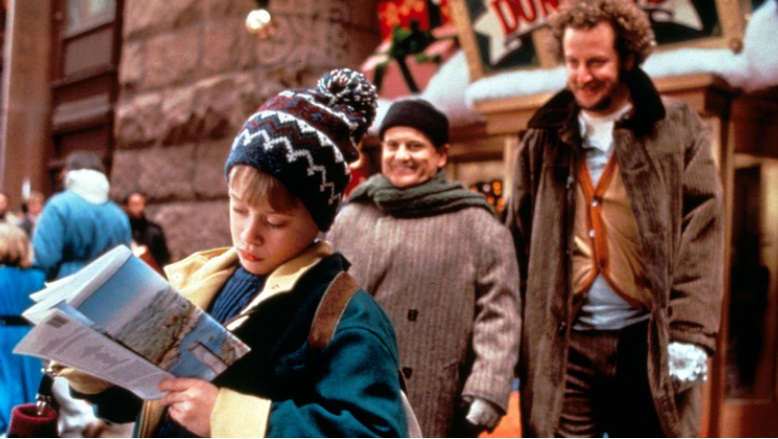
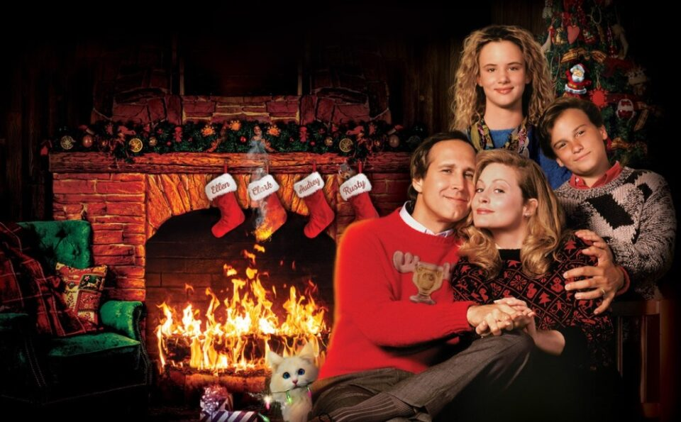
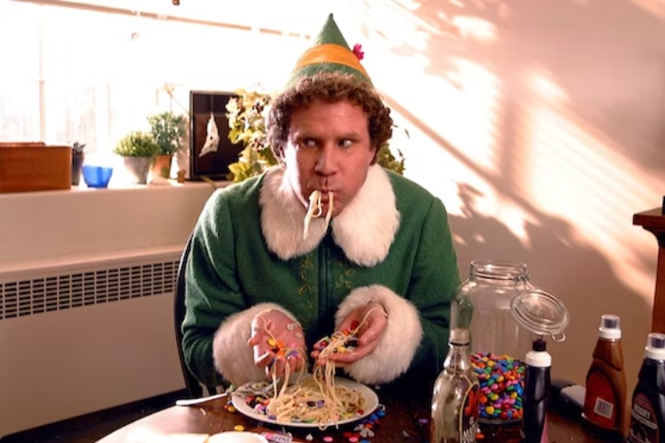
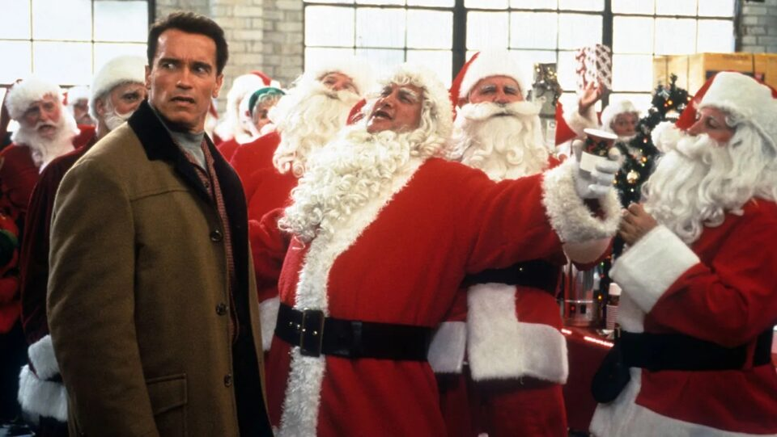
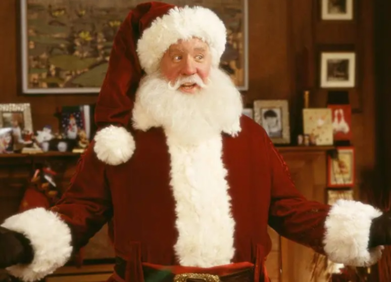
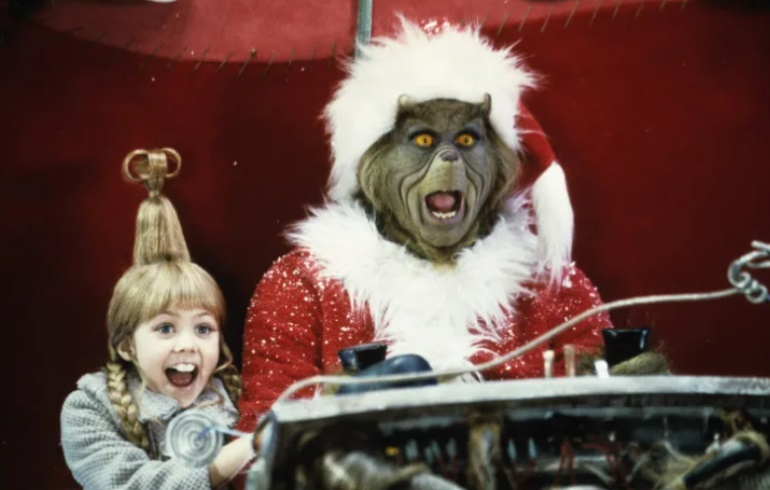
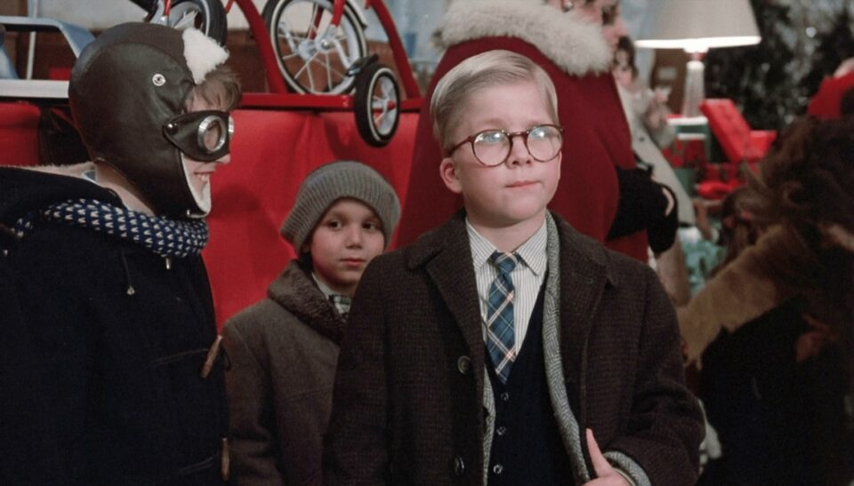
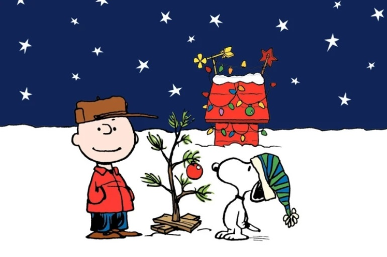
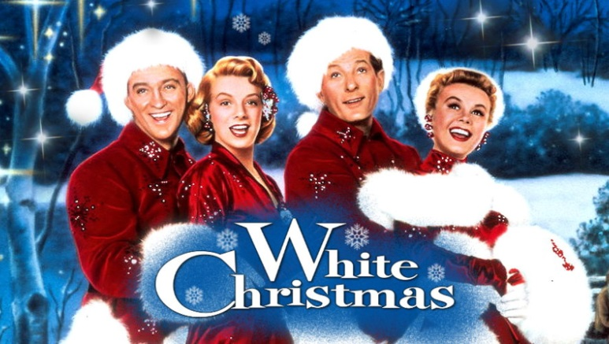
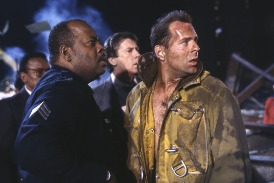

This article has been written and researched by our expert Loveable through a precise methodology. [Learn more about our methodology](https://avada.io/loveable/our-methodological.html)

[Loveable](https://avada.io/loveable/) > [Blog](https://avada.io/loveable/blog/) > [Holiday](https://avada.io/loveable/holiday/)

# 80+ Funny Christmas Movie Quotes Guaranteed to Make You Giggle

Written by [Blake Simpson](https://avada.io/loveable/author/blake/) Last Updated on September 07, 2023

- [80+ Funny Christmas Movie Quotes To Laugh With Your Loved Ones](https://avada.io/loveable/blog/funny-christmas-movie-quotes/#wp-block-heading-2-2)
    - [Home Alone (1990)](https://avada.io/loveable/blog/funny-christmas-movie-quotes/#wp-block-heading-3-3)
    - [National Lampoon’s Christmas Vacation (1989)](https://avada.io/loveable/blog/funny-christmas-movie-quotes/#wp-block-heading-3-18)
    - [Elf (2003)](https://avada.io/loveable/blog/funny-christmas-movie-quotes/#wp-block-heading-3-31)
    - [Jingle All the Way (1996)](https://avada.io/loveable/blog/funny-christmas-movie-quotes/#wp-block-heading-3-44)
    - [The Santa Clause (1985)](https://avada.io/loveable/blog/funny-christmas-movie-quotes/#wp-block-heading-3-54)
    - [How the Grinch Stole Christmas (2000)](https://avada.io/loveable/blog/funny-christmas-movie-quotes/#wp-block-heading-3-68)
    - [A Christmas Story (1983)](https://avada.io/loveable/blog/funny-christmas-movie-quotes/#wp-block-heading-3-82)
    - [A Charlie Brown Christmas (1965)](https://avada.io/loveable/blog/funny-christmas-movie-quotes/#wp-block-heading-3-94)
    - [White Christmas (1954)](https://avada.io/loveable/blog/funny-christmas-movie-quotes/#wp-block-heading-3-100)
    - [Die Hard (1988)](https://avada.io/loveable/blog/funny-christmas-movie-quotes/#wp-block-heading-3-107)
- [Bottom Line](https://avada.io/loveable/blog/funny-christmas-movie-quotes/#wp-block-heading-2-118) 

The holiday season is upon us, and what better way to celebrate than with a hearty dose of laughter? **Funny Christmas movie quotes** have the remarkable ability to make us chuckle, guffaw, and even burst into fits of giggles, reminding us that joy and merriment are at the heart of this festive time. From iconic classics to contemporary gems, these quotes have transcended time and continue to bring smiles to people of all ages. So, get ready to laugh until your belly shakes like a bowl full of jelly as we dive into these comedic moments that have become a cherished part of holiday traditions. 

## **80+ Funny Christmas Movie Quotes To Laugh With Your Loved Ones**

### **[Home Alone (1990)](https://www.amazon.com/Home-Alone-Macaulay-Culkin/dp/B0031QNMKK/)**

“Home Alone,” a classic beloved holiday movie, is not only known for its heartwarming moments but also for its side-splitting humor. This film has gifted us with several funny and memorable quotes that have become synonymous with the Christmas season. Let’s dive into some of the most uproarious lines that Kevin McCallister and his merry mishaps have brought us!

1. “Keep the change, ya filthy animal.” — Gangster Johnny

2. “Why the Hell did you take your shoes off?” – Harry, “Why the hell are you dressed like a chicken?” – Marv

3. “Guys, I’m eating junk and watching rubbish! You better come out and stop me!” – Kevin McCallister

4. “Look what you did you little jerk.” – Uncle Frank

5. “You’re what the French call ‘les incompetents.'” – Linnie McCallister

6. “Buzz, your girlfriend. Woof!” – Kevin McCallister

7. “This house is so full of people it makes me sick. When I grow up and get married, I’m living alone.” – Kevin McCallister

8. “I wouldn’t let you sleep in my room if you were growing on my a$$!”— Buzz 

9.  “You can be too old for a lot of things, but you’re never too old to be afraid.”― Marley

10. “Mom, does Santa Clause have to go through customs?”― Brooke McCallister

11. “Merry Christmas little fella. We know that you’re in there and that you’re all alone.” ― Harry

12. “American don’t fly to the promised land, little buddy.” ― Marv

### **[National Lampoon’s Christmas Vacation (1989)](https://www.amazon.com/National-Lampoons-Christmas-Vacation-Chevy/dp/B009IU6BIS/)**

“National Lampoon’s Christmas Vacation” is another holiday film that has captured the hearts of many with its uproarious humor and relatable family dynamics. Packed with hilarious moments and unforgettable quotes, this movie brings laughter to the holiday season. Let’s take a merry stroll through some of the funniest lines that have made this film a festive favorite!

1. “Looks great. Little full, lotta sap.” — Clark Griswold

2. “Eat my rubber!” — Clark Griswold

3. “This isn’t charity. It’s family.” — Clark Griswold

4. “Hallelujah! Holy shit! Where’s the Tylenol?” — Clark Griswold

5. “Clark, that’s the gift that keeps on giving the whole year.”— Cousin Eddie

6. “When Santa squeezes his fat white a\*s down that chimney tonight, he’s gonna find the jolliest bunch of assholes this side of the nuthouse.” — Clark Griswold

7. “Save the neck for me, Clark!” — Cousin Eddie

8. “Think you might be overdoing it, Dad?” — Rusty Griswold

9. “And we’re going to have the hap-hap-happiest Christmas.”— Clark Griswold

10. “Nobody’s walking out on this fun, old-fashioned family Christmas.”— Clark Griswold

### **[Elf (2003)](https://www.amazon.com/Elf-Will-Ferrell/dp/B09PQKZJYZ/ref=sr_1_1?crid=F50BDF0I1BR3)**

Unwrap a bundle of holiday cheer with these side-splitting Christmas quotes from the beloved movie “Elf.” From Buddy’s charming innocence to his comical observations, these quotes will have you laughing through the festive season.

1. “You have such a pretty face. You should be on a Christmas card.” —Buddy

2. “Buddy the Elf, what’s your favorite color?” — Buddy

3. “Good news. I saw a dog today.”— Buddy

4. “The best way to spread Christmas cheer is singing loud for all to hear.” – Buddy

5. “I am a cotton-headed ninny muggins!” – Buddy

6. “I just like to smile. Smiling’s my favorite.” – Buddy

7. “Son of a nutcracker!” – Buddy

8. “SANTA! Oh my God! Santa, here?! I know him! I know him!” – Buddy

9. “He’s an angry elf.” – Buddy

10. “You stink! You smell like beef and cheese, you don’t smell like Santa.” – Buddy

### **[Jingle All the Way (1996)](https://www.amazon.com/Jingle-All-Way-Arnold-Schwarzenegger/dp/B00A8OW0WO/r)**

“Jingle All the Way,” a timeless comedy brimming with holiday chaos, has gifted us with hilarious quotes that continue to tickle our funny bones. In this festive compilation, we delve into the most side-splitting lines from the movie. Brace yourself for a jolly ride of laughter as we unwrap the comedic brilliance of “Jingle All the Way.”

1. “Put that cookie down!” – Howard Langston

2. “I’m not a pervert! I just was looking for Turbo Man doll!” – Howard Langston

3. “I’m gonna deck your halls, bub.” — Santa Claus

4. “It’s Turbo time!” — Howard Langston

5. “I gotta tell you, Santa, there’s something about this place that doesn’t seem quite…Kosher.”— Howard Langston

6. “We’re not just doing this for us. We’re doing it for the kids. For every kid who ever sat on Santa’s lap.”— Mall Santa

7. “Who told you you could eat my cookies?”— Howard Langston

### **[The Santa Clause (1985)](https://www.amazon.com/Santa-Claus-Movie-25th-Anniversary/dp/B009ZM6SO6/)**

Get ready to chuckle and reminisce as we highlight the most uproarious and mischievous lines from “The Santa Clause” series. Whether you’re a devoted fan or new to the magic, these quotes are sure to add a touch of whimsy and laughter to your Christmas celebrations.

1. “Down the chimney? You want me to take the toys down the chimney into a strange house, IN MY UNDERWEAR?” — Scott Calvin

2. “We’re your worst nightmare. Elves with attitude.” — E.L.F.S. Leader

3. Charlie: “Look! You’re flying!”  
    Scott Calvin: “It’s OK, I’m used to it. I lived through the ’60s.”

4. “Merry Christmas to all, and to all a good night! When I wake up, I’m getting a CAT scan!” — Scott Calvin

5. “I’m in big trouble.” — Scott Calvin

6. “Can we take a direct flight back to reality or do we have to change planes in Denver?” — Scott Calvin

7. “I believe in Santa Clause. I’m not a baby.”— Scott

8. “Thanks, but I’m seeing someone in wrapping.”— Judy the Elf

9. “Everybody likes Denny’s, it’s an American institution.” — Scott Calvin

10. “You put on the suit, you’re the big guy.” — Bernard

11. Charlie: “What’d it feel like, Dad?” Scott Calvin: “It felt like America’s Most Wanted.”

### **[How the Grinch Stole Christmas (2000)](https://www.amazon.com/Dr-Seuss-Grinch-Stole-Christmas/dp/B009CG9LZI/)**

Chuckle your way through Grinch’s witty remarks and comedic moments that add a dash of humor to this classic tale. From his snarky quips to heartwarming yet amusing lines, these quotes capture the Grinch’s holiday antics. Keep reading for more details!

1. “Blast this Christmas music. It’s joyful and triumphant.”—the Grinch

2. “Now you listen to me, young lady! Even if we’re horribly mangled, there’ll be no sad faces on Christmas.” —The Grinch

3. “Holiday who-be what-ee?” —The Grinch

4. “Be it ever so heinous, there’s no place like home.” —The Grinch

5. “HELP ME…I’m FEELING.” —The Grinch

6. “I could use a little social interaction.” —The Grinch

7. “Am I just eating because I’m bored?” —The Grinch

8. “Cheer up, dude. It’s Christmas.” —The Grinch

9. “Maybe Christmas… perhaps… means a little bit more.” —The Grinch

10. “No one should be alone on Christmas.” —Cindy Lou Who

11. “Well, in Whoville, they say that the Grinch’s heart grew three sizes that day.” — Narrator

### **[A Christmas Story (1983)](https://www.amazon.com/Christmas-Story-Peter-Billingsley/dp/B009IU78LM/)**

Have you seen A Christmas Story, or at least flipped through the channels when 24 Hours of A Christmas Story debuted on cable TV? One of the classics and one that brings back memories of the 1980s is A Christmas Story. Take a laugh at these amusing Ralphie, Schwartz, Old Man Parker, Randy, and other A Christmas Story movie quotes.

1. “You’ll shoot your eye out, kid.” —Santa Claus

2. “I triple-dog-dare ya!” —Schwartz

3. “Nadafinga!” —Old Man Parker

4. “Fraa-jeel-aay! It must be Italian!” —Old Man Parker

5. “Oh my god, I shot my eye out!” —Ralphie Parker

6. “Meatloaf, smeatloaf, double beatloaf. I hate meatloaf.” —Randy Parker

7. “I can’t put my arms down.” —Randy Parker

8. “He looks like a deranged Easter Bunny.” —Old Man Parker

9. “Some men are Baptists, others Catholics; my father was an Oldsmobile man.” —Ralphie Parker

### **[A Charlie Brown Christmas (1965)](https://www.amazon.com/Charlie-Brown-Christmas-Ann-Altieri/dp/B001K2JE9K)**

Refresh your memory of your favorite A Charlie Brown Christmas movie quotes before the holiday season. These humorous Christmas quotes may serve as fodder for Christmas jokes, hilarious Instagram captions, and wonderful holiday greetings in your Christmas cards. Check out the funniest quotes from A Charlie Brown Christmas ahead!

1. “Please note the size and color of each item, and send as many as possible. If it seems too complicated, make it easy on yourself: just send money. How about tens and twenties?” — Sally Brown

2. “I just don’t understand Christmas, I guess. I like getting presents and sending Christmas cards and decorating trees and all that, but I’m still not happy. I always end up feeling depressed.” — Charlie Brown

3. “I never thought it was such a bad little tree. It’s not bad at all, really. Maybe it just needs a little love.” — Linus Van Pelt

### **[White Christmas (1954)](https://www.amazon.com/White-Christmas-Bing-Crosby/dp/B00ANLKIIU/)**

We are presenting to you the definitive list of White Christmas quotes, as chosen and ranked by movie lovers. For decades, this Christmas tradition has been a mainstay in many families, bringing happiness and laughter to families everywhere. This movie has everything, so get ready to blow up your mind with these funny quotes from White Christmas!

1. “If you’re worried and you can’t sleep, count your blessings instead of sheep. Then you’ll fall asleep counting your blessings.” —Bob Wallace

2. “In some ways, you’re far superior to my cocker spaniel.” —Phil Davis

3. “When I figure out what that means, I’ll come up with a crushing reply.” —Bob Wallace

4. “I once bought my kids a set of batteries for Christmas with a note on it saying, toys not included.” —Bernard Manning

### **[Die Hard (1988)](https://www.amazon.com/Die-Hard-Bruce-Willis/dp/B000SZK41M)**

The argument that Die Hard is not a Christmas movie is valid, yet the screenplay is replete with holiday terms that prove it to be just as much of a Christmas film as “Elf” or “Home Alone”. Come out to the coast, get together, and have a few laughs with these hilarious quotes.

1. “Does it sound like I’m ordering a pizza?” – John McClane

2. “Come Out To The Coast, We’ll Get Together, Have A Few Laughs…”– John McClane

3. “If this is their idea of Christmas, I gotta be here for New Year’s!”– Argyle

4. “I Got Invited To The Christmas Party By Mistake. Who Knew?”– John McClane

5. “Welcome to the party, pal!” – John McClane

**_See More:_**

- Best [Christmas Songs](https://avada.io/loveable/blog/best-christmas-songs/)

- [Classic Christmas Movies](https://avada.io/loveable/blog/classic-christmas-movies/)

## **Bottom Line** 

As you immerse yourself in the holiday spirit, these **funny Christmas movie quotes** will keep you chuckling and uplifted throughout the season. From the misadventures of the Griswold family to the whimsical world of Buddy the Elf, these quotes remind us that laughter is truly the best gift we can share during the most wonderful time of the year. So, grab some hot cocoa, cozy up, and enjoy these hilarious moments that capture the essence of Christmas like no other. Remember, as Buddy would say, “The best way to spread Christmas cheer is by singing loud for all to hear!”

- [80+ Funny Christmas Movie Quotes To Laugh With Your Loved Ones](https://avada.io/loveable/blog/funny-christmas-movie-quotes/#wp-block-heading-2-2)
    - [Home Alone (1990)](https://avada.io/loveable/blog/funny-christmas-movie-quotes/#wp-block-heading-3-3)
    - [National Lampoon’s Christmas Vacation (1989)](https://avada.io/loveable/blog/funny-christmas-movie-quotes/#wp-block-heading-3-18)
    - [Elf (2003)](https://avada.io/loveable/blog/funny-christmas-movie-quotes/#wp-block-heading-3-31)
    - [Jingle All the Way (1996)](https://avada.io/loveable/blog/funny-christmas-movie-quotes/#wp-block-heading-3-44)
    - [The Santa Clause (1985)](https://avada.io/loveable/blog/funny-christmas-movie-quotes/#wp-block-heading-3-54)
    - [How the Grinch Stole Christmas (2000)](https://avada.io/loveable/blog/funny-christmas-movie-quotes/#wp-block-heading-3-68)
    - [A Christmas Story (1983)](https://avada.io/loveable/blog/funny-christmas-movie-quotes/#wp-block-heading-3-82)
    - [A Charlie Brown Christmas (1965)](https://avada.io/loveable/blog/funny-christmas-movie-quotes/#wp-block-heading-3-94)
    - [White Christmas (1954)](https://avada.io/loveable/blog/funny-christmas-movie-quotes/#wp-block-heading-3-100)
    - [Die Hard (1988)](https://avada.io/loveable/blog/funny-christmas-movie-quotes/#wp-block-heading-3-107)
- [Bottom Line](https://avada.io/loveable/blog/funny-christmas-movie-quotes/#wp-block-heading-2-118) 

### [Blake Simpson](https://avada.io/loveable/author/blake/)

Hi, I'm Blake from Loveable. I help people find perfect gifts for occasions like anniversaries and weddings. I also write a blog about holidays, sharing insights to make them more meaningful. Let's create unforgettable moments together!

- [Twitter](https://twitter.com/intent/tweet)
- [Facebook](https://www.facebook.com/sharer/sharer.php)
- [instagram](https://avada.io/loveable/blog/funny-christmas-movie-quotes/)
- [pinterest](https://www.pinterest.com/loveablellc/)

## Related Posts

[### 120+ Christian Birthday Wishes To Spread Your Love](https://avada.io/loveable/blog/christian-birthday-wishes/) 

[

### 35 Best 70th Birthday Ideas To Celebrate The Special Milestone

](https://avada.io/loveable/blog/70th-birthday-ideas/)

[

### 50 Best 30th Birthday Decorations for a Remarkable Birthday Bash

](https://avada.io/loveable/blog/30th-birthday-decorations/)

[

### 40 Delicious Vegan Christmas Desserts to Delight Your Palate

](https://avada.io/loveable/blog/vegan-christmas-desserts/)

[

### 60 Christmas Team Building Activities to Boost Workplace Spirit

](https://avada.io/loveable/blog/christmas-team-building-activities/)
