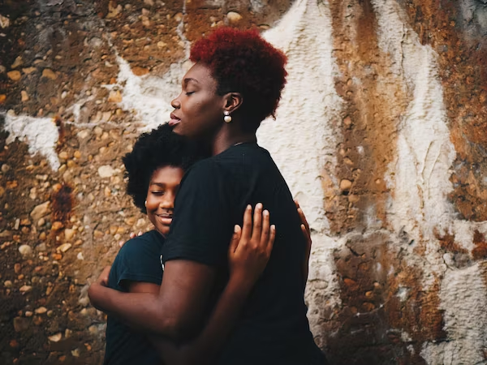
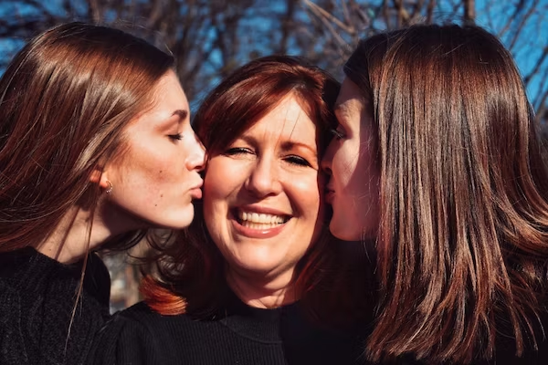
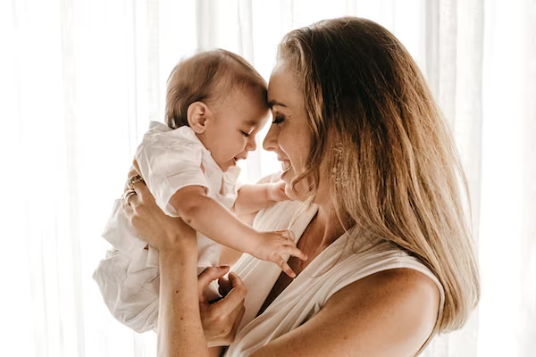

This article has been written and researched by our expert Loveable through a precise methodology. [Learn more about our methodology](https://avada.io/loveable/our-methodological.html)

[Loveable](https://avada.io/loveable/) > [Blog](https://avada.io/loveable/blog/) > [Family](https://avada.io/loveable/family/)

# 89 Heartwarming Birthday Quotes for Mom: Celebrating the Woman Who Means the World

Written by [Rose Bryne](https://avada.io/loveable/author/rose/) Last Updated on August 25, 2023

- [Birthday Quotes for long-distance mom](https://avada.io/loveable/blog/birthday-quotes-for-mom/#wp-block-heading-2-3) 
- [Funny Birthday Quotes for Mom](https://avada.io/loveable/blog/birthday-quotes-for-mom/#wp-block-heading-2-32)
- [Sweet Quotes for Mom](https://avada.io/loveable/blog/birthday-quotes-for-mom/#wp-block-heading-2-62)
- [Birthday Blessings to Mom](https://avada.io/loveable/blog/birthday-quotes-for-mom/#wp-block-heading-2-87)
- [Bottom Line](https://avada.io/loveable/blog/birthday-quotes-for-mom/#wp-block-heading-2-110) 

In this modern world, **birthday quotes for mom** is a collection of sincere sayings that celebrate and value the unique connection a mother and her child have in a world full of love and respect. The sentiments expressed in these thoughtfully chosen birthday quotes for your mom perfectly express our unwavering love, awe, and gratitude for our mothers. Each quotation honors her love, tenacity, and wisdom while attesting to the immense influence she has had on our lives.

Birthdays are a priceless chance to tell our mothers how much they mean to us and convey our deepest feelings. These birthday quotes for Mom express our deepest love, thanks, and admiration through a tapestry of sentiments that goes beyond simple words. These endearing quotes honor our wonderful mother by conveying the beauty of motherhood as well as thanks for her sacrifices and constant support. As we celebrate and appreciate the woman who holds a special place in our hearts, may these birthday quotes for Mom serve as a sincere tribute.

## **Birthday Quotes for long-distance mom** 

We must face the inevitable as we become older. We don’t live with our beloved ones any longer. It’s difficult not to be able to celebrate your mother’s birthday with her, whether you’re in college or have moved into your own home. She could try to assure you that everything would be fine, but you know that all she really wants is to meet you on her special day. 

You should make certain that she receives a heartfelt message if you are unable to be with her on her birthday. Let her feel your presence while you speak to her from the bottom of your heart. Here are a few of our favorite ways to say “Happy Birthday” even if you can’t be there in person, in case you need some ideas.

1. “I don’t get to see you often, but on this day, you are the most important person to me, have a wonderful birthday, Mom!”

2. “Mom, you showed me how to face the world, and now I’m traveling it! I couldn’t be more grateful for everything you have taught me. Happy birthday!”

3. “Happy Birthday to my one and only Mom; you are the best Mom one can ever ask for. On your birthday, I wish you nothing but the best. Sending lots of hugs and kisses from far away.”

4. “Mom, the more you praise and celebrate your life, the more there is in life to celebrate. I might not be there with you today, but today I am celebrating you. Happy birthday!”

5. “Mom, no matter where I go, you will always be the home I will come back to. Thank you for nourishing and spoiling me with love and care. Wonderful birthday!”

6. “Happy birthday, Mom! I want you to know that I am nothing without you, but I can be everything with you by my side. Love you!”

7. “Here is a big hug from your favorite child. My heartiest wishes are for you many years full of joys, laughter, presents, and surprises. Have a spectacular birthday!

8. “Sending birthday wishes to the best mom. You are my friend, my confidante, and I don’t know where I’d be without you.”

9. “Sending love and hugs from afar to you, my Mom, my superstar! I hope that this day is just as special as you are! Thank you for everything that you have done for me – you mean more to me than words can say. Happy birthday!”

10. “The only time I am truly happy is when I hear your voice. Happy birthday, sweet mom.”

11. “I’m sorry that I can’t be with you today to celebrate your special day, but you can be sure that I’m thinking of you and wishing you a wonderful day from afar!”

12. “I hope this day brings you happiness and laughter forever. It’s nice to call you mom. I love you so much.”

13. “I send you sweet and happy words on your way to your birthday. Although we are separated, it will keep my mind and heart alive. Happy birthday, Mom!”

14. “Mom, you have a special place in my heart. For all of the support and love you have given me, I thank you and love you. You’ll always remain the number one mom to me, no matter how far I’m from you.”

15. “Do you believe in miracles? I do because having you in my life certainly seems like a miracle every single day. I love you, mom. Happy birthday!”

16. “I celebrate this special day for a special someone who is the source of inspiration and guiding light for the entire family. Happy birthday dear Mom!”

17. “Happy birthday to my beautiful mom – the woman who sacrificed many precious moments in her life, so that I could have them in mine.”

18. “Thank you for supporting me when I needed it and giving me hope when I was hopeless. Your faith in me helped me stand firmly on my feet. You are priceless to me. Happy birthday!”

19. “My dear Mom, it doesn’t matter where I go, what I do, and how far I am from you. A part of my heart is always where you are, a place that is paradise on Earth, a place that I call home. Happy birthday, Mommy!”

20. “Mom, no one can ever take your place in my heart. I love you forever and ever. No matter where I go or who I meet, you will always be number one to me.”

21. “To a mother who has always loved and protected me: I want to remind you once again that you are the greatest mom on Earth. Have a happy birthday. And may all your dreams come true.”

22. “Mom, I may be grown up now, but I want to remain your kid forever. Happy birthday, Mom!”

23. “Your strength brought me into this world. Your patience kept me in it! Happy birthday, Mom, and thanks for everything!”

24. “Dear Mom, no matter how old I get, you will always be my rock and the person I run to when I need a shoulder to lean on. Have a wonderful birthday!”

25. “Mothers are what make the home worth missing. I can’t wait to return home and spend this fabulous day with you. Happy birthday, Mom!”

## **Funny Birthday Quotes for Mom**

Birthdays are the ideal time to show our mothers how much we value and appreciate them, and what better way to do so than with some hilarious birthday quotes for mom? While simultaneously conveying our profound love and appreciation for our mothers, these amusing and lighthearted comments add cheer and lightness to the special day. 

These humorous birthday quotes for mom are likely to generate enduring memories and serve as a gentle reminder that laughing is the greatest present of all, whether you’re trying to make her smile or infuse the atmosphere with humor. Have a look at these funny birthday quotes for your mom, and you can choose some to speak out on your own!

26. “Mom, you’re not old, you’re fabulously vintage! Happy birthday!”

27. “Mom, without you, I wouldn’t be here today. No, literally, you created me, so I literally wouldn’t be here without you. Have a good birthday!”

28. “Mom, you’re not old, you’re fabulously vintage! Happy birthday!”

29. “Mom, the only “wine” you’ll hear today comes from a bottle. We’ll behave, I promise! Happy birthday!”

30. “Did you know that you have the best kid ever? Just wanted to remind you of that on your birthday. Happy birthday, Mom!”

31. “All of my crazy comes from you, and I wouldn’t have it any other way. Happy birthday, Mom!”

32. “Happy birthday, mom! I’m so happy that you look so good since I got to inherit those good-looking genes.”

33. “Happy birthday, mom! Now that I’m older, I want to say thank you for never leaving me in a shopping cart and running away. I know it was tempting, and no one would have blamed you.”

34. “I’m so lucky to have a mom who still parties like she’s in her twenties. Happy birthday and enjoy your special day!”

35. “Happy birthday. Hey Mom, don’t worry about trying to fit in with the younger crowd; I love you just the way you are! Hope your birthday celebration is everything you are hoping for.”

36. “Happy birthday to one of the few people whose birthday I can remember without a Facebook reminder. Happy birthday, Mommy!”

37. “Happy birthday to a mom who looks young enough to be my sister. Note that if you ever start looking younger than me, we’re going to have problems.”

38. “Happy birthday to my dear Mom! May we continue to drive each other crazy for years to come.”

39. “We want you to have a wonderful birthday, mom. So as your gift, we are sending Dad away on an extended vacation.”

40. “9 out of 10 scientists agree: The more birthdays you have, the longer you live. Happy birthday, Mom!”

41. “Mothers and daughters are like two peas in a pod, two kittens in a basket, two peaches in a tree. Happy birthday to my mother and best friend.”

42. “It’s time to crank up the music, pour out the drinks, and let the good times begin! Happy birthday to a very special mom. You make every day delightful.”

43. “Hey, Mom, thank goodness that I’m finally old enough to show you how I really party. Happy Birthday to you!”

44. “I’m your kid forever. Sending you special wishes written in crayon.”

45. “I just came over because I smelled birthday cake…and, of course, because I have the greatest mother in the world! Happy birthday to you, Mom!”

46. “Happy birthday, mom. Thanks for always being much older than me.”

47. “I knew exactly what you wanted for your birthday this year. Me… out of the house for a day. Happy birthday, Mom!”

48. “It’s amazing how good you look for your age, considering all the grief I gave you when I was younger. Happy birthday, Mom!”

49. “You are such a great mother. I’ve always wondered how you put up with me all these years and kept your cool. Then, I found your wine stash, and things became clear to me! Happy birthday, let’s pour a glass and celebrate!”

50. “Mom, you may be crazy, but you’re my crazy. Plus, I can’t really say anything because it sure didn’t fall far from the family tree. Happy birthday to my crazy but beloved mom!”

**_Check Out_**: Best [Thoughtful Birthday Gift Ideas For Mom](https://avada.io/loveable/birthday-gifts-for-mom/)

## **Sweet Quotes for Mom**

Every Mother’s Day, the remarkable woman who occupies a particular place in our hearts is given due honor. A genuine homage to her unwavering love, maternal qualities, and the numerous ways she has improved our lives, sweet birthday quotes for Mom. 

These sweet and loving sayings not only convey our true feelings for her but they also demonstrate the strong love and gratitude we have for her. Whether it’s a small act of kindness or a lavish party, utilizing beautiful birthday quotes for Mom is a heartfelt way to celebrate her and make her feel loved on her special day.

51. Happy birthday, Mom! I love you!

52. Happy birthday to the best mother in the universe!

53. Wishing the sweetest woman in the world a happy birthday.

54. Time to make some wishes, Mom. Happy birthday!

55. Mothers are the best gift. Happy birthday!

56. I can’t wait to celebrate your special day with you. Happy birthday!

57. Cheers to another trip around the sun!

58. Happy cake day! Enjoy.

59. You’re the best mother anyone could ever ask for. Happy birthday!

60. Wishing you the best birthday yet!

61. Happy birthday to my favorite person in the whole world.

62. Happy birthday, my beloved mother.

63. Happy birthday to my kind and loving mom!

64. Today we honor and celebrate you, Mom!!

65. I’m the luckiest person to have a mom like you. Happy birthday!

66. You’re one-of-a-kind, and I love you so much. Happy birthday, Mom!

67. I love you today, tomorrow, and forever. Happy birthday, Mom!

68. Wishing the most wonderful mom the best birthday ever!

69. Happy birthday to the person who loves me unconditionally.

70. Happy birthday to my biggest cheerleader!

71. Wishing my one and only mother a very happy birthday.

## **Birthday Blessings to Mom**

Sending genuine birthday blessings becomes a way to respect and boost your mom’s spirit as we commemorate the day she came into the world. These birthday wishes for Mom serve as a sweet reminder of the love, pleasure, and joy she contributes to our lives. 

These blessings have the capacity to touch her heart profoundly, from wishing her a day full of laughter and treasured moments to expressing gratitude for her unfailing support and direction. May these birthday blessings envelop your mom in warmth, love, and plenty of blessings on her special day and all year long.

72. God blessed me with the absolute best mother on the planet. Happy birthday, Mom!

73. When I think about the wonderful people in my life, you’re at the top of my list. Happy birthday, Mom!

74. I’m convinced that God blessed me with the absolute best mother on the planet. Happy birthday!

75. May God grant all of your heart’s desires today and always. Happy birthday!

76. God blessed me when he made you, my mom. Wishing you a splendid birthday!

77. When I look at you, I look at the wonderful woman I hope to become. Thank you for being the blueprint of an extraordinary woman.

78. There’s not a day that goes by that I don’t thank God for making you my mom. Wishing you the best birthday ever!

79. Your birthday will always be one of my favorite days. That’s because it was the day my wonderful mother was born. Happy birthday!
80. May God continue to cover you on your special day and beyond. Wishing you a fantastic birthday, Mom!

81. You’re the epitome of what a good mother should be. God blessed me when He made you my mom. Have a wonderful birthday!

82. Every day I thank the Lord for allowing someone as special as you to be my guiding light in life. Birthday blessings to you, Mom.

83. My prayer is that you get everything you want and more. You deserve it all. Happy birthday, Mom!

84. As you turn another year older, I know that God will continue to bless you. Enjoy your special day, Mom. Happy birthday!

85. May your birthday be filled with joy and endless blessings!

86. My prayer will always be for your peace and happiness. Wishing you the best birthday yet! I love you, mom.

87. I’m forever grateful to God for making me your child. Having you as a mother is the greatest blessing I could’ve ever received. Wishing you a wonderful birthday.

88. There’s nothing like a mother-and-child bond. I’m so blessed to have you as my mom. Happy birthday!

89. May the Lord’s blessings shower over you today and always. Enjoy your birthday!

**_Related_**: [Mother’s Day Quotes From Daughter](https://avada.io/loveable/mothers-day-quotes-from-daughter/)

## **Bottom Line** 

The **89 birthday quotes for Mom** mentioned above provide a touching selection of words that honor the extraordinary mothers in our lives. They are more than just words on a page; they symbolize the appreciation, respect, and love we feel for the female role models who have raised us and helped us grow. Each quotation is a gentle reminder of the significant influence moms have on the course of our lives and the crucial part they play in it.

Therefore, have a close look at all of our different birthday quotes for your mom above to opt for the most suitable ones for your own beloved mother. By offering these sincere comments that perfectly express our feelings, let’s seize the chance to make their wonderful day even more memorable. They will serve to honor your remarkable woman who has loved us without conditions and exemplified the genuine meaning of selflessness. 

- [Birthday Quotes for long-distance mom](https://avada.io/loveable/blog/birthday-quotes-for-mom/#wp-block-heading-2-3) 
- [Funny Birthday Quotes for Mom](https://avada.io/loveable/blog/birthday-quotes-for-mom/#wp-block-heading-2-32)
- [Sweet Quotes for Mom](https://avada.io/loveable/blog/birthday-quotes-for-mom/#wp-block-heading-2-62)
- [Birthday Blessings to Mom](https://avada.io/loveable/blog/birthday-quotes-for-mom/#wp-block-heading-2-87)
- [Bottom Line](https://avada.io/loveable/blog/birthday-quotes-for-mom/#wp-block-heading-2-110) 

### [Rose Bryne](https://avada.io/loveable/author/rose/)

Hi, I'm Rose! I love animals and spending time with kids. At Loveable, I help people find unique gifts for special occasions like Valentine's Day, housewarmings, and graduations. I enjoy finding gifts for kids, teens, and animal lovers that match their interests and personalities. Making gift-giving a pleasant experience is my priority. Let me assist you in finding the perfect gift!

- [Twitter](https://twitter.com/intent/tweet)
- [Facebook](https://www.facebook.com/sharer/sharer.php)
- [instagram](https://avada.io/loveable/blog/birthday-quotes-for-mom/)
- [pinterest](https://www.pinterest.com/loveablellc/)

## Related Posts

[### 30 Best 4 Year Old Birthday Party Ideas For A Memorable Celebration](https://avada.io/loveable/blog/4-year-old-birthday-party-ideas/) 

[

### 16th Birthday Party Ideas to Make an Unforgettable Day

](https://avada.io/loveable/blog/16th-birthday-party-ideas/)

[

### 150+ Inspirational Birthday Quotes to Spread Joy on Special Day

](https://avada.io/loveable/blog/inspirational-birthday-quotes/)

[

### 160+ Birthday Wishes for Wife to Express Eternal Love

](https://avada.io/loveable/blog/birthday-wishes-for-wife/)

[### 90+ Heart Touching Birthday Wishes for Niece to Make Her Day Extra Special](https://avada.io/loveable/blog/birthday-wishes-for-niece/)
