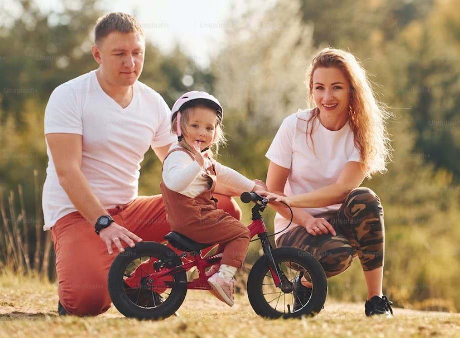
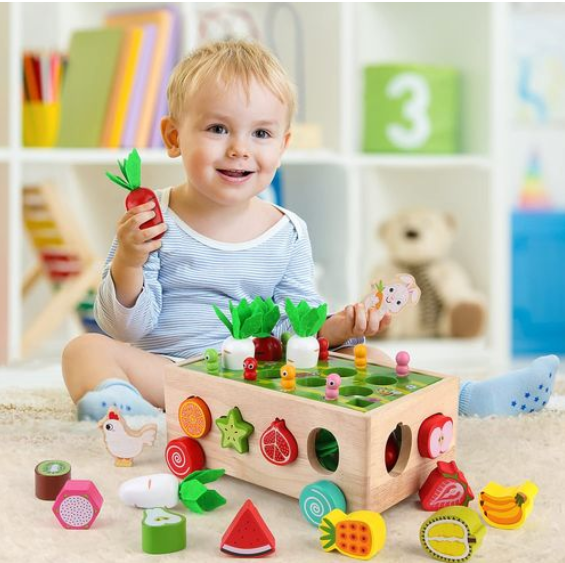
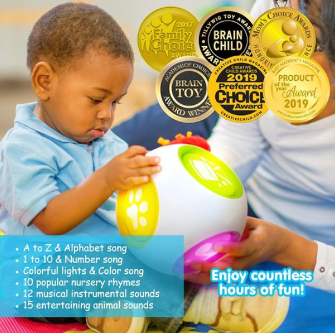
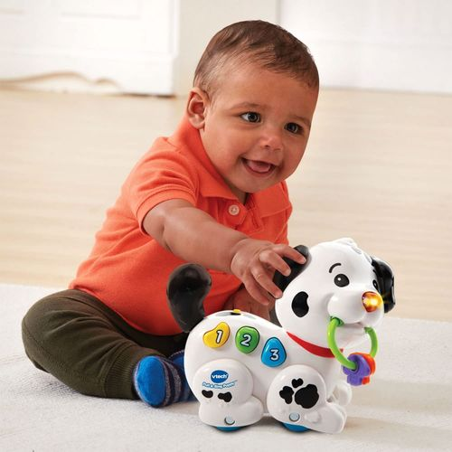
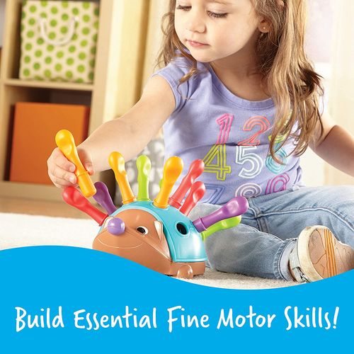
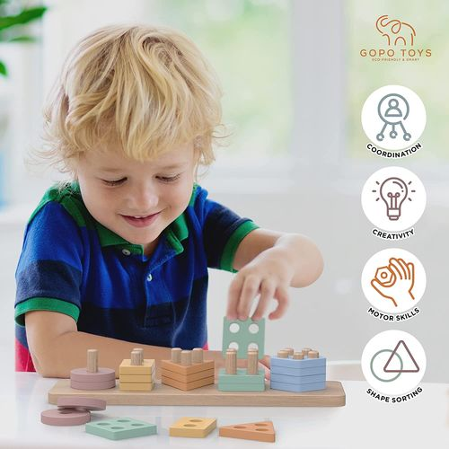
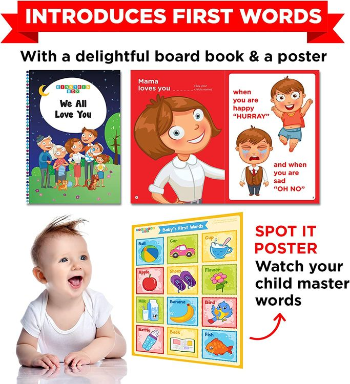

This article has been written and researched by our expert Loveable through a precise methodology. [Learn more about our methodology](https://avada.io/loveable/our-methodological.html)

[Loveable](https://avada.io/loveable/) > [Blog](https://avada.io/loveable/blog/) > [Parenting](https://avada.io/loveable/parenting/)

# 9 Activities for Your 3-Month-Old Baby: Developmental Play Ideas

Written by [Benjamin Collins](https://avada.io/loveable/author/benjamin/) Last Updated on August 28, 2023

- [9 Developmental Activities for 3-Month-Baby to Help Them Grow Mentally](https://avada.io/loveable/blog/activities-for-3-month-old-baby/#wp-block-heading-2-3)
- [6 Developmental Toys for 3-Month-Old That Are Fun and Practical](https://avada.io/loveable/blog/activities-for-3-month-old-baby/#wp-block-heading-2-34) 
- [How do I entertain my 3-month-old working from home?](https://avada.io/loveable/blog/activities-for-3-month-old-baby/#wp-block-heading-2-54)
- [What are the best things to have for a 3-month-old baby?](https://avada.io/loveable/blog/activities-for-3-month-old-baby/#wp-block-heading-2-57)
- [Bottom Line](https://avada.io/loveable/blog/activities-for-3-month-old-baby/#wp-block-heading-2-70) 

A baby’s first few months are a time of surprise and exploration as they develop and grow at an astounding rate. This is the perfect moment to introduce easy-to-engage but engaging activities promoting social, cognitive, and physical growth. Additionally, to find activities for 3-month-olds that strengthen your link with your child and promote social interaction with others, we will address their social and emotional development.

You can actively support and enrich your development by including these developmentally appropriate **activities for a 3-month-old** into your daily schedule while taking advantage of priceless opportunities for play and interaction. Let’s start this fascinating exploration together and see how your baby does! In this article, we’ll look at a selection of age-appropriate play suggestions made with your 3-month-old baby’s entertainment in mind. In addition to being enjoyable, these activities are crucial for developing their newly acquired skills and setting the groundwork for future growth.

## 9 Developmental Activities for 3-Month-Baby to Help Them Grow Mentally

1. Encourage baby to imitate

A crucial part of your baby’s early development is to encourage them to imitate. Babies discover how to interpret and navigate their surroundings by studying and imitating the activities and behaviors of those around them. You can encourage imitation by setting a good example and acting out simple gestures like hand clapping or waving goodbye. Playing games that require repeated actions, such as peek-a-boo or pat-a-cake, can help promote imitation. 

When your infant makes an attempt to mimic you, respond with enthusiasm and give them praise to help them learn and develop self-confidence. Encouragement of imitation improves their physical and cognitive skills while also fostering a sense of connection and social closeness. Babies learn to engage with others and comprehend the power of communication through imitation, setting the groundwork for later social interactions and language development.

2. Change Positions Often

Your infant needs to be moved around frequently for their overall development and well-being. Positional plagiocephaly, or flattening of the back of the skull, can occur if you regularly lie in the same position. You may assist in preventing this problem and encourage good physical development by routinely switching your baby’s position, such as switching between sleeping on their back, doing tummy time, and being held or carried in various positions. 

As different positions activate various muscles and offer various viewpoints of the environment, they also enable a variety of sensory experiences. Babies who change positions frequently learn to transfer their weight, roll over, and eventually sit up and crawl. This promotes the development of motor skills. Each position should be secure and supervised while also providing opportunities for exploration and movement, eventually promoting your child’s physical, mental, and development.

3. Tummy Time

An excellent method to engage your baby and foster development is to place her on her tummy with a few brightly colored toys in front of her. Placing some of the [educational toys](https://avada.io/loveable/educational-toys-1-year-olds/) just out of her reach will entice her to use her developing motor skills and encourage her to reach for the toys. She will hone her hand-eye coordination and build muscle strength as she tries to reach and grab the toys. You foster an atmosphere that is uplifting and supportive by lying in front of her while grinning. 

This not only promotes her physical growth but also strengthens your relationship with her. She begins remembering familiar people as she lifts her head to meet your gaze and makes social and emotional connections. Your baby will have a multifaceted experience thanks to this straightforward activity, which encourages her social, cognitive, and physical growth while also fostering lovely interactions.

4. Talk and Sing

It’s a great method to advance your baby’s language development to describe things to her in words. Summarize what she is experiencing and observing while the two of you play and explore together. You help her develop connections between objects and their properties by giving her vocal descriptions of the surroundings in addition to helping her vocabulary grow. 

These verbal cues aid her cognitive growth and enable her to comprehend and analyze her surroundings. As they are still developing their language skills, exposing infants to a rich linguistic environment is crucial. It’s equally important to offer enough time for rest and silence so that their minds can properly process and assimilate the knowledge they’ve just received. Maintaining a balance between verbal stimulation and quiet time promotes a baby’s overall well-being and healthy cognitive development.

5. Practice Tracking Toys and People

Lay your infant down and roll a ball gently in front of her to help develop his or her visual tracking abilities. Encourage her to keep her eyes on the moving ball. Her visual synchronization and tracking skills are improved by this straightforward yet useful activity. You may add different toys or even individuals to the scene to give her new things to focus on. You provide her with new stimuli to watch and follow by introducing other things and people.

Her attention can be drawn to the action and made more interesting by the auditory stimulus. Be sure to provide a secure environment. Remember to set up a secure setting for this playtime, making sure there is room for her to roam freely. You are actively developing her intellectual and sensory development while encouraging a sense of curiosity and discovery by including these engaging and visually appealing experiences in her playtime.

6. Sing lullabies and Nursery Rhymes

The development and emotional health of your 3-month-old infant might be significantly impacted by you singing lullabies and nursery rhymes to them. Lullabies’ calming and melodic qualities aid in the creation of a quiet and nurturing environment, making it simpler for your infant to unwind and fall asleep. Nursery rhymes’ repeating beats and soothing melodies boost children’s aural senses and may even help them learn a language. 

Your kid will start to understand the tone and rhythm of your voice as you sing to them, deepening your bond. Singing lullabies and nursery rhymes to your baby during naptime, bedtime, or just a peaceful moment together may be calming and comforting for both of you while encouraging an early love of music and language.

7. Mirror On The Wall

Who would have thought that something so straightforward could be so captivating to children? Their young minds are mesmerized by the mystery of faces, including their own reflection. They are unaware they are looking at their own image, but their curiosity sparks a world of wonder and joy. Give them an unbreakable mirror, and get ready to see the most unadulterated joy play out right before your eyes. Their eyes enlarge as they catch sight of their reflection, and a sweet grin starts to form on their small lips.

A symphony of laughing fills the room as this sight warms hearts. This new playmate, an endless source of fun and self-admiration, is welcomed by their naive souls. The mirror becomes closer to them with each passing second, sharing their secrets and giving them a glimpse into a world that is uniquely their own. The happiness discovered in that indestructible mirror paints a picture of unending fascination.

8. Touching Different Textures

Young children’s development journey includes engaging with a variety of textures in crucial ways. It turns tummy time into a way for children to participate actively, making it a more engaging activity. You can gather a variety of textures and adhere them on a solid piece of cardboard to make a dynamic busy board. 

To avoid the possibility of the infant placing any of the materials in their mouth, it is essential to make sure everything is tightly fastened. A world of exploration and discovery is fostered for their developing minds by this sensory journey through touch, which not only enthralls their senses but also fosters the development of their cognitive and motor skills.

9. Riding A Bicycle Movement 

Even in its most basic form, the exercise of riding a bicycle gives young children a way to extend their limbs and increase blood flow. Although they might not be ready for a real bicycle just yet, simulating the pedaling motion can be fun and useful. You can gently cycle your baby’s legs while supporting their back and setting their feet on a comfortable surface. Their muscles stretch as their legs swing back and forth, increasing flexibility and enhancing circulation. 

Their coordination and balance are also stimulated by this rhythmic activity, setting the foundation for upcoming physical milestones. You can’t help but smile along with them as they participate in this imaginary ride since their happiness is contagious. So encouraging mobility in this way paves the way for lifelong enjoyment of physical play and frees their spirits to explore the world around them.

## 6 Developmental Toys for 3-Month-Old That Are Fun and Practical 

Selecting the best developmental toys can keep kids amused while supporting their cognitive, sensory, and physical development. This post will look at six entertaining and useful toys for babies three months old. These carefully chosen selections offer a balance of enjoyment and educational value, from toys that stimulate their senses to those that improve fine motor skills and tummy time. These 6 developmental toys for a 3-month-old, whether you are a parent, a caregiver, or a family member, can be crucial in fostering your child’s development and making sure they have an enjoyable and exciting play experience.

[**1\. Montessori Wooden Garden Toy**](https://www.amazon.com/SKYFIELD-Montessori-Developmental-Sorting-Orchard/dp/B0B5RG691D/)

The wooden garden toy was thoughtfully created using the Montessori approach, which prioritizes your child’s interests while developing a curriculum. When your child is just a few months old and ready to experience real life through this game, you should buy this toy.

[**2\. Educational Musical Activity Center Block Toy**](https://www.amazon.com/BEST-LEARNING-Learning-Cube-Educational/dp/B01NCVR8QV?ie=UTF8&tag=loveable06-20)

Encourage your child’s curiosity by playing with the center block toy. Just from 3 months old, the product perfectly develops children. It introduces children to a brand-new world full of intriguing and fun things to discover. Keep their interest by incorporating educational teachings into some entertaining activities.

[**3\. Pull and Sing Puppy**](https://www.amazon.com/VTech-Pull-and-Sing-Puppy/dp/B01MQ3YP7Y/?ie=UTF8&tag=loveable06-20)

Your 3-month-old toddler will have a best buddy if you send them the adorable puppy. By pulling the toy, and educating toddlers’ minds through music, your children will enjoy music and remain cheerful all day.

[**4\. Spike The Fine Motor Hedgehog**](https://www.amazon.com/Learning-Resources-Spike-Hedgehog-Sensory/dp/B078WM314M/?th=1)

A developmental toy is an excellent activity for your 3-month-old child’s brain development and finger control. Your children will enjoy playing with the fine-motor hedgehog educational toy while developing finger flexibility.

[**5\. Wooden Sorting and Stacking Toys**](https://www.amazon.com/GOPO-TOYS-Montessori-Toys-Months/dp/B09HN4SW88/?ie=UTF8&tag=loveable06-20)

You are demonstrating your affection for your toddler by giving them the wooden sorting and stacking toy. If your children are 3 months old, toddlers can use the product. Being an educational toy, it can help the child develop greater finger dexterity and mental training.

[**6\. Board Books and Pretend Play Gift Pack**](https://www.amazon.com/Einstein-Box-Toddler-Learning-Educational/dp/B01N5267EI/?ie=UTF8&tag=loveable06-20)

Offering up to five toys for babies as young as under one year old, the learning set is truly fantastic. When he or she started playing with this toy set, the fun would never end. enhancing toddlers’ learning of languages, recognition of objects around them, and memory and cognition.

## How do I entertain my 3-month-old working from home?

It can be a pleasant task to figure out how to amuse and engage a 3-month-old while working from home. Making your baby’s environment safe and stimulating is one practical strategy. Set up a specific play area near your workstation, complete with soft, colorful materials to draw their interest and toys. Plan brief periods of time throughout the day for them to explore and develop the muscles on their stomachs because tummy time is essential for their growth. 

Take quick pauses from your work whenever you can to spend time with your kid, playing simple games like peek-a-boo or gently teasing them. Always keep an eye on your child’s activities and put their safety first by ensuring the play environment is secure. Balancing work and the baby’s amusement may need some juggling, but it can help to establish a supportive and exciting atmosphere for their growth and development.

## What are the best things to have for a 3-month-old baby?

When preparing for a 3-month-old baby, it’s essential to consider their basic needs, safety, and developmental stimulation. Here are some items that are commonly recommended for a 3-month-old baby:

- Clothing: Stock up on onesies, sleepers, socks, and hats. Opt for comfortable and soft materials like cotton.

- Diapers and wipes: Have an ample supply of diapers in the appropriate size for your baby. You’ll also need baby wipes for diaper changes.

- Baby bedding: Get a crib or bassinet with a firm mattress and fitted sheets. Following safe sleep practices is important, such as placing the baby on their back to sleep.

- Feeding supplies: If you’re breastfeeding, consider nursing bras, breast pads, and a breast pump if you plan to express milk. If bottle-feeding, have a supply of bottles, nipples, and formula if needed.

- Burp cloths: Keep a stack of soft burp cloths or muslin cloths handy for spit-ups and drools.

- Toys and developmental aids: At this stage, babies begin to explore and interact with their surroundings. Consider age-appropriate toys, such as soft rattles, teething toys, and colorful play mats.

- Nursing pillow: A nursing pillow can provide support and comfort while breastfeeding, allowing you to maintain a good position.

Remember, every baby is unique, and their needs may vary. It’s always a good idea to consult with your pediatrician or other experienced parents for personalized recommendations.

**_See More:_**

- Stimulating [Activities with 4-Month-Old Baby](https://avada.io/loveable/blog/activities-4-month-old-baby/)

- Fun and Creative [Activities for a 5-Month-Old Baby](https://avada.io/loveable/blog/activities-for-5-month-old-baby/)

## Bottom Line 

Engaging in age-appropriate **activities for a 3-month-old baby** not only promotes their development but also strengthens the bond between you. From tummy time and sensory play to music and gentle exercises, these nine activities offer stimulating and enjoyable experiences that support your baby’s growth and milestones.

You may encourage your child’s developing senses, motor abilities, and social connections while also setting the groundwork for their future development and learning by including tummy time, sensory play, and interactive games. After checking out all of the recommended activities above, you surely have clear thoughts about which activities for a 3-month-old baby you should opt for. 

- [9 Developmental Activities for 3-Month-Baby to Help Them Grow Mentally](https://avada.io/loveable/blog/activities-for-3-month-old-baby/#wp-block-heading-2-3)
- [6 Developmental Toys for 3-Month-Old That Are Fun and Practical](https://avada.io/loveable/blog/activities-for-3-month-old-baby/#wp-block-heading-2-34) 
- [How do I entertain my 3-month-old working from home?](https://avada.io/loveable/blog/activities-for-3-month-old-baby/#wp-block-heading-2-54)
- [What are the best things to have for a 3-month-old baby?](https://avada.io/loveable/blog/activities-for-3-month-old-baby/#wp-block-heading-2-57)
- [Bottom Line](https://avada.io/loveable/blog/activities-for-3-month-old-baby/#wp-block-heading-2-70) 

### [Benjamin Collins](https://avada.io/loveable/author/benjamin/)

I'm Benjamin Collins, a gift ideas creator at Loveable. We specialize in unique and personalized gifts for any occasion. With my honed skills, I recommend gifts tailored to the recipient's personality and interests, whether it's Halloween, Christmas, or any other celebration.

- [Twitter](https://twitter.com/intent/tweet)
- [Facebook](https://www.facebook.com/sharer/sharer.php)
- [instagram](https://avada.io/loveable/blog/activities-for-3-month-old-baby/)
- [pinterest](https://www.pinterest.com/loveablellc/)

## Related Posts

[

### 79 Heartfelt Missing Mom Quotes for Expressing Love and Longing

](https://avada.io/loveable/blog/missing-mom-quotes/)

[

### Parenting with Depression: Strategies for Coping, Seeking Help, and Building Resilience

](https://avada.io/loveable/blog/parenting-with-depression/)

[

### 100 Empowering Single Mom Quotes: Inspirational Words for Strong Mothers

](https://avada.io/loveable/blog/single-mom-quotes/)

[

### 99+ Heartfelt Quotes And Wishes: Happy Anniversary to Mom and Dad!

](https://avada.io/loveable/blog/quotes-happy-anniversary-mom-dad/)

[

### 5 Ways to Foster a Positive Parent-Teacher Relationship

](https://avada.io/loveable/blog/parent-teacher-relationship/)
