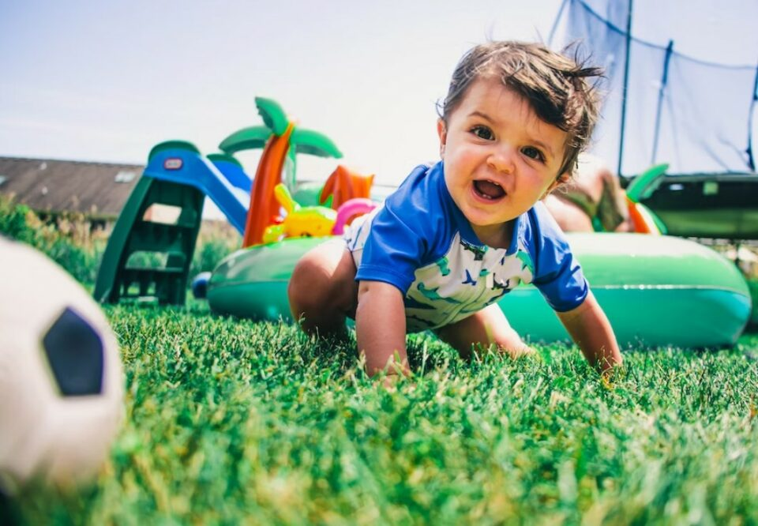
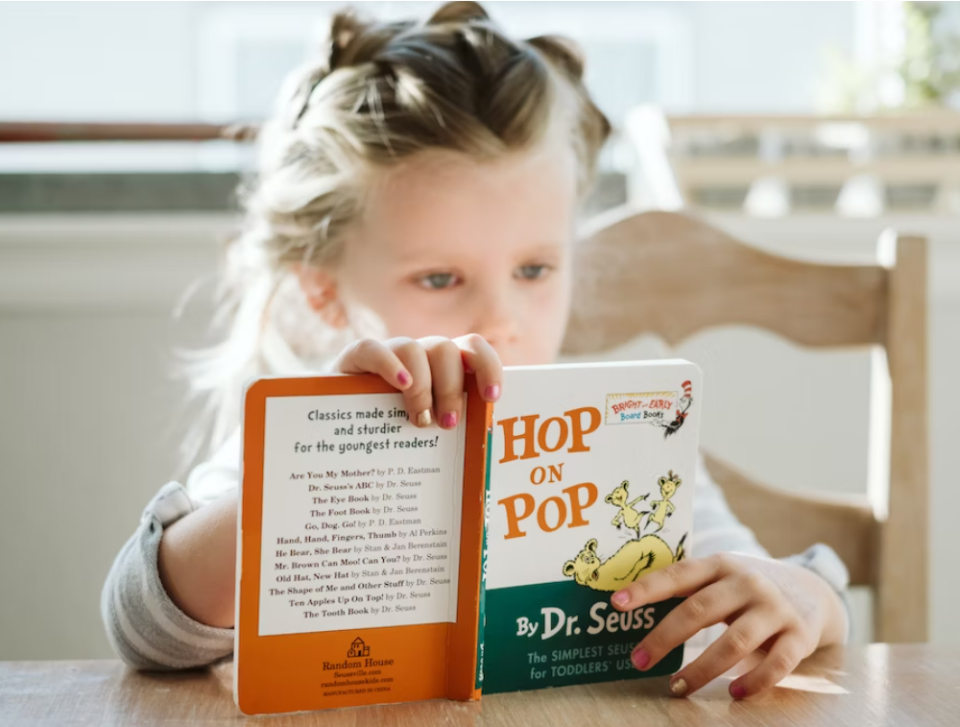
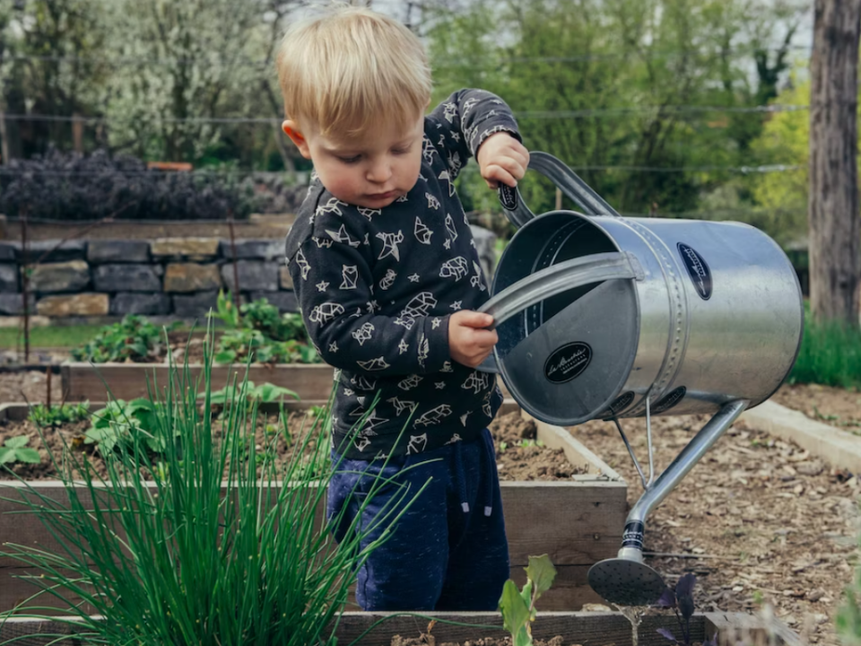
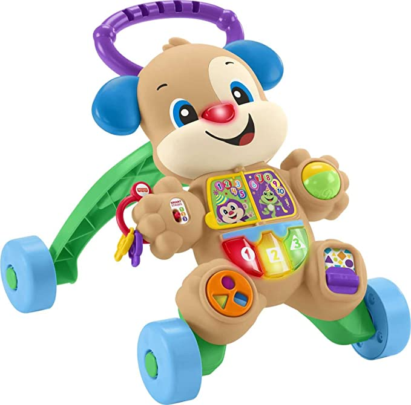
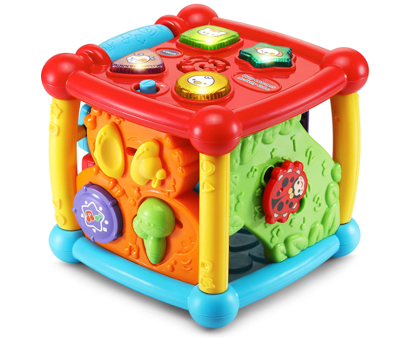
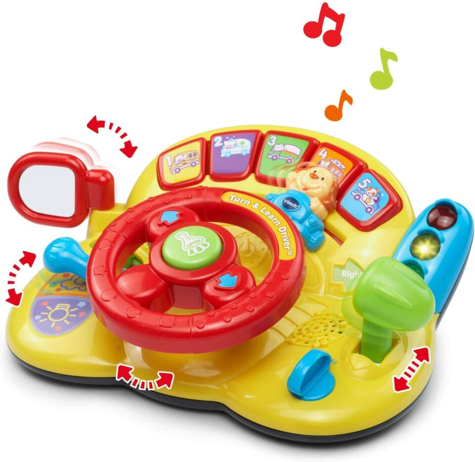

This article has been written and researched by our expert Loveable through a precise methodology. [Learn more about our methodology](https://avada.io/loveable/our-methodological.html)

[Loveable](https://avada.io/loveable/) > [Blog](https://avada.io/loveable/blog/) > [Parenting](https://avada.io/loveable/parenting/)

# 9 Fun and Stimulating Activities for an 8-Month-Old: Ideas to Encourage Learning and Growth

Written by [Benjamin Collins](https://avada.io/loveable/author/benjamin/) Last Updated on August 28, 2023

- [9 Fun and Developmental Activities for an 8-Month-Old](https://avada.io/loveable/blog/activities-for-8-month-old/#wp-block-heading-2-3)
- [5 Best Developmental Toys For 8-Month-Old That Will Help Them Grow](https://avada.io/loveable/blog/activities-for-8-month-old/#wp-block-heading-2-35)
- [FAQ Activities for an 8-month-old](https://avada.io/loveable/blog/activities-for-8-month-old/#wp-block-heading-2-45) 
- [Bottom Line](https://avada.io/loveable/blog/activities-for-8-month-old/#wp-block-heading-2-57) 

Finding amusing and exciting **activities for an 8-month-old** child is not easy because your infant is beginning to show signs of increasing curiosity and a desire to explore their surroundings at around eight months old. However, playing games and engaging with your 8-month-old helps promote their learning and development and keeps them entertained as well. There are endless possibilities to promote your baby’s cognitive, emotional, and physical growth, whether through sensory experiences, fine motor skill development, or social connections. 

And if you want your baby to gain all of the benefits above but do not know which activities are the best to opt for, check out this article. We provide 9 enjoyable activities that will hold your 8-month-old’s interest and as well as aid in their process of discovery and growth. We believe that with our stimulating **activities for an 8-month-old**, your child will probably be encouraged to learn and grow efficiently and be ready for the near future.

## **9 Fun and Developmental Activities for an 8-Month-Old**

1. **Helping Them Stand**

Many infants begin avidly exploring their mobility at around 8 months of age and make attempts to stand and cruise as they get ready to take their first steps. By introducing a fun game into their daily routine, you may actively encourage and improve this achievement. Playing the “stand-up-sit-down” game helps them build their leg muscles and teaches them the basics of maintaining their own weight in an upright position while also adding a fun factor. 

You can exercise your baby’s leg muscles and develop their coordination by encouraging them to stand up and gently helping them sit back down. This engaging game gives your child a great chance to practice bearing weight and develop strength, laying the ground for the later, like walking on their own. So take hold of your child’s hands, prepare for some delightful bonding, and observe as they set out on this exciting physical development adventure.

2. **Crawling** 

During the early months of a child’s growth, engaging in activities that support physical development is a must. This game presents an excellent chance to encourage your 8-month-old to start their path of independent movement, just as you helped them learn the skill of standing up straight. You can encourage their exploration and coordination abilities by making the act of crawling into a fun game. Create a fun obstacle course for them to traverse over or around using [pillows](https://avada.io/loveable/personalized-pillows/) or toys, which will surely develop their cognitive and motor skills.

Moreover, you can accelerate their growth by converting this crawling game into a thrilling game of “follow the leader.” Their sense of observation and spatial awareness are further stimulated as they watch and mimic your motions. Encourage them to move at the same pace as you do so that teamwork and connection can be fostered. You may enable them to build their own style and confidence in moving independently by actively joining in and offering moderate assistance.

3.  **Sensory Bags** 

Your children can learn to use their senses to make connections between what they perceive and the world around them. You can make sensory bins and bags by placing various tactile objects in a bag and having your toddler remove each one at a time. Because they will probably wind up in your child’s mouth, ensure the objects are nontoxic and large enough not to pose a choking threat.

It might be demanding to keep your infant active and busy all day. Take the necessary time to take care of your own sleep and address any issues, such as snoring, that may be keeping you up at night. Therefore, learn how to balance the amount of time for your baby and yourself with these tips.

4. **Reading** 

Reading to your child is a wonderful way to broaden their vocabulary and get them interested in the many lovely aspects of books. They can learn new ideas that they have never attached before and sharpen their critical thinking skills by reading a new book.

To interest your child in the story, start with brief, [personalized children’s books](https://avada.io/loveable/personalized-children-books/) that are written for babies of this age. Have them point out familiar things or animals or even “help” you count the number of trees or flowers on the page. In order to assist your child in winding down and improve the likelihood of everyone receiving a good night’s sleep, this is a wonderful activity to incorporate into your bedtime ritual.

5. **Play with Stacker Toys**

Definitely, the best things they want when receiving a [gift for an 8-month-old](https://avada.io/loveable/gifts-8-month-old/) are toys. And these toys offer countless hours of enjoyment and opportunities. Babies who play with stacker toys improve their fine motor skills by gripping each piece. As they learn to arrange the rings or blocks in a building, stacking also helps children develop their spatial awareness. Additionally, by introducing ideas like size, shape, and color awareness, stacking toys promote cognitive development; they can learn to feel a sense of winning when they properly stack the pieces. 

In addition, stacking toys spark young minds and creativity, letting them try various constructions and combinations. Stacker toys are essential to any playtime routine as they fill babies with joy and satisfaction whether they play on their own or with a caregiver. This full learning experience is made possible by stacker toys.

6. **Play with Plants** 

Children are exposed to the delights of the world while having their senses stimulated when nature is brought within. Babies can discover different textures and scents by smelling flowers, feeling the softness of petals, and touching leaves. Their ability to detect their surroundings is improved, and this sensory experience helps them develop their fine motor skills. 

As kids see the development and change of living things, playing with plants can also stimulate children’s imagination. Parents can help their babies develop a connection to nature at a young age by carefully choosing plants that are safe for children and offering supervised playtime. So start having fun as you and your child travel in a lighthearted manner while making lovely memories amidst the natural surroundings!

7. **Water Playing**

A wonderful approach to expose babies to a world of sensory exploration and discovery is through water play. Water play provides countless chances for learning, whether it is a splash in the bathtub, a pool, or a trip to the beach. Baby’s skin may feel the calming effects of water, boosting their tactile senses and fostering body awareness. Their fine motor abilities and hand-eye coordination increase when they grab, splash, and pour water.

Young children can witness cause and effect by watching objects sink or float, which makes water a teaching tool for early studies. Water play is crucial for parents and their infants to bond, which may lead to priceless times of delight and laughter. Water play is a refreshing and entertaining approach for newborns to engage their senses and experience the wonders of the aquatic environment when proper supervision and safety measures are in place.

8. **Music**

As your child sets out on a beautiful trip of rhythm and sound, turn up the music and let it fill the air. Babies have a remarkable capacity to understand and react to beats and melodies from an early age. Not only does playing music pleasure and entertain kids, but it also has a big impact on how their brains develop. Music engages their senses and fosters their cognitive abilities. As they listen to tunes and lyrics, it stimulates their imagination and improves their language skills. 

When musical instruments are included in their play, the experience is enhanced, and newborns are given the opportunity to investigate sounds, textures, and various music production techniques. So grab a shaker and collaborate with your child to compose a joyful symphony. Let the joy of harmony flood their senses, and the power of music nourish their developing minds!

9. **Outdoor activities** 

The wonders of nature can be introduced to babies through outdoor activities, exposing them to a wide range of sensory experiences. The outdoors provides a sensory feast for their senses, from a soft breeze caressing their skin to the vivid hues of flowers and the chattering of birds. Taking infants outside promotes physical activity and curiosity and exposes them to clean air and natural light. 

Outdoor activities encourage and help build their muscles, whether they involve strolls through the park or crawling on the grass. They are able to feel various textures and even experience the feeling of rain on their skin. In addition to boosting social connection, outdoor play allows newborns to interact with other kids. So get a picnic blanket and allow your child to explore the beauties of nature. It is a veritable gold mine of things waiting to be discovered!

## **5 Best Developmental Toys For 8-Month-Old That Will Help Them Grow**

1. [**Toddler Toy Smart Stages Learn With Puppy Walker**](https://www.amazon.com/Fisher-Price-Laugh-Learn-Stages-Walker/dp/B074ZDNJBD/ref=sr_1_1_sspa?keywords=8%2Bmonth%2Bbaby%2Btoys&qid=1684341422&sr=8-1-spons&spLa=ZW5jcnlwdGVkUXVhbGlmaWVyPUFNR1pNNE5DWE4yNzQmZW5jcnlwdGVkSWQ9QTA5NjQzMjRBVUVQODE5Qk1PT1ImZW5jcnlwdGVkQWRJZD1BMDc1Njc3OTNWQ0lDMldCNFFONVQmd2lkZ2V0TmFtZT1zcF9hdGYmYWN0aW9uPWNsaWNrUmVkaXJlY3QmZG9Ob3RMb2dDbGljaz10cnVl&th=1)

This is an engaging and interactive toy designed for babies aged 8 months and older. This walker combines the joy of walking with a variety of educational activities to enhance early learning and motor skills development. The toy features multiple play modes that adapt to the baby’s growth and abilities, providing a progressive learning experience. It offers fun phrases, songs, and sounds that introduce numbers, colors, shapes, and more, fostering language development and cognitive skills. 

2. [**VTech Sit-To-Stand Learning Walker**](https://www.amazon.com/VTech-Sit-to-Stand-Learning-Walker-Blue/dp/B07CRSXMW8/ref=sr_1_2?keywords=8%2Bmonth%2Bbaby%2Btoys&qid=1684341422&sr=8-2&th=1)

This interactive walker offers a two-in-one experience, functioning as a supportive walker for early steps and a stimulating activity center. It features a detachable play panel with various buttons, gears, and shape sorters, promoting fine motor skills and hand-eye coordination. Its adjustable handle height allows the toy to grow with the child, ensuring extended usability and enjoyment. With its vibrant design and versatile functionality, this toy offers a fun and educational playtime experience for curious little ones.

3. [**VTech Turn and Learn Driver**](https://www.amazon.com/VTech-Learn-Driver-Frustration-Packaging/dp/B078KGNGNS/ref=sr_1_3?keywords=8%2Bmonth%2Bbaby%2Btoys&qid=1684341422&sr=8-3&th=1)

The VTech Learn and Discover Driver is an engaging and interactive toy designed to captivate the imagination of babies aged 8 months and older. Shaped like a steering wheel, this toy features a variety of buttons, levers, and gears that provide a sensory-rich play experience. It introduces little ones to letters, numbers, colors, and shapes through fun phrases, sound effects, and music, fostering early language and cognitive development.

## **FAQ Activities for an 8-month-old** 

1. **How long can an 8-month-old play alone?**

The duration of independent play for an 8-month-old can vary. On average, an 8-month-old baby can engage in independent play for short periods of time, typically ranging from 10 to 20 minutes. However, every baby is unique; some may have longer attention spans or enjoy solo play for shorter intervals. It is important to remember that infants at this age still require adult supervision and interaction to ensure their safety and overall well-being.

2. **Is it OK for 8 month old to play alone?**

Yes, it is generally okay for an 8-month-old to engage in supervised independent play for short periods. Independent play can foster their exploration, creativity, and problem-solving skills. However, it is important to maintain a safe environment, regularly check on the baby, and provide responsive interactions and support when needed.

3. **What games can I play with my 8-month-old baby?**

You can play several games with your 8-month-old baby to encourage their development and bonding. Peek-a-boo is a classic game that helps develop object permanence and social interaction. Pat-a-cake and finger play with nursery rhymes promote fine motor skills and language development. Lastly, you can engage in sensory play with toys like rattles or textured objects to stimulate your senses and exploration.

4. **Do 8-month-olds watch TV?**

It is generally not recommended for 8-month-olds to watch TV. Babies benefit more from interactive, hands-on experiences and face-to-face interactions with caregivers at this stage. Screen time should be limited, as excessive screen exposure may interfere with their cognitive and social development.

_**See More:**_

- Creative and Engaging [9-Month-Old Activities](https://avada.io/loveable/blog/9-month-old-activities-ideas/)

- Fun and Engaging [Activities with 10-Month-Olds](https://avada.io/loveable/blog/activities-with-10-month-olds/)

## **Bottom Line** 

Engaging in fun and stimulating **activities for an 8-month-old** can positively impact their learning and growth. From sensory play with different textures to interactive games like peek-a-boo and stacking toys, there are numerous opportunities to promote their motor skills, cognitive development, and social interaction.

Remember to provide a safe environment, offer age-appropriate toys, and be present and responsive during playtime to foster a strong bond with your little one while supporting their overall development. Enjoy these precious moments with some of the best recommendations for activities for an 8-month-old above, and explore and discover together!

- [9 Fun and Developmental Activities for an 8-Month-Old](https://avada.io/loveable/blog/activities-for-8-month-old/#wp-block-heading-2-3)
- [5 Best Developmental Toys For 8-Month-Old That Will Help Them Grow](https://avada.io/loveable/blog/activities-for-8-month-old/#wp-block-heading-2-35)
- [FAQ Activities for an 8-month-old](https://avada.io/loveable/blog/activities-for-8-month-old/#wp-block-heading-2-45) 
- [Bottom Line](https://avada.io/loveable/blog/activities-for-8-month-old/#wp-block-heading-2-57) 

### [Benjamin Collins](https://avada.io/loveable/author/benjamin/)

I'm Benjamin Collins, a gift ideas creator at Loveable. We specialize in unique and personalized gifts for any occasion. With my honed skills, I recommend gifts tailored to the recipient's personality and interests, whether it's Halloween, Christmas, or any other celebration.

- [Twitter](https://twitter.com/intent/tweet)
- [Facebook](https://www.facebook.com/sharer/sharer.php)
- [instagram](https://avada.io/loveable/blog/activities-for-8-month-old/)
- [pinterest](https://www.pinterest.com/loveablellc/)

## Related Posts

[

### 79 Heartfelt Missing Mom Quotes for Expressing Love and Longing

](https://avada.io/loveable/blog/missing-mom-quotes/)

[

### Parenting with Depression: Strategies for Coping, Seeking Help, and Building Resilience

](https://avada.io/loveable/blog/parenting-with-depression/)

[

### 100 Empowering Single Mom Quotes: Inspirational Words for Strong Mothers

](https://avada.io/loveable/blog/single-mom-quotes/)

[

### 99+ Heartfelt Quotes And Wishes: Happy Anniversary to Mom and Dad!

](https://avada.io/loveable/blog/quotes-happy-anniversary-mom-dad/)

[

### 5 Ways to Foster a Positive Parent-Teacher Relationship

](https://avada.io/loveable/blog/parent-teacher-relationship/)
