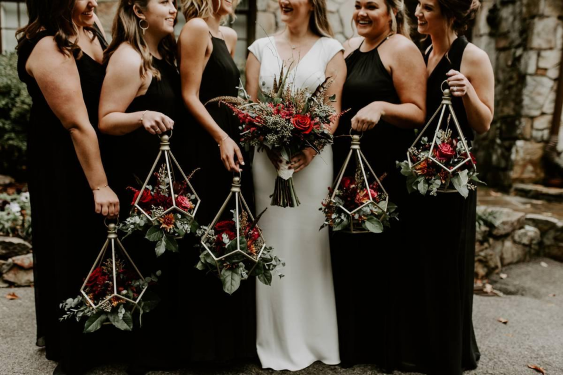
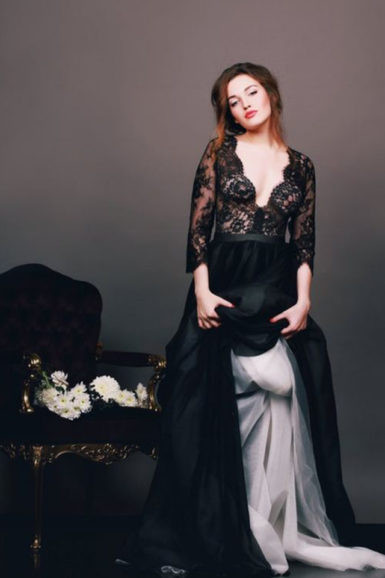
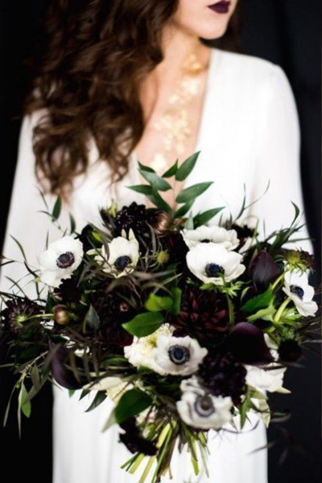
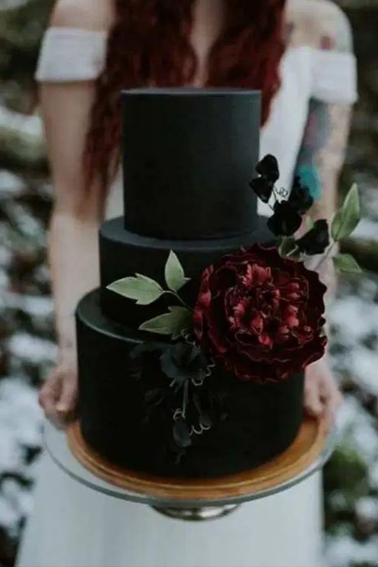
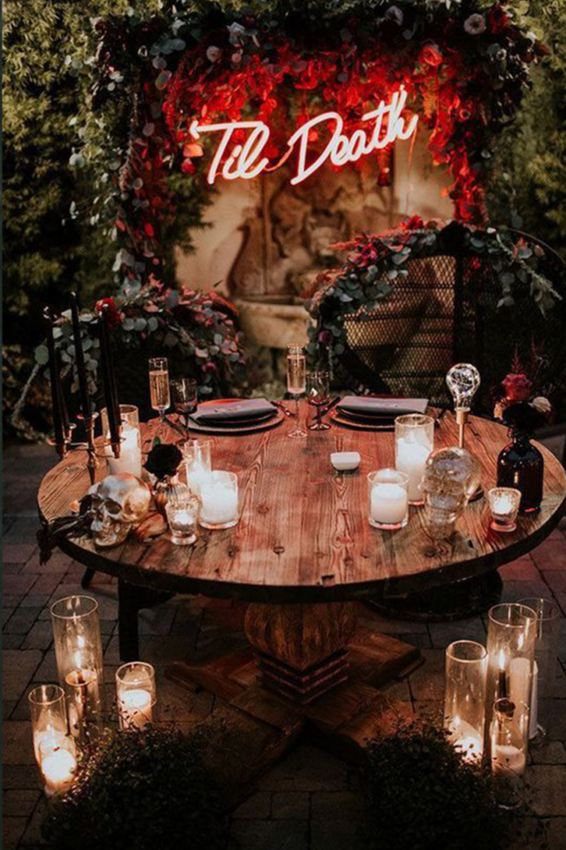
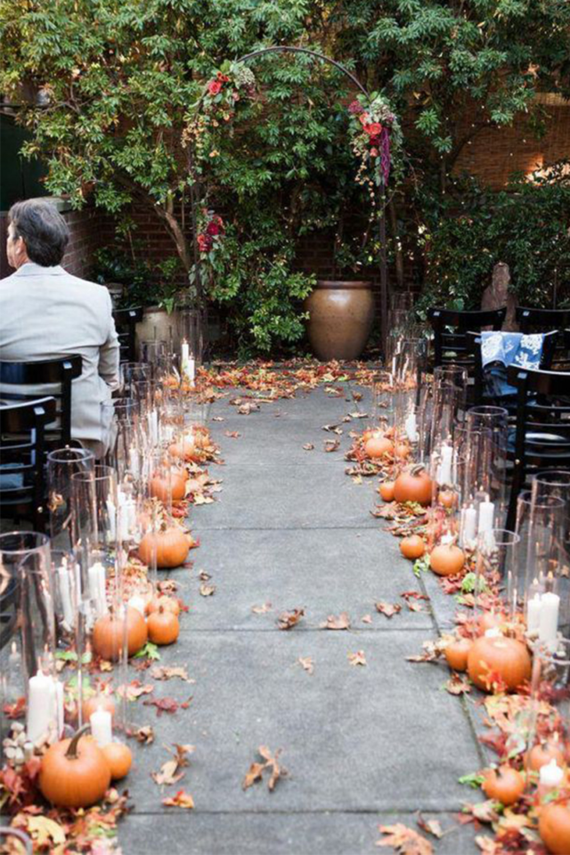
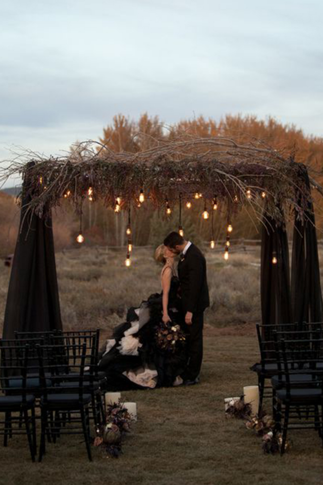
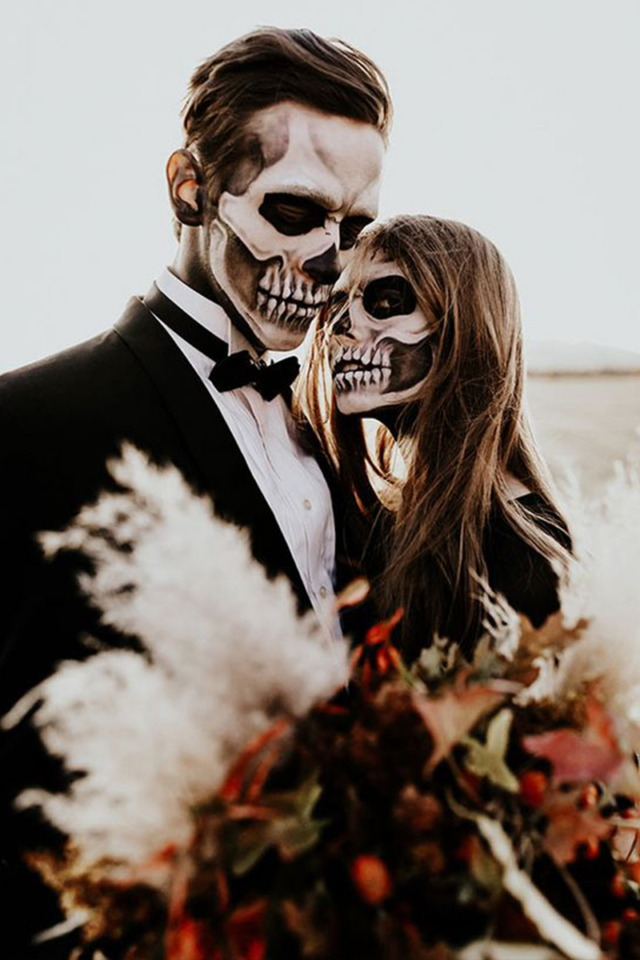
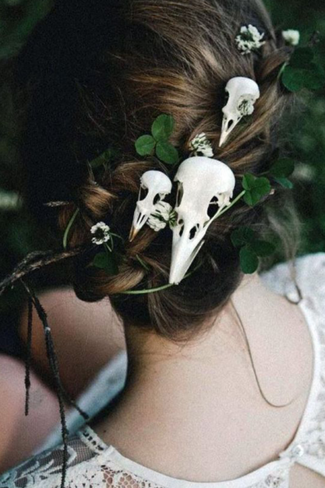
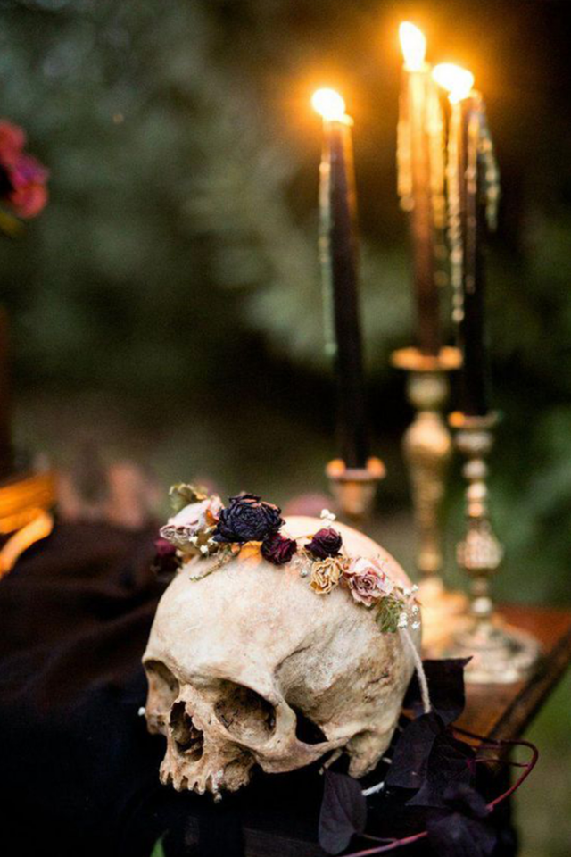

This article has been written and researched by our expert Loveable through a precise methodology. [Learn more about our methodology](https://avada.io/loveable/our-methodological.html)

[Loveable](https://avada.io/loveable/) > [Blog](https://avada.io/loveable/blog/) > [Holiday](https://avada.io/loveable/holiday/)

# 9 Special Halloween Wedding Ideas that’ll Make Your Guests Impressed

Written by [Blake Simpson](https://avada.io/loveable/author/blake/) Last Updated on October 03, 2023

- [Why Halloween wedding ideas are perfect for You](https://avada.io/loveable/blog/halloween-wedding-ideas/#wp-block-heading-2-2)
- [Top 9 Special Halloween Wedding Ideas you should try](https://avada.io/loveable/blog/halloween-wedding-ideas/#wp-block-heading-2-13)
    - [Unbelievable Halloween wedding ideas with your wedding dresses](https://avada.io/loveable/blog/halloween-wedding-ideas/#wp-block-heading-3-16)
    - [One-of-a-Kind Halloween-inspired Wedding ideas for Bouquets](https://avada.io/loveable/blog/halloween-wedding-ideas/#wp-block-heading-3-22)
    - [Funny Halloween wedding ideas for cakes](https://avada.io/loveable/blog/halloween-wedding-ideas/#wp-block-heading-3-25)
    - [Decorations with unique Halloween wedding ideas](https://avada.io/loveable/blog/halloween-wedding-ideas/#wp-block-heading-3-28)
    - [Exceptional Halloween Wedding ideas for Aisles](https://avada.io/loveable/blog/halloween-wedding-ideas/#wp-block-heading-3-31)
    - [Distinctive Halloween Wedding Ideas for Arches](https://avada.io/loveable/blog/halloween-wedding-ideas/#wp-block-heading-3-34)
    - [Alternative Halloween Wedding Ideas for Photo Sessions](https://avada.io/loveable/blog/halloween-wedding-ideas/#wp-block-heading-3-37)
    - [Wedding Ideas on Halloween for Unique Accessories](https://avada.io/loveable/blog/halloween-wedding-ideas/#wp-block-heading-3-40) 
    - [Classic Halloween Wedding Ideas for Candle Concepts](https://avada.io/loveable/blog/halloween-wedding-ideas/#wp-block-heading-3-43)
- [Bottom Line](https://avada.io/loveable/blog/halloween-wedding-ideas/#wp-block-heading-2-48)

Are you ready to add a touch of enchantment and mystery to your special day? Look no further than the captivating world of Halloween [wedding ideas](https://avada.io/loveable/wedding-shower-gift-ideas/). Halloween-themed weddings have become increasingly popular, as they provide a unique and unforgettable experience for both the couple and their guests. From elegant gothic decor to hauntingly beautiful details, incorporating Halloween elements into your wedding celebration will leave a lasting impression on everyone in attendance. In this article, we will explore how to make your guests truly impressed with a plethora of creative and mesmerizing **Halloween wedding ideas**.

## **Why Halloween wedding ideas are perfect for You**

One of the reasons why Halloween wedding ideas are so perfect is the endless array of possibilities they offer. From stunning gothic-inspired [Halloween decoration](https://avada.io/loveable/blog/halloween-decoration-ideas/) to enchanting costumes and themes, you can let your imagination run wild and bring your vision to life. Whether you want a traditional ceremony with subtle Halloween touches or a full-on Halloween extravaganza, there are countless ways to make your wedding day truly amazing.

Halloween weddings also provide a wonderful opportunity for personalization. You can incorporate your favorite elements of the season, such as pumpkins, autumn leaves, and eerie candlelight, to create a unique and memorable atmosphere. By infusing your wedding with your own style and personality, you can create an event that is a true reflection of who you are as a couple. To sum up, we can list some main reasons to need a Halloween wedding idea:

- Halloween weddings offer creative freedom and push the boundaries of traditional wedding themes.
- The use of dramatic colors, like black and dark shades, adds a spooky aesthetic without being tacky.
- Unconventional wedding attire allows couples to be themselves and wear outfits that reflect their personal style.
- Black decor, flower arrangements, and even wedding cakes can create a chic and romantic atmosphere.
- Spooky decorations like candles, skulls, and Halloween-themed items add a touch of fun and mystery to the wedding.
- Masquerade elements allow guests to dress up and embrace the Halloween theme.
- A candy buffet with [Halloween treats](https://avada.io/loveable/blog/halloween-treats/) adds a festive touch and can double as a unique Bomboniere station for guests.

## **Top 9 Special Halloween Wedding Ideas you should try**

Embracing the trend of Halloween wedding ideas allows you to create a distinctive and memorable celebration. By incorporating gothic elements into your wedding, you can set a glamorous and sophisticated tone that will leave a lasting impression on your guests. Whether you’ve always envisioned a Halloween-themed wedding or simply want to add a touch of spookiness to your special day, there are endless possibilities to explore.

You don’t have to limit yourself to getting married on Halloween itself. Any wedding taking place from the middle of the month until the 31st provides the perfect opportunity to infuse your celebration with elegantly spooky elements. From unique decorations to fun and creative treats, we have gathered a collection of the most inspiring and captivating ideas for Halloween weddings. Get ready to make your wedding truly extraordinary with these innovative and festive concepts.

### **Unbelievable Halloween wedding ideas with your wedding dresses**

Halloween wedding dresses – The essential Halloween wedding ideas – provide brides with the opportunity to express their unique style and showcase their individuality. The options are endless, allowing brides to explore a range of captivating and unconventional choices. From enchanting Victorian-inspired gowns that exude elegance and mystery, to gothic or steampunk dresses that embody a darker and edgier aesthetic, Halloween wedding dresses offer a canvas for creativity and self-expression.

One of the key advantages of Halloween wedding dresses is the freedom to break away from traditional norms and explore alternative colors. Instead of the classic white, brides can embrace the rich and vibrant hues of the fall season. Imagine walking down the aisle in a stunning gown adorned in deep reds, enchanting blacks, or mesmerizing purples. These bold choices add a touch of drama and create a striking visual impact.

Furthermore, Halloween wedding dresses provide an opportunity to think outside the box and incorporate unconventional elements. From intricate lace detailing and cascading ruffles to corset-style bodices and unique sleeve designs, brides can explore various styles that capture the essence of Halloween and reflect their personal tastes. Whether you opt for ethereal and whimsical or bold and avant-garde, Halloween wedding dresses allow you to create a truly memorable and extraordinary bridal look.

**_Related:_** Best [DIY Halloween Costume Ideas](https://avada.io/loveable/diy-halloween-costume-ideas/)

### **One-of-a-Kind Halloween-inspired Wedding ideas for Bouquets**

When it comes to Halloween wedding ideas, the possibilities for unique and captivating wedding bouquets are endless. Brides can embrace the unconventional and think outside the box to create bouquets that perfectly complement the spooky theme of their special day. The choice of colors is key in setting the desired atmosphere. Black, white, and burgundy are among the most popular hues for Halloween wedding bouquets, evoking an air of elegance, sophistication, and a touch of mystery. Whether it’s a monochromatic arrangement or a combination of these rich tones, these captivating bouquets are sure to make a statement and add an enchanting element to the overall wedding aesthetic.

### **Funny Halloween wedding ideas for cakes**

An amazing Halloween wedding cake is an absolute must-have. These unique confections – Halloween wedding ideas – not only serve as a delicious treat for your guests but also make a striking visual statement. From whimsical and spooky designs to cakes that embrace a more eerie and gruesome aesthetic, there are endless options to choose from. These Halloween-inspired creations allow you to showcase your creativity and stand out from the crowd, making a memorable impression on your guests. Whether it’s a cake adorned with spooky motifs or one that plays with textures and colors, a [Halloween cake](https://avada.io/loveable/halloween-cake/) is sure to delight and tantalize both the eyes and taste buds.

### **Decorations with unique Halloween wedding ideas**

Halloween wedding ideas always make guests feel amazing, like the decorations play a crucial role in setting the ambiance and bringing your spooky vision to life. Whether you’re a fan of horror movies and want a hauntingly atmospheric affair or you prefer a classic vintage-inspired Halloween wedding, there is an abundance of creative ideas to choose from. Explore a curated gallery of inspiration to discover unique ways to transform your venue. And don’t worry about breaking the bank – you’d be amazed at the incredible Halloween finds you can uncover at your local dollar store. Remember, even a simple coat of paint can work wonders in adding a touch of eerie charm to your decorations. Embrace the power of creativity and let your imagination run wild as you create a Halloween wedding that leaves a lasting impression on your guests.

### **Exceptional Halloween Wedding ideas for Aisles**

Creating an extraordinary wedding aisle which is one of the best Halloween wedding ideas is a fantastic way to set the stage for a memorable and immersive experience. Get inspired by the vast array of creative ideas available online or pay a visit to a Halloween or party store, where you’ll find a treasure trove of fun and affordable decorations. From intricately carved pumpkins and gourds to whimsical hanging lanterns and the classic combination of black and orange crepe paper, the options for Halloween wedding aisle decorations are limitless. Let your imagination run wild as you transform your aisle into a captivating and enchanting space that reflects the spirit of Halloween and leaves your guests in awe.

### **Distinctive Halloween Wedding Ideas for Arches**

If you do not have surprising Halloween wedding ideas, you can try to create a unique and captivating wedding arch which is a surefire way to make a statement. If you’re seeking inspiration for your Halloween wedding arch, our gallery is here to help. With a little creativity and some research, you can find an array of innovative and stunning ideas. Consider incorporating tree branches onto a tent covered in black silky cloth, then enhance the enchanting atmosphere with the warm glow of string lights. Alternatively, you can transform any traditional wedding arch by adorning it with lush greenery and a decorative skull, instantly creating the perfect spooky and mesmerizing arch for your Halloween wedding. Let your imagination run wild as you bring your dream wedding arch to life.

### **Alternative Halloween Wedding Ideas for Photo Sessions**

Another Halloween wedding idea is embracing unconventional photo shoots is an excellent way to capture the essence of this unique celebration. Open yourself up to a world of creativity and fun as you discuss ideas for your Halloween wedding photo shoot with your photographer. They can offer valuable suggestions that will bring your vision to life. Imagine the joy of dressing up in Halloween costumes and capturing unforgettable moments on camera. Whether it’s a spooky and atmospheric setting or a playful and whimsical theme, your Halloween wedding photo shoot will be an opportunity to let your creativity shine and create memories that will last a lifetime.

### **Wedding Ideas** **on** **Halloween for Unique Accessories** 

The possibilities for accessorizing your special day are endless. A quick search online will unveil a wealth of inspiration and ideas to help you find the perfect Halloween wedding ideas for accessories. Consider adorning your hair with a unique hand skeleton tiara or adding skull accents to create a captivating and edgy look. For a touch of seasonal charm, incorporate painted pumpkins into your decor. And don’t forget about the small details – Halloween-themed cufflinks can add a subtle yet distinctive flair to the groom’s attire. Let your imagination run wild as you explore the vast array of Halloween-inspired wedding accessories available to enhance your special day.

### **Classic Halloween Wedding Ideas for Candle Concepts**

When it comes to creating a vintage-inspired ambiance for your Halloween wedding, candles play a key role. You don’t have to break the bank to achieve a stunning effect. There are plenty of budget-friendly options available to bring your Halloween wedding candle ideas to life. Consider incorporating DIY candle holders using vintage-inspired materials, such as lace or distressed glass. Alternatively, you can opt for affordable pre-made candle holders with intricate designs. Take a moment to explore our gallery of Halloween wedding candle ideas, and let the flickering glow of candlelight add a touch of enchantment to your special day.

**_See More:_**

- Best [Halloween Photoshoot Ideas](https://avada.io/loveable/blog/halloween-photoshoot-ideas/) for This Halloween 

## **Bottom Line**

In conclusion, if you are looking for an impressive, amazing, and truly unforgettable wedding, the top 9 **Halloween wedding ideas** are for you. From the captivating decor to the personalized touches, these ideas allow you to create a wedding that is as unique as your love story. So, embrace the magic of the season and let your imagination soar as you plan your dream Halloween wedding. Follow Loveable to make a beautiful day!

- [Why Halloween wedding ideas are perfect for You](https://avada.io/loveable/blog/halloween-wedding-ideas/#wp-block-heading-2-2)
- [Top 9 Special Halloween Wedding Ideas you should try](https://avada.io/loveable/blog/halloween-wedding-ideas/#wp-block-heading-2-13)
    - [Unbelievable Halloween wedding ideas with your wedding dresses](https://avada.io/loveable/blog/halloween-wedding-ideas/#wp-block-heading-3-16)
    - [One-of-a-Kind Halloween-inspired Wedding ideas for Bouquets](https://avada.io/loveable/blog/halloween-wedding-ideas/#wp-block-heading-3-22)
    - [Funny Halloween wedding ideas for cakes](https://avada.io/loveable/blog/halloween-wedding-ideas/#wp-block-heading-3-25)
    - [Decorations with unique Halloween wedding ideas](https://avada.io/loveable/blog/halloween-wedding-ideas/#wp-block-heading-3-28)
    - [Exceptional Halloween Wedding ideas for Aisles](https://avada.io/loveable/blog/halloween-wedding-ideas/#wp-block-heading-3-31)
    - [Distinctive Halloween Wedding Ideas for Arches](https://avada.io/loveable/blog/halloween-wedding-ideas/#wp-block-heading-3-34)
    - [Alternative Halloween Wedding Ideas for Photo Sessions](https://avada.io/loveable/blog/halloween-wedding-ideas/#wp-block-heading-3-37)
    - [Wedding Ideas on Halloween for Unique Accessories](https://avada.io/loveable/blog/halloween-wedding-ideas/#wp-block-heading-3-40) 
    - [Classic Halloween Wedding Ideas for Candle Concepts](https://avada.io/loveable/blog/halloween-wedding-ideas/#wp-block-heading-3-43)
- [Bottom Line](https://avada.io/loveable/blog/halloween-wedding-ideas/#wp-block-heading-2-48)

### [Blake Simpson](https://avada.io/loveable/author/blake/)

Hi, I'm Blake from Loveable. I help people find perfect gifts for occasions like anniversaries and weddings. I also write a blog about holidays, sharing insights to make them more meaningful. Let's create unforgettable moments together!

- [Twitter](https://twitter.com/intent/tweet)
- [Facebook](https://www.facebook.com/sharer/sharer.php)
- [instagram](https://avada.io/loveable/blog/halloween-wedding-ideas/)
- [pinterest](https://www.pinterest.com/loveablellc/)

## Related Posts

[### 120+ Christian Birthday Wishes To Spread Your Love](https://avada.io/loveable/blog/christian-birthday-wishes/) 

[

### 35 Best 70th Birthday Ideas To Celebrate The Special Milestone

](https://avada.io/loveable/blog/70th-birthday-ideas/)

[

### 50 Best 30th Birthday Decorations for a Remarkable Birthday Bash

](https://avada.io/loveable/blog/30th-birthday-decorations/)

[

### 40 Delicious Vegan Christmas Desserts to Delight Your Palate

](https://avada.io/loveable/blog/vegan-christmas-desserts/)

[

### 60 Christmas Team Building Activities to Boost Workplace Spirit

](https://avada.io/loveable/blog/christmas-team-building-activities/)
