This article has been written and researched by our expert Loveable through a precise methodology. [Learn more about our methodology](https://avada.io/loveable/our-methodological.html)

[Loveable](https://avada.io/loveable/) > [Blog](https://avada.io/loveable/blog/) > [Holiday](https://avada.io/loveable/holiday/)

# 90+ Halloween Trivia Questions and Answers

Written by [Blake Simpson](https://avada.io/loveable/author/blake/) Last Updated on September 07, 2023

- [Halloween Facts Trivia](https://avada.io/loveable/blog/halloween-trivia/#wp-block-heading-2-3)
- [Halloween Movie Trivia](https://avada.io/loveable/blog/halloween-trivia/#wp-block-heading-2-25)
- [Halloween Trick-or-Treating Trivia](https://avada.io/loveable/blog/halloween-trivia/#wp-block-heading-2-79)
- [Halloween Trivia for Kids](https://avada.io/loveable/blog/halloween-trivia/#wp-block-heading-2-138)
- [Halloween Monsters Trivia](https://avada.io/loveable/blog/halloween-trivia/#wp-block-heading-2-199)
- [Bottom Line](https://avada.io/loveable/blog/halloween-trivia/#wp-block-heading-2-250)

Step into the realm of ghosts, ghouls, and witches as we unravel the secrets behind Halloween’s origins and explore the intriguing customs that have evolved over centuries. From ancient Celtic celebrations to modern-day trick-or-treating, our diverse range of questions covers it all. Challenge your friends and family to see who knows the most about Jack-o’-lanterns, monstrous creatures, and the chilling legends that send shivers down your spine. With our carefully crafted answers, you’ll not only enrich your understanding of this bewitching holiday but also have plenty of fun along the way.

Welcome to the spookiest trivia extravaganza just in time for Halloween! Get ready to test your knowledge of all things eerie and enigmatic with our meticulously curated collection of **90+ Halloween Trivia Questions and Answers**. Whether you’re an avid fan of this haunting holiday or a curious newcomer, this thrilling assortment of questions will challenge your wits and unearth fascinating facts about Halloween’s traditions, history, and mysterious folklore.

## **Halloween Facts Trivia**

These are just a few intriguing Halloween trivia facts that add to the allure and mystery of this haunting holiday. From ancient customs to modern-day traditions, Halloween continues to be a fascinating celebration of all things spooky and magical.

**Jack-o’-Lantern Origins**: The tradition of carving pumpkins into Jack-o’-lanterns originated in Ireland, where people used to carve turnips and potatoes. The legend behind it involves a man named Jack, who tricked the devil and was doomed to roam the earth with only a burning coal inside a hollowed-out turnip.

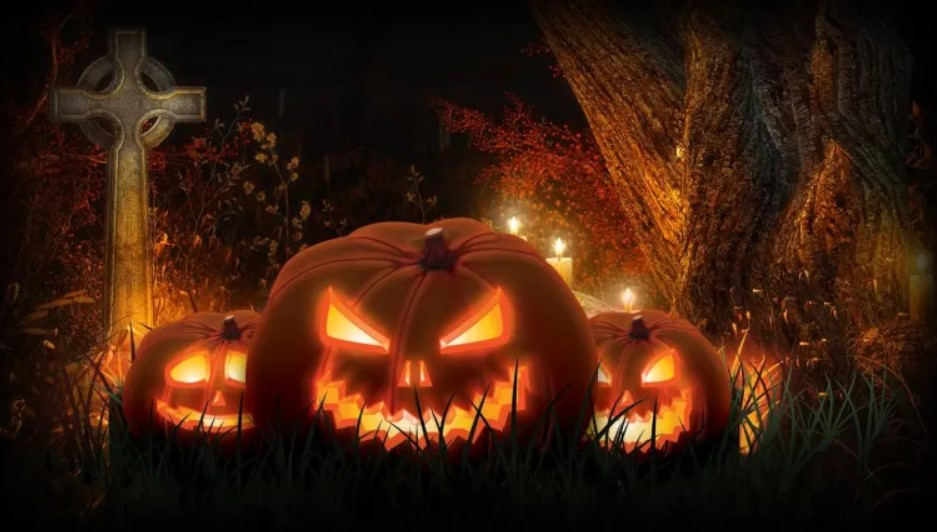

**Bobbing for Apple**s: An ancient Halloween tradition involved young unmarried people trying to bite into apples floating in the water. It was believed that the first person to bite an apple would be the next one to marry.

**Halloween’s Celtic Roots**: Halloween has its roots in the ancient Celtic festival of Samhain, which marked the end of the harvest season and the beginning of winter. It was believed that on the night of October 31st, the boundary between the living and the dead was blurred, allowing spirits to roam freely on Earth.

**Black Cats and Witches**: Black cats have long been associated with witches and Halloween. In medieval Europe, they were believed to be witches’ familiars, and even today, they are considered both symbols of bad luck and good luck in different cultures.

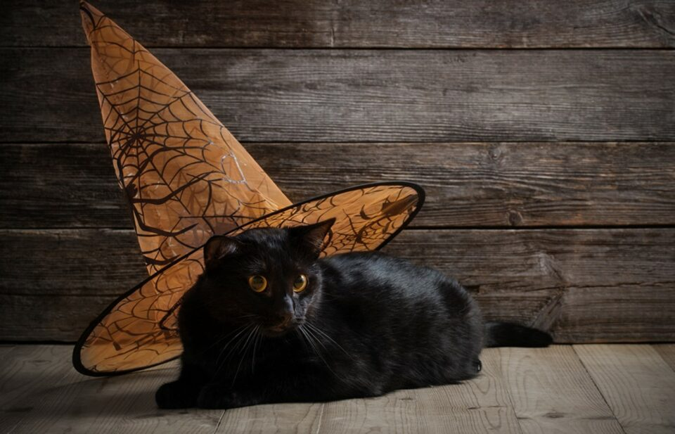

**Candy Corn Connection**: Candy corn, the popular Halloween treat, was invented in the late 1800s. Its tri-colored design was meant to mimic the appearance of corn kernels.

**The World’s Largest Pumpkin**: The world record for the heaviest pumpkin was set in 2016 with a giant pumpkin weighing a whopping 2,624.6 pounds (1,190.49 kg).

**Dia de los Muertos**: Often associated with Halloween, Dia de los Muertos (Day of the Dead) is a Mexican holiday that takes place on November 1st and 2nd, celebrating and honoring deceased loved ones.

**Michael Myers’ Mask**: The iconic white mask worn by Michael Myers in the “Halloween” movie series was originally a Captain Kirk mask painted white due to budget constraints.

**Ghostly Gourds**: The practice of carving Jack-o’-lanterns during Halloween finds its roots in an Irish folktale about a man named Stingy Jack, who outwitted the devil not once, but twice. As a result, he was condemned to roam the Earth with only a glowing ember inside a carved-out turnip to light his way.

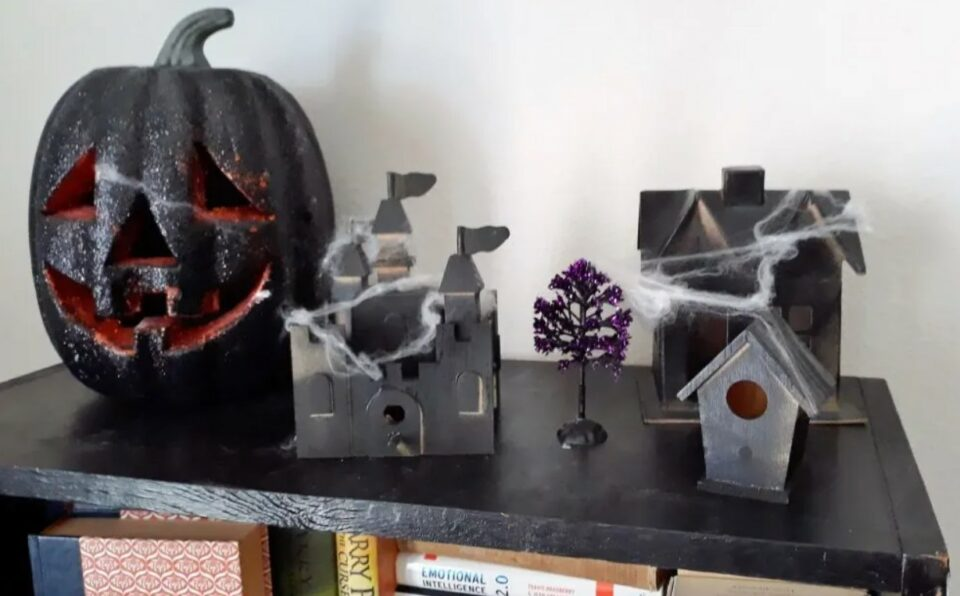

**Supernatural Snapshot**: One of the most haunted locations in the world is the Tower of London in England. It’s believed that the ghosts of several executed prisoners, including Anne Boleyn and Lady Jane Grey, still wander the tower’s corridors.

**Candy Craze**: Halloween is a candy-lover’s paradise! In the United States alone, over 600 million pounds of candy are sold during the Halloween season. That’s enough sweets to circle the Earth 6 times!

**Bewitching Black Cats**: Black cats have been both feared and revered throughout history. In some cultures, they are considered symbols of good luck and prosperity, while in others, they are associated with witches and bad omens.

**Witches’ Night Out**: Halloween has ties to the ancient Celtic festival of Samhain, during which it was believed that witches and other supernatural beings roamed the Earth on the night of October 31st.

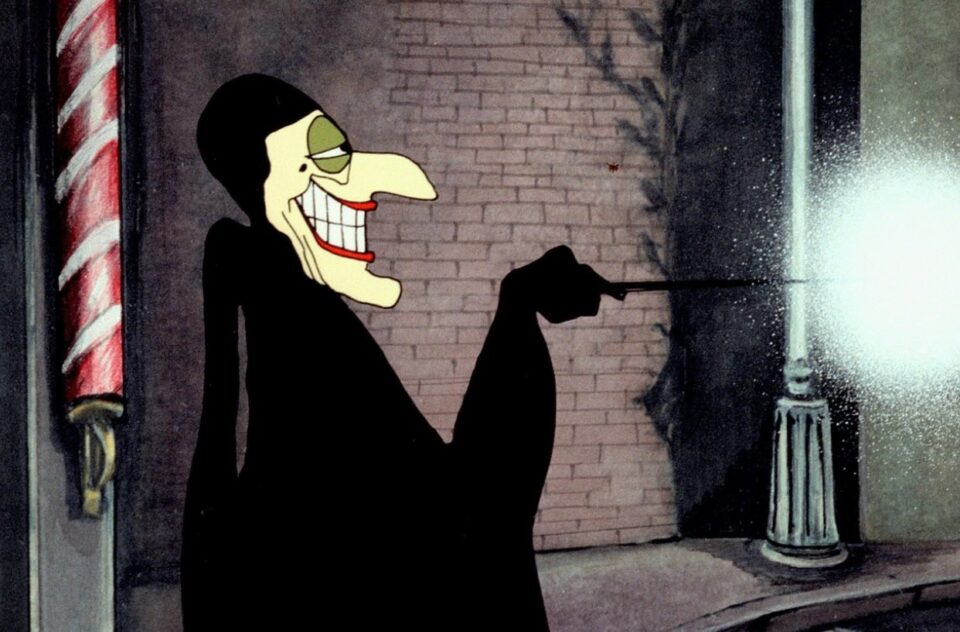

**Haunted Hollywood**: The iconic “Halloween” movie franchise was inspired by a real-life event. Writer and director John Carpenter got the idea for the film after experiencing a creepy encounter with a mental patient while he was attending film school.

**Spirited Celebration**: Mexico’s Day of the Dead, or Dia de los Muertos, is a colorful and joyous holiday that honors deceased loved ones. Families create altars adorned with marigolds, sugar skulls, and favorite foods to welcome back the spirits of the departed.

**Petrifying Pumpkins**: The world record for the largest pumpkin ever grown stands at a mind-boggling 2,624.6 pounds (1,190.49 kg)! Imagine trying to carve that into a Jack-o’-lantern!

## Halloween Movie Trivia

There you have it, a fresh batch of Halloween movie trivia! These facts highlight the fascinating and often misunderstood creatures that contribute to the haunting charm of this beloved holiday. Enjoy these Halloween movie trivia questions and answers during your spooky celebrations and share the mysterious knowledge with friends and family!

**Question 1**: Which 1978 horror film directed by John Carpenter is considered a classic of the Halloween genre?

Answer: “Halloween.”

**Question 2**: What is the name of the fictional town in which the “Halloween” series is primarily set?

Answer: Haddonfield, Illinois.

**Question 3**: Who plays the iconic role of Michael Myers in the original “Halloween” movie?

Answer: Nick Castle and Tony Moran.

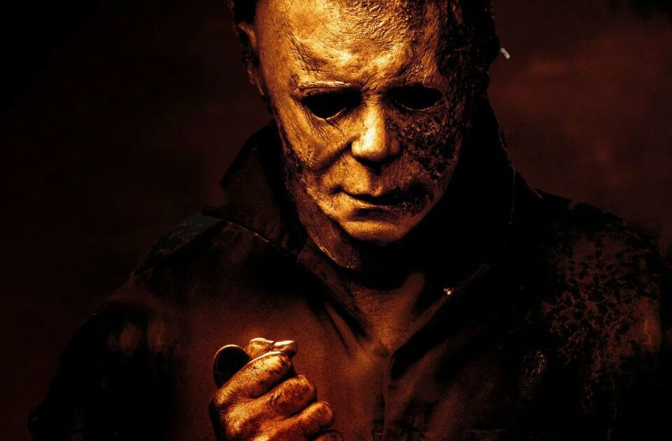

**Question 4**: In “Halloween,” what is the name of the babysitter who faces off against Michael Myers?

Answer: Laurie Strode, played by Jamie Lee Curtis.

**Question 5**: Which Halloween-themed film features a character named Jack Skellington and is produced by Tim Burton?

Answer: “The Nightmare Before Christmas.”

**Question 6**: Which 1993 Disney movie tells the story of three witch sisters who are resurrected on Halloween night?

Answer: “Hocus Pocus.”

**Question 7**: What is the name of the killer doll in the “Child’s Play” series of horror movies?

Answer: Chucky.

**Question 8**: In the movie “Scream,” what’s the killer’s favorite Halloween costume?

Answer: Ghostface.

**Question 9**: Who directed the 2017 horror film “Get Out,” which incorporates themes of Halloween?

Answer: Jordan Peele.

**Question 10**: What is the name of the cursed videotape in the horror film “The Ring”?

Answer: The Samara tape.

**Question 11**: In the “Friday the 13th” series, who is the hockey mask-wearing killer?

Answer: Jason Voorhees.

**Question 12**: Which actor played the role of Count Dracula in the classic 1931 film “Dracula”?

Answer: Bela Lugosi.

**Question 13**: What is the name of the ancient book of evil spells featured in the “Evil Dead” series?

Answer: The Necronomicon Ex-Mortis.

**Question 14**: In the movie “Beetlejuice,” what do you have to say three times to summon the titular character?

Answer: Beetlejuice.

**Question 15**: Who directed the 1973 horror film “The Exorcist”?

Answer: William Friedkin.

**Question 16**: What is the name of the haunted hotel in Stephen King’s “The Shining”?

Answer: The Overlook Hotel.

**Question 17**: Which horror film involves a group of friends staying in a cabin in the woods and facing supernatural threats?

Answer: “The Cabin in the Woods.”

**Question 18**: What is the name of the demonic entity that possesses Regan in “The Exorcist”?

Answer: Pazuzu.

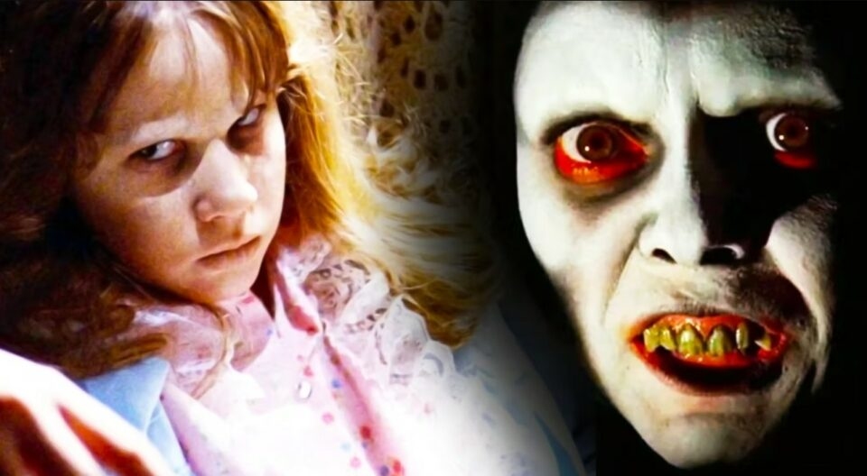

**Question 19**: Which horror film features a clown named Pennywise who terrorizes children?

Answer: “It,” based on Stephen King’s novel.

**Question 20**: In “The Addams Family,” what is the name of the hand that is a separate character?

Answer: Thing.

**Question 21**: Who played the lead role of Clarice Starling in the 1991 thriller “The Silence of the Lambs”?

Answer: Jodie Foster.

**Question 22**: What is the name of the masked killer in “Scream” who torments the town of Woodsboro?

Answer: Ghostface.

**Question 23**: Which 2005 horror film is about a group of people who must survive a night in a haunted asylum?

Answer: “House of Wax.”

**Question 24**: In the film “Casper,” what is the name of the friendly ghost?

Answer: Casper.

**Question 25**: Who directed the 2007 horror film “Trick ‘r Treat,” which is set on Halloween night?

Answer: Michael Dougherty.

## **Halloween Trick-or-Treating Trivia**

**Question 1**: What small, nocturnal creatures are sometimes mistaken for flying mice and are associated with vampires in folklore?

Answer: Bats

**Question 2**: Which bird’s name is often used to describe someone who delivers ominous messages or predicts misfortune?

Answer: Raven

**Question 3**: In Mexican culture, which colorful and decorative animal figure represents the spirits of the deceased during the Day of the Dead?

Answer: Sugar skull (calavera de azúcar)

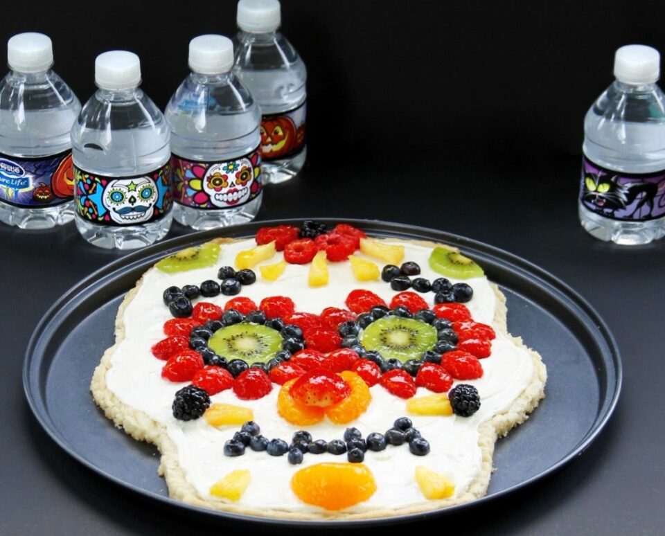

**Question 4**: What is the term for a group of witches that were believed to transform into cats during Halloween night?

Answer: Clowder

**Question 5**: In Eastern European folklore, which mythical creature is said to rise from the dead and transform into a vampire bat?

Answer: Dracula

**Question 6**: What is the name for the traditional Halloween game where apples are placed in water, and participants must try to bite into the apples without using their hands?

Answer: Bobbing for apples

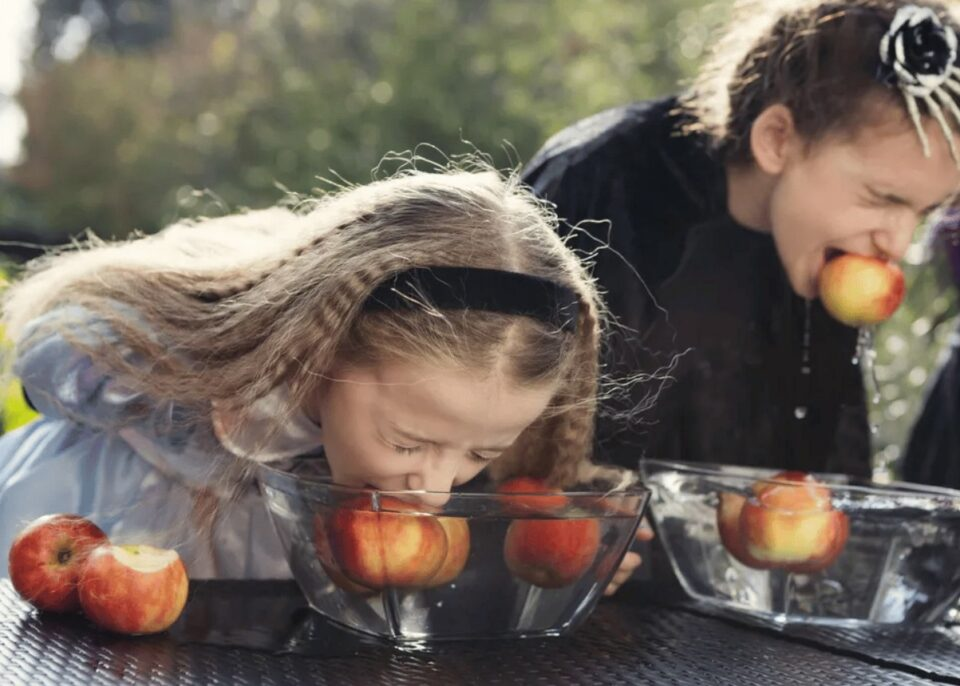

**Question 7**: What animal is often depicted riding on a broomstick alongside witches in Halloween imagery?

Answer: Black cat

**Question 8**: Which nocturnal bird is known for its silent flight and keen hunting skills, making it a symbol of stealth and mystery?

Answer: Owl

**Question 9**: What small, venomous arachnid is known for its red hourglass-shaped mark and is associated with Halloween due to its spooky appearance?

Answer: Black widow spider

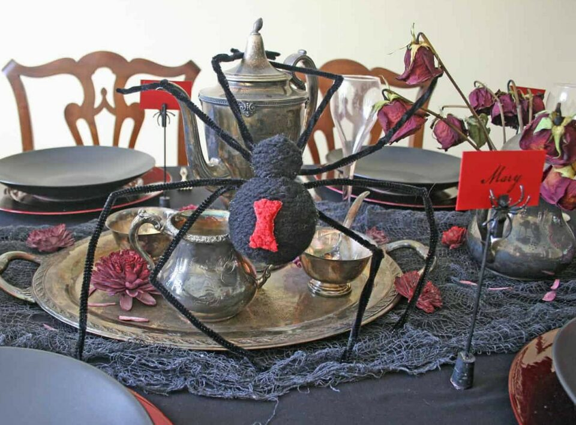

**Question 10**: In Greek mythology, which creature is part woman and part bird, and is said to lure sailors to their doom with their enchanting voices?

Answer: Sirens

**Question 11**: In some cultures, what is the superstition surrounding owls hooting during Halloween night?

Answer: It foretells death or the presence of evil spirits.

**Question 12**: Which animal is commonly associated with witches and is believed to possess magical powers in various folklore?

Answer: Cat

**Question 13**: What animal’s name is sometimes used to refer to a person who spends a lot of time alone and prefers solitude?

Answer: Lone wolf

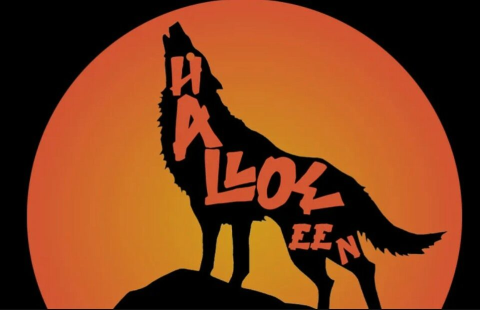

**Question 14**: What is the term for a group of crows, often associated with dark and foreboding omens?

Answer: Murder

**Question 15**: In Celtic mythology, what mythical creature is part horse and part fish, associated with water and considered a symbol of mystery and enchantment?

Answer: Kelpie

**Question 16**: What is the term for the night before Halloween, when some communities engage in mischief and pranks?

Answer: Mischief Night or Devil’s Night.

**Question 17**: What do people traditionally give out in addition to candy when participating in trick-or-treating?

Answer: Small toys, stickers, or Halloween-themed trinkets.

**Question 18**: In some cultures, what are kids told to leave out for visiting spirits or the dead on Halloween?

Answer: Food offerings or “spirit plates.”

**Question 19**: What is the name of the tradition in Scotland and Ireland where children go door to door offering a song, poem, or joke in exchange for treats on Halloween?

Answer: Guising or Souling.

**Question 20**: In the Harry Potter series, what magical candy is often given out on Halloween?

Answer: Chocolate Frogs.

**Question 21**: Which candy brand produces candy corn, a popular Halloween treat shaped like kernels of corn?

Answer: Brach’s.

**Question 22**: What should you do if a house has its porch light off on Halloween night?

Answer: Typically, it means they are not participating in trick-or-treating, so you should skip that house.

**Question 23**: In which country do children traditionally receive gifts and treats from “La Befana” on the night of January 5th (Epiphany Eve), similar to Halloween?

Answer: Italy.

**Question 24**: What popular Halloween candy is known for its peanut butter filling and distinctive orange and black wrappers?

Answer: Reese’s Peanut Butter Cups.

**Question 25**: In the United Kingdom, what is the name of the traditional Halloween game where apples are floated in water, and players try to bite them with their teeth without using their hands?

Answer: Apple bobbing.

**Question 26**: In some parts of the United States, what is the phrase often used instead of “trick or treat” when asking for Halloween candy?

Answer: “Happy Halloween!”

**Question 27**: What is the concept behind the “Switch Witch,” a Halloween tradition where children exchange some of their candy for a small toy or gift?

Answer: The Switch Witch takes the candy and leaves a toy or gift in return to reduce the amount of candy consumed.

## **Halloween Trivia for Kids**

**Question 1**: What mythical creature is said to rise from the dead and roam the Earth during Halloween night, searching for fresh blood to sustain itself?

Answer: Vampire

**Question 2**: Which large arachnid is often depicted as a terrifying monster in movies and folklore, and is associated with Halloween due to its eerie appearance?

Answer: Tarantula

**Question 3**: In ancient Roman times, which bird was considered a messenger of the gods and was believed to be a sign of good luck or bad omens?

Answer: Crow

**Question 4**: What is the name for the small, winged insects that are often associated with Halloween decorations and are believed to be spirits of the dead?

Answer: Fireflies

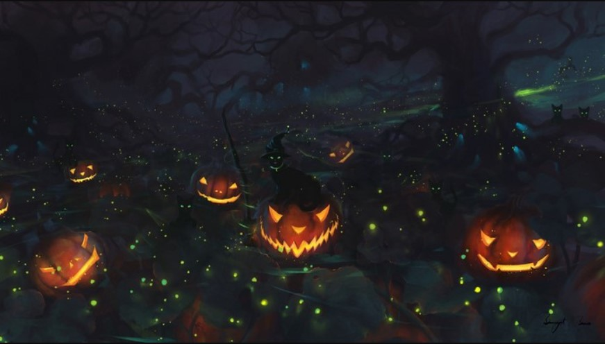

**Question 5**: In North American folklore, which fearsome creature is said to be half-man and half-goat, known for its mischievous and sometimes malevolent behavior?

Answer: Satyr

**Question 6**: Which creature of the night is associated with witches and was believed to be a companion to them during their magical rituals?

Answer: Bat

**Question 7**: What animal’s name is used to describe someone who enjoys the darkness and nighttime, embracing the spooky spirit of Halloween?

Answer: Night owl

**Question 8**: In ancient Egyptian mythology, which creature is a sacred symbol of protection and is believed to guard against evil spirits?

Answer: Scarab beetle

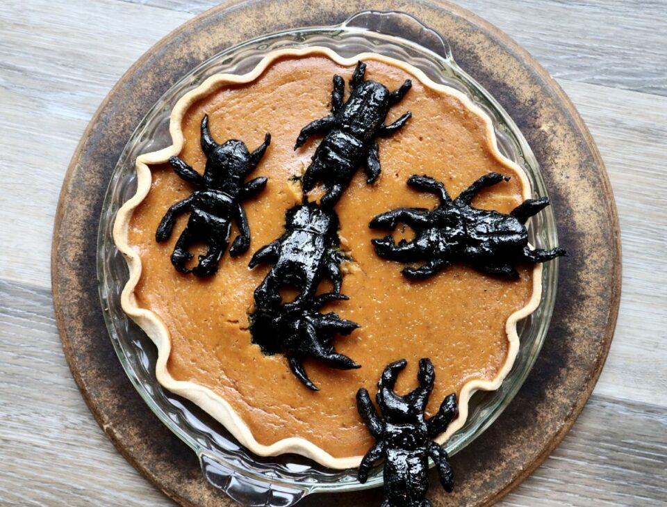

**Question 9**: What is the term for a group of bats hanging together upside-down, often seen in caves or dark corners?

Answer: Colony

**Question 10**: In Irish folklore, what mythical creature is a malevolent fairy that takes the form of a horse with flaming eyes, said to warn of impending death or disaster?

Answer: Dullahan

**Question 11**: Which creature, commonly associated with Halloween decorations, is a symbol of death and rebirth in ancient Mexican culture?

Answer: Monarch butterfly

**Question 12**: What animal is often associated with werewolves, believed to transform into a wolf during a full moon?

Answer: Wolf

**Question 13**: In Native American folklore, which legendary creature is a shape-shifting trickster known for its cunning and mischievous behavior?

Answer: Coyote

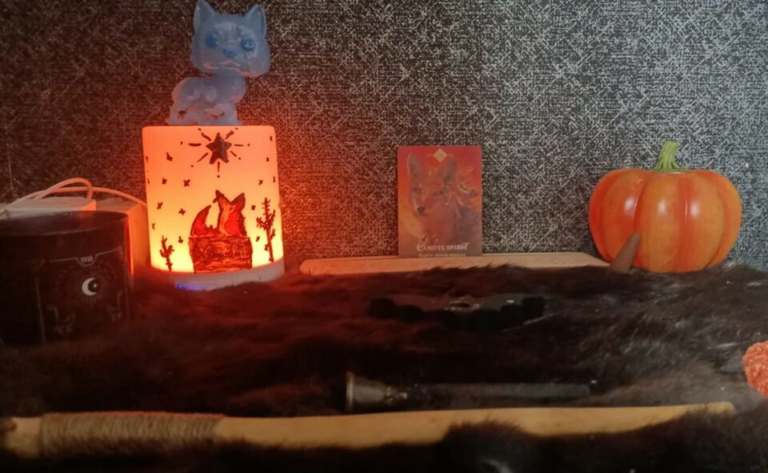

**Question 14:** What bird, often depicted as a symbol of wisdom, is associated with the Greek goddess Athena?

Answer: Owl

**Question 15**: In vampire lore, what animal is said to be a vampire’s natural enemy, able to sense their presence and protect humans from their attacks?

Answer: Dog

**Question 16**: What do you call a friendly ghost who is often depicted as a white sheet with eye holes?

Answer: Casper the Friendly Ghost.

**Question 17**: In the Disney movie “The Nightmare Before Christmas,” what is the name of the main character who tries to take over Christmas?

Answer: Jack Skellington.

**Question 18**: What costume is often associated with witches and features a pointy hat and a broomstick?

Answer: Witch costume.

**Question 19**: Which black bird is often considered a symbol of Halloween due to its association with superstitions?

Answer: The crow or raven.

**Question 20**: What do kids say when they knock on doors to ask for candy on Halloween?

Answer: “Trick or treat!”

**Question 21**: What is the name of the candy that comes in small, brightly colored sugar shells and is often given out during Halloween?

Answer: Candy-coated chocolates, also known as “M&M’s.”

**Question 22**: Which classic Halloween story involves a headless horseman who carries a pumpkin as a head?

Answer: “The Legend of Sleepy Hollow.”

**Question 23**: What spooky holiday-themed song is often played during Halloween and includes the lyrics, “It’s just a jump to the left, and then a step to the right”?

Answer: “The Time Warp” from “The Rocky Horror Picture Show.”

**Question 24**: Which nocturnal creature is often associated with Halloween and can be seen flying at night?

Answer: Bats.

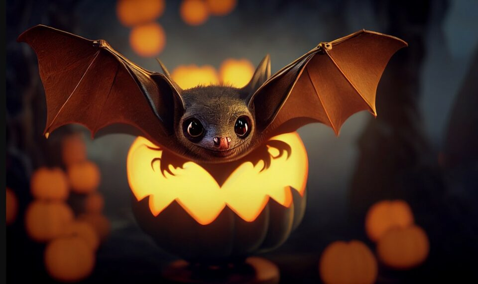

**Question 25**: What do kids usually wear on Halloween to collect their candy?

Answer: Costumes.

**Question 26**: In the Halloween song “Monster Mash,” who throws a graveyard bash?

Answer: Dr. Frankenstein.

**Question 27**: What is the term for a carved pumpkin with a lit candle inside?

Answer: Jack-o’-lantern.

**Question 28**: Which classic Halloween candy is shaped like a small, triangular piece of candy corn?

Answer: Candy corn.

## **Halloween Monsters Trivia**

Get ready to delve into the realm of the supernatural with our Halloween Monsters Trivia! Explore the eerie and legendary creatures that haunt our imaginations on this spine-tingling journey. From bloodthirsty vampires to elusive sea monsters, test your knowledge of these iconic beasts that have woven themselves into the fabric of Halloween lore..

**Question 1**: Who is the legendary vampire known for his ability to transform into a bat?

Answer: Count Dracula.

**Question 2**: Which mythical creature is said to be a reanimated corpse that feeds on the flesh of the living?

Answer: Zombie.

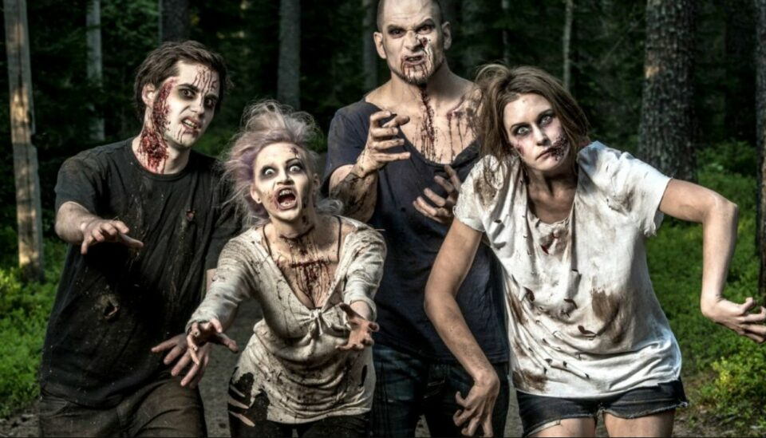

**Question 3**: What creature is known for its ability to transform from human to wolf during a full moon?

Answer: Werewolf.

**Question 4**: In Irish folklore, what mischievous fairy is known for playing pranks on humans?

Answer: Leprechaun.

**Question 5**: What is the name of the Egyptian god often depicted as a man with a jackal head, associated with death and the afterlife?

Answer: Anubis.

**Question 6**: In Greek mythology, which monstrous creature had snakes for hair and could turn people into stone with her gaze?

Answer: Medusa.

**Question 7**: What is the name of the folklore creature that is created by stitching together different body parts and brought to life by a mad scientist?

Answer: Frankenstein’s Monster.

**Question 8**: Which Halloween monster is often portrayed as a large, furry humanoid with a taste for human flesh?

Answer: Yeti or Bigfoot.

**Question 9**: In European folklore, what nocturnal creature is known for its fear-inducing screech and association with witches?

Answer: Owl.

**Question 10**: What supernatural being is said to have the power to grant wishes in exchange for a person’s soul?

Answer: Devil or demon.

**Question 11**: Which legendary sea monster is said to dwell off the coast of Norway and Greenland, often depicted with giant tentacles?

Answer: Kraken.

**Question 12**: In Slavic folklore, what malevolent spirit is believed to be the embodiment of winter and associated with cold and darkness?

Answer: Baba Yaga.

**Question 13**: What vampire-like creature from Filipino mythology is known for its ability to separate its upper body from its lower half and fly around at night?

Answer: Aswang.

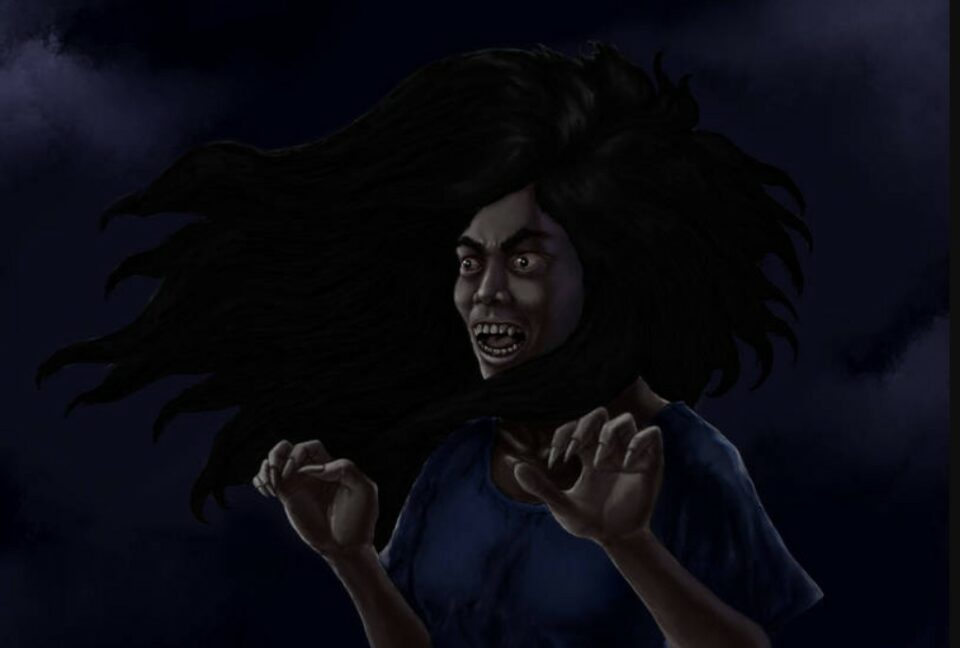

**Question 14**: Which supernatural being, according to Native American legends, is said to have the ability to shape-shift and often takes the form of a coyote?

Answer: Skinwalker.

**Question 15**: In Hindu mythology, what powerful demon king is known for his ten heads and association with the festival of Diwali?

Answer: Ravana.

**Question 16**: What ghostly figure, originating from Japanese folklore, is often depicted as a woman in a white burial kimono and is associated with vengeance?

Answer: Yurei.

**Question 17**: What mythical creature, resembling a horse with a horn on its forehead, is often associated with purity and grace?

Answer: Unicorn.

**Question 18:** In Latin American folklore, what creature is said to be a goat-like being with horns, often associated with dark rituals?

Answer: Chupacabra.

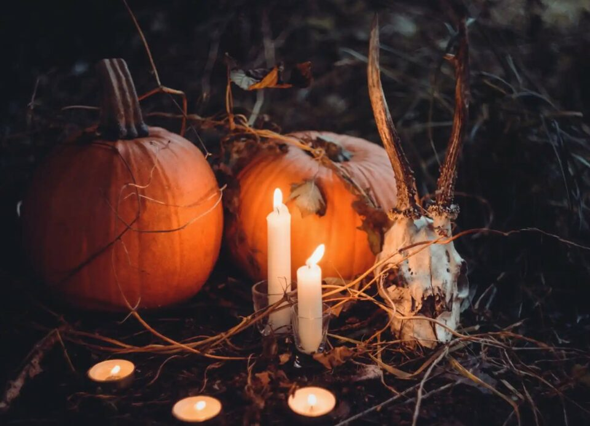

**Question 19**: Which Halloween monster is known for its ability to transform into mist or a bat and has a strong aversion to garlic and sunlight?

Answer: Vampire.

**Question 20**: What legendary bird, said to burst into flames and be reborn from its ashes, is associated with renewal and immortality?

Answer: Phoenix.

**_See More:_**

- Best [Halloween Poems](https://avada.io/loveable/blog/halloween-poems/)

- Best [Halloween Quotes](https://avada.io/loveable/blog/halloween-quotes/)

- Hilarious [Halloween Puns](https://avada.io/loveable/blog/halloween-puns/)

- Best Spooky [Halloween Words](https://avada.io/loveable/blog/halloween-words/)

## Bottom Line

In conclusion, delving into Halloween trivia provides an illuminating journey through the rich history and intriguing customs of this beloved holiday. The spectrum of questions and answers showcases not only the surface-level fun of costumes and candies but also the deeper cultural and historical roots that have shaped Halloween into what it is today.

Moreover, engaging with Halloween trivia fosters a sense of community as friends and family come together to test their knowledge and share laughs. Whether recalling the origins of trick-or-treating or deciphering the symbolism of black cats, these trivia questions spark conversations and nostalgia, deepening connections among participants

- [Halloween Facts Trivia](https://avada.io/loveable/blog/halloween-trivia/#wp-block-heading-2-3)
- [Halloween Movie Trivia](https://avada.io/loveable/blog/halloween-trivia/#wp-block-heading-2-25)
- [Halloween Trick-or-Treating Trivia](https://avada.io/loveable/blog/halloween-trivia/#wp-block-heading-2-79)
- [Halloween Trivia for Kids](https://avada.io/loveable/blog/halloween-trivia/#wp-block-heading-2-138)
- [Halloween Monsters Trivia](https://avada.io/loveable/blog/halloween-trivia/#wp-block-heading-2-199)
- [Bottom Line](https://avada.io/loveable/blog/halloween-trivia/#wp-block-heading-2-250)

### [Blake Simpson](https://avada.io/loveable/author/blake/)

Hi, I'm Blake from Loveable. I help people find perfect gifts for occasions like anniversaries and weddings. I also write a blog about holidays, sharing insights to make them more meaningful. Let's create unforgettable moments together!

- [Twitter](https://twitter.com/intent/tweet)
- [Facebook](https://www.facebook.com/sharer/sharer.php)
- [instagram](https://avada.io/loveable/blog/halloween-trivia/)
- [pinterest](https://www.pinterest.com/loveablellc/)

## Related Posts

[### 120+ Christian Birthday Wishes To Spread Your Love](https://avada.io/loveable/blog/christian-birthday-wishes/) 

[

### 35 Best 70th Birthday Ideas To Celebrate The Special Milestone

](https://avada.io/loveable/blog/70th-birthday-ideas/)

[

### 50 Best 30th Birthday Decorations for a Remarkable Birthday Bash

](https://avada.io/loveable/blog/30th-birthday-decorations/)

[

### 40 Delicious Vegan Christmas Desserts to Delight Your Palate

](https://avada.io/loveable/blog/vegan-christmas-desserts/)

[

### 60 Christmas Team Building Activities to Boost Workplace Spirit

](https://avada.io/loveable/blog/christmas-team-building-activities/)
