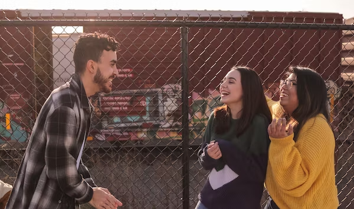

This article has been written and researched by our expert Loveable through a precise methodology. [Learn more about our methodology](https://avada.io/loveable/our-methodological.html)

[Loveable](https://avada.io/loveable/) > [Blog](https://avada.io/loveable/blog/) > [Relationship](https://avada.io/loveable/relationship/)

# 93 Hilariously Funny Jokes That  Brighten Your Day in 2023

Written by [Luna Miller](https://avada.io/loveable/author/luna/) Last Updated on August 23, 2023

- [Funny Jokes For Kids](https://avada.io/loveable/blog/hilariously-funny-jokes/#wp-block-heading-2-3) 
- [Funny Jokes For Teens](https://avada.io/loveable/blog/hilariously-funny-jokes/#wp-block-heading-2-47)
- [Funny Jokes For Adults](https://avada.io/loveable/blog/hilariously-funny-jokes/#wp-block-heading-2-113) 
- [Funny Jokes To Make People Laugh](https://avada.io/loveable/blog/hilariously-funny-jokes/#wp-block-heading-2-137)
- [Bottom Line](https://avada.io/loveable/blog/hilariously-funny-jokes/#wp-block-heading-2-161) 

In 2023, get ready to laugh out loud and brighten your day with an assortment of **funny jokes**! The best medicine is laughter, so what better way to add some humor to your life than with a funny compilation that will have you in stitches? This article offers 93 rib-tickling jokes that are sure to make you smile, ranging from sly one-liners to brilliant puns and entertaining anecdotes. 

This collection of **93 funny jokes** is here to deliver laughter after a busy day. Learn a selection of humorous gems with brilliant wordplay and hilarious punchlines covering various topics. And we go on this humorous voyage filled with chuckles, snickers, and guffaws that will lift your spirits and leave you in stitches, get ready for a barrel of laughs!

## **Funny Jokes For Kids** 

With our selection of humorous jokes for kids, be ready for an entertaining journey! The universal language of laughter is humor, and these jokes are designed specifically to make kids laugh. This age-appropriate humor collection, including hilarious riddles and amusing puns, is sure to keep kids delighted and giggling nonstop. 

1. Why did the chicken cross the playground?

To get to the other slide!

2. Why did the actor fall through the floorboards?

They were going through a stage!

3. Why did a scarecrow win a Nobel prize?

He was outstanding in his field!

4. Why are peppers the best at archery?

Because they are habanero!

5. What did the duck say after she bought chapstick?

Put it on my bill!

6. Why did an old man fall into a well?

Because he couldn’t see that well!

7. What do you call a fake noodle?

An impasta!

8. What did the three-legged dog say when he walked into a saloon?

“I’m looking for the man who shot my paw!”

9. How do you tell the difference between a bull and a cow?

It is either one or the udder!

10. What’s red and smells like blue paint?

Red paint!

11. Why can’t you send a duck to space?

Because the bill would be astronomical!

12. What does Jeff Bezos do before he goes to sleep?

He puts his PJ-Amazon!

13. What happened when the world’s tongue-twister champion got arrested?

They gave him a tough sentence!

14. What did the mama cow say to the calf?

It’s pasture bedtime!

15. How does a vampire start a letter?

Tomb it may concern!

16. What do you call an illegally parked frog?

Toad!

17. What did one plate say to the other?

Dinner is on me!

18. Why do hummingbirds hum?

Because they don’t know the words!

19. What do sprinters eat before a race?

Nothing. They fast!

20. Two muffins are baking in an oven. One of them looks to the other and says, “Phew, it’s getting hot in here!” The other looks back and says, “Ack! A talking muffin!”

21. What’s the difference between a hippo and a Zippo?

One is very heavy; the other is a little lighter!

## **Funny Jokes For Teens**

With our carefully curated collection of humorous jokes for teens, get ready for an adventure filled with laughter! Teenage years can be full of ups and downs, as we all know, but a good chuckle can often be the best medicine. As we begin our exploration of a collection of hilarious jokes that will have teenagers in stitches, get ready to giggle, snicker, and guffaw!

22. Why do rappers need umbrellas?

Fo’ drizzle.

23. How do you drown a hipster?

In the mainstream.

24. What do you call security guards working outside Samsung shops?

Guardians of the Galaxy.

25. How did the hipster burn his mouth?

He ate the pizza before it was cool.

26. What did Jay-Z call his girlfriend before getting married?

Feyoncè.

27. If you have 13 apples in one hand and 10 oranges in the other, what do you have?

Big hands.

28. If your teen actually enjoys math, then try one of these math puns that will make homework a little more bearable.

29. Are you free tomorrow?

No, I’m expensive. Sorry.

30. How do you find Will Smith in the snow?

Look for fresh prints.

31. How do Minecraft players celebrate?

They throw block parties!

32. What did the man say when he walked into a bar?

Ouch!

33. What’s the difference between ignorance and apathy?

I don’t know, and I don’t care.

34. Want more than just jokes for teens? Don’t miss our collection of one-liners that will make everyone in the room chuckle on command.

35. What’s brown and sticky?

A stick.

36. What do pre-teen ducks hate?

Voice quacks.

37. What did the punching bag say to the boxer?

Hit me baby one more time.

38. How do you communicate with a fish?

Drop it a line.

39. What’s the difference between roast beef and pea soup? 

Anyone can roast beef, but no one can pee soup.

40. Have you heard where the word “studying” came from?

Students-dying

41. What’s worse than finding a worm in your apple?

Finding half a worm in your apple.

42. How do you know when you’re desperate for an answer?

You look at the second page of Google search results.

43. Why can’t you hear a pterodactyl in the bathroom?

Because it has a silent pee.

44. Teacher: Why do pimples make horrible prisoners?

Because they keep breaking out!

Unleash your inner ridiculousness with these dumb and funny jokes that will make everyone laugh.

45. What is 47 + 11 + 82 + 161 + 99 + 5?

A headache.

46. Why can’t a T-rex clap their hands? 

Because they’re extinct.

47. I couldn’t figure out why the baseball kept getting larger.

Then it hit me.

48. Never criticize someone until you have walked a mile in their shoes.

That way, when you criticize them, you’ll be a mile away, and you’ll have their shoes.

49. Why did Harry Potter suddenly go bald in his teens?

He lost his Hedwig.

50. What do you get when you mix sulfer, tungsten, and silver?

SWAG.

51. My boss told me yesterday, “You shouldn’t dress for the job you have, dress for the job you want.”

But when I turned up today in Ghostbusters clothes, he said I was fired. 

52. What kind of tea is hard to swallow? 

Reali-tea.

53. What do you call hiking U.S. college students?

The walking debt.

## **Funny Jokes For Adults** 

Our selection of humorous jokes for grownups will help you to unleash your inner comic! These jokes were written with adults in mind, but laughter knows no age restrictions. This collection offers a fantastic blend of humor that will have you rolling in the aisles, from witty punchlines to hilarious anecdotes. So prepare for some well-earned laughing as we provide a hand-picked collection of jokes that are sure to make you grin and brighten your day.

54. What did the toaster say to the slice of bread? I want you inside me.

55. What did the hurricane say to the coconut tree? Hold on to your nuts; this ain’t no ordinary blow job.

56. What did the clitoris say to the vulva? It’s all good in the hood!

57. What kind of food does a lesbian love? Anything they can eat out.

58. What goes in hard and dry but comes out soft and wet? Gum.

59. What did the penis say to the condom? Cover me, I’m going in.

60. Welcome to the Sexual Innuendo Club. Thank you all for coming.

61. What’s a lesbian’s favorite Pokemon? Squirtle.

62. What do tofu and a dildo have in common? They are both meat substitutes.

63. What did Cinderella do when she got the ball? She gagged.

64. What do a Rubik’s Cube and a penis have in common? The more you play with it, the harder it gets.

65. Why isn’t there a pregnant Barbie doll? Ken came in another box.

66. What does the receptionist at a sperm bank say as clients leave? Thanks for coming!

67. They say makeup sex is the best… Which is lucky, because all my sex is made up

68. What is Moby Dick’s dad’s name? Papa Boner.

69. What do you get when you mix birth control and LSD? A trip without kids.

70. I just had sex in an elevator. It was great on so many levels.

71. When should condoms be used? Every conceivable occasion.

72. Why don’t witches wear underwear? Because they need a better grip.

73. Did you hear about the guy who dipped his balls in glitter? Pretty nuts!

**Related:** [Hilarious Mom Jokes](https://avada.io/loveable/hilarious-mom-jokes/) That Will Leave You in Stitches

## **Funny Jokes To Make People Laugh**

74. What falls, but never needs a bandage? The rain.

75. I was going to tell you a joke about boxing, but I forgot the punch line.

76. I’m not a fan of spring cleaning. Let’s be honest; I’m not into summer, fall, or winter cleaning either.

77. Why did the egg hide? It was a little chicken.

78. What did the dirt say to the rain? If you keep this up, my name will be mud!

79. Why couldn’t the sunflower ride its bike? It lost its petals.

80. What’s an egg’s favorite vacation spot? New Yolk City.

81. I ate a sock yesterday. It was very time-consuming.

82. What kind of candy do astronauts like? Mars bars.

83. I wanted to buy some camo pants but couldn’t find any.
84. I ordered a chicken and an egg from Amazon. I’ll let you know.

85. What month is the shortest of the year? May, it only has three letters.

86. What did the snail who was riding on the turtle’s back say? Wheeeee!

87. I was going to tell a time-traveling joke, but you guys didn’t like it.

88. What do you call a lazy kangaroo? A pouch potato.

89. I used to run a dating service for chickens, but I was struggling to make hens meet.

90. Why do we tell actors to “break a leg?” Because every play has a cast.

91. What does a pig put on dry skin? Oinkment.

92. What do you call it when a snowman throws a tantrum? A meltdown.

93. My uncle named his dogs Timex and Rolex. They’re his watchdogs.

**Check Out:**

- Best [Halloween Jokes](https://avada.io/loveable/halloween-jokes/) For All Ages 

- Humorous [Valentine’s Day Jokes](https://avada.io/loveable/humorous-valentines-day-jokes/) for Everyone

## **Bottom Line** 

We hope that by the time we reach the end of this hilarious voyage through **93 funny jokes** from 2023, you will be giggling, giggling, and snorting with glee. A truly international language that can cross barriers and unite people is laughter. So keep in mind to tell your friends, family, and coworkers these jokes to spread cheer and make their days more enjoyable. 

These lighthearted moments serve as a reminder not to take oneself too seriously and to find comedy in even the most mundane situations in a world that may frequently feel overwhelming. Keep these funny jokes handy when you need a good chuckle, and may they continue to make you smile long into 2023.

- [Funny Jokes For Kids](https://avada.io/loveable/blog/hilariously-funny-jokes/#wp-block-heading-2-3) 
- [Funny Jokes For Teens](https://avada.io/loveable/blog/hilariously-funny-jokes/#wp-block-heading-2-47)
- [Funny Jokes For Adults](https://avada.io/loveable/blog/hilariously-funny-jokes/#wp-block-heading-2-113) 
- [Funny Jokes To Make People Laugh](https://avada.io/loveable/blog/hilariously-funny-jokes/#wp-block-heading-2-137)
- [Bottom Line](https://avada.io/loveable/blog/hilariously-funny-jokes/#wp-block-heading-2-161) 

### [Luna Miller](https://avada.io/loveable/author/luna/)

I'm Luna Miller, a helpful employee at Loveable. I excel at giving great advice on birthday gifts. I love suggesting memorable experiences like concerts, spas, and getaways. As a reliable and supportive colleague, I'm always there to assist.

- [Twitter](https://twitter.com/intent/tweet)
- [Facebook](https://www.facebook.com/sharer/sharer.php)
- [instagram](https://avada.io/loveable/blog/hilariously-funny-jokes/)
- [pinterest](https://www.pinterest.com/loveablellc/)

## Related Posts

[

### 35 Unforgettable Exciting Adult Birthday Party Ideas

](https://avada.io/loveable/blog/adult-birthday-party-ideas/)

[

### 42 Best 21st Birthday Outfits to Rock the Party

](https://avada.io/loveable/blog/21st-birthday-outfits/)

[

### 50+ Happy 40th Anniversary Quotes, Messages, and Wishes

](https://avada.io/loveable/blog/happy-40th-anniversary-quotes/)

[

### 100+ Heartwarming Happy 30th Anniversary Quotes, Messages, and Wishes

](https://avada.io/loveable/blog/happy-30th-anniversary-quotes/)

[

### 120+ Heartfelt Thank You Messages for The Birthday Wishes

](https://avada.io/loveable/blog/thank-you-messages-birthday-wishes/)
