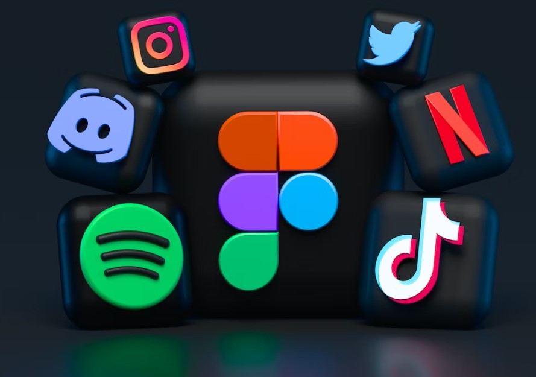
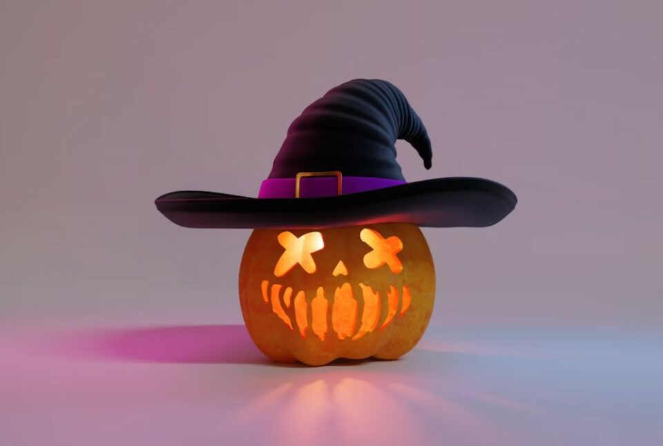

This article has been written and researched by our expert Loveable through a precise methodology. [Learn more about our methodology](https://avada.io/loveable/our-methodological.html)

[Loveable](https://avada.io/loveable/) > [Blog](https://avada.io/loveable/blog/) > [Holiday](https://avada.io/loveable/holiday/)

# 99+ Best Halloween Hashtags for 2023

Written by [Blake Simpson](https://avada.io/loveable/author/blake/) Last Updated on August 29, 2023

- [Benefits of using Halloween Hashtags in Halloween-related posts](https://avada.io/loveable/blog/best-halloween-hashtags/#wp-block-heading-2-3)
- [99+ Best Halloween Hashtags For Business And Individual](https://avada.io/loveable/blog/best-halloween-hashtags/#wp-block-heading-2-10)
    - [General Halloween hashtags](https://avada.io/loveable/blog/best-halloween-hashtags/#wp-block-heading-3-12)
    - [Costume-related hashtags](https://avada.io/loveable/blog/best-halloween-hashtags/#wp-block-heading-3-33)
    - [Decorations and party-related hashtags](https://avada.io/loveable/blog/best-halloween-hashtags/#wp-block-heading-3-54)
    - [Candy and treats hashtags](https://avada.io/loveable/blog/best-halloween-hashtags/#wp-block-heading-3-75)
    - [Scary and spooky hashtags](https://avada.io/loveable/blog/best-halloween-hashtags/#wp-block-heading-3-96)
    - [Family-friendly hashtags](https://avada.io/loveable/blog/best-halloween-hashtags/#wp-block-heading-3-117)
    - [Tips for Using Halloween Hashtags](https://avada.io/loveable/blog/best-halloween-hashtags/#wp-block-heading-3-138)
- [How to find the most popular Halloween Hashtags](https://avada.io/loveable/blog/best-halloween-hashtags/#wp-block-heading-2-148)
- [Final Thoughts, Halloween Hashtags](https://avada.io/loveable/blog/best-halloween-hashtags/#wp-block-heading-2-152)  

Get ready to elevate your Halloween social media game with the ultimate collection of the best Halloween hashtags for 2023. In this comprehensive guide, we have curated a list of 99+ **Halloween hashtags** that will help you make your Halloween posts stand out and capture the spirit of the season. Whether you’re sharing your creative costumes, spooky decorations or capturing the essence of Halloween through captivating photos, these hashtags will ensure your content reaches a wider audience and engages fellow Halloween enthusiasts.

Halloween is a time of excitement and creativity, and sharing your Halloween experiences on social media has become a cherished tradition. With the right hashtags, you can join the larger Halloween community and connect with like-minded individuals who share your passion for all things spooky and fun. From Instagram to Twitter and beyond, these handpicked hashtags will help you maximize your reach and showcase your Halloween spirit in the most captivating way.

## **Benefits of using Halloween Hashtags in Halloween-related posts**

- **Reach a Targeted Audience**: By using Halloween hashtags, you can reach a specific audience interested in Halloween-related content. This ensures that your posts are seen by people who are actively seeking Halloween inspiration, ideas, or discussions.

- **Amplify Brand Awareness:** If you are a business or influencer, using Halloween hashtags can help increase brand visibility and awareness. By incorporating relevant hashtags into your Halloween-themed posts, you can attract new followers, engage with potential customers, and build brand recognition within the Halloween community.

- **Enhance Content Discoverability**: Hashtags make it easier for users to discover your [Halloween-related](https://avada.io/loveable/halloween/) content. When someone searches for a particular hashtag, your posts with that hashtag will appear in the search results, increasing the likelihood of engagement and exposure.

- **Tracking and Analytics:** Using hashtags allows you to track the performance and engagement of your Halloween posts. You can monitor the reach, impressions, and engagement metrics associated with specific hashtags, helping you assess the effectiveness of your Halloween social media campaigns and adjust your strategies accordingly.

- **Inspiration and Trend Insights:** Following Halloween hashtags can provide inspiration for your own content and keep you updated on the latest Halloween trends. By exploring popular hashtags, you can gain insights into what others are sharing and adapt your posts to align with current Halloween themes and interests.

## **99+ Best Halloween Hashtags For Business And Individual**

### **General Halloween hashtags**

#Halloween

#TrickorTreat

#HappyHalloween

#SpookySeason

#AllHallowsEve

#CostumeParty

#Ghostly

#October31st

#HallofFame

#FrightNight

#HauntedHoliday

#GhoulsAndGoblins

#CreepItReal

#BooToYou

#SpookyVibes

#WitchingHour

#ScareFest

#TrickOrTreatYoSelf

#PumpkinSeason

#Halloqueen

### **Costume-related hashtags**

#HalloweenCostume

#DIYHalloweenCostume

#HalloweenMakeup

#CostumeInspiration

#DressUp

#CharacterCostume

#SpookyAttire

#MaskedLook

#Cosplay

#CostumeContest

#EnsembleEnvy

#DressedToThrill

#GetYourFreakOn

#OutfitGoals

#FrightfullyFashionable

#MakeupMastery

#FantasyFright

#CreepyChic

#TransformationTuesday

#MonsterMakeover

### **Decorations and party-related hashtags**

#HalloweenDecorations

#HauntedHouse

#HalloweenParty

#PumpkinCarving

#FestiveVibes

#SpookyAmbiance

#GhoulishGathering

#WitchyDecor

#HauntedVibes

#CreepyCrawlies

#EerieElegance

#MysticalMansion

#PartyLikeAGhost

#SpooktacularSoiree

#GoblinGathering

#SinisterCelebration

#BooBash

#WickedlyWelcoming

#TrickOrTreatParty

#PumpkinPalooza

### **Candy and treats hashtags**

#HalloweenCandy

#TrickorTreats

#CandyCorn

#SweetTooth

#TastyTreats

#ChocoLover

#CaramelDelight

#GummyGoodness

#SpookySweets

#YummyHalloween

#SugarRush

#CandyMania

#DeliciousDelights

#HauntedHoney

#TreatYourself

#FreakyFlavors

#CreepyConfections

#ChillingChocolates

#SugarySpells

#GhastlyGoodies

### **Scary and spooky hashtags**

#Creepy

#ScaryMovies

#HorrorFreak

#Haunted

#TerrifyingTales

#EerieExperience

#Frightening

#GhastlyEncounter

#SpineChilling

#NightmareFuel

#CreepyCrawlers

#MacabreMasterpiece

#ChillsAndThrills

#FearTheUnknown

#ScreamFactory

#GhostStories

#BoneChilling

#DreadfulDarkness

#PhantomPhobia

#TerrorTales

### **Family-friendly hashtags**

#HalloweenFamily

#KidsHalloween

#FamilyCostumes

#SpookyFun

#FamilyTraditions

#PumpkinPatch

#CandyHunt

#CostumeParade

#TrickorTreatTogether

#SpookyCrafts

#FamilyFrightNight

#BooCrew

#GhostlyGames

#FangtasticFamily

#CreepyCarnival

#HalloweenWithKids

#KidApprovedCostumes

#GhoulishGames

#PumpkinPainting

#SpooktacularMemories

### **Tips for Using Halloween Hashtags**

When incorporating Halloween hashtags into your posts, consider the following tips to maximize their effectiveness 

- **Research and analyze popular hashtags:** Explore trending Halloween hashtags, use search features or tools, and analyze engagement to select effective ones.

- **Be specific and relevant:** Use descriptive and niche hashtags that accurately represent your content, avoiding generic ones that may get lost in the crowd.

- **Mix popular and niche hashtags:** Combine popular Halloween hashtags with less common ones to reach a broader and more engaged audience.

- **Engage with others:** Interact with posts using the same hashtags, liking, commenting, or sharing, to increase visibility and foster community engagement.

- **Monitor and track performance:** Keep an eye on engagement, reach, and impressions of posts with specific hashtags to assess their effectiveness.

- **Create branded hashtags:** Develop unique, memorable hashtags for your brand or Halloween campaign, encouraging others to use them and facilitating tracking of user-generated content.

- **Stay updated with trends:** Stay current with emerging Halloween hashtags to remain relevant and attract a wider audience.

- **Use hashtags across platforms:** Utilize Halloween hashtags on multiple social media platforms to expand your reach and increase engagement.

## **How to find the most popular Halloween Hashtags**

Hashtags make it easier for users to find specific content based on topics or categories. To reach a wide audience, you can use various hashtag research tools, such as the Instagram search engine, to discover popular hashtags. When searching for a hashtag on Instagram, you can see the number of posts using that hashtag and a list of related hashtags. Remember, you don’t necessarily need to include the “#” symbol when searching. However, using the most popular hashtags may not be the most effective strategy, as the competition is high and your posts may get lost in the crowd.

Instead, it’s advisable to focus on relevant and specific hashtags that align with your content and target audience. By using hashtags that are more niche, you have a better chance of reaching a more engaged audience and increasing the visibility of your posts.

**_Related_:** 17 **[_Halloween Symbols_](https://avada.io/loveable/halloween-symbols-explained/)** Explained in Detail – Unveiling the Mysteries

## **Final Thoughts, Halloween Hashtags**  

**Halloween hashtags** play a crucial role in enhancing the visibility, engagement, and reach of your Halloween-related posts on social media. By utilizing popular and relevant hashtags, you can categorize your content, connect with like-minded individuals, and participate in the broader Halloween community. 

Additionally, incorporating niche hashtags and monitoring their performance allows you to target specific audiences and adjust your strategies accordingly. Remember to stay up-to-date with trending hashtags, engage with others using the same hashtags, and create branded hashtags to promote brand recognition. By following these tips, you can effectively leverage the power of Halloween hashtags and make your posts stand out during the spookiest season of the year. 

- [Benefits of using Halloween Hashtags in Halloween-related posts](https://avada.io/loveable/blog/best-halloween-hashtags/#wp-block-heading-2-3)
- [99+ Best Halloween Hashtags For Business And Individual](https://avada.io/loveable/blog/best-halloween-hashtags/#wp-block-heading-2-10)
    - [General Halloween hashtags](https://avada.io/loveable/blog/best-halloween-hashtags/#wp-block-heading-3-12)
    - [Costume-related hashtags](https://avada.io/loveable/blog/best-halloween-hashtags/#wp-block-heading-3-33)
    - [Decorations and party-related hashtags](https://avada.io/loveable/blog/best-halloween-hashtags/#wp-block-heading-3-54)
    - [Candy and treats hashtags](https://avada.io/loveable/blog/best-halloween-hashtags/#wp-block-heading-3-75)
    - [Scary and spooky hashtags](https://avada.io/loveable/blog/best-halloween-hashtags/#wp-block-heading-3-96)
    - [Family-friendly hashtags](https://avada.io/loveable/blog/best-halloween-hashtags/#wp-block-heading-3-117)
    - [Tips for Using Halloween Hashtags](https://avada.io/loveable/blog/best-halloween-hashtags/#wp-block-heading-3-138)
- [How to find the most popular Halloween Hashtags](https://avada.io/loveable/blog/best-halloween-hashtags/#wp-block-heading-2-148)
- [Final Thoughts, Halloween Hashtags](https://avada.io/loveable/blog/best-halloween-hashtags/#wp-block-heading-2-152)  

### [Blake Simpson](https://avada.io/loveable/author/blake/)

Hi, I'm Blake from Loveable. I help people find perfect gifts for occasions like anniversaries and weddings. I also write a blog about holidays, sharing insights to make them more meaningful. Let's create unforgettable moments together!

- [Twitter](https://twitter.com/intent/tweet)
- [Facebook](https://www.facebook.com/sharer/sharer.php)
- [instagram](https://avada.io/loveable/blog/best-halloween-hashtags/)
- [pinterest](https://www.pinterest.com/loveablellc/)

## Related Posts

[### 120+ Christian Birthday Wishes To Spread Your Love](https://avada.io/loveable/blog/christian-birthday-wishes/) 

[

### 35 Best 70th Birthday Ideas To Celebrate The Special Milestone

](https://avada.io/loveable/blog/70th-birthday-ideas/)

[

### 50 Best 30th Birthday Decorations for a Remarkable Birthday Bash

](https://avada.io/loveable/blog/30th-birthday-decorations/)

[

### 40 Delicious Vegan Christmas Desserts to Delight Your Palate

](https://avada.io/loveable/blog/vegan-christmas-desserts/)

[

### 60 Christmas Team Building Activities to Boost Workplace Spirit

](https://avada.io/loveable/blog/christmas-team-building-activities/)
