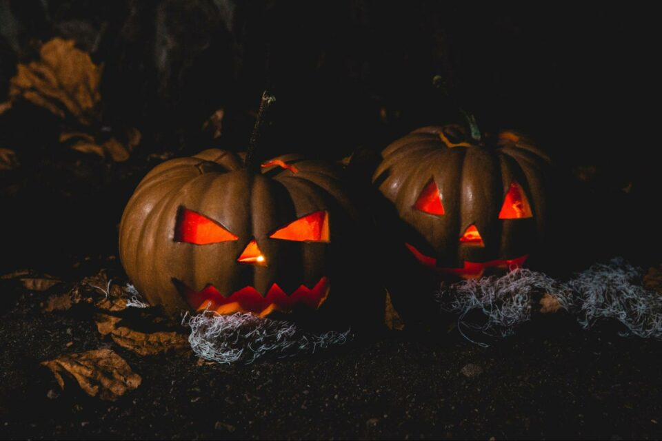
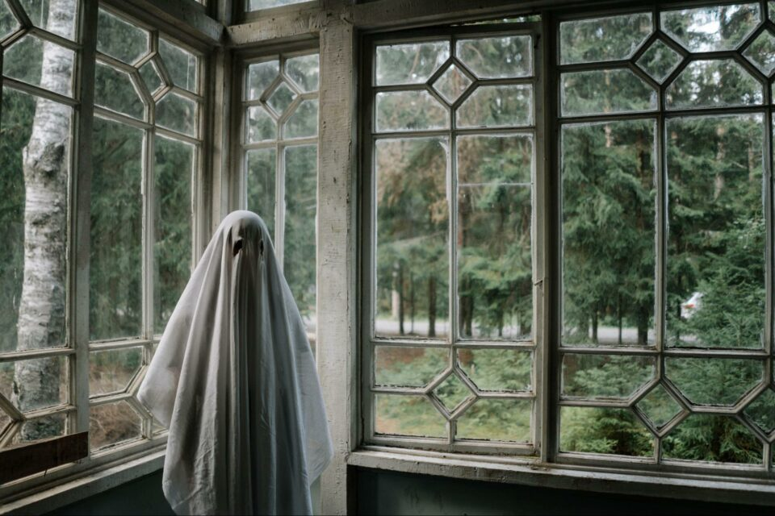
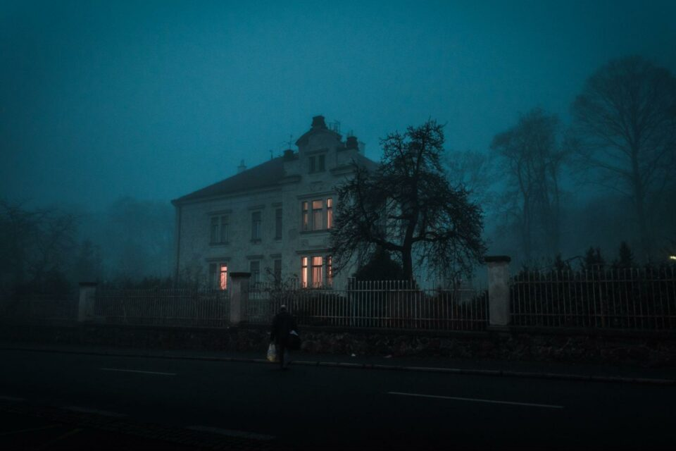
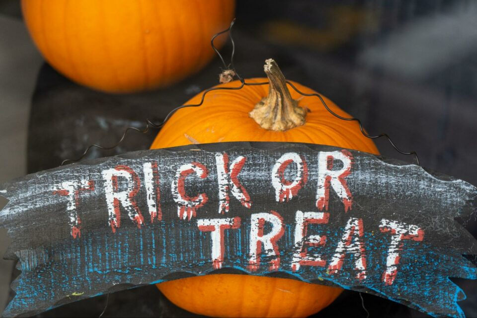
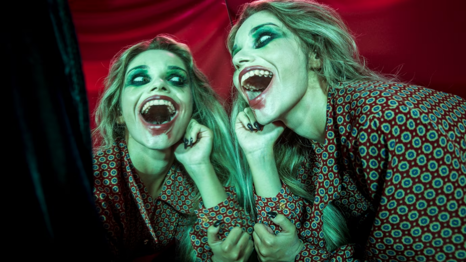
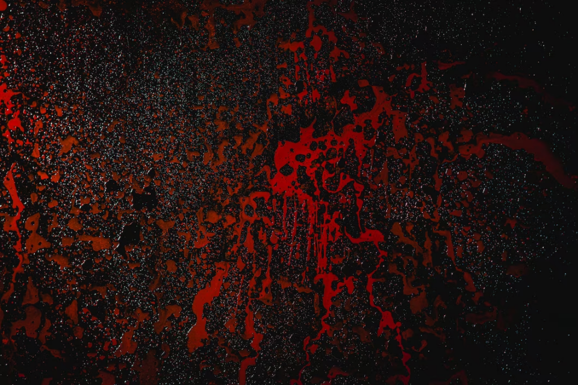
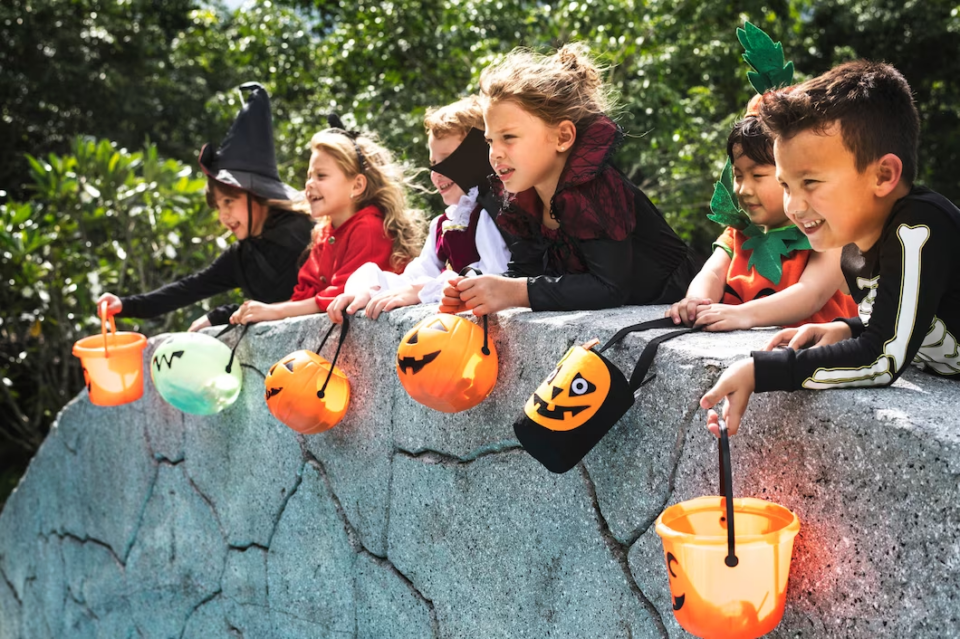

This article has been written and researched by our expert Loveable through a precise methodology. [Learn more about our methodology](https://avada.io/loveable/our-methodological.html)

[Loveable](https://avada.io/loveable/) > [Blog](https://avada.io/loveable/blog/) > [Holiday](https://avada.io/loveable/holiday/)

# 99+ Best Spooky Halloween Words to Make Your Celebration Come to Life

Written by [Blake Simpson](https://avada.io/loveable/author/blake/) Last Updated on September 07, 2023

- [99+ Halloween Words to Make Your Celebrations Extra Haunting](https://avada.io/loveable/blog/halloween-words/#wp-block-heading-2-3)
    - [30 Most Common Halloween Words In 2023](https://avada.io/loveable/blog/halloween-words/#wp-block-heading-3-4)
    - [Halloween Words List: Creepy Creatures and Characters](https://avada.io/loveable/blog/halloween-words/#wp-block-heading-3-36)
    - [Halloween Words: Haunted Places and Environments](https://avada.io/loveable/blog/halloween-words/#wp-block-heading-3-66)
    - [Trick-or-Treating Tradition Halloween Words](https://avada.io/loveable/blog/halloween-words/#wp-block-heading-3-109)
    - [Halloween Words: Signature Scary Sounds](https://avada.io/loveable/blog/halloween-words/#wp-block-heading-3-150)
    - [Halloween Words: Enchanted Colors](https://avada.io/loveable/blog/halloween-words/#wp-block-heading-3-233)
    - [Halloween Words: Most Common Activities on Halloween](https://avada.io/loveable/blog/halloween-words/#wp-block-heading-3-257)
- [Bottom Line](https://avada.io/loveable/blog/halloween-words/#wp-block-heading-2-288)

Elevate your Halloween celebrations to unprecedented heights with our extensive compilation of more than 99+ captivating **Halloween words**! Ranging from the deeply chilling to the intensely hair-raising, these meticulously selected words are poised to infuse an impeccable flair into your Halloween festivities.

Allow yourself to be captivated by unparalleled inspiration and breathe life into your revelry using an array of eerie and enchanting language that promises to imprint a lasting and unforgettable mark.

## **99+ Halloween Words to Make Your Celebrations Extra Haunting**

### **30 Most Common Halloween Words In 2023**

Use the 30 most popular and evocative phrases linked with this holiday to get in the mood for Halloween 2023. These [Halloween phrases](https://avada.io/loveable/halloween-phrases-sayings-and-quotes/) capture the fascination and spookiness of the season: from spirits to sweets, costumes to jack-o-lanterns.

- Ghost
- Pumpkin
- Costume
- Haunted
- Witch
- Skeleton
- Candy
- Trick-or-treat
- Jack-o’-lantern
- Bat
- Spider
- Zombie
- Scary
- Creepy
- Ghoul
- Monster
- Cauldron
- Werewolf
- Broomstick
- Candy corn
- Cobweb
- Mummy
- Tombstone
- Potion
- Boo
- Spooky
- Cackle
- Full moon
- Fright

### **Halloween Words List: Creepy Creatures and Characters**

Creepy Creatures and Characters offers a portal into the eerie unknown, a fusion of classic horrors and innovative nightmares. As the air turns crisp and the leaves rustle with anticipation, let these haunting personas awaken your Halloween spirit. Are you prepared to embrace the chill with these Halloween Words?

- Vampire
- Werewolf
- Zombie
- Frankenstein
- Skeleton
- Ghoul
- Demon
- Dracula
- Banshee
- Poltergeist
- Wraith
- Grim Reaper
- Jack-o’-lantern
- Gargoyle
- Chupacabra
- Sasquatch
- Mothman
- Kraken
- Headless Horseman
- Medusa
- Cyclops
- Wendigo
- Slenderman
- Nosferatu
- Jekyll and Hyde
- Phantom
- Black Cat

### **Halloween Words: Haunted Places and Environments**

These Halloween Words conjure the ethereal allure and eerie ambiance of haunted locations and surroundings, where the paranormal intersects with the ordinary, and the boundary between the tangible world and the mysterious realm becomes hazy under the captivating moonlit embrace of the season.

- Abandoned mansion
- Spooky castle
- Creepy cabin
- Eerie inn
- Haunted hotel
- Ghostly lighthouse
- Cursed church
- Mysterious asylum
- Petrified prison
- Sinister sanatorium
- Ominous manor
- Desolate factory
- Witches’ cottage
- Phantom theatre
- Abandoned school
- Cryptic catacombs
- Shadowy alley
- Ghost town
- Haunting village
- Forsaken farmstead
- Ephemeral ruins
- Dark Forest
- Ghastly graveyard
- Haunted Library
- Unsettling museum
- Spine-chilling park
- Abandoned amusement park
- Cursed Carnival
- Petrifying playground
- Ghostly garden
- Mysterious maze
- Ominous orchard
- Sinister swamp
- Eerie mountain pass
- Haunted hilltop
- Desolate wasteland
- Ghost-infested attic
- Creaking basement
- Abandoned subway
- Spooky attic  
    

### **Trick-or-Treating Tradition Halloween Words**

Trick-or-treating, a cherished [Halloween tradition](https://avada.io/loveable/halloween-traditions/), brings to life the spirit of playful enchantment and community camaraderie. As dusk settles and the stars twinkle overhead, children adorned in imaginative costumes set out on an adventure through their neighborhoods. Armed with colorful bags and buckets, they journey from house to house, eagerly knocking on doors adorned with whimsical decorations.

- Candy
- Trick-or-treat
- Jack-o’-lantern
- Halloween night
- Treat bags
- Costume parade
- Candy corn
- Goblins
- Doorbell
- Haunted houses
- Spider webs
- Caramel apples
- Ghostly greetings
- Witch’s brew
- Bat decorations
- Scarecrows
- Candy haul
- Costume contest
- Trickster
- Candy wrappers
- Pumpkin carving
- Candy bowl
- Trick-or-treaters
- Skeleton decorations
- Spooky masks
- Costume party
- Candy stash
- Trick-or-treat route
- Creepy crawlies
- Halloween spirit
- Candy overload
- Costume accessories
- Halloween treats
- Door decorations
- Frightful fun
- Candy exchange
- Costume Creativity
- Trick-or-treat bag

### **Halloween Words: Signature Scary Sounds**

Signature Scary Sounds encapsulate the spine-chilling auditory elements that define Halloween. These sounds conjure a sense of dread and excitement, setting the tone for a night of frightful festivities. They transport us to the realm of the unknown, where each sound is a note in a symphony of fear, creating an immersive experience that embodies the spirit of Halloween.

- Phantom Footsteps
- Chilling Chants
- Creepy Rattles
- Distant Groans
- Sinister Laughter
- Haunting Whispers
- Eerie Echoes
- Menacing Moans
- Unearthly wails
- Spooky Hisses
- Ghostly Murmurs
- Ethereal Humming
- Mysterious Knocks
- Shadowy Whispers
- Banshee’s Cry
- Cursed Whispers
- Poltergeist Noises
- Frightening Roars
- Cackling Shadows
- Haunting Breezes
- Echoes of Doom
- Ghoulish Whispers
- Ominous Whistling
- Terrifying Growls
- Cryptic Chants
- Wandering Echoes
- Unearthly Rustling
- Sinister Scratching
- Chilling Gasps
- Ghostly Serenades
- Eerie Chimes
- Spine-chilling Hum
- Haunting Rhythms
- Menacing Echoes
- Unearthly Shrieks
- Bizarre Murmurs
- Phantom Breaths
- Creepy Lullabies
- Mournful Howls
- Ominous Whispers
- Chilling Cries
- Faint sobs
- Distant Whistles
- Sinister Patter
- Ghostly Flutters
- Haunting Knells
- Spooky Echoes
- Unearthly Whirs
- Mysterious Rumbles
- Menacing Whines
- Eerie Hoots
- Whispering Winds
- Groaning Echoes
- Ethereal Moans
- Bizarre Whimpers
- Cursed Murmurs
- Poltergeist Racket
- Frightening Clatters
- Ominous Hums
- Ghostly Whirs
- Creepy Chuckles
- Distant Roars
- Sinister Caws
- Haunting Humming
- Menacing Pings
- Spooky Shuffles
- Unearthly Drums
- Eerie Gurgles
- Phantom Whistles
- Chilling Barks
- Mournful Tones
- Cryptic Chirps
- Ghostly Vibrations
- Ominous Cackles
- Whispering Chimes
- Bizarre Wails
- Shadowy Rumbles
- Unsettling Hisses
- Haunting Echoes
- Sinister Rattling

### **Halloween Words: Enchanted Colors**

The enchanting and ethereal color scheme that characterizes the Halloween season is called “Enchanted Colors.” Dark and opulent colors like moonlight silver, witch’s brew green, blood crimson, and midnight black captivate décor, costumes, and celebrations. These hues give off an air of enchantment and mystery, elevating the commonplace to the exceptional. 

These beautiful colors, whether the vivid oranges of pumpkins or the dark hues of a haunting night, add an otherworldly allure to the celebration and help make Halloween memorable.

- Black
- Orange
- Purple
- Green
- Blood Red
- Silver
- Gray
- White
- Midnight Blue
- Glow-in-the-Dark Green
- Dark Brown
- Charcoal
- Crimson
- Deep Indigo
- Raven Black
- Witchy Green
- Ghoulish Gray
- Vampire Red
- Zombie Flesh
- Haunted Blue

### **Halloween Words: Most Common Activities on Halloween**

Spanning a wide spectrum of experiences, Halloween’s offerings encompass everything from lighthearted jests to heart-pounding moments of fear. This vibrant tapestry of activities is tailored to accommodate an array of tastes and inclinations, coming together in celebration of the shared thrill of embracing the enigmatic and the unfamiliar.

- Trick-or-Treating
- Pumpkin Carving
- Costume Parties
- Haunted Houses
- Apple Bobbing
- Halloween Movie Marathon
- Costume Contests
- Pumpkin Patch Visits
- Ghost Stories
- Candy and Treats Baking
- Halloween Crafts
- Corn Mazes
- Dia de los Muertos Celebrations
- Ghoulish Decorations
- Themed Dinners
- Face Painting
- Costume Parades
- Visit to Cemeteries
- Witch Hunts or Treasure Hunts
- Monster Mash Dance Parties
- Horror Nights at Amusement Parks
- Pumpkin Races
- Fall Harvest Festivals
- Candlelit Ghost Tours
- Halloween-Themed Charities

**_See More:_**

- Best [Halloween Captions](https://avada.io/loveable/blog/halloween-captions/)

- Best [Halloween Party Names](https://avada.io/loveable/halloween-party-names/)

## **Bottom Line**

Embark on a mesmerizing journey into the heart of Halloween enchantment with this carefully selected collection of over 99+ spine-tingling **Halloween words**. These carefully chosen words possess the extraordinary power to transcend the ordinary, elevating your festivities to a realm brimming with mystery, intrigue, and the allure of the paranormal. 

As the weather turns cooler and the moonlight fills the night, let these words guide you into a realm where every soft sound holds a mystery, every dark corner hides a surprise, and every instant is touched by the season’s enchantment.

- [99+ Halloween Words to Make Your Celebrations Extra Haunting](https://avada.io/loveable/blog/halloween-words/#wp-block-heading-2-3)
    - [30 Most Common Halloween Words In 2023](https://avada.io/loveable/blog/halloween-words/#wp-block-heading-3-4)
    - [Halloween Words List: Creepy Creatures and Characters](https://avada.io/loveable/blog/halloween-words/#wp-block-heading-3-36)
    - [Halloween Words: Haunted Places and Environments](https://avada.io/loveable/blog/halloween-words/#wp-block-heading-3-66)
    - [Trick-or-Treating Tradition Halloween Words](https://avada.io/loveable/blog/halloween-words/#wp-block-heading-3-109)
    - [Halloween Words: Signature Scary Sounds](https://avada.io/loveable/blog/halloween-words/#wp-block-heading-3-150)
    - [Halloween Words: Enchanted Colors](https://avada.io/loveable/blog/halloween-words/#wp-block-heading-3-233)
    - [Halloween Words: Most Common Activities on Halloween](https://avada.io/loveable/blog/halloween-words/#wp-block-heading-3-257)
- [Bottom Line](https://avada.io/loveable/blog/halloween-words/#wp-block-heading-2-288)

### [Blake Simpson](https://avada.io/loveable/author/blake/)

Hi, I'm Blake from Loveable. I help people find perfect gifts for occasions like anniversaries and weddings. I also write a blog about holidays, sharing insights to make them more meaningful. Let's create unforgettable moments together!

- [Twitter](https://twitter.com/intent/tweet)
- [Facebook](https://www.facebook.com/sharer/sharer.php)
- [instagram](https://avada.io/loveable/blog/halloween-words/)
- [pinterest](https://www.pinterest.com/loveablellc/)

## Related Posts

[### 120+ Christian Birthday Wishes To Spread Your Love](https://avada.io/loveable/blog/christian-birthday-wishes/) 

[

### 35 Best 70th Birthday Ideas To Celebrate The Special Milestone

](https://avada.io/loveable/blog/70th-birthday-ideas/)

[

### 50 Best 30th Birthday Decorations for a Remarkable Birthday Bash

](https://avada.io/loveable/blog/30th-birthday-decorations/)

[

### 40 Delicious Vegan Christmas Desserts to Delight Your Palate

](https://avada.io/loveable/blog/vegan-christmas-desserts/)

[

### 60 Christmas Team Building Activities to Boost Workplace Spirit

](https://avada.io/loveable/blog/christmas-team-building-activities/)
