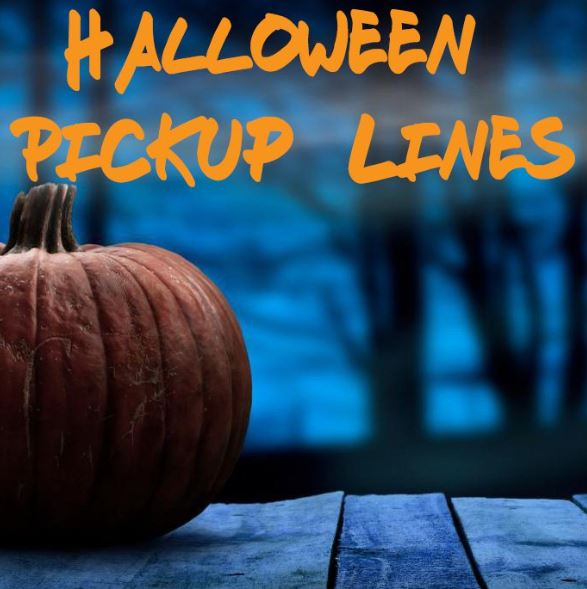
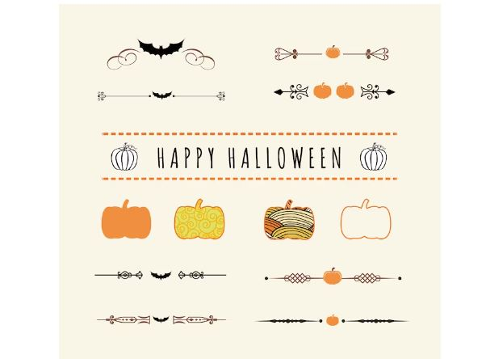
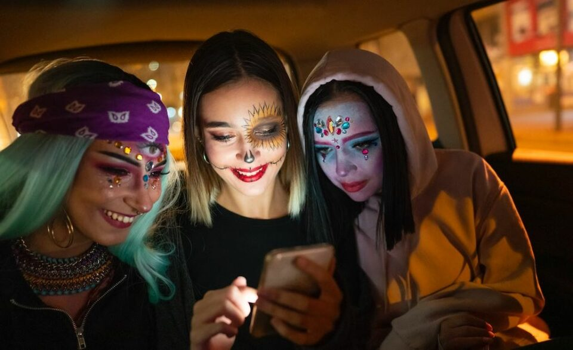
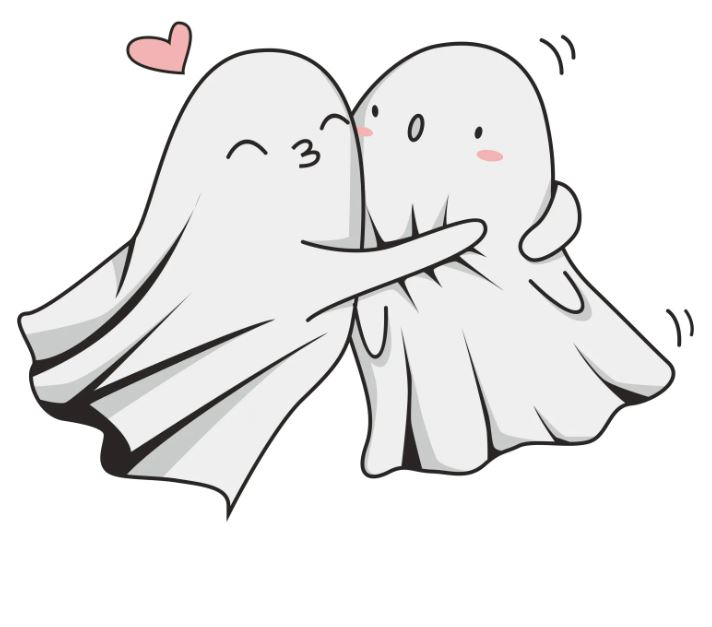
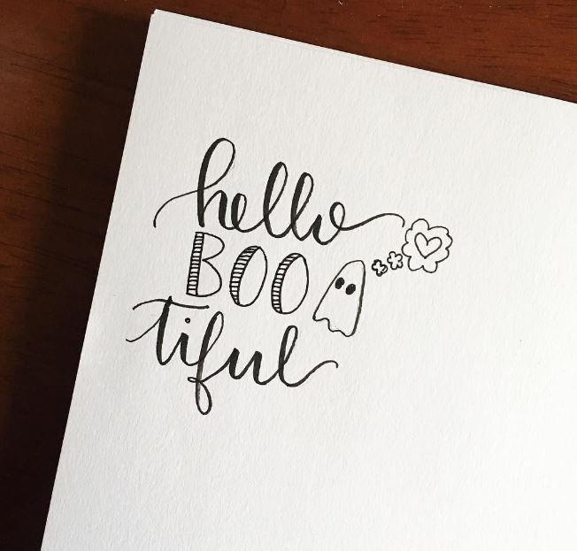
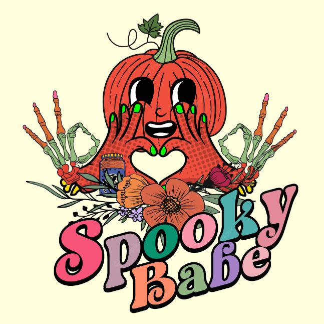

This article has been written and researched by our expert Loveable through a precise methodology. [Learn more about our methodology](https://avada.io/loveable/our-methodological.html)

[Loveable](https://avada.io/loveable/) > [Blog](https://avada.io/loveable/blog/) > [Holiday](https://avada.io/loveable/holiday/)

# 99 Halloween Pickup Lines That’ll Make Your Boo in 2023

Written by [Blake Simpson](https://avada.io/loveable/author/blake/) Last Updated on September 12, 2023

- [Best Halloween pickup lines](https://avada.io/loveable/blog/halloween-pickup-lines/#wp-block-heading-2-4)
    - [Take more looks…](https://avada.io/loveable/blog/halloween-pickup-lines/#wp-block-heading-3-29)
- [Naughty Halloween pickup lines](https://avada.io/loveable/blog/halloween-pickup-lines/#wp-block-heading-2-45)
    - [See more…](https://avada.io/loveable/blog/halloween-pickup-lines/#wp-block-heading-3-64)
- [Funny Halloween pickup lines](https://avada.io/loveable/blog/halloween-pickup-lines/#wp-block-heading-2-76)
    - [Others…](https://avada.io/loveable/blog/halloween-pickup-lines/#wp-block-heading-3-96)
- [Hilarious Halloween pickup lines](https://avada.io/loveable/blog/halloween-pickup-lines/#wp-block-heading-2-109)
    - [More…](https://avada.io/loveable/blog/halloween-pickup-lines/#wp-block-heading-3-131)
- [How to use Halloween pick-up lines properly](https://avada.io/loveable/blog/halloween-pickup-lines/#wp-block-heading-2-143)
- [Final Thoughts,](https://avada.io/loveable/blog/halloween-pickup-lines/#wp-block-heading-2-155)

Are you in search of a Halloween sweetheart? Utilize these pickup lines to establish a chilling connection.

With Halloween approaching swiftly, you can anticipate the eerie decorations adorning houses, a lineup of [Halloween movies](https://avada.io/loveable/blog/best-halloween-movies/) ready for streaming, and the arrival of invitations to Halloween parties. It’s undoubtedly an enjoyable time of the year, but don’t overlook the flirtatious opportunities Halloween brings. That’s precisely why **Halloween pickup lines** exist!

If you’re interested in captivating a new romantic interest before the holiday season begins, employ these Halloween pickup lines to ignite some frightfully fantastic chemistry at a monster bash, on Tinder, within a haunted house, or wherever your spooky heart desires. There’s an assortment of pickup lines suitable for guys, girls, ghouls, goblins, and everyone in between. So, let the hair-raising flirtation commence!

## **Best Halloween pickup lines**

- I’m going to scare the pants off of you.
- I’m going as a ghost, so I can haunt you all night long.
- Let’s skip the tricks and cut right to the treats.
- Are you going to dress up like a sexy cat or a slutty nurse?
- Are you a ghost? Because it’s scary how good you look.
- What are you going as this year? Hottest person on Tinder? I
- ‘m sure you’re going to get a lot of candy tonight. Let me be your treat.
- I looked into my crystal ball, and it showed us having a great future together.
- Wanna go out for some Halloween candy? I can be your zombie and you can be my brains!
- I know a really good place to get some treats, do you want to come with me?
- You’re looking boo-tiful tonight!
- Do you have any candy corn? I could really go for some candy corn.
- I’m not a vampire, but I can Dracula your neck.
- You’re the prettiest witch I’ve ever seen!
- Are you a witch? Because you’ve cast a spell on me.
- I’d walk through 1,000 haunted houses for the chance to ask you out.
- I’d love to take you home to meet my mummy.
- I know what your Halloween costume should be: my date.
- I don’t have a costume, but do you want to see my real face?
- I’m not wearing a costume, but if I did it would be a sexy nurse.
- Want to watch scary movies and cuddle?
- I’m not a pumpkin, but I’d be happy to be your pie!

### **Take more looks…**

- You can carve my pumpkin anytime.
- You’re so bewitching!
- Do you want to make a deal? You can be my sugar daddy and I’ll be your little sweetie.
- What’s a nice ghoul like you doing in a place like this?
- Are you scared of getting spooked? Because I can show you a good time.
- Dang ghoul, I’m loving your look.
- You’re the only ghost I want to haunt me.
- I’m not a werewolf, but I can howl at the moon for you.
- Are you a haunted house? ‘Cause you have my heart pounding.
- Be my ghoulfriend? 
- I’m not a monster, but I can do some damage if you let me.
- Isn’t it scary how your number isn’t in my phone yet?
- Are you a witch? Because you’ve cast a spell on me!
- Are you a zombie? Because you’re drop-dead gorgeous.
- You’re the most beautiful goblin I’ve ever seen!

## **Naughty Halloween pickup lines**

- Do you want to help me with my candy collection?
- I’m not a vampire, but I can certainly suck the blood out of your neck.
- I’m not a witch, but I can give you a wicked good time.
- Let me be your treat and I’ll let you be my trick.
- I’m not a werewolf, but I can howl at the moon with you.
- My costume is just a shirt and some tighty -whities. Do you want to see the real thing?
- What are you going to dress up as for Halloween? Let me guess… a slutty nurse!
- You’re the only treat I’m interested in this Halloween.
- Is it true what they say about the size of a man’s canine teeth? Do you want to see my fangs?
- Hey, are you a vampire? Because you’ve just sucked all the blood out of me!
- You must be a witch, because you’ve cast a spell on me!
- I think you’re a werewolf, because you’ve been making me howl all night!
- What kind of a spell did you cast on me, because I’ve been feeling under the weather lately!
- I think you’re a witch, because you’ve been making me feel feverish all night!
- Hey, are you a zombie? ‘Cause you just gave me a fright!
- I think you’re a banshee, because you’ve been making my hair stand on end all night!
- Do you want to see my skeleton? ‘Cause it’s bone-a-riffic!

### **See more…**

- Are you a mummy? ‘Cause you’ve wrapped yourself around my heart
- I think you’re a zombie, because you’ve been making me feel undead all night!
- I think you’re a banshee, because you’ve been making my skin crawl all night!
- Are you a witch? ‘Cause you’ve put a spell on me!
- I think you’re a vampire, because you’ve been making my blood boil all night!
- I think you’re a werewolf, because you’ve been making my heart race all night!
- Do you want to see my autopsy report? ‘Cause you’ve got me feeling dead inside!
- I think you’re a mummy, because you’ve been wrapping yourself around my heart!
- If you you think I’m hot now, wait until you see what I turn into at midnight. want to be my treat, you’ve got to be good enough to deserve it.

Naughty Halloween pick-up lines should be used with caution and only in appropriate contexts where it is clear that the other person is receptive to playful and flirtatious banter. 

These lines can be used when both individuals are comfortable with a more risqué tone and have established a mutual understanding of the playful nature of the interaction. It’s important to gauge the other person’s response and be respectful of their boundaries and comfort levels at all times.

## **Funny Halloween pickup lines**

- You must be a vampire, because you’ve just sucked the life out of me.
- I’m not saying you’re a witch, but I wouldn’t mind casting a spell on you.
- Everyone says you’re a witch because you trapped me with your love spell.
- Do you want to go trick or treating?
- Are you a ghost? ‘Cause you just gave me the chills.
- I’m not sure if you’re a witch or a warlock, but I wouldn’t mind being your apprentice.
- I must be a zombie, because I can’t stop thinking about you.
- I’d like you to dress up as Cinderella, so you can lose your shoe and I can see you again.
- You must be a vampire, because you’ve just sucked the life out of me.
- Wanna see my magic trick? I’ll make your clothes disappear.
- Can I borrow a kiss? I promise I won’t bite.
- If you were a zombie, I’d want to be your brain.
- I’m not saying you’re a witch, but I wouldn’t mind casting a spell on you.
- It’s a good thing I dressed up as a zombie, otherwise I would have died when I saw you.
- You must be a genie, because you’ve just granted me three wishes.
- I’m not sure if you’re a witch or a warlock, but I wouldn’t mind being your apprentice.
- Do you want to go trick or treating?
- Are you a ghost? ‘Cause you just gave me the chills.

### **Others…**

- You’re the scariest thing I’ve ever seen!
- I’m going to need a bigger bag to carry your candy.
- You must be a witch, because you’ve got me under your spell!
- You’re the best costume I’ve seen all night!
- Let’s go out and haunt some houses!
- I’m not afraid of no ghosts!
- Do you want to make a deal? You can be my Treat, and I’ll be your Trick.
- Are you sure you’re not a vampire? Because you’ve sucked all the blood out of me!
- What’s your sign?

Funny Halloween pick-up lines can be used in a variety of social settings where humor is welcomed and appreciated. Parties, costume events, or casual gatherings with a light-hearted atmosphere are great opportunities to inject some laughter and break the ice with these lines. 

Additionally, online dating platforms or conversations with a playful tone are suitable for using funny Halloween pick-up lines. Remember to gauge the other person’s response and ensure that they are receptive to the humor before continuing the banter.

**Related:** Best [Halloween Quotes](https://avada.io/loveable/blog/halloween-quotes/) 2023 for The Fun and Frights This October

## **Hilarious Halloween pickup lines**

- You must be a zombie, because you’ve got me eating out of the palm of your hand.
- I think you have cast a spell on me because I am seeing the person of my dreams.
- I’d like to be the victim in your next murder mystery!
- I’m not sure what I’m more scared of, Halloween or being alone with you!
- The nightmare became a dream now you are here
- You can have my candy, but only if you promise to keep your mouth shut!
- There is nothing in the world of the living or the dead that can extinguish my feelings for you.
- I think you’re a real treat!
- Let’s go have some fun and raise some hell!
- Your costume isn’t scary but it will make my heart pound out of my chest.
- Wanna make some magic together?
- I’m not sure if you’re a witch or a warlock, but I know I want to get under your robe!
- You’re making my temperature rise!
- You’re the only candy I need this Halloween
- Can I be your victim for the night?
- I’m not sure what’s scarier, you or the ghost costume you’re wearing!
- You give new meaning to the term “Halloween candy”!
- Do you want to come back to my place and see my collection of horror movies?
- I’m looking for a wizard to break the spell I just got from seeing you, hon
- I’m getting a little bit scared, but I think I still want to be with you!

### **More…**

- I can’t believe I’m actually going out with a vampire!
- What are you dressed up as? You look like the love of my life.
- You’re the most delicious thing I’ve ever seen!
- I wouldn’t mind being possessed by you!
- Let’s go scare some people together!
- Look! Our costumes match, we look like future husbands and wives.
- A scaryre you a ghost? Because you’ve been haunting my dreams.
- You are my favorite part of Halloween
- What are you doing for Halloween?

These lines are meant to elicit genuine laughter and create a fun and enjoyable atmosphere. Costume parties, social gatherings with friends, or casual hangouts where humor is welcomed are great occasions to unleash your hilarious Halloween pick-up lines. 

However, always be mindful of the other person’s preferences and ensure that they are receptive to playful and humorous interactions.

## **How to use Halloween pick-up lines properly**

Using Halloween pickup lines effectively requires a combination of confidence, humor, and the right timing. Here are a few tips to make the most of these spooky lines:

**1\. Be playful and light-hearted**: Halloween is a time for fun and laughter, so approach your pick-up lines with a playful attitude. Avoid being overly serious or creepy.

**2\. Consider the context**: Choose an appropriate setting to use your Halloween pickup lines. Parties, costume events, or online dating platforms with a Halloween theme are ideal. Make sure the other person is open to playful banter before using a pick-up line.

**3\. Tailor your line to the person**: Personalize the pickup line based on the individual’s costume or interests. This shows attentiveness and makes the line more memorable.

**4\. Deliver with confidence**: Confidence is attractive. Maintain eye contact, speak clearly, and deliver the line with a smile. A confident approach can help you make a positive impression.

**5\. Gauge the response**: Pay attention to the other person’s reaction. If they seem receptive and engage in conversation, continue the playful banter. If they seem disinterested or uncomfortable, respect their boundaries and switch to a different topic.

Remember, the goal is to have fun and create a connection. Using Halloween pickup lines can be a lighthearted way to break the ice and start a conversation, but always be respectful and mindful of the other person’s comfort level.

**_See More_**:

- Spooky [Halloween Arch Ideas](https://avada.io/loveable/blog/halloween-photoshoot-ideas/)

- Best [Halloween Photoshoot Ideas](https://avada.io/loveable/blog/halloween-photoshoot-ideas/)

## **Final Thoughts,**

We trust that our compilation of **Halloween pickup lines** has provided valuable assistance to our readers in their quest to find that special someone during this eerie season. The dating scene can be daunting, but by offering these imaginative pick-up lines, we aspire to alleviate some of the intimidation. We extend our gratitude to our readers for their time and attention, as well as for the positive feedback we have received.

It is important to remember that dating involves mutual participation, and while pick-up lines serve as a playful icebreaker, treating each other with respect and obtaining consent is paramount. We encourage our readers to continue showcasing their creativity when approaching potential partners while remaining mindful of the other person’s boundaries and emotions.

- [Best Halloween pickup lines](https://avada.io/loveable/blog/halloween-pickup-lines/#wp-block-heading-2-4)
    - [Take more looks…](https://avada.io/loveable/blog/halloween-pickup-lines/#wp-block-heading-3-29)
- [Naughty Halloween pickup lines](https://avada.io/loveable/blog/halloween-pickup-lines/#wp-block-heading-2-45)
    - [See more…](https://avada.io/loveable/blog/halloween-pickup-lines/#wp-block-heading-3-64)
- [Funny Halloween pickup lines](https://avada.io/loveable/blog/halloween-pickup-lines/#wp-block-heading-2-76)
    - [Others…](https://avada.io/loveable/blog/halloween-pickup-lines/#wp-block-heading-3-96)
- [Hilarious Halloween pickup lines](https://avada.io/loveable/blog/halloween-pickup-lines/#wp-block-heading-2-109)
    - [More…](https://avada.io/loveable/blog/halloween-pickup-lines/#wp-block-heading-3-131)
- [How to use Halloween pick-up lines properly](https://avada.io/loveable/blog/halloween-pickup-lines/#wp-block-heading-2-143)
- [Final Thoughts,](https://avada.io/loveable/blog/halloween-pickup-lines/#wp-block-heading-2-155)

### [Blake Simpson](https://avada.io/loveable/author/blake/)

Hi, I'm Blake from Loveable. I help people find perfect gifts for occasions like anniversaries and weddings. I also write a blog about holidays, sharing insights to make them more meaningful. Let's create unforgettable moments together!

- [Twitter](https://twitter.com/intent/tweet)
- [Facebook](https://www.facebook.com/sharer/sharer.php)
- [instagram](https://avada.io/loveable/blog/halloween-pickup-lines/)
- [pinterest](https://www.pinterest.com/loveablellc/)

## Related Posts

[### 120+ Christian Birthday Wishes To Spread Your Love](https://avada.io/loveable/blog/christian-birthday-wishes/) 

[

### 35 Best 70th Birthday Ideas To Celebrate The Special Milestone

](https://avada.io/loveable/blog/70th-birthday-ideas/)

[

### 50 Best 30th Birthday Decorations for a Remarkable Birthday Bash

](https://avada.io/loveable/blog/30th-birthday-decorations/)

[

### 40 Delicious Vegan Christmas Desserts to Delight Your Palate

](https://avada.io/loveable/blog/vegan-christmas-desserts/)

[

### 60 Christmas Team Building Activities to Boost Workplace Spirit

](https://avada.io/loveable/blog/christmas-team-building-activities/)
