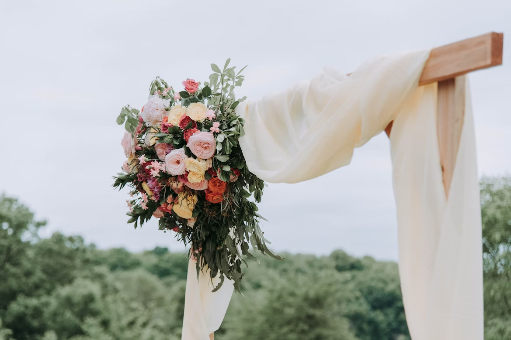
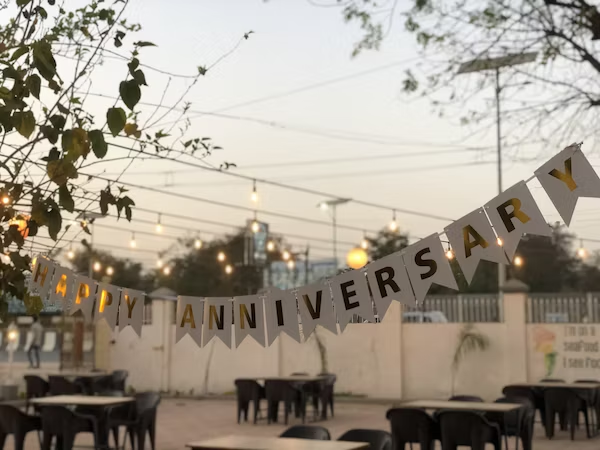
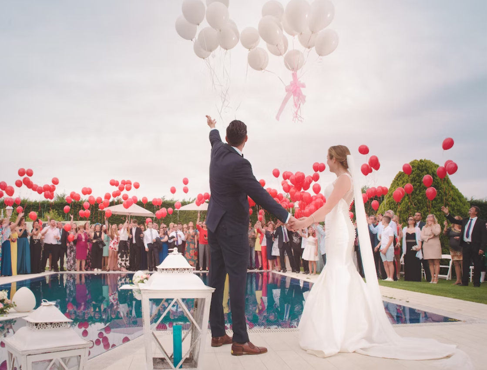
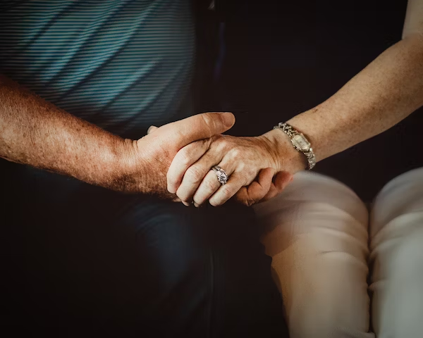

This article has been written and researched by our expert Loveable through a precise methodology. [Learn more about our methodology](https://avada.io/loveable/our-methodological.html)

[Loveable](https://avada.io/loveable/) > [Blog](https://avada.io/loveable/blog/) > [Parenting](https://avada.io/loveable/parenting/)

# 99+ Heartfelt Quotes And Wishes: Happy Anniversary to Mom and Dad!

Written by [Benjamin Collins](https://avada.io/loveable/author/benjamin/) Last Updated on September 05, 2023

- [Wedding Anniversary Quotes to Mom and Dad](https://avada.io/loveable/blog/quotes-happy-anniversary-mom-dad/#wp-block-heading-2-3)
- [Anniversary Wishes For for Mom and Dad](https://avada.io/loveable/blog/quotes-happy-anniversary-mom-dad/#wp-block-heading-2-30)
- [Funny Anniversary Quotes For Mom and Dad](https://avada.io/loveable/blog/quotes-happy-anniversary-mom-dad/#wp-block-heading-2-57)
- [Anniversary Wishes for Mom and Dad](https://avada.io/loveable/blog/quotes-happy-anniversary-mom-dad/#wp-block-heading-2-75)
- [Bottom Line](https://avada.io/loveable/blog/quotes-happy-anniversary-mom-dad/#wp-block-heading-2-114)

Congratulations on reaching a significant milestone, and **happy anniversary Mom and Dad**! What better way to show our sincere gratitude than with emotional quotes and wishes as we celebrate the love and dedication that have endured the test of time? To honor the enduring love between parents, we have compiled a lovely collection of over 99 poignant statements and wishes in this post. These comments pay homage to the lovely trip you two have taken, from tender messages that express the depth of their friendship to humorous wishes that make them grin.

These sayings and wishes are sure to warm your parents’ hearts and show them how much you care, whether they’re commemorating their first anniversary or a noteworthy milestone. To make a moment that will last a lifetime, communicate these sentiments in person, in a beautiful anniversary letter, or as passionate toasts during a celebratory meal instead of saying, Happy anniversary, Mom and Dad!

## **Wedding Anniversary Quotes to Mom and Dad**

1. “Mom and Dad, I cannot begin to describe how blessed I am to have amazing parents in my life. Seeing true love through you both makes my heart happy. As your daughter/son I see perfection in both of you. I love you.” -Anonymous
2. “You don’t marry someone you can live with. You marry the person who you cannot live without.” -Anonymous
3. “The only thing better than having you for parents is my children having you for grandparents. Happy anniversary Mom and Dad.” -Anonymous
4. “You two are a living example of how a couple can be committed to their love and nurture a family‘s growth year after year. Happy wedding anniversary to you!” -Anonymous
5. “Because of you both, the world knows that truth and love exist. Keep these beliefs alive and cherish one another. Happy anniversary, Mom and Dad!” -Anonymous
6. “You are the parents that all kids hope to have, you are the couple that all lovers hope to be, and you both are the pillars of support that every family wishes it had. Happy anniversary to the best parents ever.” -Anonymous
7. “Another year to create precious memories together. Another year to discover new things to enjoy about each other. Another year to strengthen a marriage that defines forever. Happy anniversary!” -Anonymous
8. “The best love is the kind that awakens the soul; that makes us reach for more, that plants the fire in our hearts and brings peace to our minds.” -Nicholas Sparks
9. “The greatest happiness of life is the conviction that we are loved; loved for ourselves, or rather, loved in spite of ourselves.” -Victor Hugo
10. “All, everything that I understand, I understand only because I love.” -Leo Tolstoy
11. “The best and most beautiful things in this world cannot be seen or even heard, but must be felt with the heart.” -Helen Keller
12. “To love is nothing. To be loved is something. But to love and be loved, that’s everything.” -T. Tolis
13. “I saw that you were perfect, and so I loved you. I saw that you were not perfect, and I loved you even more.” -Angelita Lim
14. “The heart wants what it wants. There’s no logic to these things. You meet someone, and you fall in love, and that’s that.” -Woody Allen
15. “ There’s no substitute for a great love who says, ‘No matter what’s wrong with you, you’re welcome at this table.” -Tom Hanks
16. “At the touch of love, everyone becomes a poet.” -Plato
17. “Being deeply loved by someone gives you strength while loving someone deeply gives you courage.” -Lao-Tzu
18. “True love doesn’t happen right away; it’s an ever-growing process. It develops after you’ve gone through many ups and downs, when you’ve suffered together, cried together, laughed together.” -Ricardo Montalban
19. “True love doesn’t come to you, it has to be inside you.” -Julia Roberts
20. “You don’t love someone for their looks, their clothes or their fancy car, but because they sing a song only you can hear.” -Oscar Wilde
21. “Where there is love, there is life.” – Mahatma Ghandi
22. “Most people find it hard to believe in “forever”, but seeing the never-ending love between both of you makes me believe in “forever”. Happy anniversary Mom and Dad!” -Anonymous
23. “Despite all the years, the trying times that you have both been through, yet your marriage remained strong and steadfast. When I get married someday, I hope I would have a bond stronger and steady with my partner as both of you did. I love you mom and dad. Happy anniversary!” -Anonymous
24. “I remember how young, beautiful and happy you were when I was a little kid. And you know, dear parents, nothing has changed since then. You’re just the same: loving and being loved – that’s what important. Congratulations on your wedding anniversary!” -Anonymous
25. “It seems like I was born under a lucky star, because I have such great parents. You’ve overcome many life difficulties together and despite it your love and respect for each became only stronger. It’s a real wonder and I’m happy to witness it. Congratulations on the anniversary!” -Anonymous

## **Anniversary Wishes For for Mom and Dad**

26. “Today is a very special day for people I love more than life – it’s your wedding anniversary, my beloved parents! You’ve already spent a lot of wonderful years together and now I want to wish you to spend even more years enjoying each other and bringing joy to everyone around! Congratulations!” -Anonymous
27. “He felt now that he was not simply close to her, but that he did not know where she ended and he began.” -Leo Tolstoy
28. “You be my glass of wine and I’ll be your shot of whiskey.” -Blake Shelton
29. “Marriage is the golden ring in a chain whose beginning is a glance and whose ending is Eternity.” -Kahlil Gibran
30. “My love for you is a journey, starting at forever and ending at never.” -Anonymous
31. I am sending this message to say that I am very lucky to have such wonderful parents who have been my guiding force throughout my life. Silver jubilee is only the beginning of many more to come for you. Happy Silver Jubilee, Mom & Dad!
32. Dad and Mom! You have been the guiding force in our lives, giving us all the happiness we have today. We wish you a very happy silver jubilee!
33. Mom & Dad, you are the reason why we are here today! Thank you for always being there for us no matter what situation we’re facing in life. Happy Silver Jubilee!
34. Happy Silver Jubilee Mom and Dad! Here’s a toast to the last 25 years of your life together. It’s been an incredible journey, and you’ve been through thick and thin, but you’re still going strong.
35. I hope that this celebration will be filled with joy and laughter as we celebrate this milestone in your lives. We can’t wait to see what the next 25 years will bring!
36. The biggest gift for you after my marriage was my birth. The biggest gift for me after my birth was such amazing parents like you. Happy Anniversary Mom and Dad.
37. We, your children, are the reason for your happy family. But you, our parents, are the reason we have a happy life. Happy Anniversary to both of you.
38. Dear Mama and Papa, I am blessed to have two role models in my entire life. Your marriage inspired me in many ways and I believe that true love exists. Wishing you many more happy years together. Happy marriage anniversary!
39. You are the couple who all want to be lovers and you are also the parents who want all children!
40. Best wishes to you for celebrating another year of happiness.
41. Happy wedding anniversary to the couple, who expresses love, signifies virtue, reflects perfection, reflects righteousness, and symbolizes the best in life. Happy Anniversary Mom and Dad!!!
42. I admire both of you not only because you are my parents, but because both of you are a living example of how two people can achieve their life goals, and commit to their love, and years. Nourish the growth of a family every year. Happy Anniversary Mom and Dad!!!
43. I will never understand why couples fight; I will never know why couples separate. Because my mom and dad are not just lovers, they are each other’s best partners. Happy marriage anniversary.
44. May your love always grow and be blessed throughout your life.
45. You came close to each other only through the passage of years in your life. Please continue this in the coming years too! Happy marriage anniversary!
46. I had the greatest opportunity for me in childhood, if not for parents like you. I do not know where I will be. A happy anniversary mom and dad from daughter status.
47. No words can describe my wishes for you my dear parents, which are true to heart! happy wedding anniversary!
48. Happy Anniversary to the best parents in the world! Thank you for everything you have done for me. I love you both so much!
49. May you have a wonderful time together as you celebrate another year of marriage!
50. Everyday I’m grateful to have such wonderful parents! Happy Anniversary!

## **Funny Anniversary Quotes For Mom and Dad**

51. “Being married is like having a best friend who doesn’t remember anything you say.” -Anonymous
52. “Marriage lets you annoy one special person for the rest of your life.” -Anonymous
53. “Never laugh at your wife’s choices, you are one of them.” -Anonymous
54. “Love is being stupid together.” -Anonymous
55. “You still behave like newlyweds, happy anniversary!” -Anonymous
56. “Dad, winning Mom’s heart was actually my lucky victory. Happy anniversary!” -Anonymous
57. “You’ve been together so long you be granted an honorary P.H.D in EACH OTHER. Happy anniversary.” -Anonymous
58. “I couldn’t imagine where I’d be without you two, literally! Happy anniversary.” -Anonymous
59. “The secret of a happy marriage remains a secret. But, whatever you two are doing is working. Stay happy and happy anniversary.” -Anonymous
60. “If the apple doesn’t fall far from the tree, I’m expecting to marry the girl of my dreams and be married X number of years. Thanks Mom and Pops.” -Anonymous
61. Mom and Dad, I’m certain I will never find love since you two have raised my standards so high. I believe I shall die alone. Congratulations on your anniversary!
62. Happy wedding anniversary, mom and dad. But why should I wish you when you didn’t even invite me to your wedding?
63. It is a mystery to me how you’ve been living together for so long and haven’t grown tired of one other. Just kidding! Happy anniversary, mom and dad.
64. If you had asked my permission before getting married, I would have offered you some wonderful wedding advice because your wedding gown and venue were very dull, which is why I don’t watch your wedding video. However, happy anniversary.
65. I think God knitted your love in heaven with His own hands because I have never seen two people so in love as you two. Happy Anniversary, mom and dad.
66. Earthquakes, tornadoes, tsunamis, or volcanoes – nothing has the power to shatter the love between my mom and dad. Not now, not ever. Happy anniversary.

## **Anniversary Wishes for Mom and Dad**

67. “Happy Anniversary to the parents that inspire me every day. Best wishes to you two for all the years to come.” – Anonymous
68. “Wishing you both continued love and happiness for many years to come. Happy Anniversary!” – Anonymous
69. “Best wishes today and all the days to come. Happy Anniversary to the both of you!” – Anonymous
70. “You both inspire me every day to be the best version of myself that I can be and to always treat those I love with respect and kindness. Best wishes for the years ahead.” – Anonymous
71. “I can’t tell you how often I’m inspired by the love you two share together. Sending you all my well wishes for the coming years.” – Anonymous
72. “Wishing you a happy Anniversary, a happy marriage, and many years of good health to enjoy it with!” – Anonymous
73. “Sending you my well wishes and congratulations as you show us all what it means to build a wonderful marriage.” – Anonymous
74. “It’s so many years later and yet the two of you are still the perfect example of what a happy, blissful marriage looks like. Thank you for always being my shining example. Best wishes for your anniversary.” –Anonymous
75. The biggest gift for you after my marriage was my birth. The biggest gift for me after my birth was such amazing parents like you. Happy Anniversary Mom and Dad.
76. We, your children, are the reason for your happy family. But you, our parents, are the reason we have a happy life. Happy Anniversary to both of you.
77. Dear Mama and Papa, I am blessed to have two role models in my entire life. Your marriage inspired me in many ways and I believe that true love exists. Wishing you many more happy years together. Happy marriage anniversary!
78. You are the couple who all want to be lovers and you are also the parents who want all children!
79. Best wishes to you for celebrating another year of happiness.
80. Happy wedding anniversary to the couple, who expresses love, signifies virtue, reflects perfection, reflects righteousness, and symbolizes the best in life. Happy Anniversary Mom and Dad!!!
81. I admire both of you not only because you are my parents, but because both of you are a living example of how two people can achieve their life goals, commit to their love, and years. Nourish the growth of a family every year. Happy Anniversary Mom and Dad!!!
82. I will never understand why couples fight; I will never know why couples separate. Because my mom and dad are not just lovers, they are each other’s best partners. Happy marriage anniversary.
83. May your love always grow and be blessed throughout your life.
84. You came close to each other only through the passage of years in your life. Please continue this in the coming years too! Happy marriage anniversary!
85. I had the greatest opportunity for me in childhood, if not for parents like you. I do not know where I will be. A happy anniversary mom and dad from daughter status.
86. No words can describe my wishes for you my dear parents, which are true to heart! Happy wedding anniversary!
87. Thank you for showing all of us how we can be together and be together for each other. Happy wedding anniversary mom and dad.
88. Marriage and family are not made in heaven. They are built in loving homes like ours. Happy Anniversary to my dear Dad and lovely Mom.
89. When the two of you got married, you had dreams of a beautiful home, a wonderful career, and wonderful children. But you have achieved a lot by becoming the best parent in the world. Happy marriage anniversary.
90. It has been a long journey but certainly full of so many joys together. Happy anniversary to both of you. May you bless us for another thousand years!
91. You deserve a big thank you for loving each other all these years. Thank you for not losing faith in each other and thank you for giving us a happy family. Happy marriage anniversary!
92. Enjoy every moment of your milestones, you two are truly wonderful people in my life, maybe both of you always celebrate your anniversary every day.
93. Because of you two, I believe there is a love that is true. Thank you for loving each other, and for teaching us the true meaning of marriage. Happy Anniversary Mom and Dad!
94. This is not the time to think about the good days of the past. This is the time to look forward to the best days of your life that are yet to come! Happy wedding anniversary to the most beautiful couple.
95. Happy 25th anniversary! You guys are still a wonderful couple, even after all these years. Wishing you be happy like you do these years!
96. I have great admiration for you and your marriage, mummy, and papa. You two are the ideal couple for me. Happy 25th anniversary.
97. Most kids find it hard to figure out what they truly want their future to look like. For me, I have known what I want my future to look like – just like your present. Happy 25th anniversary, my lovely parent!
98. Twenty-five years you have lived together like a fairy tale, I wish your relationship has a long way to sail! Happy Anniversary!
99. Most people find it hard to believe in “forever”, but seeing the never-ending love between both of you makes me believe in “forever”. Happy 25th anniversary mom and dad!
100. My lovely mummy and papa, you guys are real proof that marriages do last. I am so proud of you! Happy 25th anniversary!

**_Check Out_**:

- Best [Valentine Gifts for Mom and Dad](https://avada.io/loveable/valentine-gifts-mom-dad/)

- Best [Anniversary Gifts For Mom And Dad](https://avada.io/loveable/anniversary-gifts-mom-dad/)

## **Bottom Line**

We hope that these sentimental sayings and well wishes have acted as a lovely tribute to your parents on their special day as we conclude this collection by saying, Happy anniversary Mom and Dad! May these expressions of love, gratitude, and admiration bring them joy and serve as a constant reminder of the significant effect their union has had on their loved ones and family.

This anniversary should serve as a time for introspection, thanksgiving, and reaffirmation of your parents’ unwavering love for one another. Wish you a lot more joy and happy memories in the future. Send our best regards to say **Happy Anniversary, Mom and Dad**!

- [Wedding Anniversary Quotes to Mom and Dad](https://avada.io/loveable/blog/quotes-happy-anniversary-mom-dad/#wp-block-heading-2-3)
- [Anniversary Wishes For for Mom and Dad](https://avada.io/loveable/blog/quotes-happy-anniversary-mom-dad/#wp-block-heading-2-30)
- [Funny Anniversary Quotes For Mom and Dad](https://avada.io/loveable/blog/quotes-happy-anniversary-mom-dad/#wp-block-heading-2-57)
- [Anniversary Wishes for Mom and Dad](https://avada.io/loveable/blog/quotes-happy-anniversary-mom-dad/#wp-block-heading-2-75)
- [Bottom Line](https://avada.io/loveable/blog/quotes-happy-anniversary-mom-dad/#wp-block-heading-2-114)

### [Benjamin Collins](https://avada.io/loveable/author/benjamin/)

I'm Benjamin Collins, a gift ideas creator at Loveable. We specialize in unique and personalized gifts for any occasion. With my honed skills, I recommend gifts tailored to the recipient's personality and interests, whether it's Halloween, Christmas, or any other celebration.

- [Twitter](https://twitter.com/intent/tweet)
- [Facebook](https://www.facebook.com/sharer/sharer.php)
- [instagram](https://avada.io/loveable/blog/quotes-happy-anniversary-mom-dad/)
- [pinterest](https://www.pinterest.com/loveablellc/)

## Related Posts

[

### 79 Heartfelt Missing Mom Quotes for Expressing Love and Longing

](https://avada.io/loveable/blog/missing-mom-quotes/)

[

### Parenting with Depression: Strategies for Coping, Seeking Help, and Building Resilience

](https://avada.io/loveable/blog/parenting-with-depression/)

[

### 100 Empowering Single Mom Quotes: Inspirational Words for Strong Mothers

](https://avada.io/loveable/blog/single-mom-quotes/)

[

### 99+ Heartfelt Quotes And Wishes: Happy Anniversary to Mom and Dad!

](https://avada.io/loveable/blog/quotes-happy-anniversary-mom-dad/)

[

### 5 Ways to Foster a Positive Parent-Teacher Relationship

](https://avada.io/loveable/blog/parent-teacher-relationship/)
