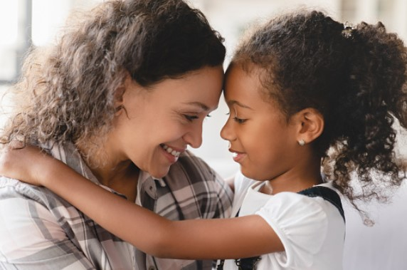
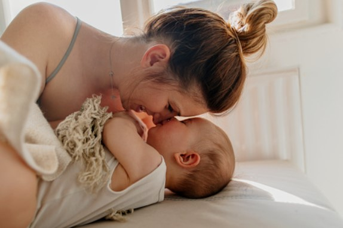

This article has been written and researched by our expert Loveable through a precise methodology. [Learn more about our methodology](https://avada.io/loveable/our-methodological.html)

[Loveable](https://avada.io/loveable/) > [Blog](https://avada.io/loveable/blog/) > [Parenting](https://avada.io/loveable/parenting/)

# Attachment Parenting and Things You Need to Know 

Written by [Benjamin Collins](https://avada.io/loveable/author/benjamin/) Last Updated on August 28, 2023

- [9 Principles of Attachment Parenting To Strengthen The Bond](https://avada.io/loveable/blog/attachment-parenting/#wp-block-heading-2-4) 
- [The Benefits of Attachment Parenting](https://avada.io/loveable/blog/attachment-parenting/#wp-block-heading-2-17) 
- [The Drawbacks and Criticism of Attachment Parenting](https://avada.io/loveable/blog/attachment-parenting/#wp-block-heading-2-20) 
- [Attachment Parenting FAQ](https://avada.io/loveable/blog/attachment-parenting/#wp-block-heading-2-23)
    - [1\. Is gentle parenting and attachment parenting the same?](https://avada.io/loveable/blog/attachment-parenting/#wp-block-heading-3-25)
    - [2\. What are the 4 attachment parenting styles?](https://avada.io/loveable/blog/attachment-parenting/#wp-block-heading-3-27)
    - [3\. Is attachment parenting worth it?](https://avada.io/loveable/blog/attachment-parenting/#wp-block-heading-3-29)
    - [4\. What is the downside of attachment parenting?](https://avada.io/loveable/blog/attachment-parenting/#wp-block-heading-3-31)
- [Bottom Line](https://avada.io/loveable/blog/attachment-parenting/#wp-block-heading-2-37)

Every parent wishes to connect with their children and form a strong relationship with them. But what if there was a method that not only prioritizes attachment but also provides a holistic approach to parenting? Enter “Attachment Parenting” – a concept that has garnered popularity and recognition for emphasizing the importance of establishing safe and healthy parent-child ties.

Begin a life-changing trip into the world of Attachment Parenting, a compelling technique that transforms the parent-child relationship. In this informative inquiry, we reveal the mysteries of this caring philosophy, leading you through its key ideas, advantages, and practices.

It’s known that parents always love their children and spend the best things for them. How about you? Have you found the best way to take care of them? Join us as we dig into the realm of **Attachment Parenting** and give you essential insights as well as practical ideas. Whether you’re a new parent or simply interested in alternative parenting methods, this book will inspire and empower you with the information you need to establish a meaningful and loving relationship with your kid.

## **9 Principles of Attachment Parenting To Strengthen The Bond** 

A parent-child link is a sacred connection that serves as the cornerstone for a child’s emotional well-being. These nine principles enable parents to provide their children with a caring and responsive environment:

1. Embrace the journey: Develop a positive perspective as you prepare emotionally and intellectually for pregnancy, delivery, and the challenges of parenthood.
2. Every feed carries love: Breastfeeding is seen as an effective method for establishing a stable attachment since it improves responsiveness and strengthens the emotional bond between parent and child.
3. Sensitivity is important: Recognize and respect your [child’s feelings](https://kidshelpline.com.au/parents/issues/helping-kids-identify-and-express-feelings#:~:text=Kids%20experience%20complex%20feelings%20just,about%20how%20they%20are%20feeling.), and see their expressions as significant communication. Respond with empathy and comprehension.
4. The power of touch: Engage in caring touch by allowing plenty of skin-to-skin contact and “baby-wearing,” which promotes intimacy and physical connection.
5. Bonding at night: Investigate choices for overnight parenting, including co-sleeping or sleeping near your kid, which will allow you to respond to their needs and give comfort.
6. Constant concern, limitless love: Strive to be there in your child’s life constantly, providing love, attention, and care while reducing time spent in daycare throughout their early years.
7. Positive discipline: Rather than turning to punishment, approach discipline with an emphasis on understanding and guiding, redirecting behavior, and working jointly to discover solutions.
8. Balance in all aspects: To avoid burnout, seek harmony in personal and family life by developing a support network, emphasizing self-care, and maintaining a healthy lifestyle.
9. Cultivate connection: Treasure the special tie you share with your kid and nurture it via quality time, open conversation, and shared experiences.

By adhering to these principles, parents may create a strong and long-lasting relationship with their children, establishing a sense of security, trust, and emotional well-being. Attachment Parenting is a holistic approach that recognizes the importance of connection and love in creating happy and resilient children.

## **The Benefits of Attachment Parenting** 

Attachment parenting increases emotional stability and trust in children by developing a strong parent-child link via responsive and caring interactions. This method promotes healthy brain development and improves the child’s capacity to create good connections later in life. Attachment parenting also promotes children’s empathy, emotional intelligence, and self-regulation abilities. Furthermore, research suggests that children raised with attachment parenting concepts may have better cognitive, social, and emotional results. 

## **The Drawbacks and Criticism of Attachment Parenting** 

One common critique is that the technique exerts much pressure on parents, which may lead to tiredness and burnout. Critics believe that a child’s capacity to acquire independence and self-soothing abilities may be hampered by the emphasis on continual physical closeness. Furthermore, some professionals reject the scientific evidence backing particular practices, including co-sleeping, and highlight safety concerns. 

## **Attachment Parenting FAQ**

### **1\. Is gentle parenting and attachment parenting the same?**

Gentle parenting and attachment parenting are related but not the same. Gentle parenting focuses on empathy, respect, and good disciplining methods. Attachment parenting emphasizes the development of a stable attachment through techniques such as babywearing and co-sleeping. While there may be some overlap, gentle parenting involves a larger set of concepts and tactics than attachment-based approaches.

### **2\. What are the 4 attachment parenting styles?**

Secure attachment, anxious-avoidant attachment, anxious-ambivalent attachment, and anxious-ambivalent attachment are the four basic attachment types. These attachment types illustrate the patterns of attachment that children have with their caregivers. 

### **3\. Is attachment parenting worth it?**

It depends! Attachment parenting, according to some parents, increases the link with their kid, creates a sense of security and trust, and improves the child’s emotional well-being. It can also aid in the development of a healthy brain and social skills. However, it necessitates a large investment of time, energy, and finances, and it may only be suitable for some families’ lifestyles or ideals. 

### **4\. What is the downside of attachment parenting?**

Attachment parenting has the potential disadvantage of placing more demands on parents in terms of time, energy, and personal space, which can be difficult to manage. Besides, it may deviate from societal norms and may generate criticism from individuals with alternative parenting styles.

**_See More:_**

- [Free-Range Parenting](https://avada.io/loveable/blog/free-range-parenting/) And All Things You Need To Know: Tips And Benefits 

- [Helicopter Parenting](https://avada.io/loveable/blog/helicopter-parenting/): Understanding the Pros, Cons, and Impact on Children

- Understanding [Different Parenting Styles](https://avada.io/loveable/different-parenting-styles/): Which One Is Right for You? – Expert Advice

## **Bottom Line**

**Attachment Parenting** is a different approach to parenting that emphasizes the development of a strong and emotional bond between caregivers and their children. Attachment Parenting fosters a loving atmosphere that supports healthy child development by emphasizing responsiveness, closeness, and trust. 

Parents may establish a supportive atmosphere that provides the framework for a solid attachment relationship by adopting the key ideas of Attachment Parenting and Things You Need to Know. Each family is unique, and striking a harmonic balance that corresponds with individual circumstances and ideals is critical to a satisfying and successful parenting experience.

- [9 Principles of Attachment Parenting To Strengthen The Bond](https://avada.io/loveable/blog/attachment-parenting/#wp-block-heading-2-4) 
- [The Benefits of Attachment Parenting](https://avada.io/loveable/blog/attachment-parenting/#wp-block-heading-2-17) 
- [The Drawbacks and Criticism of Attachment Parenting](https://avada.io/loveable/blog/attachment-parenting/#wp-block-heading-2-20) 
- [Attachment Parenting FAQ](https://avada.io/loveable/blog/attachment-parenting/#wp-block-heading-2-23)
    - [1\. Is gentle parenting and attachment parenting the same?](https://avada.io/loveable/blog/attachment-parenting/#wp-block-heading-3-25)
    - [2\. What are the 4 attachment parenting styles?](https://avada.io/loveable/blog/attachment-parenting/#wp-block-heading-3-27)
    - [3\. Is attachment parenting worth it?](https://avada.io/loveable/blog/attachment-parenting/#wp-block-heading-3-29)
    - [4\. What is the downside of attachment parenting?](https://avada.io/loveable/blog/attachment-parenting/#wp-block-heading-3-31)
- [Bottom Line](https://avada.io/loveable/blog/attachment-parenting/#wp-block-heading-2-37)

### [Benjamin Collins](https://avada.io/loveable/author/benjamin/)

I'm Benjamin Collins, a gift ideas creator at Loveable. We specialize in unique and personalized gifts for any occasion. With my honed skills, I recommend gifts tailored to the recipient's personality and interests, whether it's Halloween, Christmas, or any other celebration.

- [Twitter](https://twitter.com/intent/tweet)
- [Facebook](https://www.facebook.com/sharer/sharer.php)
- [instagram](https://avada.io/loveable/blog/attachment-parenting/)
- [pinterest](https://www.pinterest.com/loveablellc/)

## Related Posts

[

### 79 Heartfelt Missing Mom Quotes for Expressing Love and Longing

](https://avada.io/loveable/blog/missing-mom-quotes/)

[

### Parenting with Depression: Strategies for Coping, Seeking Help, and Building Resilience

](https://avada.io/loveable/blog/parenting-with-depression/)

[

### 100 Empowering Single Mom Quotes: Inspirational Words for Strong Mothers

](https://avada.io/loveable/blog/single-mom-quotes/)

[

### 99+ Heartfelt Quotes And Wishes: Happy Anniversary to Mom and Dad!

](https://avada.io/loveable/blog/quotes-happy-anniversary-mom-dad/)

[

### 5 Ways to Foster a Positive Parent-Teacher Relationship

](https://avada.io/loveable/blog/parent-teacher-relationship/)
