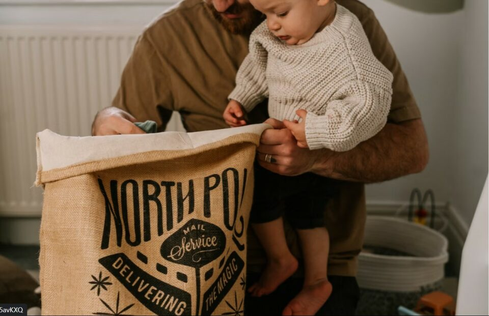

This article has been written and researched by our expert Loveable through a precise methodology. [Learn more about our methodology](https://avada.io/loveable/our-methodological.html)

[Loveable](https://avada.io/loveable/) > [Blog](https://avada.io/loveable/blog/) > [Parenting](https://avada.io/loveable/parenting/)

# Being a single dad: 10 Useful tips to make single dad’s life easier

Written by [Benjamin Collins](https://avada.io/loveable/author/benjamin/) Last Updated on August 28, 2023

- [10 Useful tips to make single dad’s life easier](https://avada.io/loveable/blog/being-a-single-dad/#wp-block-heading-2-3)
    - [Seek for support](https://avada.io/loveable/blog/being-a-single-dad/#wp-block-heading-3-4)
    - [Build a suitable work schedule](https://avada.io/loveable/blog/being-a-single-dad/#wp-block-heading-3-8)
    - [Get involved in family activities](https://avada.io/loveable/blog/being-a-single-dad/#wp-block-heading-3-12)
    - [Abstain from bad saying to ex](https://avada.io/loveable/blog/being-a-single-dad/#wp-block-heading-3-16)
    - [Add a female role model](https://avada.io/loveable/blog/being-a-single-dad/#wp-block-heading-3-20)
    - [Think about the future](https://avada.io/loveable/blog/being-a-single-dad/#wp-block-heading-3-23)
    - [Make time with your children](https://avada.io/loveable/blog/being-a-single-dad/#wp-block-heading-3-27)
    - [Pay attention to yourself](https://avada.io/loveable/blog/being-a-single-dad/#wp-block-heading-3-31)
    - [Manage your temper](https://avada.io/loveable/blog/being-a-single-dad/#wp-block-heading-3-35)
    - [Be open-minded with other opinions](https://avada.io/loveable/blog/being-a-single-dad/#wp-block-heading-3-39)
- [The Bottom Line](https://avada.io/loveable/blog/being-a-single-dad/#wp-block-heading-2-44)

One of the biggest challenges in life is learning how to be a good single father, but it can also be one of the most gratifying. Despite all the challenges, **being a single dad** can be hard at first, and then if you are guided thoroughly and know exactly what to do for a single dad, you may find it interesting and be more responsible with all choices in your life.

Fathers who are raised alone do, however, face a lot of hidden challenges. Single fathers will encounter curiosity and perhaps distrust because most single parents are women, which leads to this stereotype that men will never do this. It takes a lot of effort and dedication to be a single father and effectively raise a child on your own. Consequently, if you are a single father or are about to become one, here are 10 parenting tips for **being a single dad** to assist you smooth the road ahead and make your single dad’s life easier.

## 10 Useful tips to make single dad’s life easier

### Seek for support

Everyone when in need can offer support from others, and there is no assumption that a man, or a single dad must not seek help. Having the ideal support or assistance nearby might make all the difference because being a single father is demanding. If you have close, trustworthy friends or family members you can talk to, let those folks assist you as you proceed, is our first piece of advice for single parents. Watch out for parent groups or look for internet help from people in your situation.

If things are challenging, you might think about hiring a therapist. Parenting will be more straightforward and ultimately more effective for your child if you make sure you have the assistance and support you need. Never be embarrassed to ask for help, whether it is with food preparation or with babysitting responsibilities. And keep in mind that getting assistance is preferable to attempting to struggle on your own.

### Build a suitable work schedule

When being a single dad, you may find it quite difficult to juggle working full-time and being a great father. For your work, you should think about building the most suitable work plan so that you can control your time. By getting down with your manager and having an honest conversation about what you can contribute and what you are in need of assistance with, you can make things as simple for yourself as possible.

To help you achieve the balance you need, consider working flexible hours or perhaps performing some of your duties from home. It may be beneficial to schedule your vacation time to coincide with school break periods. And although financial support for your family is unavoidable, finding a balance between that as well as carving out time for them is crucial.

**_Related_**: 15 [First-Time Dad Tips](https://avada.io/loveable/first-time-dad-tips/) to Become a hands-on dad

### Get involved in family activities

Although you just bring up your child alone, it is also crucial to get involved in family activities weekly. Participating in family activities provides you the chance to meet other parents and allows your kid the chance to interact with kids of his or her own age. Furthermore, to combat solitude, it might be comforting to know that you can go out and engage in enjoyable activities with people.

You may not know how to search for these types of events or activities? Try to find out about future events by searching online on some educational or family websites, or by consulting your neighborhood’s newspapers, libraries, and schools, etc. You and your kids will both benefit from developing relationships with other local families, whether you attend a library arts and crafts morning or participate in a fall hayride.

### Abstain from bad saying to ex

Your relationship with your [ex](https://www.merriam-webster.com/dictionary/ex) will be one of the most crucial things that you have to pay your close attention to. Especially if you are still in touch with her, your kids will become confused and disturbed if they hear you speak poorly about their mother. And one of the finest ways that we suggest you is that you should keep your mouth shut and, whenever possible, speak with courtesy and respect.

Being a kid of a person with no partner is a unique and sensitive moment, and hearing you trash their mother can only make that situation worse. As a result, do not let your connection with your ex cause you to speak negatively about women in general. Only guys will learn from this to disrespect women, and only girls will learn that there is something fundamentally flawed about them. Therefore, instead of keep saying bad words about your ex, educate them better with your own story.

### Add a female role model

Positive male and female role models should be present in the lives of all youngsters. Giving your kids that balance can be challenging if you are a single father, but it can be a must-have thing when you raise your child alone.

There is no question that you can be an excellent role model for kids on your own, but including a robust female role model in the mix can assist in providing them with a more balanced perspective. As you did not and will never know what will happen in the future, just keep them safe by adding a female role model in your life. Keep positive, healthy relationships with godmothers, aunts, and grandmothers. Encourage and respect your children’s ongoing communication with their mother if they still do so.

### Think about the future

It may feel stressful to be a single father, but you will feel more in control of everything as it will seem much more manageable if you build your plans for the future. Consider your long-term financial and employment objectives, the educational needs of your kids, and even the location of where you want to settle down with them. Make some plans to get there once you have decided how your future will look, as you will not have time to worry about all of this when you are busy with work and your child.

Not merely the long term is meant by planning for the future. Consider your short- and medium-term plans as well. To stay organized and be ready for forthcoming travels, events, work deadlines, and tests, keep a daily or, at least, a weekly planner. In general, everything you do should be placed under a plan, which is also one of the most effective ways to save your unforgettable time with the baby.

### Make time with your children

It is simple to overlook the importance of just making time for play with your child when you are busy adapting to your new life as a single father. Remember that whatever you do, wherever you are, and how active you get, make all your free time with your children. They will cherish the memories of the fun moments you shared when they grew older and will recall precisely how you did to make them feel important and appreciated.

Making positive memories now will prepare them for a happy future. To read, play, or hear about their day, setting aside time every day will make them feel like they are under your great care and feel secure all the time. Schedule an excursion to the beach, a movie, or a game night every week, and do not budge. Make preparations to participate in some enjoyable things you both enjoy.

### Pay attention to yourself

You have to [take proper care of yourself](https://avada.io/loveable/how-to-love-yourself/) in order to be able to devote yourself to taking care of the requirements of your kids. And unlike an aircraft catastrophe, this issue is ongoing. You will need to manage yourself and devote yourself every day because this is a never-ending endeavor. So all you need to do is to get a sufficient amount of rest, eat well, and exercise frequently if you can.

The fact that you are raising your child alone, but it will never be the fact that you must spend all your time for the child and literally no time for yourself. It is crucial that you constantly take care of your sentimental, bodily, and spiritual health because if you start to stress out, it can quickly result in feelings of burnout. You won’t be upbeat, motivated, or resilient enough to finish the rest of your responsibilities until then. 

### Manage your temper

Frustration might result from balancing the abovementioned obligations while working to support oneself. Too frequently, we lash out at people who are closest to us. Typically, this refers to our own cherished families. Ironically, adults keep their mouths shut and thoughts to themselves while at work, but when we get home, we’ll vent to our kids. Remember that your professional experiences are unrelated to those of your children. Don’t use your kids as your therapists. 

If you notice that some situations make you angry, think about what might make you feel that way. It could be anything as simple as drinking too much coffee, having a particularly unpleasant ride home, or having a conflict with another person. Whatever the situation, if you are feeling nervous or sad, acknowledge this and refrain from letting your hormones dictate how you conduct around your kids. On the other hand, if they are going through a rough period, show compassion and take a break if necessary. 

### Be open-minded with other opinions

If the other parents continue to be involved in their lives, try to maintain a cordial relationship with them, even if it occasionally necessitates making compromises, as long as they are in the children’s best interests. No matter how you feel about the other parent, remember that the kids’ needs come before your disagreements and that they are also parents with children, so they will know exactly what to do.

The children may still remember the absent parent even though they are no longer physically there. For example, if they have moved away and stopped communicating with the kids. The children’s ages at the point, when the other parent left their lives, would be a major factor. If at all possible, they must have fond memories of the person. So be attentive to take great care of your child’s mental health as well. 

**_See More:_** Perfect [Ideas to Do for Being Single on Valentine’s Day](https://avada.io/loveable/blog/single-on-valentines-day/)

## The Bottom Line

**Being a single dad** is never an easy job, but putting additional effort into raising your children well will make your life simpler. The long-term cost of taking shortcuts and convenient pathways will be more significant for you and your children than the bother of doing things correctly from the start. So, if you start to feel a little worn out, angry, or melancholy, remember to think of the happiness and welfare of your kids. 

But in any case, if you find it hard to know what to do when **being a single dad**, repeat rereading the whole article, and you will understand our 10 valuable tips to make a single dad’s life easier. If you follow those helpful advice, you’ll be better able to make the right choices every time. 

- [10 Useful tips to make single dad’s life easier](https://avada.io/loveable/blog/being-a-single-dad/#wp-block-heading-2-3)
    - [Seek for support](https://avada.io/loveable/blog/being-a-single-dad/#wp-block-heading-3-4)
    - [Build a suitable work schedule](https://avada.io/loveable/blog/being-a-single-dad/#wp-block-heading-3-8)
    - [Get involved in family activities](https://avada.io/loveable/blog/being-a-single-dad/#wp-block-heading-3-12)
    - [Abstain from bad saying to ex](https://avada.io/loveable/blog/being-a-single-dad/#wp-block-heading-3-16)
    - [Add a female role model](https://avada.io/loveable/blog/being-a-single-dad/#wp-block-heading-3-20)
    - [Think about the future](https://avada.io/loveable/blog/being-a-single-dad/#wp-block-heading-3-23)
    - [Make time with your children](https://avada.io/loveable/blog/being-a-single-dad/#wp-block-heading-3-27)
    - [Pay attention to yourself](https://avada.io/loveable/blog/being-a-single-dad/#wp-block-heading-3-31)
    - [Manage your temper](https://avada.io/loveable/blog/being-a-single-dad/#wp-block-heading-3-35)
    - [Be open-minded with other opinions](https://avada.io/loveable/blog/being-a-single-dad/#wp-block-heading-3-39)
- [The Bottom Line](https://avada.io/loveable/blog/being-a-single-dad/#wp-block-heading-2-44)

### [Benjamin Collins](https://avada.io/loveable/author/benjamin/)

I'm Benjamin Collins, a gift ideas creator at Loveable. We specialize in unique and personalized gifts for any occasion. With my honed skills, I recommend gifts tailored to the recipient's personality and interests, whether it's Halloween, Christmas, or any other celebration.

- [Twitter](https://twitter.com/intent/tweet)
- [Facebook](https://www.facebook.com/sharer/sharer.php)
- [instagram](https://avada.io/loveable/blog/being-a-single-dad/)
- [pinterest](https://www.pinterest.com/loveablellc/)

## Related Posts

[

### 79 Heartfelt Missing Mom Quotes for Expressing Love and Longing

](https://avada.io/loveable/blog/missing-mom-quotes/)

[

### Parenting with Depression: Strategies for Coping, Seeking Help, and Building Resilience

](https://avada.io/loveable/blog/parenting-with-depression/)

[

### 100 Empowering Single Mom Quotes: Inspirational Words for Strong Mothers

](https://avada.io/loveable/blog/single-mom-quotes/)

[

### 99+ Heartfelt Quotes And Wishes: Happy Anniversary to Mom and Dad!

](https://avada.io/loveable/blog/quotes-happy-anniversary-mom-dad/)

[

### 5 Ways to Foster a Positive Parent-Teacher Relationship

](https://avada.io/loveable/blog/parent-teacher-relationship/)
