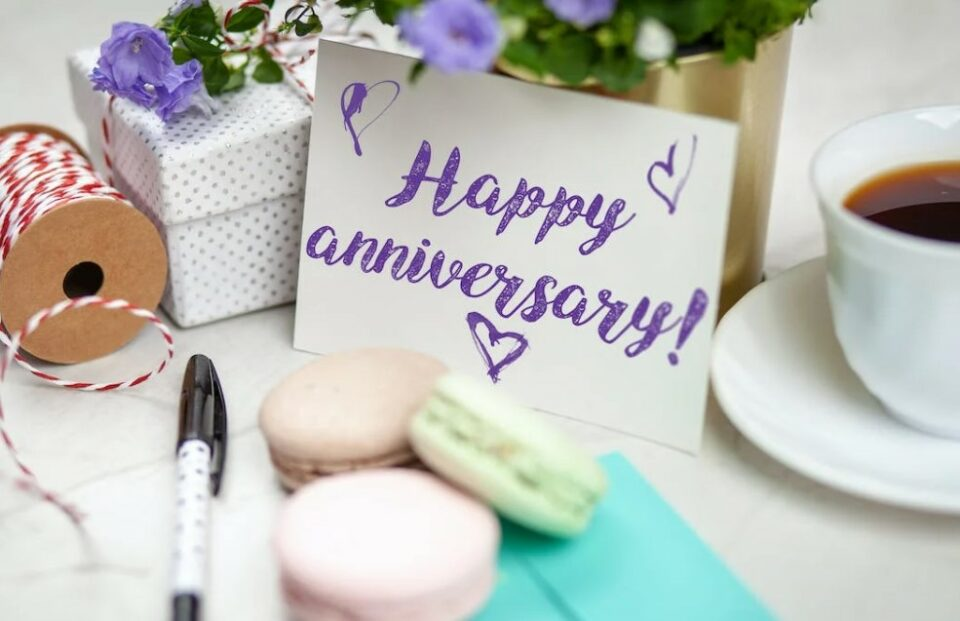
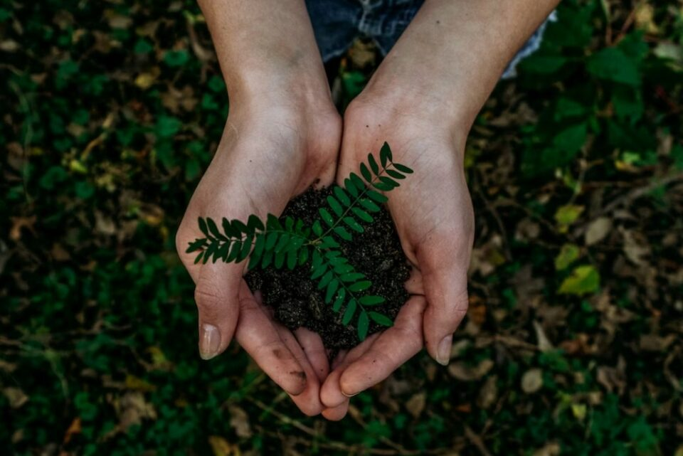
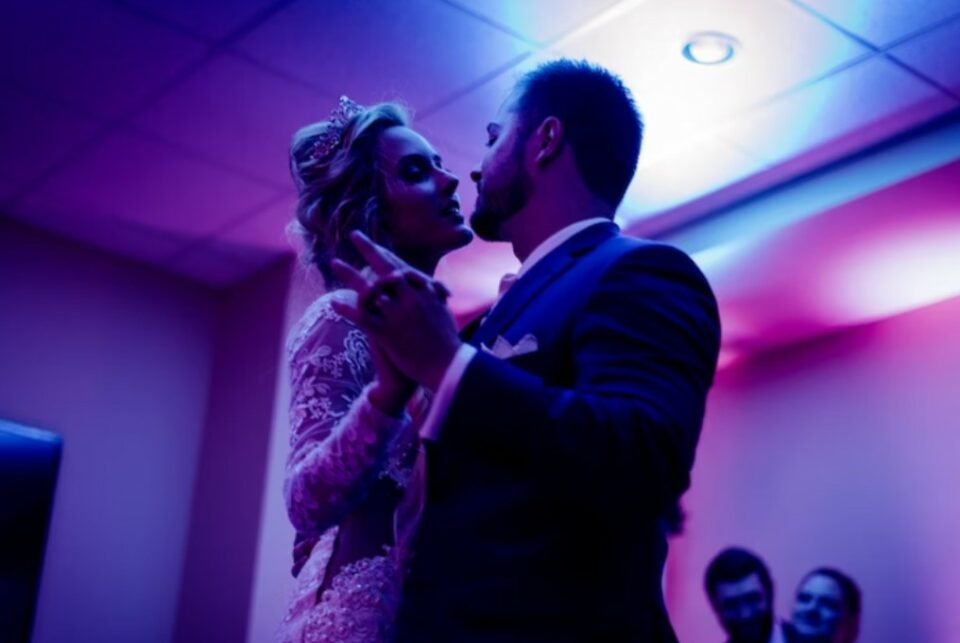
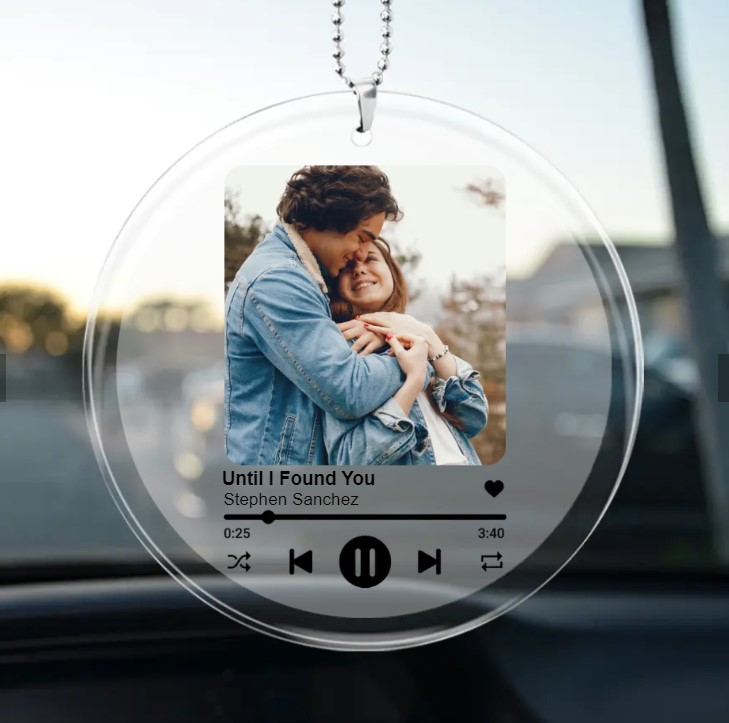
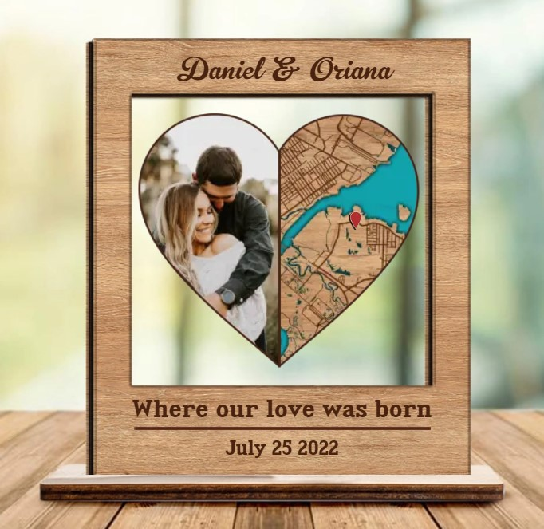
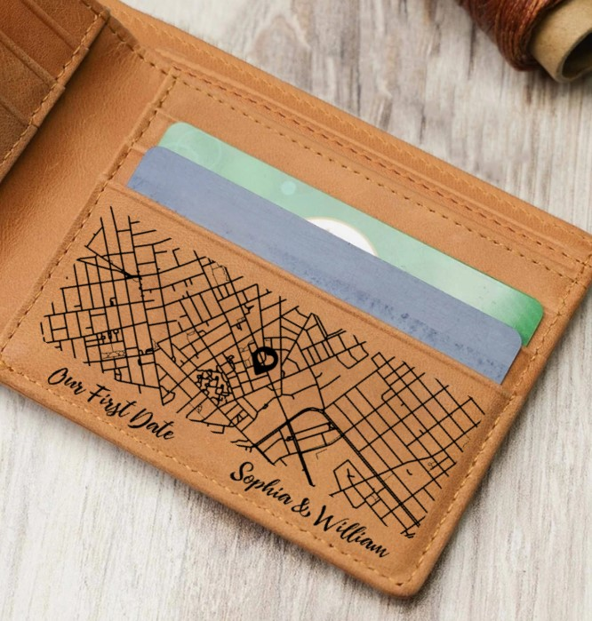
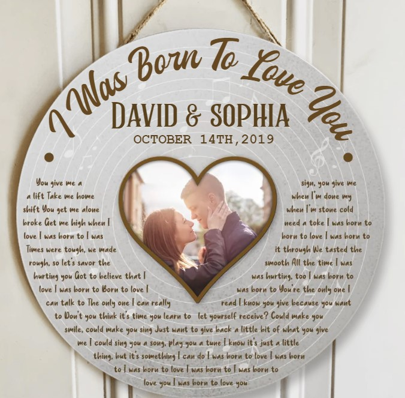

This article has been written and researched by our expert Loveable through a precise methodology. [Learn more about our methodology](https://avada.io/loveable/our-methodological.html)

[Loveable](https://avada.io/loveable/) > [Blog](https://avada.io/loveable/blog/) > [Relationship](https://avada.io/loveable/relationship/)

# Best 20 6-Month Anniversary Ideas For Couples To Toast The Relationship

Written by [Luna Miller](https://avada.io/loveable/author/luna/) Last Updated on October 03, 2023

- [How Important Is A 6-Month Anniversary?](https://avada.io/loveable/blog/6-month-anniversary-ideas/#wp-block-heading-2-3)
- [Best 6-Month Anniversary Ideas To Surprise Your Lover](https://avada.io/loveable/blog/6-month-anniversary-ideas/#wp-block-heading-2-7)
    - [Recreate Your First Date](https://avada.io/loveable/blog/6-month-anniversary-ideas/#wp-block-heading-3-8)
    - [Have a Six Course Dinner](https://avada.io/loveable/blog/6-month-anniversary-ideas/#wp-block-heading-3-11)
    - [Go to an Amusement Park](https://avada.io/loveable/blog/6-month-anniversary-ideas/#wp-block-heading-3-13)
    - [Spend a Day With Family](https://avada.io/loveable/blog/6-month-anniversary-ideas/#wp-block-heading-3-16)
    - [A Book of Love](https://avada.io/loveable/blog/6-month-anniversary-ideas/#wp-block-heading-3-18)
    - [Learn Something New Together](https://avada.io/loveable/blog/6-month-anniversary-ideas/#wp-block-heading-3-20)
    - [Six Dates in One Day](https://avada.io/loveable/blog/6-month-anniversary-ideas/#wp-block-heading-3-22)
    - [Buy Something Together](https://avada.io/loveable/blog/6-month-anniversary-ideas/#wp-block-heading-3-25)
    - [Self-Record a Six-Minute Video](https://avada.io/loveable/blog/6-month-anniversary-ideas/#wp-block-heading-3-27)
    - [Organize a Movie Watch-a-thon](https://avada.io/loveable/blog/6-month-anniversary-ideas/#wp-block-heading-3-29)
    - [Take Cute Anniversary Photos](https://avada.io/loveable/blog/6-month-anniversary-ideas/#wp-block-heading-3-31)
    - [Embark on a Romantic Scavenger Hunt](https://avada.io/loveable/blog/6-month-anniversary-ideas/#wp-block-heading-3-34)
    - [Plant a Seed Together](https://avada.io/loveable/blog/6-month-anniversary-ideas/#wp-block-heading-3-36)
    - [Organize an Outdoor Movie Projection](https://avada.io/loveable/blog/6-month-anniversary-ideas/#wp-block-heading-3-39)
    - [Go to the Aquarium](https://avada.io/loveable/blog/6-month-anniversary-ideas/#wp-block-heading-3-41)
    - [Spend the Night Getting to Know Each Other Better](https://avada.io/loveable/blog/6-month-anniversary-ideas/#wp-block-heading-3-44)
    - [Create a Customized Candy Bag](https://avada.io/loveable/blog/6-month-anniversary-ideas/#wp-block-heading-3-47)
    - [Attend A Couples Yoga Class](https://avada.io/loveable/blog/6-month-anniversary-ideas/#wp-block-heading-3-49)
    - [Make Them a Customized Music List](https://avada.io/loveable/blog/6-month-anniversary-ideas/#wp-block-heading-3-52)
    - [Enjoy a Night of Dancing](https://avada.io/loveable/blog/6-month-anniversary-ideas/#wp-block-heading-3-54)
- [Best 6-Month Anniversary Gifts to Celebrate the Special Occasion](https://avada.io/loveable/blog/6-month-anniversary-ideas/#wp-block-heading-2-57)
    - [Transparent Acrylic Car Ornament](https://avada.io/loveable/blog/6-month-anniversary-ideas/#wp-block-heading-3-58)
    - [Where We Met Map Photo Plaque](https://avada.io/loveable/blog/6-month-anniversary-ideas/#wp-block-heading-3-61)
    - [When We Met Map Leather Wallet](https://avada.io/loveable/blog/6-month-anniversary-ideas/#wp-block-heading-3-64)
    - [I Was Born To Love You Round Wooden Sign](https://avada.io/loveable/blog/6-month-anniversary-ideas/#wp-block-heading-3-67)
- [Bottom Line](https://avada.io/loveable/blog/6-month-anniversary-ideas/#wp-block-heading-2-70)

You’ve been dating or married to the love of your life for over half a year, and you’re still going strong. What wonderful news! The 6-month anniversary is not only an important milestone, but it’s also the first anniversary you’re celebrating together as a couple.

You’ve got a 6-month anniversary coming up, so let us help you prepare a romantic celebration. Here are some of our favorite **6-month anniversary ideas** to help show your love and show them you remembered their anniversary date.

## **How Important Is A 6-Month Anniversary?**

For many couples, the six-month anniversary is a significant milestone. The six-month milestone signifies that things are getting serious in a relationship. After the first six months, your bond has gotten stronger, and you are now ready to embark on the next stage.

When you’re married, the 6-month milestone shows your relationship has grown stronger, and your love is everlasting. It won’t be long until you’re celebrating your one-year anniversary! Check out our list of the best 6-month anniversary ideas below to give your other half a big surprise!

## **Best 6-Month Anniversary Ideas To Surprise Your Lover**

### **Recreate Your First Date**

Why not go back in time for your anniversary and reminisce about the good old days?  Recreate your first date in the place where it all began! Whether you’re a hopeless romantic or not, this 6-month anniversary idea is perfect for you. Spend the evening at the restaurant where you discovered your connection or just go for a walk in the park. You can keep your spark alive for years by returning to the places where you first fell in love. 

### **Have a Six Course Dinner**

During the six days leading up to your anniversary, take your significant other to a different restaurant each night. Remember to save the best for last. Choose each restaurant carefully based on its menu, atmosphere, and service. Make sure to take photos of every night to remember the special time you had together. On the last day, order the most special dishes on the menu and make the night truly special.

### **Go to an Amusement Park**

Getting tickets to a themed amusement park is a great six-month anniversary idea if you and your partner are among those adventurous couples that like excitement and adrenaline. Moreover, it will stay in your mind as one of the most enjoyable days of your relationship. Aren’t those the things that make your love so special?

### **Spend a Day With Family**

It is hard to think of anything more romantic than saying: “[I love you](https://avada.io/loveable/when-to-say-i-love-you/) and I want you to become a part of my life” with such a gesture. It’s likely that if you’re talking about a dating anniversary, you haven’t yet met each other’s parents, siblings, or best friends. This 6-month anniversary idea offers the perfect opportunity to do that. A wedding anniversary, on the other hand, implies that you all know each other very well. It would also be a great opportunity for both families to get together.

### **A Book of Love**

This is a perfect 6-month anniversary idea to preserve your relationship and cherish it for years to come. Keep your dates’ souvenirs and mementos together in a nicely crafted book. You can make it simple, but it will last you a lifetime together. In this way, you can look back at all the memories you’ve made and remind yourselves of how far you two have come. Also, you can add photos, notes, and even tickets from those special events.

### **Learn Something New Together**

As they say, couples that grow together stay together. You might consider taking a special class as a way to celebrate your anniversary while growing your knowledge along with your relationship. You and your partner can learn how to make cocktails, how to scale boulders, or even how to dance the tango or salsas. There’s something for every kind of couple out there, whether you’re artistic, athletic, or anything in between. When you have someone you love by your side, getting out of your comfort zone is so much easier.

### **Six Dates in One Day**

Organize different activities for your date based on their preferences – take your date to six different locations based on their preferences. It’s a great idea to schedule an evening to do this or go out for the day. This 6-month anniversary idea might be a bit overwhelming to combine six dates into the one-anniversary date, but it will be extra special.

### **Buy Something Together**

Every time you look at this piece, you’ll remember your six-month anniversary when you bought it together. It can be a painting, something from flea markets or thrift stores, or anything that both of you like. Then display it in a place where you can both appreciate it and be reminded of your time together.

### **Self-Record a Six-Minute Video**

What better way to express your love to your sweetheart than with words? Let them know just how much you appreciate them as a part of your life. It’s a six-minute video, but it’s a message your partner will cherish for a lifetime. Just make sure your words are sincere and genuine.

### **Organize a Movie Watch-a-thon**

Have you been looking for cozy and snug 6-month anniversary ideas? Put together a romantic movie watch-a-thon featuring all your favorite romantic flicks. Not a romance fan? Check out other genres instead. Whatever makes you both happy! Your Netflix and chill session will be extra good with it!

### **Take Cute Anniversary Photos**

The six-month anniversary is the perfect time to start an anniversary photoshoot tradition. Put on your favorite outfits, hire a professional photographer, and take some romantic anniversary photos. Share the photos with your family and friends on social media, or frame them and hang them in your home. Make sure to save the photos so you can look back on them in the years to come.

### **Embark on a Romantic Scavenger Hunt**

How about staging a romantic scavenger hunt with your partner, bringing them all over the city? Make sure to include meaningful locations and clues along the hunt. If your first kiss was in the park, leave a fresh flower and a handwritten note as a clue. Make a special surprise for your partner once they’ve reached the finish line, such as a romantic rowboat ride or a candlelit dinner for two.

### **Plant a Seed Together**

How about planting something together as a 6-month anniversary idea to mark the occasion? You could plant six trees or shrubs as a long-term reminder of your first six months together. You can also pick a special tree or shrub that has a special meaning to you both. Hopefully, you will be able to watch their bloom grow alongside your relationship.

### **Organize an Outdoor Movie Projection**

Take your partner to a movie projection instead of a regular cinema if you’re looking for ways to up your game. You can rent a projector and take them to a private place to watch your prepared film together. Make sure it is romantic—you don’t want to watch a horror or action film on such an occasion, right? You are even more likely to [cuddle up](https://avada.io/loveable/how-to-cuddle/) under warm blankets if your anniversary falls in the winter.

### **Go to the Aquarium**

The local aquarium makes a wonderful 6-month anniversary idea for couples who love everything underwater. The blue water and the undersea life make it a perfect date night spot. You’ll get to admire your significant other in dreamy lighting while they’re busy admiring all the wonders of the deep. It’s great to take some cute Instagram shots, too!

### **Spend the Night Getting to Know Each Other Better**

Plan a date night where you and your partner ask deep, personal questions to each other as an amazing anniversary present. There is only one purpose for these questions—to help you get to know each other better and learn something new about each other.

If If you are having trouble thinking of innovative and unique questions, you can prepare some before you begin. It is best to start with lighter, less serious questions to uncover a little bit about each other’s childhood, high school years, and so on. Once you are both relaxed, you can ask about your dreams, hopes, fears, and aspirations. A good way to round things off is with a question game, such as “Never have I ever”, “Would you rather”, or “Most likely to.” The more you open up to each other, the stronger your bond will be.

### **Create a Customized Candy Bag**

This is another awesome 6-month anniversary idea if you are a fan of creative gifts. Give your other half a customized candy bag of his or her favorite candy. Many stores offer handmade candy with your six-month anniversary date or name printed on it, as well as cakes with your picture on them. A customized keychain with your photos on it or a DIY anniversary card can add a special touch if you are on a budget.

### **Attend A Couples Yoga Class**

Would you like a relaxing 6-month anniversary idea? Couples yoga is an excellent way to build trust, understanding, and understanding within a relationship. Take a yoga class together for your anniversary and learn all the basics. After the class, you can unwind with a relaxing massage or take a sunset stroll afterward. Enjoy the sweet moment with your partner!

### **Make Them a Customized Music List**

A personalized music list is one of the best DIY gifts you can think of for your partner since they will think of you every time they hear these romantic love songs, even if you are miles apart. Naturally, you won’t just put random music here. Instead, choose songs that remind you of them, songs that send a message of love, and songs connected to special moments in your relationship. This will tell them more than words what you love about them.

### **Enjoy a Night of Dancing**

Do you want to show off your adorable partner and spend the night out on the town? Take your partner and go dancing together at a local club! It doesn’t matter whether you are an experienced dancer or not. The 6-month anniversary idea is great as long as you are together and prepared to shake things all night long. Visit a salsa club or a traditional nightclub to add some Latin flair to your anniversary. You can even record a duet while out on the town at a local karaoke bar.

## **[Best 6-Month Anniversary Gifts to Celebrate the Special Occasion](https://avada.io/loveable/6-month-anniversary-gifts/)**

### **Transparent Acrylic Car Ornament**

Your 6-month anniversary will be memorable if you give this [Transparent Acrylic Car Ornament](https://loveable.ai/products/custom-song-music-lovers-transparent-acrylic-car-ornament-gift-for-couple-anniversary-306ihpbnor638?variant=44581476794600), which beautifully captures your journey together. A beautiful ornament that serves as a tangible reminder of your time together. Customize it with a special song, making it a meaningful and heartfelt gift that symbolizes your enduring love. A present that will last forever.

### **Where We Met Map Photo Plaque**

With this [Where We Met Map Photo Plaque](https://loveable.ai/products/where-we-met-map-wooden-map-personalized-engagement-print-location-wall-art-custom-shape-wooden-plaque-engagement-gift-valentines-gift-engaged-married-map-212ihpnpwp586?variant=44193757593832), you can remind your partner of the places where you two met. The custom shape wooden plaque measures make a perfect size to display on any wall. It is a timeless keepsake to remind you of the place where your love story began.

### **When We Met Map Leather Wallet**

The [personalized map wallet](https://loveable.ai/products/where-we-met-personalized-map-couples-valentines-gift-custom-anniversary-gift-keepsake-for-him-leather-map-wallet-305ihpnplw588?variant=44525369393384) is a testament to your unique connection and will be cherished for years to come. The map wallet “When We Met 6 month Leather” is a visually appealing and functional gift to give. The wallet is designed to celebrate a special moment shared between two people. It’s a beautiful and meaningful way to show someone how much they mean to you. A perfect and unique [6-month anniversary gifts for him](https://avada.io/loveable/6-month-anniversary-gifts-for-him/).

### **I Was Born To Love You Round Wooden Sign**

Personalized with the words and music you choose, this [round wooden sign](https://loveable.ai/products/i-was-born-to-love-you-custom-lyrics-and-song-personalized-round-wooden-sign-best-anniversary-gifts-for-couple-husband-wife-parents-boyfriend-girlfriend-210ihplnrw377e) will be a wonderful keepsake for your significant other. It comes with a poem and song lyrics written on a wooden board and can be customized with a special message. This special gift is sure to bring a smile to your partner’s face and make the anniversary extra special.

## Bottom Line

When it comes to **6-month anniversary ideas**, remember not to overthink or overdo things. Keep it simple and romantic. Remember that the most expensive gifts are the ones that come straight from the heart. It is important to invest your time and feelings into finding the perfect anniversary gift or idea for someone you care about. Make sure to ask for their opinion and preferences. Also, don’t forget to appreciate the little moments and enjoy the time spent together.

- [How Important Is A 6-Month Anniversary?](https://avada.io/loveable/blog/6-month-anniversary-ideas/#wp-block-heading-2-3)
- [Best 6-Month Anniversary Ideas To Surprise Your Lover](https://avada.io/loveable/blog/6-month-anniversary-ideas/#wp-block-heading-2-7)
    - [Recreate Your First Date](https://avada.io/loveable/blog/6-month-anniversary-ideas/#wp-block-heading-3-8)
    - [Have a Six Course Dinner](https://avada.io/loveable/blog/6-month-anniversary-ideas/#wp-block-heading-3-11)
    - [Go to an Amusement Park](https://avada.io/loveable/blog/6-month-anniversary-ideas/#wp-block-heading-3-13)
    - [Spend a Day With Family](https://avada.io/loveable/blog/6-month-anniversary-ideas/#wp-block-heading-3-16)
    - [A Book of Love](https://avada.io/loveable/blog/6-month-anniversary-ideas/#wp-block-heading-3-18)
    - [Learn Something New Together](https://avada.io/loveable/blog/6-month-anniversary-ideas/#wp-block-heading-3-20)
    - [Six Dates in One Day](https://avada.io/loveable/blog/6-month-anniversary-ideas/#wp-block-heading-3-22)
    - [Buy Something Together](https://avada.io/loveable/blog/6-month-anniversary-ideas/#wp-block-heading-3-25)
    - [Self-Record a Six-Minute Video](https://avada.io/loveable/blog/6-month-anniversary-ideas/#wp-block-heading-3-27)
    - [Organize a Movie Watch-a-thon](https://avada.io/loveable/blog/6-month-anniversary-ideas/#wp-block-heading-3-29)
    - [Take Cute Anniversary Photos](https://avada.io/loveable/blog/6-month-anniversary-ideas/#wp-block-heading-3-31)
    - [Embark on a Romantic Scavenger Hunt](https://avada.io/loveable/blog/6-month-anniversary-ideas/#wp-block-heading-3-34)
    - [Plant a Seed Together](https://avada.io/loveable/blog/6-month-anniversary-ideas/#wp-block-heading-3-36)
    - [Organize an Outdoor Movie Projection](https://avada.io/loveable/blog/6-month-anniversary-ideas/#wp-block-heading-3-39)
    - [Go to the Aquarium](https://avada.io/loveable/blog/6-month-anniversary-ideas/#wp-block-heading-3-41)
    - [Spend the Night Getting to Know Each Other Better](https://avada.io/loveable/blog/6-month-anniversary-ideas/#wp-block-heading-3-44)
    - [Create a Customized Candy Bag](https://avada.io/loveable/blog/6-month-anniversary-ideas/#wp-block-heading-3-47)
    - [Attend A Couples Yoga Class](https://avada.io/loveable/blog/6-month-anniversary-ideas/#wp-block-heading-3-49)
    - [Make Them a Customized Music List](https://avada.io/loveable/blog/6-month-anniversary-ideas/#wp-block-heading-3-52)
    - [Enjoy a Night of Dancing](https://avada.io/loveable/blog/6-month-anniversary-ideas/#wp-block-heading-3-54)
- [Best 6-Month Anniversary Gifts to Celebrate the Special Occasion](https://avada.io/loveable/blog/6-month-anniversary-ideas/#wp-block-heading-2-57)
    - [Transparent Acrylic Car Ornament](https://avada.io/loveable/blog/6-month-anniversary-ideas/#wp-block-heading-3-58)
    - [Where We Met Map Photo Plaque](https://avada.io/loveable/blog/6-month-anniversary-ideas/#wp-block-heading-3-61)
    - [When We Met Map Leather Wallet](https://avada.io/loveable/blog/6-month-anniversary-ideas/#wp-block-heading-3-64)
    - [I Was Born To Love You Round Wooden Sign](https://avada.io/loveable/blog/6-month-anniversary-ideas/#wp-block-heading-3-67)
- [Bottom Line](https://avada.io/loveable/blog/6-month-anniversary-ideas/#wp-block-heading-2-70)

### [Luna Miller](https://avada.io/loveable/author/luna/)

I'm Luna Miller, a helpful employee at Loveable. I excel at giving great advice on birthday gifts. I love suggesting memorable experiences like concerts, spas, and getaways. As a reliable and supportive colleague, I'm always there to assist.

- [Twitter](https://twitter.com/intent/tweet)
- [Facebook](https://www.facebook.com/sharer/sharer.php)
- [instagram](https://avada.io/loveable/blog/6-month-anniversary-ideas/)
- [pinterest](https://www.pinterest.com/loveablellc/)

## Related Posts

[

### 35 Unforgettable Exciting Adult Birthday Party Ideas

](https://avada.io/loveable/blog/adult-birthday-party-ideas/)

[

### 42 Best 21st Birthday Outfits to Rock the Party

](https://avada.io/loveable/blog/21st-birthday-outfits/)

[

### 50+ Happy 40th Anniversary Quotes, Messages, and Wishes

](https://avada.io/loveable/blog/happy-40th-anniversary-quotes/)

[

### 100+ Heartwarming Happy 30th Anniversary Quotes, Messages, and Wishes

](https://avada.io/loveable/blog/happy-30th-anniversary-quotes/)

[

### 120+ Heartfelt Thank You Messages for The Birthday Wishes

](https://avada.io/loveable/blog/thank-you-messages-birthday-wishes/)
