This article has been written and researched by our expert Loveable through a precise methodology. [Learn more about our methodology](https://avada.io/loveable/our-methodological.html)

[Loveable](https://avada.io/loveable/) > [Blog](https://avada.io/loveable/blog/) > [Holiday](https://avada.io/loveable/holiday/)

# Best 25 Halloween Painted Rock Ideas to Inspire Your Spooky Decor in 2023

Written by [Blake Simpson](https://avada.io/loveable/author/blake/) Last Updated on August 25, 2023

- [Halloween Painted Rocks -Things To Prepare](https://avada.io/loveable/blog/halloween-painted-rock-ideas/#wp-block-heading-2-4) 
- [How To Paint Halloween Rocks?](https://avada.io/loveable/blog/halloween-painted-rock-ideas/#wp-block-heading-2-14)
- [25 Halloween Painted Rocks Ideas For All Ages](https://avada.io/loveable/blog/halloween-painted-rock-ideas/#wp-block-heading-2-24) 
    - [1\. Branded Halloween cocktail Painted Rocks](https://avada.io/loveable/blog/halloween-painted-rock-ideas/#wp-block-heading-3-26)
    - [2\. Among The Graves Halloween Painted Rocks](https://avada.io/loveable/blog/halloween-painted-rock-ideas/#wp-block-heading-3-29)
    - [3\. Halloween Painted Rocks Suited and Booted](https://avada.io/loveable/blog/halloween-painted-rock-ideas/#wp-block-heading-3-32)
    - [4\. Festival Midnight Halloween Painted Rocks](https://avada.io/loveable/blog/halloween-painted-rock-ideas/#wp-block-heading-3-36)
    - [5\. Pumpkin Halloween Painted Rocks](https://avada.io/loveable/blog/halloween-painted-rock-ideas/#wp-block-heading-3-40)
    - [6\. Trick or treat Halloween Painted Rocks](https://avada.io/loveable/blog/halloween-painted-rock-ideas/#wp-block-heading-3-44)
    - [7\. Halloween Painted Rocks Spooky Spider](https://avada.io/loveable/blog/halloween-painted-rock-ideas/#wp-block-heading-3-47) 
    - [8\. Dracula Painted Rocks Ideas](https://avada.io/loveable/blog/halloween-painted-rock-ideas/#wp-block-heading-3-50) 
    - [9\. Spooky Cat Painted Rocks Ideas](https://avada.io/loveable/blog/halloween-painted-rock-ideas/#wp-block-heading-3-55)
    - [10\. Ghost and Pumpkin Painted Rocks Ideas](https://avada.io/loveable/blog/halloween-painted-rock-ideas/#wp-block-heading-3-58)
    - [11\. Halloween Painted Rocks Mummy](https://avada.io/loveable/blog/halloween-painted-rock-ideas/#wp-block-heading-3-61)
    - [12\. Halloween Painted Rocks Colorful Ghost](https://avada.io/loveable/blog/halloween-painted-rock-ideas/#wp-block-heading-3-64) 
    - [13\. The Scream Halloween Painted Rocks](https://avada.io/loveable/blog/halloween-painted-rock-ideas/#wp-block-heading-3-67)
    - [14\. Kitten And Spider Halloween Painted Rocks Idea](https://avada.io/loveable/blog/halloween-painted-rock-ideas/#wp-block-heading-3-69)
    - [15\. Halloween Painted Rocks Idea](https://avada.io/loveable/blog/halloween-painted-rock-ideas/#wp-block-heading-3-72)
    - [16\. Spooky Pumpkin Painted Rocks Idea](https://avada.io/loveable/blog/halloween-painted-rock-ideas/#wp-block-heading-3-75)
    - [17\. Candy Corn Halloween Painted Rock](https://avada.io/loveable/blog/halloween-painted-rock-ideas/#wp-block-heading-3-77) 
    - [18\. Frankenstein Halloween Painted Rock](https://avada.io/loveable/blog/halloween-painted-rock-ideas/#wp-block-heading-3-81) 
    - [19\. Bat Painted Rock](https://avada.io/loveable/blog/halloween-painted-rock-ideas/#wp-block-heading-3-86)
    - [20\. Pumpkin And Dog Halloween Painted Rock](https://avada.io/loveable/blog/halloween-painted-rock-ideas/#wp-block-heading-3-91) 
    - [21\. Cute Halloween Painted Rock](https://avada.io/loveable/blog/halloween-painted-rock-ideas/#wp-block-heading-3-94) 
    - [22\. Bottle Of Boo’s Painted Stone](https://avada.io/loveable/blog/halloween-painted-rock-ideas/#wp-block-heading-3-97)
    - [23\. Easy Halloween Painted Rocks](https://avada.io/loveable/blog/halloween-painted-rock-ideas/#wp-block-heading-3-100)
    - [24\. Witch Theme Rock Painting](https://avada.io/loveable/blog/halloween-painted-rock-ideas/#wp-block-heading-3-103)
    - [25\. Halloween Black Cat Painted Pebbles](https://avada.io/loveable/blog/halloween-painted-rock-ideas/#wp-block-heading-3-106)
- [Bottom line](https://avada.io/loveable/blog/halloween-painted-rock-ideas/#wp-block-heading-2-109)

Are you ready to get into the spirit of Halloween with a touch of creativity? Look no further than the fascinating world of **Halloween Painted Rock!** These artistic masterpieces have taken the crafting community by storm, captivating both young and old with their mesmerizing designs. But what exactly are Halloween Painted Rocks and how can you join in on the fun? Let’s explore this enchanting art form together.

In a nutshell, Halloween Painted Rocks are ordinary rocks transformed into whimsical works of art, featuring spooky themes, iconic Halloween symbols, and vibrant colors. From friendly ghosts to wicked witches, these hand-painted rocks serve as delightful decorations or hidden treasures waiting to be discovered. With just a few brushstrokes and a splash of imagination, you can create your own little pieces of Halloween magic.

In the midst of all the spooky fun, Loveable brings you an enchanting selection of Halloween gifts that will make your heart feel cozy in the midst of the eerie ambiance. Our Halloween Gifts Collection is packed with delightful treats and charming surprises that will leave you grinning from ear to ear. Get ready to be spellbound by Loveable’s [Halloween Gifts Collection](https://avada.io/loveable/halloween/) and witness the magic of the season unravel right before your eyes.

## **Halloween Painted Rocks -Things To Prepare** 

To embark on your Halloween rock painting adventure, here’s a list of materials you’ll need:

- **Smooth Rocks:** Gather a collection of smooth rocks in various sizes and shapes. These will serve as your canvas for painting.
- **Acrylic Paint**: Acrylic paint is ideal for rock painting due to its vibrant colors and durability. Get a selection of Halloween-themed colors like black, orange, green, purple, and white.
- **Paintbrushes:** Have an assortment of paintbrushes with different sizes and shapes. This will allow you to create fine details as well as broader strokes.
- **Water and Palette:** Keep a cup of water handy for rinsing your brushes between colors. Use a palette or a disposable plate to mix and blend your paints.
- **Pencil and Eraser:** Use a pencil to lightly sketch out your design on the rocks before painting. You can easily erase any mistakes or guidelines.
- **Sealant (Optional)**: If you want to protect your painted rocks from the elements and make them more durable, consider using a clear acrylic sealant.
- **Paper Towels or Cloths:** Keep paper towels or cloth nearby to blot excess paint, clean your brushes, and tidy up any spills.
- **Inspiration and Imagination 😉:** Gather inspiration from Halloween-themed images, patterns, or ideas. Let your [Imagination run wild](https://avada.io/loveable/gifts-for-art-lovers/) as you come up with your own unique designs.

## **How To Paint Halloween Rocks?**

Prepare the Rocks: Start by selecting smooth rocks of various shapes and sizes. Clean them thoroughly with water and let them dry completely before painting.

1. **Design Planning:** Consider the Halloween-themed designs you want to paint on your rocks. You can draw inspiration from pumpkins, ghosts, witches, bats, spiders, or any other spooky elements.

1. **Base Coat:** Apply a base coat of paint to your rock using a paintbrush. Black, orange, green, or purple are popular Halloween colors. Allow the base coat to dry before proceeding.

1. **Sketch the Design:** Lightly sketch your chosen design on the rock using a pencil. This helps to create a guideline and ensure accuracy in your painting.

1. **Paint the Design:** Using acrylic paint and a finer paintbrush, carefully paint the details of your design. Start with the larger areas and gradually add smaller elements. Allow each color to dry before applying the next one.

1. **Add Details:** Once the base colors are dry, add details such as eyes, mouths, facial features, or any other intricate elements. Use a smaller brush or even toothpicks for finer details.

1. **Let it Dry:** Allow the paint to dry completely before handling or adding additional layers. This ensures that the colors don’t smudge or blend.

1. **Optional:** Seal the Rocks: If you want to protect your painted rocks, you can apply a clear acrylic sealant once the paint is fully dry. This helps to preserve the colors and make the rocks more durable.

1. **Display and Enjoy:** Once your Halloween rocks are completely dry, you can display them in your home or garden or give them as unique gifts. Arrange them creatively to enhance the spooky atmosphere of Halloween.

## **25 Halloween Painted Rocks Ideas For All Ages** 

Below are some ideas we have gathered from talented artists like [Artistro](https://artistro.com/blogs/news/halloween-story-stones), [Freshpatio](https://freshpatio.com/halloween-rock-painting-ideas/), and other fantastic ideas shared by Pinterest users. These ideas are quite intriguing, and relatively easy for you to create your own whimsical decorative rocks for Halloween 2023.

### **1\. Branded Halloween cocktail Painted Rocks**

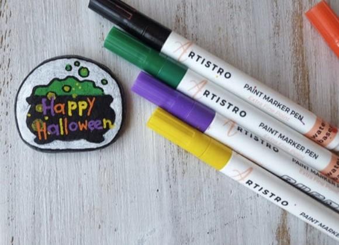

If you’re unsure about which festive [Halloween cocktail](https://avada.io/loveable/blog/halloween-drinks/) to serve, why not hone your bartending skills by painting some stones? Get creative and prepare this enchanting witch brew that is sure to delight your guests!

### **2\. Among The Graves Halloween Painted Rocks**

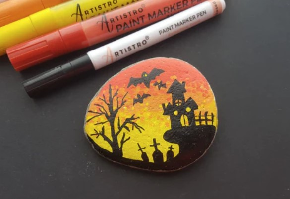

What Halloween celebration would be complete without a touch of macabre? Embrace the spine-chilling ambiance by incorporating a grave theme into your stone painting. Capture the haunting beauty of an evening cemetery adorned with tombstones and a swarm of bats. These eerie motifs will add a precious and chilling touch to your designs, ensuring a memorable Halloween experience.

### **3\. Halloween Painted Rocks Suited and Booted**

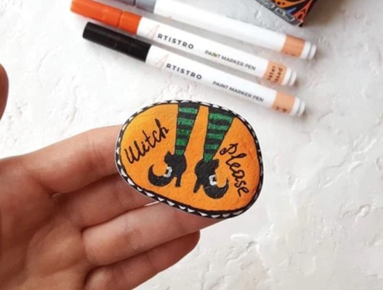

Make your Halloween celebration not only fun but also stylish! Elevate your spooky festival costume with the addition of stylish witch shoes inspired by the exceptional rock artist from Artistro. 

These bewitching footwear creations will add a touch of enchantment to your Halloween ensemble, ensuring you stand out from the crowd. Get ready to cast a spell of style with these fashionable witch shoes, crafted with the utmost creativity and finesse by Artistro’s talented rock artist.

### **4\. Festival Midnight Halloween Painted Rocks**

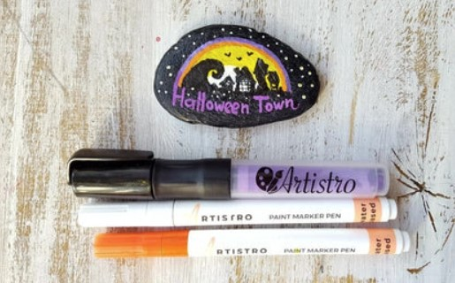

Immerse yourself in the magical ambiance of Halloween by crafting special stones that embody the true spirit of the holiday. Create a captivating Gothic atmosphere with a black background and dark silhouettes of buildings. 

These intricately designed stones will flawlessly capture the essence of Halloween night, bringing its enchanting spirit to life. Let your creativity flow as you paint these stones, infusing them with the haunting allure that perfectly embodies the essence of this beloved holiday.

### **5\. Pumpkin Halloween Painted Rocks**

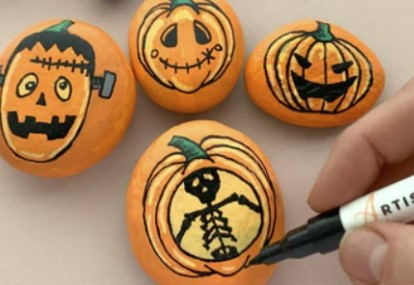

When it comes to Halloween, nothing beats a collection of captivating and creepy pumpkin monsters for your [rock painting projects](https://avada.io/loveable/blog/halloween-painted-rock-ideas/). Kickstart your creativity by bringing iconic characters like Frankenstein’s monster, a skeleton, and phantom pumpkins to life, just like the picture above.

Then, let your Imagination run wild as you expand the collection with your own unique and painted Halloween rocks. Get ready to unleash the spookiness and create a chillingly delightful assortment of pumpkin monsters that will leave everyone bewitched.

### **6\. Trick or treat Halloween Painted Rocks**

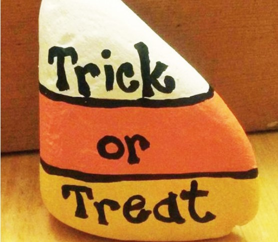

No Halloween is complete without the iconic candy corn and a cheerful “Trick or Treat” sign. While we often see wooden plaques and scarecrows displaying these signs, why not switch things up this year? Give your doorstep or front yard a unique touch by creating a candy corn rock painting sign.

### **7\. Halloween Painted Rocks Spooky Spider** 

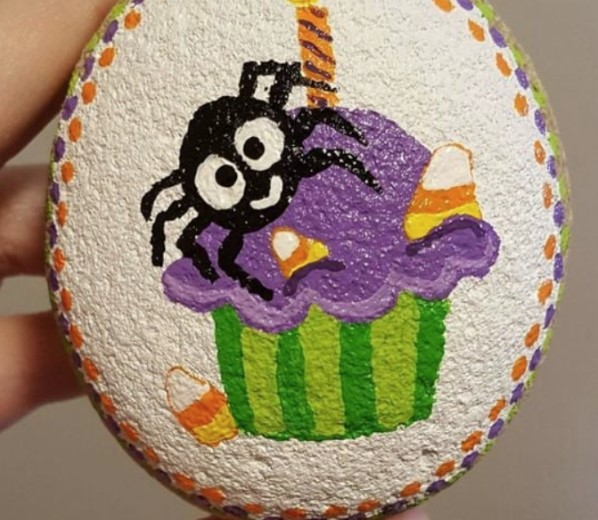

In this adorable rock painting, you’ll find a small spider and some candy corn delicately portrayed on what looks like the top of a cupcake. The round pebble serves as the perfect canvas, giving the painting a fascinating twist that transforms the otherwise simple design into something captivating and unique.

### **8\. Dracula Painted Rocks Ideas** 

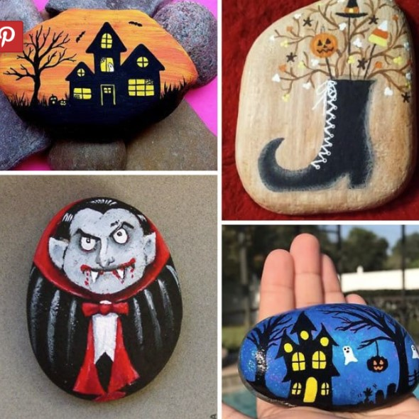

Rock painting offers an excellent outlet for expressing your creative freedom, as showcased in the collage above. It highlights two different renditions of eerie houses, one against a blue background and the other against an orange backdrop.

The depiction of a witch’s boot is undeniably adorable, adding a touch of charm to the collection.

However, the crazy vampire with blood-stained fangs and a pot belly, taking advantage of the pebble’s natural shape, brings a dash of quirkiness to the mix.

### **9\. Spooky Cat Painted Rocks Ideas**

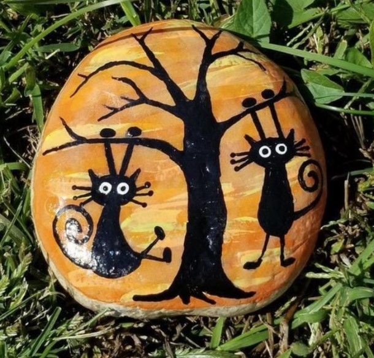

These two delightfully spooky cats, barely clinging to tree branches, bring a smile to our faces. The exaggeratedly elongated whiskers, the curled-up tails, and the gracefully depicted feet beautifully capture the fear these cats must be experiencing.

### **10\. Ghost and Pumpkin Painted Rocks Ideas**

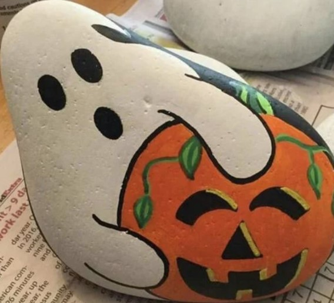

Children adore silly faces, and they’ll absolutely enjoy painting these amusing rocks. These goofy pebble characters sports expressions as if they’ve encountered a ghost and are on the verge of fainting. It’s a fantastic way to make use of the unique shapes of the pebbles and create something entertaining.

### **11\. Halloween Painted Rocks Mummy**

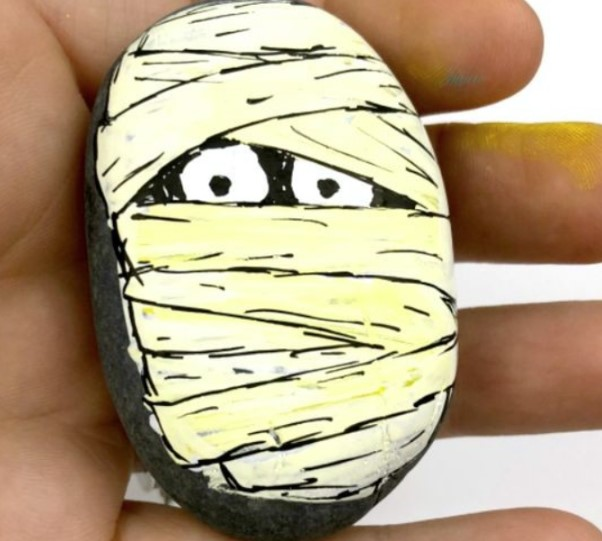

These mummy pebbles with popping plastic eyes are a wonderful and easy Halloween decoration idea. They add a touch of adorable craziness rather than being outright creepy, offering a unique twist on the traditional mummy props. It’s a creative and charming way to add some festive spirit to your [Halloween decor.](https://avada.io/loveable/blog/halloween-decoration-ideas/)

### **12\. Halloween Painted Rocks Colorful Ghost** 

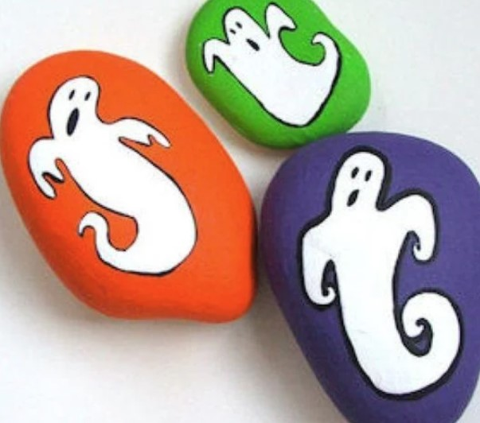

Meet this lively group of ghost pals, eagerly practicing their most frightening ghost faces before Halloween arrives. What’s particularly delightful is that each ghost has its own distinctive background color, which adds a vibrant touch to the Halloween spirit. It’s a charming way to infuse some colorful fun into the spooky season.

### **13\. The Scream Halloween Painted Rocks**

It seems that the Grim Reaper from “The Grim Adventures of Billy & Mandy” has made an appearance at the Halloween party! In our opinion, there’s no other cartoon character that could serve as a better Halloween prop than Grim. This oversized painted rock would make a fantastic addition when placed by a front door, adding a touch of spooky charm to the festivities.

### **14\. Kitten And Spider Halloween Painted Rocks Idea**

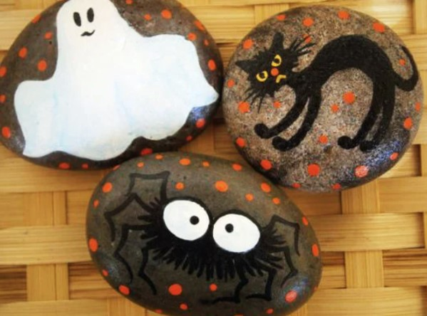

A hair-raising tarantula with its creepy fur and large eyes, along with a mischievous ghost, seems to be on a mission to frighten a little kitten who appears ready to bolt. We can’t blame the kitten for wanting to escape, as encountering these two would surely give anyone a good scare.

### **15\. Halloween Painted Rocks Idea**

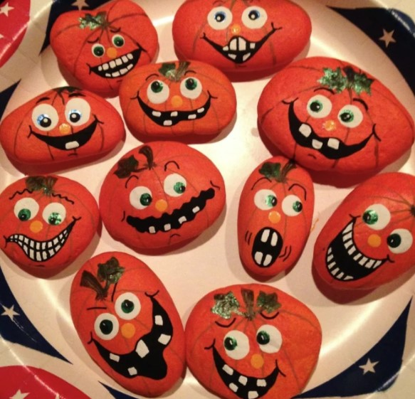

The face of this scarecrow is undeniably giving us goosebumps. We can’t help but appreciate the intricate details, from the carefully crafted folds of the hat to the meticulously stitched lines running down the face. The stitched-up mouth and the partially hooded eyes add an eerie touch, creating an illusion that they are constantly watching our every move.

### **16\. Spooky Pumpkin Painted Rocks Idea**

Trick or treat, smell my feet, and give me something good to eat! But wait, don’t be fooled! What appear to be cookies on a plate are actually cleverly painted pumpkin rocks. Here’s a fun little trick you can play on your [family on Halloween](https://avada.io/loveable/halloween-family-costumes/), surprising them with these delightful pumpkin rock paintings instead of edible treats.

### **17\. Candy Corn Halloween Painted Rock** 

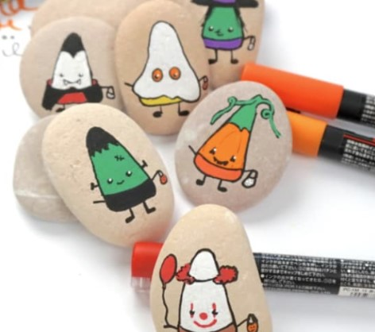

The candy corn rock stole the show and became everyone’s favorite. When it comes to painting a large number of rocks for a season, it’s always great to have quick and easy designs. And that’s exactly what these candy corn rocks offer! With their simplicity, you can effortlessly create a bunch of these delightful trick-or-treating rocks in just one afternoon. 

From classic costumes to a whimsical Pennywise-inspired clown, there are plenty of designs to choose from. Who knows, you might even find yourself inspired to come up with a few more unique designs of your own!

### **18\. Frankenstein Halloween Painted Rock** 

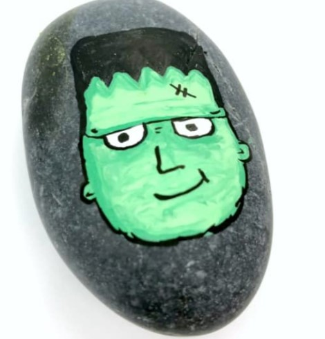

**Creating a Frankenstein’s Monster painted rock.**

In the first step, you will start by painting the rock with a base coat of green acrylic paint. This will serve as the foundation for the monster’s skin color. Then, using black paint, you will add the iconic stitches across the face, giving the rock a distinct Frankenstein’s Monster look.

In the second step, you will focus on the details. This involves painting the eyes white and adding a black pupil in each one. Next, you will create the eyebrows, nose, and mouth using black paint. To complete the rock, you can add additional details like shading, highlights, and texture as desired.

### **19\. Bat Painted Rock**

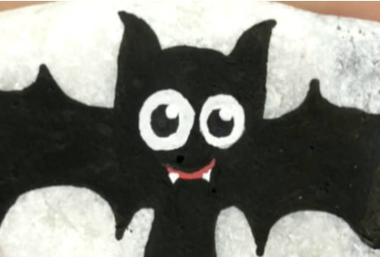

This adorable bat is a prominent symbol of the Halloween holiday.

In the first step, you will paint the rocks with a black base coat, ensuring a solid foundation for the bats.

Next, you will use white paint to add the details of the bat’s wings, body, and facial features, following the provided instructions to achieve an adorable and spooky final result.

### **20\. Pumpkin And Dog Halloween Painted Rock** 

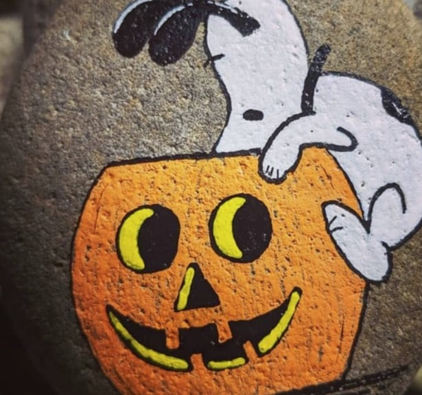

Transform a rock into a Halloween decoration with this delightful Snoopy painting idea! It brings a perfect blend of cuteness and humor while capturing the eerie essence of the night. With this creation, you can warmly welcome the youngest trick-or-treaters without overwhelming them with fright.

### **21\. Cute Halloween Painted Rock** 

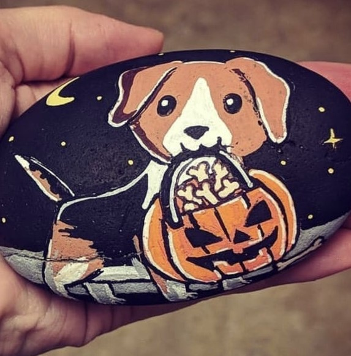

Halloween revolves around frightful creatures and monsters, but that doesn’t mean your home can’t embrace something unique. Consider a non-monstrous decoration like this delightful puppy rock painting. Its charm is undeniable, making it an ideal small-scale decoration and artistic endeavor for this autumn season!

### **22\. Bottle Of Boo’s Painted Stone**

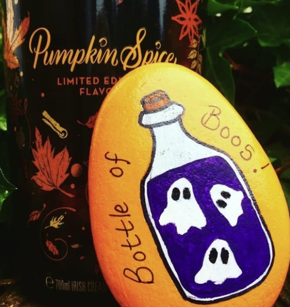

If you’ve been painting rocks for quite some time, you might be seeking new inspiration! As Halloween approaches, this uncomplicated yet festive design is an excellent choice. It doesn’t have to revolve solely around Jack o’Lanterns, mummies, ghosts, and other eerie creatures. It can be something refreshingly distinct, such as this bottle of boos. Its cool and innovative concept perfectly complements your artistic prowess!

### **23\. Easy Halloween Painted Rocks**

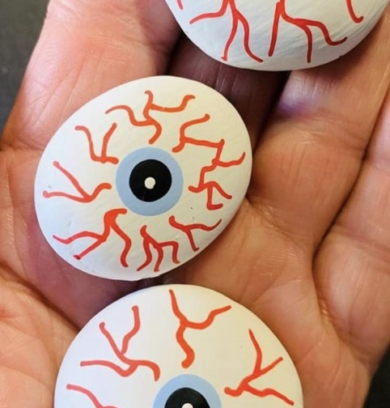

In search of a fresh rock painting idea? Your quest ends here! And guess what? They’re all Halloween-perfect. These designs make ideal decorations for your home’s interior, yard, and porch. Moreover, these delightful little eyeballs are an excellent choice to create with the kids, adding a fun and playful touch to your artistic endeavors!

### **24\. Witch Theme Rock Painting**

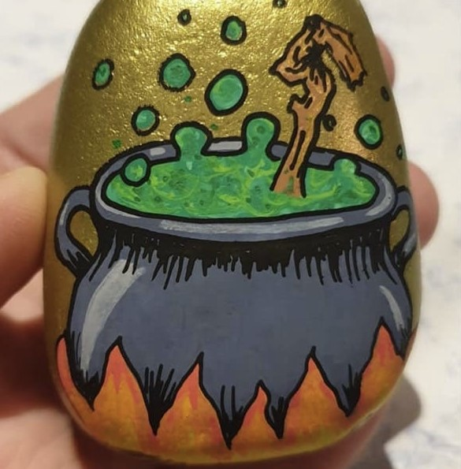

Double, double, toil and trouble; Fire burn and cauldron bubble…” What is a witch without her potions and cauldron? Embrace your good inner witch this year and infuse your home with a bewitching atmosphere through this Halloween rock painting. With just a few supplies, you can transform a simple rock into a work of art. Consider it the enchanting recipe to add a touch of witchy charm to your surroundings!

### **25\. Halloween Black Cat Painted Pebbles**

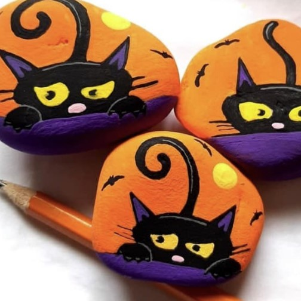

Is it true that a black cat can bring fortune? Well, if you happen to be a witch, maybe! Just kidding! But it’s interesting how black cats have an affinity for witches, as history amusingly suggests. That’s precisely why they make such fitting decorations for Halloween, don’t you agree? However, if purchasing a black cat statue isn’t on your agenda, painted rocks are a fantastic alternative. Take a peek at these rock paintings for a dose of inspiration!

## **Bottom line**

“Hauntingly Beautiful: 35 Halloween Painted Rock Ideas to Inspire Your Spooky Decor” presents a captivating collection of creative inspiration. From eerie creatures to enchanting symbols, these **painted rock ideas** offer a wealth of possibilities to elevate your Halloween decorations.

Let your imagination run wild as you draw inspiration from these hauntingly beautiful designs, adding a touch of spookiness and artistry to your festive ambiance. Embrace the spirit of Halloween and transform ordinary rocks into extraordinary works of eerie art with these delightful ideas. Get ready to inspire and bewitch with your uniquely crafted spooky decor!

- [Halloween Painted Rocks -Things To Prepare](https://avada.io/loveable/blog/halloween-painted-rock-ideas/#wp-block-heading-2-4) 
- [How To Paint Halloween Rocks?](https://avada.io/loveable/blog/halloween-painted-rock-ideas/#wp-block-heading-2-14)
- [25 Halloween Painted Rocks Ideas For All Ages](https://avada.io/loveable/blog/halloween-painted-rock-ideas/#wp-block-heading-2-24) 
    - [1\. Branded Halloween cocktail Painted Rocks](https://avada.io/loveable/blog/halloween-painted-rock-ideas/#wp-block-heading-3-26)
    - [2\. Among The Graves Halloween Painted Rocks](https://avada.io/loveable/blog/halloween-painted-rock-ideas/#wp-block-heading-3-29)
    - [3\. Halloween Painted Rocks Suited and Booted](https://avada.io/loveable/blog/halloween-painted-rock-ideas/#wp-block-heading-3-32)
    - [4\. Festival Midnight Halloween Painted Rocks](https://avada.io/loveable/blog/halloween-painted-rock-ideas/#wp-block-heading-3-36)
    - [5\. Pumpkin Halloween Painted Rocks](https://avada.io/loveable/blog/halloween-painted-rock-ideas/#wp-block-heading-3-40)
    - [6\. Trick or treat Halloween Painted Rocks](https://avada.io/loveable/blog/halloween-painted-rock-ideas/#wp-block-heading-3-44)
    - [7\. Halloween Painted Rocks Spooky Spider](https://avada.io/loveable/blog/halloween-painted-rock-ideas/#wp-block-heading-3-47) 
    - [8\. Dracula Painted Rocks Ideas](https://avada.io/loveable/blog/halloween-painted-rock-ideas/#wp-block-heading-3-50) 
    - [9\. Spooky Cat Painted Rocks Ideas](https://avada.io/loveable/blog/halloween-painted-rock-ideas/#wp-block-heading-3-55)
    - [10\. Ghost and Pumpkin Painted Rocks Ideas](https://avada.io/loveable/blog/halloween-painted-rock-ideas/#wp-block-heading-3-58)
    - [11\. Halloween Painted Rocks Mummy](https://avada.io/loveable/blog/halloween-painted-rock-ideas/#wp-block-heading-3-61)
    - [12\. Halloween Painted Rocks Colorful Ghost](https://avada.io/loveable/blog/halloween-painted-rock-ideas/#wp-block-heading-3-64) 
    - [13\. The Scream Halloween Painted Rocks](https://avada.io/loveable/blog/halloween-painted-rock-ideas/#wp-block-heading-3-67)
    - [14\. Kitten And Spider Halloween Painted Rocks Idea](https://avada.io/loveable/blog/halloween-painted-rock-ideas/#wp-block-heading-3-69)
    - [15\. Halloween Painted Rocks Idea](https://avada.io/loveable/blog/halloween-painted-rock-ideas/#wp-block-heading-3-72)
    - [16\. Spooky Pumpkin Painted Rocks Idea](https://avada.io/loveable/blog/halloween-painted-rock-ideas/#wp-block-heading-3-75)
    - [17\. Candy Corn Halloween Painted Rock](https://avada.io/loveable/blog/halloween-painted-rock-ideas/#wp-block-heading-3-77) 
    - [18\. Frankenstein Halloween Painted Rock](https://avada.io/loveable/blog/halloween-painted-rock-ideas/#wp-block-heading-3-81) 
    - [19\. Bat Painted Rock](https://avada.io/loveable/blog/halloween-painted-rock-ideas/#wp-block-heading-3-86)
    - [20\. Pumpkin And Dog Halloween Painted Rock](https://avada.io/loveable/blog/halloween-painted-rock-ideas/#wp-block-heading-3-91) 
    - [21\. Cute Halloween Painted Rock](https://avada.io/loveable/blog/halloween-painted-rock-ideas/#wp-block-heading-3-94) 
    - [22\. Bottle Of Boo’s Painted Stone](https://avada.io/loveable/blog/halloween-painted-rock-ideas/#wp-block-heading-3-97)
    - [23\. Easy Halloween Painted Rocks](https://avada.io/loveable/blog/halloween-painted-rock-ideas/#wp-block-heading-3-100)
    - [24\. Witch Theme Rock Painting](https://avada.io/loveable/blog/halloween-painted-rock-ideas/#wp-block-heading-3-103)
    - [25\. Halloween Black Cat Painted Pebbles](https://avada.io/loveable/blog/halloween-painted-rock-ideas/#wp-block-heading-3-106)
- [Bottom line](https://avada.io/loveable/blog/halloween-painted-rock-ideas/#wp-block-heading-2-109)

### [Blake Simpson](https://avada.io/loveable/author/blake/)

Hi, I'm Blake from Loveable. I help people find perfect gifts for occasions like anniversaries and weddings. I also write a blog about holidays, sharing insights to make them more meaningful. Let's create unforgettable moments together!

- [Twitter](https://twitter.com/intent/tweet)
- [Facebook](https://www.facebook.com/sharer/sharer.php)
- [instagram](https://avada.io/loveable/blog/halloween-painted-rock-ideas/)
- [pinterest](https://www.pinterest.com/loveablellc/)

## Related Posts

[### 120+ Christian Birthday Wishes To Spread Your Love](https://avada.io/loveable/blog/christian-birthday-wishes/) 

[

### 35 Best 70th Birthday Ideas To Celebrate The Special Milestone

](https://avada.io/loveable/blog/70th-birthday-ideas/)

[

### 50 Best 30th Birthday Decorations for a Remarkable Birthday Bash

](https://avada.io/loveable/blog/30th-birthday-decorations/)

[

### 40 Delicious Vegan Christmas Desserts to Delight Your Palate

](https://avada.io/loveable/blog/vegan-christmas-desserts/)

[

### 60 Christmas Team Building Activities to Boost Workplace Spirit

](https://avada.io/loveable/blog/christmas-team-building-activities/)
