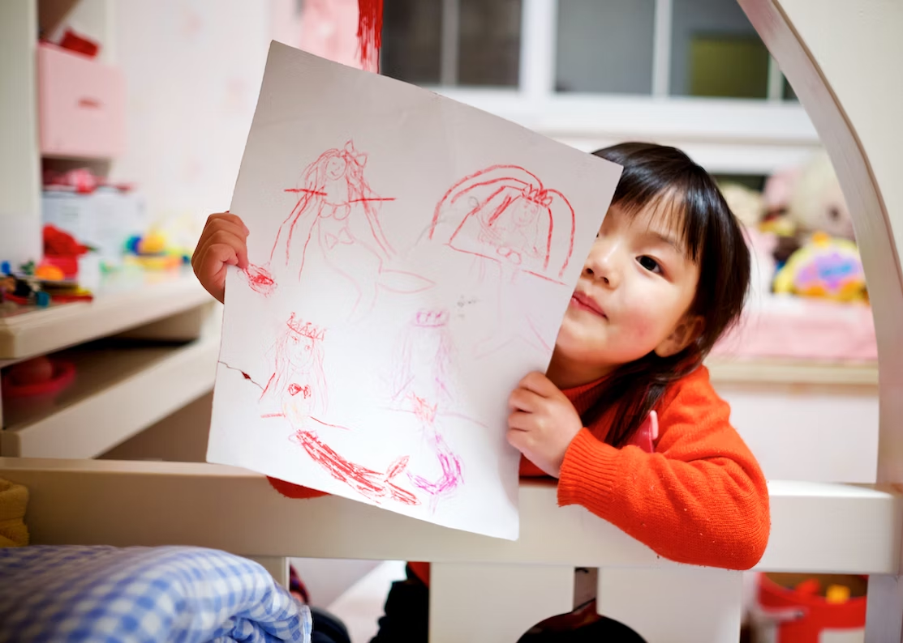

This article has been written and researched by our expert Loveable through a precise methodology. [Learn more about our methodology](https://avada.io/loveable/our-methodological.html)

[Loveable](https://avada.io/loveable/) > [Blog](https://avada.io/loveable/blog/) > [Family](https://avada.io/loveable/family/)

# Best Easy Drawing Ideas for Kids of All Ages

Written by [Rose Bryne](https://avada.io/loveable/author/rose/) Last Updated on September 07, 2023

Researched by [David Flynn](https://avada.io/loveable/author/david-flynn/) FROM LOVEABLE LAB

- [Drawing Ideas for 10-year-old Kids](https://avada.io/loveable/blog/drawing-ideas-for-kids/#wp-block-heading-2-3) 
- [Easy Drawing Ideas for Kids](https://avada.io/loveable/blog/drawing-ideas-for-kids/#wp-block-heading-2-21)
- [Drawing Ideas for 8-year-old Kids](https://avada.io/loveable/blog/drawing-ideas-for-kids/#wp-block-heading-2-38) 
- [Drawing Ideas for 7-year-old Kids](https://avada.io/loveable/blog/drawing-ideas-for-kids/#wp-block-heading-2-52) 
- [Bottom Line](https://avada.io/loveable/blog/drawing-ideas-for-kids/#wp-block-heading-2-71) 

Are you seeking **Drawing Ideas for Kids** that will inspire their imaginations and keep them occupied for hours? Look nowhere else! For kids of all ages, we have gathered a variety of fun and interesting sketching ideas in this post. Whether your child is a toddler or a teenager, these suggestions are made to spark their creativity and develop their [artistic](https://avada.io/loveable/artistic-gifts/) abilities.

Our selection includes a variety of topics that attract young minds and foster their love of art, from endearing creatures to fantastical landscapes. These drawing ideas for kids offer original ideas that push their creative prowess and inspire children to think beyond the box. These creative prompts will keep your youngster interested and enthusiastic about drawing. Grab some paper and pencils, then start your creative journey!

## **Drawing Ideas for 10-year-old Kids** 

These exercises are intended to pique their imaginations and inspire children to express themselves creatively, whether drawing their favorite characters from fiction or illustrating the marvels of nature. These drawing concepts will provide your child hours of artistic fun and help them hone their skills, whether they are budding artists or just want to doodle. 

With these fun sketching ideas for kids aged 10 and under, get ready for a creative adventure filled with color!

1. Self-Portrait
2. Draw your Room
3. Draw the perspective of an Ant
4. Draw the perspective of an Eagle
5. Create an Underwater scene
6. Draw a Cyclops
7. Imagine how a God looks
8. Draw yourself 10 years from now
9. Create a Caricature of a famous person (actor, singer, etc)
10. Go to the Park and draw the Environment
11. Sit on a bench and draw the People passing by
12. Sketch quick scenes from a Movie while watching it
13. Draw specific poses to test their drawing skills

**Related:** Best [Birthday Gifts For 12 Year Olds](https://avada.io/loveable/gifts-12-year-olds/)

## **Easy Drawing Ideas for Kids**

You’ve come to the correct place if you’re seeking for quick and enjoyable sketching activities that will spark your child’s interest in drawing. We’ve put together a great collection of simple drawing suggestions for kids in this article.  Let your child’s creativity soar as they experiment with these simple drawing concepts and bring their imaginations to life on paper!

1. Abstract Shapes
2. The Sun
3. The Moon
4. A Cat Face
5. A Smiley Face
6. Trace your Hand
7. Fill your sheet with Circles
8. Make random Dots on a piece of paper and connect them.
9. Draw a cat
10. Paint with your Hands
11. Draw a smiling sun
12. Connect the Dots
13. Draw a Car
14. Draw your favorite Cartoon Character

## **Drawing Ideas for 8-year-old Kids** 

All 8-year-old aspiring painters, take note! Are you prepared to explore the realm of sketching and let your creativity run wild? You need not look any farther, since this article is jam-packed with engaging and creative sketching suggestions that were chosen especially for young people like you.  With these fun drawing ideas for 8-year-old kids, you may start a colorful voyage of self-expression. So grab your pencils, crayons, and paper!

1. Draw a Spaceship and give it a name
2. Draw futuristic Robot
3. Draw an Elf Princess
4. Create a Fantasy Castle
5. Draw your special Super Power
6. Connect the Dots. 
7. Draw with your non-dominant Hand
8. Draw the Characters from your favorite Movie
9. Mix two Animals and Draw it!
10. Close your eyes and draw a Pig (or anything else)
11. Draw a Farmland

## **Drawing Ideas for 7-year-old Kids** 

Are you looking for fun, suitable drawing activities for your 7-year-old child? We’ve all come together here. Whether they wish to illustrate their favorite cuisine or delve into the secrets of space, these concepts will pique their imaginations and help them hone their artistic skills. With these enjoyable, age-appropriate sketching ideas, be ready to unleash your child’s creative side!

1. Draw the House
2. Paint a Coloring Book
3. Draw a Rainbow using all the colors
4. Draw using only Spots and Splatter
5. Draw the Ocean
6. Draw your favorite Cartoon CharacterDraw a Unicorn
7. Draw a Car
8. Use Gouache
9. Draw the cast of a TV show
10. Draw a Jumping Dog or Cat
11. Trace a household item
12. Draw yourself! 
13. Draw an Angry Face.

**See More:**

- [Easy Halloween Drawing Ideas](https://avada.io/loveable/blog/halloween-drawing-ideas/) for Kids and Beginners

- [Easy Draw Halloween](https://avada.io/loveable/easy-draw-halloween/) – Typical Halloween Characters to Draw

## **Bottom Line** 

These fun and interesting drawing ideas for kids of all ages are just the starting point in the vast realm of art. You may foster your child’s creativity by giving them a wide variety of challenging and motivating drawing ideas.  The road of artistic development and self-expression continues with the help of these kid-friendly drawing ideas.

Keep in mind that painting brings you unbounded joy. So, support their artistic pursuits and watch as their abilities and confidence soar, whether they are drawing everyday items or inventing their own universe on paper. Let these **drawing ideas for kids** serve as the foundation for an enduring enthusiasm and a fulfilling creative outlet. Happy drawing!

- [Drawing Ideas for 10-year-old Kids](https://avada.io/loveable/blog/drawing-ideas-for-kids/#wp-block-heading-2-3) 
- [Easy Drawing Ideas for Kids](https://avada.io/loveable/blog/drawing-ideas-for-kids/#wp-block-heading-2-21)
- [Drawing Ideas for 8-year-old Kids](https://avada.io/loveable/blog/drawing-ideas-for-kids/#wp-block-heading-2-38) 
- [Drawing Ideas for 7-year-old Kids](https://avada.io/loveable/blog/drawing-ideas-for-kids/#wp-block-heading-2-52) 
- [Bottom Line](https://avada.io/loveable/blog/drawing-ideas-for-kids/#wp-block-heading-2-71) 

### [Rose Bryne](https://avada.io/loveable/author/rose/)

Hi, I'm Rose! I love animals and spending time with kids. At Loveable, I help people find unique gifts for special occasions like Valentine's Day, housewarmings, and graduations. I enjoy finding gifts for kids, teens, and animal lovers that match their interests and personalities. Making gift-giving a pleasant experience is my priority. Let me assist you in finding the perfect gift!

- [Twitter](https://twitter.com/intent/tweet)
- [Facebook](https://www.facebook.com/sharer/sharer.php)
- [instagram](https://avada.io/loveable/blog/drawing-ideas-for-kids/)
- [pinterest](https://www.pinterest.com/loveablellc/)

## Related Posts

[### 30 Best 4 Year Old Birthday Party Ideas For A Memorable Celebration](https://avada.io/loveable/blog/4-year-old-birthday-party-ideas/) 

[

### 16th Birthday Party Ideas to Make an Unforgettable Day

](https://avada.io/loveable/blog/16th-birthday-party-ideas/)

[

### 150+ Inspirational Birthday Quotes to Spread Joy on Special Day

](https://avada.io/loveable/blog/inspirational-birthday-quotes/)

[

### 160+ Birthday Wishes for Wife to Express Eternal Love

](https://avada.io/loveable/blog/birthday-wishes-for-wife/)

[### 90+ Heart Touching Birthday Wishes for Niece to Make Her Day Extra Special](https://avada.io/loveable/blog/birthday-wishes-for-niece/)
