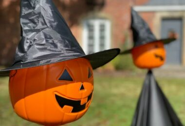
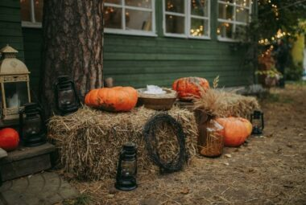
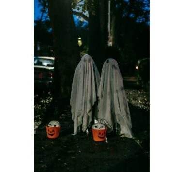
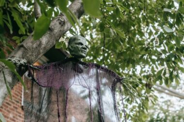
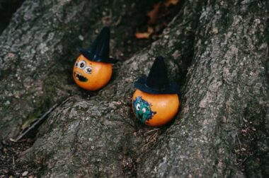
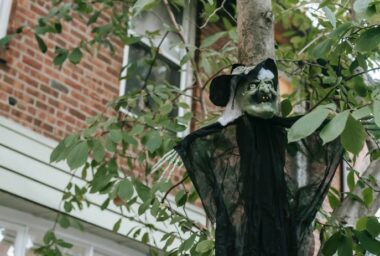
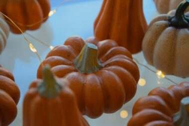
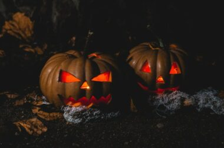

This article has been written and researched by our expert Loveable through a precise methodology. [Learn more about our methodology](https://avada.io/loveable/our-methodological.html)

[Loveable](https://avada.io/loveable/) > [Blog](https://avada.io/loveable/blog/) > [Holiday](https://avada.io/loveable/holiday/)

# Best Halloween Tree Decorations to Enchant Your Home in 2023

Written by [Blake Simpson](https://avada.io/loveable/author/blake/) Last Updated on October 03, 2023

- [Why Halloween Tree Decorations Matter?](https://avada.io/loveable/blog/halloween-tree-decorations/#wp-block-heading-2-4)
    - [Creating a captivating ambiance with Halloween Tree Decorations](https://avada.io/loveable/blog/halloween-tree-decorations/#wp-block-heading-3-8)
    - [Halloween Tree Decorations infuses your home with the spirit of Halloween](https://avada.io/loveable/blog/halloween-tree-decorations/#wp-block-heading-3-12)
    - [Halloween Tree Decorations showcases your unique style and creativity](https://avada.io/loveable/blog/halloween-tree-decorations/#wp-block-heading-3-17)
- [Choosing the Right Halloween Tree Decorations](https://avada.io/loveable/blog/halloween-tree-decorations/#wp-block-heading-2-21)
    - [Quality and durability: Ensuring long-lasting Halloween tree decorations](https://avada.io/loveable/blog/halloween-tree-decorations/#wp-block-heading-3-23)
    - [Crafting a cohesive theme for Halloween Tree Decorations](https://avada.io/loveable/blog/halloween-tree-decorations/#wp-block-heading-3-27)
    - [Choose Halloween Tree Decorations suitable for your tree](https://avada.io/loveable/blog/halloween-tree-decorations/#wp-block-heading-3-31)
- [DIY Ideas and Inspiration for Halloween Tree Decorations](https://avada.io/loveable/blog/halloween-tree-decorations/#wp-block-heading-2-35)
    - [Getting creative with homemade Halloween tree decorations](https://avada.io/loveable/blog/halloween-tree-decorations/#wp-block-heading-3-37)
    - [Easy and budget-friendly DIY Halloween tree decorations projects](https://avada.io/loveable/blog/halloween-tree-decorations/#wp-block-heading-3-41)
    - [Inspiring ideas to personalize your Halloween tree decorations](https://avada.io/loveable/blog/halloween-tree-decorations/#wp-block-heading-3-45)
- [Maintenance and Storage Tips for Halloween Tree Decorations](https://avada.io/loveable/blog/halloween-tree-decorations/#wp-block-heading-2-48)
    - [Preserving the longevity of your Halloween tree decorations](https://avada.io/loveable/blog/halloween-tree-decorations/#wp-block-heading-3-50)
    - [Properly storing your Halloween tree decorations](https://avada.io/loveable/blog/halloween-tree-decorations/#wp-block-heading-3-54)
- [Final Thoughts](https://avada.io/loveable/blog/halloween-tree-decorations/#wp-block-heading-2-58)

Are you ready to transform your Halloween celebrations into a bewitching extravaganza? Look no further than the enchanting world of **Halloween tree decorations**! As the leaves turn to shades of orange and black, it’s time to adorn your home with spine-chilling splendor. From eerie ornaments to hauntingly beautiful lights, there’s an abundance of thrilling ideas that will leave your guests spellbound. Join us as we embark on a journey through the mesmerizing realm of Halloween tree decorations, where imagination knows no bounds.

Attractive Halloween tree decorations offer a unique twist to your seasonal décor, allowing you to infuse an extra dose of [macabre into your home](https://avada.io/loveable/blog/decorated-halloween-homes/). Whether you prefer a classic and gothic [aesthetic](https://avada.io/loveable/aesthetic-gifts/) or a whimsical and playful vibe, the possibilities are endless. 

But what exactly can you do to transform an ordinary tree into a Halloween masterpiece? Let your creativity run wild as you explore the myriad of ideas for **Halloween tree decorations**. 

## **Why Halloween Tree Decorations Matter?**

Halloween tree decorations play a pivotal role in creating a truly enchanting atmosphere when it comes to celebrating the spookiest time of the year. They are more than just mere ornaments; they possess the power to transform your space into a realm of eerie delight. 

From haunted houses to cozy living rooms, the presence of Halloween tree decorations adds a touch of magic and excitement to any setting. In this article, we delve into the reasons why these decorations matter and explore how they can elevate your Halloween experience to new heights.

### **Creating a captivating ambiance with Halloween Tree Decorations**

First and foremost, [Halloween decorations](https://avada.io/loveable/cool-halloween-decorations/) provide a visual feast for the eyes. They capture the essence of this thrilling holiday and bring it to life in the most captivating way. From ghostly figures swaying in the breeze to sparkling lights casting an otherworldly glow, these decorations create a sense of wonder and anticipation. 

The carefully chosen colors, textures, and shapes of Halloween tree ornaments evoke a spooky charm that resonates with both children and adults alike. Whether you opt for a traditional or contemporary style, these decorations set the stage for a memorable Halloween celebration.

### **Halloween Tree Decorations infuses your home with the spirit of Halloween**

Infusing your home with the spirit of Halloween is effortless when you decorate your trees with the best, lovely, and most attractive Halloween tree decorations. These mesmerizing ornaments and captivating tree adornments add a touch of magic to your space, transforming it into a bewitching haven. Choose from an array of spooky ghosts, adorable [Halloween carved-pumpkins](https://avada.io/loveable/blog/halloween-pumpkin/), eerie bats, and glittering witches’ hats to create a unique and enchanting display. With endless options available, these decorations bring your haunted dreams to life, captivating both young and old. Let the allure of these carefully selected Halloween tree ornaments create an unforgettable atmosphere that embodies the essence of this beloved holiday.

Moreover, Halloween tree decorations foster a sense of togetherness and create lasting memories. The act of decorating a tree with loved ones, whether it’s family, friends, or neighbors, can become a cherished tradition that brings everyone closer. It provides an opportunity for bonding, storytelling, and laughter as you reminisce about past Halloweens and anticipate the ones to come. The joy and excitement that Halloween tree decorations bring become a shared experience, strengthening relationships and creating a sense of community spirit.

**_Check out_**: _Best_ [Family Tree Gifts](https://avada.io/loveable/family-tree-gifts/) _that Every Family Member Will Love_

### **Halloween Tree Decorations showcases your unique style and creativity**

Halloween tree decorations serve as a creative outlet for self-expression and personal style. They allow you to infuse your own personality and unique vision into your Halloween décor. Whether you prefer a more minimalist approach or love going all out with extravagant displays, the possibilities are endless. 

You can mix and match different themes, experiment with colors and textures, and even craft your own DIY ornaments. This creative process not only brings joy and satisfaction but also gives you the opportunity to share your creativity with others, sparking conversations and admiration.

## **Choosing the Right Halloween Tree Decorations**

In order to achieve Halloween Tree Decorations that truly satisfy you, it is crucial to make thoughtful choices regarding the style and ornaments used for the decoration process. The following article aims to provide you with valuable insights and creative ideas to help you create stunning Halloween tree displays that will exceed your expectations.

### **Quality and durability: Ensuring long-lasting Halloween tree decorations**

When it comes to decorating Halloween trees, it’s essential to prioritize quality and durability for the long-lasting enjoyment of your lovely and attractive [outdoor decorations](https://avada.io/loveable/blog/outdoor-halloween-decoration-ideas/). Choosing the best Halloween tree ornaments ensures that your decorations withstand the test of time, remaining stunning and intact year after year. Look for high-quality materials, such as sturdy plastics or durable metals, that can withstand outdoor conditions if you plan to display your tree outdoors. 

Additionally, consider ornaments with secure attachments and strong craftsmanship to prevent any accidental damage or breakage. By investing in the best Halloween tree decorations, you can create a captivating display that will bring joy and spooky charm for many Halloweens to come.

### **Crafting a cohesive theme for Halloween Tree Decorations**

Crafting a cohesive theme for Halloween Tree Decorations is the key to creating a visually stunning and memorable display. Start by selecting the best Halloween tree decorations that align with your desired theme, whether it’s spooky, whimsical, or a unique combination. Look for lovely and attractive ornaments that enhance the overall aesthetic and charm of your tree. 

Coordinate colors, textures, and styles to ensure a cohesive and harmonious look. From ghostly figures to glittering pumpkins, choose Halloween tree ornaments that complement each other and contribute to the cohesive theme you envision. With careful selection and attention to detail, your Halloween tree will become a captivating centerpiece that leaves a lasting impression.

### **Choose Halloween Tree Decorations suitable for your tree**

When it comes to decorating your Halloween trees, it’s important to choose Halloween tree decorations that are suitable for your specific tree. Consider the size, shape, and overall aesthetic of your tree to ensure a harmonious and visually pleasing display. Select lovely and attractive ornaments that complement the natural beauty of your tree, enhancing its appeal. 

Look for the best Halloween tree decorations that align with your personal style and desired theme, whether it’s spooky, elegant, or whimsical. With careful consideration and attention to detail, you can create a stunning ensemble of Halloween tree ornaments that bring your tree to life and captivate all who see it. In the next paragraph, we will provide you with some ideas for decorating your Halloween tree.

## **DIY Ideas and Inspiration for Halloween Tree Decorations**

Open your creativity with these DIY ideas and find inspiration for breathtaking Halloween tree decorations.

### **Getting creative with homemade Halloween tree decorations**

Unleash your creativity and add a personal touch to your Halloween tree decorations by getting crafty with homemade ornaments. Decorating Halloween trees becomes a delightful experience as you create lovely and attractive decorations that reflect your unique style. 

From spooky handcrafted bats and charming pumpkin garlands to glittering spiderwebs and eerie witch hats, the possibilities are endless. By making your own Halloween tree ornaments, you can ensure they perfectly align with your vision and theme. Let your imagination run wild and create the best Halloween tree decorations that will impress all who behold your hauntingly beautiful tree.

### **Easy and budget-friendly DIY Halloween tree decorations projects**

Looking to decorate your Halloween trees without breaking the bank? Explore these easy and budget-friendly DIY projects for creating lovely and attractive Halloween tree decorations. From upcycling materials to using simple craft supplies, you can make your own eye-catching ornaments that rival the best Halloween tree decorations.

Get creative with painted pumpkins, spooky cutouts, or festive garlands to add an attractive touch to your tree. With a little imagination and some crafting magic, you can transform your Halloween tree into a stunning centerpiece that will impress all who see it, without putting a strain on your budget.

### **Inspiring ideas to personalize your Halloween tree decorations**

Make your Halloween tree decorations truly one-of-a-kind with these inspiring ideas that allow you to add a personal touch. Decorating Halloween trees becomes an opportunity to showcase your creativity and style as you create lovely and attractive ornaments. Consider incorporating handmade crafts, sentimental trinkets, or even photographs to make your decorations extra special. Mix and match colors, textures, and styles to create an attractive and cohesive display. Let your imagination guide you as you curate the best Halloween tree decorations that reflect your unique personality. Transform your tree into a mesmerizing centerpiece that captivates all who see it, making your Halloween celebrations unforgettable.

_**Related**: Best [Halloween Mantel Decor Ideas](https://avada.io/loveable/halloween-mantel-decor-ideas/) to Haunt Your Home_

## **Maintenance and Storage Tips for Halloween Tree Decorations**

Ensure the longevity of your Halloween tree decorations with these maintenance and storage tips, keeping them in perfect condition for years to come.

### **Preserving the longevity of your Halloween tree decorations**

Preserving the longevity of your Halloween tree decorations is essential to ensure their lasting beauty and charm. To keep your lovely and attractive ornaments in pristine condition, consider a few key tips. When decorating Halloween trees, choose high-quality materials for the best durability. Avoid exposing ornaments to excessive moisture or direct sunlight, as these can cause damage. 

Properly store your decorations in a cool, dry place during the off-season, protecting them from dust and potential breakage. Taking extra care when handling and packing your Halloween tree ornaments will help maintain their appeal and make them the best decorations year after year. By following these practices, you can enjoy the captivating allure of your Halloween tree for seasons to come.

### **Properly storing your Halloween tree decorations**

Properly storing your Halloween tree decorations is crucial to ensure their longevity and keep them in top condition for future use. After the festivities, take the time to pack away your lovely and attractive ornaments with care. Start by removing any dust or debris from the decorations using a soft cloth. 

Then, carefully wrap each ornament in tissue paper or bubble wrap to prevent scratches or breakage. Place them in sturdy storage containers, preferably with dividers, to keep them organized and protected. Label the containers for easy identification next year. Store the boxes in a cool, dry place away from direct sunlight or extreme temperatures. By following these storage practices, you can preserve the best Halloween tree decorations and delight in their beauty year after year.

## **Final Thoughts**

To sum up, **Halloween tree decorations** go beyond simple adornments; they hold the power to elevate your Halloween celebrations and create a truly magical ambiance. They allow you to express your creativity, create lasting memories, and immerse yourself in the spirit of this bewitching holiday. So, embrace the enchantment, unleash your imagination, and let Halloween tree decorations cast their spell on your home and your heart. Follow Loveable to learn more benefits information from us.

- [Why Halloween Tree Decorations Matter?](https://avada.io/loveable/blog/halloween-tree-decorations/#wp-block-heading-2-4)
    - [Creating a captivating ambiance with Halloween Tree Decorations](https://avada.io/loveable/blog/halloween-tree-decorations/#wp-block-heading-3-8)
    - [Halloween Tree Decorations infuses your home with the spirit of Halloween](https://avada.io/loveable/blog/halloween-tree-decorations/#wp-block-heading-3-12)
    - [Halloween Tree Decorations showcases your unique style and creativity](https://avada.io/loveable/blog/halloween-tree-decorations/#wp-block-heading-3-17)
- [Choosing the Right Halloween Tree Decorations](https://avada.io/loveable/blog/halloween-tree-decorations/#wp-block-heading-2-21)
    - [Quality and durability: Ensuring long-lasting Halloween tree decorations](https://avada.io/loveable/blog/halloween-tree-decorations/#wp-block-heading-3-23)
    - [Crafting a cohesive theme for Halloween Tree Decorations](https://avada.io/loveable/blog/halloween-tree-decorations/#wp-block-heading-3-27)
    - [Choose Halloween Tree Decorations suitable for your tree](https://avada.io/loveable/blog/halloween-tree-decorations/#wp-block-heading-3-31)
- [DIY Ideas and Inspiration for Halloween Tree Decorations](https://avada.io/loveable/blog/halloween-tree-decorations/#wp-block-heading-2-35)
    - [Getting creative with homemade Halloween tree decorations](https://avada.io/loveable/blog/halloween-tree-decorations/#wp-block-heading-3-37)
    - [Easy and budget-friendly DIY Halloween tree decorations projects](https://avada.io/loveable/blog/halloween-tree-decorations/#wp-block-heading-3-41)
    - [Inspiring ideas to personalize your Halloween tree decorations](https://avada.io/loveable/blog/halloween-tree-decorations/#wp-block-heading-3-45)
- [Maintenance and Storage Tips for Halloween Tree Decorations](https://avada.io/loveable/blog/halloween-tree-decorations/#wp-block-heading-2-48)
    - [Preserving the longevity of your Halloween tree decorations](https://avada.io/loveable/blog/halloween-tree-decorations/#wp-block-heading-3-50)
    - [Properly storing your Halloween tree decorations](https://avada.io/loveable/blog/halloween-tree-decorations/#wp-block-heading-3-54)
- [Final Thoughts](https://avada.io/loveable/blog/halloween-tree-decorations/#wp-block-heading-2-58)

### [Blake Simpson](https://avada.io/loveable/author/blake/)

Hi, I'm Blake from Loveable. I help people find perfect gifts for occasions like anniversaries and weddings. I also write a blog about holidays, sharing insights to make them more meaningful. Let's create unforgettable moments together!

- [Twitter](https://twitter.com/intent/tweet)
- [Facebook](https://www.facebook.com/sharer/sharer.php)
- [instagram](https://avada.io/loveable/blog/halloween-tree-decorations/)
- [pinterest](https://www.pinterest.com/loveablellc/)

## Related Posts

[### 120+ Christian Birthday Wishes To Spread Your Love](https://avada.io/loveable/blog/christian-birthday-wishes/) 

[

### 35 Best 70th Birthday Ideas To Celebrate The Special Milestone

](https://avada.io/loveable/blog/70th-birthday-ideas/)

[

### 50 Best 30th Birthday Decorations for a Remarkable Birthday Bash

](https://avada.io/loveable/blog/30th-birthday-decorations/)

[

### 40 Delicious Vegan Christmas Desserts to Delight Your Palate

](https://avada.io/loveable/blog/vegan-christmas-desserts/)

[

### 60 Christmas Team Building Activities to Boost Workplace Spirit

](https://avada.io/loveable/blog/christmas-team-building-activities/)
