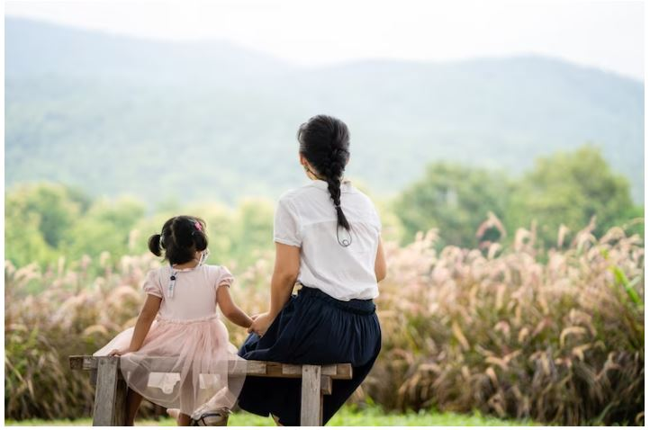
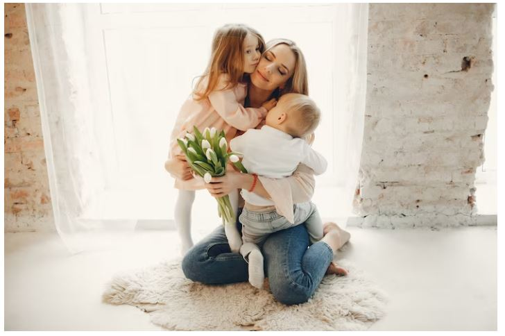
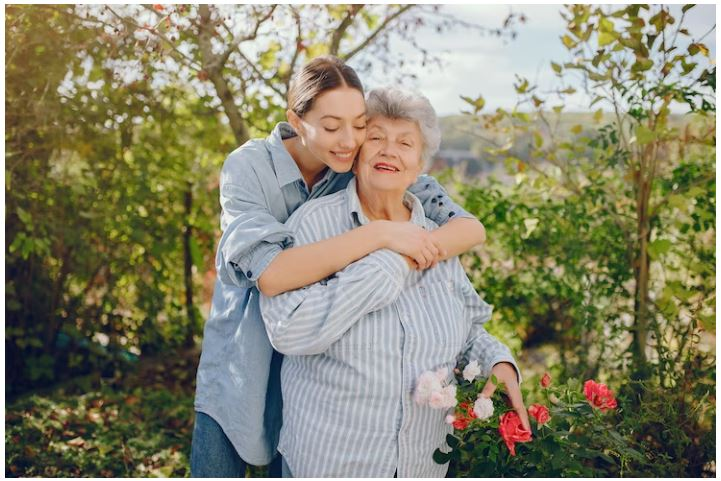
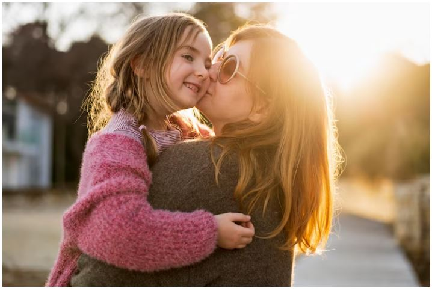
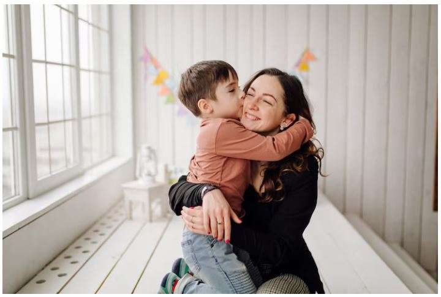
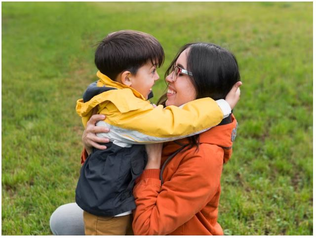

This article has been written and researched by our expert Loveable through a precise methodology. [Learn more about our methodology](https://avada.io/loveable/our-methodological.html)

[Loveable](https://avada.io/loveable/) > [Blog](https://avada.io/loveable/blog/) > [Holiday](https://avada.io/loveable/holiday/)

# Best Mother’s Day Poem To Make Your Mom Happy

Written by [Blake Simpson](https://avada.io/loveable/author/blake/) Last Updated on August 18, 2023

- [Mother’s day poem from children](https://avada.io/loveable/blog/mothers-day-poem/#wp-block-heading-2-3) 
    - [“What Mother Means” by Karl Fuchs](https://avada.io/loveable/blog/mothers-day-poem/#wp-block-heading-3-6)
    - [“God Created Mothers” Holly Giffers](https://avada.io/loveable/blog/mothers-day-poem/#wp-block-heading-3-10)
    - [“Dear Mother” by Herman Vymislicky](https://avada.io/loveable/blog/mothers-day-poem/#wp-block-heading-3-13)
    - [“My Heart” by Sharlynn N. Manning](https://avada.io/loveable/blog/mothers-day-poem/#wp-block-heading-3-17)
    - [“Everything Mom” by Joanna Fuchs](https://avada.io/loveable/blog/mothers-day-poem/#wp-block-heading-3-21)
- [Mother’s day poem from daughter](https://avada.io/loveable/blog/mothers-day-poem/#wp-block-heading-2-24)
    - [“Wonderful Mother” by Pat O’Reilly](https://avada.io/loveable/blog/mothers-day-poem/#wp-block-heading-3-27)
    - [“Mother” by Lola Ridge](https://avada.io/loveable/blog/mothers-day-poem/#wp-block-heading-3-30)
    - [“To My Mother” by Christina Rossetti](https://avada.io/loveable/blog/mothers-day-poem/#wp-block-heading-3-34)
    - [“Rock Me to Sleep” by Elizabeth Akers Allen](https://avada.io/loveable/blog/mothers-day-poem/#wp-block-heading-3-37)
    - [“A Mother” by Christy Ann Martine](https://avada.io/loveable/blog/mothers-day-poem/#wp-block-heading-3-41)
- [Mother’s day poem from son](https://avada.io/loveable/blog/mothers-day-poem/#wp-block-heading-2-44)
    - [“Mother O’ Mine” by Rudyard Kipling](https://avada.io/loveable/blog/mothers-day-poem/#wp-block-heading-3-47)
    - [“Only One Mother” by George Cooper](https://avada.io/loveable/blog/mothers-day-poem/#wp-block-heading-3-50)
    - [“You Let Me Know You Love Me” by Joanna Fuchs](https://avada.io/loveable/blog/mothers-day-poem/#wp-block-heading-3-54)
    - [“Tribute to Mother” by John Greenleaf Whittier](https://avada.io/loveable/blog/mothers-day-poem/#wp-block-heading-3-57)
    - [“To My Mother” by Edgar Allan Poe](https://avada.io/loveable/blog/mothers-day-poem/#wp-block-heading-3-61)
- [Final words,](https://avada.io/loveable/blog/mothers-day-poem/#wp-block-heading-2-66)

Moms are absolutely incredible. They are as charming as a dove and as frightening as a tigress to anybody who harms her child. There is nothing in this world that can compensate your mother for the suffering she endures in order to provide you with a happy life. And, because poetry is the language of the spirit, you may thank and adore your mother with these lyrical words.

A poem for mom might be brief and sweet; mom poems can be a starting point for you to customize or just a method to convey all the complicated feelings that aren’t always easy to put into words. See **the greatest poem for Mother’s Day from daughters, sons’ poems for mothers**, and even amusing Mother’s Day poems and [quotes for mom](https://avada.io/loveable/mothers-day-quotes-from-daughter/) to commemorate the person you’re delighted to name Mom.

## Mother’s day poem from children 

Mother is the first angel in the lives of children. Children adore their mothers wholeheartedly because she gives them warmth and a protective shield. Mother’s Day is approaching, and now is the time for children to think of ways to thank mom for her unending love. 

We created these emotionally driven Mother’s Day poems. As a [Mother’s Day present](https://avada.io/loveable/personalized-mothers-day-gifts/), read it aloud to your mother; she will adore it!

### “What Mother Means” by Karl Fuchs

As a God’s gift, the only thing she can conceive of as her work is how to make the future of her children bright and full of glory and renown, regardless of whether it is day or night.

The words and phrases in this mother poem are straightforward. As a result, you can simply teach this poem to your young children and explain how a mother does everything she can to instill excellent qualities in her kid.

As a God’s gift, the only thing she can conceive of as her work is how to make the future of her children bright

### “God Created Mothers” Holly Giffers

A mother is a magnificent God-given gift with the ability to solve all of your troubles. It’s true what someone said about how God couldn’t be everywhere, which is why he made a mother.

She is a priceless gift from God, and we can’t [express how grateful we are](https://avada.io/loveable/thank-you-gifts-women/) to have her in our lives. She is the one who fully takes responsibility for doing all necessary to [raise her children](https://avada.io/loveable/different-parenting-styles/) with the utmost selflessness. And she showers them with unbounded affection and concern for as long as she is alive.

### “Dear Mother” by Herman Vymislicky

**“Dear Mother” by Herman Vymislicky**

All of us love our mothers. Nonetheless, we frequently forget to tell our moms how much we appreciate them. Let’s alter it by embracing the lovely language of poetry.

It’s really a simple love letter to mum. If you don’t tell your mother I Love You frequently, teach your child this poem so that you may both say it to her at the same time.

### “My Heart” by Sharlynn N. Manning

Even if the infant is unaware of it, the first word it learns when it begins to talk is ‘ma,’ meaning mother. The mother is the alpha who will always be there for her child till the end of time. She is a priceless treasure placed upon us by God, and words fail us as we wonder at our good fortune to have her around.

If you have a special place in your heart for your mother, this tempting mom poem can help you express your feelings beautifully.

The mother is the alpha who will always be there for her child till the end of time

### “Everything Mom” by Joanna Fuchs

Do you want to demonstrate to your child that women may play many roles in your life and are superhuman? Hence, this mom poem is the ideal way to honor all the moms who give their kids everything.

Mom’s gentle care throughout our younger years is frequently the foundation of poems for mothers. Mother poems, like this one, also talk about how our mothers made our lives better. This poem is in free verse as opposed to the majority of mother poems, which are rhymed.

## Mother’s day poem from daughter

The enduring closeness between a [mother and daughter](https://avada.io/loveable/mother-daughter-relationships/) is quite amazing. We created this collection of Mother’s Day poems that daughters may read to their mothers to make them feel special while also keeping in mind their unbreakable bond. 

Mother’s day poem from daughter

### “Wonderful Mother” by Pat O’Reilly

Every year, on the second Sunday in May, people of all ages express and reciprocate their love and thanks for their great mothers in recognition of their love, care, selflessness, and sacrifices. This holiday is known as Mother’s Day. 

Many choose to express themselves via poetry, which enables them to do so more effectively. A poem like this is called “Wonderful Mother,” in which the poet praises his mother and compares her beauty to the sun and the sky.

### “Mother” by Lola Ridge

A mother’s love is like moonlight in this brief poem, “turning harsh things to beauty.” This perfectly captures how many people feel about the strength of a mother’s love without descending into the romanticism so frequently seen in poetry on the subject.

Ridge focuses on imagery of reflection in the opening stanza, using the moon, the mirror, and the gleaming stream. She sees a mother as someone who provides an ethereal beauty to the children’s vision of themselves, not only reflecting it back but enhancing it. 

A mother’s love is like moonlight in this brief poem

### “To My Mother” by Christina Rossetti

The poem is about a mother-daughter relationship’s unending love. Rossetti expresses to her mother all of her heartfelt wishes for her health. She also addresses her mother to accept the flowers she has given her mother, as well as the poetry she has written to her.

This is an emotive poem by a well-known English poet from the 1980s. She brilliantly described how she prayed for her mother and felt privileged to obtain her mother’s happiness. You should teach this poem to your newborn daughter if you have one.

### “Rock Me to Sleep” by Elizabeth Akers Allen

Rock Me to Sleep will send you back to your childhood when your mother used to sing you lullabies and rock you to sleep. This mother’s poetry conveys a great message about how a mother may accept the harshness of the world in order to shield her kid from everything. You can sing this poetry to your youngster while recalling happy childhood experiences.

Her touches have certain distinct properties that only her soul can perceive. This experience cannot be shared with anybody else. Everyone has a romanticized vision of the mother in their hearts. And now, Allen shows the reader this image.

### “A Mother” by Christy Ann Martine

It’s a lovely work that depicts how a mother nourishes and loves her child until the time comes to let the infant soar. If you have a mother, you are unquestionably blessed, and you should do nothing extraordinary to show her that she is the most precious of all the treasures you have.

**_Related_**: [55 Best Daughter Mother Day Gifts To Surprise Her](https://avada.io/loveable/mothers-day-gifts-daughters/)

## Mother’s day poem from son

It feels out of this world to have a mother-son bond that is so great. The bond between a boy and his mother cannot be as strong. On his mother’s special day, a son can read one of our Mother’s Day poems to her.

Mother’s day poem from son

### “Mother O’ Mine” by Rudyard Kipling

The poem “Mother o’ Mine” appeared in Kipling’s 1892 book The Light That Failed as a dedication. It’s song-like, like many of Kipling’s best works, and lends itself to being read or even sung or chanted loudly. It’s a good poem about a poet honoring his mother, too.

In “Mother o’ Mine,” Kipling honors the reality that mothers love their children without conditions. Kipling understands that his mother would pray for his salvation if he were to commit a sin so awful that he was doomed in body and soul. Kipling also knows that his mother would still love him even if he were executed for some crime or mistake, drowned, or experienced some other tragic catastrophe.

### “Only One Mother” by George Cooper

George Cooper’s poem “Only One Mother” aims to make us aware that while there are many things in this world, such as stars, shells, birds, and lambs, we only have one mother, who is the most priceless gift on earth for a kid. 

He reminds us how fortunate we are to have a mother whose love is unmatched because she loves her kid without conditions and without seeking anything in return. The poet emphasizes the value of mothers in children’s lives and how fortunate we are to have them.

We only have one mother, who is the most priceless gift on earth for a kid

### “You Let Me Know You Love Me” by Joanna Fuchs

Poems for moms might be rhyming poetry or free verse poems. Moms never pass up a chance to express their love for their children.

And this mom poem is all about how a mother expresses her love and gratitude for her kid in many ways. The free Mother’s day verses convey thanks for mom’s selflessness and caring character. You may show your child how much you love them by using this profound mom poem.

### “Tribute to Mother” by John Greenleaf Whittier

“Tribute to Mother” by John Greenleaf Whittier

‘Tribute to Mother’ is a short poem by American Quaker poet John Greenleaf Whittier (1807-92) in which he remembers sitting at his mother’s knee as a tiny kid. The poet’s mother curbed his ‘selfish moods’ and taught him a ‘chastening love’.

This is a beautiful poetic homage to your mum. You can sing this poem with your child to honor all the wonderful mothers.

### “To My Mother” by Edgar Allan Poe

These verses for Mother’s Day may not be one of the poet’s most well-known. Yet, it remains Poe’s most heartfelt and emotional poem. He wrote this nice poem for her mother-in-law to honor all the sacrifices she has through while raising his darling wife.

‘To My Mother,’ which was released in July 1849, features several stunning images. When employed appropriately, imagery helps a poet to engage the senses of the reader. Poe does this in this poem by referring to the “burning phrases of love” and claiming, quite effectively and evocatively, that he can hear angels talking.

Yet, it remains Poe’s most heartfelt and emotional poem

**_Related_**: [70 Best Gifts for Mom From Son On Mother Day](https://avada.io/loveable/gifts-moms-from-sons/)

## Final words,

Mother’s Day is almost approaching, and now is the perfect opportunity to do some extra-special deeds for mom to feel special. One of the greatest methods is to write her sentimental Mother’s day poems, for which she will undoubtedly praise you.

These poems can assist you in expressing the strong bond between mother and child, whether you’re honoring your mother, grandmother, aunt, or any significant mother figure in your life. 

- [Mother’s day poem from children](https://avada.io/loveable/blog/mothers-day-poem/#wp-block-heading-2-3) 
    - [“What Mother Means” by Karl Fuchs](https://avada.io/loveable/blog/mothers-day-poem/#wp-block-heading-3-6)
    - [“God Created Mothers” Holly Giffers](https://avada.io/loveable/blog/mothers-day-poem/#wp-block-heading-3-10)
    - [“Dear Mother” by Herman Vymislicky](https://avada.io/loveable/blog/mothers-day-poem/#wp-block-heading-3-13)
    - [“My Heart” by Sharlynn N. Manning](https://avada.io/loveable/blog/mothers-day-poem/#wp-block-heading-3-17)
    - [“Everything Mom” by Joanna Fuchs](https://avada.io/loveable/blog/mothers-day-poem/#wp-block-heading-3-21)
- [Mother’s day poem from daughter](https://avada.io/loveable/blog/mothers-day-poem/#wp-block-heading-2-24)
    - [“Wonderful Mother” by Pat O’Reilly](https://avada.io/loveable/blog/mothers-day-poem/#wp-block-heading-3-27)
    - [“Mother” by Lola Ridge](https://avada.io/loveable/blog/mothers-day-poem/#wp-block-heading-3-30)
    - [“To My Mother” by Christina Rossetti](https://avada.io/loveable/blog/mothers-day-poem/#wp-block-heading-3-34)
    - [“Rock Me to Sleep” by Elizabeth Akers Allen](https://avada.io/loveable/blog/mothers-day-poem/#wp-block-heading-3-37)
    - [“A Mother” by Christy Ann Martine](https://avada.io/loveable/blog/mothers-day-poem/#wp-block-heading-3-41)
- [Mother’s day poem from son](https://avada.io/loveable/blog/mothers-day-poem/#wp-block-heading-2-44)
    - [“Mother O’ Mine” by Rudyard Kipling](https://avada.io/loveable/blog/mothers-day-poem/#wp-block-heading-3-47)
    - [“Only One Mother” by George Cooper](https://avada.io/loveable/blog/mothers-day-poem/#wp-block-heading-3-50)
    - [“You Let Me Know You Love Me” by Joanna Fuchs](https://avada.io/loveable/blog/mothers-day-poem/#wp-block-heading-3-54)
    - [“Tribute to Mother” by John Greenleaf Whittier](https://avada.io/loveable/blog/mothers-day-poem/#wp-block-heading-3-57)
    - [“To My Mother” by Edgar Allan Poe](https://avada.io/loveable/blog/mothers-day-poem/#wp-block-heading-3-61)
- [Final words,](https://avada.io/loveable/blog/mothers-day-poem/#wp-block-heading-2-66)

### [Blake Simpson](https://avada.io/loveable/author/blake/)

Hi, I'm Blake from Loveable. I help people find perfect gifts for occasions like anniversaries and weddings. I also write a blog about holidays, sharing insights to make them more meaningful. Let's create unforgettable moments together!

- [Twitter](https://twitter.com/intent/tweet)
- [Facebook](https://www.facebook.com/sharer/sharer.php)
- [instagram](https://avada.io/loveable/blog/mothers-day-poem/)
- [pinterest](https://www.pinterest.com/loveablellc/)

## Related Posts

[### 120+ Christian Birthday Wishes To Spread Your Love](https://avada.io/loveable/blog/christian-birthday-wishes/) 

[

### 35 Best 70th Birthday Ideas To Celebrate The Special Milestone

](https://avada.io/loveable/blog/70th-birthday-ideas/)

[

### 50 Best 30th Birthday Decorations for a Remarkable Birthday Bash

](https://avada.io/loveable/blog/30th-birthday-decorations/)

[

### 40 Delicious Vegan Christmas Desserts to Delight Your Palate

](https://avada.io/loveable/blog/vegan-christmas-desserts/)

[

### 60 Christmas Team Building Activities to Boost Workplace Spirit

](https://avada.io/loveable/blog/christmas-team-building-activities/)
