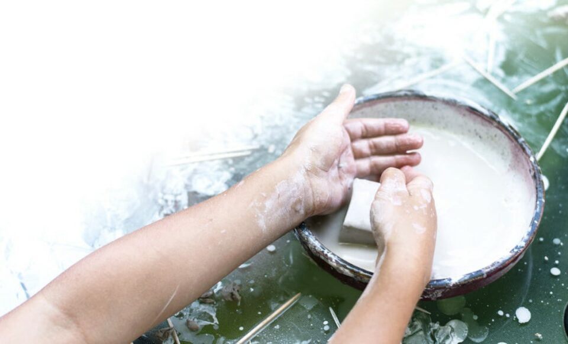
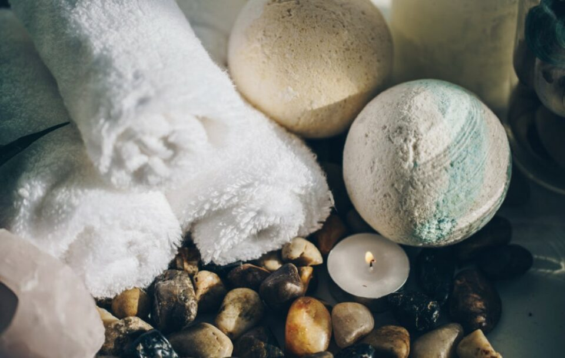
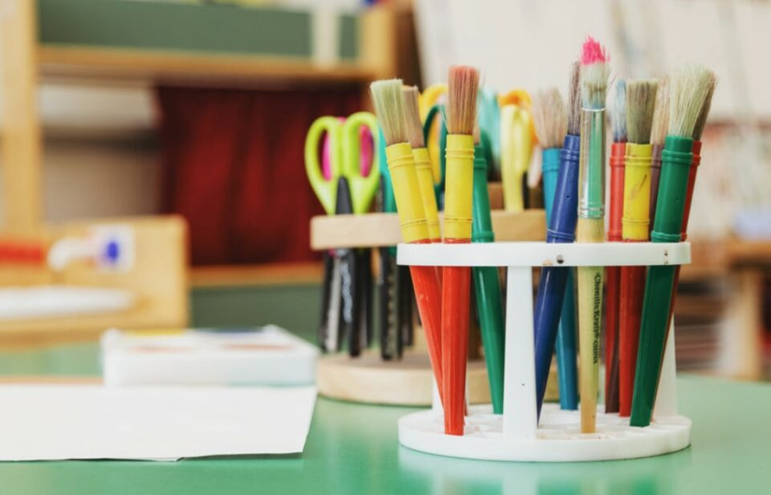
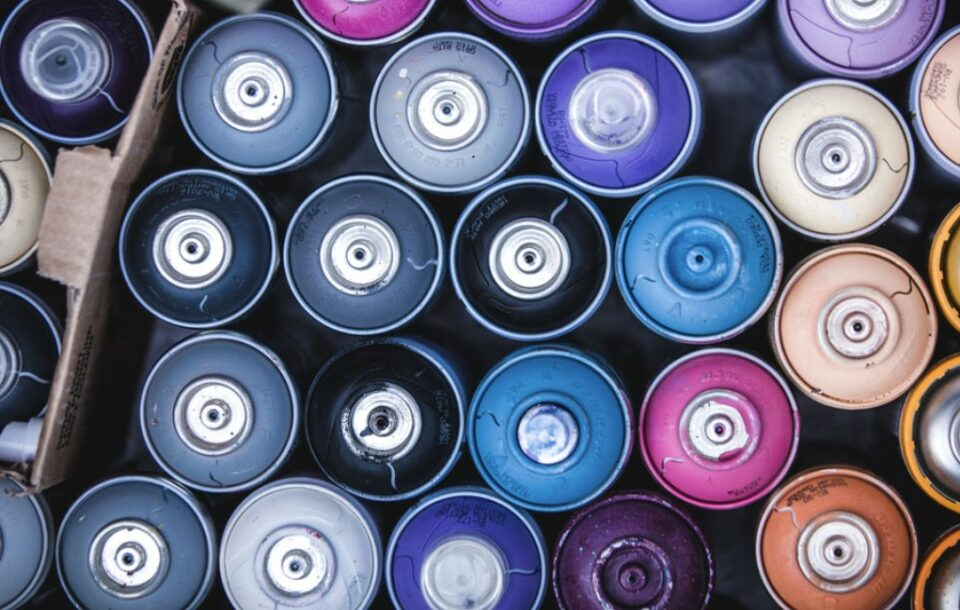
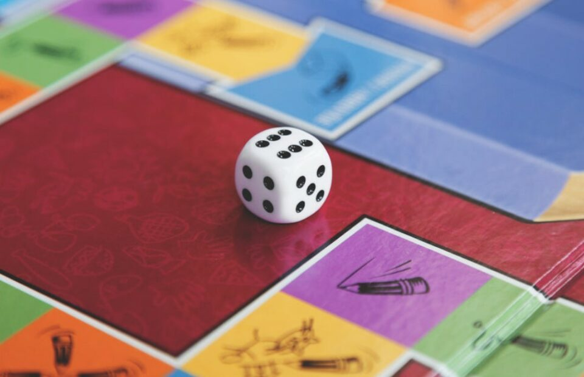
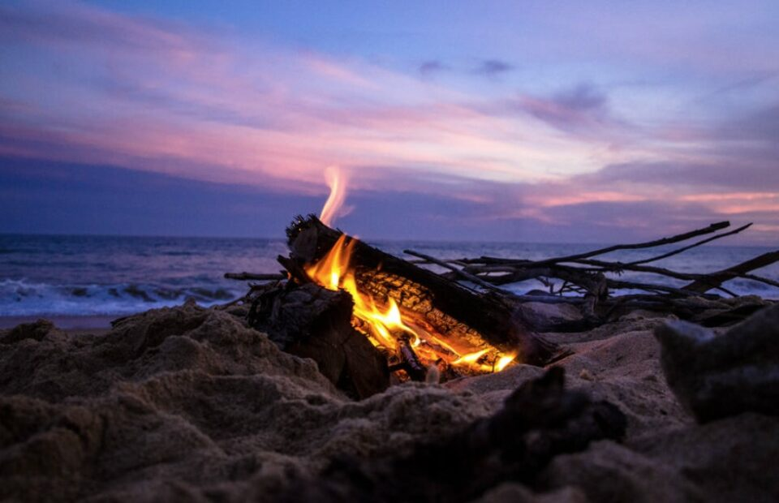
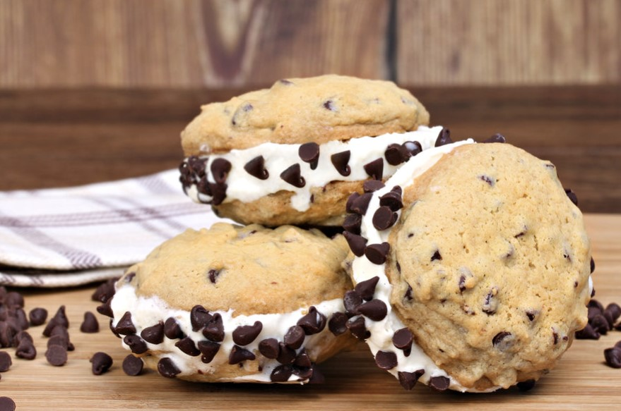

This article has been written and researched by our expert Loveable through a precise methodology. [Learn more about our methodology](https://avada.io/loveable/our-methodological.html)

[Loveable](https://avada.io/loveable/) > [Blog](https://avada.io/loveable/blog/) > [Holiday](https://avada.io/loveable/holiday/)

# Birthday Party Ideas for Teens: 24 Fun and Creative Ways to Celebrate

Written by [Blake Simpson](https://avada.io/loveable/author/blake/) Last Updated on August 23, 2023

- [24 Unforgettable Birthday Party Ideas for Teens To Create Lasting Memories](https://avada.io/loveable/blog/birthday-party-ideas-for-teens/#wp-block-heading-2-6)
    - [Murder Mystery](https://avada.io/loveable/blog/birthday-party-ideas-for-teens/#wp-block-heading-3-7)
    - [Private Movie Screening](https://avada.io/loveable/blog/birthday-party-ideas-for-teens/#wp-block-heading-3-11)
    - [Dinner Party](https://avada.io/loveable/blog/birthday-party-ideas-for-teens/#wp-block-heading-3-15)
    - [Slumber Party](https://avada.io/loveable/blog/birthday-party-ideas-for-teens/#wp-block-heading-3-17)
    - [Backyard Movie Night](https://avada.io/loveable/blog/birthday-party-ideas-for-teens/#wp-block-heading-3-21)
    - [Pottery Classes](https://avada.io/loveable/blog/birthday-party-ideas-for-teens/#wp-block-heading-3-24)
    - [Go Bowling!](https://avada.io/loveable/blog/birthday-party-ideas-for-teens/#wp-block-heading-3-27)
- [Birthday Party Ideas for Teen Girls](https://avada.io/loveable/blog/birthday-party-ideas-for-teens/#wp-block-heading-2-30)
    - [Spa Party for Teen Girls](https://avada.io/loveable/blog/birthday-party-ideas-for-teens/#wp-block-heading-3-31)
    - [Karaoke with Friend](https://avada.io/loveable/blog/birthday-party-ideas-for-teens/#wp-block-heading-3-34)
    - [Girls Fashion Show](https://avada.io/loveable/blog/birthday-party-ideas-for-teens/#wp-block-heading-3-36)
    - [Cooking or Baking Party](https://avada.io/loveable/blog/birthday-party-ideas-for-teens/#wp-block-heading-3-40)
    - [DIY Craft Party](https://avada.io/loveable/blog/birthday-party-ideas-for-teens/#wp-block-heading-3-43)
    - [Beach Party](https://avada.io/loveable/blog/birthday-party-ideas-for-teens/#wp-block-heading-3-47)
- [Birthday Party Ideas for Teen Boys](https://avada.io/loveable/blog/birthday-party-ideas-for-teens/#wp-block-heading-2-50)
    - [Try Escape Room](https://avada.io/loveable/blog/birthday-party-ideas-for-teens/#wp-block-heading-3-51)
    - [Paintball War](https://avada.io/loveable/blog/birthday-party-ideas-for-teens/#wp-block-heading-3-54) 
    - [Sports Competition and Sport Theme Party](https://avada.io/loveable/blog/birthday-party-ideas-for-teens/#wp-block-heading-3-57) 
    - [Video Games Night](https://avada.io/loveable/blog/birthday-party-ideas-for-teens/#wp-block-heading-3-59) 
    - [Scavenger Hunt](https://avada.io/loveable/blog/birthday-party-ideas-for-teens/#wp-block-heading-3-63)
    - [Game Truck](https://avada.io/loveable/blog/birthday-party-ideas-for-teens/#wp-block-heading-3-65)
    - [Board Games](https://avada.io/loveable/blog/birthday-party-ideas-for-teens/#wp-block-heading-3-67)
- [Birthday Party Ideas In Summer for Teens](https://avada.io/loveable/blog/birthday-party-ideas-for-teens/#wp-block-heading-2-71) 
    - [Boat Night](https://avada.io/loveable/blog/birthday-party-ideas-for-teens/#wp-block-heading-3-72)
    - [Campfire Party](https://avada.io/loveable/blog/birthday-party-ideas-for-teens/#wp-block-heading-3-74)
    - [Go to the Water Park](https://avada.io/loveable/blog/birthday-party-ideas-for-teens/#wp-block-heading-3-77) 
    - [Ice Cream Party](https://avada.io/loveable/blog/birthday-party-ideas-for-teens/#wp-block-heading-3-79) 
- [Bottom Line](https://avada.io/loveable/blog/birthday-party-ideas-for-teens/#wp-block-heading-2-82) 

Birthdays are memorable occasions that deserve to be celebrated in a grand way. Each age group brings different joys on their birthday. For example, for young children, nothing beats the excitement of receiving gifts and toys on their special day. As [for those over 50](https://avada.io/loveable/funny-60th-birthday-gifts/), perhaps the greatest joy is being surrounded by family and loved ones on this special day.

But what about teenage birthdays?

When it comes to teenage birthdays, parents often struggle to come up with unique ideas to celebrate their child stepping into another year of adulthood. This is the age of youthfulness, energy, and daring ideas, and parents may find it challenging to keep up with the vibe of teenagers. Sometimes, even the teenagers themselves are unsure of what they truly want.

To address this common question, this article presents you with 24 **Birthday Party Ideas for Teens**. From popular and budget-friendly activities to fresh and unconventional ideas you may have never considered, rest assured that these suggestions will eliminate any worries about making that special day truly exceptional. Let’s get started right away!

**You may also like**: [_Best Personalized Birthday Gift Collections Especially Designed For Kids And Teens._](https://avada.io/loveable/kids-teens/) 

## **24 Unforgettable Birthday Party Ideas for Teens To Create Lasting Memories**

### **Murder Mystery**

Murder mystery parties are a fantastic idea for teen birthday celebrations, especially for those who love drama and excitement.

In a murder mystery party game, each guest gets to take on a character and question others to unravel the mystery behind the murder. This birthday party concept is particularly suitable for teens who desire a memorable and elegant celebration but need more funds. The party’s highlight lies in the guests’ performances, making it an attractive and budget-friendly option.

Here is how the game works: [Play Rules](https://nightofmystery.com/how-to-play/) 

### **Private Movie Screening**

If your teenager loves movies, you can plan a special private movie screening for them. Many movie theaters offer private events, making it easy to book a theater for your teen and their friends.

This is a wonderful choice for teens who want to have a fun outing but aren’t old enough to be unsupervised. When it comes to teenagers’ birthday parties outside of the home, it’s a simple and convenient way to keep all the kids entertained and supervised in one theater.

### **Dinner Party**

Hosting a dinner party is an excellent birthday idea for teenagers who have outgrown kid activities but aren’t yet independent enough to go out on their own. You can collaborate with your teen to plan the menu and choose exciting, personalized tableware like a special centerpiece and matching napkins. You can even base the dinner party theme on their favorite book or movie, which will add a unique touch.

### **Slumber Party**

A sleepover is a popular and straightforward choice when it comes to home-based teenage party ideas. Both teens and pre-teens usually enjoy the opportunity to spend an entire night having fun with their friends. If you decide on this birthday party idea for your teen, be ready for some entertaining and supervising. 

Teenagers are more independent than young children, but it’s still important to have an adult nearby during a sleepover to ensure their safety and well-being.

### **Backyard Movie Night**

One of the most beloved ideas for an at-home birthday party among teens is hosting a movie night. Actually, this idea is suitable for all ages. 

You can organize a movie marathon featuring all your teen’s favorite films. If you own a movie projector, you can even turn it into an outdoor movie night. However, a cozy evening in the living room works just as perfectly. Make sure to prepare plenty of snacks, like popcorn, brownies, and candy, to enhance the movie-watching experience.

### **Pottery Classes**

A pottery class is an excellent birthday party idea for teens who are passionate about creative hobbies and enjoy socializing while engaging in a shared activity. Pottery classes are quite popular, so you can typically find them in major cities like Boston, Chicago, or Houston. However, even if you don’t live near a big city, you will still be able to locate pottery classes in your local area.

### **Go Bowling!**

Bowling is a laid-back and enjoyable birthday party idea for teen boys who prefer a relaxed atmosphere. It allows for socializing, conversations, and even grabbing some food while playing. Moreover, many bowling alleys also offer exciting arcade sections, adding extra fun to the experience.

**Related:** **_[Strike! 10 Fun and Creative Bowling Gifts for Bowlers of All Ages](https://avada.io/loveable/bowling-gifts/)_**

## **Birthday Party Ideas for Teen Girls**

### **Spa Party for Teen Girls**

A [spa-themed party](https://avada.io/loveable/spa-gifts-mom/) is a great choice for those who love to be pampered and unwind. Guests can relax with foot soaks in warm water while enjoying tasty mini sandwiches and refreshing cucumber water. The birthday girl and her friends can then have fun with manicures and pedicures, adding a special touch to the celebration. Another idea is to let everyone create their own face masks while listening to soothing music. It’s a fantastic way to relax, rejuvenate, and feel refreshed.

### **Karaoke with Friend**

All girls want to have a great time, and that often involves singing and dancing! Hosting a karaoke-themed party is an excellent option for those who love to showcase their talents. Create a stage with a backdrop and colorful lights to make your guests feel like true superstars! Take turns singing your favorite songs while others dance and fully enjoy the energetic atmosphere of the night!

### **Girls Fashion Show**

One exciting birthday party idea for teen girls is to host a fashion show. Create a fabulous runway where the girls can flaunt their unique style and personality. Set up a dressing area with a variety of clothing options and accessories for them to choose from.

Let their creativity shine as they walk the runway and show off their fashionable outfits. It’s a great opportunity for them to express themselves and have a blast with their friends.

### **Cooking or Baking Party**

Arrange a cooking or baking class for the birthday party, where the teen girls can learn how to make their favorite dishes or desserts. This activity not only provides an opportunity for them to learn new skills but also allows them to bond over the joy of cooking and enjoy the delicious creations they’ve made together.

You can hire a professional instructor or find online tutorials to follow along. Afterward, everyone can enjoy the delicious creations they’ve made.

### **DIY Craft Party**

Host a DIY Craft Party for the birthday celebration where the teen girls can unleash their creativity and enjoy hands-on crafting activities. Set up individual craft stations with all the necessary materials and instructions. Encourage the girls to personalize their crafts and share ideas with each other.

Provide refreshments and create a display area to showcase their creations. Capture memorable moments with photos and offer small craft-themed party favors as souvenirs. Done! All for a memorable day.

### **Beach Party**

Celebrate the teen girl’s birthday with a fun-filled Beach Party. Set up a tropical atmosphere with colorful beach towels, umbrellas, and inflatable palm trees. Plan beach games like volleyball, sandcastle building, and a water balloon toss. 

You should also prepare a variety of beach snacks and refreshing drinks. Enjoy the sun, sand, and waves while creating lasting memories with friends. It’s the perfect way to have a vibrant and exciting birthday celebration by the sea.

## **Birthday Party Ideas for Teen Boys**

### **Try Escape Room**

Teenage Boys love thrills!

Escape rooms have become a popular trend, but their level of difficulty can differ. If you don’t have a local escape room or prefer to host a party at home, don’t worry. There’s another option for you! Why not organize an escape room party right in the comfort of your own home? You can try many different DIY [Escape Room games](https://www.amazon.com/s?k=escape+room+kit.&crid=2QPLPULHV2QLI&sprefix=escape+room+kit.%2Caps%2C300&ref=nb_sb_noss_2) with simple kits.

### **Paintball War** 

Paintball has become a popular activity, and if the birthday boys and their friends are fans, it will make a fantastic party theme. Ensure everyone has the necessary equipment, find a safe and permitted location, start the game, and have a blast! To tie it all together, consider a cake that resembles it has been hit with paintballs for an extra touch of fun and cohesion.

### **Sports Competition and Sport Theme Party** 

A sports-themed birthday party is ideal for any sports enthusiast, especially boys. You can choose to highlight their favorite sport or incorporate multiple sports. Arrange a friendly game of soccer or ball hockey and savor delicious food from the barbecue. For dessert, serve a football-shaped cake adorned with sports team logos to add an extra touch of sportiness to the celebration!

### **Video Games Night** 

Some teenagers are really into [video games](https://avada.io/loveable/gifts-gamers/)! In fact, a video game party can be held either in person or online. There are plenty of multiplayer games available where friends can join in from the comfort of their own homes. 

If you opt for an online gathering, consider delivering a gaming pack with snacks for everyone to enjoy while playing. If hosting it in person, take turns playing levels and cheer each other on for added excitement.

### **Scavenger Hunt**

Engage the kids and get them active with a fun scavenger hunt during the party. Turn it into a selfie scavenger hunt to keep teenagers and pre-teens interested. Give them a list of objects to find and encourage them to use their cell phones to capture pictures of each item. Divide the teenagers into teams and see which team can check off the most items on their scavenger hunt list. Remember to set a time limit so they know when to be back to the starting point.

### **Game Truck**

Another option is to bring the gaming party to your doorstep by hiring a game truck. It’s a convenient and exciting way to accommodate many kids playing video games simultaneously. After the gaming session, you can continue the celebration with a pizza party and birthday cake at home or in the garage. Contact your local gaming truck provider and inquire about their birthday packages.

### **Board Games**

There are many [entertaining games](https://avada.io/loveable/gifts-board-game-lovers/) that all the kids can play together.

Spend time talking to your child and discover their favorite board game or card game. Alternatively, you can introduce a new game you think the kids will enjoy. It’s a great way to encourage friendly competition and create a fun and interactive atmosphere during the celebration.

## **Birthday Party Ideas In Summer for Teens** 

### **Boat Night**

With older teens (16-19 old), a summer birthday is perfectly complemented by a sunset or evening cruise in the company of your best friends. Prepare a wine bar and set sail for a truly unique celebration. However, it’s important to remember to drink responsibly and prioritize safety while on board.

### **Campfire Party**

Want a cool idea for your summer birthday celebration? How about hosting a campfire? Not only can you set up a fantastic s’mores bar for a unique birthday treat, but you can also ask friends to bring their favorite drinks and instruments to play some awesome live music.

### **Go to the Water Park** 

Take the birthday teen and their closest buddies to the nearby water park for fun. Not only will it help them beat the summer heat, but they’re bound to have an amazing time with all the water slides and delicious amusement park treats.

### **Ice Cream Party** 

Everyone adores ice cream, but teenagers are incredibly crazy about it. Give your teen child the best ice cream birthday party ever this summer by setting up a fully loaded dessert bar. You can include yummy sundae toppings and various types of popsicles, and you might consider bringing in an ice cream truck for extra excitement.

## Bottom Line 

This collection of **24 fun and creative birthday party ideas for teens** offers a range of exciting options to make their special day truly memorable. Whether it’s a thrilling scavenger hunt, a glamorous movie night, or a unique art party, these ideas provide ample inspiration to celebrate in style. With these creative suggestions, teens can look forward to unforgettable birthday celebrations filled with laughter, joy, and cherished memories shared with friends and loved ones.

- [24 Unforgettable Birthday Party Ideas for Teens To Create Lasting Memories](https://avada.io/loveable/blog/birthday-party-ideas-for-teens/#wp-block-heading-2-6)
    - [Murder Mystery](https://avada.io/loveable/blog/birthday-party-ideas-for-teens/#wp-block-heading-3-7)
    - [Private Movie Screening](https://avada.io/loveable/blog/birthday-party-ideas-for-teens/#wp-block-heading-3-11)
    - [Dinner Party](https://avada.io/loveable/blog/birthday-party-ideas-for-teens/#wp-block-heading-3-15)
    - [Slumber Party](https://avada.io/loveable/blog/birthday-party-ideas-for-teens/#wp-block-heading-3-17)
    - [Backyard Movie Night](https://avada.io/loveable/blog/birthday-party-ideas-for-teens/#wp-block-heading-3-21)
    - [Pottery Classes](https://avada.io/loveable/blog/birthday-party-ideas-for-teens/#wp-block-heading-3-24)
    - [Go Bowling!](https://avada.io/loveable/blog/birthday-party-ideas-for-teens/#wp-block-heading-3-27)
- [Birthday Party Ideas for Teen Girls](https://avada.io/loveable/blog/birthday-party-ideas-for-teens/#wp-block-heading-2-30)
    - [Spa Party for Teen Girls](https://avada.io/loveable/blog/birthday-party-ideas-for-teens/#wp-block-heading-3-31)
    - [Karaoke with Friend](https://avada.io/loveable/blog/birthday-party-ideas-for-teens/#wp-block-heading-3-34)
    - [Girls Fashion Show](https://avada.io/loveable/blog/birthday-party-ideas-for-teens/#wp-block-heading-3-36)
    - [Cooking or Baking Party](https://avada.io/loveable/blog/birthday-party-ideas-for-teens/#wp-block-heading-3-40)
    - [DIY Craft Party](https://avada.io/loveable/blog/birthday-party-ideas-for-teens/#wp-block-heading-3-43)
    - [Beach Party](https://avada.io/loveable/blog/birthday-party-ideas-for-teens/#wp-block-heading-3-47)
- [Birthday Party Ideas for Teen Boys](https://avada.io/loveable/blog/birthday-party-ideas-for-teens/#wp-block-heading-2-50)
    - [Try Escape Room](https://avada.io/loveable/blog/birthday-party-ideas-for-teens/#wp-block-heading-3-51)
    - [Paintball War](https://avada.io/loveable/blog/birthday-party-ideas-for-teens/#wp-block-heading-3-54) 
    - [Sports Competition and Sport Theme Party](https://avada.io/loveable/blog/birthday-party-ideas-for-teens/#wp-block-heading-3-57) 
    - [Video Games Night](https://avada.io/loveable/blog/birthday-party-ideas-for-teens/#wp-block-heading-3-59) 
    - [Scavenger Hunt](https://avada.io/loveable/blog/birthday-party-ideas-for-teens/#wp-block-heading-3-63)
    - [Game Truck](https://avada.io/loveable/blog/birthday-party-ideas-for-teens/#wp-block-heading-3-65)
    - [Board Games](https://avada.io/loveable/blog/birthday-party-ideas-for-teens/#wp-block-heading-3-67)
- [Birthday Party Ideas In Summer for Teens](https://avada.io/loveable/blog/birthday-party-ideas-for-teens/#wp-block-heading-2-71) 
    - [Boat Night](https://avada.io/loveable/blog/birthday-party-ideas-for-teens/#wp-block-heading-3-72)
    - [Campfire Party](https://avada.io/loveable/blog/birthday-party-ideas-for-teens/#wp-block-heading-3-74)
    - [Go to the Water Park](https://avada.io/loveable/blog/birthday-party-ideas-for-teens/#wp-block-heading-3-77) 
    - [Ice Cream Party](https://avada.io/loveable/blog/birthday-party-ideas-for-teens/#wp-block-heading-3-79) 
- [Bottom Line](https://avada.io/loveable/blog/birthday-party-ideas-for-teens/#wp-block-heading-2-82) 

### [Blake Simpson](https://avada.io/loveable/author/blake/)

Hi, I'm Blake from Loveable. I help people find perfect gifts for occasions like anniversaries and weddings. I also write a blog about holidays, sharing insights to make them more meaningful. Let's create unforgettable moments together!

- [Twitter](https://twitter.com/intent/tweet)
- [Facebook](https://www.facebook.com/sharer/sharer.php)
- [instagram](https://avada.io/loveable/blog/birthday-party-ideas-for-teens/)
- [pinterest](https://www.pinterest.com/loveablellc/)

## Related Posts

[### 120+ Christian Birthday Wishes To Spread Your Love](https://avada.io/loveable/blog/christian-birthday-wishes/) 

[

### 35 Best 70th Birthday Ideas To Celebrate The Special Milestone

](https://avada.io/loveable/blog/70th-birthday-ideas/)

[

### 50 Best 30th Birthday Decorations for a Remarkable Birthday Bash

](https://avada.io/loveable/blog/30th-birthday-decorations/)

[

### 40 Delicious Vegan Christmas Desserts to Delight Your Palate

](https://avada.io/loveable/blog/vegan-christmas-desserts/)

[

### 60 Christmas Team Building Activities to Boost Workplace Spirit

](https://avada.io/loveable/blog/christmas-team-building-activities/)
