This article has been written and researched by our expert Loveable through a precise methodology. [Learn more about our methodology](https://avada.io/loveable/our-methodological.html)

[Loveable](https://avada.io/loveable/) > [Blog](https://avada.io/loveable/blog/) > [Family](https://avada.io/loveable/family/)

# Brilliant 60th Birthday Decoration Ideas – Diamonds & Decorations

Written by [Rose Bryne](https://avada.io/loveable/author/rose/) Last Updated on August 29, 2023

- [60th Birthday Decoration: Choosing a Theme](https://avada.io/loveable/blog/60th-birthday-decoration-ideas/#wp-block-heading-2-4)
- [Best 60th Birthday Venue Decoration](https://avada.io/loveable/blog/60th-birthday-decoration-ideas/#wp-block-heading-2-9)
    - [1\. Elegant Entrance](https://avada.io/loveable/blog/60th-birthday-decoration-ideas/#wp-block-heading-3-13)
    - [2\. Meaningful Photo Display](https://avada.io/loveable/blog/60th-birthday-decoration-ideas/#wp-block-heading-3-15)
    - [3\. Milestone Centerpieces](https://avada.io/loveable/blog/60th-birthday-decoration-ideas/#wp-block-heading-3-17)
    - [4\. Golden Glitz and Glamour](https://avada.io/loveable/blog/60th-birthday-decoration-ideas/#wp-block-heading-3-19)
    - [5\. Memory Lane Wall](https://avada.io/loveable/blog/60th-birthday-decoration-ideas/#wp-block-heading-3-22)
    - [6\. Personalized Backdrop](https://avada.io/loveable/blog/60th-birthday-decoration-ideas/#wp-block-heading-3-24)
    - [7\. Candlelit Elegance](https://avada.io/loveable/blog/60th-birthday-decoration-ideas/#wp-block-heading-3-26)
    - [8\. Thoughtful Table Settings](https://avada.io/loveable/blog/60th-birthday-decoration-ideas/#wp-block-heading-3-29)
    - [9\. Sweet Dessert Station](https://avada.io/loveable/blog/60th-birthday-decoration-ideas/#wp-block-heading-3-31)
    - [10\. Music and Entertainment](https://avada.io/loveable/blog/60th-birthday-decoration-ideas/#wp-block-heading-3-33)
- [60th Birthday Balloon Decoration](https://avada.io/loveable/blog/60th-birthday-decoration-ideas/#wp-block-heading-2-37)
    - [1\. Gold Confetti Balloons](https://avada.io/loveable/blog/60th-birthday-decoration-ideas/#wp-block-heading-3-41)
    - [2\. Number 60 Balloon](https://avada.io/loveable/blog/60th-birthday-decoration-ideas/#wp-block-heading-3-43)
    - [3\. Milestone Photo Balloons](https://avada.io/loveable/blog/60th-birthday-decoration-ideas/#wp-block-heading-3-46)
    - [4\. Balloon Bouquets](https://avada.io/loveable/blog/60th-birthday-decoration-ideas/#wp-block-heading-3-48)
    - [5\. Helium Balloon Ceiling](https://avada.io/loveable/blog/60th-birthday-decoration-ideas/#wp-block-heading-3-50)
    - [6\. Balloon Arch](https://avada.io/loveable/blog/60th-birthday-decoration-ideas/#wp-block-heading-3-52)
    - [7\. Photo Collage Balloons](https://avada.io/loveable/blog/60th-birthday-decoration-ideas/#wp-block-heading-3-55)
    - [8\. Balloon Chandelier](https://avada.io/loveable/blog/60th-birthday-decoration-ideas/#wp-block-heading-3-57)
    - [9\. Balloon Backdrop](https://avada.io/loveable/blog/60th-birthday-decoration-ideas/#wp-block-heading-3-59)
    - [10\. Personalized Balloon Messages](https://avada.io/loveable/blog/60th-birthday-decoration-ideas/#wp-block-heading-3-62)
- [60th Birthday Decoration Ideas: Add Some Personalized Touches](https://avada.io/loveable/blog/60th-birthday-decoration-ideas/#wp-block-heading-2-65)
    - [1\. Memory Lane Banners](https://avada.io/loveable/blog/60th-birthday-decoration-ideas/#wp-block-heading-3-68)
    - [2\. Timeline Table Runner](https://avada.io/loveable/blog/60th-birthday-decoration-ideas/#wp-block-heading-3-70)
    - [3\. Personalized Party Favors](https://avada.io/loveable/blog/60th-birthday-decoration-ideas/#wp-block-heading-3-73)
    - [4\. Signature Guestbook](https://avada.io/loveable/blog/60th-birthday-decoration-ideas/#wp-block-heading-3-75)
    - [5\. Customized Centerpieces](https://avada.io/loveable/blog/60th-birthday-decoration-ideas/#wp-block-heading-3-77)
    - [6\. Special Tribute Slideshow](https://avada.io/loveable/blog/60th-birthday-decoration-ideas/#wp-block-heading-3-79)
    - [7\. Memory Jar](https://avada.io/loveable/blog/60th-birthday-decoration-ideas/#wp-block-heading-3-81)
    - [8\. Name in Lights](https://avada.io/loveable/blog/60th-birthday-decoration-ideas/#wp-block-heading-3-84)
    - [9\. Custom Cake Topper](https://avada.io/loveable/blog/60th-birthday-decoration-ideas/#wp-block-heading-3-86)
    - [10\. Sentimental Quotes](https://avada.io/loveable/blog/60th-birthday-decoration-ideas/#wp-block-heading-3-89)
- [60th Birthday Decoration: Lighting and Ambiance](https://avada.io/loveable/blog/60th-birthday-decoration-ideas/#wp-block-heading-2-93)
    - [1\. Soft Warm Glow](https://avada.io/loveable/blog/60th-birthday-decoration-ideas/#wp-block-heading-3-99)
    - [2\. Golden Elegance](https://avada.io/loveable/blog/60th-birthday-decoration-ideas/#wp-block-heading-3-101)
    - [3\. Twinkling Starry Night](https://avada.io/loveable/blog/60th-birthday-decoration-ideas/#wp-block-heading-3-103)
    - [4\. Uplighting](https://avada.io/loveable/blog/60th-birthday-decoration-ideas/#wp-block-heading-3-106)
    - [5\. Monogram Lighting](https://avada.io/loveable/blog/60th-birthday-decoration-ideas/#wp-block-heading-3-108)
    - [6\. Paper Lanterns](https://avada.io/loveable/blog/60th-birthday-decoration-ideas/#wp-block-heading-3-110)
    - [7\. Candlelit Pathways](https://avada.io/loveable/blog/60th-birthday-decoration-ideas/#wp-block-heading-3-112)
    - [8\. Colorful Uplighting](https://avada.io/loveable/blog/60th-birthday-decoration-ideas/#wp-block-heading-3-114)
    - [9\. Chandeliers](https://avada.io/loveable/blog/60th-birthday-decoration-ideas/#wp-block-heading-3-116)
    - [10\. Dimmable Lighting](https://avada.io/loveable/blog/60th-birthday-decoration-ideas/#wp-block-heading-3-119)
- [60th Birthday Cake and Dessert Table Decoration](https://avada.io/loveable/blog/60th-birthday-decoration-ideas/#wp-block-heading-2-121) 
    - [1\. Elegant Cake](https://avada.io/loveable/blog/60th-birthday-decoration-ideas/#wp-block-heading-3-125)
    - [2\. Golden Touch](https://avada.io/loveable/blog/60th-birthday-decoration-ideas/#wp-block-heading-3-128)
    - [3\. Photo Cake Topper](https://avada.io/loveable/blog/60th-birthday-decoration-ideas/#wp-block-heading-3-131)
    - [4\. Cupcake Tower](https://avada.io/loveable/blog/60th-birthday-decoration-ideas/#wp-block-heading-3-133)
    - [5\. Dessert Variety](https://avada.io/loveable/blog/60th-birthday-decoration-ideas/#wp-block-heading-3-135)
    - [6\. Custom Dessert Labels](https://avada.io/loveable/blog/60th-birthday-decoration-ideas/#wp-block-heading-3-137)
    - [7\. Floral Arrangements](https://avada.io/loveable/blog/60th-birthday-decoration-ideas/#wp-block-heading-3-139)
    - [8\. Vintage Dessert Stands](https://avada.io/loveable/blog/60th-birthday-decoration-ideas/#wp-block-heading-3-141)
    - [9\. Birthday Candle Display](https://avada.io/loveable/blog/60th-birthday-decoration-ideas/#wp-block-heading-3-144)
    - [10\. Dessert Table Backdrop](https://avada.io/loveable/blog/60th-birthday-decoration-ideas/#wp-block-heading-3-146)
- [60th Birthday Outdoor Decoration Ideas](https://avada.io/loveable/blog/60th-birthday-decoration-ideas/#wp-block-heading-2-150)
    - [1\. Nature-inspired Entrance](https://avada.io/loveable/blog/60th-birthday-decoration-ideas/#wp-block-heading-3-153)
    - [2\. Garden Party Vibes](https://avada.io/loveable/blog/60th-birthday-decoration-ideas/#wp-block-heading-3-155)
    - [3\. Vintage Seating](https://avada.io/loveable/blog/60th-birthday-decoration-ideas/#wp-block-heading-3-157)
    - [4\. Picnic-Style Dining](https://avada.io/loveable/blog/60th-birthday-decoration-ideas/#wp-block-heading-3-159)
    - [5\. Balloon Pathway](https://avada.io/loveable/blog/60th-birthday-decoration-ideas/#wp-block-heading-3-162)
    - [6\. Outdoor Lounge](https://avada.io/loveable/blog/60th-birthday-decoration-ideas/#wp-block-heading-3-164)
    - [7\. Personalized Banners](https://avada.io/loveable/blog/60th-birthday-decoration-ideas/#wp-block-heading-3-166)
    - [8\. Refreshment Stations](https://avada.io/loveable/blog/60th-birthday-decoration-ideas/#wp-block-heading-3-169)
    - [9\. Fire Pit Gathering](https://avada.io/loveable/blog/60th-birthday-decoration-ideas/#wp-block-heading-3-171)
    - [10\. Lantern Walkway](https://avada.io/loveable/blog/60th-birthday-decoration-ideas/#wp-block-heading-3-173)
    - [11\. Outdoor Photo Booth](https://avada.io/loveable/blog/60th-birthday-decoration-ideas/#wp-block-heading-3-175)
    - [12\. Nature-inspired Centerpieces](https://avada.io/loveable/blog/60th-birthday-decoration-ideas/#wp-block-heading-3-178)
- [To Wrap Up,](https://avada.io/loveable/blog/60th-birthday-decoration-ideas/#wp-block-heading-2-185)

Approaching the 60-year milestone is a significant event that deserves a fitting celebration. We have curated an assortment of captivatin**g 60th birthday decoration ideas** to honor your loved ones in an elegant fashion. Embrace the opportunity to elevate the festivities and make the occasion truly special. 

Contrary to the common belief that grand celebrations are unnecessary with age, we believe in raising the bar with each passing year. Our comprehensive list of party ideas covers every aspect of the celebration, ensuring a birthday bash that will be cherished for years to come. 

From delectable cuisine to exquisite decorations, our suggestions encompass it all. So, put on your party planner hat and let the preparations begin. Let’s dive in!

## **60th Birthday Decoration: Choosing a Theme**

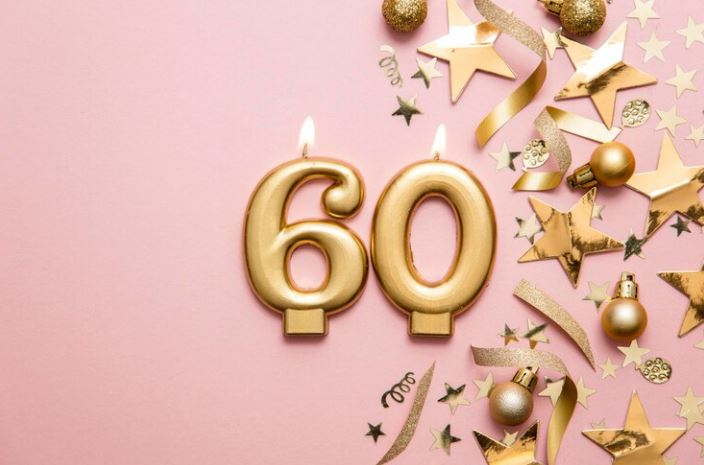

Selecting the perfect theme for a 60th birthday celebration can add a touch of charm and significance to the milestone event. As one reaches this momentous age, it becomes essential to pick a theme that resonates with the honoree’s personality and life journey. A well-chosen theme not only enhances the overall ambiance but also creates lasting memories for both the guest of honor and attendees.

When deciding on a theme, consider the individual’s interests, passions, and experiences. For example, a “Vintage Hollywood” theme could transport guests back to the honoree’s youth, recalling fond memories of classic movies and iconic stars. Alternatively, a “Garden of Wisdom” theme might reflect the person’s love for nature and symbolize the wisdom acquired over the years.

Once the theme is established, infuse it into every aspect of the decoration. From invitations and table settings to centerpieces and party favors, consistency is key to creating a cohesive and delightful atmosphere. Incorporate elements that pay tribute to the guest of honor’s achievements and accomplishments, making them feel cherished and valued on their special day.

## **Best 60th Birthday Venue Decoration**

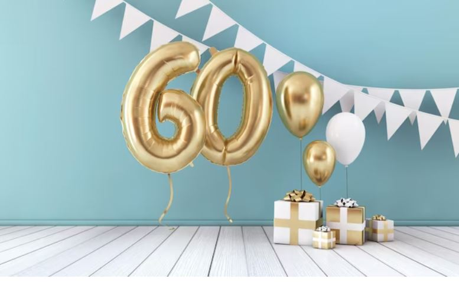

Turning 60 is a momentous occasion that calls for a celebration filled with joy, love, and cherished memories. Creating the perfect ambiance through venue decoration is essential to make this milestone birthday truly exceptional. 

Here are the 60th birthday decoration ideas for crafting the best birthday venue decoration that will leave the guest of honor and guests in awe.

### **1\. Elegant Entrance**

Set the tone right from the start with an eye-catching entrance. Adorn the doorway with a personalized welcome sign or a decorative arch embellished with flowers and balloons. This will create an inviting atmosphere that excites guests for the celebration.

### **2\. Meaningful Photo Display**

Showcase the journey of the honoree’s life through a heartwarming photo display. From childhood snapshots to recent milestones, a gallery of photographs reflecting their life’s adventures will evoke nostalgia and warm feelings among attendees.

### **3\. Milestone Centerpieces**

Decorate each table with centerpieces that represent significant moments in the celebrant’s life. Utilize photographs, keepsakes, and meaningful objects that reflect their interests, hobbies, and accomplishments.

### **4\. Golden Glitz and Glamour**

Embrace the golden theme to honor the 60th milestone. Incorporate gold accents in tablecloths, napkins, balloons, and decorative elements to add a touch of opulence and sophistication to the celebration.

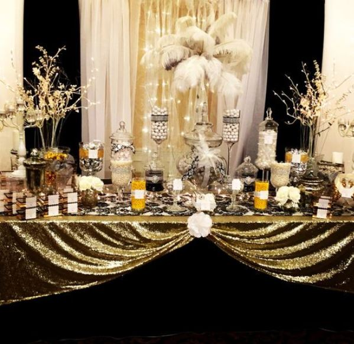

### **5\. Memory Lane Wall**

Dedicate a section of the venue to a “Memory Lane Wall” adorned with heartfelt messages, notes, and well-wishes from friends and family. This interactive display will make the honoree feel cherished and appreciated.

### **6\. Personalized Backdrop**

Create a stunning backdrop for photo opportunities, featuring the honoree’s name, age, and a design that complements the theme. This will be a focal point for capturing beautiful memories throughout the event.

### **7\. Candlelit Elegance**

Illuminate the venue with soft, warm lighting to create an intimate and cozy ambiance. Consider using candles or string lights to add a touch of magic to the surroundings.

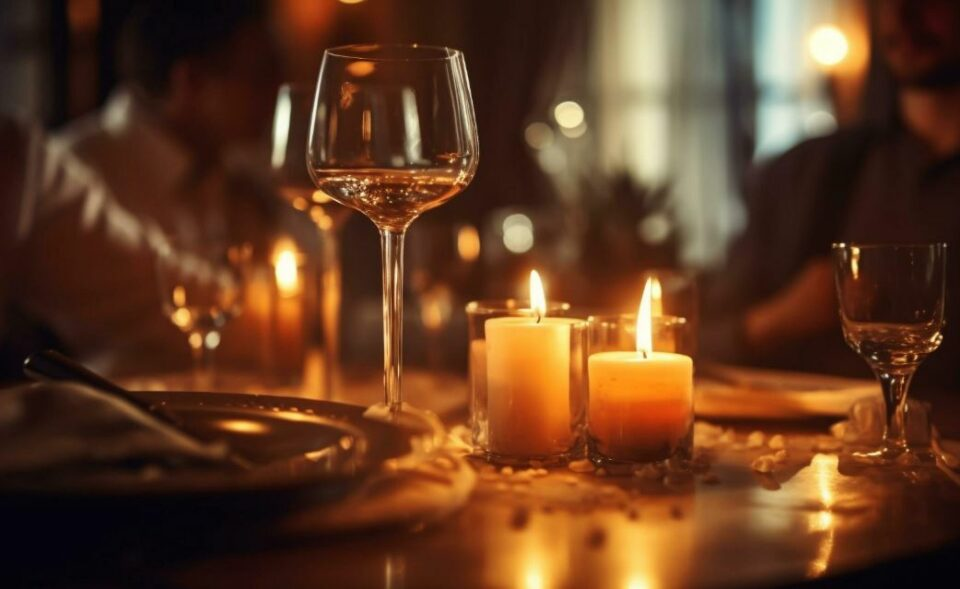

### **8\. Thoughtful Table Settings**

Pay attention to the details in table settings, using elegant dinnerware and personalized place cards. Add a small party favor at each setting as a token of appreciation for the guests’ presence.

### **9\. Sweet Dessert Station**

Design a delectable dessert station adorned with mouthwatering treats. Consider a birthday cake with a design that reflects the theme and showcases the honoree’s personality.

### **10\. Music and Entertainment**

Curate a playlist of the honoree’s favorite songs and tunes that evoke happy memories. Additionally, arrange for entertainment that aligns with the celebrant’s interests, such as a live band or a dance floor.

Remember, the best 60th birthday venue decoration is a heartfelt tribute to the guest of honor. It is an expression of love, appreciation, and celebration of a life well-lived. 

By infusing personal touches and thoughtful details into the décor, you can create an unforgettable experience that the honoree and guests will treasure forever.

## **60th Birthday Balloon Decoration**

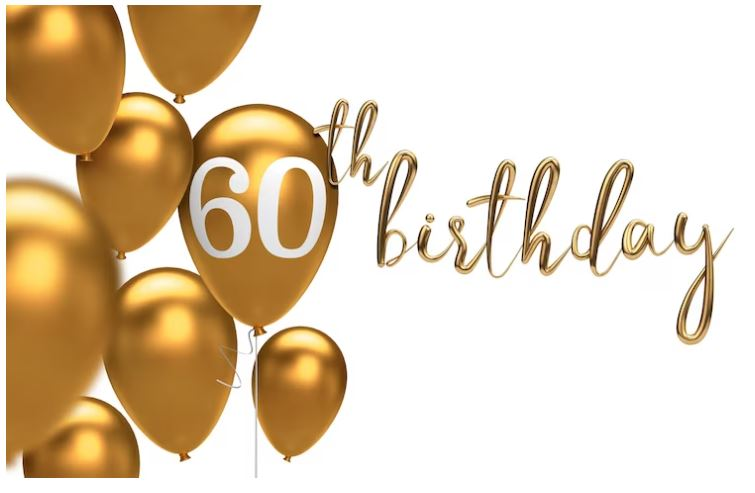

60th Birthday decoration ideas: Balloons are an essential element of any birthday celebration, and when it comes to a 60th birthday, they can add a touch of whimsy and elegance to the festivities. 

Here are some creative and delightful balloon decoration ideas to make the 60th birthday party truly memorable:

### **1\. Gold Confetti Balloons**

Fill transparent balloons with golden confetti to represent the golden age. These dazzling balloons will add a shimmering effect to the decorations and complement the theme perfectly.

### **2\. Number 60 Balloon**

Go big with a giant number “60” balloon display. You can have it in gold, silver, or any color that matches the overall theme. It serves as a fantastic centerpiece and a statement piece for photos.

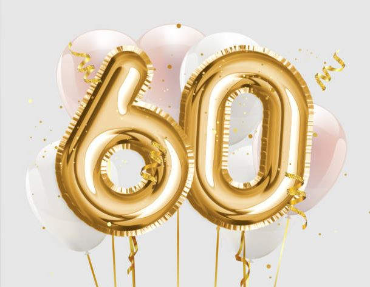

### **3\. Milestone Photo Balloons**

Personalize balloons with photos from the different stages of the celebrant’s life. Among the 60th birthday decoration ideas, it’s a heartwarming way to reminisce about cherished memories and celebrate the journey so far.

### **4\. Balloon Bouquets**

Create beautiful balloon bouquets using a mix of gold, silver, and the celebrant’s favorite colors. Place these bouquets around the venue, on tables, and at the entrance to add a festive atmosphere.

### **5\. Helium Balloon Ceiling**

Fill the ceiling with helium balloons in various colors, creating a dreamy and vibrant setting. It’s an excellent way to make the venue feel more intimate while leaving plenty of room for dancing and mingling.

### **6\. Balloon Arch**

Craft a stunning balloon arch at the entrance or behind the main table. Incorporate the birthday person’s favorite colors or opt for a golden arch to signify this milestone age.

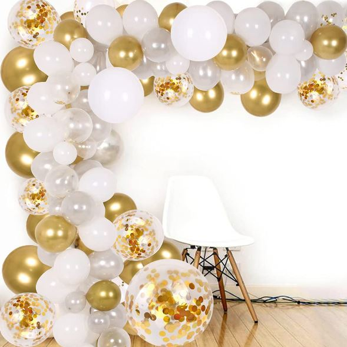

### **7\. Photo Collage Balloons**

Print a collection of photos featuring the celebrant’s life journey and attach them to helium-filled balloons. Let the balloons float around the venue, allowing guests to enjoy the wonderful memories.

### **8\. Balloon Chandelier**

Create a balloon chandelier or hanging balloon clusters above the dining area. This unique decoration adds a touch of elegance and creates a focal point for the party.

### **9\. Balloon Backdrop**

Craft a mesmerizing balloon backdrop for the photo booth area. It will serve as a fantastic spot for guests to take pictures and capture memories.

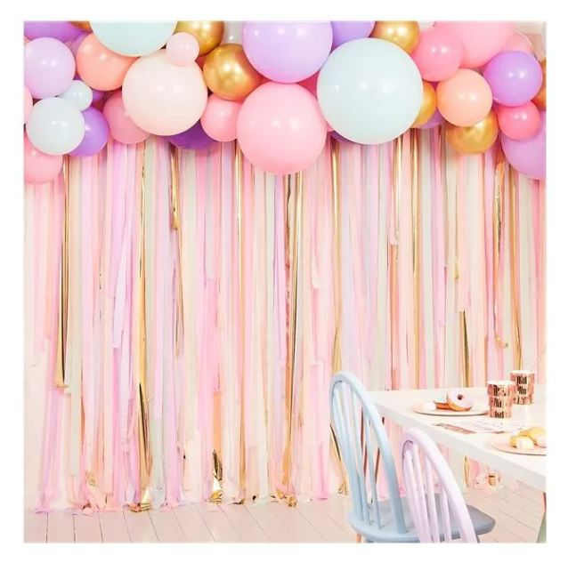

### **10\. Personalized Balloon Messages**

Use large letter balloons to spell out a special message, such as “Happy 60th Birthday” or the celebrant’s name. Place them at the entrance or behind the main table as a charming decoration.

Remember, the key to a successful 60th birthday balloon decoration is to tailor it to the guest of honor’s preferences and style. With these creative ideas, you can transform the venue into a festive and enchanting space that celebrates the honoree’s life and brings joy to all guests.

## **60th Birthday Decoration Ideas: Add Some Personalized Touches**

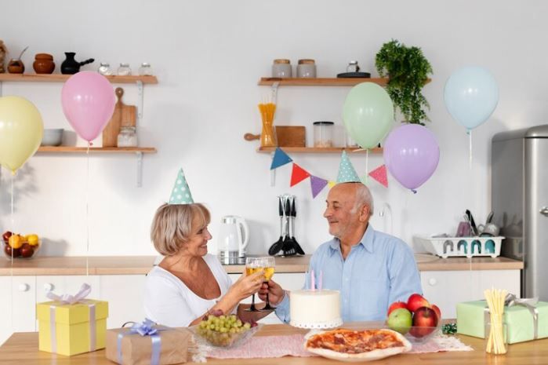

When celebrating a 60th birthday, adding personalized touches to the decorations can make the occasion even more meaningful and memorable. Here are some wonderful ideas to infuse the birthday party with a touch of uniqueness and heartfelt sentiment:

### **1\. Memory Lane Banners**

Create banners or garlands with photographs capturing special moments from the celebrant’s life. Display these along the walls or across the venue, allowing guests to stroll down memory lane and share in the joy of cherished memories.

### **2\. Timeline Table Runner**

Design a table runner that features a timeline of significant milestones in the honoree’s life. From the year they were born to important achievements and life events, this thoughtful addition will serve as a conversation starter and evoke nostalgia.

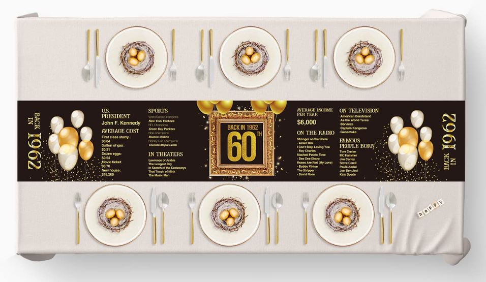

### **3\. Personalized Party Favors**

Prepare personalized party favors for guests to take home as mementos. Consider customizing items with the celebrant’s name, initials, or a special message. These tokens of appreciation will leave a lasting impression.

### **4\. Signature Guestbook**

Set up a guestbook for attendees to leave heartfelt messages, well wishes, and anecdotes for the guest of honor. A personalized guestbook is a wonderful keepsake that the honoree can treasure for years to come.

### **5\. Customized Centerpieces**

Design centerpieces that reflect the celebrant’s interests, hobbies, or favorite things. It could be a collection of miniature objects related to their passions, surrounded by flowers and balloons that match the party theme.

### **6\. Special Tribute Slideshow**

Prepare a slideshow featuring photographs and videos that showcase the honoree’s life journey. Include heartwarming messages from friends and family to honor their impact on others.

### **7\. Memory Jar**

Place a memory jar at the entrance, where guests can write down their favorite memories or [wishes](https://avada.io/loveable/blog/happy-60th-birthday-wishes/) for the celebrant. Later in the evening, the honoree can read these heartfelt notes and feel the love and appreciation from their loved ones.

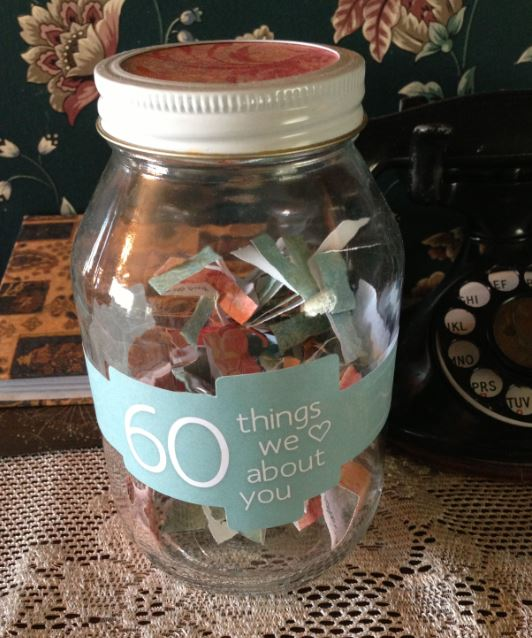

### **8\. Name in Lights**

Illuminate the venue with the guest of honor’s name or initials projected on a wall or dance floor. This personalized touch adds a touch of glamour and celebrates the individual at the heart of the festivities.

### **9\. Custom Cake Topper**

Top off the birthday cake with a customized cake topper featuring the celebrant’s name and age. It’s a small but significant detail that adds a personal touch to the centerpiece dessert.

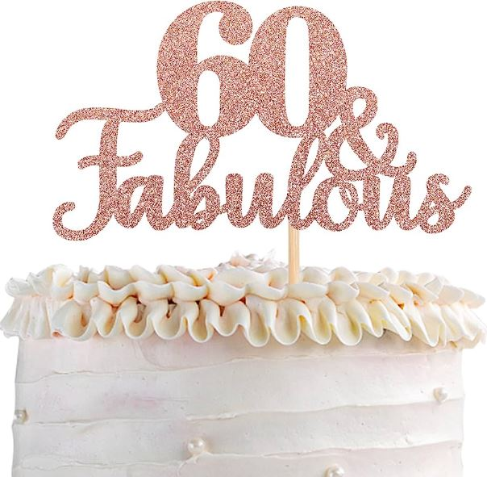

### **10\. Sentimental Quotes**

Throughout the venue, place framed quotes or sayings that hold special meaning for the guest of honor. These inspiring words can uplift spirits and add a touch of sentimentality to the celebration.

Adding personalized touches to a 60th birthday celebration not only makes the event more meaningful but also shows the honoree how much they are loved and appreciated. 

These ideas will help create a warm and touching atmosphere, making the milestone birthday an unforgettable and heartwarming experience for both the guest of honor and all the guests in attendance.

## **60th Birthday Decoration: Lighting and Ambiance**

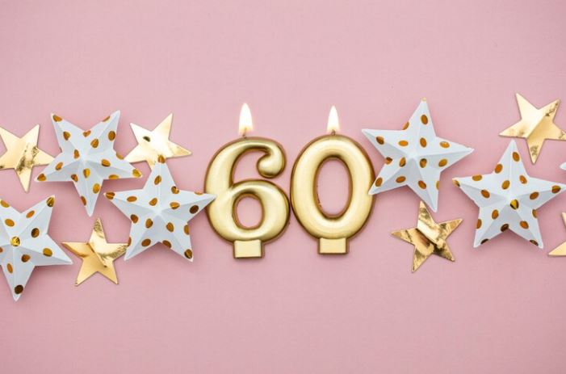

Lighting plays a crucial role in setting the mood and ambiance for any celebration, and a 60th birthday party is no exception. Creating the right lighting atmosphere can transform the venue into a magical and enchanting space, making the milestone event even more memorable.

Here are some fantastic lighting 60th birthday decoration ideas to elevate the ambiance for the celebration.

Remember, the right lighting and ambiance can evoke emotions and create a memorable atmosphere for the 60th birthday celebration. 

Combining various lighting techniques and colors will help transform the venue into a space filled with warmth, joy, and celebration, making it an unforgettable event for the guest of honor and all the guests in attendance.

### **1\. Soft Warm Glow**

Opt for soft, warm lighting to create an intimate and cozy ambiance. Use fairy lights, string lights, or candles on tables, along walkways, and draped on walls to cast a gentle and inviting glow.

### **2\. Golden Elegance**

Embrace the golden theme of the 60th milestone by incorporating golden lighting elements. Gold-hued bulbs or golden lampshades can infuse an air of sophistication and opulence into the décor.

### **3\. Twinkling Starry Night**

Hang twinkling lights from the ceiling to mimic a starry night sky. This ethereal effect can be especially stunning during an evening celebration, evoking a sense of wonder and magic.

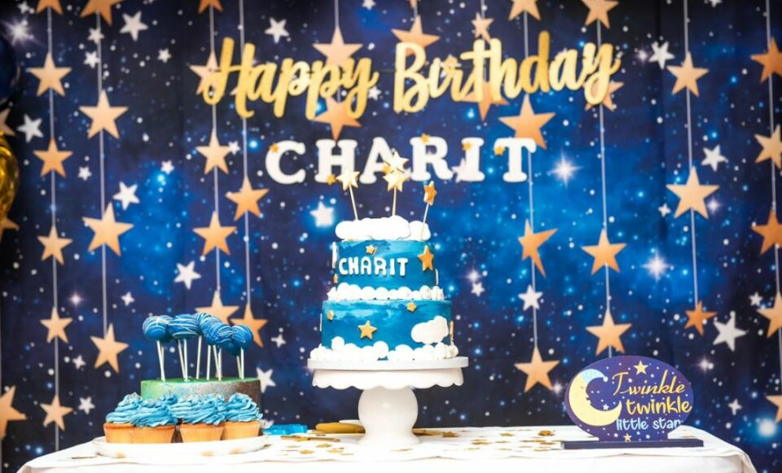

### **4\. Uplighting**

Use uplighting to highlight key elements of the venue, such as pillars, archways, or artwork. This dramatic technique can add depth and dimension to the space.

### **5\. Monogram Lighting**

Project the guest of honor’s initials or name on a wall or dance floor using monogram lighting. It’s a personalized touch that adds an extra special touch to the decorations.

### **6\. Paper Lanterns**

Hang paper lanterns in various colors and sizes to infuse a vibrant and festive atmosphere. These lanterns can be used indoors or outdoors and add a playful element to the décor.

### **7\. Candlelit Pathways**

Line walkways with candles or luminaries to guide guests and create a warm and welcoming entrance. It’s a simple yet elegant way to enhance the overall atmosphere.

### **8\. Colorful Uplighting**

Incorporate LED uplights in different colors to match the party theme or the celebrant’s favorite hues. These dynamic lights can transform the venue’s ambiance throughout the event.

### **9\. Chandeliers**

If the venue allows, consider using chandeliers to add a touch of grandeur and sophistication. Chandeliers can instantly elevate the décor, making it a grand celebration fit for the milestone age.

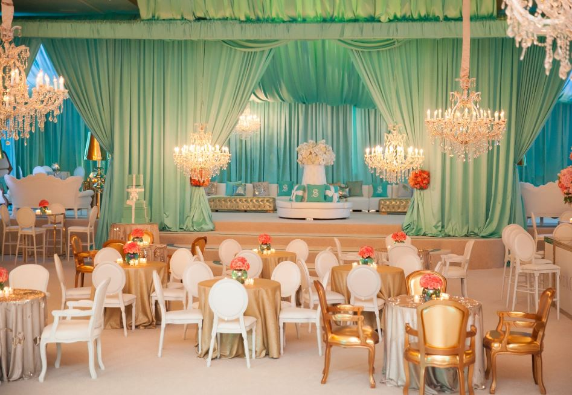

### **10\. Dimmable Lighting**

If possible, install dimmable lighting to adjust the brightness as the celebration progresses. Dimming the lights during speeches or creating a cozy setting during dinner can enhance the overall experience.

## **60th Birthday Cake and Dessert Table Decoration** 

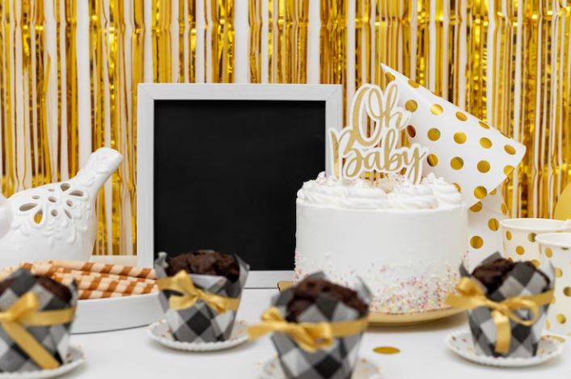

The cake and dessert table at a 60th birthday celebration is not only a delectable treat for the taste buds but also serves as a delightful centerpiece for the entire event. 

Designing a cake and dessert table with careful thought and creativity can make the celebration even more special. Here are some enchanting 60th birthday decoration ideas to decorate the cake and dessert table:

### **1\. Elegant Cake**

The centerpiece of the dessert table should be an elegant birthday cake that represents the celebrant’s personality and interests. Consider a classic tiered cake with gold accents, intricate floral designs, or the number “60” on top. 

You can also opt for a cake shaped like something meaningful to the honoree, such as a hobby they love or a symbol of their life achievements.

### **2\. Golden Touch**

Embrace the golden theme for the 60th milestone by incorporating golden elements into the cake design. Gold frosting, edible gold leaf, or golden decorations can add a touch of sophistication and grandeur to the dessert table.

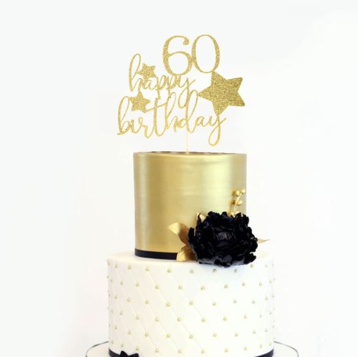

### **3\. Photo Cake Topper**

Personalize the cake with a photo cake topper featuring a picture of the birthday celebrant from their younger days, evoking nostalgia and memories of their life journey.

### **4\. Cupcake Tower**

Arrange a tower of cupcakes with varying flavors and decorative toppers. Cupcakes allow for creativity and variety, and they are easy for guests to grab and enjoy.

### **5\. Dessert Variety**

Offer a diverse selection of desserts on the table, such as macarons, cookies, cake pops, and mini tarts. These bite-sized treats add visual appeal and cater to different taste preferences.

### **6\. Custom Dessert Labels**

Create personalized labels or tags for each dessert item, indicating their names and ingredients. It adds a professional touch and helps guests easily identify their favorite treats.

### **7\. Floral Arrangements**

Decorate the cake and dessert table with fresh flowers that complement the overall party theme. Floral arrangements lend a touch of elegance and beauty to the presentation.

### **8\. Vintage Dessert Stands**

Use vintage-inspired cake stands and dessert platters to display the treats. These stands add a touch of nostalgia and refinement to the dessert table setup.

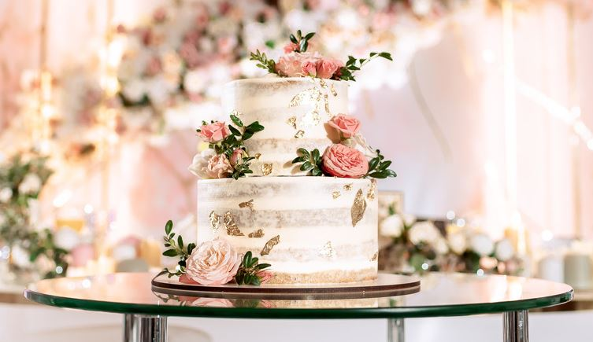

### **9\. Birthday Candle Display**

Surround the cake with 60th birthday candles, creating a stunning display. You can use decorative candle holders or candle votives to enhance the overall look.

### **10\. Dessert Table Backdrop**

Create a beautiful backdrop behind the dessert table that complements the theme and ties the entire setup together. Use fabrics, balloons, or decorative elements that match the party’s color scheme.

Remember, the cake and dessert table decoration is an opportunity to showcase creativity, love, and appreciation for the guest of honor. 

By infusing personalized elements and paying attention to detail, you can create a visually stunning and delectable display that will leave a lasting impression on the honoree and all the guests, making the 60th birthday celebration a sweet and unforgettable occasion.

## **60th Birthday Outdoor Decoration Ideas**

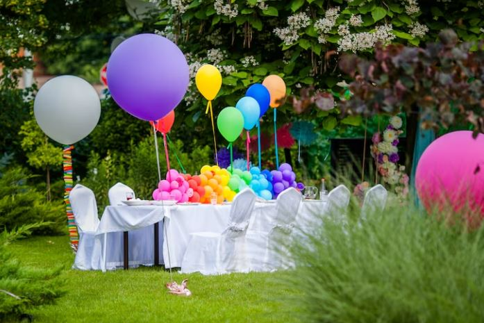

Hosting a 60th birthday celebration outdoors provides a wonderful opportunity to embrace nature’s beauty while creating a warm and festive atmosphere. Here are some delightful outdoor decoration ideas to make the milestone birthday party a truly memorable and picturesque event:

### **1\. Nature-inspired Entrance**

Welcome guests with a charming entrance adorned with potted plants, flowers, and rustic signage leading the way to the celebration area. A floral arch or balloon garland can also add a touch of grandeur to the entryway.

### **2\. Garden Party Vibes**

Embrace a garden party theme with floral arrangements, lanterns, and fairy lights. Hang string lights or fairy lights in trees and bushes to create a magical ambiance as the sun sets.

### **3\. Vintage Seating**

Arrange vintage or rustic seating areas with wooden benches, cushions, and throw pillows. This creates cozy spots for guests to relax and enjoy the festivities.

### **4\. Picnic-Style Dining**

Set up picnic-style tables with checkered tablecloths and floral centerpieces. Opt for eco-friendly disposable tableware to keep the setup hassle-free and environmentally conscious.

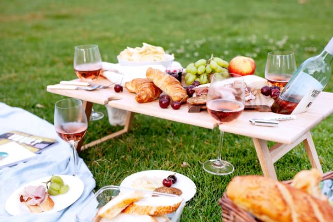

### **5\. Balloon Pathway**

Create a charming balloon pathway leading to the main celebration area. Line the pathway with balloons in the celebrant’s favorite colors, guiding guests to the heart of the party.

### **6\. Outdoor Lounge**

Design a comfortable outdoor lounge area with plush seating, rugs, and decorative cushions. This inviting space encourages guests to mingle and enjoy the outdoor setting.

### **7\. Personalized Banners**

Hang personalized banners displaying the celebrant’s name or a special birthday message. It adds a personalized touch to the outdoor décor.

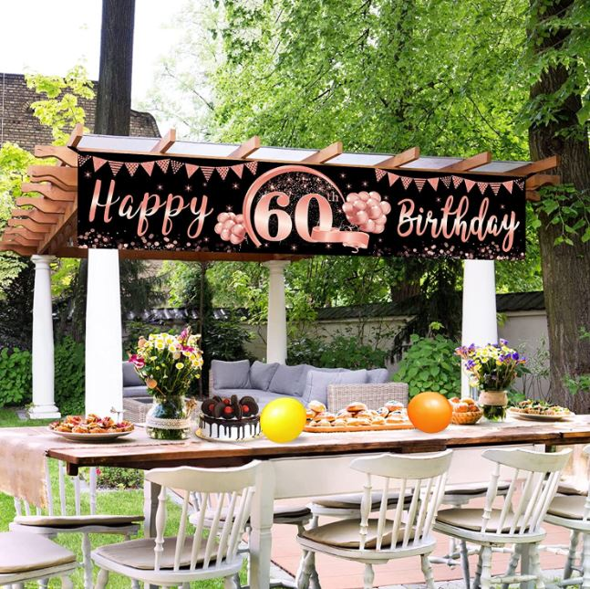

### **8\. Refreshment Stations**

Set up refreshing drink stations with infused water, lemonades, and iced teas. Decorate the beverage dispensers with fresh fruits and herbs for an enticing display.

### **9\. Fire Pit Gathering**

If the celebration continues into the evening, create a cozy gathering area around a fire pit. Provide blankets or shawls to keep guests warm and comfortable.

### **10\. Lantern Walkway**

Illuminate pathways with lanterns or luminaries to guide guests as they move around the outdoor space. It not only adds a practical element but also enhances the magical atmosphere.

### **11\. Outdoor Photo Booth**

Create a designated photo booth area with a picturesque backdrop that complements the outdoor setting. Supply props and accessories to encourage guests to capture fun memories.

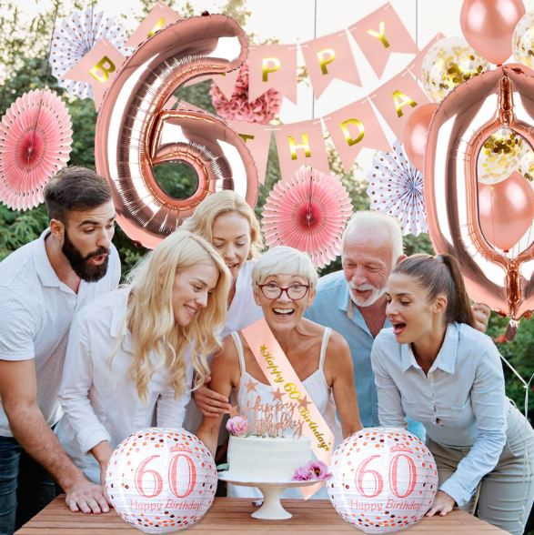

### **12\. Nature-inspired Centerpieces**

Decorate tables with centerpieces inspired by nature, such as flower arrangements, potted plants, or wooden lanterns adorned with greenery.

Remember, when decorating for a 60th birthday celebration outdoors, embrace the natural beauty of the surroundings and incorporate personalized elements that reflect the honoree’s interests and style. 

With these outdoor 60th birthday decoration ideas, you can create an enchanting and joyous atmosphere, making the milestone birthday celebration an unforgettable experience for the guest of honor and all the attendees.

**Related:**

- [60th Birthday Gifts](https://avada.io/loveable/60th-birthday-gifts/)

- [Funny 60th Birthday Gifts](https://avada.io/loveable/funny-60th-birthday-gifts/)

## **To Wrap Up,**

Turning 60 is a significant milestone, and it calls for a splendid celebration surrounded by love, warmth, and cherished company. Whether you opt for an exciting outdoor park party with fun activities or a serene beach gathering with your favorite tunes, there’s something to suit every preference with these **60th birthday decoration ideas** in this post.

To make your party truly exceptional, consider adding special touches like 60th birthday candles, vibrant balloons, and a captivating theme that will delight all attendees. This combination of thoughtful elements will ensure your celebration stands out and creates lasting memories for the guest of honor and everyone present.

- [60th Birthday Decoration: Choosing a Theme](https://avada.io/loveable/blog/60th-birthday-decoration-ideas/#wp-block-heading-2-4)
- [Best 60th Birthday Venue Decoration](https://avada.io/loveable/blog/60th-birthday-decoration-ideas/#wp-block-heading-2-9)
    - [1\. Elegant Entrance](https://avada.io/loveable/blog/60th-birthday-decoration-ideas/#wp-block-heading-3-13)
    - [2\. Meaningful Photo Display](https://avada.io/loveable/blog/60th-birthday-decoration-ideas/#wp-block-heading-3-15)
    - [3\. Milestone Centerpieces](https://avada.io/loveable/blog/60th-birthday-decoration-ideas/#wp-block-heading-3-17)
    - [4\. Golden Glitz and Glamour](https://avada.io/loveable/blog/60th-birthday-decoration-ideas/#wp-block-heading-3-19)
    - [5\. Memory Lane Wall](https://avada.io/loveable/blog/60th-birthday-decoration-ideas/#wp-block-heading-3-22)
    - [6\. Personalized Backdrop](https://avada.io/loveable/blog/60th-birthday-decoration-ideas/#wp-block-heading-3-24)
    - [7\. Candlelit Elegance](https://avada.io/loveable/blog/60th-birthday-decoration-ideas/#wp-block-heading-3-26)
    - [8\. Thoughtful Table Settings](https://avada.io/loveable/blog/60th-birthday-decoration-ideas/#wp-block-heading-3-29)
    - [9\. Sweet Dessert Station](https://avada.io/loveable/blog/60th-birthday-decoration-ideas/#wp-block-heading-3-31)
    - [10\. Music and Entertainment](https://avada.io/loveable/blog/60th-birthday-decoration-ideas/#wp-block-heading-3-33)
- [60th Birthday Balloon Decoration](https://avada.io/loveable/blog/60th-birthday-decoration-ideas/#wp-block-heading-2-37)
    - [1\. Gold Confetti Balloons](https://avada.io/loveable/blog/60th-birthday-decoration-ideas/#wp-block-heading-3-41)
    - [2\. Number 60 Balloon](https://avada.io/loveable/blog/60th-birthday-decoration-ideas/#wp-block-heading-3-43)
    - [3\. Milestone Photo Balloons](https://avada.io/loveable/blog/60th-birthday-decoration-ideas/#wp-block-heading-3-46)
    - [4\. Balloon Bouquets](https://avada.io/loveable/blog/60th-birthday-decoration-ideas/#wp-block-heading-3-48)
    - [5\. Helium Balloon Ceiling](https://avada.io/loveable/blog/60th-birthday-decoration-ideas/#wp-block-heading-3-50)
    - [6\. Balloon Arch](https://avada.io/loveable/blog/60th-birthday-decoration-ideas/#wp-block-heading-3-52)
    - [7\. Photo Collage Balloons](https://avada.io/loveable/blog/60th-birthday-decoration-ideas/#wp-block-heading-3-55)
    - [8\. Balloon Chandelier](https://avada.io/loveable/blog/60th-birthday-decoration-ideas/#wp-block-heading-3-57)
    - [9\. Balloon Backdrop](https://avada.io/loveable/blog/60th-birthday-decoration-ideas/#wp-block-heading-3-59)
    - [10\. Personalized Balloon Messages](https://avada.io/loveable/blog/60th-birthday-decoration-ideas/#wp-block-heading-3-62)
- [60th Birthday Decoration Ideas: Add Some Personalized Touches](https://avada.io/loveable/blog/60th-birthday-decoration-ideas/#wp-block-heading-2-65)
    - [1\. Memory Lane Banners](https://avada.io/loveable/blog/60th-birthday-decoration-ideas/#wp-block-heading-3-68)
    - [2\. Timeline Table Runner](https://avada.io/loveable/blog/60th-birthday-decoration-ideas/#wp-block-heading-3-70)
    - [3\. Personalized Party Favors](https://avada.io/loveable/blog/60th-birthday-decoration-ideas/#wp-block-heading-3-73)
    - [4\. Signature Guestbook](https://avada.io/loveable/blog/60th-birthday-decoration-ideas/#wp-block-heading-3-75)
    - [5\. Customized Centerpieces](https://avada.io/loveable/blog/60th-birthday-decoration-ideas/#wp-block-heading-3-77)
    - [6\. Special Tribute Slideshow](https://avada.io/loveable/blog/60th-birthday-decoration-ideas/#wp-block-heading-3-79)
    - [7\. Memory Jar](https://avada.io/loveable/blog/60th-birthday-decoration-ideas/#wp-block-heading-3-81)
    - [8\. Name in Lights](https://avada.io/loveable/blog/60th-birthday-decoration-ideas/#wp-block-heading-3-84)
    - [9\. Custom Cake Topper](https://avada.io/loveable/blog/60th-birthday-decoration-ideas/#wp-block-heading-3-86)
    - [10\. Sentimental Quotes](https://avada.io/loveable/blog/60th-birthday-decoration-ideas/#wp-block-heading-3-89)
- [60th Birthday Decoration: Lighting and Ambiance](https://avada.io/loveable/blog/60th-birthday-decoration-ideas/#wp-block-heading-2-93)
    - [1\. Soft Warm Glow](https://avada.io/loveable/blog/60th-birthday-decoration-ideas/#wp-block-heading-3-99)
    - [2\. Golden Elegance](https://avada.io/loveable/blog/60th-birthday-decoration-ideas/#wp-block-heading-3-101)
    - [3\. Twinkling Starry Night](https://avada.io/loveable/blog/60th-birthday-decoration-ideas/#wp-block-heading-3-103)
    - [4\. Uplighting](https://avada.io/loveable/blog/60th-birthday-decoration-ideas/#wp-block-heading-3-106)
    - [5\. Monogram Lighting](https://avada.io/loveable/blog/60th-birthday-decoration-ideas/#wp-block-heading-3-108)
    - [6\. Paper Lanterns](https://avada.io/loveable/blog/60th-birthday-decoration-ideas/#wp-block-heading-3-110)
    - [7\. Candlelit Pathways](https://avada.io/loveable/blog/60th-birthday-decoration-ideas/#wp-block-heading-3-112)
    - [8\. Colorful Uplighting](https://avada.io/loveable/blog/60th-birthday-decoration-ideas/#wp-block-heading-3-114)
    - [9\. Chandeliers](https://avada.io/loveable/blog/60th-birthday-decoration-ideas/#wp-block-heading-3-116)
    - [10\. Dimmable Lighting](https://avada.io/loveable/blog/60th-birthday-decoration-ideas/#wp-block-heading-3-119)
- [60th Birthday Cake and Dessert Table Decoration](https://avada.io/loveable/blog/60th-birthday-decoration-ideas/#wp-block-heading-2-121) 
    - [1\. Elegant Cake](https://avada.io/loveable/blog/60th-birthday-decoration-ideas/#wp-block-heading-3-125)
    - [2\. Golden Touch](https://avada.io/loveable/blog/60th-birthday-decoration-ideas/#wp-block-heading-3-128)
    - [3\. Photo Cake Topper](https://avada.io/loveable/blog/60th-birthday-decoration-ideas/#wp-block-heading-3-131)
    - [4\. Cupcake Tower](https://avada.io/loveable/blog/60th-birthday-decoration-ideas/#wp-block-heading-3-133)
    - [5\. Dessert Variety](https://avada.io/loveable/blog/60th-birthday-decoration-ideas/#wp-block-heading-3-135)
    - [6\. Custom Dessert Labels](https://avada.io/loveable/blog/60th-birthday-decoration-ideas/#wp-block-heading-3-137)
    - [7\. Floral Arrangements](https://avada.io/loveable/blog/60th-birthday-decoration-ideas/#wp-block-heading-3-139)
    - [8\. Vintage Dessert Stands](https://avada.io/loveable/blog/60th-birthday-decoration-ideas/#wp-block-heading-3-141)
    - [9\. Birthday Candle Display](https://avada.io/loveable/blog/60th-birthday-decoration-ideas/#wp-block-heading-3-144)
    - [10\. Dessert Table Backdrop](https://avada.io/loveable/blog/60th-birthday-decoration-ideas/#wp-block-heading-3-146)
- [60th Birthday Outdoor Decoration Ideas](https://avada.io/loveable/blog/60th-birthday-decoration-ideas/#wp-block-heading-2-150)
    - [1\. Nature-inspired Entrance](https://avada.io/loveable/blog/60th-birthday-decoration-ideas/#wp-block-heading-3-153)
    - [2\. Garden Party Vibes](https://avada.io/loveable/blog/60th-birthday-decoration-ideas/#wp-block-heading-3-155)
    - [3\. Vintage Seating](https://avada.io/loveable/blog/60th-birthday-decoration-ideas/#wp-block-heading-3-157)
    - [4\. Picnic-Style Dining](https://avada.io/loveable/blog/60th-birthday-decoration-ideas/#wp-block-heading-3-159)
    - [5\. Balloon Pathway](https://avada.io/loveable/blog/60th-birthday-decoration-ideas/#wp-block-heading-3-162)
    - [6\. Outdoor Lounge](https://avada.io/loveable/blog/60th-birthday-decoration-ideas/#wp-block-heading-3-164)
    - [7\. Personalized Banners](https://avada.io/loveable/blog/60th-birthday-decoration-ideas/#wp-block-heading-3-166)
    - [8\. Refreshment Stations](https://avada.io/loveable/blog/60th-birthday-decoration-ideas/#wp-block-heading-3-169)
    - [9\. Fire Pit Gathering](https://avada.io/loveable/blog/60th-birthday-decoration-ideas/#wp-block-heading-3-171)
    - [10\. Lantern Walkway](https://avada.io/loveable/blog/60th-birthday-decoration-ideas/#wp-block-heading-3-173)
    - [11\. Outdoor Photo Booth](https://avada.io/loveable/blog/60th-birthday-decoration-ideas/#wp-block-heading-3-175)
    - [12\. Nature-inspired Centerpieces](https://avada.io/loveable/blog/60th-birthday-decoration-ideas/#wp-block-heading-3-178)
- [To Wrap Up,](https://avada.io/loveable/blog/60th-birthday-decoration-ideas/#wp-block-heading-2-185)

### [Rose Bryne](https://avada.io/loveable/author/rose/)

Hi, I'm Rose! I love animals and spending time with kids. At Loveable, I help people find unique gifts for special occasions like Valentine's Day, housewarmings, and graduations. I enjoy finding gifts for kids, teens, and animal lovers that match their interests and personalities. Making gift-giving a pleasant experience is my priority. Let me assist you in finding the perfect gift!

- [Twitter](https://twitter.com/intent/tweet)
- [Facebook](https://www.facebook.com/sharer/sharer.php)
- [instagram](https://avada.io/loveable/blog/60th-birthday-decoration-ideas/)
- [pinterest](https://www.pinterest.com/loveablellc/)

## Related Posts

[### 30 Best 4 Year Old Birthday Party Ideas For A Memorable Celebration](https://avada.io/loveable/blog/4-year-old-birthday-party-ideas/) 

[

### 16th Birthday Party Ideas to Make an Unforgettable Day

](https://avada.io/loveable/blog/16th-birthday-party-ideas/)

[

### 150+ Inspirational Birthday Quotes to Spread Joy on Special Day

](https://avada.io/loveable/blog/inspirational-birthday-quotes/)

[

### 160+ Birthday Wishes for Wife to Express Eternal Love

](https://avada.io/loveable/blog/birthday-wishes-for-wife/)

[### 90+ Heart Touching Birthday Wishes for Niece to Make Her Day Extra Special](https://avada.io/loveable/blog/birthday-wishes-for-niece/)
