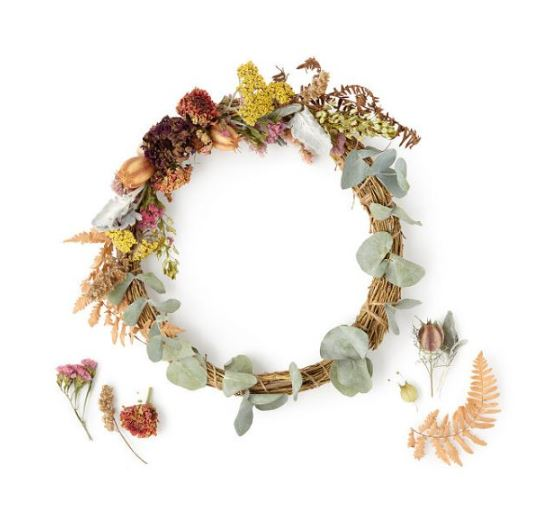

This article has been written and researched by our expert Loveable through a precise methodology. [Learn more about our methodology](https://avada.io/loveable/our-methodological.html)

[Loveable](https://avada.io/loveable/) > [Blog](https://avada.io/loveable/blog/) > [Holiday](https://avada.io/loveable/holiday/)

# Christmas Door Decorations: 25 Creative Ideas to Welcome the Holidays

Written by [Blake Simpson](https://avada.io/loveable/author/blake/) Last Updated on September 07, 2023

- [25 Best Ideas for Christmas Door Decorations](https://avada.io/loveable/blog/christmas-door-decorations/#wp-block-heading-2-3)
    - [Evergreen Outdoor Christmas Garland](https://avada.io/loveable/blog/christmas-door-decorations/#wp-block-heading-3-4)
    - [Let It Grow](https://avada.io/loveable/blog/christmas-door-decorations/#wp-block-heading-3-9)
    - [Lambs Ear Christmas Door Decor](https://avada.io/loveable/blog/christmas-door-decorations/#wp-block-heading-3-12)
    - [Glitter and Crystal Christmas Door Garland](https://avada.io/loveable/blog/christmas-door-decorations/#wp-block-heading-3-16)
    - [Solar Power Star String Light Door Decor](https://avada.io/loveable/blog/christmas-door-decorations/#wp-block-heading-3-20)
    - [Cordless Christmas Front Door Wreath](https://avada.io/loveable/blog/christmas-door-decorations/#wp-block-heading-3-24)
    - [DIY Dried Flower Wreath Kit](https://avada.io/loveable/blog/christmas-door-decorations/#wp-block-heading-3-28)
    - [Noble Fir Floral Christmas Door Wreath](https://avada.io/loveable/blog/christmas-door-decorations/#wp-block-heading-3-33)
    - [Pre-Lit Berry Christmas Door Wreath](https://avada.io/loveable/blog/christmas-door-decorations/#wp-block-heading-3-37)
    - [Liora Manne Christmas Decor Doormat](https://avada.io/loveable/blog/christmas-door-decorations/#wp-block-heading-3-42)
    - [Merry Christmas Garage Door Decor](https://avada.io/loveable/blog/christmas-door-decorations/#wp-block-heading-3-46)
    - [Work With Architecture](https://avada.io/loveable/blog/christmas-door-decorations/#wp-block-heading-3-50)
    - [Let The Light In](https://avada.io/loveable/blog/christmas-door-decorations/#wp-block-heading-3-53)
    - [Bring Some Spring](https://avada.io/loveable/blog/christmas-door-decorations/#wp-block-heading-3-56)
    - [Go Big](https://avada.io/loveable/blog/christmas-door-decorations/#wp-block-heading-3-59)
    - [An Alternative “Wreath”](https://avada.io/loveable/blog/christmas-door-decorations/#wp-block-heading-3-62)
    - [Simple Yet Playful](https://avada.io/loveable/blog/christmas-door-decorations/#wp-block-heading-3-66)
    - [Farmhouse Chic](https://avada.io/loveable/blog/christmas-door-decorations/#wp-block-heading-3-70)
    - [Gilded Pinecones](https://avada.io/loveable/blog/christmas-door-decorations/#wp-block-heading-3-73)
    - [Nutcracker Christmas Door Decor](https://avada.io/loveable/blog/christmas-door-decorations/#wp-block-heading-3-76)
    - [Christmas Door Decor Banners](https://avada.io/loveable/blog/christmas-door-decorations/#wp-block-heading-3-79)
    - [Christmas Wreath Murals for Garage Door](https://avada.io/loveable/blog/christmas-door-decorations/#wp-block-heading-3-83)
    - [Cartoon Reindeer Christmas Doormat](https://avada.io/loveable/blog/christmas-door-decorations/#wp-block-heading-3-86)
    - [Christmas Tree Doormat](https://avada.io/loveable/blog/christmas-door-decorations/#wp-block-heading-3-90)
    - [Patio Door Christmas Snowflake Clings](https://avada.io/loveable/blog/christmas-door-decorations/#wp-block-heading-3-93)
- [In Conclusion,](https://avada.io/loveable/blog/christmas-door-decorations/#wp-block-heading-2-97)

Step into a world where holiday cheer and creativity collide, transforming ordinary doors into enchanting portals of festive delight. ‘Tis the season to adorn your doorway with the magic of Christmas, and we’ve got you covered with 25 sensational ideas that will make your guests’ hearts skip a beat. From traditional wreaths to whimsical ornaments, prepare to be inspired as we dive into a wonderland of **Christmas door decorations**.

Get ready to welcome the holidays in style and spread the joy with these captivating and innovative ideas. Let’s unlock the door to imagination and embark on a journey through the realm of holiday enchantment!

## **25 Best Ideas for Christmas Door Decorations**

### **Evergreen Outdoor Christmas Garland**

This premium holiday door decor ensemble features a pair of extended garlands that can be displayed as a cohesive unit or individually. Each garland boasts charming embellishments such as petite red berries, pinecones, and pre-installed sparkling lights.

Utilize the convenient built-in timer to conserve energy and extend the longevity of these garlands, ensuring you can enjoy their festive charm for many holiday seasons to come.

[Buy Evergreen Outdoor Christmas Garland!](https://fave.co/3FRk1Bm)

### **Let It Grow**

Frequently, the simplest method to infuse your front porch with a touch of festive ambiance is through the addition of a diverse selection of plants, especially those that remain lush and vibrant throughout the year, such as evergreens. 

### **Lambs Ear Christmas Door Decor**

Crafted meticulously by hand, each piece ensures remarkable fullness and top-notch quality. It can be displayed indoors to brighten up your space or used outdoors, best suited for placement under the shelter of a porch or a patio overhang.

[Buy Lambs Ear Christmas Door Decor!](https://www.etsy.com/listing/871041018/greenery-garland-christmas-greenery-for)

### **Glitter and Crystal Christmas Door Garland**

Elevate your Christmas door decor with a touch of elegance and luminosity, courtesy of this dazzling garland design. The inclusion of glittery leaves and frosted pine needles imparts a modern flair, and the dangling crystal accents provide a luxurious highlight. Employ this garland to embellish not only your front door but also your interior doors, infusing a stylish festive vibe throughout your home.

[Buy Glitter and Crystal Christmas Door Garland!](https://www.amazon.com/Valery-Madelyn-Christmas-Decorations-Ornaments/dp/B08863M4BL/)

### **Solar Power Star String Light Door Decor**

Eliminate the hassle of dealing with batteries or extension cords to illuminate your enchanting winter doorway decor. This string light set operates entirely on solar power, harnessing energy during the daytime to offer a soft and continuous glow throughout the night. Each string boasts 30 transparent LED lights shaped like stars.

[Buy Solar Power Star String Light Door Decor!](https://www.brookstone.com/products/solar-powered-mini-string-lights-with-30-stars)

### **Cordless Christmas Front Door Wreath**

A quintessential component of any traditional Christmas door decor, the classic wreath is a must-have. This particular wreath is powered by batteries and adorned with soft, warm white lights, complemented by graceful pinecones. It comes with a convenient built-in timer, ensuring the gentle illumination lasts exactly as long as you desire.

[Buy Cordless Christmas Front Door Wreath!](https://www.brookstone.com/products/cordless-pre-lit-led-mixed-cedar-wreath)

### **DIY Dried Flower Wreath Kit**

Craft a personalized wreath with this ingenious DIY kit from Krista Freitas. Each set includes authentic hand-dried flowers and foliage, meticulously cultivated from seed on eco-friendly farms.

You can utilize the kit as is for a delightful cottage chic Christmas vibe, or unleash your creativity by adding your preferred accents, such as baubles, pine tree trimmings, and ribbons, transforming it into a classic and traditional holiday masterpiece.

[Buy DIY Dried Flower Wreath Kit!](https://www.etsy.com/listing/1329852993/diy-assembly-kit-for-wreath-arrangement)

### **Noble Fir Floral Christmas Door Wreath**

Genuine blooms and foliage infuse this striking wreath with a captivating whimsy, carrying the alluring scents of nature’s seasonal transition. Crafted from fresh organic noble fir cultivated on a farm owned by a woman, this piece is elegantly adorned with cedar, eucalyptus, and a variety of blossoms. To ensure its durability, simply mist it regularly, allowing you to enjoy its beauty for an extended period.

[But Noble Fir Floral Christmas Door Wreath!](https://www.etsy.com/listing/1354591790/wreath-fresh-wreath-holiday-wreath-fir)

### **Pre-Lit Berry Christmas Door Wreath**

Bursting with vibrant red berries, frost-covered pinecones, delicate white snowflakes, and charming reindeer silhouettes, this wreath arrives already adorned in festive splendor.

Crafted with meticulous attention to detail, the lifelike quality of the pine needles could easily fool your guests into thinking it’s freshly made. Each wreath comes pre-lit and operates on battery power, ensuring a hassle-free and enchanting holiday display.

[Buy Pre-Lit Berry Christmas Door Wreath!](http://pre-lit%20berry%20christmas%20door%20wreath)

### **Liora Manne Christmas Decor Doormat**

Liora Manne, a distinguished artist renowned for her textile masterpieces, brings her artistic brilliance to your doorstep this holiday season. Embrace the festive spirit with this doormat showcasing three charming reindeer embellished with vibrant poinsettias. Crafted meticulously from 100% natural coconut coir, it exemplifies eco-friendliness and ensures enduring strength and durability.

[Buy Liora Manne Christmas Decor Doormat!](https://www.amazon.com/Liora-Manne-Natura-Indoor-Outdoor/dp/B07BTJK61X)

### **Merry Christmas Garage Door Decor**

Ensure your garage doors join in the festive fun with this holiday magnet set, designed to adhere firmly to any metal surface, giving your guests a warm welcome as they arrive. Please be aware that this set is relatively compact, with each letter measuring 5 inches in height. This makes it an ideal addition to complement other Christmas door decorations you might choose to place on your garage door.

[Buy Merry Christmas Garage Door Decor!](https://www.amazon.com/Merry-Christmas-Garage-Door-Decorations/dp/B0B8GTG2TB)

### **Work With Architecture**

While not everyone’s residence may boast an entrance as stunning as Chandos Dodson Epley’s in Houston, if you are fortunate enough, we recommend strategizing your Christmas door decorations to harmonize with the existing architectural elements rather than competing with them.

### **Let The Light In**

The desire for an alpine chic Christmas look is widespread, but when you find yourself in sunnier locales, it’s advantageous to embrace a lighter, more breezy atmosphere. Interior designer Roger Higgins skillfully introduced a subdued holiday theme into this project, harmonizing glass doors with a sizable wreath and other green embellishments. If you’re in California or Florida, this could be the ideal source of inspiration.

### **Bring Some Spring**

Typically, Christmas colors revolve around the classic red, white, and green trio, resulting in homes and front doors sporting similar palettes. To stand out, consider infusing a burst of vibrant color, such as this cheerful yellow Chalk Paint from Annie Sloan. “Infusing a touch of uniqueness into Christmas decor is a personal goal,” says Sloan. “Blending the conventional with the unexpected prompts a second glance, adding a refreshing twist.”

### **Go Big**

Why limit yourself to a single wreath when you can elevate your front door decor with not one, but two exquisite wreaths, accompanied by a magnificent floral arrangement? 

### **An Alternative “Wreath”**

Infuse a delightful twist into your typical holiday wreath tradition by embracing charming vintage elements. Consider adorning your front door with unique touches such as old ice skates, just as demonstrated by the creative touch of She Holds Dearly. 

These nostalgic additions not only add a touch of visual elegance, but also evoke a sense of nostalgia, bringing back cherished memories of past skating adventures during the holiday season. Embracing such timeless items in your holiday decor allows you to create a warm and inviting atmosphere that resonates with the heartwarming spirit of the season.

### **Simple Yet Playful**

With a pastel pink door as the centerpiece, combined with the elegance of a white pom-pom wreath and a lively garland adorned with radiant string lights, you can effortlessly capture the perfect festive atmosphere. 

The pastel hue of the door adds a touch of elegance, while the playful pom-pom wreath brings a sense of charm and cheer. The vibrant garland, interwoven with sparkling string lights, not only creates a captivating visual display but also radiates the joyful spirit of the holiday season. 

### **Farmhouse Chic**

A rustic, well-crafted basket not only adds a touch of cozy farmhouse elegance but also provides a unique canvas to showcase your holiday foliage. Imagine filling the basket with an array of lush evergreens, sprigs of holly, or even fragrant eucalyptus branches, evoking the enchanting scent of the holiday season. The natural textures of the basket, combined with the vibrant hues of the greens, instantly elevate your entrance with a warm and inviting ambiance.

### **Gilded Pinecones**

Elevate your holiday door decor with the elegant allure of gilded pinecones. These stunning Christmas door decorations possess a timeless charm that can effortlessly enhance various creative ideas, setting the stage for a remarkable first impression. The versatility of gilded pinecones allows them to seamlessly integrate into a wide array of design concepts, transforming ordinary into extraordinary.

### **Nutcracker Christmas Door Decor**

Step into a world of cherished Christmas nostalgia with the captivating Nutcracker Christmas Door Decor. Elevate your doorway into a festive showcase by adorning it with these enchanting oversized nutcracker banners, evoking the timeless charm of this beloved holiday tradition. Each set generously provides two banners, each towering at just over 70 inches in height, making a grand statement that captures the spirit of the season.

### **Christmas Door Decor Banners**

The sophisticated design of these banners exudes a timeless charm, making them a perfect addition to any holiday-themed entrance. The cheerful greeting and the charming buffalo check pattern create an inviting and festive atmosphere that welcomes all who approach.

Not only do these banners bring a touch of holiday cheer, but they also offer practicality and convenience.

### **Christmas Wreath Murals for Garage Door**

Transform your garage door into a magnificent canvas of festive beauty with captivating Christmas Wreath Murals. This double garage door decal set showcases striking and classic wreath designs adorned with elegant ribbons and vibrant berries, bringing a touch of timeless holiday charm to your exterior decor.

### **Cartoon Reindeer Christmas Doormat**

This delightful doormat brings a playful twist to the traditional reindeer motif, introducing a sense of lighthearted joy that is bound to delight your guests as they step into your home.

Featuring a collection of stylish and endearing little reindeer characters, this doormat adds a whimsical touch to your doorstep. Each reindeer is carefully designed to exude personality and warmth, creating a welcoming atmosphere that perfectly captures the spirit of Christmas.

### **Christmas Tree Doormat**

The trio of [Christmas trees](https://avada.io/loveable/blog/christmas-tree-decorating-ideas/) featured on this doormat adds a sense of merriment and cheer, instantly putting your guests in the holiday spirit as they approach your doorstep. The vibrant red background serves as the ideal canvas, allowing the trees to pop with their festive charm, creating a visual delight that captures the essence of Christmas. You can also [personalize your doormat](https://avada.io/loveable/personalized-doormat/) to make your house become more special.

### **Patio Door Christmas Snowflake Clings**

Each set of Patio Door Christmas Snowflake Clings includes an impressive 96 snowflake decals, ensuring that you have plenty of options to create a whimsical and customized snowfall effect on your patio doors. The decals come in various shapes and sizes, allowing you to arrange them to suit your desired look, whether you prefer a symmetrical pattern or a more organic and random scattering.

These snowflake clings not only offer visual delight but also provide a sense of seasonal excitement that can be enjoyed throughout the holiday season. Their versatile nature makes them suitable for both glass front doors and sliding patio doors, allowing you to extend the festive ambiance to multiple areas of your home.

## **In Conclusion,**

We’ve explored a wonderful array of creative **Christmas door decorations**, each offering a unique and festive way to welcome the holiday season. By adorning your front door with Christmas decorations, you’re not just enhancing your home’s curb appeal – you’re also creating an enchanting atmosphere that welcomes the holiday season with open arms. Let your door be a reflection of the joy, warmth, and magic that define this wonderful time of year.

- [25 Best Ideas for Christmas Door Decorations](https://avada.io/loveable/blog/christmas-door-decorations/#wp-block-heading-2-3)
    - [Evergreen Outdoor Christmas Garland](https://avada.io/loveable/blog/christmas-door-decorations/#wp-block-heading-3-4)
    - [Let It Grow](https://avada.io/loveable/blog/christmas-door-decorations/#wp-block-heading-3-9)
    - [Lambs Ear Christmas Door Decor](https://avada.io/loveable/blog/christmas-door-decorations/#wp-block-heading-3-12)
    - [Glitter and Crystal Christmas Door Garland](https://avada.io/loveable/blog/christmas-door-decorations/#wp-block-heading-3-16)
    - [Solar Power Star String Light Door Decor](https://avada.io/loveable/blog/christmas-door-decorations/#wp-block-heading-3-20)
    - [Cordless Christmas Front Door Wreath](https://avada.io/loveable/blog/christmas-door-decorations/#wp-block-heading-3-24)
    - [DIY Dried Flower Wreath Kit](https://avada.io/loveable/blog/christmas-door-decorations/#wp-block-heading-3-28)
    - [Noble Fir Floral Christmas Door Wreath](https://avada.io/loveable/blog/christmas-door-decorations/#wp-block-heading-3-33)
    - [Pre-Lit Berry Christmas Door Wreath](https://avada.io/loveable/blog/christmas-door-decorations/#wp-block-heading-3-37)
    - [Liora Manne Christmas Decor Doormat](https://avada.io/loveable/blog/christmas-door-decorations/#wp-block-heading-3-42)
    - [Merry Christmas Garage Door Decor](https://avada.io/loveable/blog/christmas-door-decorations/#wp-block-heading-3-46)
    - [Work With Architecture](https://avada.io/loveable/blog/christmas-door-decorations/#wp-block-heading-3-50)
    - [Let The Light In](https://avada.io/loveable/blog/christmas-door-decorations/#wp-block-heading-3-53)
    - [Bring Some Spring](https://avada.io/loveable/blog/christmas-door-decorations/#wp-block-heading-3-56)
    - [Go Big](https://avada.io/loveable/blog/christmas-door-decorations/#wp-block-heading-3-59)
    - [An Alternative “Wreath”](https://avada.io/loveable/blog/christmas-door-decorations/#wp-block-heading-3-62)
    - [Simple Yet Playful](https://avada.io/loveable/blog/christmas-door-decorations/#wp-block-heading-3-66)
    - [Farmhouse Chic](https://avada.io/loveable/blog/christmas-door-decorations/#wp-block-heading-3-70)
    - [Gilded Pinecones](https://avada.io/loveable/blog/christmas-door-decorations/#wp-block-heading-3-73)
    - [Nutcracker Christmas Door Decor](https://avada.io/loveable/blog/christmas-door-decorations/#wp-block-heading-3-76)
    - [Christmas Door Decor Banners](https://avada.io/loveable/blog/christmas-door-decorations/#wp-block-heading-3-79)
    - [Christmas Wreath Murals for Garage Door](https://avada.io/loveable/blog/christmas-door-decorations/#wp-block-heading-3-83)
    - [Cartoon Reindeer Christmas Doormat](https://avada.io/loveable/blog/christmas-door-decorations/#wp-block-heading-3-86)
    - [Christmas Tree Doormat](https://avada.io/loveable/blog/christmas-door-decorations/#wp-block-heading-3-90)
    - [Patio Door Christmas Snowflake Clings](https://avada.io/loveable/blog/christmas-door-decorations/#wp-block-heading-3-93)
- [In Conclusion,](https://avada.io/loveable/blog/christmas-door-decorations/#wp-block-heading-2-97)

### [Blake Simpson](https://avada.io/loveable/author/blake/)

Hi, I'm Blake from Loveable. I help people find perfect gifts for occasions like anniversaries and weddings. I also write a blog about holidays, sharing insights to make them more meaningful. Let's create unforgettable moments together!

- [Twitter](https://twitter.com/intent/tweet)
- [Facebook](https://www.facebook.com/sharer/sharer.php)
- [instagram](https://avada.io/loveable/blog/christmas-door-decorations/)
- [pinterest](https://www.pinterest.com/loveablellc/)

## Related Posts

[### 120+ Christian Birthday Wishes To Spread Your Love](https://avada.io/loveable/blog/christian-birthday-wishes/) 

[

### 35 Best 70th Birthday Ideas To Celebrate The Special Milestone

](https://avada.io/loveable/blog/70th-birthday-ideas/)

[

### 50 Best 30th Birthday Decorations for a Remarkable Birthday Bash

](https://avada.io/loveable/blog/30th-birthday-decorations/)

[

### 40 Delicious Vegan Christmas Desserts to Delight Your Palate

](https://avada.io/loveable/blog/vegan-christmas-desserts/)

[

### 60 Christmas Team Building Activities to Boost Workplace Spirit

](https://avada.io/loveable/blog/christmas-team-building-activities/)
