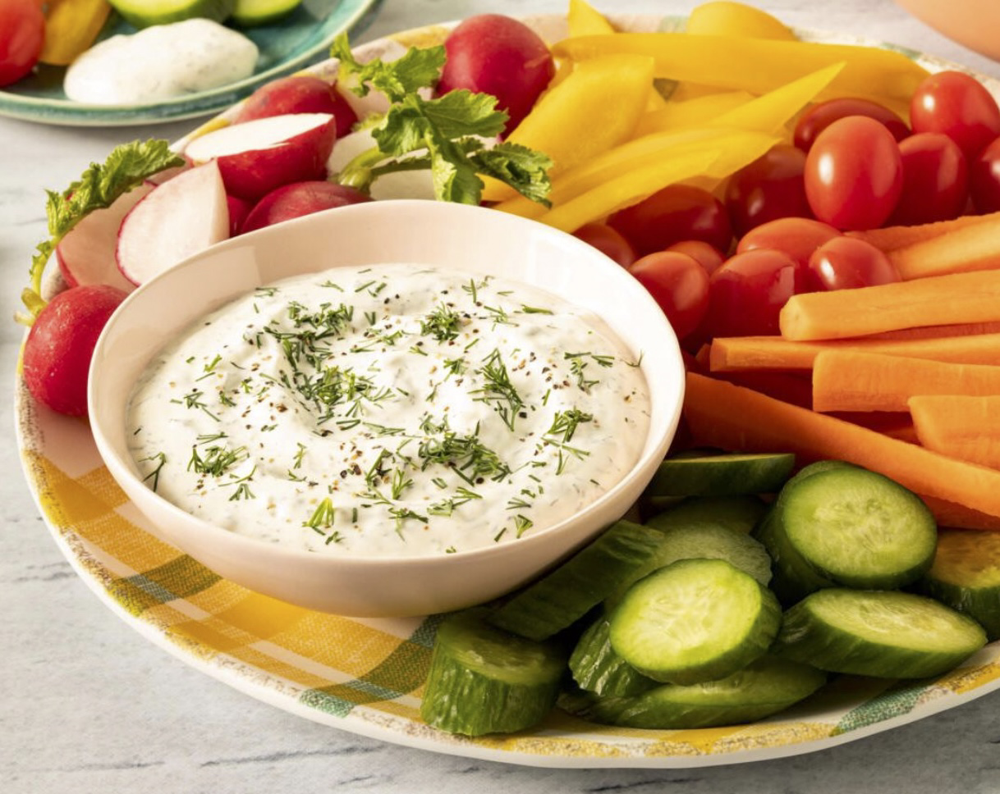

This article has been written and researched by our expert Loveable through a precise methodology. [Learn more about our methodology](https://avada.io/loveable/our-methodological.html)

[Loveable](https://avada.io/loveable/) > [Blog](https://avada.io/loveable/blog/) > [Holiday](https://avada.io/loveable/holiday/)

# Christmas Party Food: 70+ Delicious Ideas to Delight Your Guests

Written by [Blake Simpson](https://avada.io/loveable/author/blake/) Last Updated on September 08, 2023

- [70+ Tasty Christmas Party Food That Delights Your Guests](https://avada.io/loveable/blog/christmas-party-food/#wp-block-heading-2-2) 
    - [Appetizers and Finger Foods for Christmas](https://avada.io/loveable/blog/christmas-party-food/#wp-block-heading-3-3)
        - [1\. Christmas Salad Wreath](https://avada.io/loveable/blog/christmas-party-food/#wp-block-heading-4-4)
        - [2\. Pear Salad](https://avada.io/loveable/blog/christmas-party-food/#wp-block-heading-4-8)
        - [3\. Ham And Cheese Sliders](https://avada.io/loveable/blog/christmas-party-food/#wp-block-heading-4-12)
        - [4\. Coconut Shrimp](https://avada.io/loveable/blog/christmas-party-food/#wp-block-heading-4-16)
        - [5\. Savory S’mores](https://avada.io/loveable/blog/christmas-party-food/#wp-block-heading-4-20)
        - [6\. Cranberry Brie Tartlets](https://avada.io/loveable/blog/christmas-party-food/#wp-block-heading-4-24)
        - [7\. Pomegranate Brie Crostini](https://avada.io/loveable/blog/christmas-party-food/#wp-block-heading-4-28)
        - [8\. Ricotta And Tomato Jam Jar](https://avada.io/loveable/blog/christmas-party-food/#wp-block-heading-4-32)
        - [9\. Roasted Cauliflower And Parsnip Soup](https://avada.io/loveable/blog/christmas-party-food/#wp-block-heading-4-36)
        - [10. Antipasto Bites](https://avada.io/loveable/blog/christmas-party-food/#wp-block-heading-4-40)
        - [11\. Spiced-Up Potato Chips](https://avada.io/loveable/blog/christmas-party-food/#wp-block-heading-4-44)
        - [12\. Cranberry Cream Cheese Dip](https://avada.io/loveable/blog/christmas-party-food/#wp-block-heading-4-48)
        - [13\. Hummus And Caramelized Onion Crostini](https://avada.io/loveable/blog/christmas-party-food/#wp-block-heading-4-52)
    - [Christmas Main Course Selections](https://avada.io/loveable/blog/christmas-party-food/#wp-block-heading-3-56)
        - [14\. Herb And Butter Roasted Beef Tenderloin](https://avada.io/loveable/blog/christmas-party-food/#wp-block-heading-4-57)
        - [15\. Porchetta Pork Tenderloin](https://avada.io/loveable/blog/christmas-party-food/#wp-block-heading-4-61)
        - [16\. Glazed Ham](https://avada.io/loveable/blog/christmas-party-food/#wp-block-heading-4-65)
        - [17\. Oven Roasted Branzino](https://avada.io/loveable/blog/christmas-party-food/#wp-block-heading-4-69)
        - [18\. Lentil Roast With Balsamic Onion Gravy](https://avada.io/loveable/blog/christmas-party-food/#wp-block-heading-4-73)
        - [19\. Parmesan Puffs](https://avada.io/loveable/blog/christmas-party-food/#wp-block-heading-4-77)
        - [20\. Steak And Bearnaise Profiteroles](https://avada.io/loveable/blog/christmas-party-food/#wp-block-heading-4-81)
        - [21\. Stuffed Leg Of Lamb](https://avada.io/loveable/blog/christmas-party-food/#wp-block-heading-4-85)
        - [22\. Classic Roasted Duck With Orange-Bourbon-Molasses Glaze](https://avada.io/loveable/blog/christmas-party-food/#wp-block-heading-4-89)
        -  [23. Creamy Shrimp Piccata](https://avada.io/loveable/blog/christmas-party-food/#wp-block-heading-4-93)
        - [24\. Glazed Pork With Fresh Plums](https://avada.io/loveable/blog/christmas-party-food/#wp-block-heading-4-97)
        - [25\. Spice-Rubbed Tenderloin With Mustard-Cream Sauce](https://avada.io/loveable/blog/christmas-party-food/#wp-block-heading-4-101)
        - [26\. Hoppin’ John Cakes With Tomato](https://avada.io/loveable/blog/christmas-party-food/#wp-block-heading-4-105)
        - [27\. Beef Short Ribs With Mushrooms](https://avada.io/loveable/blog/christmas-party-food/#wp-block-heading-4-109)
        - [28\. Cider-Braised Pork Shoulder](https://avada.io/loveable/blog/christmas-party-food/#wp-block-heading-4-113)
        - [29\. Tangy-Sweet Lemon Chicken](https://avada.io/loveable/blog/christmas-party-food/#wp-block-heading-4-117)
        - [30\. Beer-Braised Brisket](https://avada.io/loveable/blog/christmas-party-food/#wp-block-heading-4-121)
    - [Complementing Christmas Side Dishes](https://avada.io/loveable/blog/christmas-party-food/#wp-block-heading-3-125)
        - [31\. Horseradish Cauliflower Au Gratin](https://avada.io/loveable/blog/christmas-party-food/#wp-block-heading-4-126)
        - [32\. Roasted Kabocha Squash With Pomegranate Pepita Relish](https://avada.io/loveable/blog/christmas-party-food/#wp-block-heading-4-130)
        - [33\. Black Pepper And Lemon Asiago Dip](https://avada.io/loveable/blog/christmas-party-food/#wp-block-heading-4-134)
        - [34\. Brussels Sprout Chips](https://avada.io/loveable/blog/christmas-party-food/#wp-block-heading-4-138)
        - [35\.  Dill Dip](https://avada.io/loveable/blog/christmas-party-food/#wp-block-heading-4-142)
        - [36\. Parmesan Crusted Brussels Sprouts](https://avada.io/loveable/blog/christmas-party-food/#wp-block-heading-4-146)
        - [37\.  Curry Rarebit](https://avada.io/loveable/blog/christmas-party-food/#wp-block-heading-4-150) 
        - [38\. Fried Stuffed Olives](https://avada.io/loveable/blog/christmas-party-food/#wp-block-heading-4-154) 
        - [39\. Mac ‘n’ Cheese Bites](https://avada.io/loveable/blog/christmas-party-food/#wp-block-heading-4-158)
        - [40\. Bacon-Shrimp Skewers](https://avada.io/loveable/blog/christmas-party-food/#wp-block-heading-4-162)
        - [41\. Christmas Pizza](https://avada.io/loveable/blog/christmas-party-food/#wp-block-heading-4-166)
        - [42\. Mini Scotch Eggs](https://avada.io/loveable/blog/christmas-party-food/#wp-block-heading-4-170) 
    - [Assorted Breads And Rolls On Christmas Meal](https://avada.io/loveable/blog/christmas-party-food/#wp-block-heading-3-174)
        - [43\. Garlic Herb Parker House Rolls](https://avada.io/loveable/blog/christmas-party-food/#wp-block-heading-4-175)
        - [44\. Quiche Lorraine](https://avada.io/loveable/blog/christmas-party-food/#wp-block-heading-4-179)
        - [45\. Baked Brie Puffs](https://avada.io/loveable/blog/christmas-party-food/#wp-block-heading-4-183)
        - [46\. Spinach Puffs](https://avada.io/loveable/blog/christmas-party-food/#wp-block-heading-4-187)
        - [47\. Pepperoni Pizza Rolls](https://avada.io/loveable/blog/christmas-party-food/#wp-block-heading-4-191)
        - [48\. Overnight Eggnog Cinnamon Rolls](https://avada.io/loveable/blog/christmas-party-food/#wp-block-heading-4-195)
        - [49\. Stuffed Mushrooms](https://avada.io/loveable/blog/christmas-party-food/#wp-block-heading-4-199)
        - [50\. Sweet Potato Bites](https://avada.io/loveable/blog/christmas-party-food/#wp-block-heading-4-203)
        - [51\. Cranberry Brie Pull-Apart Bread](https://avada.io/loveable/blog/christmas-party-food/#wp-block-heading-4-207)
        - [52\.  Pull-Apart Garlic Bread Pizza Dip](https://avada.io/loveable/blog/christmas-party-food/#wp-block-heading-4-211)
        - [53\. Pesto-Ricotta Crostini](https://avada.io/loveable/blog/christmas-party-food/#wp-block-heading-4-215)
        - [54\. Christmas Tree Spinach Breadsticks](https://avada.io/loveable/blog/christmas-party-food/#wp-block-heading-4-219)
        - [55\. Toasted Ravioli](https://avada.io/loveable/blog/christmas-party-food/#wp-block-heading-4-223)
        - [56\. Chocolate Chestnut Christmas Roll Cake](https://avada.io/loveable/blog/christmas-party-food/#wp-block-heading-4-227)
    - [Delectable Christmas Desserts](https://avada.io/loveable/blog/christmas-party-food/#wp-block-heading-3-231)
        - [57\. Eggnog Bundt Cake](https://avada.io/loveable/blog/christmas-party-food/#wp-block-heading-4-232)
        - [58\. Christmas Crunch Mix](https://avada.io/loveable/blog/christmas-party-food/#wp-block-heading-4-236)
        - [59\. M&M Christmas Sugar Cookies](https://avada.io/loveable/blog/christmas-party-food/#wp-block-heading-4-240)
        - [60\. Saltine Toffee](https://avada.io/loveable/blog/christmas-party-food/#wp-block-heading-4-244)
        - [61\. Brownie Christmas Trees](https://avada.io/loveable/blog/christmas-party-food/#wp-block-heading-4-248)
        - [62\. Holly Cookie Cups](https://avada.io/loveable/blog/christmas-party-food/#wp-block-heading-4-252)
        - [63\. Dark Chocolate Honey Fig Walnut Truffles](https://avada.io/loveable/blog/christmas-party-food/#wp-block-heading-4-256)
        - [64\. Mirror Glaze Christmas Ornament Cakes](https://avada.io/loveable/blog/christmas-party-food/#wp-block-heading-4-260)
        - [65\.  Christmas Cookie Dough Dip](https://avada.io/loveable/blog/christmas-party-food/#wp-block-heading-4-264)
        - [66\. Crispy Rice Cone Christmas Trees](https://avada.io/loveable/blog/christmas-party-food/#wp-block-heading-4-268)
        - [67\. Pumpernickel Bites](https://avada.io/loveable/blog/christmas-party-food/#wp-block-heading-4-272)
        - [68\. Stilton Fruit Bites](https://avada.io/loveable/blog/christmas-party-food/#wp-block-heading-4-276)
        - [69\. Mini Chicken Poppadoms](https://avada.io/loveable/blog/christmas-party-food/#wp-block-heading-4-280)
    - [Festive Christmas Beverage](https://avada.io/loveable/blog/christmas-party-food/#wp-block-heading-3-284)
        - [70\. Matcha Marshmallows With Fresh Mint Hot Cocoa](https://avada.io/loveable/blog/christmas-party-food/#wp-block-heading-4-285)
        - [71\. Christmas Punch](https://avada.io/loveable/blog/christmas-party-food/#wp-block-heading-4-289)
        - [72\.  Pear Manhattan](https://avada.io/loveable/blog/christmas-party-food/#wp-block-heading-4-293)
        - [73\.  Champagne Jelly Shots](https://avada.io/loveable/blog/christmas-party-food/#wp-block-heading-4-297)
        - [74\. Bloody Mary Prawn Shots](https://avada.io/loveable/blog/christmas-party-food/#wp-block-heading-4-301)
- [Final Words,](https://avada.io/loveable/blog/christmas-party-food/#wp-block-heading-2-308)

When it comes to hosting a memorable holiday celebration, the cornerstone lies in crafting delectable dishes that embody the spirit of the holiday season. **Christmas Party Food** takes center stage as the heartwarming aromas and flavors of curated culinary delights. It fills the air and sets the stage for an unforgettable gathering. This delightful array of over 70 mouthwatering ideas is poised to tantalize taste buds.

## **70+ Tasty Christmas Party Food That Delights Your Guests** 

### **Appetizers and Finger Foods for Christmas**

#### **1\. Christmas Salad Wreath**

A little artful arranging can turn an ordinary side salad into a real work of art suitable for the holiday dinner table.

Get the [Christmas Salad Wreath](https://thebakermama.com/recipes/christmas-salad-wreath/) recipe

#### **2\. Pear Salad**

Make sure to have something nice and fresh to serve—like this salad studded with seasonal fruit—with the hearty main meal.

Get the [Pear Salad](https://www.twopeasandtheirpod.com/favorite-pear-salad/) recipe

#### **3\. Ham And Cheese Sliders**

If you’re looking for a heartier appetizer that’ll please kids and adults alike, look no further than ham and cheese sliders! They’re warm, toasty, and great for a crowd.

Get the [Ham And Cheese Sliders](https://www.thepioneerwoman.com/food-cooking/recipes/a42135766/ham-and-cheese-sliders-recipe/) recipe

#### **4\. Coconut Shrimp**

Skip the lines at the airports and make an appetizer inspired by a warm-weather vacation! These crispy shrimp are coated in toasted coconut and served with a sweet, sticky Thai chili sauce.

Get the [Coconut Shrimp](https://www.thepioneerwoman.com/food-cooking/recipes/a40943789/coconut-shrimp-recipe/) recipe

#### **5\. Savory S’mores**

Careful! With these prosciutto, brie, and honey “s’mores” in the appetizer rotation, your guests might not have much room left for dinner.

Get the [Savory S’mores](https://www.spoonforkbacon.com/savory-smores/) recipe

#### **6\. Cranberry Brie Tartlets**

Is there anything more festive than cranberry? And who doesn’t love melted Brie cheese? These crowd-friendly appetizers come together easily.

Get the [Cranberry Brie Tartlets](https://themerrythought.com/recipes/cranberry-brie-tartlets/) recipe

#### **7\. Pomegranate Brie Crostini**

Top slices of fresh baguette with melted Brie, ruby red pomegranate arils, and a single sprig of rosemary to make an eye-catching holiday appetizer.

Get the [Pomegranate Brie Crostini](http://themerrythought.com/recipes/pomegranate-brie-crostini/) recipe

#### **8\. Ricotta And Tomato Jam Jar**

You might be missing some of that bright summer flavor by now, but this easy appetizer will bring you and your guests back to longer, warmer days.

Get the [Ricotta And Tomato Jam Jar](https://www.howsweeteats.com/2018/09/ricotta-jam-jar-nordstrom/) recipe

#### **9\. Roasted Cauliflower And Parsnip Soup**

Soup isn’t off the table if you’re not hosting a sit-down meal. Serve up the warm appetizer in mugs so your guests can mingle while they enjoy the first course.

Get the recipe [Roasted Cauliflower And Parsnip Soup](https://www.spoonforkbacon.com/roasted-cauliflower-parsnip-soup/) recipe

#### **10. Antipasto Bites**

Fresh tortellini makes this the hearty [party appetizer](https://www.delish.com/food/g2168/bite-size-appetizers/) of our dreams. If you do not like olives, pepperoncini peppers would be a delicious substitute!

Get the [Antipasto Bites](https://www.delish.com/cooking/recipe-ideas/a48544/antipasto-bites-recipe/) recipe

#### **11\. Spiced-Up Potato Chips**

Potato chips are an easy addition to any spread of appetizers. Make these spiced-up chips that involve jazzing up a store-bought bag.

Get the [Spiced-Up Potato Chips](https://www.thepioneerwoman.com/food-cooking/recipes/a34272361/spiced-up-potato-chips-recipe/) recipe

#### **12\. Cranberry Cream Cheese Dip**

This crowd-pleasing holiday appetizer requires just five main ingredients and takes less than 10 minutes—max!—to put together easily.

Get the [Cranberry Cream Cheese Dip](https://www.gimmesomeoven.com/cranberry-cream-cheese-dip/) recipe

#### **13\. Hummus And Caramelized Onion Crostini**

This simple finger food is vegan, so all of your guests can enjoy it. Plus, it’s easy to give it a festive treatment—just top each one with a rosemary sprig.

Get the [Hummus And Caramelized Onion Crostini](https://wallflowerkitchen.com/hummus-caramelised-onion-crositini/) recipe

### **Christmas Main Course Selections**

#### **14\. Herb And Butter Roasted Beef Tenderloin**

When your mission is to impress, beef tenderloin is the way to go. This cut of meat cooks up perfectly with a brush of brown butter and herbs.

Get the [Christmas Main Course Selections](https://www.howsweeteats.com/2017/12/best-beef-tenderloin/) recipe

#### **15\. Porchetta Pork Tenderloin**

For a meal not nearly as costly as beef tenderloin but just as impressive, turn to this bacon-wrapped, herb-infused pork tenderloin.

Get the [Porchetta Pork Tenderloin](https://thebeachhousekitchen.com/2018/06/18/porchetta-pork-tenderloin/) recipe

#### **16\. Glazed Ham**

Of course, spiraled ham is another suitable option for your Christmas dinner party since it easily feeds a large group.

Get the [Glazed Ham](https://www.dinneratthezoo.com/glazed-ham-for-the-holidays/) recipe

#### **17\. Oven Roasted Branzino**

If you’re hosting the Feast of the Seven Fishes, this whole-roasted Branzino is a main course stunner that fits right in amongst the rest of the spread.

Get the [Oven Roasted Branzino](https://www.spoonforkbacon.com/oven-roasted-branzino/) recipe

#### **18\. Lentil Roast With Balsamic Onion Gravy**

Don’t forget about your vegetarian dinner guests. This easy, satisfying loaf is a great way to ensure that anyone with special dietary considerations gets enough to eat.

Get the [Lentil Roast With Balsamic Onion Gravy](http://wallflowerkitchen.com/lentil-roast-with-gravy/) recipe

#### **19\. Parmesan Puffs**

Need something to keep snackers satisfied before the main meal? Try these make-ahead parmesan puffs—and make extra; they’ll be gone in a flash.

Get the [Parmesan Puffs](https://www.loveandoliveoil.com/2017/10/parmesan-puffs.html) recipe

#### **20\. Steak And Bearnaise Profiteroles**

Everyone loves mini roast beef and Yorkshire puddings, and this year, we’ve added a cheffy twist to this party staple with sirloin steak and Béarnaise sauce.

Get the [Steak And Bearnaise Profiteroles](https://www.goodhousekeeping.com/uk/food/recipes/steak-and-bearnaise-profiteroles) recipe

#### **21\. Stuffed Leg Of Lamb**

Butterflied leg of lamb stuffed with fresh spinach, feta, and walnut makes for a show-stopping special dinner fit for a special occasion and works well on a buffet.

Get the [Stuffed Leg Of Lamb](https://www.garlicandzest.com/stuffed-rotisserie-leg-of-lamb/) recipe

#### **22\. Classic Roasted Duck With Orange-Bourbon-Molasses Glaze**

The secret to crispy skin is a dry duck. Pat ducks with a paper towel before, during, and after refrigerating. Store uncovered in the back, coldest part of your fridge, for up to two days ahead.

Get the [Classic Roasted Duck](https://www.southernliving.com/recipes/classic-roasted-duck-orange-bourbon-molasses-glaze) recipe

####  **23. Creamy Shrimp Piccata**

Save on prep time by buying shrimp peeled and deveined. Lemons, herbs, and cheese add a refreshing flavoring to this pasta dish. Garnish with fresh, flat-leaf parsley if you prefer.

Get the [Creamy Shrimp Piccata](https://www.myrecipes.com/recipe/creamy-shrimp-piccata) recipe

#### **24\. Glazed Pork With Fresh Plums**

This sweet and savory dish is ready in 30 minutes. After cooking the pork, stir vinegar and plum preserves into drippings and cover over medium-high heat. Stir constantly until the sauce is slightly thick.

Get the [Glazed Pork With Fresh Plums](https://www.myrecipes.com/recipe/glazed-pork-fresh-plums) recipe

#### **25\. Spice-Rubbed Tenderloin With Mustard-Cream Sauce**

Since beef tenderloin has little fat, it can quickly dry and be overcooked. Don’t cook past a meat thermometer registering 130°F in the center for tender slices.

Get the [Spice-Rubbed Tenderloin](https://www.southernliving.com/recipes/spice-rubbed-tenderloin-mustard-cream-sauce) recipe

#### **26\. Hoppin’ John Cakes With Tomato**

We suggest cooking rice one to two days before so it has time to dry out. Use wet hands to shape the balls before flattening them and placing them in the freezer. Serve with Tomato-Jalapeño Gravy.

Get the [Hoppin’ John Cakes With Tomato](https://www.southernliving.com/recipes/hoppin-john-cakes-tomato-jalapeno-gravy) recipe

#### **27\. Beef Short Ribs With Mushrooms**

This dish looks so impressive but requires little effort. Wait until the last few minutes of cooking to add the mushrooms. Finish by tossing the short ribs in parsley.

Get the [Beef Short Ribs With Mushrooms](https://www.myrecipes.com/recipe/beef-short-ribs-with-mushrooms) recipe

#### **28\. Cider-Braised Pork Shoulder**

Ask your butcher to butterfly it if you want to dress up the humble pork shoulder roast. Sprinkle the spice rub all over both sides of the pork. Finally, roll and tie it with kitchen string before browning.

Get the [Cider-Braised Pork Shoulder](https://www.southernliving.com/recipes/cider-braised-pork-shoulder-0) recipe

#### **29\. Tangy-Sweet Lemon Chicken**

Mediterranean flavors meld deliciously in this chicken dish. Bone-in breasts are meaty and cook perfectly in the moist heat of the braise. Garnish with lemons and oranges, and serve with sauce.

Get the [Tangy-Sweet Lemon Chicken](https://www.myrecipes.com/recipe/tangy-sweet-lemon-chicken) recipe

#### **30\. Beer-Braised Brisket**

There’s nothing quite like a traditional holiday roast, especially when covered in a beer braise. This dish pairs perfectly with mashed potatoes or egg noodles. Use remaining roast (if available) to make tasty leftover sandwiches.

Get the [Beer-Braised Brisket](https://www.myrecipes.com/recipe/beer-braised-brisket-0) recipe

### **Complementing Christmas Side Dishes**

#### **31\. Horseradish Cauliflower Au Gratin**

A zesty, flavorful (and comforting) side that pairs well with nearly any main, from beef tenderloin to ham.

Get the [Horseradish Cauliflower Au Gratin](https://thebeachhousekitchen.com/2015/10/05/horseradish-cauliflower-au-gratin/) recipe

#### **32\. Roasted Kabocha Squash With Pomegranate Pepita Relish**

Seasonal squash gets a festive upgrade thanks to some red and green garnishes, including pomegranate arils and pumpkin seeds.

Get the [Roasted Kabocha Squash](https://www.howsweeteats.com/2019/12/roasted-kabocha-squash-pomegranate-pepita-relish/) recipe

#### **33\. Black Pepper And Lemon Asiago Dip**

Take advantage of peak citrus season with this zesty lemon dip. It tastes great served with dippers of all kinds, from pita chips to veggie sticks.

Get the [Black Pepper And Lemon Asiago Dip](http://recipescooking.net/p/black-pepper-and-lemon-asiago-dip) recipe

#### **34\. Brussels Sprout Chips**

We can’t get enough of Brussels sprouts. They not only make a great veggie side but are also a perfect salty, crunchy! This garlic-parm version begs to be dipped in creamy Caesar dressing, but ranch wouldn’t be a bad idea either. 

Get the [Brussels Sprout Chips](https://www.delish.com/cooking/recipe-ideas/a19673558/best-brussels-sprout-chips-recipe/) recipe

#### **35\.  Dill Dip**

If you plan on a big Christmas feast and lots of cookies for later in the night, you might want to keep the starters on the lighter side. Serve up this fresh dill dip with plenty of healthy veggies.

Get the [Dill Dip](https://www.thepioneerwoman.com/food-cooking/recipes/a39012785/dill-dip-recipe/) recipe

#### **36\. Parmesan Crusted Brussels Sprouts**

You coat these sprouts in a cheesy, garlicky mixture before baking on high heat, giving them an ultra-crispy crust perfect for dunking in homemade Caesar dressing.

Get the [Parmesan Crusted Brussels Sprouts](https://www.delish.com/cooking/recipe-ideas/recipes/a55370/parmesan-crusted-brussels-sprouts-recipe/) recipe

#### **37\.  Curry Rarebit** 

These speedy curry rarebits use naan slices of bread for the base and then are topped with a cheesy curry topping. What’s not to like?

Get the [Curry Rarebit](https://www.goodhousekeeping.com/uk/food/recipes/a25616304/curry-rarebit-bites/) recipe

#### **38\. Fried Stuffed Olives** 

Choose between anchovies or sundried tomatoes to stuff into your olive, then fry until golden and crispy. The perfect snack with beer or bubbly!

Get the [Fried Stuffed Olives](https://www.goodhousekeeping.com/uk/christmas/christmas-recipes/a38301166/fried-stuffed-olives/) recipe

#### **39\. Mac ‘n’ Cheese Bites**

You’ll definitely want to eat more than one of these. Each bite bursts with the classic flavors you love, making them a hit at parties, gatherings, or as a quick and delicious snack. 

Get the [Mac ‘n’ Cheese Bites](https://www.goodhousekeeping.com/uk/food/recipes/macaroni-cheese-bites) recipe

#### **40\. Bacon-Shrimp Skewers**

Bacon-wrapped anything is always a win. However, there’s something extra special about these bacon, pineapple, and shrimp skewers.

Get the [Bacon-Shrimp Skewers](https://www.thepioneerwoman.com/food-cooking/recipes/a32881438/bacon-shrimp-skewers-recipe/) recipe

#### **41\. Christmas Pizza**

Pesto, cleverly shaped dough, and artfully arranged toppings turn your average pizza into a dish worthy of your Christmas party.

Get the [Christmas Pizza](https://www.acouplecooks.com/pesto-christmas-tree-pizza-recipe/) recipe

#### **42\. Mini Scotch Eggs** 

Scotch eggs are easy to make and go down as a treat with family and friends. These miniature versions of the classic dish feature a savory blend of seasoned sausage wrapped around a perfectly cooked quail or chicken egg.

Get the [Mini Scotch Eggs](https://www.goodhousekeeping.com/uk/food/recipes/wee-scotch-eggs) recipe

### **Assorted Breads And Rolls On Christmas Meal**

#### **43\. Garlic Herb Parker House Rolls**

No holiday meal is complete without a tray of these soft, buttery dinner rolls. They make a perfect addition to any meal with a soft and fluffy texture, from holiday feasts to everyday dinners. 

Get the [Garlic Herb Parker House Rolls](https://www.twopeasandtheirpod.com/parker-house-rolls/) recipe

#### **44\. Quiche Lorraine**

Quiche is popular for daytime celebrations since it can be made, frozen, and warmed before mealtime.

Get the [Quiche Lorraine](https://thebeachhousekitchen.com/2019/12/23/quiche-lorraine/) recipe

#### **45\. Baked Brie Puffs**

Frozen phyllo dough makes quick work of these easy, cheesy little bites topped with sweet jam and crunchy pistachios.

Get the [Baked Brie Puffs](https://www.loveandoliveoil.com/2013/12/baked-brie-puffs-with-fruit-preserves-and-pistachios.html) recipe

#### **46\. Spinach Puffs**

If you love baked spinach dip, you’ll love these baked puff pastry puffs. They’re filled with a mixture of sautéed onion, garlic, spinach, and cream cheese and baked inside little puff pastry cups in a muffin tin. Bet you can’t eat just one!

Get the [Spinach Puffs](https://www.delish.com/cooking/recipe-ideas/a38326725/spinach-puffs-recipe/) recipe

#### **47\. Pepperoni Pizza Rolls**

Here’s another appetizer that’s big on the nostalgia factor. It’s a delicious homemade spin on their favorite microwavable snack!

Get [Ree’s Pepperoni Pizza Rolls](https://www.thepioneerwoman.com/food-cooking/recipes/a36080818/pepperoni-pizza-rolls-recipe/) recipe

#### **48\. Overnight Eggnog Cinnamon Rolls**

The only thing that can possibly make the traditional brunch food even better? An infusion of eggnog and a smattering of festive sprinkles.

Get the [Overnight Eggnog Cinnamon Rolls](https://www.averiecooks.com/overnight-eggnog-cinnamon-rolls/) recipe

#### **49\. Stuffed Mushrooms**

Baby Bella mushrooms are stuffed with garlicky, herby bread crumbs, and plenty of cheese. Honestly, what could be better? Stuff them ahead of time and bake them off when you’re ready to serve!

Get the [Stuffed Mushrooms](https://www.delish.com/cooking/recipe-ideas/a20089643/easy-stuffed-mushroom-recipe/) recipe

#### **50\. Sweet Potato Bites**

Sweet potato casserole is a classic at any [holiday celebration](https://avada.io/loveable/blog/christmas-cookie-recipes/), so we turned the staple dish into a bite-size app! When you don’t have time to cook up a whole casserole, put marshmallows, pecans, and maple syrup on top of your sweet potatoes for a super-simple alternative.

Get the [Sweet Potato Bites](https://www.delish.com/cooking/recipe-ideas/recipes/a50000/sweet-potato-bites-recipe/) recipe

#### **51\. Cranberry Brie Pull-Apart Bread**

Pull-apart bread reaches a whole new level thanks to brie and [cranberry sauce](https://www.delish.com/holiday-recipes/thanksgiving/g1217/cranberry-sauce-recipes/). Use your favorite homemade sauce recipes, but store-bought works if you’re short on time.

Get the [Cranberry Brie Pull-Apart Bread](https://www.delish.com/cooking/recipe-ideas/recipes/a57209/cranberry-brie-pull-apart-bread-recipe/) recipe

#### **52\.  Pull-Apart Garlic Bread Pizza Dip**

Your family isn’t ready for this…, but they’ll love it. With pre-made biscuit dough and a homemade cheesy pizza dip, this app has it all.

Get the [Pull-Apart Garlic Bread Pizza Dip](https://www.delish.com/cooking/recipe-ideas/a22708486/pull-apart-garlic-bread-pizza-dip-recipe/) recipe

#### **53\. Pesto-Ricotta Crostini**

You might even like pesto better on bread than you do on pasta. Crostini is the easiest party app—simply put your delicious toppings on tiny toasted bread. Plus, pesto makes everything better. 

Get the [Pesto-Ricotta Crostini](https://www.delish.com/holiday-recipes/new-years/g1562/crostini/?slide=10) recipe

#### **54\. Christmas Tree Spinach Breadsticks**

One thing is for sure: Once you put this Christmas version of gooey spinach and cheese pull-apart bread on the buffet, it’ll be gone in a flash.

Get the [Christmas Tree Spinach Breadsticks](https://www.itsalwaysautumn.com/christmas-tree-spinach-dip-breadsticks.html) recipe

#### **55\. Toasted Ravioli**

Breaded and fried, eating ravioli with your hands and dipping it in plenty of marinara is so fun. Bonus: Toasted ravioli works in the air fryer, too! Try these with all those seasonal raviolis you can find this winter for the perfect holiday app.

Get the [Toasted Ravioli](https://www.delish.com/cooking/recipe-ideas/recipes/a48474/toasted-ravioli-recipe/) recipe

#### **56\. Chocolate Chestnut Christmas Roll Cake**

Consider this the Christmas version of the beloved pumpkin roll. If you have the time to spare, you can even decorate it like the traditional yule log.

Get the [Chocolate Chestnut Christmas Roll Cake](https://www.loveandoliveoil.com/2020/12/chocolate-chestnut-christmas-cake-roll.html) recipe

### **Delectable Christmas Desserts**

#### **57\. Eggnog Bundt Cake**

Put this on the list, too. Each slice of the eggnog-infused cake is rich, moist, and oh-so-delicious. Plus, who could resist a sweet rum glaze?

Get the [Eggnog Bundt Cake](https://www.thelittleepicurean.com/2016/12/eggnog-bundt-cake-rum-glaze.html) recipe

#### **58\. Christmas Crunch Mix**

The kids will go crazy for this sugar explosion. To make it a school-friendly snack for classroom parties, simply omit the peanuts.

Get the [Christmas Crunch Mix](https://thebakermama.com/recipes/christmas-crunch-mix/) recipe

#### **59\. M&M Christmas Sugar Cookies**

If piping icing isn’t your forte, try these easy-to-decorate alternatives. They’re just as tasty and attractive but much less complex.

Get the [M&M Christmas Sugar Cookies](https://www.itsalwaysautumn.com/easy-decorate-mm-christmas-sugar-cookies.html) recipe

#### **60\. Saltine Toffee**

There’s a reason this sweet and salty dessert is so popular: It’s hard to eat just one. Put a platter on your dessert buffet, or send guests home with a bundle as a party favor.

Get the [Saltine Toffee](https://www.suburbansimplicity.com/saltine-toffee-thats-simply-irresistible/) recipe

#### **61\. Brownie Christmas Trees**

Create these cute handheld desserts with just a single tray of brownies, some frosting, and holiday candies.

Get the [Brownie Christmas Trees](https://www.suburbansimplicity.com/brownie-christmas-trees/) recipe

#### **62\. Holly Cookie Cups**

These perfectly poppable treats get a little Christmas flair from shaped melted chocolate and red M&Ms.

Get the [Holly Cookie Cupsrecipe](https://www.designeatrepeat.com/christmas-holly-cookie-cups/) recipe

#### **63\. Dark Chocolate Honey Fig Walnut Truffles**

When everyone’s so full from the main course that they can barely move, these poppable snacks provide just the right finishing touch.

Get the [Dark Chocolate Honey Fig Walnut Truffles](https://www.snixykitchen.com/dark-chocolate-honey-fig-walnut-truffles/) recipe

#### **64\. Mirror Glaze Christmas Ornament Cakes**

For a formal, adults-only Christmas dinner party, try your hand at this ultra-chic dessert. Your guests will definitely wonder what bakery window you plucked these from.

Get the [Mirror Glaze Christmas Ornament Cakes](https://www.loveandoliveoil.com/2019/12/mirror-glaze-christmas-ornament-cakes.html) recipe

#### **65\.  Christmas Cookie Dough Dip**

Another great option for a crowd is leaving the platter on a coffee table and letting guests graze at their leisure.

Get the [Christmas Cookie Dough Dip](https://www.dinneratthezoo.com/christmas-cookie-dough-dip/) recipe

#### **66\. Crispy Rice Cone Christmas Trees**

These adorable crispy rice treats double as decor for the dessert table, but don’t be surprised how fast they disappear once it’s time to dig in.

Get the [Crispy Rice Cone Christmas Trees](http://laurencariscooks.com/rice-krispie-cone-christmas-trees/) recipe

#### **67\. Pumpernickel Bites**

Smoked salmon is always a hit, but if you’re cooking for vegetarians, cubed beetroot works just as well for this recipe.

Get the [Pumpernickel Bites](https://www.goodhousekeeping.com/uk/food/recipes/pumpernickel-bites-christmas-recipe-meike-beck) recipe

#### **68\. Stilton Fruit Bites**

If it’s a simple plate of canapés you want to pass around, these easy bites will fit the bill nicely.

Get the [Stilton Fruit Bites](https://www.goodhousekeeping.com/uk/food/recipes/stilton-fruit-bites) recipe

#### **69\. Mini Chicken Poppadoms**

Light, fresh, and full of flavor, these chicken bites will add a touch of Indian spice to your party.

Get the [Mini Chicken Poppadoms](https://www.goodhousekeeping.com/uk/food/recipes/mini-chicken-poppadoms) recipe

### **Festive Christmas Beverage**

#### **70\. Matcha Marshmallows With Fresh Mint Hot Cocoa**

Don’t forget to have something on hand for your guests to sip. This peppermint-spiked hot cocoa will hit the spot on a chilly winter’s night.

Get the [Matcha Marshmallows](https://www.snixykitchen.com/matcha-marshmallows-with-fresh-mint-hot-cocoa/) recipe

#### **71\. Christmas Punch**

For a lighter, non-alcoholic [beverage](https://avada.io/loveable/blog/christmas-drinks/), whip up this festive punch. It gets its ruby red hue from pomegranate and cranberry juices.

Get the [Christmas Punch](https://www.dinneratthezoo.com/christmas-punch/) recipe

#### **72\.  Pear Manhattan**

Do you think your guests might prefer something a little boozier? Try this Manhattan. Thanks to the addition of fresh pear, it has a seasonal spin that makes it worthy of the occasion.

Get the [Pear Manhattan](https://www.loveandoliveoil.com/2018/02/pear-manhattan.html) recipe

#### **73\.  Champagne Jelly Shots**

For one last hurrah before guests call it a night, have a special Christmas toast with these gorgeous—and very tasty—unique make-ahead Champagne treats.

Get the [Champagne Jelly Shots](https://www.sprinklebakes.com/2019/12/champagne-jelly-shots-with-pomegranate.html) recipe

#### **74\. Bloody Mary Prawn Shots**

​​Sweet, succulent prawns perfectly match the spicy Bloody Mary shot.

Get the [Bloody Mary Prawn Shots](https://www.goodhousekeeping.com/uk/food/recipes/bloody-mary-prawn-shots) recipe

**_See More:_**

- Best [Christmas Drinks](https://avada.io/loveable/blog/christmas-drinks/)

- Must-Try [Christmas Dinner Ideas](https://avada.io/loveable/blog/christmas-dinner-ideas/)

## **Final Words**,

When it comes to celebrating, These delectable **Christmas Party Foods** have the power to unite friends and family in shared merriment. From savory to sweet, each bite brings people together, creating happy memories that stick around long after the meal. They’re the heartwarming expression of your hospitality, weaving a tapestry of flavors that enhance the festive spirit and foster connections among those who gather to partake.

- [70+ Tasty Christmas Party Food That Delights Your Guests](https://avada.io/loveable/blog/christmas-party-food/#wp-block-heading-2-2) 
    - [Appetizers and Finger Foods for Christmas](https://avada.io/loveable/blog/christmas-party-food/#wp-block-heading-3-3)
        - [1\. Christmas Salad Wreath](https://avada.io/loveable/blog/christmas-party-food/#wp-block-heading-4-4)
        - [2\. Pear Salad](https://avada.io/loveable/blog/christmas-party-food/#wp-block-heading-4-8)
        - [3\. Ham And Cheese Sliders](https://avada.io/loveable/blog/christmas-party-food/#wp-block-heading-4-12)
        - [4\. Coconut Shrimp](https://avada.io/loveable/blog/christmas-party-food/#wp-block-heading-4-16)
        - [5\. Savory S’mores](https://avada.io/loveable/blog/christmas-party-food/#wp-block-heading-4-20)
        - [6\. Cranberry Brie Tartlets](https://avada.io/loveable/blog/christmas-party-food/#wp-block-heading-4-24)
        - [7\. Pomegranate Brie Crostini](https://avada.io/loveable/blog/christmas-party-food/#wp-block-heading-4-28)
        - [8\. Ricotta And Tomato Jam Jar](https://avada.io/loveable/blog/christmas-party-food/#wp-block-heading-4-32)
        - [9\. Roasted Cauliflower And Parsnip Soup](https://avada.io/loveable/blog/christmas-party-food/#wp-block-heading-4-36)
        - [10. Antipasto Bites](https://avada.io/loveable/blog/christmas-party-food/#wp-block-heading-4-40)
        - [11\. Spiced-Up Potato Chips](https://avada.io/loveable/blog/christmas-party-food/#wp-block-heading-4-44)
        - [12\. Cranberry Cream Cheese Dip](https://avada.io/loveable/blog/christmas-party-food/#wp-block-heading-4-48)
        - [13\. Hummus And Caramelized Onion Crostini](https://avada.io/loveable/blog/christmas-party-food/#wp-block-heading-4-52)
    - [Christmas Main Course Selections](https://avada.io/loveable/blog/christmas-party-food/#wp-block-heading-3-56)
        - [14\. Herb And Butter Roasted Beef Tenderloin](https://avada.io/loveable/blog/christmas-party-food/#wp-block-heading-4-57)
        - [15\. Porchetta Pork Tenderloin](https://avada.io/loveable/blog/christmas-party-food/#wp-block-heading-4-61)
        - [16\. Glazed Ham](https://avada.io/loveable/blog/christmas-party-food/#wp-block-heading-4-65)
        - [17\. Oven Roasted Branzino](https://avada.io/loveable/blog/christmas-party-food/#wp-block-heading-4-69)
        - [18\. Lentil Roast With Balsamic Onion Gravy](https://avada.io/loveable/blog/christmas-party-food/#wp-block-heading-4-73)
        - [19\. Parmesan Puffs](https://avada.io/loveable/blog/christmas-party-food/#wp-block-heading-4-77)
        - [20\. Steak And Bearnaise Profiteroles](https://avada.io/loveable/blog/christmas-party-food/#wp-block-heading-4-81)
        - [21\. Stuffed Leg Of Lamb](https://avada.io/loveable/blog/christmas-party-food/#wp-block-heading-4-85)
        - [22\. Classic Roasted Duck With Orange-Bourbon-Molasses Glaze](https://avada.io/loveable/blog/christmas-party-food/#wp-block-heading-4-89)
        -  [23. Creamy Shrimp Piccata](https://avada.io/loveable/blog/christmas-party-food/#wp-block-heading-4-93)
        - [24\. Glazed Pork With Fresh Plums](https://avada.io/loveable/blog/christmas-party-food/#wp-block-heading-4-97)
        - [25\. Spice-Rubbed Tenderloin With Mustard-Cream Sauce](https://avada.io/loveable/blog/christmas-party-food/#wp-block-heading-4-101)
        - [26\. Hoppin’ John Cakes With Tomato](https://avada.io/loveable/blog/christmas-party-food/#wp-block-heading-4-105)
        - [27\. Beef Short Ribs With Mushrooms](https://avada.io/loveable/blog/christmas-party-food/#wp-block-heading-4-109)
        - [28\. Cider-Braised Pork Shoulder](https://avada.io/loveable/blog/christmas-party-food/#wp-block-heading-4-113)
        - [29\. Tangy-Sweet Lemon Chicken](https://avada.io/loveable/blog/christmas-party-food/#wp-block-heading-4-117)
        - [30\. Beer-Braised Brisket](https://avada.io/loveable/blog/christmas-party-food/#wp-block-heading-4-121)
    - [Complementing Christmas Side Dishes](https://avada.io/loveable/blog/christmas-party-food/#wp-block-heading-3-125)
        - [31\. Horseradish Cauliflower Au Gratin](https://avada.io/loveable/blog/christmas-party-food/#wp-block-heading-4-126)
        - [32\. Roasted Kabocha Squash With Pomegranate Pepita Relish](https://avada.io/loveable/blog/christmas-party-food/#wp-block-heading-4-130)
        - [33\. Black Pepper And Lemon Asiago Dip](https://avada.io/loveable/blog/christmas-party-food/#wp-block-heading-4-134)
        - [34\. Brussels Sprout Chips](https://avada.io/loveable/blog/christmas-party-food/#wp-block-heading-4-138)
        - [35\.  Dill Dip](https://avada.io/loveable/blog/christmas-party-food/#wp-block-heading-4-142)
        - [36\. Parmesan Crusted Brussels Sprouts](https://avada.io/loveable/blog/christmas-party-food/#wp-block-heading-4-146)
        - [37\.  Curry Rarebit](https://avada.io/loveable/blog/christmas-party-food/#wp-block-heading-4-150) 
        - [38\. Fried Stuffed Olives](https://avada.io/loveable/blog/christmas-party-food/#wp-block-heading-4-154) 
        - [39\. Mac ‘n’ Cheese Bites](https://avada.io/loveable/blog/christmas-party-food/#wp-block-heading-4-158)
        - [40\. Bacon-Shrimp Skewers](https://avada.io/loveable/blog/christmas-party-food/#wp-block-heading-4-162)
        - [41\. Christmas Pizza](https://avada.io/loveable/blog/christmas-party-food/#wp-block-heading-4-166)
        - [42\. Mini Scotch Eggs](https://avada.io/loveable/blog/christmas-party-food/#wp-block-heading-4-170) 
    - [Assorted Breads And Rolls On Christmas Meal](https://avada.io/loveable/blog/christmas-party-food/#wp-block-heading-3-174)
        - [43\. Garlic Herb Parker House Rolls](https://avada.io/loveable/blog/christmas-party-food/#wp-block-heading-4-175)
        - [44\. Quiche Lorraine](https://avada.io/loveable/blog/christmas-party-food/#wp-block-heading-4-179)
        - [45\. Baked Brie Puffs](https://avada.io/loveable/blog/christmas-party-food/#wp-block-heading-4-183)
        - [46\. Spinach Puffs](https://avada.io/loveable/blog/christmas-party-food/#wp-block-heading-4-187)
        - [47\. Pepperoni Pizza Rolls](https://avada.io/loveable/blog/christmas-party-food/#wp-block-heading-4-191)
        - [48\. Overnight Eggnog Cinnamon Rolls](https://avada.io/loveable/blog/christmas-party-food/#wp-block-heading-4-195)
        - [49\. Stuffed Mushrooms](https://avada.io/loveable/blog/christmas-party-food/#wp-block-heading-4-199)
        - [50\. Sweet Potato Bites](https://avada.io/loveable/blog/christmas-party-food/#wp-block-heading-4-203)
        - [51\. Cranberry Brie Pull-Apart Bread](https://avada.io/loveable/blog/christmas-party-food/#wp-block-heading-4-207)
        - [52\.  Pull-Apart Garlic Bread Pizza Dip](https://avada.io/loveable/blog/christmas-party-food/#wp-block-heading-4-211)
        - [53\. Pesto-Ricotta Crostini](https://avada.io/loveable/blog/christmas-party-food/#wp-block-heading-4-215)
        - [54\. Christmas Tree Spinach Breadsticks](https://avada.io/loveable/blog/christmas-party-food/#wp-block-heading-4-219)
        - [55\. Toasted Ravioli](https://avada.io/loveable/blog/christmas-party-food/#wp-block-heading-4-223)
        - [56\. Chocolate Chestnut Christmas Roll Cake](https://avada.io/loveable/blog/christmas-party-food/#wp-block-heading-4-227)
    - [Delectable Christmas Desserts](https://avada.io/loveable/blog/christmas-party-food/#wp-block-heading-3-231)
        - [57\. Eggnog Bundt Cake](https://avada.io/loveable/blog/christmas-party-food/#wp-block-heading-4-232)
        - [58\. Christmas Crunch Mix](https://avada.io/loveable/blog/christmas-party-food/#wp-block-heading-4-236)
        - [59\. M&M Christmas Sugar Cookies](https://avada.io/loveable/blog/christmas-party-food/#wp-block-heading-4-240)
        - [60\. Saltine Toffee](https://avada.io/loveable/blog/christmas-party-food/#wp-block-heading-4-244)
        - [61\. Brownie Christmas Trees](https://avada.io/loveable/blog/christmas-party-food/#wp-block-heading-4-248)
        - [62\. Holly Cookie Cups](https://avada.io/loveable/blog/christmas-party-food/#wp-block-heading-4-252)
        - [63\. Dark Chocolate Honey Fig Walnut Truffles](https://avada.io/loveable/blog/christmas-party-food/#wp-block-heading-4-256)
        - [64\. Mirror Glaze Christmas Ornament Cakes](https://avada.io/loveable/blog/christmas-party-food/#wp-block-heading-4-260)
        - [65\.  Christmas Cookie Dough Dip](https://avada.io/loveable/blog/christmas-party-food/#wp-block-heading-4-264)
        - [66\. Crispy Rice Cone Christmas Trees](https://avada.io/loveable/blog/christmas-party-food/#wp-block-heading-4-268)
        - [67\. Pumpernickel Bites](https://avada.io/loveable/blog/christmas-party-food/#wp-block-heading-4-272)
        - [68\. Stilton Fruit Bites](https://avada.io/loveable/blog/christmas-party-food/#wp-block-heading-4-276)
        - [69\. Mini Chicken Poppadoms](https://avada.io/loveable/blog/christmas-party-food/#wp-block-heading-4-280)
    - [Festive Christmas Beverage](https://avada.io/loveable/blog/christmas-party-food/#wp-block-heading-3-284)
        - [70\. Matcha Marshmallows With Fresh Mint Hot Cocoa](https://avada.io/loveable/blog/christmas-party-food/#wp-block-heading-4-285)
        - [71\. Christmas Punch](https://avada.io/loveable/blog/christmas-party-food/#wp-block-heading-4-289)
        - [72\.  Pear Manhattan](https://avada.io/loveable/blog/christmas-party-food/#wp-block-heading-4-293)
        - [73\.  Champagne Jelly Shots](https://avada.io/loveable/blog/christmas-party-food/#wp-block-heading-4-297)
        - [74\. Bloody Mary Prawn Shots](https://avada.io/loveable/blog/christmas-party-food/#wp-block-heading-4-301)
- [Final Words,](https://avada.io/loveable/blog/christmas-party-food/#wp-block-heading-2-308)

### [Blake Simpson](https://avada.io/loveable/author/blake/)

Hi, I'm Blake from Loveable. I help people find perfect gifts for occasions like anniversaries and weddings. I also write a blog about holidays, sharing insights to make them more meaningful. Let's create unforgettable moments together!

- [Twitter](https://twitter.com/intent/tweet)
- [Facebook](https://www.facebook.com/sharer/sharer.php)
- [instagram](https://avada.io/loveable/blog/christmas-party-food/)
- [pinterest](https://www.pinterest.com/loveablellc/)

## Related Posts

[### 120+ Christian Birthday Wishes To Spread Your Love](https://avada.io/loveable/blog/christian-birthday-wishes/) 

[

### 35 Best 70th Birthday Ideas To Celebrate The Special Milestone

](https://avada.io/loveable/blog/70th-birthday-ideas/)

[

### 50 Best 30th Birthday Decorations for a Remarkable Birthday Bash

](https://avada.io/loveable/blog/30th-birthday-decorations/)

[

### 40 Delicious Vegan Christmas Desserts to Delight Your Palate

](https://avada.io/loveable/blog/vegan-christmas-desserts/)

[

### 60 Christmas Team Building Activities to Boost Workplace Spirit

](https://avada.io/loveable/blog/christmas-team-building-activities/)
