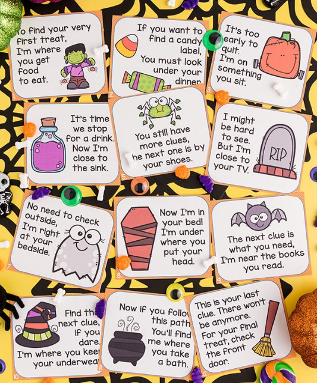
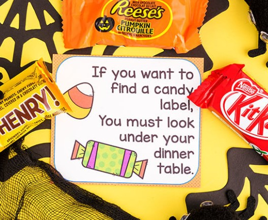
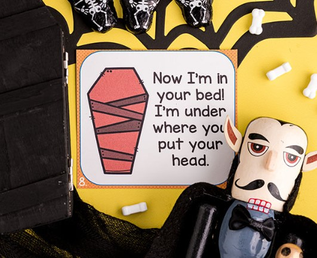
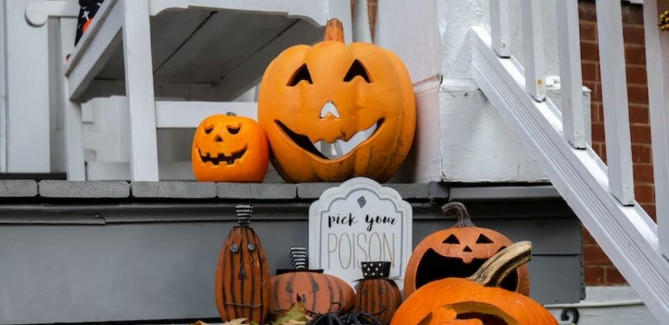
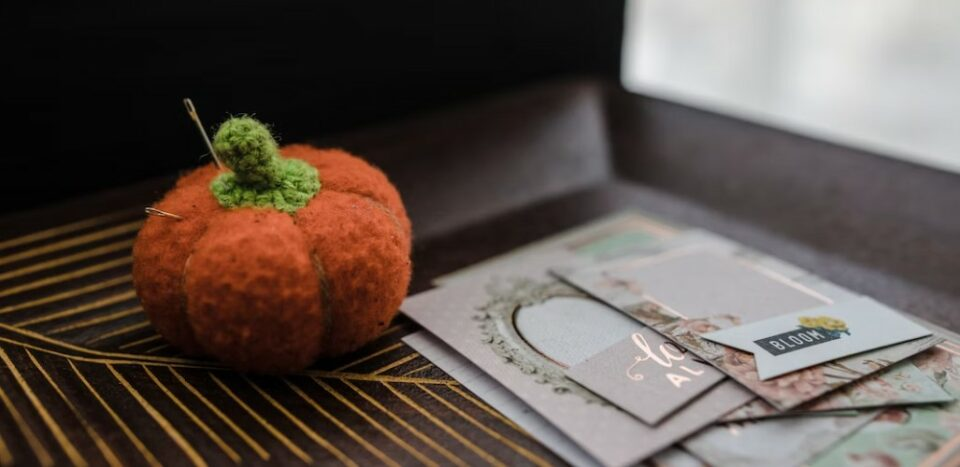
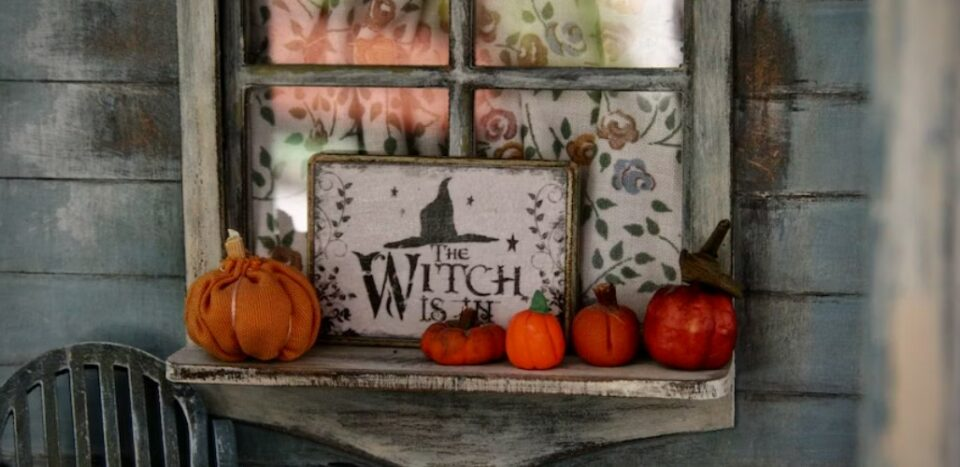
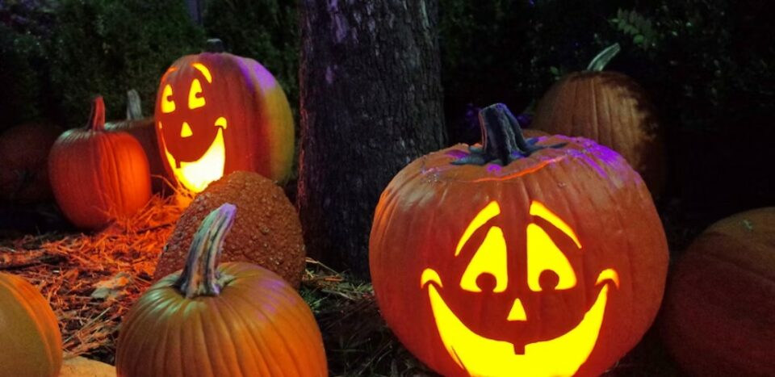
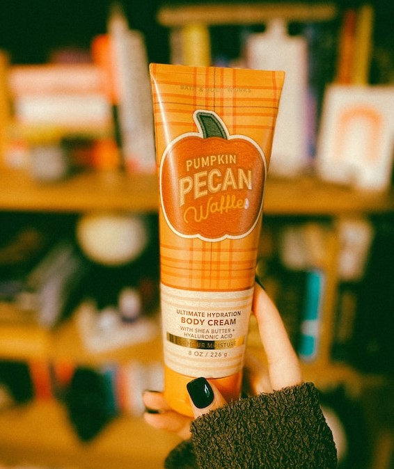

This article has been written and researched by our expert Loveable through a precise methodology. [Learn more about our methodology](https://avada.io/loveable/our-methodological.html)

[Loveable](https://avada.io/loveable/) > [Blog](https://avada.io/loveable/blog/) > [Holiday](https://avada.io/loveable/holiday/)

# Creative Halloween Scavenger Hunt Ideas To Spice Up Spooky Season

Written by [Blake Simpson](https://avada.io/loveable/author/blake/) Last Updated on August 30, 2023

- [6 Steps to Set Up a Halloween Scavenger Hunt](https://avada.io/loveable/blog/halloween-scavenger-hunt/#wp-block-heading-2-3)
- [Tips for a Successful Halloween Scavenger Hunt](https://avada.io/loveable/blog/halloween-scavenger-hunt/#wp-block-heading-2-17)
- [3 Best Halloween Scavenger Hunt Ideas for Friends and Family](https://avada.io/loveable/blog/halloween-scavenger-hunt/#wp-block-heading-2-27)
    - [Pumpkin Hunt](https://avada.io/loveable/blog/halloween-scavenger-hunt/#wp-block-heading-3-28)
    - [Virtual Scavenger Hunt](https://avada.io/loveable/blog/halloween-scavenger-hunt/#wp-block-heading-3-32)
    - [Museum Scavenger Hunt](https://avada.io/loveable/blog/halloween-scavenger-hunt/#wp-block-heading-3-34)
- [7 Clue Ideas for Halloween Scavenger Hunt](https://avada.io/loveable/blog/halloween-scavenger-hunt/#wp-block-heading-2-37)
    - [Printer](https://avada.io/loveable/blog/halloween-scavenger-hunt/#wp-block-heading-3-39)
    - [Computer](https://avada.io/loveable/blog/halloween-scavenger-hunt/#wp-block-heading-3-44)
    - [Stapler](https://avada.io/loveable/blog/halloween-scavenger-hunt/#wp-block-heading-3-49)
    - [Kitchen](https://avada.io/loveable/blog/halloween-scavenger-hunt/#wp-block-heading-3-55)
    - [Broom](https://avada.io/loveable/blog/halloween-scavenger-hunt/#wp-block-heading-3-57)
    - [Microwave](https://avada.io/loveable/blog/halloween-scavenger-hunt/#wp-block-heading-3-59)
    - [Pumpkin](https://avada.io/loveable/blog/halloween-scavenger-hunt/#wp-block-heading-3-64)
- [10 Prize Ideas for Halloween Scavenger Hunt](https://avada.io/loveable/blog/halloween-scavenger-hunt/#wp-block-heading-2-69)
    - [DoorDash or UberEats gift card](https://avada.io/loveable/blog/halloween-scavenger-hunt/#wp-block-heading-3-70)
    - [Sugarwish](https://avada.io/loveable/blog/halloween-scavenger-hunt/#wp-block-heading-3-73)
    - [SnackMagic](https://avada.io/loveable/blog/halloween-scavenger-hunt/#wp-block-heading-3-75)
    - [Crumbl Cookies](https://avada.io/loveable/blog/halloween-scavenger-hunt/#wp-block-heading-3-77)
    - [Knack](https://avada.io/loveable/blog/halloween-scavenger-hunt/#wp-block-heading-3-80)
    - [Starbucks or Dunkin’ gift card](https://avada.io/loveable/blog/halloween-scavenger-hunt/#wp-block-heading-3-82)
    - [Harry & David](https://avada.io/loveable/blog/halloween-scavenger-hunt/#wp-block-heading-3-85)
    - [Snappy](https://avada.io/loveable/blog/halloween-scavenger-hunt/#wp-block-heading-3-88)
    - [Bath & Body Works](https://avada.io/loveable/blog/halloween-scavenger-hunt/#wp-block-heading-3-90)
    - [Halloween-Themed Socks](https://avada.io/loveable/blog/halloween-scavenger-hunt/#wp-block-heading-3-93)
- [Bottom Line](https://avada.io/loveable/blog/halloween-scavenger-hunt/#wp-block-heading-2-95)

As summer winds down, temperatures cool, and Halloween decorations pop up everywhere, it’s time for Halloween! To make the most of it, a Halloween scavenger hunt is the perfect opportunity to gather your loved ones and get into the spooky spirit. 

In today’s article, we will show you some of **the best Halloween scavenger hunt ideas** for some Fall-season entertainment.

## **6 Steps to Set Up a Halloween Scavenger Hunt**

A Halloween scavenger hunt is quite fun and easy to set up. If you’ve never participated in a Halloween scavenger hunt before, we’ve got you covered.

First, download the clue cards [here](https://www.thebestideasforkids.com/wp-content/uploads/2022/10/Halloween-Scavenger-Hunt-The-Best-Ideas-for-Kids.pdf) and print them out.

Hide the second clue first.

Based on the previous clue hints, hide all clue cards until there’s only the last one left.

Hide the last prize outside the front door or anywhere else you want to hide.

To make the Halloween scavenger hunt longer, you can add your DIY extra cards before the last clue.

When you are ready to start the hunt, hand out the first clue to the players.

## **Tips for a Successful Halloween Scavenger Hunt**

When your Halloween scavenger hunters return, make sure they are greeted warmly. Offer them some Halloween treats and keep them updated on the progress of the other players. You can serve the following items:

- Hot dogs, wings, and pizza
- Cold drinks, especially Halloween-themed beverages
- Coffee or hot chocolate

You may offer prizes for specific categories, such as:

- The first player returns
- Most creative clue interpretation
- Prize for the player that found the most

## **3 Best Halloween Scavenger Hunt Ideas for Friends and Family**

### **Pumpkin Hunt**

Halloween scavenger hunts may take different forms. Gather some toy pumpkins and place them in your house or garden. The player that finds the most pumpkins wins! This entertaining twist on Easter egg hunts keeps things simple yet active for everyone looking for a quick-start solution.

If you want a more typical Halloween scavenger hunt experience, hide the pumpkins in strategic locations and provide a few clues to lead players on the proper path.

### **Virtual Scavenger Hunt**

Virtual scavenger hunts are an entertaining approach to engaging with loved ones while also ensuring they enjoy a festive fall event. Set a time restriction and write down some puzzles and clues that lead to stuff people could find in their houses. When the clock runs out, the player with the most accurate things wins!

### **Museum Scavenger Hunt**

Museum scavenger hunts are a wonderful way to hold a virtual event for your friends and family. If you don’t have time to plan ahead of time, [The Escape Game](https://theescapegame.com/) provides pre-made scavenger hunt checklists that you can use on your virtual excursions to museums, including The Van Gogh Museum, The British Museum, The Getty, and more!

## **7 Clue Ideas for Halloween Scavenger Hunt**

### **Printer**

Figures hiding in the shadows,

The eerie ticking of a clock.

My job requires lots of paper,

Be sure to have some in stock.

### **Computer**

Pumpkins, pumpkins,

Around the house.

I have a lot of keys

And a mouse, too.

### **Stapler**

I sit with pointed fangs and wait

With piercing force, I dole out fate

Over bloodless victims, I proclaim my might

I can eternally join with one bite.

What am I?

### **Kitchen**

Now onto the next clue. Go to the place where you can get ingredients to cook a witch’s meal.

### **Broom**

While you find the thing a witch needs to fly around, watch out for any zombie hands that might pop up from the ground.

### **Microwave**

A Nightmare on Elm Street,

Be careful not to go to sleep.

I can cook faster than anyone else,

And I also go beep, beep!

### **Pumpkin**

If you carve this out and then

Stick in a [candlelight](https://avada.io/loveable/floating-candles-halloween/)

The result should be

Giving someone a fright.

## **10 Prize Ideas for Halloween Scavenger Hunt**

### **DoorDash or UberEats gift card**

Sometimes, gift cards for delicious meals can be an ideal reward for a Halloween scavenger hunt. With many millions of active users, both DoorDash and UberEats offer excellent choices when it comes to gift cards.

### **Sugarwish**

Sugarwish makes it easy to send snacks as gifts – allowing the recipient to choose their favorite treats. This snack delivery platform features a range of candies, snacks, [popcorn](https://avada.io/loveable/halloween-popcorn-balls/), cookies, and more. All you need to do is select a gift type and size – your recipients will then be able to pick out their favorites without having to worry about any potential allergies.

### **SnackMagic**

SnackMagic is the perfect solution for Halloween scavenger hunt prizes. With hundreds of five-star Google reviews, SnackMagic allows users to build their custom snack boxes with over 2,000 unique and delicious options. Plus, plenty of items cater to different diets, including vegan, vegetarian, pescatarian, gluten-free, kosher, dairy-free, and nut-free – making sure everyone can enjoy snacks with peace of mind!

### **Crumbl Cookies**

When two cousins opened a cookie shop in Utah back in 2017, the world got a little sweeter. Crumbl cookies have become one of the trendiest gifts to give, your friends and family will thank you for it! With their weekly rotating menu of [mouth-watering cookies](https://avada.io/loveable/cookie-gifts/%5C), they not only make sure you are getting the tastiest treats but also that there is always something new to try! After your loved ones receive this gift, expect lots of grateful smiles and happy faces.

### **Knack**

Knack has perfect options for any Halloween scavenger hunt players to enjoy, plus the bonus that it sources products from small businesses and skilled artisans. Whether you want to shop from its expertly curated prize options or create a custom one, Knack makes everything much easier.

### **Starbucks or Dunkin’ gift card**

Fall is here, and so are the delicious limited-edition fall drinks! Whether you’re rewarding a winning player or just treating yourself, you cannot go wrong with gift cards to either Starbucks or Dunkin’. Most Americans love their coffee, and these two brands are sure to please even the pickiest palates. With the wide range of classic hot and cold drinks ranging from lattes and cappuccinos to pumpkin spice ice coffee, there is always something for everyone! So why wait any longer? Get your warm beverage fix today with one of these amazing prize options.

### **Harry & David**

Harry & David is an exceptional platform for purchasing [food-related gifts](https://avada.io/loveable/gifts-foodies/), presenting a wide selection of carefully curated gift boxes at various price points. They offer an extensive range of products, including chocolates, bakery treats, popcorn, trail mixes, cookies, and so on.

Additionally, the Harry & David family of companies encompasses renowned brands such as Simply Chocolate, 1800 Baskets, Shari’s Berries, and the Popcorn Factory, ensuring a diverse and appealing assortment for all. Furthermore, customers can easily filter by season to discover what the fall season has to offer.

### **Snappy**

Snappy is an all-in-one giving platform that may assist you in sending ideal gifts for friends and family and make the Halloween scavenger hunt worthwhile. Your recipients can accept their chosen [Halloween gift](https://avada.io/loveable/halloween-gifts/) or choose something else from Snappy’s curated range of crowd-pleasing goods from the market’s greatest brands.

### **Bath & Body Works**

Bath & Body Works surely understands how to put together a Halloween collection. From a range of autumn-[scented candles](https://avada.io/loveable/personalized-candles/), lotions, soaps, and body mists, everyone can find something they like at Bath & Body Works. Furthermore, the brand offers gifts for every price range and gift cards if your recipients want to choose their rewards.

### **Halloween-Themed Socks**

Comfortable Halloween-themed socks are no doubt an ideal prize for a Halloween scavenger hunt. Black cat, ghost, skull, and bat socks are sure to make the user grin. Isn’t that what a Halloween reward is for?

## **Bottom Line**

Creating a fun **Halloween scavenger hunt** for all your guests can be tricky, but with a few easy tips, it can be enjoyable for everyone! Ensure the items you are asking your players to find are not too difficult, so they do not end up searching for hours and becoming frustrated. When planning out the game, make sure all items have the same difficulty level and everyone has an equal opportunity to participate in the Halloween scavenger hunt. And finally, enjoy yourself while playing!

- [6 Steps to Set Up a Halloween Scavenger Hunt](https://avada.io/loveable/blog/halloween-scavenger-hunt/#wp-block-heading-2-3)
- [Tips for a Successful Halloween Scavenger Hunt](https://avada.io/loveable/blog/halloween-scavenger-hunt/#wp-block-heading-2-17)
- [3 Best Halloween Scavenger Hunt Ideas for Friends and Family](https://avada.io/loveable/blog/halloween-scavenger-hunt/#wp-block-heading-2-27)
    - [Pumpkin Hunt](https://avada.io/loveable/blog/halloween-scavenger-hunt/#wp-block-heading-3-28)
    - [Virtual Scavenger Hunt](https://avada.io/loveable/blog/halloween-scavenger-hunt/#wp-block-heading-3-32)
    - [Museum Scavenger Hunt](https://avada.io/loveable/blog/halloween-scavenger-hunt/#wp-block-heading-3-34)
- [7 Clue Ideas for Halloween Scavenger Hunt](https://avada.io/loveable/blog/halloween-scavenger-hunt/#wp-block-heading-2-37)
    - [Printer](https://avada.io/loveable/blog/halloween-scavenger-hunt/#wp-block-heading-3-39)
    - [Computer](https://avada.io/loveable/blog/halloween-scavenger-hunt/#wp-block-heading-3-44)
    - [Stapler](https://avada.io/loveable/blog/halloween-scavenger-hunt/#wp-block-heading-3-49)
    - [Kitchen](https://avada.io/loveable/blog/halloween-scavenger-hunt/#wp-block-heading-3-55)
    - [Broom](https://avada.io/loveable/blog/halloween-scavenger-hunt/#wp-block-heading-3-57)
    - [Microwave](https://avada.io/loveable/blog/halloween-scavenger-hunt/#wp-block-heading-3-59)
    - [Pumpkin](https://avada.io/loveable/blog/halloween-scavenger-hunt/#wp-block-heading-3-64)
- [10 Prize Ideas for Halloween Scavenger Hunt](https://avada.io/loveable/blog/halloween-scavenger-hunt/#wp-block-heading-2-69)
    - [DoorDash or UberEats gift card](https://avada.io/loveable/blog/halloween-scavenger-hunt/#wp-block-heading-3-70)
    - [Sugarwish](https://avada.io/loveable/blog/halloween-scavenger-hunt/#wp-block-heading-3-73)
    - [SnackMagic](https://avada.io/loveable/blog/halloween-scavenger-hunt/#wp-block-heading-3-75)
    - [Crumbl Cookies](https://avada.io/loveable/blog/halloween-scavenger-hunt/#wp-block-heading-3-77)
    - [Knack](https://avada.io/loveable/blog/halloween-scavenger-hunt/#wp-block-heading-3-80)
    - [Starbucks or Dunkin’ gift card](https://avada.io/loveable/blog/halloween-scavenger-hunt/#wp-block-heading-3-82)
    - [Harry & David](https://avada.io/loveable/blog/halloween-scavenger-hunt/#wp-block-heading-3-85)
    - [Snappy](https://avada.io/loveable/blog/halloween-scavenger-hunt/#wp-block-heading-3-88)
    - [Bath & Body Works](https://avada.io/loveable/blog/halloween-scavenger-hunt/#wp-block-heading-3-90)
    - [Halloween-Themed Socks](https://avada.io/loveable/blog/halloween-scavenger-hunt/#wp-block-heading-3-93)
- [Bottom Line](https://avada.io/loveable/blog/halloween-scavenger-hunt/#wp-block-heading-2-95)

### [Blake Simpson](https://avada.io/loveable/author/blake/)

Hi, I'm Blake from Loveable. I help people find perfect gifts for occasions like anniversaries and weddings. I also write a blog about holidays, sharing insights to make them more meaningful. Let's create unforgettable moments together!

- [Twitter](https://twitter.com/intent/tweet)
- [Facebook](https://www.facebook.com/sharer/sharer.php)
- [instagram](https://avada.io/loveable/blog/halloween-scavenger-hunt/)
- [pinterest](https://www.pinterest.com/loveablellc/)

## Related Posts

[### 120+ Christian Birthday Wishes To Spread Your Love](https://avada.io/loveable/blog/christian-birthday-wishes/) 

[

### 35 Best 70th Birthday Ideas To Celebrate The Special Milestone

](https://avada.io/loveable/blog/70th-birthday-ideas/)

[

### 50 Best 30th Birthday Decorations for a Remarkable Birthday Bash

](https://avada.io/loveable/blog/30th-birthday-decorations/)

[

### 40 Delicious Vegan Christmas Desserts to Delight Your Palate

](https://avada.io/loveable/blog/vegan-christmas-desserts/)

[

### 60 Christmas Team Building Activities to Boost Workplace Spirit

](https://avada.io/loveable/blog/christmas-team-building-activities/)
