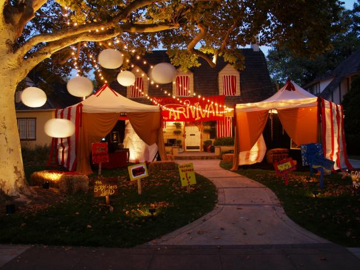
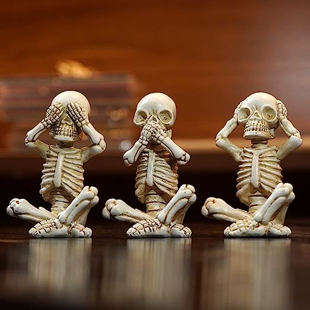

This article has been written and researched by our expert Loveable through a precise methodology. [Learn more about our methodology](https://avada.io/loveable/our-methodological.html)

[Loveable](https://avada.io/loveable/) > [Blog](https://avada.io/loveable/blog/) > [Holiday](https://avada.io/loveable/holiday/)

# Creative Ideas for Decorated Halloween Homes 2023

Written by [Blake Simpson](https://avada.io/loveable/author/blake/) Last Updated on September 19, 2023

- [Importance and Popularity of Decorated Halloween Homes](https://avada.io/loveable/blog/decorated-halloween-homes/#wp-block-heading-2-4)
- [Classic Halloween Home Decorations](https://avada.io/loveable/blog/decorated-halloween-homes/#wp-block-heading-2-9)
    - [Haunted House Facades](https://avada.io/loveable/blog/decorated-halloween-homes/#wp-block-heading-3-10)
        - [1\. Cobwebs, tattered curtains, and broken windows](https://avada.io/loveable/blog/decorated-halloween-homes/#wp-block-heading-4-11)
        - [2\. Jack-o’-lanterns and eerie lighting effects](https://avada.io/loveable/blog/decorated-halloween-homes/#wp-block-heading-4-15)
        - [3\. Sound effects and spooky music](https://avada.io/loveable/blog/decorated-halloween-homes/#wp-block-heading-4-19)
    - [Front Yard Graveyards](https://avada.io/loveable/blog/decorated-halloween-homes/#wp-block-heading-3-23)
        - [1\. Tombstones and epitaphs](https://avada.io/loveable/blog/decorated-halloween-homes/#wp-block-heading-4-24)
        - [2\. Fog machines and eerie lighting](https://avada.io/loveable/blog/decorated-halloween-homes/#wp-block-heading-4-27)
        - [3\. Skeletons, zombies, and other spooky props](https://avada.io/loveable/blog/decorated-halloween-homes/#wp-block-heading-4-31)
    - [Pumpkin Displays](https://avada.io/loveable/blog/decorated-halloween-homes/#wp-block-heading-3-35)
        - [1\. Carved pumpkin arrangements](https://avada.io/loveable/blog/decorated-halloween-homes/#wp-block-heading-4-36)
        - [2\. Pumpkin towers and arches](https://avada.io/loveable/blog/decorated-halloween-homes/#wp-block-heading-4-40)
        - [3\. Pumpkin-lined pathways](https://avada.io/loveable/blog/decorated-halloween-homes/#wp-block-heading-4-44)
- [Creative Themes for Decorated Halloween Homes](https://avada.io/loveable/blog/decorated-halloween-homes/#wp-block-heading-2-48)
    - [Spooky Forest](https://avada.io/loveable/blog/decorated-halloween-homes/#wp-block-heading-3-49)
        - [1\. Fake trees with gnarled branches](https://avada.io/loveable/blog/decorated-halloween-homes/#wp-block-heading-4-50)
        - [2\. Hanging bats and owls](https://avada.io/loveable/blog/decorated-halloween-homes/#wp-block-heading-4-54)
        - [3\. Mystical lighting effects](https://avada.io/loveable/blog/decorated-halloween-homes/#wp-block-heading-4-58)
    - [Witch’s Lair](https://avada.io/loveable/blog/decorated-halloween-homes/#wp-block-heading-3-63)
        -       [1. Cauldrons and potion props](https://avada.io/loveable/blog/decorated-halloween-homes/#wp-block-heading-4-64)
        - [2\. Broomsticks and witch hats](https://avada.io/loveable/blog/decorated-halloween-homes/#wp-block-heading-4-68)
        - [3\. Flying witch decorations](https://avada.io/loveable/blog/decorated-halloween-homes/#wp-block-heading-4-72)
    - [Haunted Carnival](https://avada.io/loveable/blog/decorated-halloween-homes/#wp-block-heading-3-76)
        - [1\. Creepy clowns and carnival games](https://avada.io/loveable/blog/decorated-halloween-homes/#wp-block-heading-4-77)
        - [2\. Vintage signage and ticket booths](https://avada.io/loveable/blog/decorated-halloween-homes/#wp-block-heading-4-81)
        - [3\. Striped tents and haunted carousel decorations](https://avada.io/loveable/blog/decorated-halloween-homes/#wp-block-heading-4-85)
- [Recommended items for decorated Halloween homes](https://avada.io/loveable/blog/decorated-halloween-homes/#wp-block-heading-2-89)
    - [Halloween Decorations Bats](https://avada.io/loveable/blog/decorated-halloween-homes/#wp-block-heading-3-90)
    - [Halloween Spider Decorations](https://avada.io/loveable/blog/decorated-halloween-homes/#wp-block-heading-3-94)
    - [Collapsible Pumpkin Decorations](https://avada.io/loveable/blog/decorated-halloween-homes/#wp-block-heading-3-98)
    - [Decorations Light](https://avada.io/loveable/blog/decorated-halloween-homes/#wp-block-heading-3-102)
    - [Wise Skeletons Statue](https://avada.io/loveable/blog/decorated-halloween-homes/#wp-block-heading-3-106)
    - [Black Witch Cat Sign](https://avada.io/loveable/blog/decorated-halloween-homes/#wp-block-heading-3-110)
    - [Paper Lanterns Party Decorations](https://avada.io/loveable/blog/decorated-halloween-homes/#wp-block-heading-3-114)
- [Safety Considerations for Decorated Halloween Homes](https://avada.io/loveable/blog/decorated-halloween-homes/#wp-block-heading-2-119)
    - [Proper lighting for visibility and preventing accidents](https://avada.io/loveable/blog/decorated-halloween-homes/#wp-block-heading-3-121)
    - [Securely anchoring decorations and props](https://avada.io/loveable/blog/decorated-halloween-homes/#wp-block-heading-3-124)
    - [Fire safety precautions](https://avada.io/loveable/blog/decorated-halloween-homes/#wp-block-heading-3-127)
- [In Conclusion,](https://avada.io/loveable/blog/decorated-halloween-homes/#wp-block-heading-2-129)

Halloween awakens a distinct type of individual. While anyone can partake in the food, festivities, presents, and copious amounts of alcohol that accompany other holidays, All Hallow’s Eve possesses a unique essence. Those who cherish this holiday do so with an intensity and delight that astonishes and often frightens those in their vicinity. 

The devotees of darkness who revel in the eerie nature of autumn always bring their best efforts, whether through awe-inspiring and astonishing costumes, envy-inducing jack-o’-lanterns, or the elaborate adornments they use to [transform their homes.](https://avada.io/loveable/decorating-deals/)

When you’re ready to find inspiration and give your home the deserving Halloween makeover, here are typical **decorated Halloween homes** that have mastered the art of hauntingly captivating decorations.

## **Importance and Popularity of Decorated Halloween Homes**

Decorated Halloween homes have risen in importance and popularity, becoming a cherished aspect of the Halloween season. These elaborately adorned houses play a significant role in creating a festive and immersive atmosphere that brings joy, excitement, and a sense of wonder to the community.

The importance of decorated Halloween homes lies in their ability to inspire creativity and self-expression. Homeowners embrace the opportunity to showcase their imagination and artistic skills, transforming their properties into captivating and enchanting displays. These decorations range from intricately [carved pumpkins](https://avada.io/loveable/blog/halloween-pumpkin/) and hauntingly realistic scenes to dazzling lights and themed adornments, all of which contribute to the overall ambiance and spirit of Halloween.

Moreover, decorated Halloween homes hold special significance for trick-or-treaters, particularly children and families. These transformed houses create a safe and memorable environment for children to embark on their Halloween adventures. The delight of approaching a beautifully decorated home and the anticipation of receiving treats add to the magic and excitement of the holiday, creating lasting memories for all involved.

## **Classic Halloween Home Decorations**

### **Haunted House Facades**

#### **1\. [Cobwebs, tattered curtains, and broken windows](https://www.amazon.com/Yomiie-Halloween-Stretch-Spiderwebs-Decorations/dp/B07V9MVHQ3)**

When decorating for Halloween, incorporating cobwebs, tattered curtains, and broken windows sets a spooky atmosphere. These elements symbolize neglect, decay, and mystery, adding to the eerie ambiance of the holiday. 

Cobwebs imply unseen creatures or spirits, while tattered curtains evoke secrecy and suspense. Broken windows contribute to the overall dilapidated look and create a sense of vulnerability. By including these decorations, you can transform your home into a chilling setting that captures the essence of Halloween.

#### **2\. [Jack-o’-lanterns and eerie lighting effects](https://www.amazon.com/Department-56-Lit-Jack-Lanterns/dp/B00264HB2I/)**

These lanterns and eerie lighting effects play a vital role in creating a haunting Halloween ambiance. They are carved with menacing faces and illuminated from within, so they bring a spooky and mischievous atmosphere to any Halloween display. Their flickering glow casts eerie shadows and adds an element of mystery to the surroundings. 

Complementing them with eerie lighting effects, such as dim or colored lighting, adds an extra layer of otherworldly enchantment. Together, these elements create a captivating and unsettling atmosphere, making your Halloween decorations truly memorable.

#### **3\. Sound effects and spooky music**

Incorporating eerie sound effects, such as creaking doors, howling winds, or sinister laughter, creates an immersive experience that sends chills down the spine. These effects heighten anticipation and evoke a sense of suspense and mystery. 

Pairing them with haunting melodies and spooky music adds another layer of ambiance, intensifying the eerie atmosphere. The combination of sound effects and eerie music creates a truly immersive and spine-tingling environment, making your Halloween decorations come alive with a haunting allure.

### **Front Yard Graveyards**

#### **1\. [Tombstones and epitaphs](https://www.amazon.com/Hourleey-Halloween-Tombstones-Graveyard-Decorations/dp/B0C2CJSS4G/)**

The weathered and aged appearance of tombstones evokes a sense of mortality and the eerie presence of a graveyard. Adding epitaph inscriptions on the tombstones will deepen the eerie atmosphere. These epitaphs can be crafted with clever or spooky wording, capturing the essence of the holiday. They create an unsettling feeling, reminding us of the transient nature of life and the mysterious realm beyond. 

#### **2\. [Fog machines and eerie lighting](https://www.amazon.com/IMONE-Christmas-Halloween-Wireless-Automatic/dp/B0B5MW1XDQ)**

The machines and eerie lighting are essential for creating an ideal atmosphere in decorated Halloween homes. The combination of fog and strategically placed lighting enhances the spooky ambiance by obscuring visibility and creating an air of mystery. 

The swirling fog adds an ethereal and ghostly quality, while the eerie lighting casts eerie shadows and highlights specific areas, heightening the suspense. They create a captivating and immersive environment that transports guests into a realm of fright and fascination, making it a perfect addition to Halloween decorations.

#### **3\. [Skeletons, zombies, and other spooky props](https://www.amazon.com/DINESIL-Halloween-Skeleton-Skeletons-Decorations/dp/B0B3MRB39G/)**

The bony figures of skeletons bring an eerie presence that represents mortality and the afterlife. Zombies, with their decaying appearance and haunting gaze, embody the undead and add a chilling touch. These spooky props, when strategically placed, create a sense of unease and anticipation, immersing visitors in a world of fright. 

Whether lurking in corners or hanging from trees, these decorations enhance the Halloween atmosphere, conjuring a spine-tingling experience that leaves a lasting impression on all who encounter them.

### **Pumpkin Displays**

#### **1\. [Carved pumpkin arrangements](https://www.amazon.com/dp/B07WPFR9MV/)**

These pumpkin arrangements are iconic symbols of Halloween and bring a festive spirit to decorated Halloween homes. These meticulously carved pumpkins, often adorned with spooky or whimsical faces, exude a playful and enchanting aura. Placing them strategically around your home, whether on doorsteps, windowsills, or as a centerpiece, adds a warm and inviting glow. 

The flickering candlelight within creates mesmerizing patterns and casts eerie shadows, setting a magical ambiance. Carved pumpkin arrangements serve as a hallmark of Halloween creativity, welcoming visitors with their charming and bewitching presence.

#### **2\. [Pumpkin towers and arches](https://www.amazon.com/Joiedomi-Halloween-Collapsible-Pumpkins-Decoration/dp/B096T24W86/)**

Constructing towers or arches with stacked pumpkins creates a striking visual impact. The varying sizes and shapes of the pumpkins add depth and dimension to the arrangement. 

Adorned with eerie faces or intricate designs, these pumpkin structures become focal points that command attention. They serve as gateways or landmarks, guiding guests into a whimsical world of Halloween enchantment. With their warm orange glow, the towering or arched formations evoke a sense of wonder and beckon visitors to explore the magical realm within.

#### **3\. [Pumpkin-lined pathways](https://www.amazon.com/BAPPEY-Pumpkin-Decor-Realistic-Thanksgiving/dp/B0C371K2NY/)**

Pumpkins along pathways create a magical and inviting atmosphere for Halloween decor. Placing pumpkins along the sides of pathways, whether on the ground or on elevated pedestals, adds a touch of enchantment. The vibrant orange hues of the pumpkins contrast beautifully with the surrounding environment. 

As guests follow the path, they are greeted by a delightful display of glowing pumpkins, casting a warm and welcoming glow. The [floating candlelight](https://avada.io/loveable/blog/floating-candles-halloween/) within the pumpkins creates a whimsical ambiance, guiding visitors along the path and setting the stage for an unforgettable Halloween experience.

## **Creative Themes for Decorated Halloween Homes**

### **Spooky Forest**

#### **1\. [Fake trees with](https://www.amazon.com/Christmas-Accessories-Ornament-Artificial-Branches/dp/B0B4SB6VC8/) [gnarled](https://www.amazon.com/Christmas-Accessories-Ornament-Artificial-Branches/dp/B0B4SB6VC8/) [branches](https://www.amazon.com/Christmas-Accessories-Ornament-Artificial-Branches/dp/B0B4SB6VC8/)**

These artificial trees, designed to mimic twisted and gnarled branches, evoke an otherworldly and eerie atmosphere. Their sinister appearance creates a sense of foreboding and mystery. Adorned with spider webs, hanging bats, or ghostly ornaments, they become the focal point of a Halloween display. 

The interplay of darkness and shadows among the gnarled branches adds an extra layer of spookiness. These fake trees bring an element of enchantment and darkness, transforming any space into a hauntingly beautiful Halloween setting.

#### **2\. [Hanging bats and owls](https://www.amazon.com/Coogam-Halloween-Decoration-Different-Realistic/dp/B07TRCJJS3/)**

Suspended from ceilings or perched on branches, these decorations add a touch of mystery and intrigue. [Hanging bats](https://avada.io/loveable/bat-gifts/), with their wings, outstretched, symbolize the nocturnal and enigmatic world of Halloween. They generate a sense of the supernatural and the macabre. 

Owls are known for their association with wisdom and mysticism, bringing an air of ancient magic to the scene. Their piercing gaze and silent flight enhance the eerie ambiance. Together, hanging bats and owls infuse a sense of foreboding and fascination, immersing guests in the dark enchantment of Halloween.

#### **3\. [Mystical lighting effects](https://www.amazon.com/Outdoor-Waterproof-Halloween-8-Lighting-Decoration/dp/B0B2NPV5XG/)**

Soft, flickering lights or colored lighting can cast an eerie and mesmerizing glow, illuminating the surroundings with an enchanting allure. By strategically placing these lights, shadows dance and shapes shift, evoking a sense of mystery and wonder. 

The mystical lighting effects add a touch of enchantment, turning any Halloween display into a captivating realm of spellbinding beauty and captivating illusions.

**_Related_**: Best [Personalized Halloween Gifts](https://avada.io/loveable/personalized-halloween-gifts/) For The One That Mean To You

### **Witch’s Lair**

####       **1. [Cauldrons and potion props](https://www.amazon.com/Black-Cauldron-Plastic-Halloween-Decoration/dp/B08CL5P2S6/)**

The bubbling cauldron has mystical connotations, becoming a focal point of intrigue. Whether filled with dry ice for smoky effects or adorned with eerie symbols, it exudes an aura of magic and mystery. 

Potion props, displayed with their colorful liquids, enchanted ingredients, and arcane labels, add an air of spellcasting and sorcery. These props evoke a sense of ancient alchemy and invite guests into enchantment and wonder. 

#### **2\. [Broomsticks and witch hats](https://www.amazon.com/BESTOYARD-halloween-costume-broomstick-Halloween/dp/B0CDVLMLML/)**

Prepare to take flight on the wings of enchantment with broomsticks and witch hats, the iconic symbols of all things magical. Broomsticks have a rustic charm and whimsical bristles, embodying the essence of witches’ journeys through moonlit skies. Prop them against walls or suspend them from ceilings, as if awaiting their next supernatural voyage. 

And what is a witch without her signature hat? Witch hats, adorned with mysterious adornments and wide-brimmed elegance, lend an air of sorcery and intrigue to any Halloween display. 

#### **3\. [Flying witch decorations](https://www.amazon.com/Halloween-Decoration-Light-up-Activation-Decorations/dp/B0B4VCRV5G)**

These whimsical displays capture the essence of bewitching allure as witches soar through the night sky on their broomsticks. Suspended from trees, porch ceilings, or even creating a mesmerizing mobile, these decorations bring the spirit of sorcery to life. 

With flowing capes, pointed hats, and outstretched arms, these flying witches evoke a sense of mystical energy and adventure. Whether casting spells or cackling with delight, these airborne enchantresses add a touch of whimsy and wonder to your Halloween decor, igniting imaginations and conjuring up a truly spellbinding atmosphere.

### **Haunted Carnival**

#### **1\. [Creepy clowns and carnival games](https://www.amazon.com/Halloween-Side-Show-Value-Cutouts/dp/B012H26J7G)**

Step right up and brace yourself for a spine-chilling spectacle featuring creepy clowns and eerie carnival games. Creepy clowns, with their painted smiles and unsettling stares, invite you into a macabre circus of fright. Their exaggerated features and eerie costumes create an atmosphere of discomfort and suspense. 

And as you wander through the shadowy carnival, be prepared for twisted games that challenge your nerves. From rigged prizes to unsettling challenges, these carnival games blur the line between amusement and terror, leaving you wondering if it’s all just an elaborate nightmare. 

#### **2\. [Vintage signage and ticket booths](https://www.amazon.com/Railroad-Ticket-Booth-Tabletop-Stand-Up/dp/B088C51719)**

These vintage signs guide you through a journey into the past, setting the stage for an enchanting experience. And what carnival experience is complete without a ticket booth? Imagine an intricately designed booth, its weathered paint and ornate details showcasing the craftsmanship of a bygone era. 

With vintage signage and ticket booths, your Halloween display captures the essence of a bygone era, inviting visitors to immerse themselves in the nostalgia and embrace the magic of the past.

#### **3\. [Striped tents and haunted carousel decorations](https://www.amazon.com/Haunted-Hill-Farm-Battery-Operated-HHFTCL-4HLS/dp/B09D8SWRGT)**

The vibrant colors of striped tents and nostalgic charm, beckon you inside, promising a journey into the unknown. Wander through the eerie corridors, where shadows dance, and secrets lie in wait. But beware, for within these tents lies a carousel frozen in time.

Haunting melodies fill the air, as the carousel whispers tales of forgotten laughter and lost innocence. With striped tents and haunted carousel decorations, immerse yourself in a world where enchantment intertwines with the macabre, promising a Halloween experience that will leave you captivated and slightly unnerved.

## **Recommended items for decorated Halloween homes**

### **[Halloween Decorations Bats](https://www.amazon.com/Halloween-Decorations-Supplies-Reusable-Stickers/dp/B0B1H2KZCC/)**

This captivating set includes a whopping 64 reusable PVC 3D black bat stickers, designed to transform any space into a hauntingly spectacular display. Whether you’re hosting an indoor Halloween party or looking to spook up your outdoor decor, these versatile bat stickers are perfect for adorning walls, windows, doors, or even your bathroom.

Let your creativity soar as you arrange these bats in various formations, creating a swarm of nocturnal creatures that will leave your guests trembling with delight.

### **[Halloween Spider Decorations](https://www.amazon.com/Halloween-Decorations-Spider-300sqft-Stretchy/dp/B0B71D5WTF)**

Embrace the spookiest season of the year with our Halloween Spider Decorations set. Prepare to create a chilling scene with the 220″ Spider Web and its accompanying 60″ Giant Spider, adding a touch of fright to your outdoor yard or haunted house.

With 300 square feet of stretchy cobwebs, you can weave a web of terror that engulfs your surroundings. Complete the eerie ambiance with 25 realistic-looking fake spiders, each equipped with a hook for easy placement. 

### **[Collapsible Pumpkin Decorations](https://www.amazon.com/Halloween-Collapsible-Pumpkin-Decorations-Operated/dp/B0B5K986VG/)**

This captivating set features a lighted fabric double pumpkin with a witch hat, creating a charming and whimsical display for both indoor and outdoor use. The soft glow emanating from the pumpkin lights, operated by batteries with a convenient timer feature, sets a spellbinding ambiance that lasts throughout the night.

Perfect for gardens, yards, or Halloween parties, these collapsible pumpkin decorations are easy to set up and store, making them a versatile choice for seasonal decor. 

### **[Decorations Light](https://www.amazon.com/PIXFAIRY-Halloween-Decorations-Waterproof-Outdoor/dp/B0993H5JW9/)**

Illuminate your Halloween with an eerie glow using our Halloween Decorations Light. Measuring 2.62 feet, this captivating set of spider web lights features 80 LED lights, casting a spellbinding orange hue that sets the perfect spooky ambiance. The waterproof net lights can be used both indoors and outdoors, allowing you to transform any space into a chilling Halloween spectacle.

Accompanied by menacing black spiders, these decorations add an extra touch of fright to your haunted decor. Prepare to amaze and terrify your guests with our Halloween Decorations Light, creating a spine-chilling atmosphere that will leave them spellbound.

### **[Wise Skeletons Statue](https://www.amazon.com/OwMell-Skeletons-Statue-Figurine-Halloween/dp/B0BMX6KC97/)**

These captivating figurines depict the iconic “See No Evil, Hear No Evil, Speak No Evil” concept, transformed into hauntingly beautiful skeletons. Each statue measures 3.3 inches, making them perfect for adorning your Halloween-themed home decor.

They are crafted with intricate details and a touch of macabre elegance, bringing a sense of mystery and wisdom to your space. Whether displayed together or scattered throughout your haunted abode, our Wise Skeletons Statue set adds a touch of Gothic charm and Halloween spirit to your surroundings.

### **[Black Witch Cat Sign](https://www.amazon.com/PAIION-Halloween-Vintage-Bathroom-Decoration/dp/B09Y8NDKPP/)**

This vintage-inspired metal sign captures the essence of Halloween with its captivating design. Featuring the phrase “Once Upon A Time There was A Girl Who Really Loved Cats,” it celebrates the mystical bond between humans and their feline companions.

Measuring 8×12 inches, this sign is perfect for adorning your bathroom, bedroom, or even your man cave. Let the whimsical charm of the black witch cat ignite your imagination and add a touch of Halloween magic to your wall decor.

### **[Paper Lanterns Party Decorations](https://www.amazon.com/Lanterns-Decorations-Halloween-Thanksgiving-Graduation/dp/B09WRHRQGV/)**

This set includes 21 round hanging lanterns in striking shades of orange, purple, and black, perfect for adding a festive touch to your graduation, Halloween, Thanksgiving, or birthday parties.

Crafted from high-quality paper, these lanterns are lightweight and easy to assemble. Hang them from ceilings, or trees, or create an enchanting backdrop for memorable photos. Let these colorful lanterns transform your space into a whimsical realm of celebration and joy.

**_Related_**: [DIY Halloween Door Decorations](https://avada.io/loveable/halloween-door-decorations/) that Evoke the Spooky Season

## **Safety Considerations for Decorated Halloween Homes**

### **Proper lighting for visibility and preventing accidents**

Adequate lighting enhances visibility and prevents accidents, especially during nighttime visits. Illuminate pathways, stairs, and entrances to guide visitors safely. You should use well-placed outdoor lights or LED candles instead of open flames to reduce the risk of fire hazards. 

Use motion-activated lights or glow-in-the-dark markers to highlight potential tripping hazards or obstacles. By ensuring proper lighting, you create a safer environment for all who visit your decorated Halloween home.

### **Securely anchoring decorations and props**

When setting up decorations and props, it’s important to securely anchor them to prevent them from toppling over, especially in windy conditions. Use sturdy stakes, sandbags, or other appropriate methods to secure large inflatables, props, or displays. Ensure that hanging decorations are properly fastened to avoid accidental falls. 

It is also crucial to regularly check the stability of your decorations and make adjustments as needed to keep them secure throughout the Halloween season. Taking these precautions minimizes the risk of accidents or injuries caused by unstable decorations.

### **Fire safety precautions**

You should keep decorations away from open flames, heaters, or electrical outlets to reduce the risk of fire. Use flameless candles or LED lights instead of traditional candles to eliminate the potential for accidental fires. Check electrical cords for any signs of damage or fraying and replace them if necessary. Avoid overloading electrical circuits by distributing the load among multiple outlets.

## **In Conclusion,**

**Decorating your home for Halloween** is an opportunity to unleash your creativity and create a captivating and immersive experience for all who visit. By considering safety precautions such as proper lighting, securely anchoring decorations, and implementing fire safety measures, you can ensure that your decorated Halloween home is visually stunning and safe for everyone. 

So, let your imagination run wild, explore the wide array of creative ideas available, and transform your home into a Halloween masterpiece that will leave a lasting impression on all who dare to enter. Get ready to embrace the spirit of the season and create unforgettable memories in your beautifully decorated Halloween home in 2023. Happy haunting!

- [Importance and Popularity of Decorated Halloween Homes](https://avada.io/loveable/blog/decorated-halloween-homes/#wp-block-heading-2-4)
- [Classic Halloween Home Decorations](https://avada.io/loveable/blog/decorated-halloween-homes/#wp-block-heading-2-9)
    - [Haunted House Facades](https://avada.io/loveable/blog/decorated-halloween-homes/#wp-block-heading-3-10)
        - [1\. Cobwebs, tattered curtains, and broken windows](https://avada.io/loveable/blog/decorated-halloween-homes/#wp-block-heading-4-11)
        - [2\. Jack-o’-lanterns and eerie lighting effects](https://avada.io/loveable/blog/decorated-halloween-homes/#wp-block-heading-4-15)
        - [3\. Sound effects and spooky music](https://avada.io/loveable/blog/decorated-halloween-homes/#wp-block-heading-4-19)
    - [Front Yard Graveyards](https://avada.io/loveable/blog/decorated-halloween-homes/#wp-block-heading-3-23)
        - [1\. Tombstones and epitaphs](https://avada.io/loveable/blog/decorated-halloween-homes/#wp-block-heading-4-24)
        - [2\. Fog machines and eerie lighting](https://avada.io/loveable/blog/decorated-halloween-homes/#wp-block-heading-4-27)
        - [3\. Skeletons, zombies, and other spooky props](https://avada.io/loveable/blog/decorated-halloween-homes/#wp-block-heading-4-31)
    - [Pumpkin Displays](https://avada.io/loveable/blog/decorated-halloween-homes/#wp-block-heading-3-35)
        - [1\. Carved pumpkin arrangements](https://avada.io/loveable/blog/decorated-halloween-homes/#wp-block-heading-4-36)
        - [2\. Pumpkin towers and arches](https://avada.io/loveable/blog/decorated-halloween-homes/#wp-block-heading-4-40)
        - [3\. Pumpkin-lined pathways](https://avada.io/loveable/blog/decorated-halloween-homes/#wp-block-heading-4-44)
- [Creative Themes for Decorated Halloween Homes](https://avada.io/loveable/blog/decorated-halloween-homes/#wp-block-heading-2-48)
    - [Spooky Forest](https://avada.io/loveable/blog/decorated-halloween-homes/#wp-block-heading-3-49)
        - [1\. Fake trees with gnarled branches](https://avada.io/loveable/blog/decorated-halloween-homes/#wp-block-heading-4-50)
        - [2\. Hanging bats and owls](https://avada.io/loveable/blog/decorated-halloween-homes/#wp-block-heading-4-54)
        - [3\. Mystical lighting effects](https://avada.io/loveable/blog/decorated-halloween-homes/#wp-block-heading-4-58)
    - [Witch’s Lair](https://avada.io/loveable/blog/decorated-halloween-homes/#wp-block-heading-3-63)
        -       [1. Cauldrons and potion props](https://avada.io/loveable/blog/decorated-halloween-homes/#wp-block-heading-4-64)
        - [2\. Broomsticks and witch hats](https://avada.io/loveable/blog/decorated-halloween-homes/#wp-block-heading-4-68)
        - [3\. Flying witch decorations](https://avada.io/loveable/blog/decorated-halloween-homes/#wp-block-heading-4-72)
    - [Haunted Carnival](https://avada.io/loveable/blog/decorated-halloween-homes/#wp-block-heading-3-76)
        - [1\. Creepy clowns and carnival games](https://avada.io/loveable/blog/decorated-halloween-homes/#wp-block-heading-4-77)
        - [2\. Vintage signage and ticket booths](https://avada.io/loveable/blog/decorated-halloween-homes/#wp-block-heading-4-81)
        - [3\. Striped tents and haunted carousel decorations](https://avada.io/loveable/blog/decorated-halloween-homes/#wp-block-heading-4-85)
- [Recommended items for decorated Halloween homes](https://avada.io/loveable/blog/decorated-halloween-homes/#wp-block-heading-2-89)
    - [Halloween Decorations Bats](https://avada.io/loveable/blog/decorated-halloween-homes/#wp-block-heading-3-90)
    - [Halloween Spider Decorations](https://avada.io/loveable/blog/decorated-halloween-homes/#wp-block-heading-3-94)
    - [Collapsible Pumpkin Decorations](https://avada.io/loveable/blog/decorated-halloween-homes/#wp-block-heading-3-98)
    - [Decorations Light](https://avada.io/loveable/blog/decorated-halloween-homes/#wp-block-heading-3-102)
    - [Wise Skeletons Statue](https://avada.io/loveable/blog/decorated-halloween-homes/#wp-block-heading-3-106)
    - [Black Witch Cat Sign](https://avada.io/loveable/blog/decorated-halloween-homes/#wp-block-heading-3-110)
    - [Paper Lanterns Party Decorations](https://avada.io/loveable/blog/decorated-halloween-homes/#wp-block-heading-3-114)
- [Safety Considerations for Decorated Halloween Homes](https://avada.io/loveable/blog/decorated-halloween-homes/#wp-block-heading-2-119)
    - [Proper lighting for visibility and preventing accidents](https://avada.io/loveable/blog/decorated-halloween-homes/#wp-block-heading-3-121)
    - [Securely anchoring decorations and props](https://avada.io/loveable/blog/decorated-halloween-homes/#wp-block-heading-3-124)
    - [Fire safety precautions](https://avada.io/loveable/blog/decorated-halloween-homes/#wp-block-heading-3-127)
- [In Conclusion,](https://avada.io/loveable/blog/decorated-halloween-homes/#wp-block-heading-2-129)

### [Blake Simpson](https://avada.io/loveable/author/blake/)

Hi, I'm Blake from Loveable. I help people find perfect gifts for occasions like anniversaries and weddings. I also write a blog about holidays, sharing insights to make them more meaningful. Let's create unforgettable moments together!

- [Twitter](https://twitter.com/intent/tweet)
- [Facebook](https://www.facebook.com/sharer/sharer.php)
- [instagram](https://avada.io/loveable/blog/decorated-halloween-homes/)
- [pinterest](https://www.pinterest.com/loveablellc/)

## Related Posts

[### 120+ Christian Birthday Wishes To Spread Your Love](https://avada.io/loveable/blog/christian-birthday-wishes/) 

[

### 35 Best 70th Birthday Ideas To Celebrate The Special Milestone

](https://avada.io/loveable/blog/70th-birthday-ideas/)

[

### 50 Best 30th Birthday Decorations for a Remarkable Birthday Bash

](https://avada.io/loveable/blog/30th-birthday-decorations/)

[

### 40 Delicious Vegan Christmas Desserts to Delight Your Palate

](https://avada.io/loveable/blog/vegan-christmas-desserts/)

[

### 60 Christmas Team Building Activities to Boost Workplace Spirit

](https://avada.io/loveable/blog/christmas-team-building-activities/)
