This article has been written and researched by our expert Loveable through a precise methodology. [Learn more about our methodology](https://avada.io/loveable/our-methodological.html)

[Loveable](https://avada.io/loveable/) > [Blog](https://avada.io/loveable/blog/) > [Family](https://avada.io/loveable/family/)

# Dad Fitness: 11 Strategies for Staying Healthy While Balancing Fatherhood

Written by [Rose Bryne](https://avada.io/loveable/author/rose/) Last Updated on August 18, 2023

- [11 Ways to Stay Fit When You Become a Father](https://avada.io/loveable/blog/dad-fitness/#wp-block-heading-2-4)
    - [1\. Take Part in a Fitness Community](https://avada.io/loveable/blog/dad-fitness/#wp-block-heading-3-5) 
    - [2\. Set Realistic Goals](https://avada.io/loveable/blog/dad-fitness/#wp-block-heading-3-9)
    - [3\. Don’t Let Your Passion Sleep](https://avada.io/loveable/blog/dad-fitness/#wp-block-heading-3-11)
    - [4\. Track Your Progress Daily.](https://avada.io/loveable/blog/dad-fitness/#wp-block-heading-3-14) 
    - [5\. Prepare Necessary Equipment For Home Workout](https://avada.io/loveable/blog/dad-fitness/#wp-block-heading-3-16) 
    - [6\. Find Someone to Work with.](https://avada.io/loveable/blog/dad-fitness/#wp-block-heading-3-19)
    - [7\. Exercise at least 30 minutes daily, six days per week.](https://avada.io/loveable/blog/dad-fitness/#wp-block-heading-3-21)
    - [8\. Study fitness and nutrition.](https://avada.io/loveable/blog/dad-fitness/#wp-block-heading-3-25) 
    - [9\. Drinks Enough Water](https://avada.io/loveable/blog/dad-fitness/#wp-block-heading-3-28)
    - [10\. Always Choose to Walk](https://avada.io/loveable/blog/dad-fitness/#wp-block-heading-3-31)
    - [11\. Get Enough Sleep](https://avada.io/loveable/blog/dad-fitness/#wp-block-heading-3-33)
- [13 Best Dad Fitness Blog And Websites](https://avada.io/loveable/blog/dad-fitness/#wp-block-heading-2-37) 
    - [1\. Fit Dad Nation Blog](https://avada.io/loveable/blog/dad-fitness/#wp-block-heading-3-40)
    - [2\. Muscle & Fitness](https://avada.io/loveable/blog/dad-fitness/#wp-block-heading-3-44)
    - [3\. Dai Manuel Blog Fitness Pillar](https://avada.io/loveable/blog/dad-fitness/#wp-block-heading-3-47)
    - [4\. Ben Greenfield Fitness Diet, Fat Loss, and Performance Advice Blog](https://avada.io/loveable/blog/dad-fitness/#wp-block-heading-3-50)
    - [5\. Hard To Kill Fitness Blog](https://avada.io/loveable/blog/dad-fitness/#wp-block-heading-3-53)
    - [6\. Men’s Fitness Club](https://avada.io/loveable/blog/dad-fitness/#wp-block-heading-3-56)
    - [7\. Chris Ryan Fitness Blog](https://avada.io/loveable/blog/dad-fitness/#wp-block-heading-3-59) 
    - [8\. Ross Training Blog](https://avada.io/loveable/blog/dad-fitness/#wp-block-heading-3-62)
    - [9\. Active Man](https://avada.io/loveable/blog/dad-fitness/#wp-block-heading-3-65)
    - [10\. Lean Green Dad Blog](https://avada.io/loveable/blog/dad-fitness/#wp-block-heading-3-68)
    - [11\. The Everyday Man Blog](https://avada.io/loveable/blog/dad-fitness/#wp-block-heading-3-71) 
    - [12\. Early To Rise](https://avada.io/loveable/blog/dad-fitness/#wp-block-heading-3-74)
    - [13\. Father Fitness](https://avada.io/loveable/blog/dad-fitness/#wp-block-heading-3-77) 
- [Bottom Line](https://avada.io/loveable/blog/dad-fitness/#wp-block-heading-2-80) 

Entering middle age, we know how challenging it can be to balance your role as a parent with your own personal health and fitness goals. When you’re constantly running around after your kids and dealing with the demands of family life, it can feel like there’s no time or energy left to focus on your own well-being. 

But let me tell you, taking care of yourself is crucial for being the best dad you can be. When you’re in good shape physically and mentally, you’re better equipped to handle the demands of fatherhood with patience, energy, and positivity.

That’s why **Dad Fitness** is essential for any father looking to balance their family life and their personal fitness goals. In this article, we’ll explore practical strategies and tips for dads to stay active, eat well, and maintain a healthy lifestyle while navigating the joys and challenges of fatherhood. Let’s dig into it!

## 11 Ways to Stay Fit When You Become a Father

### 1\. Take Part in a Fitness Community 

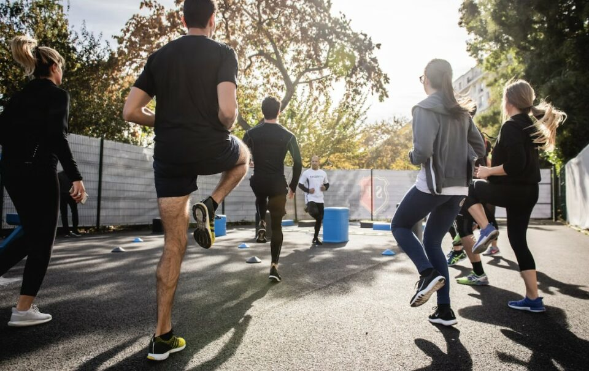

Joining a fitness community can be a great way to stay motivated, meet new people, and have fun while working towards your health and fitness goals. Whether it’s a local gym, a running club, or an online fitness group, there are plenty of options to choose from.

One benefit of joining a fitness community is the accountability it provides. When you have others to exercise with, you’re more likely to stick to your routine and push yourself harder than you do on your own.

### 2\. Set Realistic Goals

Setting realistic workout goals is essential for creating a sustainable fitness routine and avoiding burnout or injury. It’s better to set a small, attainable goal and build from there than to set a lofty goal that’s too difficult to achieve. For example, start by committing to three 30-minute workouts per week and then gradually increase the intensity and frequency over time.

### 3\. Don’t Let Your Passion Sleep

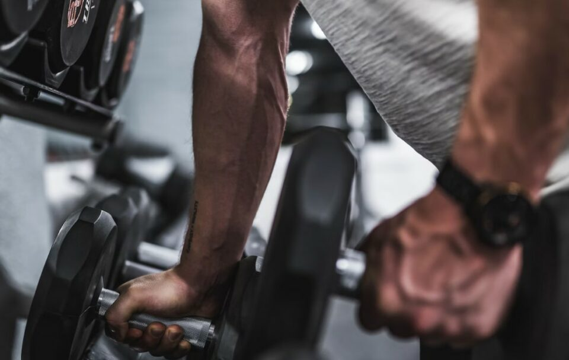

While setting realistic workout goals is important, it’s also crucial not to forget about your passion for exercise. Remember, exercise should be something that you look forward to, not dread. So, make sure to prioritize your passion for working out alongside your goals for improving your health and fitness. With a little creativity and exploration, you can find a workout routine that both challenges and inspires you.

### 4\. Track Your Progress Daily. 

There’s nothing quite like the feeling of checking off tasks or goals as you make progress. To make sure you’re keeping track of your progress effectively, it’s a good idea to write down not just the number of days or pounds but also to reflect on your workouts and how your body feels.

### 5\. Prepare Necessary Equipment For Home Workout 

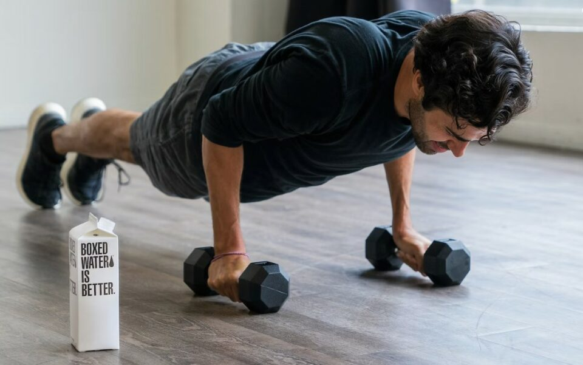

By having essential pieces of equipment, you’ll be able to perform a wide range of exercises at home and achieve your fitness goals without the need for a gym membership. This amazing collection of [home workout equipment](https://avada.io/loveable/best-home-exercise-equipment/) will have you prepared for a long exercise journey.

### 6\. Find Someone to Work with.

Finding a workout partner can be a great way to stay motivated, accountable, and have fun while exercising. Start by asking a friend, family member, or coworker if they’re interested in working out together. Having someone you already know and trust can make the experience more enjoyable and comfortable.

### 7\. Exercise at least 30 minutes daily, six days per week.

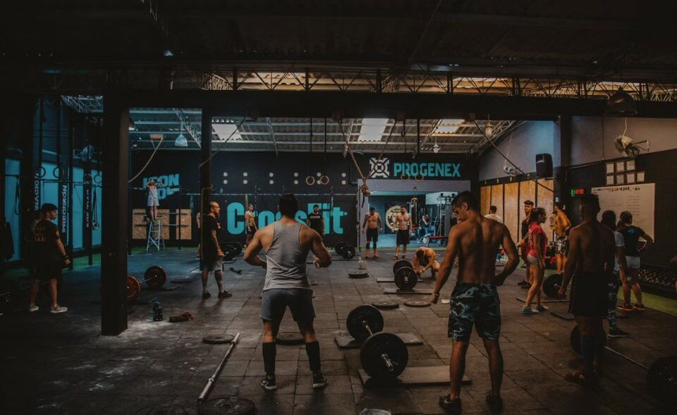

It’s important to exercise at least 30 minutes every day, six days a week. If you’re starting out or getting back into a routine, your main focus should be on building healthy habits. 

By establishing a consistent exercise routine and making adjustments along the way, you’ll begin to see and feel the benefits of regular exercise. Always remember that the key to success is to start small, be consistent, and stay committed to your fitness goals.

### 8\. Study fitness and nutrition. 

Learning about fitness and nutrition while working out can be an excellent way to maximize the benefits of your exercise routine. There are a variety of instructional videos available online that can teach you proper form and technique for exercises, as well as tips for healthy eating and meal planning. You can watch these videos for a better exercise experience at home or the gym.

You can check out the youtube channel of [Jeff Nippard](https://www.youtube.com/@JeffNippard/videos), who is an expert in the field of fitness and nutrition.

### 9\. Drinks Enough Water

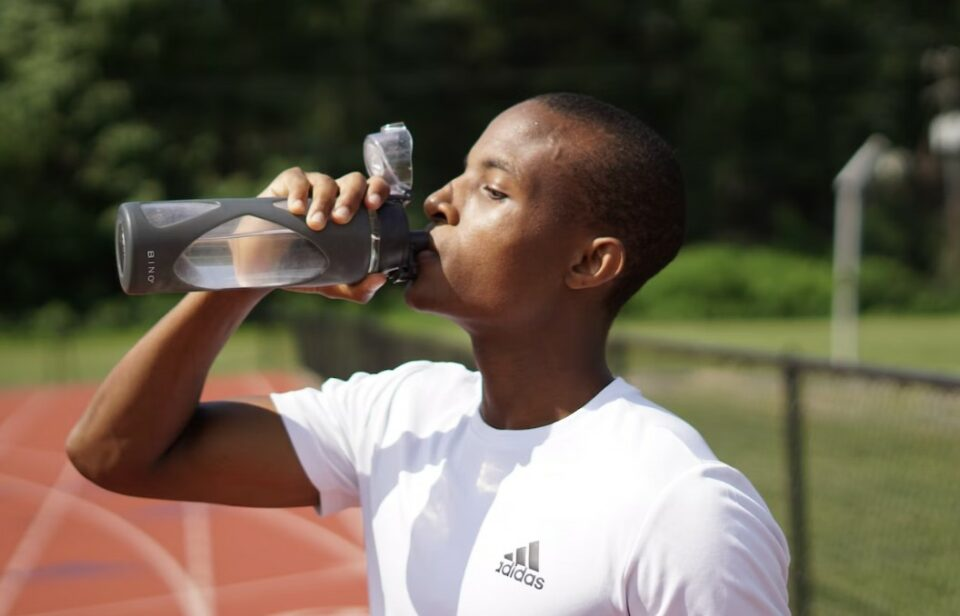

Staying hydrated is crucial when working out, as your body loses fluids through sweat. We advise you to drink at least 16-20 ounces of water 2-3 hours before your workout and 8-10 ounces 10-20 minutes before starting. During your workout, try to sip on the water every 10-20 minutes, and then drink another 8-10 ounces within 30 minutes of finishing. Keep a [water bottle](https://avada.io/loveable/personalized-water-bottles/) with you during your workout, so you can easily sip on the water whenever you need it.

### 10\. Always Choose to Walk

Choosing to walk instead of taking the lift or can be an option to incorporate more physical activity into your daily routine. Exercise, even in small amounts, has been shown to boost mood and energy levels. Walking up stairs can be a quick and easy action to get your blood flowing and improve your mental and emotional well-being.

### 11\. Get Enough Sleep

Getting enough sleep is essential for optimal physical performance and workout results. When you have enough sleep, you’ll have more energy to tackle your workout. You’ll feel less fatigued, both mentally and physically, and will be able to push yourself harder during your workout.

In addition, sleep plays a crucial role in cognitive function, including focus and concentration. By getting enough sleep, you’ll be able to stay focused and engaged during your workout or sports game, helping you to achieve better results.

## 13 Best Dad Fitness Blog And Websites 

If you are now committed to your goal, then you will need a guide!

There are many dad fitness blogs and websites available that offer valuable advice and resources to help dads achieve their fitness goals. From workout routines and nutrition tips to parenting advice and motivational stories. We will highlight 13 of the best dad fitness blogs and websites that offer valuable insights and support for you to choose from 

### 1\. [Fit Dad Nation Blog](https://www.fitdadnation.com/start-here/)

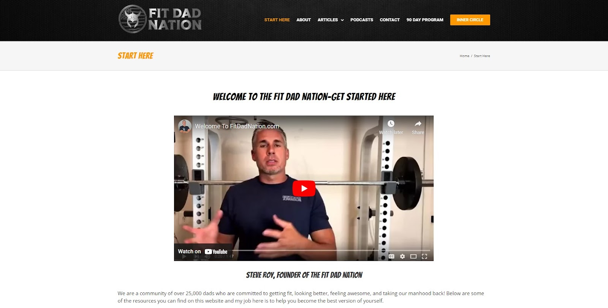

This blog is home to thousands of like-minded dads who are all on a journey to becoming the best version of themselves. It’s all about getting fit, staying healthy, and being the best version of yourself. So if you’re ready to join a community of motivated dads who support each other every step of the way, then come on in and join this blog. 

Check out the [fit dad nation program](https://www.strength.fitdadnation.com/welcome-1002).

### 2\. [Muscle & Fitness](https://www.muscleandfitness.com/)

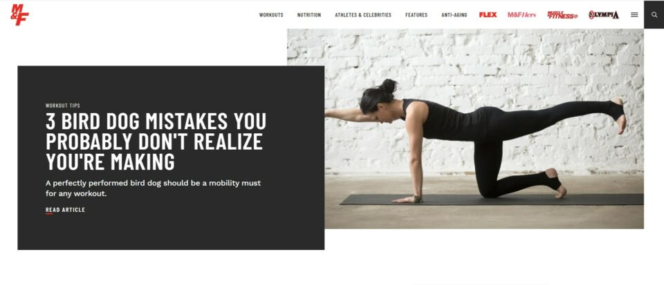

Muscle and Fitness is a popular fitness magazine that has been around for several decades. The website offers a wide range of fitness-related content, including workout routines, nutrition advice, supplement reviews, and interviews with fitness professionals. This blog offers a wide range of useful information and resources to help any dad achieve their fitness goals.

### 3\. [Dai Manuel Blog Fitness Pillar](https://www.daimanuel.com/category/5-pillars/fitness-pillar/)

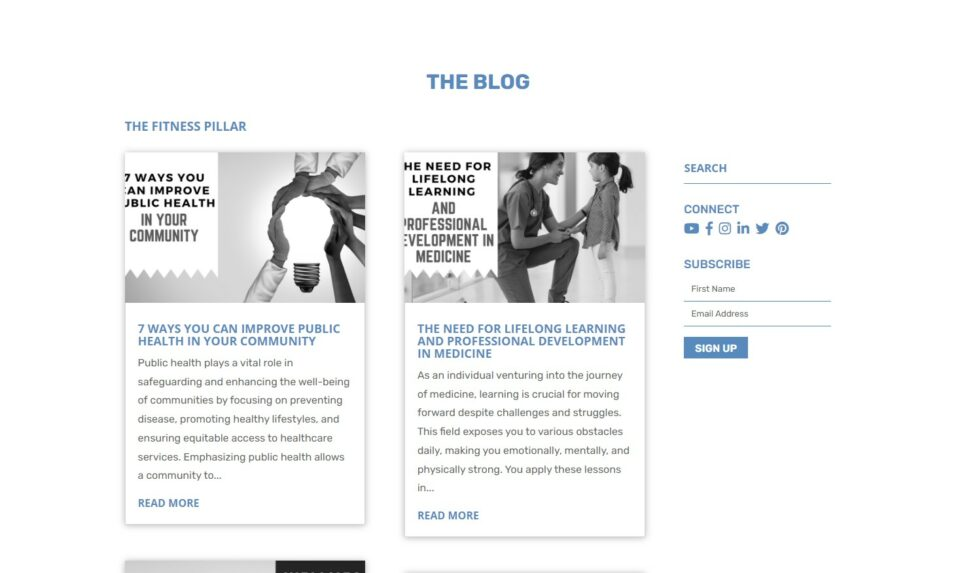

With a passion for fitness and a commitment to helping others achieve their goals, Dai offers insights and tips to help you get the most out of your workouts and lead a healthy lifestyle.

### 4\. [Ben Greenfield Fitness Diet, Fat Loss, and Performance Advice Blog](https://blog.feedspot.com/mens_fitness_blogs/)

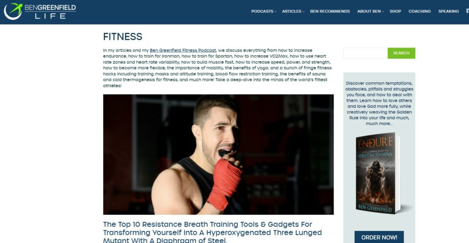

Here, you’ll find a huge amount of information on performance, nutrition, fat loss, biohacking, weight lifting, obstacle racing, and even get some great advice on triathlon. Whether you’re a sports enthusiast or just starting out on your fitness journey, you’ll find valuable tricks and insights to help you reach your goals. 

### 5\. [Hard To Kill Fitness Blog](https://hardtokillfitness.co/blogs/fitness-articles)

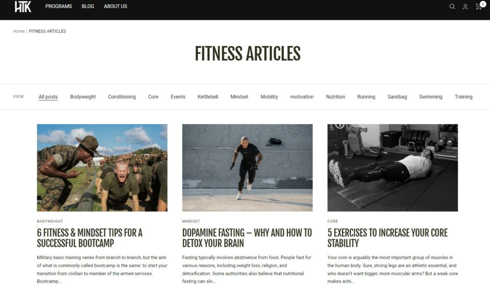

At Hard To Kill Fitness, they’re more than just a fitness company. This is a community of like-minded military enthusiasts who have joined forces on a journey to become stronger, faster, and battle-ready warriors. The community is full of hard-charging individuals who share a passion for fitness and a commitment to reaching their full potential.

### 6\. [Men’s Fitness Club](https://mensfitclub.com/mens-fitness/)

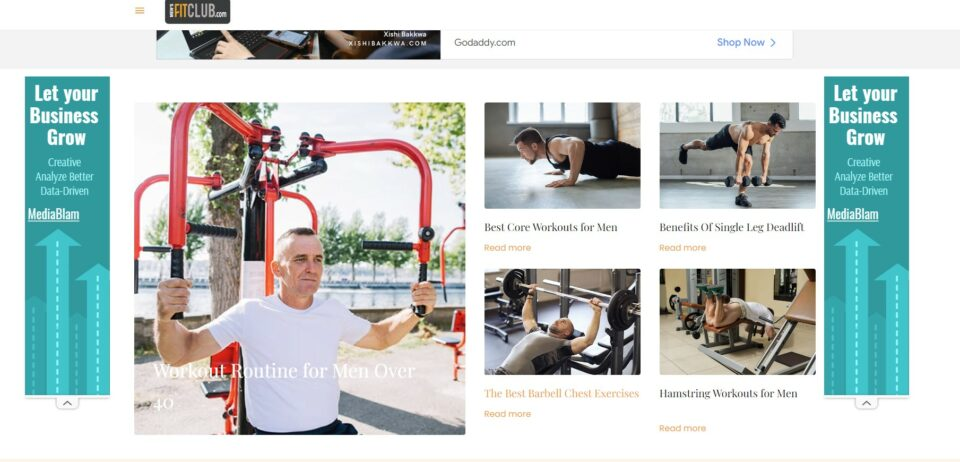

Here is a one-of-a-kind group of men who are committed to living smart and staying fit. They’ve created a new culture of fitness by sharing stories, discussing fitness news, and exchanging experiences. This community is all about encouraging and supporting each other to achieve our health and fitness goals.

### 7\. [Chris Ryan Fitness Blog](http://chrisryanfitness.com/blog/) 

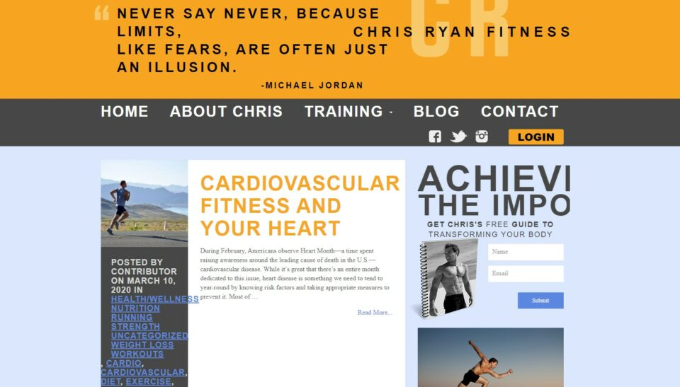

Whether you’re struggling to stay motivated or just looking for some guidance on your fitness journey, Chris is always ready to offer his expertise and support. With his motivational approach and fun-loving attitude, Chris can help you achieve a happy, healthy life that you’ll love.

### 8\. [Ross Training Blog](https://rosstraining.com/blog/)

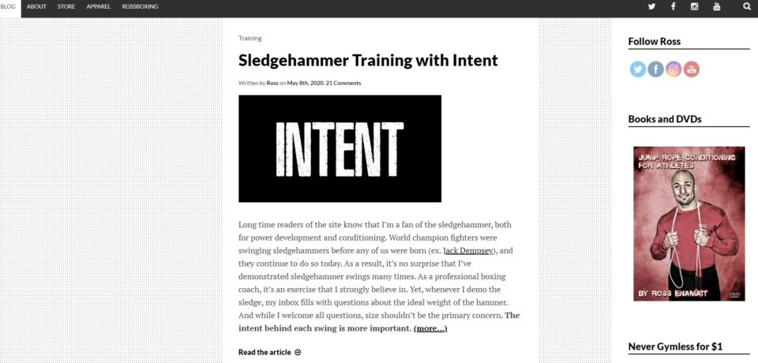

RossTraining.com was established by Ross Enamait with a strong commitment to excellence and cutting-edge approaches in high-performance conditioning, strength training, and athletic development. 

### 9\. [Active Man](https://activeman.com/category/health-fitness/)

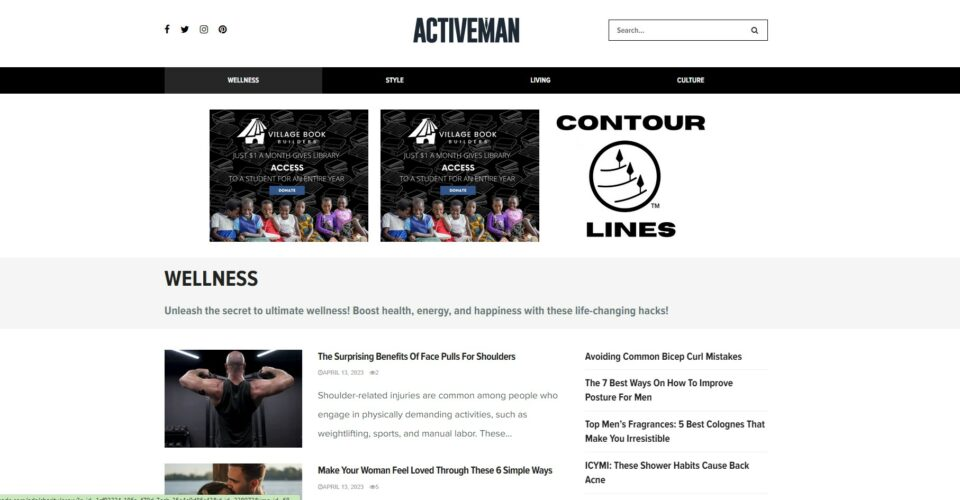

ActiveMan produces articles covering a wide range of topics, including fitness, nutrition, health, sex, style, grooming, technology, weight loss, and beyond. The inspiration behind the creation of ActiveMan was a deep-seated passion for providing men across the globe with a comprehensive lifestyle publication.

### 10\. [Lean Green Dad Blog](https://leangreendad.com/blog/)

Cory Warren is a podcast host, vegan father, and husband who develops plant-based meal plans. His easy and fast vegan dishes simplify the adoption of a plant-based diet for children! Lean Green DAD offers effortless plant-based meals for anyone who desires to nourish their plant-based family.

### 11\. [The Everyday Man Blog](http://www.theeverydayman.co.uk) 

This blog is perfect for the chic and elegant audience, with an interface to die for. It offers more than just fitness, as you can indulge in music, art, and fashion, all catering to the hipster end of the demographic. If you enjoy reading Monocle and are a fan of Mr. Porter, then this is the blog for you.

### 12\. [Early To Rise](http://www.earlytorise.com)

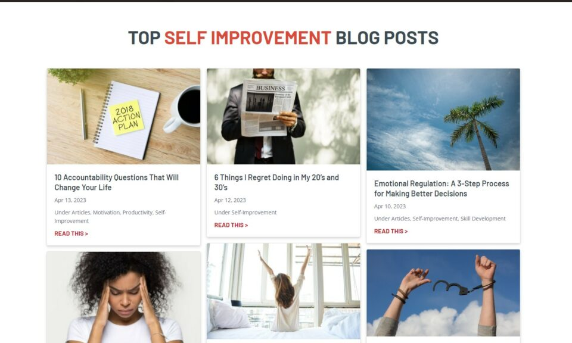

The exceptional range of posts on this fitness blog and online store is praiseworthy. It was founded by Craig Ballantyne, a Men’s Health magazine contributor and editor. The blog’s features center around personal development, creating wealth, and making lifestyle choices that will positively impact your life.

### 13\. [Father Fitness](http://www.fatherfitness.co.uk) 

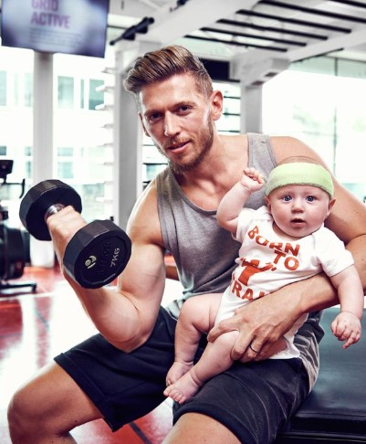

Paul Stainthorpe encountered various challenges when becoming a first-time father, but he transformed them into motivational factors that led to the creation of his comprehensive blog. The blog covers all aspects, from supplements to quitting smoking, and offers genial advice to fathers who may have let themselves go a little. 

## Bottom Line 

In conclusion, staying active and healthy while being a dad can be challenging, but it is not impossible. By implementing the strategies outlined in this content, such as finding time for physical activity, making healthier food choices, and involving the family in exercise, fathers can lead a healthy lifestyle while fulfilling their duties as a parent. You must remember that taking care of oneself is not selfish, but it’s a necessary step towards being a better parent and role model for the family. By prioritizing **dad fitness**, he can set a positive example for their children and enjoy a happier, more fulfilling life.

- [11 Ways to Stay Fit When You Become a Father](https://avada.io/loveable/blog/dad-fitness/#wp-block-heading-2-4)
    - [1\. Take Part in a Fitness Community](https://avada.io/loveable/blog/dad-fitness/#wp-block-heading-3-5) 
    - [2\. Set Realistic Goals](https://avada.io/loveable/blog/dad-fitness/#wp-block-heading-3-9)
    - [3\. Don’t Let Your Passion Sleep](https://avada.io/loveable/blog/dad-fitness/#wp-block-heading-3-11)
    - [4\. Track Your Progress Daily.](https://avada.io/loveable/blog/dad-fitness/#wp-block-heading-3-14) 
    - [5\. Prepare Necessary Equipment For Home Workout](https://avada.io/loveable/blog/dad-fitness/#wp-block-heading-3-16) 
    - [6\. Find Someone to Work with.](https://avada.io/loveable/blog/dad-fitness/#wp-block-heading-3-19)
    - [7\. Exercise at least 30 minutes daily, six days per week.](https://avada.io/loveable/blog/dad-fitness/#wp-block-heading-3-21)
    - [8\. Study fitness and nutrition.](https://avada.io/loveable/blog/dad-fitness/#wp-block-heading-3-25) 
    - [9\. Drinks Enough Water](https://avada.io/loveable/blog/dad-fitness/#wp-block-heading-3-28)
    - [10\. Always Choose to Walk](https://avada.io/loveable/blog/dad-fitness/#wp-block-heading-3-31)
    - [11\. Get Enough Sleep](https://avada.io/loveable/blog/dad-fitness/#wp-block-heading-3-33)
- [13 Best Dad Fitness Blog And Websites](https://avada.io/loveable/blog/dad-fitness/#wp-block-heading-2-37) 
    - [1\. Fit Dad Nation Blog](https://avada.io/loveable/blog/dad-fitness/#wp-block-heading-3-40)
    - [2\. Muscle & Fitness](https://avada.io/loveable/blog/dad-fitness/#wp-block-heading-3-44)
    - [3\. Dai Manuel Blog Fitness Pillar](https://avada.io/loveable/blog/dad-fitness/#wp-block-heading-3-47)
    - [4\. Ben Greenfield Fitness Diet, Fat Loss, and Performance Advice Blog](https://avada.io/loveable/blog/dad-fitness/#wp-block-heading-3-50)
    - [5\. Hard To Kill Fitness Blog](https://avada.io/loveable/blog/dad-fitness/#wp-block-heading-3-53)
    - [6\. Men’s Fitness Club](https://avada.io/loveable/blog/dad-fitness/#wp-block-heading-3-56)
    - [7\. Chris Ryan Fitness Blog](https://avada.io/loveable/blog/dad-fitness/#wp-block-heading-3-59) 
    - [8\. Ross Training Blog](https://avada.io/loveable/blog/dad-fitness/#wp-block-heading-3-62)
    - [9\. Active Man](https://avada.io/loveable/blog/dad-fitness/#wp-block-heading-3-65)
    - [10\. Lean Green Dad Blog](https://avada.io/loveable/blog/dad-fitness/#wp-block-heading-3-68)
    - [11\. The Everyday Man Blog](https://avada.io/loveable/blog/dad-fitness/#wp-block-heading-3-71) 
    - [12\. Early To Rise](https://avada.io/loveable/blog/dad-fitness/#wp-block-heading-3-74)
    - [13\. Father Fitness](https://avada.io/loveable/blog/dad-fitness/#wp-block-heading-3-77) 
- [Bottom Line](https://avada.io/loveable/blog/dad-fitness/#wp-block-heading-2-80) 

### [Rose Bryne](https://avada.io/loveable/author/rose/)

Hi, I'm Rose! I love animals and spending time with kids. At Loveable, I help people find unique gifts for special occasions like Valentine's Day, housewarmings, and graduations. I enjoy finding gifts for kids, teens, and animal lovers that match their interests and personalities. Making gift-giving a pleasant experience is my priority. Let me assist you in finding the perfect gift!

- [Twitter](https://twitter.com/intent/tweet)
- [Facebook](https://www.facebook.com/sharer/sharer.php)
- [instagram](https://avada.io/loveable/blog/dad-fitness/)
- [pinterest](https://www.pinterest.com/loveablellc/)

## Related Posts

[### 30 Best 4 Year Old Birthday Party Ideas For A Memorable Celebration](https://avada.io/loveable/blog/4-year-old-birthday-party-ideas/) 

[

### 16th Birthday Party Ideas to Make an Unforgettable Day

](https://avada.io/loveable/blog/16th-birthday-party-ideas/)

[

### 150+ Inspirational Birthday Quotes to Spread Joy on Special Day

](https://avada.io/loveable/blog/inspirational-birthday-quotes/)

[

### 160+ Birthday Wishes for Wife to Express Eternal Love

](https://avada.io/loveable/blog/birthday-wishes-for-wife/)

[### 90+ Heart Touching Birthday Wishes for Niece to Make Her Day Extra Special](https://avada.io/loveable/blog/birthday-wishes-for-niece/)
