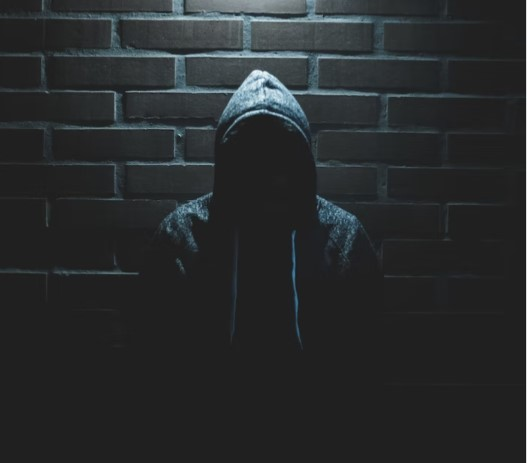
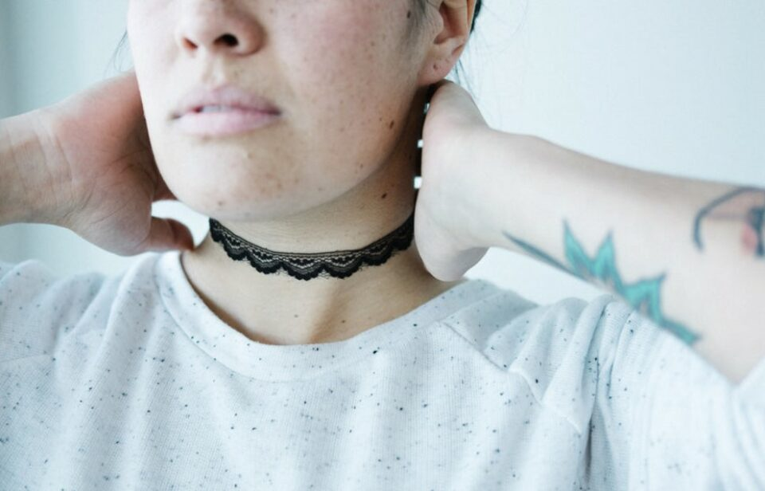
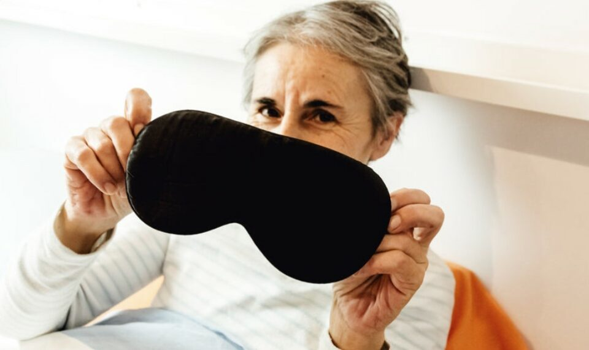

This article has been written and researched by our expert Loveable through a precise methodology. [Learn more about our methodology](https://avada.io/loveable/our-methodological.html)

[Loveable](https://avada.io/loveable/) > [Blog](https://avada.io/loveable/blog/) > [Relationship](https://avada.io/loveable/relationship/)

# Dream Of Being Robbed: Scenarios And Explanation

Written by [Luna Miller](https://avada.io/loveable/author/luna/) Last Updated on August 22, 2023

- [15 Common Scenarios Of Robbery Dreams](https://avada.io/loveable/blog/dream-of-being-robbed/#wp-block-heading-2-4)
    - [1\. Dream of a robber pointing a gun at you](https://avada.io/loveable/blog/dream-of-being-robbed/#wp-block-heading-3-5)
    - [2\. Dreaming of Planning a Robbery](https://avada.io/loveable/blog/dream-of-being-robbed/#wp-block-heading-3-7)
    - [3\. Dreaming about a Robber Caught](https://avada.io/loveable/blog/dream-of-being-robbed/#wp-block-heading-3-10) 
    - [4\. Realizing That You Were Robbed](https://avada.io/loveable/blog/dream-of-being-robbed/#wp-block-heading-3-12)
    - [5\. Dream of Having your phone robbed](https://avada.io/loveable/blog/dream-of-being-robbed/#wp-block-heading-3-15)
    - [6\. Dreaming of Having Jewelry Robbed](https://avada.io/loveable/blog/dream-of-being-robbed/#wp-block-heading-3-17)
    - [7\. Dreaming of Having Money Robbed](https://avada.io/loveable/blog/dream-of-being-robbed/#wp-block-heading-3-20)
    - [8\. Dreaming of A Bank Robbery](https://avada.io/loveable/blog/dream-of-being-robbed/#wp-block-heading-3-22)
    - [9\. Dream of Getting Caught While Robbing](https://avada.io/loveable/blog/dream-of-being-robbed/#wp-block-heading-3-25)
    - [10\. Dream of noticing a robbery](https://avada.io/loveable/blog/dream-of-being-robbed/#wp-block-heading-3-28)
    - [11\. Dreamed that you were robbed but did not see the robber](https://avada.io/loveable/blog/dream-of-being-robbed/#wp-block-heading-3-31)
    - [12\. You dream that you are preventing a robbery.](https://avada.io/loveable/blog/dream-of-being-robbed/#wp-block-heading-3-33)
    - [13\. Dream of robbers at home](https://avada.io/loveable/blog/dream-of-being-robbed/#wp-block-heading-3-37)
    - [14\. Dream of being robbed at a mall](https://avada.io/loveable/blog/dream-of-being-robbed/#wp-block-heading-3-41)
    - [15\. Dream of being robbed of something how is meaningful to you](https://avada.io/loveable/blog/dream-of-being-robbed/#wp-block-heading-3-43) 
- [Dream Of Being Robbed: Science Explanation](https://avada.io/loveable/blog/dream-of-being-robbed/#wp-block-heading-2-46) 
- [Dream Of Being Robbed: Spiritual Explanation](https://avada.io/loveable/blog/dream-of-being-robbed/#wp-block-heading-2-59) 
- [Bottom line](https://avada.io/loveable/blog/dream-of-being-robbed/#wp-block-heading-2-65) 

Dreams are always something that makes everyone curious. Do dreams imply something in your life or predict the future? No one knows for sure. But the truth is, there are always the same dream motifs, such as falling from a height or being naked in public; it sounds weird, but millions of people worldwide have the same dreams. Typical of them is the **dream of being robbed.** 

Not many people have dreams about robberies or being robbed. The bad news is that these are not-so-comfortable dreams, which could signal that you are having mental health problems, and sometimes if this dream happens, it’s probably because you feel like a victim in real life and are struggling to find your own identity. But on the other hand, this dream doesn’t predict the future; you don’t have to worry about being robbed in the street on a Monday; Trust me!

Because dreams are so individual and connected to one’s past and present experiences, it’s impossible to provide a universal interpretation for them. Continue reading to learn more about this dream and what it means.

## 15 Common Scenarios Of Robbery Dreams

### 1\. Dream of a robber pointing a gun at you

Getting robbed with a gun in a dream is definitely a bad sign. It means that something hard is about to happen. If the robber decides to kill you in the dream, it could mean that you need to let go of a certain situation and move on.

### 2\. Dreaming of Planning a Robbery

If you have a dream that you are planning or putting together a robbery, it means that you will soon disappoint someone. It shows how the choices we make have consequences. You might decide not to build anything or do anything that would cause problems. The dream could also mean that you will get ahead in life at the expense of someone else.

### 3\. Dreaming about a Robber Caught 

The robber in your dream being caught is a sign that you will get through work or money problems. If the thief is in jail in the dream, it’s a strong sign that you shouldn’t give up on your work and keep going. You will win and get great results, no matter how hard it is. Keep doing your best!

### 4\. Realizing That You Were Robbed

If you’ve ever dreamed that you were somewhere else when a robbery happened and didn’t know about it until afterward, that’s a good sign. Some people think that this dream means you have a strong desire to get rid of all the negative energy that has built up inside you. The most vital thing is that you are ready to start a new, better part of your life. 

### 5\. Dream of Having your phone robbed

What does it mean to dream about your phone being robbed? Honestly, just thinking about this, it is already bad enough. But this implies a very good thing, that what you are doing good in the present, your accumulations in the present will undoubtedly be profitable and beneficial to you in the future. Furthermore, this dream implies that you will likely meet new love by chance. 

### 6\. Dreaming of Having Jewelry Robbed

Dreaming that you have been robbed of gold and luxurious item indicates that you need to improve the relationships around you. It can be friends, colleagues, or close friends with who you have not seen or talked for a long time. This is when you need to cherish and care for those around you. Just be clever and spend time with them; the feelings will be connected again.

### 7\. Dreaming of Having Money Robbed

It is often said that dreams are contrary to reality, and dreams of being robbed of money are among them. That may be correct because this dream implies the chance that you will have good luck with your money in the near future. So, if you’ve ever dreamed that your money was robbed, don’t panic but think positively about it!

### 8\. Dreaming of A Bank Robbery

People often face bank robbers in their dreams. Even though the things in this dream are bad, it has a good meaning. Such dreams usually mean you will be involved in an international business deal to make money. Meanwhile, this dream could also mean you will get richer, and your job will go well. It talks about how important it is to keep going, work hard, and commit to your goal to reach it.

### 9\. Dream of Getting Caught While Robbing

Getting caught as a thief in a dream could mean that you will take a less socially acceptable way to reach your goals. This dream tells you to take a look at your life and get rid of any bad things you are on your way. Dream interpreters say that if you don’t do something right away, you’ll almost certainly be in a lot of trouble in the future if you don’t.

On the other hand, this dream could mean that you are having trouble with money because you spend too much, which hurts your budget. This dream could also mean that bad habits and addictions, like gambling, are hurting your finances.

### 10\. Dream of noticing a robbery

If you have dreams about getting robbed at work, be careful not to get caught up in office gossip and drama. Some of your [coworkers](https://avada.io/loveable/birthday-message-for-coworker/) might want to steal your idea or put you in danger in some way. But the meaning changes if you are the one who steals. If you steal, it means that a family member, coworker, or friend will give you something useful.

### 11\. Dreamed that you were robbed but did not see the robber

If you couldn’t figure out who did something bad in your dream, it could be a sign that someone is using you to help them. Someone you think of as a friend might not have your best interests at heart, and you might not even know it.

### 12\. You dream that you are preventing a robbery.

This dream tells you that every step in your life is important. It also means the benefits you might get if you keep living the way you do. This dream can also mean that you are about to face a lot of challenges and that your experience will help you through this time. The fact that you stopped the robbery in your dream shows that you can deal with bad situations and come out on top every time.

In addition, if you dream about stopping a robbery, it means you are good at stopping problems from happening. You might also know how to avoid them in the best way.

People around you don’t see that you have many problems, so they think you have an easy life. But the truth is that you have a lot of promise. You know how to handle many situations and problems because you have been through them.

### 13\. Dream of robbers at home

If you dream that thieves are breaking into your house, it means that someone is taking away your happiness. It could be your money or any relationship that works well. Someone might be making trouble for you behind your back, and they might know enough about you to make your life difficult. So, it’s very likely that this person is close by.

If you can figure out who this person is, stay away from them and tell the people who you care about how worried you are about them. If you can’t figure out who this person is, train your heart to deal with the trouble.

### 14\. Dream of being robbed at a mall

A person who goes to a mall has cash or a credit card. If you dream of stopping a robber in a mall, it means that someone has stolen something very valuable from you, like your pride. In this case, the robber stands for any doubts you have about yourself.

### 15\. Dream of being robbed of something how is meaningful to you 

You are worrying too much about the things around you. Those are completely unnecessary. Keep a cool head and a steady mind for a more comfortable life.

For ambiguous relationships, you should be decisive for the sake of both. In work, too, be a little bold to seize the opportunity quickly and prove your ability. Only then will success soon “smiling” to you.

## Dream Of Being Robbed: Science Explanation 

In science, the dream of being robbed indicates that you are mentally unstable and prone to fluctuations. This type of dream can be considered a nightmare and can affect your life quality. If you continue to have terrible dreams like this, including being robbed, you are most likely experiencing the following psychological problems.  

- You Feel Insecure
- You may have problems with trust issues
- You really need privacy 
- Nightmares often occur when you feel uncomfortable going to bed, maybe because of wearing too thick clothes or too tight sleeping space.
- Feeling [anxious](https://avada.io/loveable/anxious-toys/) for a long time

To avoid bad dreams that affect your quality of life, you should consider the following actions:

- **Avoid Overthinking:** Work and relationship pressure can make you overthink and lead to nightmares, so try to make things simple and relax as much as you can 

- **Exercise regularly:** Regular exercise habits, focusing on cardiovascular exercise, will help you sleep better and avoid daydreaming. You should also try yoga for better sleeping 

- **Stay away from stimulants:** Alcohol, tobacco, or drugs are triggers for nightmares.

- **Stay relaxed and peaceful before bed:** The things you think a lot about before you go to sleep often come in your dreams. If you watch an action movie with a lot of sensational robbery scenes, then this will most likely be the reason why you are dreaming of being robbed.

## Dream Of Being Robbed: Spiritual Explanation 

Some dreams about being robbed are a good sign, but others are not. No matter what, you have these dreams so that you can do something about your life. 

On the one hand, dreaming of being robbed is a spiritual sign that you feel helpless or unhappy in some part of your life. It could also be a warning to trust your gut and stay away from bad people. 

On the other hand, some old ways of interpreting dreams say that if you dream that you are a thief or the victim of a robbery, you will soon meet a cruel person who will get in the way of your happiness.

If you have these dreams, it’s a sign that you might lose your things soon. It’s also possible that your dreams show how tense and unhappy you were during the day. People often feel helpless and like something bad is about to happen when they have these dreams. (some problem as I mentioned in above part). If you feel emotionally or materially cheated out of your daily life, you may have dreams about robbing other people. That which lies ahead is more difficult than you can handle right now, both in terms of suffering and danger.

It’s important to keep in mind that this dream is a metaphor for overcoming adversity and emerging stronger on the other side.

## Bottom line 

Dreams of being robbed can be interpreted in various different ways, depending on the person and what they’ve been through in their life. 

Sometimes they remind you to pay attention to your physical and emotional safety. When you **dream of being robbed**, it reminds you that you have a special duty to protect the people you care about. They might be trying to tell you that you haven’t paid enough attention to some parts of your life.

- [15 Common Scenarios Of Robbery Dreams](https://avada.io/loveable/blog/dream-of-being-robbed/#wp-block-heading-2-4)
    - [1\. Dream of a robber pointing a gun at you](https://avada.io/loveable/blog/dream-of-being-robbed/#wp-block-heading-3-5)
    - [2\. Dreaming of Planning a Robbery](https://avada.io/loveable/blog/dream-of-being-robbed/#wp-block-heading-3-7)
    - [3\. Dreaming about a Robber Caught](https://avada.io/loveable/blog/dream-of-being-robbed/#wp-block-heading-3-10) 
    - [4\. Realizing That You Were Robbed](https://avada.io/loveable/blog/dream-of-being-robbed/#wp-block-heading-3-12)
    - [5\. Dream of Having your phone robbed](https://avada.io/loveable/blog/dream-of-being-robbed/#wp-block-heading-3-15)
    - [6\. Dreaming of Having Jewelry Robbed](https://avada.io/loveable/blog/dream-of-being-robbed/#wp-block-heading-3-17)
    - [7\. Dreaming of Having Money Robbed](https://avada.io/loveable/blog/dream-of-being-robbed/#wp-block-heading-3-20)
    - [8\. Dreaming of A Bank Robbery](https://avada.io/loveable/blog/dream-of-being-robbed/#wp-block-heading-3-22)
    - [9\. Dream of Getting Caught While Robbing](https://avada.io/loveable/blog/dream-of-being-robbed/#wp-block-heading-3-25)
    - [10\. Dream of noticing a robbery](https://avada.io/loveable/blog/dream-of-being-robbed/#wp-block-heading-3-28)
    - [11\. Dreamed that you were robbed but did not see the robber](https://avada.io/loveable/blog/dream-of-being-robbed/#wp-block-heading-3-31)
    - [12\. You dream that you are preventing a robbery.](https://avada.io/loveable/blog/dream-of-being-robbed/#wp-block-heading-3-33)
    - [13\. Dream of robbers at home](https://avada.io/loveable/blog/dream-of-being-robbed/#wp-block-heading-3-37)
    - [14\. Dream of being robbed at a mall](https://avada.io/loveable/blog/dream-of-being-robbed/#wp-block-heading-3-41)
    - [15\. Dream of being robbed of something how is meaningful to you](https://avada.io/loveable/blog/dream-of-being-robbed/#wp-block-heading-3-43) 
- [Dream Of Being Robbed: Science Explanation](https://avada.io/loveable/blog/dream-of-being-robbed/#wp-block-heading-2-46) 
- [Dream Of Being Robbed: Spiritual Explanation](https://avada.io/loveable/blog/dream-of-being-robbed/#wp-block-heading-2-59) 
- [Bottom line](https://avada.io/loveable/blog/dream-of-being-robbed/#wp-block-heading-2-65) 

### [Luna Miller](https://avada.io/loveable/author/luna/)

I'm Luna Miller, a helpful employee at Loveable. I excel at giving great advice on birthday gifts. I love suggesting memorable experiences like concerts, spas, and getaways. As a reliable and supportive colleague, I'm always there to assist.

- [Twitter](https://twitter.com/intent/tweet)
- [Facebook](https://www.facebook.com/sharer/sharer.php)
- [instagram](https://avada.io/loveable/blog/dream-of-being-robbed/)
- [pinterest](https://www.pinterest.com/loveablellc/)

## Related Posts

[

### 35 Unforgettable Exciting Adult Birthday Party Ideas

](https://avada.io/loveable/blog/adult-birthday-party-ideas/)

[

### 42 Best 21st Birthday Outfits to Rock the Party

](https://avada.io/loveable/blog/21st-birthday-outfits/)

[

### 50+ Happy 40th Anniversary Quotes, Messages, and Wishes

](https://avada.io/loveable/blog/happy-40th-anniversary-quotes/)

[

### 100+ Heartwarming Happy 30th Anniversary Quotes, Messages, and Wishes

](https://avada.io/loveable/blog/happy-30th-anniversary-quotes/)

[

### 120+ Heartfelt Thank You Messages for The Birthday Wishes

](https://avada.io/loveable/blog/thank-you-messages-birthday-wishes/)
