This article has been written and researched by our expert Loveable through a precise methodology. [Learn more about our methodology](https://avada.io/loveable/our-methodological.html)

[Loveable](https://avada.io/loveable/) > [Blog](https://avada.io/loveable/blog/) > [Holiday](https://avada.io/loveable/holiday/)

# Easy Halloween Doodles Ideas for 2023 Anyone Can Draw

Written by [Blake Simpson](https://avada.io/loveable/author/blake/) Last Updated on September 05, 2023

- [The History of Halloween Doodles](https://avada.io/loveable/blog/halloween-doodles/#wp-block-heading-2-4)
- [The Psychology of Halloween Doodling](https://avada.io/loveable/blog/halloween-doodles/#wp-block-heading-2-12)
- [Famous Halloween Doodles and Artists](https://avada.io/loveable/blog/halloween-doodles/#wp-block-heading-2-22)
    - [Iconic Halloween doodles](https://avada.io/loveable/blog/halloween-doodles/#wp-block-heading-3-23)
    - [Work of modern artists in Halloween-themed art](https://avada.io/loveable/blog/halloween-doodles/#wp-block-heading-3-28)
    - [How Halloween doodles have been featured](https://avada.io/loveable/blog/halloween-doodles/#wp-block-heading-3-33)
- [Halloween Doodles in the Digital Age](https://avada.io/loveable/blog/halloween-doodles/#wp-block-heading-2-39)
    - [The rise of digital art on Halloween doodling](https://avada.io/loveable/blog/halloween-doodles/#wp-block-heading-3-41)
    - [Various digital tools and software](https://avada.io/loveable/blog/halloween-doodles/#wp-block-heading-3-44)
    - [Advantages and Challenges of Digital Halloween Doodling](https://avada.io/loveable/blog/halloween-doodles/#wp-block-heading-3-49)
- [Step-by-Step Halloween Doodle Tutorials](https://avada.io/loveable/blog/halloween-doodles/#wp-block-heading-2-54)
    - [Spooky Spider](https://avada.io/loveable/blog/halloween-doodles/#wp-block-heading-3-56)
    - [Cute Candy Corn](https://avada.io/loveable/blog/halloween-doodles/#wp-block-heading-3-59)
    - [Pumpkin](https://avada.io/loveable/blog/halloween-doodles/#wp-block-heading-3-62)
    - [Ghost](https://avada.io/loveable/blog/halloween-doodles/#wp-block-heading-3-65)
    - [Witch’s Hat](https://avada.io/loveable/blog/halloween-doodles/#wp-block-heading-3-68)
- [Halloween Doodles for DIY Decorations](https://avada.io/loveable/blog/halloween-doodles/#wp-block-heading-2-73)
    - [Some examples of Halloween-themed crafts and décor made with doodles](https://avada.io/loveable/blog/halloween-doodles/#wp-block-heading-3-75)
    - [Tips and tricks for enhancing the spooky atmosphere with doodle-inspired decorations](https://avada.io/loveable/blog/halloween-doodles/#wp-block-heading-3-80)
- [The World of Animated Halloween Doodles](https://avada.io/loveable/blog/halloween-doodles/#wp-block-heading-2-88)
- [Bottom Line](https://avada.io/loveable/blog/halloween-doodles/#wp-block-heading-2-98)

Halloween, the spookiest time of the year, brings with it a delightful opportunity for creativity and expression. In this post, we will embark on a journey through the captivating realm of **Halloween doodles**. 

From simple sketches to animated wonders, we will explore how artists of all levels embrace the spirit of the holiday to create imaginative and eerie masterpieces. Join us as we uncover the therapeutic benefits of Halloween doodling, get inspired by famous Halloween doodles and artists, and learn how to incorporate these spooky creations into DIY [Haloween decorations](https://avada.io/loveable/blog/halloween-decoration-ideas/). 

Whether you’re a seasoned artist or a doodling enthusiast, this post is sure to ignite your imagination and get you in the mood for a bewitching Halloween season.

## **The History of Halloween Doodles**

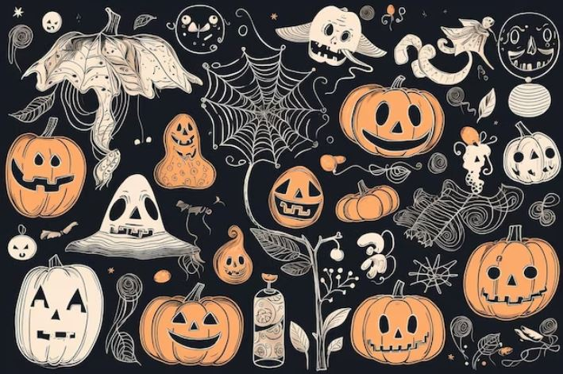

Halloween, an ancient Celtic festival known as Samhain, marked the end of the harvest season and the beginning of winter when the boundaries between the living and the dead were believed to blur. 

Over the centuries, it evolved into the modern celebration we know today, characterized by costumes, trick-or-treating, and spooky decorations. One such aspect of Halloween’s allure is its association with eerie and macabre imagery, which has inspired artists to create Halloween-themed doodles.

Early Halloween doodling can be traced back to different cultures. Celtic people carved turnips and later [carved pumpkins](https://avada.io/loveable/blog/halloween-pumpkin/) to ward off evil spirits during Samhain. In Medieval Europe, people drew images of ghosts, witches, and skeletons in prayer books on All Hallows’ Eve, a precursor to Halloween. In Mexican culture, Dia de los Muertos (Day of the Dead) showcases intricate doodles of sugar skulls and Calaveras, celebrating the lives of deceased loved ones.

As Halloween spread, doodling became a popular way to celebrate the festivities. In the 19th century, Halloween greeting cards adorned with whimsical and eerie doodles gained popularity. These doodles often featured black cats, witches on broomsticks, and haunted houses. In the early 20th century, newspaper comic strips incorporated Halloween themes, introducing iconic characters like Casper the Friendly Ghost.

With the advent of technology, Halloween doodles found a new platform. Search engines like Google began creating annual Halloween-themed doodles to celebrate the holiday. These doodles transformed into interactive and [animated artworks](https://avada.io/loveable/blog/easy-halloween-craft-ideas/) that captured the spirit of Halloween while engaging audiences worldwide.

Today, Halloween doodles have evolved into impressive artworks, with talented artists showcasing their skills on various social media platforms. From detailed illustrations of mythical creatures to digital animations of eerie landscapes, Halloween doodles have become an integral part of the holiday’s visual culture.

## **The Psychology of Halloween Doodling**

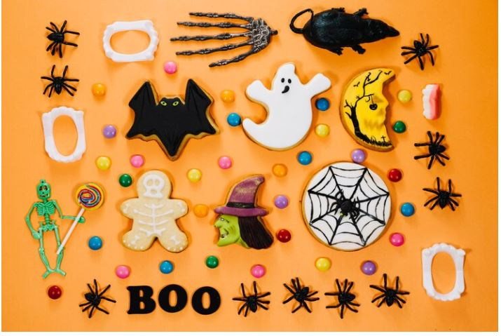

Halloween doodling not only captures the spirit of the season but also offers numerous psychological benefits, making it a therapeutic and meaningful activity. Doodling, in general, has been recognized for its positive impact on mental health, as it engages the brain and promotes relaxation. 

By incorporating Halloween themes into doodling, individuals can delve into their subconscious and use art as a form of self-expression.

- Doodling, irrespective of the subject matter, has been found to have therapeutic benefits. 

It can reduce stress, anxiety, and even improve focus and concentration. Engaging in doodling during the Halloween season can be especially beneficial due to its association with creativity and imagination. As individuals draw spooky creatures, haunted houses, and other Halloween-themed elements, they tap into their subconscious thoughts and emotions, allowing for a release of pent-up feelings.

- The psychological significance of Halloween themes in doodling lies in their symbolism. 

Symbols like ghosts, witches, and skeletons are archetypal representations of fear, mortality, and the unknown. By doodling these [Halloween symbols](https://avada.io/loveable/blog/halloween-symbols-explained/), individuals might find a safe space to confront their fears and anxieties related to mortality and the afterlife. Halloween doodling can be a form of catharsis, where individuals express and process complex emotions through art.

- The Halloween season can bring about heightened stress and anxiety for some individuals due to the focus on spooky and unsettling themes. 

Engaging in Halloween doodling can act as a stress-relieving and calming activity, providing a positive outlet for emotions that may arise during this time of the year. The repetitive and rhythmic nature of doodling can induce a meditative state, helping individuals find solace amidst the chaos of the holiday.

## **Famous Halloween Doodles and Artists**

### **Iconic Halloween doodles**

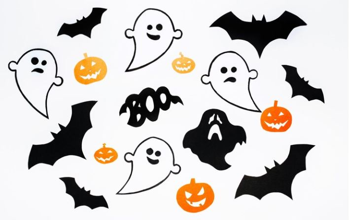

Throughout history, many renowned artists and illustrators have embraced the Halloween spirit, creating iconic doodles that capture the essence of the holiday. 

One of the most famous Halloween doodles is “The Great Pumpkin” by Charles M. Schulz, featured in his beloved comic strip “Peanuts.” This doodle showcases Linus van Pelt waiting for the mythical Great Pumpkin on Halloween night, becoming an enduring symbol of the holiday.

Another iconic Halloween doodle is “The Witch’s Cat” by Edward Gorey, a prolific artist known for his macabre and gothic illustrations. His intricate and eerie doodle depicts a witch and her cat flying through the night sky, embodying the spooky atmosphere of Halloween.

### **Work of modern artists in Halloween-themed art**

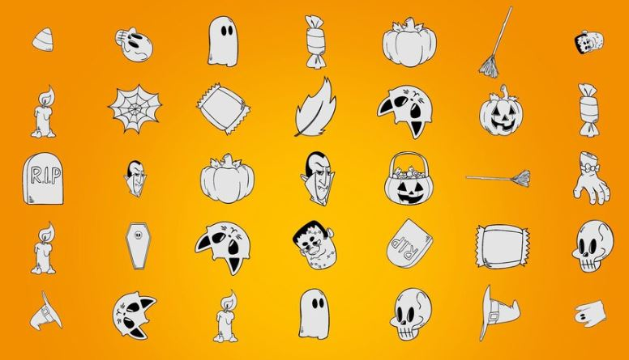

In contemporary times, several modern artists have gained popularity for their specialization in Halloween-themed art. 

Laurie Lipton, a British artist, is renowned for her highly detailed and haunting drawings. Her Halloween-inspired works often feature intricate mazes of skeletal figures and eerie landscapes.

Another notable artist is Jasmine Becket-Griffith, whose art is characterized by big-eyed, whimsical characters often portrayed in Halloween settings. Her captivating and colorful Halloween doodles have amassed a large following, making her one of the most celebrated artists in the genre.

### **How Halloween doodles have been featured**

Halloween doodles have found their way into popular culture, advertisements, and various media platforms. 

Tech giants like Google have embraced the Halloween spirit by regularly featuring elaborate Halloween-themed doodles on their search engine homepage. These interactive and creative doodles celebrate the holiday’s traditions and add an element of excitement to users’ browsing experiences.

Additionally, Halloween doodles have become a prominent feature in advertising campaigns during the spooky season. Companies use Halloween-themed doodles to engage audiences, infusing their products and services with a festive flair. Whether it’s a spooky twist on a brand’s logo or an animated Halloween-themed advertisement, these doodles serve as powerful marketing tools that resonate with consumers.

Moreover, Halloween doodles have been featured in movies, TV shows, and various forms of entertainment. Animated Halloween specials often showcase elaborate doodles to set the mood and immerse viewers in the holiday spirit. These doodles contribute to the visual storytelling of Halloween-themed media, creating a memorable and captivating experience for audiences of all ages.

Famous Halloween doodles have solidified the role of doodles in celebrating the spirit of the holiday. Their contributions have permeated popular culture, advertisements, and media, elevating Halloween doodles to an art form that continues to captivate and inspire audiences around the world. 

## **Halloween Doodles in the Digital Age**

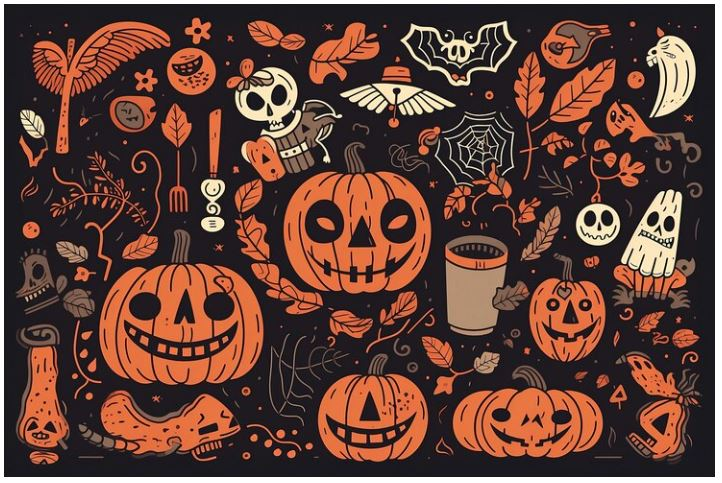

### **The rise of digital art on Halloween doodling**

The digital age has revolutionized the way artists create and share their Halloween doodles. With the rise of digital art platforms, artists now have a vast array of tools and software at their disposal to bring their spooky visions to life. 

Social media platforms, such as Instagram and Twitter, have become popular avenues for artists to showcase their Halloween doodles to a global audience, connecting them with fans and fellow artists alike.

### **Various digital tools and software**

Digital artists utilize a range of sophisticated tools and software to create their Halloween doodles. Graphics tablets, like Wacom and Huion, allow artists to draw directly on a screen, providing precision and control. 

Digital painting software such as Adobe Photoshop and Corel Painter offers a wide variety of brushes and effects, enabling artists to experiment and create intricate Halloween-themed artworks. 

Additionally, vector-based software like Adobe Illustrator is favored for its ability to produce crisp and scalable doodles.

Augmented reality (AR) and virtual reality (VR) technologies have also opened up new possibilities for interactive and immersive Halloween doodles. These technologies allow viewers to experience the doodles in 3D or even interact with them, adding an extra layer of engagement to the artwork.

### **Advantages and Challenges of Digital Halloween Doodling**

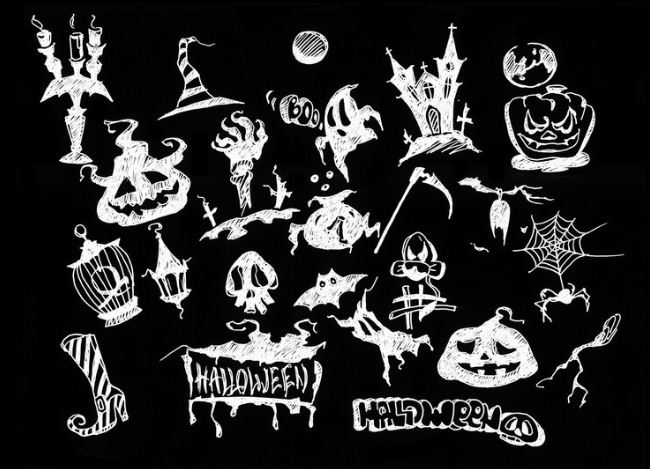

Digital Halloween doodling offers numerous advantages, such as increased flexibility and convenience. Artists can work from anywhere, carrying their digital tools with them, and easily make adjustments to their doodles as they progress. The digital format also allows for easy sharing and collaboration, fostering a vibrant and supportive online community of Halloween artists.

However, digital Halloween doodling also presents its challenges. For traditional artists transitioning to digital platforms, there can be a learning curve in mastering the software and tools. Additionally, some artists may miss the tactile experience of traditional media, such as pen and paper, which can add a unique charm to Halloween-themed art.

Furthermore, the accessibility of digital art has led to a flood of content, making it challenging for individual artists to stand out amidst the vast online landscape. Overcoming this saturation requires artists to develop a distinctive style and engage with their audience effectively.

## **Step-by-Step Halloween Doodle Tutorials**

Halloween is the perfect time to let your creativity flow with fun and simple doodle ideas. These Halloween-themed doodles are suitable for beginners and will help you get into the spirit of the holiday. Grab your pen and paper, and let’s get doodling!

### **Spooky Spider**

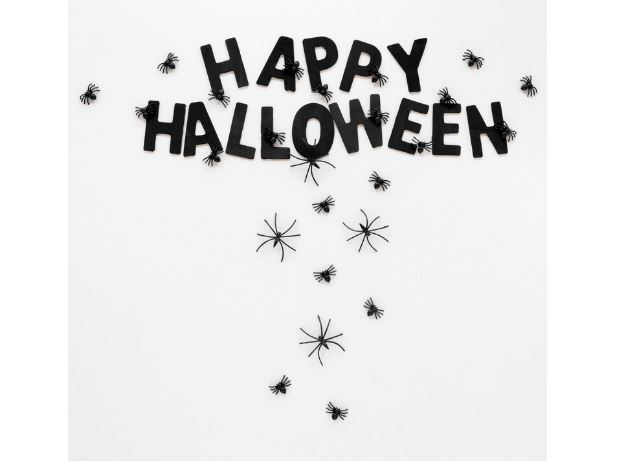

Start by drawing a small circle for the spider’s body. Add four curved lines on each side for the legs. Make sure they look slightly hairy for that spooky touch. Finish by drawing two small circles for the eyes. Voila! You have a creepy-crawly spider.

### **Cute Candy Corn**

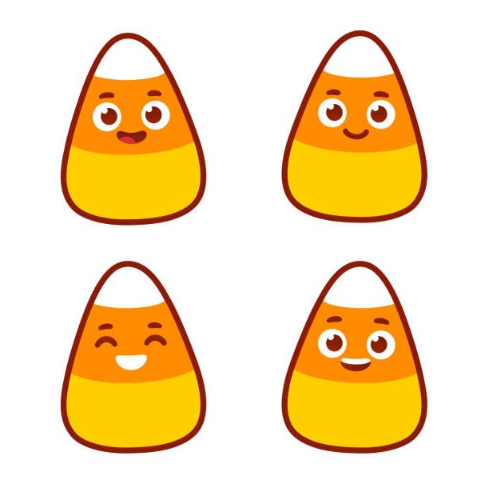

Draw a large triangle with the base at the bottom, representing the candy corn’s shape. Add two smaller triangles on top, one yellow and one white. Finally, color the bottom part orange, the middle part yellow, and the top part white. Your sweet candy corn doodle is ready.

### **Pumpkin**

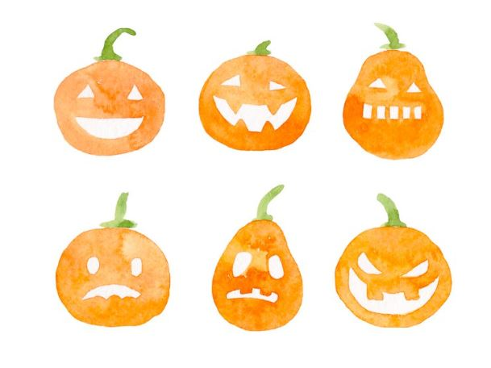

Start by drawing a medium-sized oval for the pumpkin’s body. Add a stem on top with a few curved lines for texture. Now, draw two triangles for the eyes and a crooked smile for the mouth. Complete the doodle by adding a few curved lines around the eyes and mouth to create a classic Halloween pumpkin.

### **Ghost**

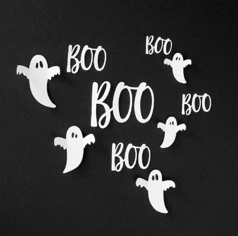

Begin by drawing a large oval for the ghost’s body. Next, add two small ovals for the eyes and a slightly larger oval for the open mouth. To give the ghost a floaty appearance, draw a wavy line at the bottom of the oval. Add some curves to the sides for a spooky touch. Your friendly ghost doodle is complete!

### **Witch’s Hat**

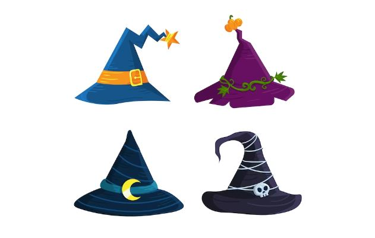

Start by drawing a tall triangle for the hat’s body. Add a wide, curved brim at the bottom, and then draw a buckle or ribbon at the base of the triangle. For extra flair, add some stars or spiderwebs around the hat. Your witch’s hat doodle is ready to cast some spells!

Doodling is not only fun but also a great way to relax and express yourself. Don’t worry about perfection—just let your imagination guide your hand. Halloween doodles are all about embracing the spooky, the cute, and the whimsical.

Remember, the beauty of doodling is that you can create endless variations of these ideas and add your unique twist to each one. Don’t be afraid to experiment with different shapes, sizes, and expressions. Whether you’re using a pen and paper or digital tools, the key is to have fun and enjoy the process.

## **Halloween Doodles for DIY Decorations**

Halloween doodles can add a delightful and personalized touch to DIY decorations for homes and parties. These hand-drawn elements infuse the spirit of the season and allow you to create unique and spooky décor. Whether you’re looking to decorate your home for a Halloween party or simply embrace the festive atmosphere, incorporating Halloween doodles can make your decorations stand out.

### **Some examples of Halloween-themed crafts and décor made with doodles**

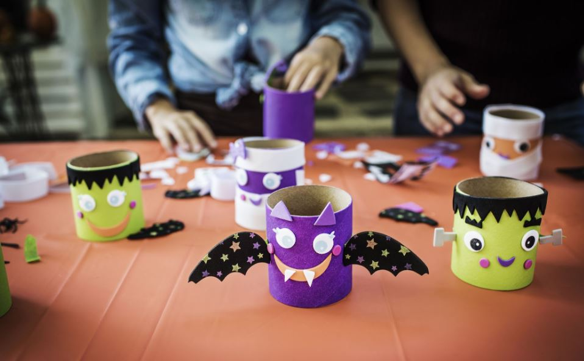

- **Spooky Window Silhouettes:** Use black paper or cardboard to cut out Halloween doodle shapes like witches flying on broomsticks, cats, bats, and haunted houses. Stick these silhouettes on your windows, creating an eerie scene when backlit at night.
- **Doodle-Decorated Pumpkins:** Instead of carving pumpkins, try drawing Halloween doodles on them with markers or paint. You can create whimsical faces, spooky scenes, or even doodle your favorite Halloween characters on the pumpkins.
- **Creepy Tablecloth**: Lay a white tablecloth on your dining table and let your creativity run wild. Use fabric markers or washable markers to doodle spiderwebs, skeletons, ghosts, and other Halloween motifs all over the tablecloth.

### **Tips and tricks for enhancing the spooky atmosphere with doodle-inspired decorations**

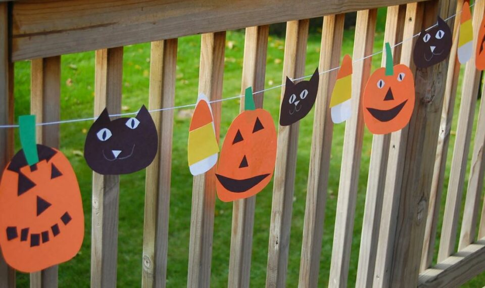

- **Experiment with Glow-in-the-Dark:** Use glow-in-the-dark markers or paint to add an extra haunting element to your Halloween doodles. When the lights go out, your doodles will come to life, creating a spine-chilling ambiance.
- **Embrace Fun Typography**: Write spooky Halloween words or phrases in fun, Halloween-inspired typography. Use these doodles to create banners, signs, and labels for your Halloween decorations.
- **Create a Halloween Doodle Garland**: Draw Halloween-themed doodles on colored paper or cardstock and cut them out. String these doodles together to create a garland that you can hang across doorways, walls, or fireplace mantels.
- **Customize Halloween Party Favors**: Doodle on favor bags, treat boxes, or gift tags to personalize your Halloween party favors. Your guests will appreciate the extra effort and thoughtfulness.
- **Involve the Whole Family:** Get everyone in on the doodling fun! Gather your family or friends for a Halloween doodle session, and let everyone contribute to the decorations. It’s a great way to bond, be creative, and add a personal touch to your Halloween celebrations.

Halloween doodles offer a fantastic opportunity to create DIY decorations that are not only fun but also unique and memorable. By incorporating doodles into various crafts and décor, you can enhance the spooky atmosphere and infuse your Halloween celebrations with your own artistic flair.

## **The World of Animated Halloween Doodles**

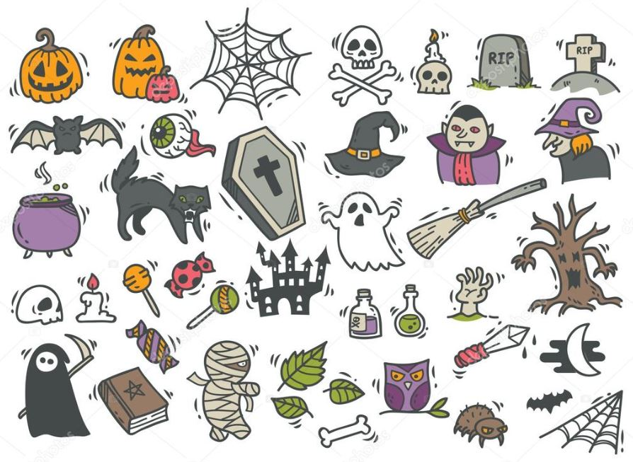

Animating Halloween doodles is a fascinating process that brings these static drawings to life, adding movement and personality to their spooky subjects. Artists use various techniques and software to create animated Halloween doodles. 

They break down the doodles into individual frames and then carefully manipulate them to create smooth and seamless animations. Through animation, artists can make ghosts float, pumpkins grin, and witches fly, giving their doodles an enchanting and eerie allure.

Captivating examples of animated Halloween doodles showcase the creativity and talent of artists who bring these festive characters to life. Imagine a mischievous black cat with glowing eyes, playfully batting at a pumpkin. Or a haunted house with flickering lights and ghostly apparitions that appear and disappear in the windows. These animated doodles mesmerize viewers with their clever use of movement and evoke the spirit of Halloween in a captivating way.

Animation adds an extra layer of fun and fright to Halloween doodles, intensifying their impact on audiences. It allows artists to create immersive and engaging experiences that go beyond static art. The motion can evoke a range of emotions, from excitement and anticipation to fear and surprise, making the animated doodles memorable and enjoyable for people of all ages.

Artists often use animated Halloween doodles for digital greetings, social media posts, and interactive websites during the Halloween season. These creations not only entertain but also offer a unique way to connect with audiences. Viewers are drawn to the charm and creativity of animated doodles, making them highly shareable and viral, spreading the Halloween spirit far and wide.

**Related:**

- Best [Easy Drawing Ideas for Kids](https://avada.io/loveable/drawing-ideas-for-kids/) of All Ages

- 23 Best [Halloween Drawing Ideas](https://avada.io/loveable/halloween-drawing-ideas/) for Kids and Beginners

## **Bottom Line**

As you embrace the magic of Halloween doodling, remember that the process is as fulfilling as the final creation. Whether you’re drawing a whimsical ghost or a sinister pumpkin, let your imagination run wild, and allow the spirit of Halloween to guide your hand. Whether you’re an experienced artist or a doodling novice, don’t be afraid to experiment and explore your unique style.

So, as the nights grow longer and the air turns chillier, let your pencils and digital tools come alive with the Halloween spirit. The art of **Halloween doodles** beckons you to venture into a world where ghosts roam, witches cackle, and pumpkins grin mischievously. Embrace the spookiness, unleash your creativity, and let your Halloween doodles cast a spell on all who lay eyes upon them. Happy Halloween doodling!

- [The History of Halloween Doodles](https://avada.io/loveable/blog/halloween-doodles/#wp-block-heading-2-4)
- [The Psychology of Halloween Doodling](https://avada.io/loveable/blog/halloween-doodles/#wp-block-heading-2-12)
- [Famous Halloween Doodles and Artists](https://avada.io/loveable/blog/halloween-doodles/#wp-block-heading-2-22)
    - [Iconic Halloween doodles](https://avada.io/loveable/blog/halloween-doodles/#wp-block-heading-3-23)
    - [Work of modern artists in Halloween-themed art](https://avada.io/loveable/blog/halloween-doodles/#wp-block-heading-3-28)
    - [How Halloween doodles have been featured](https://avada.io/loveable/blog/halloween-doodles/#wp-block-heading-3-33)
- [Halloween Doodles in the Digital Age](https://avada.io/loveable/blog/halloween-doodles/#wp-block-heading-2-39)
    - [The rise of digital art on Halloween doodling](https://avada.io/loveable/blog/halloween-doodles/#wp-block-heading-3-41)
    - [Various digital tools and software](https://avada.io/loveable/blog/halloween-doodles/#wp-block-heading-3-44)
    - [Advantages and Challenges of Digital Halloween Doodling](https://avada.io/loveable/blog/halloween-doodles/#wp-block-heading-3-49)
- [Step-by-Step Halloween Doodle Tutorials](https://avada.io/loveable/blog/halloween-doodles/#wp-block-heading-2-54)
    - [Spooky Spider](https://avada.io/loveable/blog/halloween-doodles/#wp-block-heading-3-56)
    - [Cute Candy Corn](https://avada.io/loveable/blog/halloween-doodles/#wp-block-heading-3-59)
    - [Pumpkin](https://avada.io/loveable/blog/halloween-doodles/#wp-block-heading-3-62)
    - [Ghost](https://avada.io/loveable/blog/halloween-doodles/#wp-block-heading-3-65)
    - [Witch’s Hat](https://avada.io/loveable/blog/halloween-doodles/#wp-block-heading-3-68)
- [Halloween Doodles for DIY Decorations](https://avada.io/loveable/blog/halloween-doodles/#wp-block-heading-2-73)
    - [Some examples of Halloween-themed crafts and décor made with doodles](https://avada.io/loveable/blog/halloween-doodles/#wp-block-heading-3-75)
    - [Tips and tricks for enhancing the spooky atmosphere with doodle-inspired decorations](https://avada.io/loveable/blog/halloween-doodles/#wp-block-heading-3-80)
- [The World of Animated Halloween Doodles](https://avada.io/loveable/blog/halloween-doodles/#wp-block-heading-2-88)
- [Bottom Line](https://avada.io/loveable/blog/halloween-doodles/#wp-block-heading-2-98)

### [Blake Simpson](https://avada.io/loveable/author/blake/)

Hi, I'm Blake from Loveable. I help people find perfect gifts for occasions like anniversaries and weddings. I also write a blog about holidays, sharing insights to make them more meaningful. Let's create unforgettable moments together!

- [Twitter](https://twitter.com/intent/tweet)
- [Facebook](https://www.facebook.com/sharer/sharer.php)
- [instagram](https://avada.io/loveable/blog/halloween-doodles/)
- [pinterest](https://www.pinterest.com/loveablellc/)

## Related Posts

[### 120+ Christian Birthday Wishes To Spread Your Love](https://avada.io/loveable/blog/christian-birthday-wishes/) 

[

### 35 Best 70th Birthday Ideas To Celebrate The Special Milestone

](https://avada.io/loveable/blog/70th-birthday-ideas/)

[

### 50 Best 30th Birthday Decorations for a Remarkable Birthday Bash

](https://avada.io/loveable/blog/30th-birthday-decorations/)

[

### 40 Delicious Vegan Christmas Desserts to Delight Your Palate

](https://avada.io/loveable/blog/vegan-christmas-desserts/)

[

### 60 Christmas Team Building Activities to Boost Workplace Spirit

](https://avada.io/loveable/blog/christmas-team-building-activities/)
